***

[TOC]

##  MoTAS: MoE-Guided Feature Selection from TTS-Augmented Speech for Enhanced Multimodal Alzheimer's Early Screening

| <!-- --> |
| ------------------------------------------------------------------------------------------------------------------------------------------------------------------------------------------------------------------------------------------------------------------------------------------------------------------------------------------------------------------------------------------------------------------------------------------------------------------------------------------------------------------------------------------------------------------------------------------------------------------------------------------------------------------------------------------------------------------------------------------------------------------------------------------------------------------------------------------------------------------------------------------------------------------------------------------------------------------------------------------------------------------------------------------------------------------------------------------------------------------------------------------------------------------------------------------------------------------------------------------------------------------------------------------------------- |
| **期刊: **（<u>MM '25: Proceedings of the 33rd ACM International Conference on Multimedia    </u>**ACM Multimedia **发表日期: **2025-10-27**） **作者:** Yongqi Shao; Binxin Mei; Cong Tan; Hong Huo; Tao Fang                                                                                                                                                                                                                                                                                                                                                                                                                                                                                                                                                                                                                                                                                                                                                                                                                                                                                                                                                                                              |
| **摘要: ***Early screening for Alzheimer's Disease (AD) through speech presents a promising non-invasive approach. However, challenges such as limited data and the lack of fine-grained, adaptive feature selection often hinder performance. To address these issues, we propose MoTAS, a robust framework designed to enhance AD screening efficiency. MoTAS leverages Text-to-Speech (TTS) augmentation to increase data volume and employs a Mixture of Experts (MoE) mechanism to improve multimodal feature selection, jointly enhancing model generalization. The process begins with automatic speech recognition (ASR) to obtain accurate transcriptions. TTS is then used to synthesize speech that enriches the dataset. After extracting acoustic and text embeddings, the MoE mechanism dynamically selects the most informative features, optimizing feature fusion for improved classification. Evaluated on the ADReSSo dataset, MoTAS achieves a leading accuracy of 85.71\\%, outperforming existing baselines. Ablation studies further validate the individual contributions of TTS augmentation and MoE in boosting classification performance. These findings highlight the practical value of MoTAS in real-world AD screening scenarios, particularly in data-limited settings.* |
| **摘要翻译:**                                                                                                                                                                                                                                                                                                                                                                                                                                                                                                                                                                                                                                                                                                                                                                                                                                                                                                                                                                                                                                                                                                                                                                                                                                                                                               |
| **期刊分区:CCF-A**                                                                                                                                                                                                                                                                                                                                                                                                                                                                                                                                                                                                                                                                                                                                                                                                                                                                                                                                                                                                                                                                                                                                                                                    |
| **原文PDF链接: **[Shao 等 - 2025 - MoTAS MoE-Guided Feature Selection from TTS-Augme.pdf](zotero://open-pdf/0_SW9Q4W63)                                                                                                                                                                                                                                                                                                                                                                                                                                                                                                                                                                                                                                                                                                                                                                                                                                                                                                                                                                                                                                                                                                                                                                                      |
| **笔记创建日期: **2025/11/17 13:32:17                                                                                                                                                                                                                                                                                                                                                                                                                                                                                                                                                                                                                                                                                                                                                                                                                                                                                                                                                                                                                                                                                                                                                                                                                                                                         |

### 一句话总结

利用ASR和文本到语音( TTS )增强来增加数据量，

并使用混合专家( MoE )机制来改进多模态特征选择，共同增强模型泛化性

### 思维导图

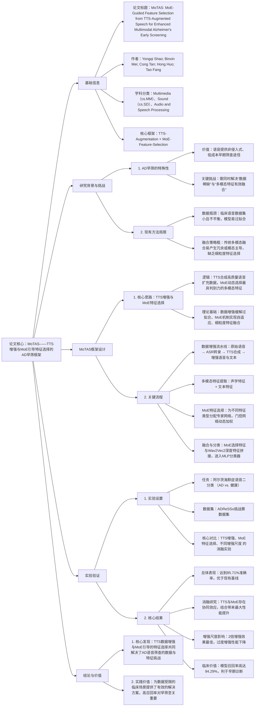

## 1️⃣ 文章基本框架

### 背景

> 阿尔兹海默症(AD)早筛→存在问题:有限的数据和缺乏细粒度、自适应的特征选择；有限的数据集可用性、次优的特征融合和高昂的计算成本

### 目的

> 提高AD筛查效率的健壮框架

### 结论

> 在ADReSSo数据集上评估，MoTAS取得了85.71 %，在计算资源受限的情况下优化多模态融合的同时增强了模型泛化性。

## 2️⃣ 结果与讨论

> 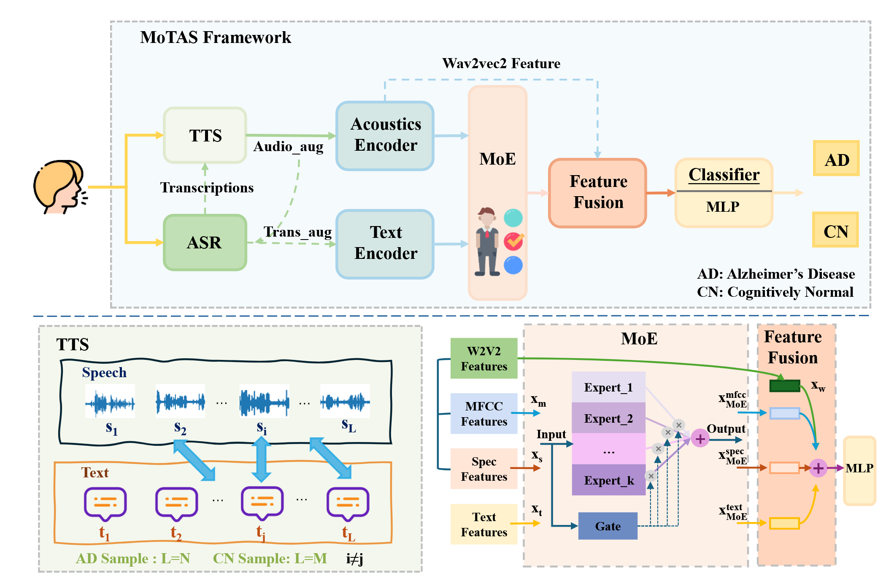

### 数据以及数据来源

AD语音数据集往往较小且不平衡，使得模型容易出现过拟合现象，限制了其泛化能力

*   →TTS数据增强

    *   这些增强与阿尔茨海默病相关的言语障碍的临床观察相一致，包括语义紊乱和语音不规范，如停顿和口吃
    *   有效的数据增强不仅要注重数量的增加，还要保证合成数据的质量。适度的增强可以提高样本多样性并缓解过拟合，而过度的增强则会对性能产生负面影响。

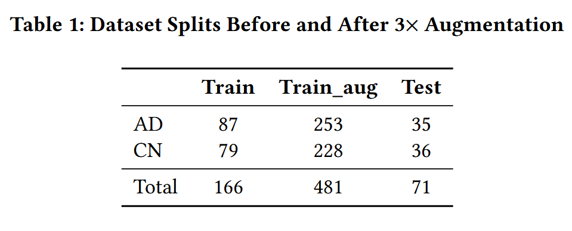

数据集来源于ADReSSo挑战赛，波士顿诊断性失语症考试

→评估不同增强尺度对模型性能的影响，我们使用扩展了1.5 ×、2 ×和2.5 ×的训练集进行了对比实验。基于验证性能选择了最优的增强比例。

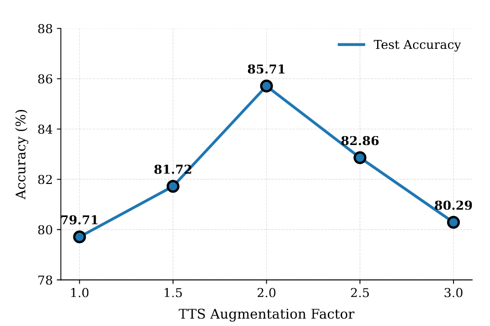

2.0之后的下降可能归因于真实样本比例的减少，导致模型过度拟合合成分布，削弱了其泛化能力。

#### 预处理

句子级时间戳标注对语音数据进行提取和切分，只保留参与者的话语。对于小于5秒的片段，保留原始内容并零填充，以满足目标时长。为了保持数据质量，剔除了无声段或无效段，包括ASR失败的段。

对Whisper ASR产生的所有转录本进一步清洗，包括将所有字符转换为小写，纠正拼写错误，并过滤掉非语言符号。对于每个清洗后的语音段，分别提取声学特征和文本特征。生成的片段在保持原有声学结构的同时保持了语言的连贯性，为后续的多模态分析提供了高质量的输入。

### 方法

利用文本到语音( TTS )增强来增加数据量，并使用混合专家( MoE )机制来改进多模态特征选择，共同增强模型泛化性

#### 数据

先ASR（语音→文本），然后TTS（合成语音）【数据增强】→语音、文本嵌入向量→选取信息量最大的特征，优化特征融合

*   用文本重新生成语音，让“声学模态”和“文本模态”自动对齐，同时起到数据增强作用。

*   ASR模型：Whisper

*   TTS模型：FishSpeech，确保生成的语音保留原始说话人的韵律、节奏和清晰度。→$S_{aug}$ 增强语音

    *   在训练过程中平衡真实样本和合成样本的比例，以防止过拟合。

*   第二轮ASR     →$T_{aug}$ 增强文本

    *   跨说话人重用文本内容（TTS中对于每个受试者，我们通过重用其他参与者的转录本来合成新的语音样本，同时保留原始说话人的声学特征）时，由于韵律和清晰度的变化，声学表达仍然依赖于说话人。ASR转写文本自然地反映了特定说话人的不流利或省略，引入了词汇变异，增强了声学和语言层面的多样性。

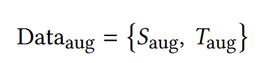

#### 编码器-特征提取

*   Wav2Vec2 提取的深层语音特征，捕捉反映语音韵律、语音和发音动态的细致入微的声学模式；
*   FMFCC 由BiLSTM建模的基于MFCC的时间动态，反映了频谱包络和短期时间结构
*   FSpec用ResNet18提取的基于语谱图的特征，捕获局部时频能量分布和韵律线索
*   而fText 使用预训练的BERT - base模型进行编码，使用\[ CLS ] token嵌入作为句子级别的表示，编码了语音的高级语义和句法模式。

声学+语言学

#### 特征选择

引入了MoE机制来动态地选择最具信息量的多模态特征，从而优化分类性能。

*   不包含Wav2Vec2成分的特征子集，因为该特征是通过预训练模型提取的，已经包含丰富的表征能力。由于它主要专注于表示声学特征，因此不需要进一步的选择。
*   另一方面，BERT提取的文本特征仍然包含有价值的语义信息，被认为对任务至关重要，因此在特征选择阶段保留下来。
*   没有自适应控制的朴素模态融合会导致冗余或模态占优。相比之下，我们框架中的MoE门控机制选择性地强调了每个输入的最有信息的特征，提高了分类平衡性和模型可解释性。
*   MoE门控机制有效地降低了不可靠的文本特征的权重，减轻了它们对最终预测的影响。重要的是，高AD召回率( 94.29 % )和F1值( 86.84 % )在临床筛查场景中特别有价值，其中减少假阴性对于早期诊断和干预至关重要。通过保持高灵敏度而不损害精度或总体精度，我们的模型有助于减轻诊断不足的风险。

专家混合( Mixture of Experts，MoE )：为不同的输入类型动态选择专门的子网络(专家)来提高模型效率；用于优化特征选择和处理，分配(<a href="zotero://select/library/items/EGJBEE3T">Shao 等, 2025</a>)不同的专家来处理韵律、语音和频谱特征，优于传统的深度学习方法。

*   →根据特征类型自适应地选择专家网络，从而实现对显著性语言和副语言线索的动态关注，增强特征选择。

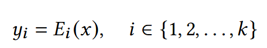

每个特征对应的专家网络。

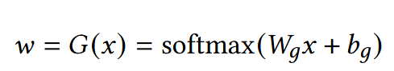

为了动态控制每个专家的贡献，使用门控网络G ( · )生成一个权重向量w∈Rk，其中每个元素wi对应专家Ei的重要性。对于每个特征类型x∈{ xm，xs，xt }，使用一个单独的门控网络来计算专家权重

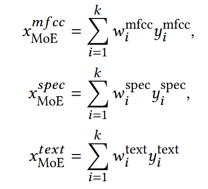最终输出针对每种特征类型分别计算

这种独立的处理保证了MoE机制有效地强调了每种类型最相关的特征

#### 特征融合与分类

结合Wav2Vec2提取的深度语音嵌入来进一步增强多模态融合。

*   MFCC、语谱图和文本特征通过模式特异性MoE机制压缩为统一表示。MoE引导的特征提供了高级的声学和语言学信息

*   Wav2Vec2嵌入以原始或时间聚合的形式保存。该方法利用了预训练模型的语音级表示学习能力，避免了不必要的转换，保持了低级声学细节的完整性。而Wav2Vec2捕获了语音和低级语音特征。

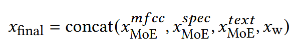

实现这些不同表示的全面融合，将MoE引导的特征与Wav2Vec2特征进行串联

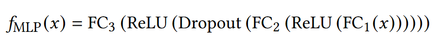

多层感知器( MLP )分类器fMLP由三个全连接层组成，具有ReLU激活和Dropout正则化，以处理融合特征之间的复杂相互作用，并防止过拟合。

→二分类结果

**损失函数**：交叉熵损失函数进行训练

#### 实验细节

PyTorch框架实现。使用Adam优化器进行训练，初始学习率为0.0067，批大小为32。采用二元交叉熵作为损失函数。为了保证结果的可靠性，每个实验重复5次，采用固定的随机种子，最后报告的性能指标为所有5次运行的平均值。

#####

### 结论

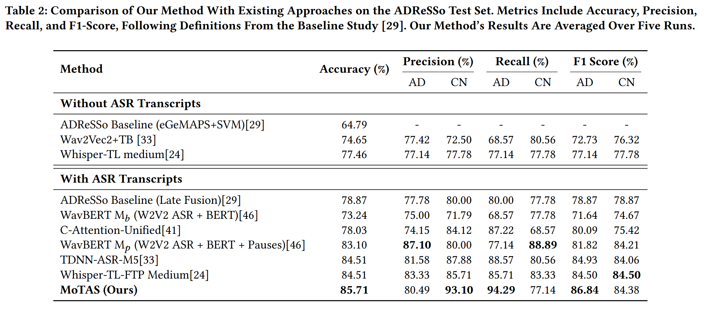\
这些增益很可能归因于多模态输入、专家多样性和MoE引导的自适应特征选择的组合优势，而不是单独的数据增强。

##### 消融研究

评估TTS增强的语音数据和MoE引导的特征选择机制在框架中的独立和协同贡献

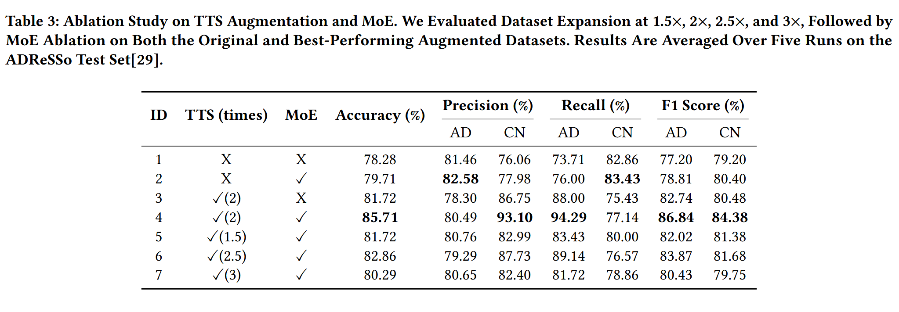

证实了TTS增强和MoE引导的特征选择的协同作用。TTS增强了数据的多样性和泛化性，而MoE提高了判别性特征的选择。两者的结合显著提高了分类的准确性和鲁棒性

#### 展望

未来的工作将探索其对跨语言和跨数据集场景的适用性，并进一步优化计算效率，以实现实时临床部署。

## 3️⃣ 文章亮点思考

> 1、本文有什么优缺点？你是否对某些内容产生了疑问？\
>
> 1. **思路清晰，逻辑闭环**：论文的“数据增强 (TTS) → 特征提取 → 特征选择 (MoE) → 融合分类” pipeline 设计得非常完整，形成了一个从数据层面到模型层面的系统性解决方案。
> 2. 将 **MoE** 用于多模态**特征选择**而非模型推理，这是一个非常亮眼的创新。它直接解决了多模态融合中“模态主导”和“特征冗余”的核心痛点。
> 3. **数据增强**：
>    - TTS增强采用了“跨说话人重用文本”的策略，既增加了多样性，又保留了原说话人的声学特征，比简单的加噪等增强方式更贴近真实应用场景。
>    - 进行了详细的**增强尺度**实验，找到了最优的增强倍数（2倍），避免了过度增强的负面效果，这为后续研究提供了宝贵的经验。
> 4. **临床价值突出**：模型**94.29%的召回率**在医学筛查场景中极具价值，因为它最大限度地减少了漏诊（假阴性），这对于阿尔茨海默症的早期干预至关重要。
>
> 2、你是否认为某些研究方式可以改进，如何改进？\
>
> 1. **TTS数据的“真实性”疑云**：
>
>    - **问题**：使用健康的、清晰的TTS系统来合成AD患者的语音，这些合成语音是否真的能模拟出AD患者典型的言语障碍（如找词困难、语法错误、韵律异常）？
>    - **质疑**：如果TTS模型本身是基于健康人数据训练的，它可能无法生成“病理级”的声学特征。这可能导致数据增强停留在表面，模型学到的可能更多是说话人无关的特征，而非AD的核心病理特征。
>    - **如何做**：可以探索**可控的、病理驱动的TTS增强**。例如，在TTS合成过程中，通过调节参数或使用特定的AD语音语料库进行微调，主动引入诸如**停顿增多、语速减慢、音调单调化**等已知的AD声学标志物。
>
> 2. **特征工程的“黑箱”复杂性**：
>
>    - **问题**：方法依赖于多种预训练模型（Wav2Vec2, BiLSTM, ResNet18, BERT）来提取特征，流程复杂。MoE门控网络的决定缺乏直观的解释。
>    - **质疑**：最终的优异性能在多大程度上依赖于这些庞大的、计算密集型的前置模型？方法的**计算效率和实时性**如何？这对于在资源受限的临床环境中部署是一个挑战。
>    - **如何做**：对MoE门控网络的决定进行事后分析。例如，使用**归因方法**分析对于最终分类决策，哪些声学特征（如F_MFCC, F_Spec）或文本词汇被赋予了更高的权重。
>
> 3. **泛化能力的证据不足**：
>
>    - **问题**：实验仅在**一个**数据集（ADReSSo）上进行。
>
>    - **质疑**：虽然在该数据集上达到了SOTA，但方法的**跨数据集、跨语言、跨方言的泛化能力**仍未可知。模型可能过拟合到了ADReSSo数据集的特定采集环境或人群分布上。
>
>    - 如何做：
>
>      **跨数据集测试**：在另一个独立的AD语音数据集（如DementiaBank）上直接测试已训练好的模型，零样本评估其泛化能力。
>
>      **跨群体验证**：在年龄、性别、教育背景、母语不同的群体中进行测试，评估模型的公平性和鲁棒性。
>
> 3、这篇文章好在哪里，只有当自己理解这篇文章好在哪里，为什么能发在顶刊上，那么你也就基本理解了全篇文章的基本内容。
>
> 1. **明确的贡献与创新性**：这是核心。论文没有简单地将现有技术堆砌，而是提出了一个**新颖的、端到端的框架**，并有两个清晰的创新点：
>    - **方法创新**：将**MoE机制创造性地应用于多模态特征选择**，这是一个非常巧妙的思路，超越了简单的特征拼接或注意力融合。
>    - **技术整合创新**：将**TTS数据增强**系统性地引入到医疗语音分析中，并设计了完整的处理流水线，为解决数据稀缺问题提供了新范式。
> 2. **严谨的实验设计与验证**：工作没有停留在“提出想法”，而是通过**充分的实验**证明了其有效性。
>    - **性能领先**：在标准数据集上达到了SOTA水平。
>    - **详尽的消融实验**：通过消融研究，清晰地剥离并证明了TTS和MoE各自以及协同的贡献，让审稿人信服其性能提升确实来自于核心创新点。
>    - **超参数分析**：对TTS增强尺度进行了分析，体现了工作的深度和工程严谨性。
> 3. **高度的应用价值与社会影响力**：选题切中了“阿尔茨海默症早期筛查”这一重大社会健康挑战。论文展示的方案具有**非侵入、低成本、可扩展**的潜力，并且其**高召回率**的特性直接满足了临床筛查的核心需求，使得这项工作不仅仅是一个学术研究，更具备了转化为实际应用的巨大潜力。

## 4️⃣ 借鉴学习（125）

> “125”原则

### 1个思路

> 首先研究通用的数据质量的提高方法以及具体参数和实施方法
>
> 对于特征选择，可以多看看方法，同时要思考该方法和应用领域自身特点的适配性

### 2个绘图

> 选取并分析文章中设计精良的图表，学习其形式和色彩搭配。

### 5个句式

> 提炼并记录文章中的五个优秀句式，并尝试在未来的写作中模仿使用。

#### 关键问题与回答

#### 问题1：MoTAS中的“MoE特征选择”机制如何具体运作以优于传统融合方法？它在提升模型临床价值（高召回率）中起到了什么作用？

**答案**：

1. **机制运作细节与优势**
   - **传统融合劣势**：直接将F_MFCC（韵律）、F_Spec（频谱）、F_Text（语义）等特征拼接，会让高维且信息密集的文本特征主导模型，淹没细微但关键的声学线索。
   - **MoE工作机制**：为F_MFCC、F_Spec、F_Text三种特征分别设立独立的“专家网络”。一个“门控网络”根据每个输入样本动态计算各专家的权重，实现**样本级别的自适应特征选择**。例如，对于一个言语不清但语义连贯的样本，门控网络会为声学专家（F_MFCC, F_Spec）分配更高权重。
   - **对比优势**：实验显示，MoE融合相比直接拼接融合，在准确率上绝对提升2.1%，且有效缓解了模态失衡。
2. **对高召回率的贡献**
   - MoE机制能更灵敏地捕捉到AD患者多样化的病理表现。即使某些患者语义信息尚可，但其声学特征（如发音模糊、韵律异常）已出现退化，MoE也能通过加权声学专家将其识别出来。
   - 这种**不遗漏任何可疑模态线索的能力**，直接导致了模型**召回率高达94.29%**。这意味着极低的漏诊率，对于需要“宁可错杀，不可错放”的早期筛查场景具有至关重要的临床价值。

#### 知识点搜集

#MoE

