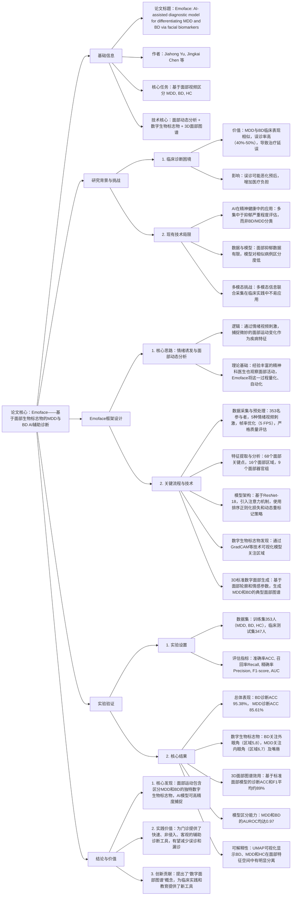
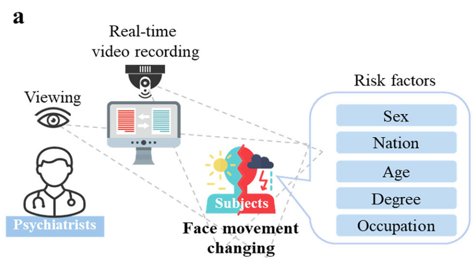
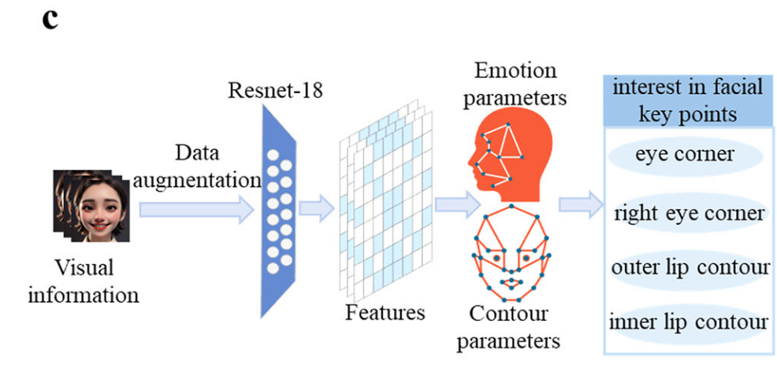
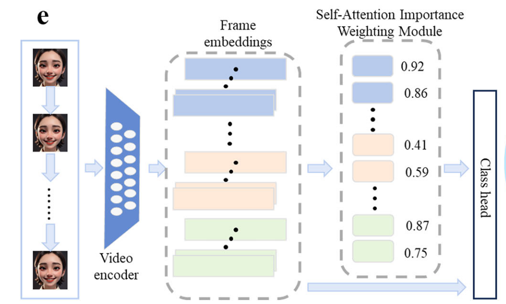
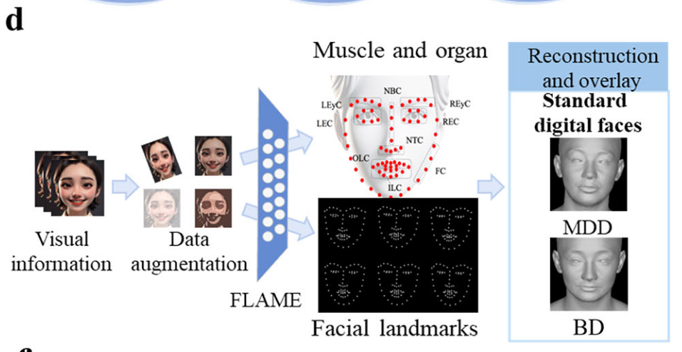
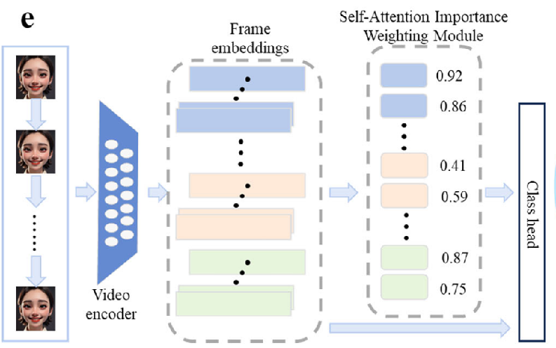
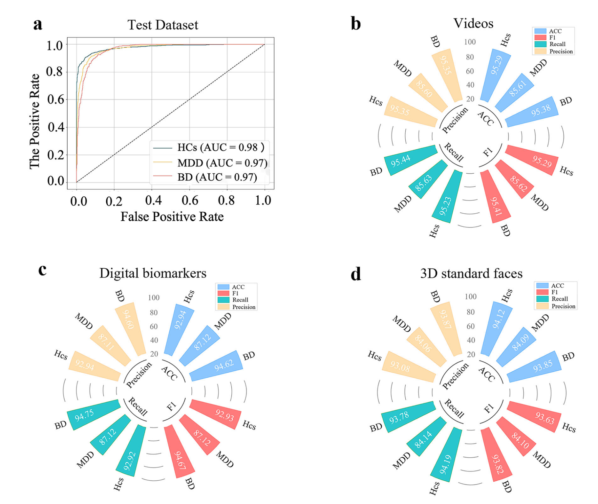
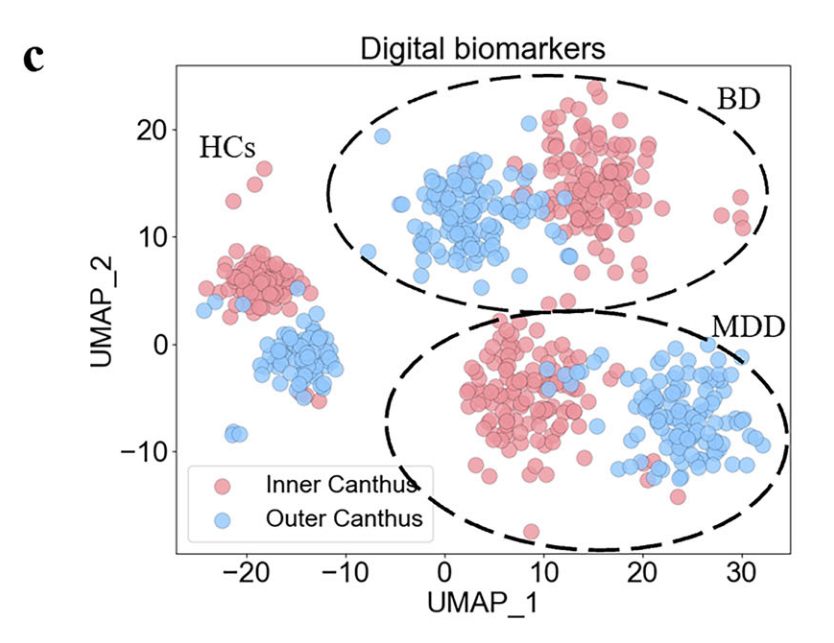

***

## (2025-10-18) Emoface: AI-assisted diagnostic model for differentiating major depressive disorder and bipolar disorder via facial biomarkers

| <!-- --> |
| ---------------------------------------------------------------------------------------------------------------------------------------------------------------------------------------------------------------------------------- |
| **期刊: npj Mental Health Research**（发表日期: **2025-10-18**） **作者:** Jiahui Yu; Jingkai Chen; Yutong Zhang; Hailong Lyu; Tianyu Ma; Huimin Huang; Zhong Wang; Xin Xu; Shaohua Hu; Yingke Xu |
| **摘要:**                                                                                                                                                                                                                            |
| **摘要翻译:**                                                                                                                                                                                                                          |
| **期刊分区:**                                                                                                                                                                                                                          |
| **原文PDF链接: **[Yu 等 - 2025 - Emoface AI-assisted diagnostic model for differentiating major depressive disorder and bipolar diso.pdf](zotero://open-pdf/0_295RUVBR)                                                                 |
| **笔记创建日期: **2025/11/17 19:13:57                                                                                                                                                                                                    |

> 一句话总结：利用情绪刺激视频诱发面部反应，通过深度学习模型分析面部关键点、区域和器官的运动，识别独特的数字生物标志物，以高精度区分双相障碍和重度抑郁症，并生成标准化的3D数字面部图谱。

### 思维导图

## 1️⃣ 文章基本框架

### 背景

> 情感障碍（MDD和BD）是全球重大公共卫生挑战。临床鉴别诊断困难，BD患者常被误诊为MDD（约40%-50%），导致治疗延误可达8-10年。传统诊断依赖结构化访谈、病史和量表，缺乏快速、客观的生物标志物。

### 目的

> 开发一种基于面部运动分析的AI辅助诊断模型（Emoface），用于快速、准确地区分MDD和BD。

### 结论

> Emoface能够通过分析情绪刺激下的面部视频，识别出区分MDD和BD的独特数字面部生物标志物，并生成标准化的3D数字面部图谱。在临床测试中，对BD和MDD的诊断准确率分别达到95.38%和85.61%，展现出巨大的临床转化潜力。

## 2️⃣ 结果与讨论

### 数据以及数据来源

由于隐私问题和时间/人力成本，基于人脸的抑郁症数据是有限的。,建立了迄今为止最大的单中心情感障碍面部运动数据集。

*   **训练集**：353名参与者（158 MDD, 128 BD, 67 HC），观看情绪诱发视频（快乐、愤怒、悲伤、恐惧、中性）前后的面部视频。
*   **临床测试集**：347名额外患者（130 BD, 132 MDD, 85 HC）用于临床验证。
*   **数据预处理**：视频帧上采样至512x512像素，帧率优化为5 FPS。经过严格质量评估，排除严重面部遮挡的图像。最终获得大量标注帧（如训练集中MDD 355.5k帧，BD 288k帧，HC 150.75k帧）。

采用情绪诱发研究方法对诊断视频数据进行分析。

### 方法

#### 模型架构 (Emoface Concept and Implementation)

Emoface框架是一个全周期循环，从原始图像采集到疾病分类。

1.  **图像处理**：增强原始数据质量和一致性。

    1.  对输入的人脸图像应用随机采样、随机水平翻转等数据增强技术，将其转换为适合模型的格式。
    2.  在训练过程中，使用秩正则化损失来增强泛化能力,对样本按权重降序排序
    3.  动态重标记策略。对于可能被错误分类的样本，根据一定次数后的预测概率和标记概率之间的差异进行重新标记。

2.  **特征提取与区域计算**：使用神经网络处理面部运动信息，生成特征图。基于ResNet-18构建，使用预训练特征提取器和自定义全连接分类器。

3.  **数字生物标志物识别与疾病分类**：整合多维数字生物标志物，通过注意力计算机制（使用线性层和Sigmoid函数）计算输出概率分布，并以此作为最终诊断决策的参数。
    1.  通过激活函数进行处理，以计算输出概率分布。对于感兴趣区域，从概率分布中得到的分数作为最终诊断决策
    
4.  **训练策略**：

    *   **数据增强**：随机采样、水平翻转。
    *   **正则化**：采用排序正则化损失，关注高置信度样本。
    *   **优化**：使用交叉熵损失，指数衰减学习率调度器，训练70个epoch。

识别每一帧中感兴趣的特征，并将其用于诊断辅助。它有效地识别疾病的多维感兴趣区域并进行维度整合，这使其具有独特的诊断过程和时间

提出概念:数字人脸映射，即基于关键面部特征重建MDD和BD患者的3D数字人脸。数字化面部以概化的形式描绘了此类患者的标准面部形态

识别/编码过程

#### 数字生物标志物发现 (Emoface helps find new visual-based digital biomarkers)

通过将面部划分为16个区域和9个器官组，利用GradCAM等技术可视化模型关注点，发现了区分MDD、BD和HC的独特模式（梯度值较高的区域集中）：

*   **BD**：模型更关注**双眼外眼角（区域5和8）**。器官层面，左眉轮廓(LEyC)、右眉轮廓(REyC)和外唇轮廓(OLC)激活显著。
*   **MDD**：模型更关注**双眼内眼角（区域6和7）**。器官层面，LEyC、REyC和内唇轮廓(ILC)是关键。
*   **HC**：激活值在多个区域（5,6,7,8,14,15）分布更均匀，反映自然多样的表情。

#### 3D标准数字面部生成 (Emoface helps generate standard feature-wide facial mapping)

利用深度学习3D面部重建模型，基于从患者面部提取的特征参数（轮廓参数、情感参数），通过加权平均计算，生成了代表MDD和BD典型面部特征的标准化3D数字面部。

*   **MDD**：强调内眼角和嘴部周围的运动。
*   **BD**：强调外眼角和嘴部周围的运动。这些数字面部图谱可用于临床参考和教育。

### 实验与结果

#### 临床诊断性能 (Emoface helps diagnose affective disorders in clinical practice)

在347名患者的临床测试中，Emoface使用不同输入方式均表现出色：

*   **面部视频分析**：性能最佳，尤其擅长识别BD（ACC: 95.38%, F1: 95.41%），MDD检测率稍低（ACC: 85.61%, F1: 85.62%），反映了BD患者更显著的面部激活模式。
*   **显式数字标志物**：对MDD分类效果最好（ACC: 87.12%, F1: 87.12%），表明显式生物标志物提取能有效捕捉抑郁更细微的面部表情。
*   **3D标准面部模型**：通过计算患者面部与标准面部的余弦相似度进行诊断，性能稳定（平均ACC和F1约89%），为无法实时视频采集的场景提供了可扩展方案。
*   **区分能力**：模型在所有三类（BD, MDD, HC）上的AUROC值均超过0.95，其中MDD和BD的AUROC均为0.97，显示出强大的区分相似病症的能力。

#### 可解释性 (Emoface improves face representations and visual interpretability)

通过UMAP对面部编码进行降维和可视化，结果显示：

*   BD、MDD和HC的面部特征在嵌入空间中形成了三个界限分明的簇。

*   基于内外眼角等主要生物标志物的诊断方法在测试集中显示出明显的分离。
*   这表明Emoface增强了情感障碍患者面部特征的表征能力，使诊断决策更具可解释性。

### 讨论与局限性

*   **优势**：Emoface专注于特定的数字面部生物标志物，提供了一种直观、动态的诊断视角，并能与传统的临床咨询相结合，在有限的门诊时间内提高诊断准确性。

*   **局限性**：

    1.  分析复杂的微表情（如快乐与惊讶结合）仍具挑战性。
    2.  当前的标准数字面部在真实感方面尚有提升空间。
    3.  研究仅使用了汉族人群的面部数据，缺乏文化多样性，表达和解读可能存在文化差异。
    4.  未来可能需要更强大的深度学习模型（如视觉基础模型）。

## 3️⃣ 文章亮点思考

> 1、本文有什么优缺点？你是否对某些内容产生了疑问？

**优点：**

1.  **问题导向，临床需求明确**：精准切中了MDD与BD鉴别诊断这一临床实践中的痛点和难点，目标明确。
2.  **数据规模与质量**：建立了当前最大的单中心情感障碍面部视频数据集，并设计了严谨的情绪诱发实验和数据预处理流程，为模型可靠性奠定了基础。
3.  **技术创新与系统性**：不仅是一个分类模型，更是一个包含生物标志物发现、可视化、3D面部图谱生成的系统性解决方案。将注意力机制、GradCAM等技术与精神病学诊断相结合，提升了模型的可解释性。
4.  **结果详实，验证充分**：在独立临床测试集上进行了验证，结果可靠。对不同诊断方式（视频、标志物、3D面部）的性能进行了细致比较，并提供了强大的AUC和可视化证据。
5.  **提出新概念**：“数字面部图谱”是一个新颖的概念，为临床教学和参考提供了直观工具，并考虑了患者隐私保护。

**疑问与思考：**

1.  **模型的泛化能力**：尽管临床测试集表现良好，但所有数据均来自单一中心（浙江大学医学院附属第一医院）和单一族群（汉族）。模型对于不同文化背景、种族、年龄段的患者表现如何？这是未来应用的关键。
2.  **“状态”与“特质”的区分**：面部表情反映的更多是当前的情绪“状态”。模型是否能有效区分由疾病“特质”导致的表情模式与由临时情绪、环境或药物影响导致的“状态”变化？
3.  \*\* comorbid conditions (共病)\*\*：如果患者同时患有其他可能影响面部表情的神经系统或精神疾病（如帕金森病、焦虑症），模型的表现会如何？

> 2、你是否认为某些研究方式可以改进，如何改进？

1.  **增强数据多样性与外部验证**：

    *   **如何做**：开展多中心合作，收集来自不同地区、不同种族和文化背景的患者数据。在完全独立的外部数据集上验证Emoface的性能，这是证明其临床实用性和泛化能力的黄金标准。

2.  **探索动态时序信息**：

    *   **问题**：当前模型处理的是采样后的视频帧（5 FPS），可能未充分利用面部运动的**精细时序动态**（如微表情的持续时间、变化速度）。
    *   **如何做**：引入能够更好捕捉时间序列信息的网络结构，如**3D CNN、LSTM或Transformer**，来建模面部表情随时间的演变过程。

3.  **与多模态信息的有限融合**：

    *   **问题**：论文提到多模态融合的挑战，但Emoface目前是纯视觉方案。
    *   **如何做**：在未来工作中，可以探索在**计算成本和临床可行性允许**的前提下，有选择地融入一两种易于获取的模态，例如**语音韵律特征**或**简短的自我报告量表分数**，看是否能进一步提升精度和鲁棒性。

> 3、这篇文章好在哪里，只有当自己理解这篇文章好在哪里，为什么能发在顶刊上，那么你也就基本理解了全篇文章的基本内容。

1.  **解决重要且困难的临床问题**：选题直指精神疾病诊断中的核心挑战——BD与MDD的鉴别诊断，具有重大的公共卫生意义和临床价值。
2.  **创新性的方法学与完整的技术路线**：不仅仅是应用一个现成的AI模型，而是构建了一个从数据采集、预处理、模型设计、生物标志物发现到可视化应用的完整技术链条。创造性地将计算机视觉中的先进技术（深度学习、注意力机制、Grad-CAM、3D重建）系统性地应用于精神健康领域。
3.  **扎实的数据基础与严谨的验证**：拥有大规模、高质量、精心设计的专用数据集，这是在医疗AI研究中非常宝贵的资产。不仅在内部数据上表现优异，还使用了独立的临床队列进行验证，增强了结果的可信度。
4.  **出色的结果与明确的临床转化潜力**：模型性能指标非常亮眼（BD准确率>95%，AUC>0.97），远超传统诊断的准确率。同时，其非侵入、快速、客观的特点，使其具备清晰的临床落地路径和巨大的社会效益。
5.  **高水平的可解释性与新概念输出**：通过生物标志物发现和可视化，赋予了AI决策过程一定的“透明度”，这对于获得临床医生的信任至关重要。提出的“数字面部图谱”概念，为领域贡献了新的工具和思路。

综上所述，这项工作因其**重要的临床意义、严谨的研究设计、创新的技术方案、出色的实验结果和明确的转化前景**，符合顶刊对原创性、先进性和影响力的要求。

## 4️⃣ 借鉴学习（125）

> “125”原则

### 1个思路

> **核心思路：通过标准化的情绪诱发实验，获取高质量的行为数据（面部视频），利用可解释的深度学习模型从中提取细微的、人眼难以察觉的“数字生物标志物”，并将其系统性地应用于解决复杂的临床分类问题。**
>
> **启示**：在面对复杂、主观性强的分类任务（如精神疾病诊断、疼痛评估）时，可以设计**标准化的刺激-反应范式**来获取**高维、客观的行为数据**。然后，利用AI模型并非简单地做“黑箱”分类，而是要**深入挖掘数据中蕴含的、具有生物学或临床意义的“标志物”**，并利用可视化等技术提升模型的可解释性和临床接受度。

### 2个绘图

> 选取并分析文章中设计精良的图表，学习其形式和色彩搭配。
>
> **图2 (Digital biomarkers of affective disorders)**：
>
> *   **形式**：采用多子图组合（a, b, c, d, e）的形式，清晰展示了从面部区域划分、器官分组，到模型注意力热图、区域/器官激活值量化的完整生物标志物发现流程。
> *   **色彩搭配**：在热图（c）和柱状图（d, e）中，使用**连续的暖色调（如红-黄）表示高激活/关注度**，**冷色调或低饱和度颜色表示低激活**，直观地对比了BD、MDD和HC的差异。图表布局紧凑，信息密度高。
>
> **图4 (Emoface diagnoses affective disorder in real-world clinical settings)**：
>
> *   **形式**：包含ROC曲线（a）和多个性能对比柱状图（b, c, d），全面展示了模型在不同输入条件下的综合性能。
> *   **色彩搭配**：在柱状图中，使用**不同的颜色（或同一颜色的不同深浅）来区分BD、MDD和HC**，并清晰标注了具体数值，便于读者精确比较。ROC曲线也使用不同颜色和线型区分类别，图例明确。

### 5个句式

> 提炼并记录文章中的五个优秀句式，并尝试在未来的写作中模仿使用。

1.  **用于引出研究背景和必要性**：> "Due to similar clinical presentations and a lack of rapid diagnostic biomarkers, BD patients who have experienced depressive episodes are often misdiagnosed as having MDD..., resulting in significant delays in receiving appropriate treatment..."
    >
    > *   **模仿点**：`Due to [存在的问题]，[目标对象] often [面临的负面后果]， resulting in [更广泛的影响]`。用于清晰阐述研究动机。

2.  **用于陈述研究核心贡献**：> "Here, we propose \[模型名称], an AI-assisted diagnostic model that \[模型的核心功能]. By analyzing \[数据类型], \[模型名称] identified unique \[生物标志物类型] distinguishing \[类别A] from \[类别B]."
    >
    > *   **模仿点**：句式清晰，直接点明模型名称、类型、核心功能和关键发现。

3.  **用于描述方法流程**：> "The \[框架名称] framework operates in a full-cycle loop, starting from \[起点], progressing to \[中间步骤], and culminating in \[最终目标]."
    >
    > *   **模仿点**：`operates in a full-cycle loop, starting from..., progressing to..., and culminating in...` 用于概括性地描述一个完整的流程或系统工作方式。

4.  **用于展示实验结果**：> "The results demonstrate that \[模型名称] achieved robust diagnosis by analyzing \[数据源], particularly excelling in identifying \[某项困难任务]..."
    >
    > *   **模仿点**：`achieved robust... by analyzing..., particularly excelling in...` 用于强调模型在某方面的卓越性能。

5.  **用于讨论局限性并展望未来**：> "First, \[局限性1]... We anticipate that \[解决方案1] will effectively mitigate this issue. Additionally, \[局限性2]... Expanding \[改进方向] will enhance \[预期效果]."
    >
    > *   **模仿点**：清晰地分点（First, Additionally）列出局限性，并对每个局限性都提出具体的、积极的解决方案或未来方向，而不是简单地陈述问题。
