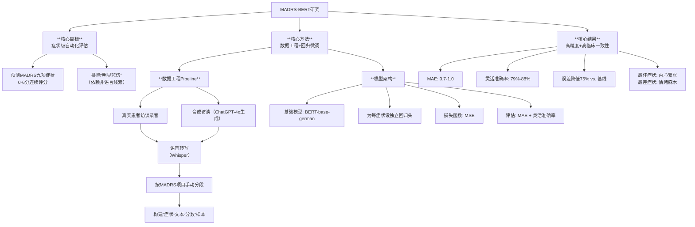
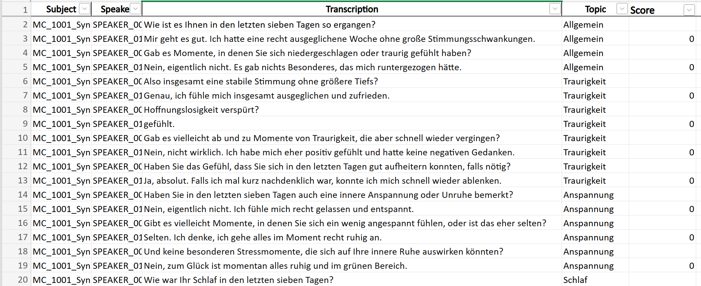
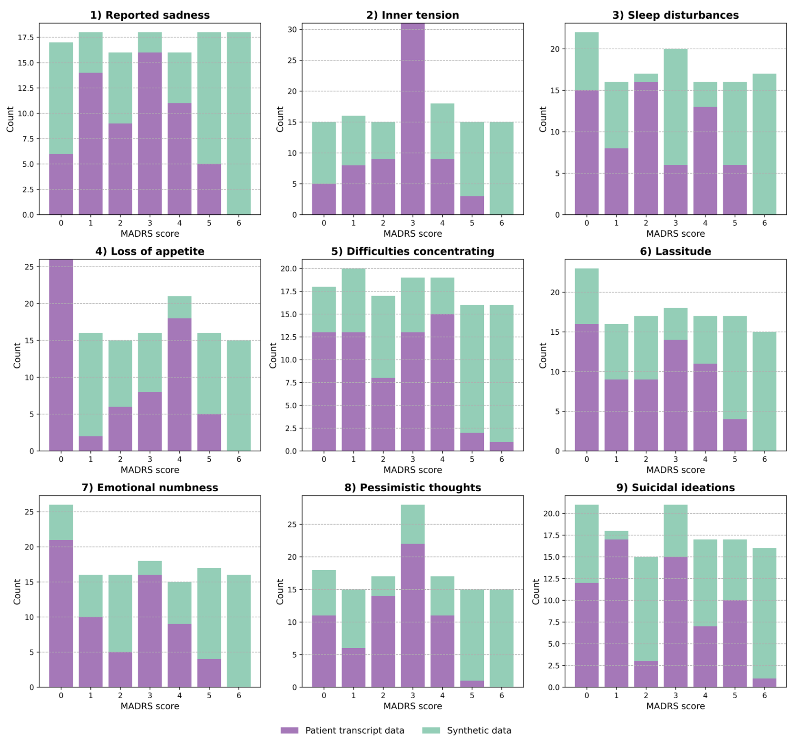
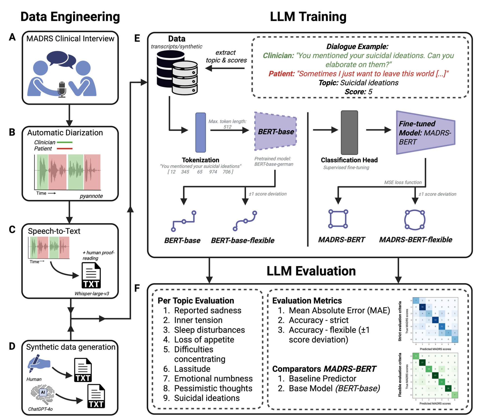
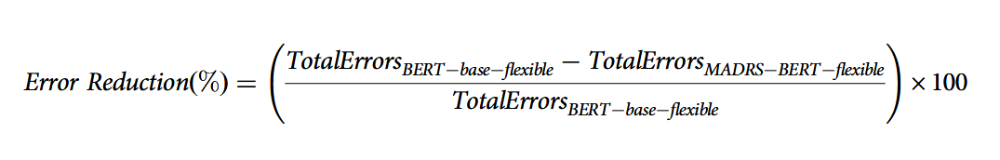
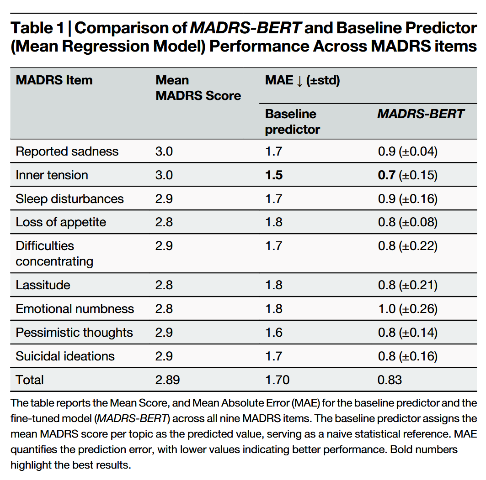
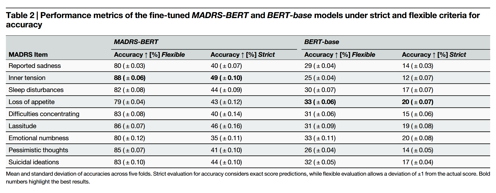
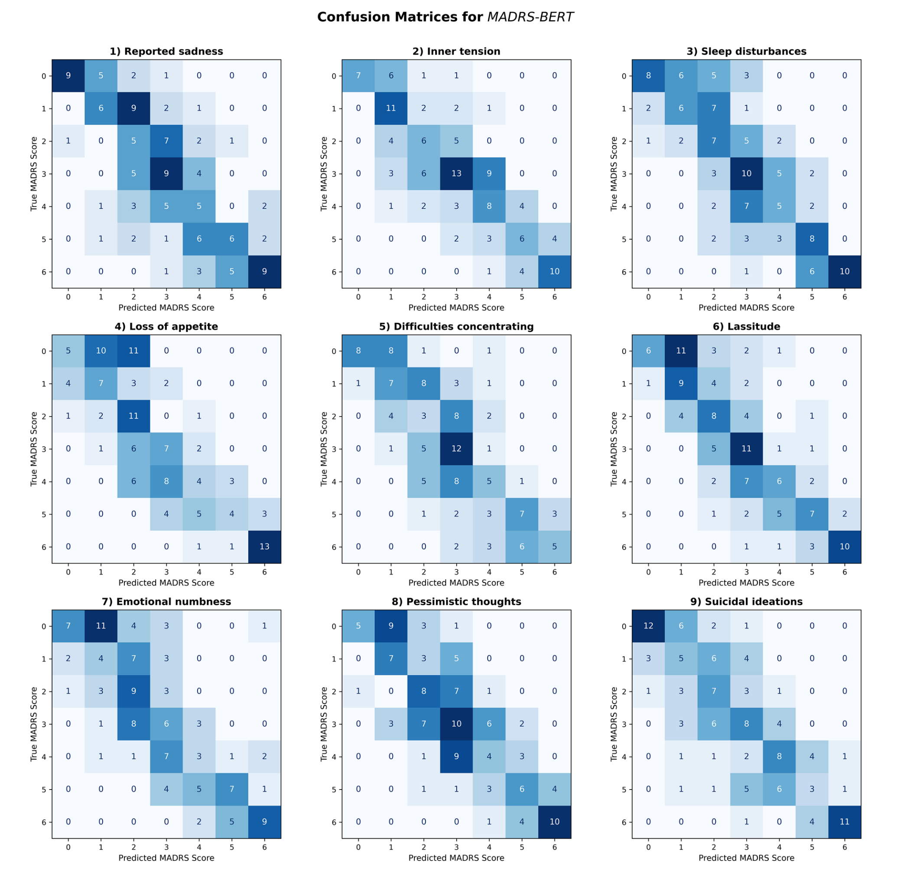
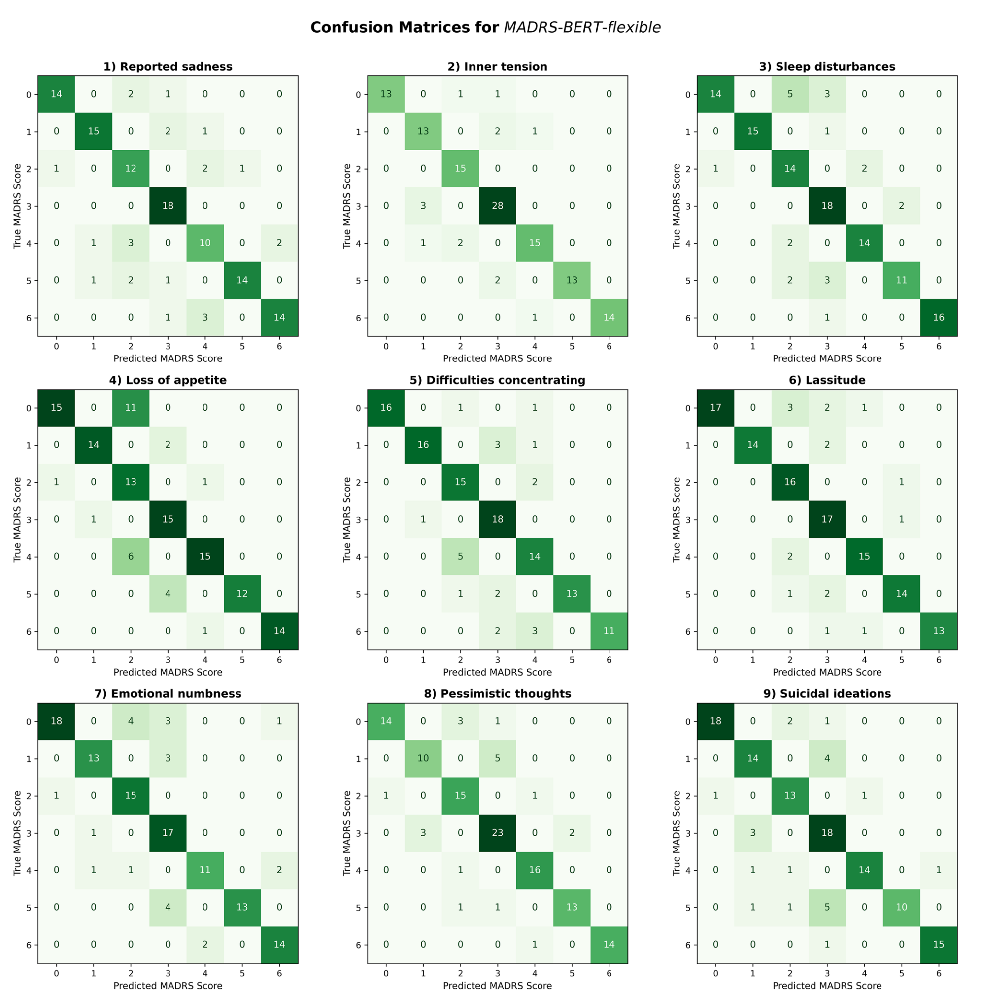
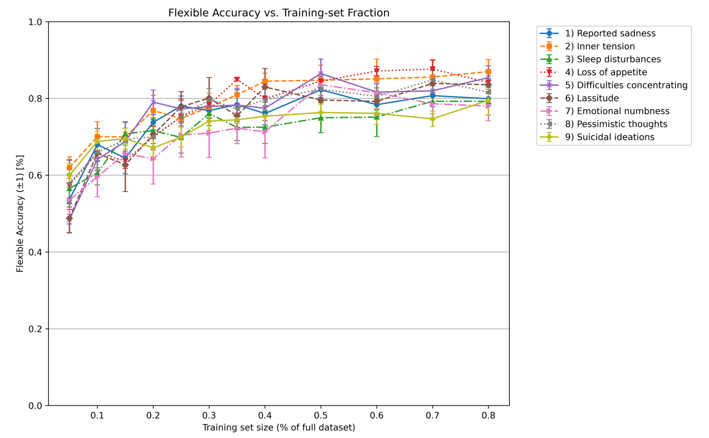

***

## (2025-10-07) Using a fine-tuned large language model for symptom-based depression evaluation

| <!-- --> |
| ------------------------------------------------------------------------------------------------------------------------------------------------------------------------------------------------------------------------------------------------------------------------------------------------------------------------------------------------------------------------------------------------------------------------------------------------------------------------------------------------------------------------------------------------------------------------------------------------------------------------------------------------------------------------------------------------------------------------------------------------------------------------------------------------------------------------------------------------------------------------------------------------------------------------------------------------------------------------------------------------------------------------------------------------------------------------ |
| **期刊: npj Digital Medicine**（发表日期: **2025-10-07**） **作者:** Samantha Weber; Nicolas Deperrois; Robert Heun; Laura Frühschütz; Anna Monn; Stephanie Homan; Andrea Häfliger; Erich Seifritz; Tobias Kowatsch; MULTICAST consortium; Lena Jäger; Katharina Schultebraucks; Sapir Gershov; Jacopo Mocellin; Birgit Kleim; Sebastian Olbrich                                                                                                                                                                                                                                                                                                                                                                                                                                                                                                                                                                                                                                                                                        |
| **摘要: ***Abstract Recent advances in artificial intelligence, particularly large language models (LLMs), show promise for mental health applications, including the automated detection of depressive symptoms from natural language. We fine-tuned a German BERT-based LLM to predict individual Montgomery-Åsberg Depression Rating Scale (MADRS) scores using a regression approach across different symptom items (0–6 severity scale), based on structured clinical interviews with transdiagnostic patients as well as synthetically generated interviews. The fine-tuned model achieved a mean absolute error of 0.7–1.0 across items, with accuracies ranging from 79 to 88%, closely matching clinician ratings. Fine-tuning resulted in a 75% reduction in prediction errors relative to the untrained model. These findings demonstrate the potential of lightweight LLMs to accurately assess depressive symptom severity, offering a scalable tool for clinical decision-making, and monitoring treatment progress, particularly in low-resource settings.* |
| **摘要翻译:**                                                                                                                                                                                                                                                                                                                                                                                                                                                                                                                                                                                                                                                                                                                                                                                                                                                                                                                                                                                                                                                                |
| **期刊分区:**                                                                                                                                                                                                                                                                                                                                                                                                                                                                                                                                                                                                                                                                                                                                                                                                                                                                                                                                                                                                                                                                |
| **原文PDF链接: **[Weber 等 - 2025 - Using a fine-tuned large language model for symptom-based depression evaluation.pdf](zotero://open-pdf/0_GG46G6M9)                                                                                                                                                                                                                                                                                                                                                                                                                                                                                                                                                                                                                                                                                                                                                                                                                                                                                                                        |
| **笔记创建日期: **2025/12/7 16:55:25                                                                                                                                                                                                                                                                                                                                                                                                                                                                                                                                                                                                                                                                                                                                                                                                                                                                                                                                                                                                                                           |

> 一句话总结：通过微调德语BERT模型，成功实现了基于访谈文本的抑郁症核心症状**项目级、连续评分**的自动化评估

项目代码：[webersamantha/MADRS-BERT](https://github.com/webersamantha/MADRS-BERT)

模型代码: <https://huggingface.co/webesama/MADRS-BERT>

### 思维导图

## 1️⃣ 论文试图解决什么问题？(What is the problem?)

### 背景

> *   **问题**：临床评估（如MADRS）依赖耗时、主观的结构化访谈。
>
> *   **机遇**：大型语言模型（LLM）在自然语言理解上取得突破，为自动化精神健康评估带来可能。
>
> *   **挑战**：现有研究多关注整体风险分类或总分预测，缺乏对**具体症状严重程度**的细粒度、连续评估。

### 框架

> 开发并验证一个基于LLM的轻量级框架（MADRS-BERT），能够从临床访谈的**自由叙述文本**中，**自动化、准确地预测MADRS各项症状的连续评分**

### 结论

> 该方法证明了**轻量级LLM经过特定领域微调后，可作为可靠、可扩展的临床辅助工具**，用于抑郁症状的评估与监测，特别适合资源有限的环境。

## 2️⃣核心思想/创新点是什么？(What is the core idea?)

使用MADRS量表在结构化临床访谈的背景下探讨了LLMs的使用，更细粒度的症状级别预测
采用了基于回归模型的连续评分框架，并使用临床可解释的度量指标MAE来评估模型性能。这两种方法都强调了超越二分类的临床相关性，以进行更细致入微的症状级别评估。

采用了生成访谈来补充代表性不足的MADRS的策略

将灵活性整合到模型的预测中，弥补了严格的数据驱动分析与真实世界临床实践之间的差距，允许模型a ± 1的偏差，增强了模型的临床适用性，但也引入了临床显著性错误分类的风险，这是我们在解释模型性能时必须考虑的。

## 3️⃣方法是怎么实现的？(How does it work?)

### 数据以及数据来源

**数据集：**MADRS（<a href="zotero://open/library/items/GG46G6M9?page=1">“Montgomery-Åsberg Depression Rating Scale”</a> (<a href="zotero://select/library/items/4VTFPXU2">Weber 等, 2025, p. 1</a>)临床访谈【结构化的临床访谈，由临床医生询问代表抑郁症核心症状的10个不同条目】（12）

MADRS包括0项：明显悲伤，1项：报告悲伤；2：内心紧张，3：睡眠障碍，4：食欲不振，5：注意力难以集中，6：神疲乏力，7：情绪麻木，8：悲观想法，9：自杀意念。鼓励患者以叙事的形式自由应对

评分是独立分配的，并在访谈后立即进行讨论。 如果在个人评分上出现超过1分的分歧或在总分上出现超过4分的分歧，则决定进行共识评分。这些共识评分被用于模型训练和评估。为了进一步分析，第一项( ' 0 :明显的悲伤')被排除，因为它的得分是不依赖于语言的（依赖于面部表情、肢体语言、姿势等）。

（1.**真实数据**：65名跨诊断患者的德语/瑞士德语MADRS访谈录音，21名研究对象参与了2次访谈，作为出院后4 ~ 5周的随访访谈。

2.**合成数据**：61个由研究人员和ChatGPT-4o生成并修订的合成访谈文本，用于**平衡**真实数据中罕见的评分分布。）

**数据处理：**说话人的自动分离

**数据构成：**

①whisper-large-v3加人工，语音转文本

②合成数据生成（synthetic data):为了解释不平衡的分数分布，包括九个项目的分数不足,进一步进行了访谈。允许每个分数和项目至少进行15次访谈。为了评估真实数据和合成数据之间的相似性，我们使用了余弦相似度(补充材料)。

*   **预处理流程（核心工程价值）**：

    1.  **音频处理**：提取音频 → 说话人分割（Pyannote）→ 语音转写（Whisper-large-v3）并人工校对。

    2.  **关键步骤**：根据MADRS访谈结构，**手动将转录文本按10个症状项目分段**。每个数据样本 = `[患者针对某症状的叙述文本]` + `[该症状的临床评分（0-6）]`。

    3.  **排除项**：排除第1项“明显悲伤”，因其评分依赖非语言线索。

*   **最终数据集**：1242个**症状级样本**，涵盖9个症状项目。

<a href="zotero://open/library/items/GG46G6M9?page=8">“The audio was extracted from the video recordings using Python with moviepy libraries. To ensure consistency across recordings, the audio was subsequently processed using pydub to standardize to a single channel, reducing variability and ensuring compatibility with subsequent analysis workflow. We then performed speaker diarization to segment the audio into hypothesized sequences of the individual speakers within each interview using a pre-trained pipeline from pyannote.audio version 3.1(https:// huggingface.co/pyannote/speaker-diarization-3.1) with default parameter settings. Segmenting the audio file based on speaker turns allowed the identification of individual speakers across the recordings. Then, each diarized segment was transcribed subsequently using Whisper-large-v3 (OpenAI; https://huggingface.co/openai/whisper-large-v3), which has been proven to be a viable speech recognition system for the Swiss German language41. This method allowed for the automated reconstruction of the interviews in a structured dialog format, distinguishing between clinician and patient contributions. Filler and non-lexical words occurring naturally in spontaneous speech (e.g., “mmh”) were filtered out from the transcriptions. Given the challenges posed by Swiss German dialect variations and technical limitations of the diarization and automatic speech recognition, each transcription was then manually reviewed and corrected where necessary. Following transcription, interviews were manually segmented by item, based on the structure of the MADRS interview. For each item, the corresponding segment - comprising the relevant question and the patient’s response - was isolated and annotated. This manual segmentation ensured that each data sample used in later modeling corresponded precisely to one MADRS item. Lastly, each item-specific segment was then paired with its corresponding numeric score (0–6), based on the prior clinical rating by the trained interviewers.”</a> (<a href="zotero://select/library/items/4VTFPXU2">Weber 等, 2025, p. 8</a>) 使用Python和filmpy库从视频录像中提取音频。为了确保录音的一致性，随后使用pydub对音频进行处理，以标准化到单通道，减少可变性，并确保与后续分析工作流程的兼容性。然后，我们使用从pyannote . audio version 3中预训练的管道进行说话人切分，将音频切分为每个访谈中单个说话人的假设序列。1( https : / / huggingface.co / pyannote / speaker-diarization-3 . 1 )，默认参数设置。根据说话人的话轮对音频文件进行切分，允许在录音中识别个别说话人。 然后，使用Whisper - large - v3 ( Open AI ; https\://huggingface.co / openai / whisper-large-v3)对每个被切分的片段进行转录。Whisper - large - v3 ( Open AI ; https\://huggingface.co / openai / whisper-large-v3)已被证明是瑞士德语41的可行语音识别系统。该方法允许以结构化对话框的形式自动重建访谈，区分临床医生和患者的贡献。从转录本中过滤出自然发生在自发语音( e.g. , ' mmh ')中的填充词和非词汇词。考虑到瑞士德语方言变异带来的挑战，以及数字化和自动语音识别的技术限制，每个转录本都经过了人工审核，并在必要时进行了校正。 在转录之后，根据MADRS访谈的结构，对访谈进行逐项手动分割。对于每个条目，相应的部分- -包括相关的问题和患者的反应- -被分离和注释。这种手动分段的方式保证了后期建模所用的每个数据样本都精确对应一个MADRS项。最后，由经过培训的调查员根据先前的临床评分，将每个项目特定的片段与相应的数字评分( 0 \~ 6 )进行配对。

### 方法

#### 架构: (例如：网络结构图)

*   **模型**：基于`BERT-base-german-cased`微调。

*   **任务**：**回归任务**。为每个症状项目设置一个独立的线性回归输出头，预测0-6的连续值。该架构使模型能够在跨条目共享语境语言知识的同时，专门从事各个症状维度的评分。 每个模型的输入是单个项目特定的部分，与先前分配的项目特定评分配对。

*   **训练**：五折交叉验证。优化目标为均方误差（MSE）。

*   **评估指标**：

    *   **主要**：平均绝对误差（MAE）。

    *   **准确率**：分“严格”（预测分完全匹配）和“灵活”（预测分在真实分±1范围内即正确）。

#### 算法流程: (例如：伪代码)

#### 关键公式

### 结论

1.  **高性能**：模型在9个项目上的MAE范围为0.7（“内心紧张”）至1.0（“情绪麻木”）。灵活准确率达79%-88%。

2.  **显著提升**：相比仅预测平均分的基线模型，MAE平均降低0.9分。相比未微调的BERT-base模型（仅预测0分），**错误总数减少75%**。

3.  **症状差异**：“内心紧张”预测最佳，“情绪麻木”和“食欲减退”预测相对更具挑战性。

4.  **数据规模效应**：学习曲线显示，性能在训练数据量达到50-80%时趋于饱和。

## 4️⃣ 效果如何？(How is the performance?)

### 实验设置:

①比较了微调模型( MADRS-BERT )与均值回归模型(基线预测)的回归性能

均值回归模型将每个主题的平均MADRS评分作为预测值，并根据真实标签和人工选择的预测值进一步计算MAE，不包含语言理解，仅依赖于基于数据分布的统计趋势，而不是有意义的语言模式

②比较了微调模型( MADRS-BERT )与基准模型（BERT-base，无特定任务微调)的性能【混淆矩阵、误差分析：比较基模型和微调模型做出的错误预测的数量。通过比较基模型的总误差与微调模型的总误差来计算误差减少百分比，以量化微调模型实现的误分类减少百分比。】

③数据可得性对模型性能的影响

在整个数据集( 5 % \~ 80 %)的不断增加的分数上训练模型，并在固定的外部验证集( 20 % )上进行评估。

每个子集用于微调一个单独的模型，该模型在相应倍数的相同固定验证集上进行评估。

④最后，只使用真实数据进行了完整的实验，以评估模型仅对真实临床材料的泛化能力，而不依赖于合成数据增强

### 主要结果:

①微调后的模型MAE在0.7到1.0，比均值回归模型平均提高0.9

②在灵活的评估标准下，MADRS - BERT的9个项目的准确性在79 %至88 %之间。正如预期的那样，基础模型在所有项目和分数(附图4 - 5)中都专属预测了0的分数，这表明该任务完全缺乏特异性，即无法区分不同程度的症状严重程度。

**混淆矩阵**

描绘了在严格和灵活的标准下微调模型( MADRS-BERT )对应的混淆矩阵，沿着对角线显示出清晰的分布，表明基于语言数据(见附图。4 - 5为BERT - base的混淆矩阵)区分不同症状严重程度的能力。每个矩阵反映了在项目水平(即每个文本段对应一个特定的MADRS项)的模型预测，从交叉验证中汇总了所有5个验证集。

对角线条目表示正确分类的实例，而非对角线条目表示错误。

MADRS - BERT在所有9个项目中均取得了较高的预测准确性，在捕获项目特定严重程度方面显著优于基线模型。

**错误分析**

微调后的模型显著优于基准模型。通过关注对角线(柔性模型评价)以外的± 1范围内的误差，对模型进行微调，得到总体75个。38 %的误差相比于基础模型降低了30 .29 %，符合严格的评价标准。**在灵活的评价标准下，项目"内在紧张度"的预测误差最小。相反，错误率最高的项目出现在"食欲不振"。在严格的评价标准下，"内心紧张"项的错误率最低，"情绪麻木"项的错误率最高。**

③训练数据集大小

如图所示，柔性精度的学习曲线表现出快速的性能提升，约为数据的50 % \~ 80 %，之后达到瓶颈（24）。这种趋势表明模型可以从初始训练数据中有效地学习，但进一步的增益可能需要更多的数据或架构调整。

### Ablation Study (消融实验):

## 5.有什么优点和缺点？(What are the strengths and weaknesses?)

### 优点: 连续回归预测（24）+MAE可解释性指标+学习曲线分析（24）+轻量模型（25）+合成的临床文本（26）

*   **与以往研究对比**：不同于预测总分或二分类的研究，本工作首次实现了MADRS**项目级、连续评分**的预测，提供了更精细、更符合临床实践的评估维度。

*   **临床价值**：模型输出是可解释的**症状剖面图**，便于跟踪特定症状在治疗中的变化，支持个性化诊疗。

*   **研究设计精巧且务实**：“症状级建模”+“连续回归”的定位极其清晰，直击临床痛点。**数据工程流程（分段、合成）** 详细、可复现，是解决实际数据问题的优秀范例。

*   **评估指标临床贴合度高**：引入“灵活准确率（±1分）”是点睛之笔，巧妙地将临床评分中可接受的主观差异纳入模型评估，使结果更具现实意义。

*   **分析深入**：不仅汇报整体性能，还进行了详尽的错误分析（各症状误差对比）、消融研究（对比基线、未微调模型）和数据规模分析。

### 缺点:

*   纯文本模型，无法处理非语言信息（如语调、表情）。
*   样本量有限，合成数据可能引入偏差。
*   同患者多次访谈被视为独立样本，可能轻微影响泛化能力评估。 
*   模型在德语文化背景下开发，泛化性需验证。
*   1.  **合成数据的“真实性”**：用通用LLM（ChatGPT）生成的精神科访谈文本，是否真的能模拟抑郁患者特有的思维模式、语言逻辑和情感表达？这可能会限制模型对某些深层语言特征的学习。

    2.  **“文本纯净度”假设**：研究完全过滤了非语言信息和填充词。然而，这些副语言特征（如停顿、犹豫）本身可能就是抑郁的症状表现。完全剥离是否丢失了有价值的信息？

    3.  **泛化性的“硬伤”**：作为一篇方法学验证论文，仅在单一语言、单中心、小样本数据上验证，是主要弱点。审稿人必然会问：在其他语言、文化、医疗体系中效果如何？

改进：

1.  **迈向多模态**：最直接的改进就是纳入**语音特征**。这正是你的研究方向。可以构建一个并行的“MADRS-VOICE”模型，使用相同的症状级标签，预测相同的分数。然后与文本模型（MADRS-BERT）对比，分析**哪些症状更多由语音表征，哪些更多由文本内容表征**，最终进行早期或晚期融合。

2.  **改进合成数据生成**：可以探索**条件化合成**。即训练一个可控文本生成模型，使其能根据指定的症状类型和严重程度分数，生成更逼真、更具病理特征的患者叙述。

3.  **增强可解释性**：在模型预测时，可以结合**归因分析**（如注意力权重、集成梯度），高亮出对预测分数贡献最大的文本片段，为临床医生提供“AI的判断依据”，增加信任度。

## 6.借鉴学习（125）

> “125”原则

### 1个思路

> **“以临床任务定义驱动技术设计”**。不要从“我有一个厉害的语音模型”出发，而应从“临床医生如何评估抑郁症？他们需要什么信息？”出发。本文完美示范了如何将临床评估量表（MADRS）拆解为机器学习任务。你的语音研究可以完全沿用此框架：输入变为“针对某症状的**语音片段**”，输出仍为“该症状的**0-6分**”。

### 2个绘图

> 1.  **图1（工作流程图）**：采用清晰的横向流程图，将复杂的“数据工程→模型训练→评估”流程可视化，模块分明，箭头指向明确，颜色区分不同阶段。**可借鉴其逻辑层次感**。
>
> 2.  **图2（数据分布图）**：使用并排的小提琴图或堆叠条形图，直观对比了真实数据和合成数据在不同症状、不同分数上的分布差异。**可借鉴其用可视化讲故事的能力**，未来你的语音特征分布也可以用类似形式展现。

### 5个句式

> 提炼并记录文章中的五个优秀句式，并尝试在未来的写作中模仿使用。

## 7.关键术语 (Key Terms)

### Term1:

### Term2:

## 启发

PHQ-9存在二元缺陷，并且将自由文本输入映射到PHQ - 9得分- -与人类评分仅显示出中等程度的一致性和不一致的逐项表现（19，20）

<a href="zotero://open/library/items/GG46G6M9?page=6">“previous work has highlighted the role of prosodic, spectral, and voice-quality cues in improving model performance”</a> (<a href="zotero://select/library/items/4VTFPXU2">Weber 等, 2025, p. 6</a>) 先前的工作已经强调了韵律、频谱和语音质量线索在提高模型性能方面的作用。（23）

RAG从电子健康记录中的情境化患者数据来支撑模型输出来支持精神科决策，结合个体化语境扩充LLMs可以在不牺牲可解释性的前提下增强临床相关性。

<a href="zotero://open/library/items/GG46G6M9?page=7">“Likewise, incorporating free-text rationales alongside item-level predictions has been proposed as a way to increase transparency and model robustness, offering clinicians insight into how scores are derived34.”</a> (<a href="zotero://select/library/items/4VTFPXU2">Weber 等, 2025, p. 7</a>) 同样地，将自由文本理论与项目水平预测相结合，作为增加透明度和模型鲁棒性的一种方法，为临床医生提供了如何得出分数的见解。34 .

探索平衡自动化和人类监督的混合系统，同时继续评估不同临床人群的可解释性和安全性。
