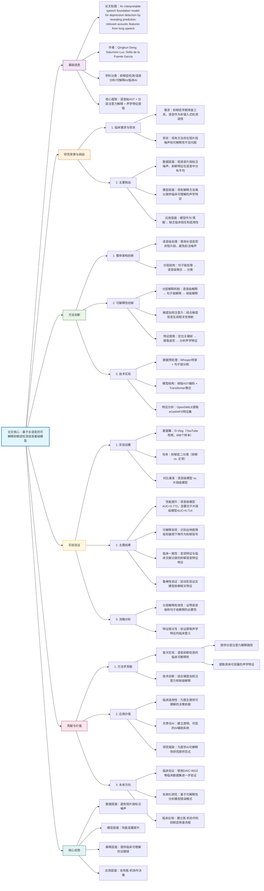
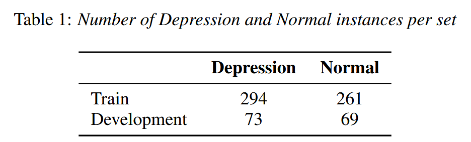
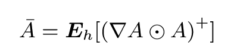
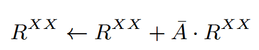
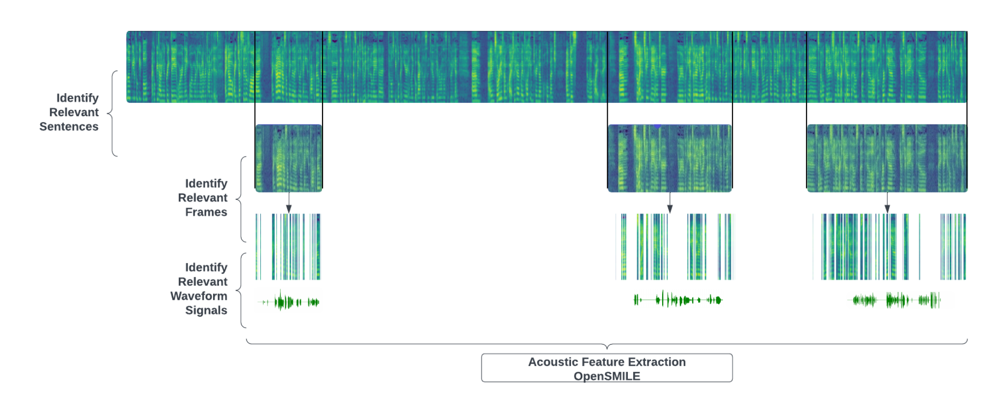
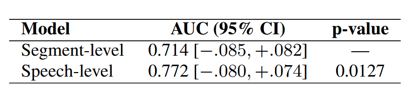
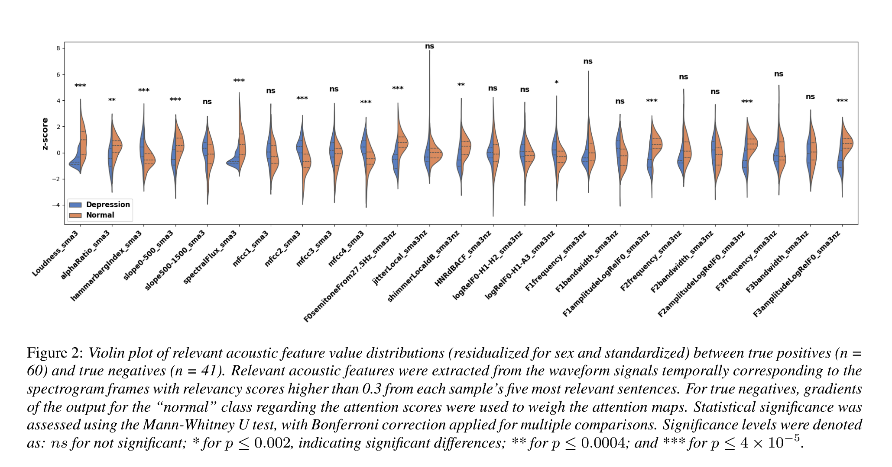

***

## <span style="color: rgb(230, 81, 0)"><span style="background-color: rgb(255, 248, 225)">(2025-8-17) An interpretable speech foundation model for depression detection by revealing prediction-relevant acoustic features from long speech</span></span>

| <!-- --> |
| --------------------------------------------------------------------------------------------------------------------------------------------------------------------- |
| **期刊: **（发表日期: **2025-8-17**） **作者:** Qingkun Deng; Saturnino Luz; Sofia De La Fuente Garcia                                                                          |
| **摘要:**                                                                                                                                                               |
| **摘要翻译:**                                                                                                                                                             |
| **期刊分区:**                                                                                                                                                             |
| **原文PDF链接: **[Deng 等 - 2025 - An interpretable speech foundation model for depression detection by revealing prediction-relevant a.pdf](zotero://open-pdf/0_DG3NJD59) |
| **笔记创建日期: **2025/12/1 20:45:10                                                                                                                                        |


> 一句话总结：提出一种基于长语音和分层注意力解释的抑郁症检测语音基础模型，通过语音级处理避免短片段标注噪声，并首次实现从频谱帧到临床声学特征的可解释映射。

### 思维导图


## 1️⃣ 论文试图解决什么问题？(What is the problem?)

### 背景

> 语音作为抑郁症临床工具临床适用性存在两个问题：
>
> 1.  **<span style="color: rgb(15, 17, 21)"><span style="background-color: rgb(255, 255, 255)">依赖短语音片段</span></span>**<span style="color: rgb(15, 17, 21)"><span style="background-color: rgb(255, 255, 255)">：抑郁症特征在语音中可能分布不均，短片段标注可能导致噪声；</span></span>
>
> 2.  **<span style="color: rgb(15, 17, 21)"><span style="background-color: rgb(255, 255, 255)">缺乏可解释性</span></span>**<span style="color: rgb(15, 17, 21)"><span style="background-color: rgb(255, 255, 255)">：现有模型（如基于注意力的解释）难以直接映射到人类可理解的声学特征。</span></span>

> 如果抑郁标记不均匀地分布在整个语音中)，但被标记为"抑郁症"，这种片段级别的标记方法会给模型训练增加噪声，从而降低临床实践中的预测准确性。

### 框架

> *   <span style="color: rgb(15, 17, 21)"><span style="background-color: rgb(255, 255, 255)">研究目标：开发一种基于长语音的可解释抑郁症检测模型；</span></span>
> *   <span style="color: rgb(15, 17, 21)"><span style="background-color: rgb(255, 255, 255)">科学问题：如何减少短片段标注噪声，并提取具有临床意义的解释性特征。</span></span>

### 结论

> <span style="color: rgb(15, 17, 21)"><span style="background-color: rgb(255, 255, 255)">语音级模型在AUC上显著优于片段级模型；</span></span>
>
> *   <span style="color: rgb(15, 17, 21)"><span style="background-color: rgb(255, 255, 255)">解释方法成功提取出与临床观察一致的声学特征（如音量降低、基频下降）；</span></span>
> *   <span style="color: rgb(15, 17, 21)"><span style="background-color: rgb(255, 255, 255)">该方法为抑郁症检测系统提供了更高的可靠性和临床适用性。</span></span>

## 2️⃣核心思想/创新点是什么？(What is the core idea?)

基于梯度加权的注意力图\[ 9 ]，我们引入了一种新颖的基于帧的解释方法来提取与抑郁症检测相关的人类可解释的声学特征

*   **<span style="color: rgb(15, 17, 21)"><span style="background-color: rgb(255, 255, 255)">语音级处理</span></span>**<span style="color: rgb(15, 17, 21)"><span style="background-color: rgb(255, 255, 255)">：使用长语音而非短片段，避免标注噪声；</span></span>

*   **<span style="color: rgb(15, 17, 21)"><span style="background-color: rgb(255, 255, 255)">分层解释</span></span>**<span style="color: rgb(15, 17, 21)"><span style="background-color: rgb(255, 255, 255)">：提出基于帧的梯度加权注意力解释方法，从句子和帧两个层级提取相关特征；</span></span>

*   **<span style="color: rgb(15, 17, 21)"><span style="background-color: rgb(255, 255, 255)">可解释性输出</span></span>**<span style="color: rgb(15, 17, 21)"><span style="background-color: rgb(255, 255, 255)">：提取人类可理解的声学特征（如音量、基频），便于临床理解与验证。</span></span>

## 3️⃣方法是怎么实现的？(How does it work?)

### 数据以及数据来源

D-vlog数据集，使用whisper转录波形为句子级别时间戳的文字，进行句子级别的数据分割。

由961个YouTube视频vlog组成，并由训练有素的标注员标注为"沮丧"或"正常"。作者共享了YouTube视频键，用于下载我们研究目的的音频波形。然而，一些视频被他们的所有者制作成不可用的视频。此外，由于计算资源有限，我们没有考虑超过15分钟的视频。我们总共下载了698个波形，其中52.7 %的波形被标记为"情绪低落"。我们基于唯一的YouTube账户进行分层数据拆分，以防止数据泄露。我们还根据阶层和性别进行分层，以8：2的比例。一个有数据处理问题的"沮丧"样本被排除在开发过程之外。



*   **<span style="color: rgb(15, 17, 21)"><span style="background-color: rgb(255, 255, 255)">特征提取</span></span>**<span style="color: rgb(15, 17, 21)"><span style="background-color: rgb(255, 255, 255)">：提取128维log Mel滤波器组特征，生成128×1024的梅尔频谱图。</span></span>

### 方法

利用预训练的音频频谱转换器( Audio Spectrogram Transformer，AST ) \[ 11 ]，使用一个人的长语音而不是短语音段进行端到端的抑郁症检测。

基于梯度加权的注意力图\[ 9 ]，我们引入了一种新颖的基于帧的解释方法来提取与抑郁症检测相关的人类可解释的声学特征

#### 架构: (例如：网络结构图)

*   **<span style="color: rgb(15, 17, 21)"><span style="background-color: rgb(255, 255, 255)">句子级处理块</span></span>**<span style="color: rgb(15, 17, 21)"><span style="background-color: rgb(255, 255, 255)">：使用预训练的帧级AST对句子频谱图编码；</span></span>

*   **<span style="color: rgb(15, 17, 21)"><span style="background-color: rgb(255, 255, 255)">语音级处理块</span></span>**<span style="color: rgb(15, 17, 21)"><span style="background-color: rgb(255, 255, 255)">：使用Transformer编码器对句子表示序列进行聚合；</span></span>

*   **<span style="color: rgb(15, 17, 21)"><span style="background-color: rgb(255, 255, 255)">分类输出</span></span>**<span style="color: rgb(15, 17, 21)"><span style="background-color: rgb(255, 255, 255)">：通过语音级[CLS] token进行二分类。</span></span>

语音基础模型方法完全基于注意力机制\[ 14 ]。首先，该模型由一个句子级别的处理模块组成，该模块使用预训练的基于框架的AST对句子级别的语谱图进行编码。

模型有两个处理模块(也就是说,句子级和语音级)，基于框架的解释方法是分层的，首先提供语音级的解释，解决"给定语音中的哪些句子与抑郁症检测最相关? "的问题，然后提供句子级的解释，解决"在相关的句子中，哪些梅尔频谱框架与抑郁症检测最相关? "的问题。

对于语音级别的解释，我们从语音级别的处理块内获得注意力分数。

#### 算法流程: (例如：伪代码)


- **句子级处理块**：首先使用预训练的帧级AST对每个句子的频谱图进行编码，得到句子级别的表示；
- **语音级处理块**：然后使用Transformer编码器对所有句子表示进行聚合，得到整个语音的表示；
- **分类输出**：最后通过语音级[CLS] token进行二分类。
##### **建模流程（前向传播）：**

1. 输入长语音 → 按句子分割 → 提取梅尔频谱图；
2. **句子级处理**：每个句子的频谱图通过AST编码 → 得到句子表示序列；
3. **语音级处理**：所有句子表示通过语音级Transformer聚合 → 得到语音级表示；
4. **分类**：语音级表示映射到2维空间 → 输出分类结果。
##### **解释流程（反向追踪）：**
1. **语音级解释**：基于梯度加权注意力映射，识别哪些句子对分类贡献最大；
2. **句子级解释**：对最相关的句子，进一步识别哪些频谱图帧最关键；
3. **波形定位**：找到相关帧在时间上对应的原始波形信号；
4. **特征提取**：使用OpenSMILE从这些波形段中提取声学特征（如音量、基频等）。

这样的设计体现了**分层建模、分层解释**的思路：

- **建模时**：从局部（句子）到整体（语音）
- **解释时**：从整体（哪些句子重要）到局部（句子中哪些帧重要）


考虑给定来自a的语音Si = { si1，si2，..，sin }参与者Pi，其中sij表示演讲中第j个句子的Mel谱图。语音Si经过句子级处理块，由句子级编码器处理成嵌入序列Ei = { ei1，ei2，..，ein }，代表被试Pi语音中的每个句子。然后，序列Ei被语音级处理块编码成单个表示ri，用于二分类。

对于语音级别的解释，我们从语音级别的处理块内获得注意力分数。

采用<span class="highlight" data-annotation="%7B%22attachmentURI%22%3A%22http%3A%2F%2Fzotero.org%2Fusers%2F13978467%2Fitems%2FDG3NJD59%22%2C%22pageLabel%22%3A%225249%22%2C%22position%22%3A%7B%22pageIndex%22%3A1%2C%22rects%22%3A%5B%5B517.83729122%2C262.34450411163436%2C528.29263636112%2C270.11852837734955%5D%5D%7D%2C%22citationItem%22%3A%7B%22uris%22%3A%5B%22http%3A%2F%2Fzotero.org%2Fusers%2F13978467%2Fitems%2FQ7I42C2L%22%5D%2C%22locator%22%3A%225249%22%7D%7D" ztype="zhighlight"><a href="zotero://open/library/items/DG3NJD59?page=2">“[9]”</a></span> <span class="citation" data-citation="%7B%22citationItems%22%3A%5B%7B%22uris%22%3A%5B%22http%3A%2F%2Fzotero.org%2Fusers%2F13978467%2Fitems%2FQ7I42C2L%22%5D%2C%22locator%22%3A%225249%22%7D%5D%2C%22properties%22%3A%7B%7D%7D" ztype="zcitation">(<span class="citation-item"><a href="zotero://select/library/items/Q7I42C2L">Deng 等, 2025, p. 5249</a></span>)</span>来衡量注意力分数在整个注意力头上的相对重要性，从而得到梯度加权的注意力映射。
权衡注意力分数在各个注意力头之间的相对重要性，得到梯度加权的注意力图A ~，如式( 1 )所示，其中∂A：=∂yd∂A表示抑郁类d的输出相对于注意力分数A的梯度。我们取头部的平均Eh，去除负贡献。



语音级处理块的同一性矩阵初始化为Rss = Is × s的相关度图，将每个句子表示和语音级\[ cls ]标记视为初始的"自我相关"。然后，我们应用方程( 2 )，其中XX可以表示ss或aa，更新Rss，前向通过块内的每个自注意力层。



这为在更新关联图的同时，持续跟踪更深层次表示之间的关联提供了一种机制。

更新后，我们取矩阵Rss的第一行，对应于\[ cls ] token的位置，其中包含了每个句子表示的相关度得分。我们将相关度得分最高的位置的句子解释为与抑郁检测最相关。

对最相关的句子表示进行句子级别的解释。我们首先从句子级别的处理块中获得关于这些表示的注意力分数。接下来，我们遵循与上面相同的步骤，从每个注意力层获得一个梯度加权的注意力图A￣。

最后，我们识别相关语谱图帧在时间上对应的波形信号，使用OpenSMILE \[ 15 ]进行处理，以提取可供人类专家解释的相关声学特征。



语音级解释首先识别最相关的五个句子，索引为2、5、7、8和9。然后，句子级解释使用0.3的相关性阈值为每个句子识别相关帧。最后，识别与相关帧在时间上对应的波形信号，然后由OpenSMILE对其进行处理以提取相关声学特征。

#### 关键公式

### 结论

语音级模型在AUC分数上比片段级模型有统计学上的显著提高。结果表明音频模态中  存在片段级标注噪声  ，以及在临床实践中进行更可靠的抑郁症检测时，避免使用片段级标注的较长时长语音分析的优势。

## 4️⃣ 效果如何？(How is the performance?)

*   **<span style="color: rgb(15, 17, 21)"><span style="background-color: rgb(255, 255, 255)">对比模型</span></span>**<span style="color: rgb(15, 17, 21)"><span style="background-color: rgb(255, 255, 255)">：片段级AST（短片段标注）；</span></span>

*   **<span style="color: rgb(15, 17, 21)"><span style="background-color: rgb(255, 255, 255)">数据划分</span></span>**<span style="color: rgb(15, 17, 21)"><span style="background-color: rgb(255, 255, 255)">：8:2训练/开发集，按用户分层；</span></span>

*   **<span style="color: rgb(15, 17, 21)"><span style="background-color: rgb(255, 255, 255)">训练设置</span></span>**<span style="color: rgb(15, 17, 21)"><span style="background-color: rgb(255, 255, 255)">：冻结AST前9层，重初始化后3层，使用Adam优化器；</span></span>

*   **<span style="color: rgb(15, 17, 21)"><span style="background-color: rgb(255, 255, 255)">停止条件</span></span>**<span style="color: rgb(15, 17, 21)"><span style="background-color: rgb(255, 255, 255)">：开发损失不再下降时停止（防止过拟合）。</span></span>

为了研究段级标签噪声是否影响用于抑郁症检测的音频模态，我们对基于帧的方法进行了微调AST（相比于提出的语音级模型，缺少语音级处理模块）

使用每个参与者的前42句，考虑到有的少于42，计算抑郁的预测概率为分类为"抑郁"的句子占语音句子总数的比率

采用NVIDIA A100 GPU进行实验。我们也使用从每个参与者的语音中分割出来的前42个句子来训练所提出的语音层模型。每个参与者的句子级语谱图被批处理用于句子级处理模块，该模块输出一个小批量数据大小为1的嵌入序列供语音级处理模块处理。我们采用梯度累加的方法，在每次参数更新之前，对72个训练步进行梯度累加。

对于语音级和音段级模型，我们冻结了前9层，并随机重新初始化了预训练AST的后3层。两个模型均使用Adam优化器\[ 16 ]进行训练，学习率为3 × 10 - 5，权重衰减为0.01。为了进行公平的比较，训练在过拟合(语音级模型的第9代,段级模型的第8代)开始时停止，这表明开发损失的进一步减少停止。虽然我们承认这种方法可能会导致对两个模型(由于样本量有限,缺乏独立的测试集)的性能估计过于乐观，但我们注意到，这项工作并不旨在在D - Vlog数据集上基准测试性能。

### 主要结果:

语音级模型在AUC得分上比段级模型( p < 0.05)有统计学上的显著提升。结果表明，在音频模态中存在段级标签噪声，以及更长时长的语音分析的优势，避免了使用段级标签，以便在临床实践中更可靠地检测抑郁症。



### **<span style="color: rgb(15, 17, 21)"><span style="background-color: rgb(255, 255, 255)">特征提取技术实现路径</span></span>**

#### **<span style="color: rgb(15, 17, 21)"><span style="background-color: rgb(255, 255, 255)">1. 分层特征定位</span></span>**

```
长语音 → 关键句子 → 关键频谱帧 → 对应波形段 → 声学特征提取
```

#### **<span style="color: rgb(15, 17, 21)"><span style="background-color: rgb(255, 255, 255)">2. 特征提取方法</span></span>**

*   **<span style="color: rgb(15, 17, 21)"><span style="background-color: rgb(255, 255, 255)">工具</span></span>**<span style="color: rgb(15, 17, 21)"><span style="background-color: rgb(255, 255, 255)">：OpenSMILE (v2.5.0)</span></span>

*   **<span style="color: rgb(15, 17, 21)"><span style="background-color: rgb(255, 255, 255)">特征集</span></span>**<span style="color: rgb(15, 17, 21)"><span style="background-color: rgb(255, 255, 255)">：eGeMAPS (v02)，专门用于情感语音分析</span></span>

*   **<span style="color: rgb(15, 17, 21)"><span style="background-color: rgb(255, 255, 255)">提取对象</span></span>**<span style="color: rgb(15, 17, 21)"><span style="background-color: rgb(255, 255, 255)">：仅提取</span></span>**<span style="color: rgb(15, 17, 21)"><span style="background-color: rgb(255, 255, 255)">模型识别出的关键帧</span></span>**<span style="color: rgb(15, 17, 21)"><span style="background-color: rgb(255, 255, 255)">对应的波形段，而非整段语音</span></span>

### **<span style="color: rgb(15, 17, 21)"><span style="background-color: rgb(255, 255, 255)">抑郁信号的识别机制</span></span>**

#### **<span style="color: rgb(15, 17, 21)"><span style="background-color: rgb(255, 255, 255)">1. 对比分析方法</span></span>**

```
# 核心逻辑：模型关注的特征是否真的有区分度
抑郁信号 = 模型关注的特征在抑郁组与正常组间存在显著差异
```



**<span style="color: rgb(15, 17, 21)"><span style="background-color: rgb(255, 255, 255)">统计检验</span></span>**

*   **<span style="color: rgb(15, 17, 21)"><span style="background-color: rgb(255, 255, 255)">真阳性组</span></span>**<span style="color: rgb(15, 17, 21)"><span style="background-color: rgb(255, 255, 255)">：60个样本（模型正确识别为抑郁）</span></span>

*   **<span style="color: rgb(15, 17, 21)"><span style="background-color: rgb(255, 255, 255)">真阴性组</span></span>**<span style="color: rgb(15, 17, 21)"><span style="background-color: rgb(255, 255, 255)">：41个样本（模型正确识别为正常）</span></span>

*   **<span style="color: rgb(15, 17, 21)"><span style="background-color: rgb(255, 255, 255)">使用Mann-Whitney U检验</span></span>**<span style="color: rgb(15, 17, 21)"><span style="background-color: rgb(255, 255, 255)">：比较两组在各项特征上的差异</span></span>

**<span style="color: rgb(15, 17, 21)"><span style="background-color: rgb(255, 255, 255)">寻找模式</span></span>**

*   <span style="color: rgb(15, 17, 21)"><span style="background-color: rgb(255, 255, 255)">发现</span></span>**<span style="color: rgb(15, 17, 21)"><span style="background-color: rgb(255, 255, 255)">抑郁组的响度值显著低于正常组</span></span>**

*   <span style="color: rgb(15, 17, 21)"><span style="background-color: rgb(255, 255, 255)">发现</span></span>**<span style="color: rgb(15, 17, 21)"><span style="background-color: rgb(255, 255, 255)">抑郁组的基频值显著低于正常组</span></span>**

*   <span style="color: rgb(15, 17, 21)"><span style="background-color: rgb(255, 255, 255)">这些差异在统计上是显著的（p值很小），如果差异是显著的，说明这个特征能</span></span>**<span style="color: rgb(15, 17, 21)"><span style="background-color: rgb(255, 255, 255)">区分两类人群</span></span>**

1.  **<span style="color: rgb(15, 17, 21)"><span style="background-color: rgb(255, 255, 255)">分布形状</span></span>**<span style="color: rgb(15, 17, 21)"><span style="background-color: rgb(255, 255, 255)">：</span></span>

    *   <span style="color: rgb(15, 17, 21)"><span style="background-color: rgb(255, 255, 255)">抑郁组的小提琴图</span></span>**<span style="color: rgb(15, 17, 21)"><span style="background-color: rgb(255, 255, 255)">更窄、位置更低</span></span>**

    *   <span style="color: rgb(15, 17, 21)"><span style="background-color: rgb(255, 255, 255)">正常组的小提琴图</span></span>**<span style="color: rgb(15, 17, 21)"><span style="background-color: rgb(255, 255, 255)">更宽、位置更高</span></span>**

2.  **<span style="color: rgb(15, 17, 21)"><span style="background-color: rgb(255, 255, 255)">统计意义</span></span>**<span style="color: rgb(15, 17, 21)"><span style="background-color: rgb(255, 255, 255)">：</span></span>

    *   <span style="color: rgb(15, 17, 21)"><span style="background-color: rgb(255, 255, 255)">星号(*</span></span>**<span style="color: rgb(15, 17, 21)"><span style="background-color: rgb(255, 255, 255)">)表示</span></span>**<span style="color: rgb(15, 17, 21)"><span style="background-color: rgb(255, 255, 255)">极显著差异**（p ≤ 4×10⁻⁵）</span></span>

    *   <span style="color: rgb(15, 17, 21)"><span style="background-color: rgb(255, 255, 255)">说明差异不是偶然的</span></span>

#### **<span style="color: rgb(15, 17, 21)"><span style="background-color: rgb(255, 255, 255)">2. 统计验证流程</span></span>**

*   **<span style="color: rgb(15, 17, 21)"><span style="background-color: rgb(255, 255, 255)">分组</span></span>**<span style="color: rgb(15, 17, 21)"><span style="background-color: rgb(255, 255, 255)">：真阳性组(60个抑郁样本) vs 真阴性组(41个正常样本)</span></span>

*   **<span style="color: rgb(15, 17, 21)"><span style="background-color: rgb(255, 255, 255)">检验方法</span></span>**<span style="color: rgb(15, 17, 21)"><span style="background-color: rgb(255, 255, 255)">：Mann-Whitney U检验 + Bonferroni多重校正</span></span>

*   **<span style="color: rgb(15, 17, 21)"><span style="background-color: rgb(255, 255, 255)">显著性标准</span></span>**<span style="color: rgb(15, 17, 21)"><span style="background-color: rgb(255, 255, 255)">：p ≤ 0.002(</span></span>*<span style="color: rgb(15, 17, 21)"><span style="background-color: rgb(255, 255, 255)">), p ≤ 0.0004(</span></span>****<span style="color: rgb(15, 17, 21)"><span style="background-color: rgb(255, 255, 255)">), p ≤ 4×10⁻⁵(</span></span>***<span style="color: rgb(15, 17, 21)"><span style="background-color: rgb(255, 255, 255)">)</span></span>

## **<span style="color: rgb(15, 17, 21)"><span style="background-color: rgb(255, 255, 255)">关键发现与临床验证</span></span>**

### **<span style="color: rgb(15, 17, 21)"><span style="background-color: rgb(255, 255, 255)">1. 识别出的抑郁语音特征</span></span>**

| **<span style="color: rgb(15, 17, 21)"><span style="background-color: rgb(255, 255, 255)">特征类型</span></span>**     | **<span style="color: rgb(15, 17, 21)"><span style="background-color: rgb(255, 255, 255)">变化方向</span></span>** | **<span style="color: rgb(15, 17, 21)"><span style="background-color: rgb(255, 255, 255)">临床对应表现</span></span>** | **<span style="color: rgb(15, 17, 21)"><span style="background-color: rgb(255, 255, 255)">统计显著性</span></span>** |
| ------------------------------------------------------------------------------------------------------------------ | -------------------------------------------------------------------------------------------------------------- | ---------------------------------------------------------------------------------------------------------------- | --------------------------------------------------------------------------------------------------------------- |
| <span style="color: rgb(15, 17, 21)"><span style="background-color: rgb(255, 255, 255)">响度(Loudness)</span></span> | <span style="color: rgb(15, 17, 21)"><span style="background-color: rgb(255, 255, 255)">显著降低</span></span>     | <span style="color: rgb(15, 17, 21)"><span style="background-color: rgb(255, 255, 255)">语音微弱、能量不足</span></span>  | <span style="color: rgb(15, 17, 21)"><span style="background-color: rgb(255, 255, 255)">***</span></span>       |
| <span style="color: rgb(15, 17, 21)"><span style="background-color: rgb(255, 255, 255)">基频(F0)</span></span>       | <span style="color: rgb(15, 17, 21)"><span style="background-color: rgb(255, 255, 255)">显著降低</span></span>     | <span style="color: rgb(15, 17, 21)"><span style="background-color: rgb(255, 255, 255)">语音单调、音调平坦</span></span>  | <span style="color: rgb(15, 17, 21)"><span style="background-color: rgb(255, 255, 255)">***</span></span>       |


### **<span style="color: rgb(15, 17, 21)"><span style="background-color: rgb(255, 255, 255)">2. 与临床知识的一致性</span></span>**

*   <span style="color: rgb(15, 17, 21)"><span style="background-color: rgb(255, 255, 255)">发现与文献[20]记载的抑郁患者语音特征完全吻合</span></span>

*   <span style="color: rgb(15, 17, 21)"><span style="background-color: rgb(255, 255, 255)">验证了模型决策的</span></span>**<span style="color: rgb(15, 17, 21)"><span style="background-color: rgb(255, 255, 255)">临床合理性</span></span>**<span style="color: rgb(15, 17, 21)"><span style="background-color: rgb(255, 255, 255)">而不仅仅是统计有效性</span></span>

## **<span style="color: rgb(15, 17, 21)"><span style="background-color: rgb(255, 255, 255)">方法创新点</span></span>**

### **<span style="color: rgb(15, 17, 21)"><span style="background-color: rgb(255, 255, 255)">1. 精准定位</span></span>**

*   <span style="color: rgb(15, 17, 21)"><span style="background-color: rgb(255, 255, 255)">不分析整段语音的"平均特征"</span></span>

*   <span style="color: rgb(15, 17, 21)"><span style="background-color: rgb(255, 255, 255)">只提取</span></span>**<span style="color: rgb(15, 17, 21)"><span style="background-color: rgb(255, 255, 255)">模型真正关注的关键片段</span></span>**<span style="color: rgb(15, 17, 21)"><span style="background-color: rgb(255, 255, 255)">的特征</span></span>

### **<span style="color: rgb(15, 17, 21)"><span style="background-color: rgb(255, 255, 255)">2. 闭环验证</span></span>**

```
模型决策依据 → 定位关键片段 → 提取特征 → 验证特征差异 → 确认临床意义
```

### **<span style="color: rgb(15, 17, 21)"><span style="background-color: rgb(255, 255, 255)">3. 临床可解释性</span></span>**

*   <span style="color: rgb(15, 17, 21)"><span style="background-color: rgb(255, 255, 255)">提供具体、可测量的声学指标（响度、基频）</span></span>
*   <span style="color: rgb(15, 17, 21)"><span style="background-color: rgb(255, 255, 255)">医生可以理解："模型判断抑郁是因为这段语音音量特别小、音调特别平"</span></span>


### <span style="color: rgba(0, 0, 0, 0.88)"><span style="background-color: rgb(240, 240, 240)">扰动测试</span></span>:

<span style="color: rgb(15, 17, 21)"><span style="background-color: rgb(255, 255, 255)">移除相关帧或句子会导致模型性能显著下降，说明模型确实依赖于这些特征</span></span>

**<span style="color: rgb(15, 17, 21)"><span style="background-color: rgb(255, 255, 255)">随机移除</span></span>**<span style="color: rgb(15, 17, 21)"><span style="background-color: rgb(255, 255, 255)">：性能下降幅度较小，验证了特征选择的有效性。</span></span>

## 5.有什么优点和缺点？(What are the strengths and weaknesses?)

### **<span style="color: rgb(15, 17, 21)"><span style="background-color: rgb(255, 255, 255)">优点</span></span>**

*   <span style="color: rgb(15, 17, 21)"><span style="background-color: rgb(255, 255, 255)">避免短片段标注噪声，提高检测可靠性；</span></span>
*   <span style="color: rgb(15, 17, 21)"><span style="background-color: rgb(255, 255, 255)">提供分层可解释性，便于临床理解；</span></span>
*   <span style="color: rgb(15, 17, 21)"><span style="background-color: rgb(255, 255, 255)">使用预训练模型，易于扩展；</span></span>
*   <span style="color: rgb(15, 17, 21)"><span style="background-color: rgb(255, 255, 255)">提取的声学特征与临床知识一致。</span></span>

### **<span style="color: rgb(15, 17, 21)"><span style="background-color: rgb(255, 255, 255)">缺点</span></span>**

*   <span style="color: rgb(15, 17, 21)"><span style="background-color: rgb(255, 255, 255)">数据集较小（698个样本），且来自YouTube，可能缺乏临床代表性；</span></span>
*   <span style="color: rgb(15, 17, 21)"><span style="background-color: rgb(255, 255, 255)">未使用独立测试集，性能评估可能过于乐观；</span></span>
*   <span style="color: rgb(15, 17, 21)"><span style="background-color: rgb(255, 255, 255)">解释方法依赖于梯度加权注意力，其理论基础仍有争议。</span></span>

## 6.借鉴学习

### 1个思路

> <span style="color: rgb(15, 17, 21)"><span style="background-color: rgb(255, 255, 255)">将长序列建模与可解释性结合</span></span>

### 2个绘图

> **<span style="color: rgb(15, 17, 21)"><span style="background-color: rgb(255, 255, 255)">（小提琴图）</span></span>**<span style="color: rgb(15, 17, 21)"><span style="background-color: rgb(255, 255, 255)">：清晰展示特征分布差异，使用星号标注显著性，适合用于结果对比；</span></span>
>
> 

###

## 7.关键术语 (Key Terms)

### **<span style="color: rgb(15, 17, 21)"><span style="background-color: rgb(255, 255, 255)">Term1: 音频频谱转换器（Audio Spectrogram Transformer, AST）</span></span>**

*   <span style="color: rgb(15, 17, 21)"><span style="background-color: rgb(255, 255, 255)">一种基于Transformer的音频处理模型，将频谱图作为图像输入进行处理。</span></span>

### **<span style="color: rgb(15, 17, 21)"><span style="background-color: rgb(255, 255, 255)">Term2: 梯度加权注意力映射（Gradient-weighted Attention Map）</span></span>**

*   <span style="color: rgb(15, 17, 21)"><span style="background-color: rgb(255, 255, 255)">一种结合梯度和注意力权重的解释方法，用于识别输入中对预测贡献最大的部分。</span></span>
