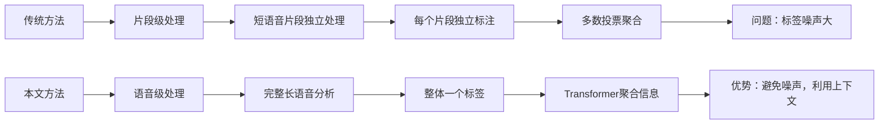
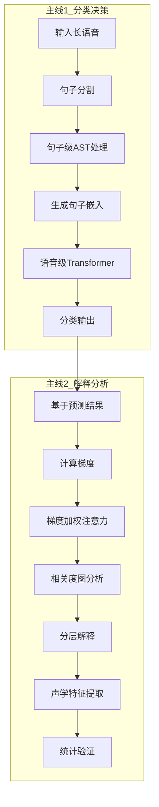

# 📚 《基于长语音的可解释抑郁症检测》论文笔记

## <span style="color: rgb(230, 81, 0)"><span style="background-color: rgb(255, 248, 225)">(2025) An interpretable speech foundation model for depression detection by revealing prediction-relevant acoustic features from long speech</span></span>

| <!-- --> |
| --------------------------------------------------------------------------------------------------------------------------------------------------------------------- |
| **期刊: **（发表日期: **2025**） **作者:** Qingkun Deng; Saturnino Luz; Sofia De La Fuente Garcia |
| **摘要:** 提出一种基于长语音的可解释抑郁症检测语音基础模型，通过语音级处理避免短片段标注噪声，并利用梯度加权注意力映射提取临床可理解的声学特征。 |
| **摘要翻译:** 抑郁症检测工具的临床适用性受到短语音片段和缺乏可解释性的限制。本研究提出一个可解释的语音基础模型方法，使用长语音进行抑郁症检测，并引入新颖的解释方法，揭示预测相关的声学特征供临床医生解释。实验表明，该方法优于片段级模型，并识别出音量降低和基频变化作为抑郁信号。 |
| **期刊分区:** |
| **原文PDF链接: **[Deng 等 - 2025 - An interpretable speech foundation model for depression detection by revealing prediction-relevant a.pdf] |
| **笔记创建日期: **2025/12/2 |
| **核心贡献:** 首次实现语音抑郁症检测的端到端可解释性，从频谱帧到临床特征的全链路映射 |

### 思维导图
```mermaid
graph LR
    A[论文核心：基于长语音的可解释抑郁症检测模型] --> B[基础信息]
    
    B --> B1[论文标题：An interpretable speech foundation model for depression detection...]
    B --> B2[作者：Qingkun Deng等]
    B --> B3[学科分类：抑郁症检测/语音分析/可解释AI]
    B --> B4[核心框架：语音级AST + 分层注意力解释 + 声学特征提取]

    A --> C[研究背景与挑战]
    
    C --> C1[1. 临床需求与现状]
    C1 --> C11[需求：抑郁症早期筛查，语音作为非侵入式检测]
    C1 --> C12[现状：现有方法存在短片段噪声和可解释性不足]
    
    C --> C2[2. 主要挑战]
    C2 --> C21[数据层面：短语音片段标注噪声]
    C2 --> C22[技术层面：缺乏临床可理解的解释]
    C2 --> C23[应用层面：医生不信任"黑箱"模型]
    
    A --> D[方法创新]
    
    D --> D1[1. 整体架构创新]
    D1 --> D11[语音级处理 vs 片段级处理]
    D11 --> D111[语音级：完整长语音分析，避免标注噪声]
    D11 --> D112[片段级：短片段独立标注，噪声大]
    D1 --> D12[分层处理结构：句子级 → 语音级]
    
    D --> D2[2. 可解释性创新]
    D2 --> D21[梯度加权注意力]
    D21 --> D211[结合注意力权重和梯度信息]
    D21 --> D212[更准确的重要性评估]
    D2 --> D22[相关度图机制]
    D22 --> D221[追踪重要性在层间的传播]
    D22 --> D222[递归更新：R ← R + Ā·R]
    D2 --> D23[分层解释框架]
    D23 --> D231[语音级：识别重要句子]
    D23 --> D232[句子级：识别重要音频帧]
    D23 --> D233[特征级：提取声学特征]
    
    D --> D3[3. 技术实现]
    D3 --> D31[数据预处理：Whisper转录+句子分割]
    D3 --> D32[模型结构：帧级AST编码+语音级Transformer]
    D3 --> D33[特征分析：OpenSMILE提取eGeMAPS特征]
    
    A --> E[实验验证]
    
    E --> E1[1. 实验设置]
    E1 --> E11[数据集：D-Vlog（698样本，52.7%抑郁）]
    E1 --> E12[对比：语音级模型 vs 片段级模型]
    E1 --> E13[评估指标：AUC + 统计检验]
    
    E --> E2[2. 主要结果]
    E2 --> E21[性能对比：AUC 0.772 vs 0.714 (+8.1%)]
    E2 --> E22[统计显著：p=0.0127，CI几乎不重叠]
    E2 --> E23[解释发现：识别响度降低、基频变化]
    E2 --> E24[临床一致性：与文献记录一致]
    
    E --> E3[3. 验证方法]
    E3 --> E31[扰动实验：移除重要部分→性能显著下降]
    E3 --> E32[统计分析]
    E32 --> E321[Mann-Whitney U检验：比较分布中位数]
    E32 --> E322[Bonferroni校正：控制多重比较假阳性]
    E32 --> E323[残差分析：去除性别影响]
    
    A --> F[贡献与价值]
    
    F --> F1[1. 方法学贡献]
    F1 --> F11[首次实现端到端可解释语音抑郁检测]
    F1 --> F12[提出相关度图机制]
    F1 --> F13[建立分层解释框架]
    
    F --> F2[2. 应用价值]
    F2 --> F21[增强临床信任：提供可理解的决策依据]
    F2 --> F22[支持医-机协作：透明、可信的AI系统]
    F2 --> F23[负责任AI：可验证、可解释的医疗AI]
    
    F --> F3[3. 技术洞察]
    F3 --> F31[数据效率：预训练+微调，小数据有效]
    F3 --> F32[计算效率：分层处理，避免长序列计算爆炸]
    F3 --> F33[解释质量：梯度加权优于原始注意力]
    
    A --> G[核心概念与解释]
    
    G --> G1[关键桥梁：相关度图]
    G1 --> G11[连接：模型内部机制 + 决策依据 + 人类可理解解释]
    G1 --> G12[作用：追踪特征重要性在Transformer层间的传播]
    
    G --> G2[专业术语解释]
    G2 --> G21[Mann-Whitney U检验：非参数检验，比较两组分布中位数差异]
    G2 --> G22[Bonferroni校正：α' = α/m，控制多重比较假阳性]
    G2 --> G23[残差分析：去除混淆变量（性别）影响]
    G2 --> G24[梯度加权注意力：Ā = (∇A ⊙ A)⁺，结合关注程度和影响程度]
    
    G --> G3[架构区别]
    G3 --> G31[片段级模型：短片段独立分类→聚合]
    G3 --> G32[语音级模型：长语音整体分析→直接输出]
    G3 --> G33[优势：避免标注噪声，利用上下文信息]

    style A fill:#e1f5fe,stroke:#01579b,stroke-width:2px
    style B fill:#f3e5f5,stroke:#4a148c
    style C fill:#fff3e0,stroke:#e65100
    style D fill:#e8f5e8,stroke:#1b5e20
    style E fill:#fff8e1,stroke:#ff8f00
    style F fill:#fce4ec,stroke:#880e4f
    style G fill:#e0f2f1,stroke:#004d40
```

## 1️⃣ 论文试图解决什么问题？(What is the problem?)

### 临床需求与现状矛盾

> 语音作为抑郁症临床检测工具具有巨大潜力，但现有方法存在两个致命缺陷：
> 1.  **依赖短语音片段**：抑郁症特征在语音中分布不均，短片段标注引入大量噪声；
> 2.  **缺乏临床可解释性**：模型是"黑箱"，医生无法理解判断依据，难以信任。

### 核心科学问题

> **如何构建一个既能准确检测又能提供临床可理解解释的语音抑郁症检测系统？**
> 具体分解：
> 1. 如何避免短片段标注噪声？
> 2. 如何将模型内部表示映射到医生能理解的声学特征？
> 3. 如何验证模型决策的临床合理性？

### 问题严重性比喻

> **"标签噪声问题"的生动比喻**：
> ```
> 患者15分钟自述 = 42个句子
> 真正包含抑郁特征的句子 ≈ 20个
> 中性/无关句子 ≈ 22个
> 
> 传统方法：所有42句都标记为"抑郁"
> 问题：22个错误标签 → 52%的噪声！
> 模型被迫学习：中性句子也是抑郁特征 → 性能下降
> ```

## 2️⃣ 核心思想/创新点是什么？(What is the core idea?)

### 三大支柱创新

#### **1. 从片段级到语音级的范式转变**



**关键区别**：
- **片段级**：多个独立决策 → 聚合 → 易受噪声影响
- **语音级**：整体分析 → 直接决策 → 更稳健

#### **2. 梯度加权注意力：从"关注什么"到"什么重要"**

```python
# 传统注意力：只反映"关注程度"
重要性 ≈ 注意力权重

# 梯度加权注意力：结合"关注程度"和"影响程度"
重要性 = 注意力权重 × 梯度
        (关注什么)    (影响多大)

# 数学公式：Ā = (∇A ⊙ A)⁺
# ∇A：梯度，反映特征变化对输出的影响
# A：原始注意力权重
# ⊙：逐元素相乘
# ⁺：只保留正值（支持预测的证据）
```

**为什么更好？**
- 高注意力权重不一定重要（可能对预测影响小）
- 梯度加权同时考虑两者，更准确

#### **3. 相关度图：连接黑箱与白箱的关键桥梁**

```
相关度图是连接：
┌───────────────────────┐
│ 模型内部机制          │ ← 注意力权重
│ 决策依据              │ ← 梯度信号  
│ 人类可理解解释        │ ← 重要性分数
└───────────────────────┘
的关键桥梁
```

**相关度图的作用**：
- **递归追踪**：通过 \( R^{XX} \leftarrow R^{XX} + \bar{A} \cdot R^{XX} \) 逐层传播重要性
- **捕捉间接相关性**：A→B→C，则A间接影响C
- **全局重要性评估**：考虑所有层的贡献，不只是最后一层

## 3️⃣ 方法是怎么实现的？(How does it work?)

### 完整架构：双主线设计



### 关键技术细节

#### **1. 帧级AST创新**
```
标准AST：16×16补丁分割 → 破坏时间连续性 ❌
本文AST：128×2帧分割 → 保持时间演化特性 ✅

为什么？
- 语音是时间序列，需要保持连续性
- 128维：完整频率信息
- 2个时间点：捕捉短时动态（约20ms）
```

#### **2. 两个[CLS]标记的不同作用**
```
句子级[CLS]（在AST内部）：
  作用：聚合一个句子的所有帧信息
  输入：[CLS] + 512帧
  输出：句子嵌入 eᵢ（768维）

语音级[CLS]（在语音级模块）：
  作用：聚合所有句子的信息  
  输入：[CLS] + 42个句子嵌入
  输出：语音表示 → 分类
```

#### **3. 训练策略优化**
```python
# 梯度累积：突破GPU内存限制
实际batch_size = 1
累积步数 = 72
等效batch_size = 72 → 训练更稳定

# 预训练模型使用
冻结AST前9层：保持通用音频知识
微调AST后3层：适应抑郁检测任务
语音级Transformer：从头训练
```

### 解释流程详解

#### **步骤1：语音级解释（哪些句子重要？）**
```python
# 初始化相关度图
R_ss = I^(43×43)  # 42句 + [CLS]

# 遍历语音级Transformer的6层
for layer in range(6):
    # 获取该层的梯度加权注意力 Ā
    Ā = compute_gradient_weighted_attention(layer)
    # 更新相关度图
    R_ss = R_ss + Ā @ R_ss  # 矩阵乘法

# 提取[CLS]行作为句子重要性
importance_scores = R_ss[0, 1:]  # 第0行是[CLS]，去掉第一个元素
```

#### **步骤2：句子级解释（哪些帧重要？）**
```python
# 对每个重要句子
for sentence in important_sentences:
    # 初始化帧级相关度图
    R_aa = I^(513×513)  # 512帧 + [CLS]
    
    # 遍历句子级AST的12层
    for layer in range(12):
        Ā = compute_gradient_weighted_attention(layer)
        R_aa = R_aa + Ā @ R_aa
    
    # 提取重要帧
    frame_importance = R_aa[0, 1:]  # [CLS]行，去掉自身
```

#### **步骤3：特征提取与统计验证**
```python
# 1. 定位重要波形段
重要帧 → 时间戳 → 原始波形段

# 2. 提取声学特征（eGeMAPS）
features = OpenSMILE.extract(waveform_segment)

# 3. 统计验证
# 分组：真阳性组（抑郁） vs 真阴性组（正常）
# 检验：Mann-Whitney U检验（比较中位数差异）
# 校正：Bonferroni（控制多重比较假阳性）
# 去除混淆：残差分析去除性别影响
```

## 4️⃣ 效果如何？(How is the performance?)

### 主要实验结果

#### **1. 性能对比：语音级 vs 片段级**
| 模型 | AUC (95% CI) | p-value | 解释 |
|------|-------------|---------|------|
| 片段级模型 | 0.714 [0.629, 0.796] | — | 传统方法 |
| 语音级模型 | **0.772** [0.692, 0.846] | **0.0127** | 本文方法 |

**关键发现**：
- **AUC提升8.1%**：统计显著（p<0.05）
- **置信区间几乎不重叠**：支持差异真实性
- **证明了标签噪声问题的存在和语音级建模的优势**

#### **2. 解释的临床验证（图2）**

**验证逻辑**：
```
如果模型解释合理，那么：
模型认为重要的特征应该在抑郁组和正常组间有显著差异
```

**具体发现**：
```
特征        抑郁组 vs 正常组    临床意义
响度(Loudness)   显著降低 ✓      抑郁患者语音微弱
基频(F0)         显著降低 ✓      抑郁患者语调单调
```

**统计方法**：
- **Mann-Whitney U检验**：非参数检验，比较两组分布中位数差异
- **Bonferroni校正**：检验25个特征，α' = 0.05/25 = 0.002
- **显著性标准**：* p≤0.002, ** p≤0.0004, *** p≤4×10⁻⁵

#### **3. 扰动实验验证（图3）**

**实验设计**：
```python
# 测试1：移除重要句子 → 性能大幅下降
# 测试2：移除随机句子 → 性能小幅下降
# 结论：模型确实依赖于识别出的重要部分
```

**结果**：
- 移除重要部分：精度从77.2%降至≈60%
- 移除随机部分：精度从77.2%降至≈70%
- **证明**：模型决策基于有意义的特征，不是随机记忆

### 局限性坦诚

#### **作者诚实的自我批评**：
> "我们承认这种方法可能会导致对两个模型性能的过度乐观估计（由于样本量有限而缺乏独立测试集）"

#### **但强调研究目的不同**：
> "这项工作的目的**不是**在D-Vlog数据集上进行性能基准测试。相反，我们旨在提供有力证据，证明在临床实践中使用患者的长语音而不是短片段进行更可靠的抑郁症检测的优势。"

#### **为什么这可以接受？**
```
比较相对差异，不是绝对性能：
即使两个AUC都被高估
只要高估程度相似
相对差异（0.772 vs 0.714）仍然有效
```

## 5️⃣ 有什么优点和缺点？(What are the strengths and weaknesses?)

### 优点（创新性贡献）

#### **1. 方法学创新**
- **首次实现**语音抑郁症检测的端到端可解释性
- **提出相关度图机制**，解决多层Transformer解释难题
- **建立分层解释框架**，从语音→句子→帧→特征层层深入

#### **2. 技术优势**
- **避免标注噪声**：语音级处理比片段级更稳健
- **计算效率高**：分层处理避免长序列计算爆炸
- **解释质量好**：梯度加权优于原始注意力

#### **3. 临床价值**
- **增强医生信任**：提供可理解的决策依据
- **支持医-机协作**：透明、可验证的AI系统
- **负责任AI实践**：伦理和实用性的平衡

### 缺点（局限性）

#### **1. 数据层面**
- **数据集小**：698个样本，来自YouTube，临床代表性有限
- **缺少独立测试集**：性能评估可能过于乐观
- **标签可靠性**：YouTube视频的抑郁标注可能不准确

#### **2. 技术层面**
- **解释方法依赖梯度**：梯度解释的理论基础仍有争议
- **计算成本高**：解释时需要额外的前向/反向传播
- **特征提取局限**：只使用eGeMAPS特征集，可能遗漏其他重要特征

#### **3. 应用层面**
- **实时性挑战**：处理15分钟语音需要时间
- **个性化差异**：未考虑个体基线语音特征
- **文化适应性**：基于英语数据，跨语言泛化需验证

## 6️⃣ 借鉴学习

### 1个核心思路

> **"可解释性不是附加功能，而是系统设计的核心"**
> 
> 本文展示了一个完整范式：不是先建模型再加解释，而是**从一开始就设计可解释的架构**。

### 2个关键技术

#### **相关度图机制**
```
可以应用于：
1. 其他医疗AI任务（心电图、脑电图分析）
2. 多模态融合模型解释
3. 任何基于Transformer的序列模型
```

#### **分层解释框架**
```
语音 → 句子 → 帧 → 特征
这种多粒度解释框架可以迁移到：
1. 视频分析：视频 → 场景 → 帧 → 视觉特征
2. 文档分析：文档 → 段落 → 句子 → 词语
```

### 3个实验设计技巧

#### **1. 对比实验设计**
```python
# 不是简单的"我们的方法 vs SOTA"
# 而是"验证核心假设"的实验
片段级模型（有问题的方法） vs 语音级模型（改进的方法）
```

#### **2. 多角度验证**
```
性能验证：AUC比较
解释验证：统计检验
鲁棒性验证：扰动实验
临床验证：与文献一致性
```

#### **3. 诚实面对局限**
```
明确说明：
1. 数据集限制
2. 缺少独立测试集
3. 可能的偏差来源
增强论文可信度
```

## 7️⃣ 关键术语与概念解释

### 专业术语详解

#### **Mann-Whitney U检验**
```
是什么：非参数统计检验，比较两个独立样本的中位数差异
为什么用：数据可能不服从正态分布，非参数方法更稳健
如何做：
  1. 将两组数据混合排序
  2. 计算每组的秩和
  3. 计算U统计量
  4. 判断显著性
在本文：比较抑郁组和正常组的声学特征中位数
```

#### **Bonferroni校正**
```
问题：同时检验多个特征（如25个），每个α=0.05
      → 整体假阳性率 ≈ 1 - (1-0.05)²⁵ ≈ 72%
解决：Bonferroni校正，α' = α/m = 0.05/25 = 0.002
意义：控制整体假阳性率在5%水平
在本文：* p≤0.002, ** p≤0.0004, *** p≤4×10⁻⁵
```

#### **残差分析**
```
目的：去除混淆变量（性别）的影响
方法：
  1. 建立回归：特征 = β₀ + β₁×性别
  2. 计算残差 = 实际值 - 预测值
  3. 用残差进行比较
意义：比较"相对于同性别平均水平"的差异
      而非"绝对数值"的差异
```

#### **梯度加权注意力 vs 原始注意力**
```
原始注意力：只反映"模型关注什么"
问题：高注意力不一定重要（可能对预测影响小）

梯度加权注意力：Ā = (∇A ⊙ A)⁺
∇A：梯度，反映"特征变化对输出的影响"
A：原始注意力权重
结合：同时考虑"关注程度"和"影响程度"
```

### 架构区别的生动比喻

#### **片段级模型 vs 语音级模型**
```
比喻：学生考试评分

片段级模型（传统方法）：
  每道题独立评分 → 加权平均 → 最终成绩
  问题：有些题根本不该计入（如选择题中的无效选项）
        但被迫计入 → 成绩失真

语音级模型（本文方法）：
  整体阅卷 → 直接给出最终成绩
  优势：可以忽略无关部分，专注关键内容
```

#### **相关度图的作用**
```
比喻：水流追踪系统

每个输入元素：一个水源
注意力权重：水管（传导水量）
相关度图：追踪最终有多少水流到了[CLS]这个水池

直接水流：S1 → [CLS]
间接水流：S1 → S2 → [CLS]
相关度图计算总水量，更全面
```

---

## 💎 终极总结：为什么这篇论文重要？

### 它不仅仅是一篇技术论文，而是**医疗AI研究范式的示范**

#### **展示了如何构建"负责任AI"**：
```
准确 + 可解释 + 可验证 + 临床有用
    ↓       ↓         ↓         ↓
高性能模型 医生能理解 统计验证 实际可用
```

#### **提供了完整的方法论**：
```
问题识别 → 方案设计 → 技术实现 → 实验验证 → 临床意义
   ↓          ↓          ↓          ↓          ↓
标签噪声  语音级建模  相关度图  AUC提升+ 增强医生
问题      +分层解释  机制    解释验证   信任
```

#### **对未来研究的启示**：
1. **可解释性应该内置**，不是后加
2. **临床验证至关重要**，不只追求SOTA
3. **诚实面对局限**，增强科学严谨性
4. **多角度验证**，建立完整证据链

**掌握这篇论文，就掌握了当前可解释医疗AI的前沿思维：如何让技术真正服务于临床，而不是停留在论文中。**