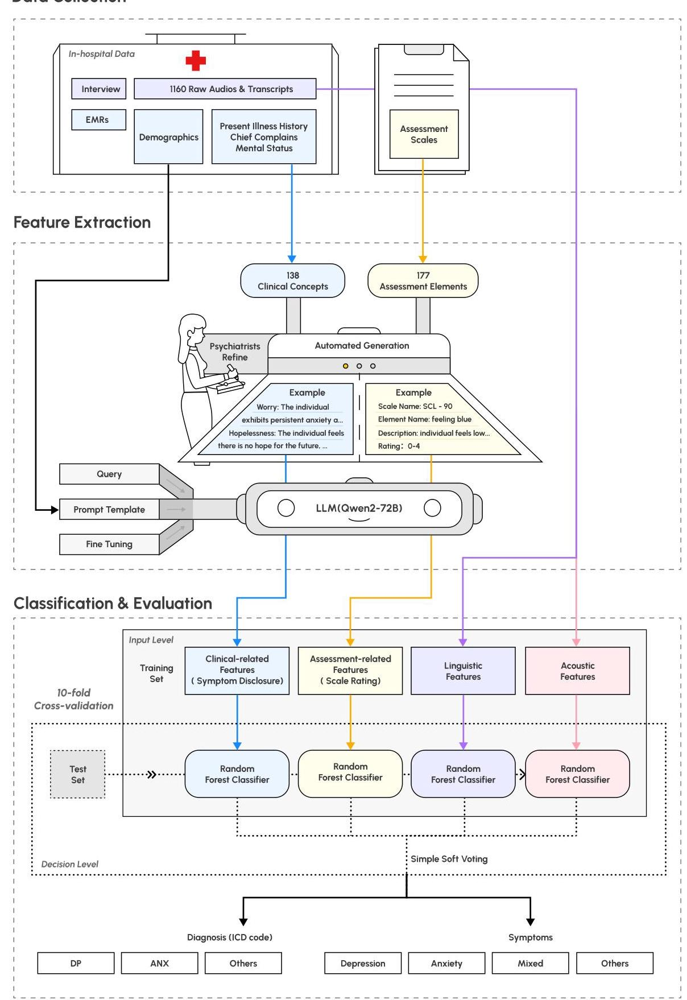
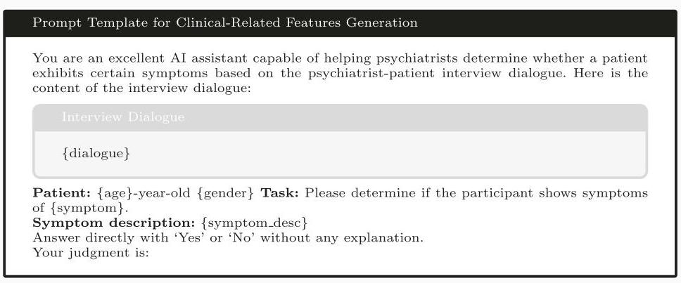
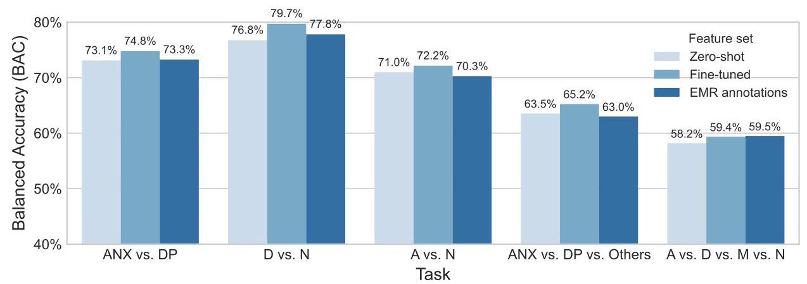

# Identifying psychiatric manifestations in outpatients with depression and anxiety: a large language model-based approach

# 识别抑郁症和焦虑症门诊患者的精神症状:一种基于大语言模型的方法

Shihao Xu’ \( {}^{2,3,8} \) , Yiming Yan \( {}^{1,4,8} \) , Yanli Ding \( {}^{1,4,8} \) , Feng Li \( {}^{2} \) , Shu Zhang \( {}^{1,4} \) , Thau Junu Tang \( {}^{1,4} \) , Chao Luo \( {}^{1,4} \) , Yan Li \( {}^{1,4} \) , Hao Liu', Yu Mei', Wenjie Gu', Hong Qiu', Yong Wang \( {}^{1,4} \) , Jianyin Qiu \( {}^{1,4} \) , Tao Yang \( {}^{3} \) , Zike Wang, Qing Zhang \( {}^{1,4,5} \) , Haiyang Geng \( {}^{3} \) , Yunyun Han \( {}^{3} \) , Jun Shao \( {}^{2} \) , Nils Opel \( {}^{6,7} \) , Lidong Bing \( {}^{3} \) , Min Zhao \( {}^{1,4,5} \) , Yifeng Xu \( {}^{1,4,5} \) , Xun Jiang \( {}^{2,3} \) & Jianhua Chen \( {}^{1,3,4,5} \) //

徐浩\( {}^{2,3,8} \)，严一鸣\( {}^{1,4,8} \)，丁艳丽\( {}^{1,4,8} \)，李丰\( {}^{2} \)，张舒\( {}^{1,4} \)，陶朱努·唐\( {}^{1,4} \)，罗超\( {}^{1,4} \)，李岩\( {}^{1,4} \)，刘浩\( {}^{1,4} \)，于梅\( {}^{1,4} \)，顾文杰\( {}^{1,4} \)，邱红\( {}^{1,4} \)，王永\( {}^{1,4} \)，邱建银\( {}^{1,4} \)，杨涛\( {}^{3} \)，王子科，张清\( {}^{1,4,5} \)，耿海洋\( {}^{3} \)，韩芸芸\( {}^{3} \)，邵军\( {}^{2} \)，尼尔斯·奥佩尔\( {}^{6,7} \)，邴立东\( {}^{3} \)，赵敏\( {}^{1,4,5} \)，徐逸峰\( {}^{1,4,5} \)，姜勋\( {}^{2,3} \) & 陈建华\( {}^{1,3,4,5} \) //

Accurate psychiatric diagnosis and assessment are crucial for effective treatment. However, current diagnostic approaches heavily rely on subjective observations constrained by time and clinical resources. This study investigates the potential of using Large Language Models (LLMs) to identify the symptoms in psychiatrist-patient dialogues and use them as intermediate features to predict the diagnostic labels. We collected audio recordings of 1160 outpatients with depressive disorder and anxiety disorder. LLMs were trained and utilized to identify clinical symptoms, rate assessment scales, and an ensemble learning pipeline was designed to classify diagnostic results and symptoms with 10- fold cross-validation. The system achieved 86.9% accuracy for identifying the appearance of clinical annotations and 74.7% (77.2%) accuracy for identifying symptoms of anxiety (depression). In addition, analysis of LLM-generated features shows that depression cases exhibited prominent markers of anhedonia and decreased volition, whereas anxiety disorders were characterized by tension and an inability to relax.

准确的精神疾病诊断和评估对于有效治疗至关重要。然而，当前的诊断方法严重依赖于受时间和临床资源限制的主观观察。本研究探讨了使用大语言模型(LLMs)识别医患对话中的症状并将其用作中间特征来预测诊断标签的潜力。我们收集了1160名抑郁症和焦虑症门诊患者的音频记录。训练并利用大语言模型来识别临床症状、评估量表评分，并设计了一个集成学习管道，通过10折交叉验证对诊断结果和症状进行分类。该系统在识别临床注释出现方面的准确率达到86.9%，在识别焦虑(抑郁)症状方面的准确率为74.7%(77.2%)。此外，对大语言模型生成特征的分析表明，抑郁症病例表现出明显的快感缺失和意志减退标记，而焦虑症的特征是紧张和无法放松。

Depression and anxiety disorders represent two of the most prevalent mental health conditions globally. Globally, it is estimated that over 300 million people suffer from major depressive disorders, which is equivalent to 4.4% of the world's population. A similar number of people suffer from anxiety disorders, often with co-occurring depression \( {}^{1} \) . The emerging field of digital phenotyping, which involves the nuanced quantification of human phenotypic expression at the individual level through digital device data, offers a quantitative approach to longitudinal observation \( {}^{2} \) .

抑郁症和焦虑症是全球最普遍的两种心理健康状况。据估计，全球有超过3亿人患有重度抑郁症，相当于世界人口的4.4%。患有焦虑症的人数与之相近，且常伴有抑郁症\( {}^{1} \)。新兴的数字表型领域，通过数字设备数据在个体层面进行人类表型表达的细致量化，提供了一种纵向观察的定量方法\( {}^{2} \)。

The emerging field of digital phenotyping, characterized by continuous and nuanced quantification of human phenotypic expression at the individual level by leveraging digital device data, provides a quantitative approach for longitudinal observation \( {}^{2} \) . Researchers have demonstrated that social signals (e.g., linguistics, speech, etc.) play a crucial role in the diagnosis and assessment of patients with depression and anxiety \( {}^{3,4} \) . In particular, the content of a patient's speech provides rich information about their mental state, cognitive patterns, and emotional experiences \( {}^{5,6} \) . The linguistic

新兴的数字表型领域，其特点是通过利用数字设备数据在个体层面持续且细致地量化人类表型表达，为纵向观察提供了一种定量方法\( {}^{2} \)。研究人员已经证明，社会信号(如语言、语音等)在抑郁症和焦虑症患者的诊断和评估中起着关键作用\( {}^{3,4} \)。特别是，患者的言语内容提供了有关他们心理状态、认知模式和情感体验的丰富信息\( {}^{5,6} \)。语言

\( {}^{1} \) Shanghai Mental Health Center, Shanghai Jiao Tong University School of Medic Chrissy Chen Institute, Shanghai, China. 4Shanghai Clinical Research Center for I Shanghai, China. \( {}^{6} \) University Hospital Jena Department of Psychiatry and Psych Berlin, Germany. \( {}^{8} \) These authors contributed equally: Shihao Xu, Yiming Yan, Y features, topic choices, and narrative structures employed by individuals can offer valuable insights into their psychological well-being \( {}^{6} \) .

\( {}^{1} \) 上海交通大学医学院附属上海精神卫生中心，中国上海。上海临床研究中心，中国上海。\( {}^{6} \) 德国耶拿大学医院精神病学和心理治疗系，德国柏林。\( {}^{8} \) 这些作者贡献相同:徐浩，严一鸣，Y 个体使用的语言特征、主题选择和叙事结构可以为他们的心理健康提供有价值的见解\( {}^{6} \)。

Recent advances in NLP, particularly in LLMs such as \( {\mathrm{{GPT}}}^{7},{\text{ Gemini }}^{8} \) , and Qwen \( {}^{9} \) , demonstrate diverse capabilities in clinical reasoning, social media analysis, and psychiatric education \( {}^{10} \) , which could potentially provide objective, data-driven insights in psychiatry. Moreover, LLMs are able to process, generate, and respond to natural language inputs, which fit naturally into the NIMH's Research Domain Criteria (RDoC) framework, which suggests new ways of classifying mental disorders based on dimensions of observable behaviors \( {}^{11} \) . In recent psychiatric studies, these LLMs excel at understanding and generating complex linguistic patterns with human-like performance, making them widely explored for social media content \( {\text{ analysis }}^{{12},{13}} \) , treatment performance enhancement \( {}^{{14} - {16}} \) , chat counselor \( {}^{{17},{18}} \) , and supporting clinical decision-making \( {}^{{19},{20}} \) from an evidence-based practice perspective. Although LLMs demonstrate linguistic understanding and generation, they remain relatively scarce in producing objective digital biomarkers in psychiatry \( {}^{21} \) . Studies have shown that the speech of patients with depression and anxiety contains distinctive quantitative verbal and nonverbal digital markers compared to healthy controls \( {}^{4,6} \) , but these characteristics often remain too subtle for humans to perceive actionable insights, making their practical application and improvement challenging \( {}^{22} \) . LLM is able to generate diagnostic results and provide reasoning steps, benefiting from a large amount of pre-training data. However, the interpretation and alignment of answers or decisions generated by LLM remain challenging \( {}^{23} \) . Moreover, most studies on depression and anxiety rely primarily on two data sources: social media and structured clinical reports, and are often constrained by limited data availability \( {}^{3} \) . Distinguishing between depression and anxiety in clinical settings remains challenging due to the overlap of symptoms and the high comorbidity rate, with limited research on the discovery of objective biomarkers for both conditions \( {}^{21} \) . In addition, during clinical interviews, psychiatrists translate patients' informal symptom descriptions into professional diagnostic terminology; however, there remains a lack of approaches to automatically and effectively bridge this "semantic gap" between patients and clinicians.

自然语言处理(NLP)领域的最新进展，尤其是在诸如\( {\mathrm{{GPT}}}^{7},{\text{ Gemini }}^{8} \)和豆包\( {}^{9} \)等大语言模型(LLM)方面，在临床推理、社交媒体分析和精神科教育\( {}^{10} \)中展现出了多样的能力，这有可能为精神病学提供客观的、数据驱动的见解。此外，大语言模型能够处理、生成并回应自然语言输入，这与美国国立精神卫生研究所(NIMH)的研究领域标准(RDoC)框架自然契合，该框架提出了基于可观察行为维度对精神障碍进行分类的新方法\( {}^{11} \)。在最近的精神病学研究中，这些大语言模型在理解和生成具有类人表现的复杂语言模式方面表现出色，因此被广泛用于社交媒体内容\( {\text{ analysis }}^{{12},{13}} \)、治疗效果提升\( {}^{{14} - {16}} \)、聊天咨询\( {}^{{17},{18}} \)以及从循证实践的角度支持临床决策\( {}^{{19},{20}} \)。尽管大语言模型展示了语言理解和生成能力，但在精神病学中生成客观数字生物标志物方面仍然相对较少\( {}^{21} \)。研究表明，与健康对照相比，抑郁症和焦虑症患者的言语包含独特的定量语言和非语言数字标记\( {}^{4,6} \)，但这些特征往往过于微妙，人类难以察觉可操作的见解，这使得它们的实际应用和改进具有挑战性\( {}^{22} \)。大语言模型能够生成诊断结果并提供推理步骤，这得益于大量的预训练数据。然而，大语言模型生成的答案或决策的解释和一致性仍然具有挑战性\( {}^{23} \)。此外，大多数关于抑郁症和焦虑症的研究主要依赖两个数据源:社交媒体和结构化临床报告，并且常常受到有限数据可用性的限制\( {}^{3} \)。由于症状重叠和高共病率，在临床环境中区分抑郁症和焦虑症仍然具有挑战性，针对这两种情况发现客观生物标志物的研究也很有限\( {}^{21} \)。此外，在临床访谈中，精神科医生将患者的非正式症状描述转化为专业诊断术语；然而，仍然缺乏自动且有效地弥合患者与临床医生之间这种“语义鸿沟”的方法。

---

\( {}^{1} \) Shanghai Mental Health Center, Shanghai Jiao Tong University School of Medicine, Shanghai, China. \( {}^{2} \) Theta Health Inc., Redwood City, CA, USA. \( {}^{3} \) Tianagiao and Chrissy Chen Institute, Shanghai, China. 4Shanghai Clinical Research Center for Mental Health, Shanghai, China. \( {}^{5} \) Shanghai Key Laboratory of Psychotic Disorder, Shanghai, China. \( {}^{6} \) University Hospital Jena Department of Psychiatry and Psychotherapy, Jena, Germany. \( {}^{7} \) German Centre for Mental Health (DZPG), Berlin, Germany. \( {}^{8} \) These authors contributed equally: Shihao Xu, Yiming Yan, Yanli Ding. Ce-mail: xun.jiang@thetahealth.ai; jianhua.chen@smhc.org.cn

\( {}^{1} \) 上海交通大学医学院附属上海精神卫生中心，中国上海。\( {}^{2} \) Theta Health Inc.，美国加利福尼亚州红木城。\( {}^{3} \) 中国上海天iao桥和Chrissy Chen研究所。中国上海精神卫生临床研究中心，中国上海。\( {}^{5} \) 中国上海精神病性障碍重点实验室。\( {}^{6} \) 德国耶拿大学医院精神科和心理治疗科，德国耶拿。\( {}^{7} \) 德国精神卫生中心(DZPG)，德国柏林。\( {}^{8} \) 这些作者贡献相同:徐世豪、严一鸣、丁艳丽。电子邮件:xun.jiang@thetahealth.ai；jianhua.chen@smhc.org.cn

---

To address these gaps in existing research, we collected a comprehensive dataset of psychiatric interviews at the Shanghai Mental Health Center (SMHC) in China, comprising over 15,000 min of speech recordings from 1160 individual outpatients with 25 different diagnoses. These recordings, primarily featuring patients diagnosed with depression and anxiety disorders, were collected in unstructured real-world environments to ensure ecological validity. To mimic the characteristics of clinical diagnosis, we designed a corpus of clinical indicators that incorporates diagnostic criteria, main complaints, mental status evaluations, and components from assessment scales using the Electronic Medical Records (EMRs) in the SMHC and widely-used assessment scales. Subsequently, we employed the pre-trained LLM to indicate the appearance of a corpus of clinical-related symptoms, rate the components of several assessment scales, and further fine-tuned the LLM with clinical annotations from professional psychiatrists to enhance its understanding of clinical-related concepts. In parallel, we extracted linguistic usage patterns and acoustic features to broaden the spectrum of biomarkers. Through the fusion of these modalities, we constructed an ensemble machine-learning pipeline capable of predicting both outpatient diagnostic groups and symptoms with moderately high accuracies. Moreover, we conducted an in-depth analysis of salient patterns between different diagnostic groups to enhance clinical interpretability. Our results demonstrate that objective cues extracted by the LLM, combined with other behavioral markers, can serve as valuable features for differentiating diagnostic groups and identifying symptom disclosure, potentially enhancing both the efficiency and effectiveness of psychiatric diagnosis and assessment in clinical practice.

为了弥补现有研究中的这些差距，我们收集了中国上海精神卫生中心(SMHC)全面的精神病学访谈数据集，其中包括来自1160名患有25种不同诊断的个体门诊患者的超过15000分钟的语音记录。这些记录主要以被诊断为抑郁症和焦虑症的患者为特征，是在非结构化的现实环境中收集的，以确保生态效度。为了模拟临床诊断的特征，我们设计了一个临床指标语料库，该语料库结合了诊断标准、主要症状、精神状态评估以及使用SMHC的电子病历(EMR)和广泛使用的评估量表中的评估量表组件。随后，我们使用预训练的大语言模型来指示临床相关症状语料库的出现，对几个评估量表的组件进行评分，并使用专业精神科医生的临床注释对大语言模型进行进一步微调，以增强其对临床相关概念的理解。同时，我们提取语言使用模式和声学特征以拓宽生物标志物的范围。通过这些模式的融合我们构建了一个集成机器学习管道，能够以适度高的准确率预测门诊诊断组和症状。此外，我们对不同诊断组之间的显著模式进行了深入分析，以增强临床可解释性。我们结果表明，大语言模型提取的客观线索与其他行为标记相结合，可以作为区分诊断组和识别症状披露的有价值特征，有可能提高临床实践中精神病学诊断和评估的效率和效果。

## Methods

## 方法

This study collected the audio recording of 1160 participants between August 2023 and January 2024, in collaboration with the SMHC. The overall pipeline is shown in Fig. 1. Data collection was conducted using the Scientific Speech Transcription Pen M1 (Iflytek Co., Ltd.) with a sampling rate of 44100 Hz. Firstly, the protocol involved three primary stages: preprocessing of audio samples, anonymization of personally identifiable information, and subsequent transcription via automated speech recognition systems followed by meticulous manual verification to ensure transcriptional accuracy. Secondly, we collaborated with professional psychiatrists to design a set of clinical entities and leveraged the LLM to identify these concepts using the transcripts as input, enhancing the LLM based on the psychiatrists' annotations through supervised fine-tuning (SFT). Linguistic and acoustic features were extracted from both the transcripts and the speech. Finally, we utilized different modalities to train an ensemble machine learning pipeline to differentiate diagnostic groups and the major symptoms.

本研究于2023年8月至2024年1月期间，与SMHC合作收集了1160名参与者的音频记录。整体流程如图1所示。数据收集使用了科学语音转录笔M1(科大讯飞股份有限公司)，采样率为44100Hz。首先，该方案涉及三个主要阶段:音频样本预处理、个人可识别信息匿名化，以及随后通过自动语音识别系统进行转录，再经过细致的人工核查以确保转录准确性。其次，我们与专业精神科医生合作设计了一组临床实体，并利用大语言模型以转录本为输入来识别这些概念，通过监督微调(SFT)根据精神科医生的注释增强大语言模型。从转录本和语音中提取语言和声学特征。最后，我们利用不同模态训练一个集成机器学习流程，以区分诊断组和主要症状。

## Participants

## 参与者

The study sample comprised outpatients from the SMHC who attended clinical diagnostic interviews. Participants were aged 12 to 80 years and were fluent in Mandarin. Informed consent to participate in the study was obtained from all participants or their legal guardians, as appropriate. All diagnoses were established using the Chinese version of WHO International Classification of Diseases, Tenth Revision (ICD-10) \( {}^{24} \) . The study protocol was approved by the Ethics Committee of the SMHC institutional review board (IRB) to ensure compliance with ethical research standards. Specifically, the recording setup consisted of a microphone placed between the psychiatrist and the participant, connected to a computer. At the beginning of each interview, participants were asked to read a standardized 30-second text passage, followed by the standard diagnostic procedure. All clinical information was documented in the EMR system by the psychiatrists. To protect the privacy of participants, all audio recordings and associated meta-information underwent a thorough manual de-identification process.

研究样本包括来自SMHC参加临床诊断访谈的门诊患者。参与者年龄在12至80岁之间，普通话流利。所有参与者或其法定监护人(视情况而定)均获得了参与本研究的知情同意。所有诊断均使用《世界卫生组织国际疾病分类，第十版》(ICD - 10)中文版\( {}^{24} \)确定而成。研究方案经SMHC机构审查委员会(IRB)伦理委员会批准，以确保符合伦理研究标准。具体而言，录音设置包括一个置于精神科医生和参与者之间并连接到计算机的麦克风。在每次访谈开始时，要求参与者阅读一段标准化的30秒文本段落，然后进行标准诊断程序。所有临床信息均由精神科医生记录在电子病历系统中。为保护参与者的隐私，所有音频记录及相关元信息都经过了全面的人工去识别过程。

## Feature extraction

## 特征提取

We extracted a comprehensive clinical entity set to cover the intermediate features that assist psychiatrists in the diagnosis and assessment process: clinical observations and standardized assessment scales, which we designate as clinical-related and assessment-related feature sets. A clinical entity, in the context of our pipeline, is a structured representation of a psychiatric symptom or construct, developed from both clinical observations and standardized assessment scales. It encompasses key terms, expressions, and severity indicators related to specific diagnostic features, and serves as a unified unit for symptom detection and classification in our system. As compensation, we measured the linguistic usage and acoustic characteristics and form as individual feature sets. In the following paragraphs, we will introduce how we build and extract these feature sets in detail.

我们提取了一个全面的临床实体集，以涵盖有助于精神科医生进行诊断和评估过程的中间特征:临床观察和标准化评估量表，我们将其指定为临床相关和评估相关特征集。在我们的流程中，临床实体是一种精神症状或结构的结构化表示，由临床观察和标准化评估量表共同构建而成。它包含与特定诊断特征相关的关键术语、表达和严重程度指标，并作为我们系统中症状检测和分类的统一单元。作为补充，我们测量了语言使用情况、声学特征和形式作为单独的特征集。在以下段落中，我们将详细介绍如何构建和提取这些特征集。

The clinical-related feature set encompasses essential depression and anxiety indicators extracted from EMRs with comprehensive descriptions (shown in Supplementary Table 1). This feature set was developed through a collaborative approach involving both psychiatrists and LLM analysis. Firstly, the process began with extracting 218 clinical entities from three sections in the EMR system: chief complaint, personal medical history, and psychiatric examination. These entities represent predefined features within the documentation framework of the SMHC EMR system based on psychiatric diagnostic systems, textbooks, and experts' opinions. Then, we included a supplementary of 44 additional symptoms identified through clinical expertise and diagnostic criteria (e.g., DSM-5 and ICD-10) suggested by psychiatrists. We then utilized the Gemini 1.5 Pro \( {}^{8} \) to generate descriptions for all clinical entities, using the Chinese version of the DSM-5 guidance \( {}^{25} \) as a reference, leveraging the model’s strong extended context window capability. Through iterative psychiatric review, redundant and irrelevant items specific to depression and anxiety were eliminated, resulting in a refined set of 138 validated clinical-related features.

临床相关特征集包括从电子病历中提取的具有全面描述的基本抑郁和焦虑指标(见补充表1)。该特征集是通过精神科医生和大语言模型分析的协作方法开发的。首先，该过程始于从电子病历系统的三个部分提取218个临床实体:主诉、个人病史和精神检查。这些实体代表了基于精神科诊断系统、教科书和专家意见在SMHC电子病历系统文档框架内预定义的特征。然后，我们纳入了通过精神科医生建议的临床专业知识和诊断标准(如DSM - 5和ICD - 10)确定的44个额外症状作为补充。然后，我们利用Gemini 1.5 Pro\( {}^{8} \)以中文版DSM - 5指南\( {}^{25} \)为参考，为所有临床实体生成描述，利用该模型强大的扩展上下文窗口能力。通过反复的精神科审查，消除了特定于抑郁和焦虑的冗余和不相关项目，并得到了一组经过验证的138个临床相关特征的精炼集。

After rigorously defining the clinical-related features, we leveraged large language models to extract symptom information from diagnostic conversations. We employed Qwen2-72B-Instruct \( {}^{26} \) as our foundational model due to its advanced Chinese language processing capabilities and suitability for offline deployment within secure hospital environments. To enhance domain-specific performance, we implemented SFT using psychiatrists' annotations from electronic medical records EMRs. This approach adapted the base model to better recognize specialized medical terminology and clinical reasoning patterns specific to psychiatric assessment contexts. The fine-tuning methodology treated symptom identification as an autoregressive task, where the model learns to predict token probabilities based on previous context, ultimately generating binary judgments ("yes" or "no") regarding specific symptom presence. The training data comprised individual samples where dialogue content, patient demographics (age, gender), and symptom categories were incorporated into prompt templates alongside corresponding symptom occurrence labels extracted from EMRs. For each clinical conversation, we systematically extracted all documented symptoms to create comprehensive training instances. The fine-tuning implementation utilized LLaMA-Factory (https://github.com/hiyouga/LLaMA-Factory), while inference processes were facilitated through vLLM (https://github.com/vllm-project/vllm).All computational procedures were executed on a high-performance computing infrastructure consisting of four A100 GPUs. Table 1 presents the prompt architecture used both for clinical feature generation and model fine-tuning (Supplementary Table 4 for the Chinese version), demonstrating our structured approach to symptom extraction within extended clinical dialogues.

在严格定义临床相关特征后，我们利用大语言模型从诊断对话中提取症状信息。由于Qwen2-72B-Instruct \( {}^{26} \) 具有先进的中文处理能力且适合在安全的医院环境中进行离线部署，我们将其作为基础模型。为了提高特定领域的性能，我们使用电子病历(EMR)中精神科医生的注释进行监督微调(SFT)。这种方法使基础模型能够更好地识别精神科评估背景下的专业医学术语和临床推理模式。微调方法将症状识别视为自回归任务，模型根据先前的上下文学习预测令牌概率，最终对特定症状的存在做出二元判断(“是”或“否”)。训练数据由单个样本组成，其中对话内容、患者人口统计学信息(年龄、性别)和症状类别被纳入提示模板，同时还包括从EMR中提取的相应症状出现标签。对于每一次临床对话，我们系统地提取所有记录的症状以创建全面的训练实例。微调实现使用了LLaMA-Factory(https://github.com/hiyouga/LLaMA-Factory)，而推理过程则通过vLLM(https://github.com/vllm-project/vllm)来实现。所有计算过程均在由四个A100 GPU组成的高性能计算基础设施上执行。表1展示了用于临床特征生成和模型微调的提示架构(中文版见补充表4)，展示了我们在扩展临床对话中进行症状提取的结构化方法。

Fig. 1 | Diagram of the analysis pipeline. The audio recordings were collected during the diagnosis interview for outpatients. We extracted four types of feature sets from the recordings, two of which utilized LLM. These feature sets were utilized to classify different groups of participants and predict the appearance of depression and anxiety symptoms.

图1 | 分析流程示意图。门诊诊断访谈期间收集了音频记录。我们从记录中提取了四种特征集，其中两种利用了大语言模型(LLM)。这些特征集用于对不同组的参与者进行分类，并预测抑郁和焦虑症状的出现。

We first began with structuring EMR data to create reliable training labels for the SFT. Since EMRs contain unstructured text fields where psychiatrists document patient information, we employed the LLM to analyze these 1160 EMRs. For each EMR, we leveraged LLM to evaluate the presence of above mentioned 138 predefined clinical features, including similar expressions and synonyms, generating a boolean value list (yes/no) for each record. The prompt for querying the LLM to generate labels from EMRs is shown in Supplementary Table 3 (Supplementary Table 6 for the Chinese version).

我们首先对电子病历(EMR)数据进行结构化处理，为监督微调(SFT)创建可靠的训练标签。由于EMR包含精神科医生记录患者信息的非结构化文本字段，我们使用大语言模型(LLM)来分析这1160份EMR。对于每份EMR，我们利用LLM评估上述138个预定义临床特征的存在情况，包括相似表达和同义词，为每条记录生成一个布尔值列表(是/否)。用于查询LLM以从EMR生成标签的提示见补充表3(中文版见补充表6)。

## Table 1 | Prompt template for clinical-related feature generation

## 表1 | 临床相关特征生成的提示模板

The content within the curly braces is the demographic, symptom descriptions, and dialogue information that form the prompt.

花括号内的内容是构成提示的人口统计学信息、症状描述和对话信息。

Secondly, we implemented a rigorous filtering process for choosing high-quality data for SFT. We first leverage LLM to verify whether the information recorded in EMRs was adequately reflected in the interview dialogue transcripts, yielding 877 valid examples. Then, we collaborated with specialist psychiatrists to establish comprehensive evaluation criteria, encompassing five standards for psychiatric examination, one for chief complaints, and five for present illness history assessment. By using these criteria as the prompt (shown in Supplementary Table 3), we employed the LLM to evaluate each case and select the top 60% (527 examples) as high-quality cases based on the total score. From these high-quality cases, we allocated 477 cases for the SFT and 50 cases for the high-quality test set. The 50 high-quality test cases and 633 lower-quality cases are combined as a completed test set to evaluate the accuracy of clinical-related feature extraction.

其次，我们实施了严格的筛选过程，为监督微调(SFT)选择高质量数据。我们首先利用大语言模型(LLM)验证EMR中记录的信息是否在访谈对话记录中得到充分体现，得到877个有效示例。然后，我们与精神科专家合作建立了全面的评估标准，包括五项精神检查标准、一项主诉标准和五项现病史评估标准。通过将这些标准作为提示(见补充表3)，我们利用LLM对每个病例进行评估，并根据总分选择前60%(527个示例)作为高质量病例。从这些高质量病例中，我们分配477个病例用于监督微调(SFT)，50个病例用于高质量测试集。将50个高质量测试病例和633个低质量病例组合成一个完整的测试集，以评估临床相关特征提取的准确性。

Subsequently, we fine-tuned the Qwen2-72B-Instruct model with Low-Rank Adaptation (LoRA) \( {}^{27} \) . The LLM SFT involves training a pre-trained model on datasets with explicit input-output pairs to optimize the model's performance on specific downstream tasks. LoRA is a parameter-efficient fine-tuning technique that adds small, trainable rank decomposition matrices to the LLM's existing weights, allowing for efficient model adaptation while keeping most of the original model parameters frozen. The model was trained using the following hyperparameters: LoRA rank of 8, LoRA alpha of 16, batch size of 8, and an initial learning rate of 1e-4 for 7000 steps. During inference using the vLLM framework, we restricted the model's output to a single token "Yes" or "No" as the binary output, while we also extracted the probability output for these two tokens from the whole vocabulary. After normalization of the probabilities, along with the binary outputs, we formed 276 features in the clinical-related feature set.

随后，我们使用低秩适应(LoRA)\( {}^{27} \) 对Qwen2-72B-Instruct模型进行微调。大语言模型监督微调(LLM SFT)涉及在具有明确输入-输出对的数据集上训练预训练模型，以优化模型在特定下游任务上的性能。LoRA是一种参数高效的微调技术，它在大语言模型的现有权重上添加小的、可训练的秩分解矩阵，允许在保持大部分原始模型参数不变的情况下高效地调整模型。使用以下超参数对模型进行训练:LoRA秩为8，LoRA alpha为16，批量大小为8，初始学习率为1e-4，共训练7000步。在使用vLLM框架进行推理时，我们将模型的输出限制为单个令牌“是”或“否”作为二元输出，同时我们还从整个词汇表中提取这两个令牌的概率输出。在对概率进行归一化后，连同二元输出，我们在临床相关特征集中形成了276个特征。

The assessment-related feature set incorporates data from six validated psychiatric rating scales, combining self-rating and peer-rating instruments. Self-rating scales include SCL-90 \( {}^{28} \) , SDS \( {}^{29} \) , and SAS \( {}^{30} \) , while peer-rating scales comprise \( {\mathrm{{HAMD}}}^{31},{\mathrm{{HAMA}}}^{32} \) , and \( {\mathrm{{MADRS}}}^{33} \) , totaling 177 items in all. These scales were selected for their proven reliability in clinical practice and research, offering comprehensive symptom coverage.

与评估相关的特征集纳入了来自六个经过验证的精神科评定量表的数据，结合了自评和同伴评定工具。自评量表包括SCL-90 \( {}^{28} \) 、SDS \( {}^{29} \) 和SAS \( {}^{30} \) ，而同伴评定量表包括\( {\mathrm{{HAMD}}}^{31},{\mathrm{{HAMA}}}^{32} \) 和\( {\mathrm{{MADRS}}}^{33} \) ，总共177项。选择这些量表是因为它们在临床实践和研究中已被证明具有可靠性，能够全面覆盖症状。

We designed two meta-prompts to enable the LLM to mimic both psychiatrists and patients in rating assessment scales in a zero-shot manner, as illustrated in Supplementary Table 2 and (Supplementary Table 5 for the Chinese version). The scales' content and rating guidelines were integrated into the prompts for LLM to generate the features. For instance, when extracting features related to the first item of the HAMD, which measures depressed mood, we use the peer-rating meta-prompt to instruct the LLM to evaluate the severity of the patient's depressed mood on a 0-4 scale based on age, gender, and conversation content, where 0 indicates the absence of depression and 4 represents severe depression. When the conversation lacks sufficient information about the depressed mood, the LLM is prompted to return "NULL". Similar to the clinical-related feature extraction, we extracted and normalized the logits of related tokens from the last layer of LLM and served as the features for classification and prediction tasks, resulting in a total of 1199 features. We did not SFT the LLM for assessment-related feature extraction, since we do not have sufficient assessment scale labels.

我们设计了两个元提示，以使大语言模型能够以零样本的方式在评定量表中模仿精神科医生和患者进行评分，如补充表2所示(中文版见补充表5)。量表的内容和评分指南被整合到提示中，供大语言模型生成特征。例如，在提取与汉密尔顿抑郁量表(HAMD)第一项相关的特征时，该项测量抑郁情绪，我们使用同伴评定元提示来指导大语言模型根据年龄、性别和对话内容，以0至4分的量表评估患者抑郁情绪的严重程度，其中0表示没有抑郁，4表示严重抑郁。当对话缺乏关于抑郁情绪的足够信息时，大语言模型会被提示返回“NULL”。与临床相关特征提取类似，我们从大语言模型的最后一层提取并归一化相关令牌的对数，作为分类和预测任务的特征，总共得到1199个特征。由于我们没有足够的评定量表标签，所以在与评估相关的特征提取中没有对大语言模型进行监督微调(SFT)。

In addition to the features generated by LLM, we extracted verbal features through two bag-of-words approaches: \( {\mathrm{{LIWC}}}^{34} \) and TF-IDF \( {}^{35} \) , both of which measure the frequency of word occurrence within a document. The LIWC tool is specifically designed to provide rich insights into psychological states, including emotions, thinking styles, and social concerns. Notably, since our transcripts are in Mandarin, we used the Simplified Chinese version of LIWC \( {}^{36} \) . It comprises word counts for 63 categories, including 52 categories related to linguistic counts (e.g., function words, common verbs, numbers, etc.), psychological processes (e.g., affect, sociality, cognition, perception, drive, etc.), and personal concern (e.g., work, home, religion, etc.), as well as 7 emotional categories (e.g., happy, sad, fear, etc.) and 4 general text metrics (e.g., the number of unique words, words in LIWC dictionary, etc.). We normalized the LIWC category counts by the total number of words.

除了大语言模型生成的特征外，我们还通过两种词袋方法提取了语言特征:\( {\mathrm{{LIWC}}}^{34} \) 和词频 - 逆文档频率(TF-IDF)\( {}^{35} \) ，这两种方法都测量文档中单词出现的频率。语言调查词库(LIWC)工具专门设计用于深入了解心理状态，包括情绪、思维方式和社会关注。值得注意的是，由于我们的数据记录是中文的，我们使用了LIWC的简体中文版\( {}^{36} \) 。它包括63个类别的词数统计数据类别，其中包括52个与语言统计相关的类别(例如功能词、常用动词、数字等)、心理过程(例如情感、社交、认知、感知、驱动力等)和个人关注(例如工作、家庭、宗教等)，以及7个情感类别(例如快乐、悲伤、恐惧等)和4个一般文本指标(例如独特单词数量、LIWC词典中的单词等)。我们通过单词总数对LIWC类别计数进行了归一化。

The TF-IDF algorithm, which stands for Term Frequency-Inverse Document Frequency, is a popular technique used in text analysis to determine the importance of words within a document or collection of documents. Unlike simple word counting, TF-IDF considers both how often a word appears in a specific document and how common or rare that word is across all documents. This approach helps identify words that are particularly characteristic or important to specific documents. In this study, TF-IDF was applied alongside LIWC to provide a more comprehensive analysis of the verbal features in the documents, offering insights into both the frequency and relevance of words used by the subjects. We applied Jieba (https://github.com/fxsjy/jieba) for Chinese character segmentation, resulting in a total of 27,000 features.

词频 - 逆文档频率(TF-IDF)算法代表词频 - 逆文档频率，是文本分析中一种常用的技术，用于确定文档或文档集合中单词的重要性。与简单的单词计数不同，TF-IDF既考虑单词在特定文档中出现的频率，也考虑该单词在所有文档中的常见程度或稀有程度。这种方法有助于识别对特定文档特别具有特征或重要的单词。在本研究中，TF-IDF与LIWC一起应用，以对文档中的语言特征进行更全面的分析，深入了解受试者使用的单词的频率和相关性。我们应用结巴分词(https://github.com/fxsjy/jieba)进行中文分词，总共得到27000个特征。

In addition to examining the verbal aspects of participants' speech, we preprocessed the audio and extracted low-level acoustic and prosodic features using the OpenSMILE toolkits \( {}^{37} \) . The audio recordings were manually edited to obscure names, addresses, and personally identifiable information before analysis. To reduce the impact of environmental noise and the varying distance from the microphone to the participant on recording quality, we used the pyAudacity toolkit (https://github.com/asweigart/ pyaudacity) and the FFmpeg-normalized toolkit (https://github.com/slhck/ ffmpeg-normalize) to reduce the noise with a parameter of \( {12}\mathrm{\;{dB}} \) and normalize the volume to -23 dB respectively. OpenSMILE is a versatile, customizable suite of acoustic features for signal processing and machine learning applications. We utilized OpenSMILE's emobase_live4 configuration to extract the following LLDs (Low-Level Descriptors): intensity, loudness, 12 MFCCs, pitch (F0), voicing probability (VoiceProb), F0 envelope (F0env), 8 line spectral frequencies (LSF), and Zero-Crossing Rate (ZCR). Next, we applied various functions to these LLDs and their delta coefficients, including minimum and maximum values with their relative positions (minPos and maxPos), range, mean, linear regression coefficients (linregc1-2), linear and quadratic error, standard deviation (STD), skewness, kurtosis, quartile values (quartile1-3), and interquartile ranges (iqr1-2, iqr2-3, iqr1-3). This process yielded 988 features to represent each speech utterance. Before LLD computation, pauses and silences were eliminated from the speech to create a continuous signal. We then extracted 988 emotion-based prosodic features using a \( {100}\mathrm{\;{ms}} \) sliding window over the entire speech sample. Lastly, we calculated these emotion-based features' maximum, minimum, mean, and standard deviation to compose the final set of OpenSMILE features, totaling 3952 features.

除了检查参与者言语的语言方面，我们还对音频进行了预处理，并使用OpenSMILE工具包\( {}^{37} \)提取了低级声学和韵律特征。在分析之前，对音频记录进行了人工编辑，以模糊姓名、地址和个人身份信息。为了减少环境噪声以及麦克风到参与者的距离变化对录音质量的影响，我们使用了pyAudacity工具包(https://github.com/asweigart/ pyaudacity)和FFmpeg归一化工具包(https://github.com/slhck/ ffmpeg-normalize)，分别以\( {12}\mathrm{\;{dB}} \)为参数降低噪声并将音量归一化到-23 dB。OpenSMILE是一个通用的、可定制的声学特征套件，用于信号处理和机器学习应用。我们利用OpenSMILE的emobase_live4配置提取了以下低级描述符(LLD):强度、响度、12个梅尔频率倒谱系数(MFCC)、音高(F0)、发声概率(VoiceProb)、F0包络(F0env)、8个线谱频率(LSF)和过零率(ZCR)。接下来，我们对这些LLD及其增量系数应用了各种函数，包括最小值和最大值及其相对位置(minPos和maxPos)、范围、均值、线性回归系数(linregc1-2)、线性和二次误差、标准差(STD)、偏度、峰度、四分位数(quartile1-3)和四分位距(iqr1-2、iqr2-3、iqr1-3)。这个过程产生了988个特征来表示每个语音话语。在计算LLD之前，从语音中消除了停顿和静音，以创建一个连续信号。然后，我们使用\( {100}\mathrm{\;{ms}} \)在整个语音样本上滑动窗口提取了988个基于情感的韵律特征。最后，我们计算了这些基于情感的特征的最大值、最小值、均值和标准差，以组成最终的OpenSMILE特征集，总共3952个特征。

## Classification method

## 分类方法

As explained in previous sections, we extracted five feature sets using LLM and existing toolkits: clinical-related, assessment-related, LIWC, TF-IDF, and OpenSMILE features. Subsequently, we built a machine learning pipeline to fuse the outputs from multiple feature sets to predict the appearance of the symptom and classify diagnostic groups, which was implemented using Scikit-learn 1.2.0 in Python 3.10. Notably, as detailed in explaining the clinical feature extraction, we fine-tuned the LLM using 138 high-quality clinical annotations to improve its ability to identify clinical concepts. We excluded diagnostic labels from this process to prevent data leakage.

如前所述，我们使用大语言模型(LLM)和现有工具包提取了五个特征集:临床相关、评估相关、LIWC、TF-IDF和OpenSMILE特征。随后，我们构建了一个机器学习管道，将多个特征集的输出进行融合，以预测症状的出现并对诊断组进行分类，这是在Python 3.10中使用Scikit-learn 1.2.0实现的。值得注意的是，如在解释临床特征提取时详细说明的，我们使用138个高质量的临床注释对LLM进行了微调，以提高其识别临床概念的能力。我们在此过程中排除了诊断标签，以防止数据泄露。

To ensure robust validation, we employed 10-fold cross-validation (10- fold CV). This method involves dividing the data into 10 subsets, iteratively training the model on 9 subsets, and testing it on the remaining subset. The process is repeated 10 times, with each subset serving as the test set once, and the model's performance is averaged across all iterations. We implemented the random forest classifier for all feature sets as it constantly achieved better performance than other types of classifiers. To address the challenge of class imbalance, we applied the Synthetic Minority Oversampling Technique (SMOTE) \( {}^{38} \) , which generates synthetic data for minority classes. Furthermore, we performed z-score standardization on all features, resulting in standardized features with a mean of 0 and a standard deviation of 1 . This step ensures that all features are on a comparable scale, preventing any single feature from dominating the analysis due to its magnitude.

为了确保可靠的验证，我们采用了10折交叉验证(10-fold CV)。这种方法包括将数据分成10个子集，在9个子集上迭代训练模型，并在其余子集上进行测试。这个过程重复10次，每个子集都作为测试集一次，并且在所有迭代中对模型的性能进行平均。我们对所有特征集都实现了随机森林分类器，因为它始终比其他类型的分类器表现更好。为了解决类别不平衡的挑战，我们应用了合成少数过采样技术(SMOTE) \( {}^{38} \) ，它为少数类生成合成数据。此外，我们对所有特征进行了z分数标准化，得到均值为0、标准差为1的标准化特征。这一步确保所有特征都在可比的尺度上，防止任何单个特征因其大小而在分析中占主导地位。

We also implemented probability calibration to standardize predictions from each feature set. This process involved an internal CV on the training set of the outer CV to obtain the probability distribution on training data, which were then used to calibrate test set predictions \( {}^{6} \) . Moreover, based on the feature importance ranked by the classifier on training data, we filtered out features whose importance values fell below the mean to reduce unimportant features. For the final prediction, we employed a late fusion technique, a multi-modal machine learning approach that involved averaging the standardized prediction outputs from all feature sets to produce the final output. This method allows for the integration of diverse information sources while maintaining the integrity of each feature set's contribution to the final prediction.

我们还实现了概率校准，以标准化每个特征集的预测。这个过程包括在外层交叉验证的训练集上进行内部交叉验证，以获得训练数据上的概率分布，然后用它来校准测试集的预测\( {}^{6} \)。此外，基于分类器在训练数据上排名的特征重要性，我们过滤掉重要性值低于均值的特征，以减少不重要的特征。对于最终预测，我们采用了后期融合技术，这是一种多模态机器学习方法，涉及对所有特征集的标准化预测输出进行平均，以产生最终输出。这种方法允许整合不同的信息源，同时保持每个特征集对最终预测的贡献的完整性。

## Performance metrics

## 性能指标

To evaluate the performance of the LLM in extracting clinical features from interview dialogues, we employed standard information extraction metrics: precision and recall. Precision measures the proportion of correctly identified symptoms among all symptoms extracted by the LLM, while recall measures the proportion of symptoms correctly extracted from the EMR annotations. Given that psychiatrists may not document every symptom mentioned during interviews in the EMRs, recall serves as a particularly valuable metric in our evaluation framework. Precision and recall are calculated as follows: Precision = TP/(TP + FP); Recall = TP/(TP + FN), where TP (True Positives) represents symptoms correctly identified by both the LLM, FP (False Positives) represents symptoms incorrectly extracted by the LLM, and FN (False Negatives) represents symptoms present in the EMR but missed by the LLM.

为了评估大语言模型(LLM)从访谈对话中提取临床特征的性能，我们采用了标准的信息提取指标:精确率和召回率。精确率衡量的是LLM提取的所有症状中正确识别出的症状比例，而召回率衡量的是从电子病历(EMR)注释中正确提取的症状比例。鉴于精神科医生可能不会在EMR中记录访谈中提到的每一个症状，召回率在我们的评估框架中是一个特别有价值的指标。精确率和召回率的计算方法如下:精确率 = TP / (TP + FP)；召回率 = TP / (TP + FN)，其中TP(真阳性)表示LLM正确识别的症状，FP(假阳性)表示LLM错误提取的症状，FN(假阴性)表示EMR中存在但LLM遗漏的症状。

For classification and prediction tasks, we utilize a comprehensive set of standard metrics. Our analysis primarily focuses on balanced accuracy (BAC), which is particularly effective for imbalanced datasets by averaging sensitivity (SEN) and specificity (SPE). This metric provides a robust measure of overall performance, accounting for both true positive and true negative rates. In addition to BAC, we also employed AUPRC and weighted F1 score offering valuable insights into model performance across various classification thresholds, which are well-suited for machine learning tasks involving imbalanced data.

对于分类和预测任务，我们使用了一套全面的标准指标。我们的分析主要集中在平衡准确率(BAC)上，它通过平均敏感度(SEN)和特异度(SPE)对不平衡数据集特别有效。这个指标提供了一个衡量整体性能的稳健方法，同时考虑了真阳性率和真阴性率。除了BAC，我们还采用了AUPRC和加权F1分数，它们能为模型在各种分类阈值下的性能提供有价值的见解，非常适合涉及不平衡数据的机器学习任务。

Understanding the key distinguishing features among various mental health conditions is crucial for improving diagnostic accuracy, developing targeted interventions, and enhancing our overall comprehension of these disorders. To address this critical need, we employed a comprehensive approach to identify the most important features distinguishing between different mental health conditions. We utilized various feature sets, including LLM-generated clinical and assessment-related features, LIWC categories, and TF-IDF terms, and applied the Mann-Whitney U test with FDR correction across all feature sets to calculate p-values and measure feature importance. Features are ranked by their p-values, with those below 0.05 indicating a statistically significant difference between the two groups.

了解各种心理健康状况之间的关键区别特征对于提高诊断准确性、制定针对性干预措施以及增强我们对这些疾病的整体理解至关重要。为了满足这一关键需求，我们采用了一种全面的方法来识别区分不同心理健康状况的最重要特征。我们使用了各种特征集，包括LLM生成的临床和评估相关特征、LIWC类别以及TF-IDF术语，并对所有特征集应用了带有FDR校正的曼-惠特尼U检验来计算p值并衡量特征重要性。特征按其p值排序，p值低于0.05表明两组之间存在统计学上的显著差异。

## Baseline experiment setup

## 基线实验设置

Excepted the LIWC and TF-IDF, we incorporated both traditional transformer-based language models and LLM-based methods as the baselines for mental health dialogue classification. We established a comprehensive methodological framework encompassing three distinct classification paradigms: pre-trained language models, zero-shot LLM classification, SFT LLM classification, and our proposed pipeline.

除了LIWC和TF-IDF，我们将传统的基于Transformer的语言模型和基于LLM的方法都纳入作为心理健康对话分类的基线。我们建立了一个全面的方法框架，包括三种不同的分类范式:预训练语言模型、零样本LLM分类、SFT LLM分类以及我们提出的流程。

We implemented two established pre-trained language models as baseline classifiers: BERT (Bidirectional Encoder Representations from Transformers) \( {}^{39} \) and RoBERTa (Robustly Optimized BERT Pretraining) \( {}^{40} \) . We utilized the "bert-base-chinese" model \( {}^{39} \) , which consists of 12 transformer layers with 768 hidden dimensions and 12 attention heads, totaling approximately 110 million parameters. BERT's bidirectional contextual representations enable effective capture of semantic nuances within clinical dialogues. For RoBERTa, we employed the "chinese-roberta-wwm-ext-large" variant \( {}^{41} \) , featuring 24 transformer layers, 1024 hidden dimensions, and 16 attention heads (approximately 325 million parameters). This model incorporates the whole word masking technique specifically optimized for Chinese language understanding. RoBERTa's enhanced training methodology and larger parameter space potentially offer improved representation capabilities for complex clinical narratives. Both BERT and RoBERTa were fine-tuned on the ANX vs. DP classification task using addition random initialed linear layer with softmax.

我们实现了两个已有的预训练语言模型作为基线分类器:BERT(来自Transformer的双向编码器表示)\( {}^{39} \) 和RoBERTa(稳健优化的BERT预训练)\( {}^{40} \) 。我们使用了 “bert-base-chinese” 模型\( {}^{39} \) ，它由12个Transformer层组成，有768个隐藏维度和12个注意力头，总共约1.1亿个参数。BERT的双向上下文表示能够有效地捕捉临床对话中的语义细微差别。对于RoBERTa，我们使用了 “chinese-roberta-wwm-ext-large” 变体\( {}^{41} \) ，它有24个Transformer层、1024个隐藏维度和16个注意力头(约3.25亿个参数)。这个模型采用了专门为中文理解优化的全词掩码技术。RoBERTa增强的训练方法和更大的参数空间可能为复杂的临床叙述提供更好的表示能力。BERT和RoBERTa都在焦虑症与抑郁症分类任务上使用添加了随机初始化线性层和softmax进行了微调。

For the LLM-based baseline method, we implemented both zero-shot and SFT manner. (1) Zero-shot Classification: We implemented direct classification using Qwen2.5-72B-Instruct through carefully designed prompts (as shown in Supplementary Table 7) that incorporated dialogue content and diagnostic ground truth. The model was constrained to output binary classifications (depression/anxiety), with token probabilities extracted to calculate performance metrics. (2) SFT: We augmented the zero-shot approach through parameter-efficient fine-tuning using LoRA.

对于基于LLM的基线方法，我们实现了零样本和SFT方式。(1) 零样本分类:我们通过精心设计的提示(如补充表7所示)使用Qwen2.5 - 72B - Instruct实现直接分类，这些提示纳入了对话内容和诊断基本事实。该模型被限制输出二元分类(抑郁症/焦虑症)，提取token概率以计算性能指标。(2) SFT:我们通过使用LoRA进行参数高效微调增强了零样本方法

All methodologies underwent rigorous evaluation using consistent data partitioning and performance metrics. We implemented stratified sampling to allocate 60% of samples for training, 20% for validation, and 20% for testing across both depression and anxiety classes. Hyperparameter optimization was conducted using the validation set, while final performance evaluation utilized the held-out test set exclusively. Specifically, models exhibiting the lowest validation loss during the training process were preserved and subsequently employed for final performance evaluation on the held-out test set. This ensured methodological consistency and facilitated direct comparative analysis of classification paradigms.

所有方法都使用一致的数据划分和性能指标进行了严格评估。我们实施分层抽样，在抑郁症和焦虑症类别中分别分配60%的样本用于训练，20%用于验证，20%用于测试。使用验证集进行超参数优化，而最终性能评估仅使用留出的测试集。具体来说，在训练过程中表现出最低验证损失的模型被保留，随后用于在留出的测试集上进行最终性能评估。这确保了方法的一致性，并便于对分类范式进行直接比较分析。

## Results

## 结果

## Sample

## 样本

The study included 1160 individuals, yielding about 15,000 minutes of speech data. All participants received diagnoses based on the ICD-10 \( {}^{24} \) . The sample comprised 553 participants diagnosed with "Depressive Episode" or "Depressive Disorder" (DP), 426 diagnosed with "Anxiety Disorder" or "Anxiety State" (ANX), and 181 classified as "Others" (patients not diagnosed with DP or ANX). Table 2 presents the demographic characteristics of the participants. Moreover, based on the clinical annotations of symptom episodes in the EMRs, we categorized the participants into four groups: patients who experienced/presented anxiety symptoms (A), participants who experienced/presented depressive symptoms (D), participants who experienced/presented mixed depressive and anxiety symptoms (M), and participants without experienced/presented depressive and anxiety symptoms (N).

该研究纳入了1160名个体，产生了约15000分钟的语音数据。所有参与者均根据ICD - 10 \( {}^{24} \)进行诊断。样本包括553名被诊断为“抑郁发作”或“抑郁症”(DP)的参与者、426名被诊断为“焦虑症”或“焦虑状态”(ANX)的参与者以及181名被归类为“其他”(未被诊断为DP或ANX的患者)。表2展示了参与者的人口统计学特征。此外，基于电子病历中症状发作的临床注释，我们将参与者分为四组:经历/呈现焦虑症状的患者(A)、经历/呈现抑郁症状的参与者(D)、经历/呈现混合抑郁和焦虑症状的参与者(M)以及未经历/呈现抑郁和焦虑症状的参与者(N)。

## LLM-generated clinical-related features evaluation

## 大语言模型生成的临床相关特征评估

We evaluated the performance of LLM-generated clinical symptoms on the entire test samples and those with high-quality EMR, as shown in Table 3. Our evaluation of LLM-based clinical symptom extraction demonstrated a significant performance improvement after the SFT, with the accuracy increased from 81.2 to 86.9% on the test set and 83.7 to 89.1% on the high-quality test set ( \( p < {0.01} \) in McNemar’s test). The recall metric showed substantial improvements, increasing from 66.1 to 81.1% on the whole test set and from 74.0 to 86.1% on the high-quality test set, indicating enhanced capability in identifying symptoms documented by psychiatrists in the EMR. Meanwhile, precision improved from 81.2 to 87.4% on the test set and from 84.2 to 89.5% on the high-quality test set. This precision increase, coupled with recall improvement, suggests that the fine-tuned model became more comprehensive in detecting symptoms from clinical dialogues.

我们评估了大语言模型生成的临床症状在整个测试样本以及具有高质量电子病历的样本上的表现，如表3所示。我们对基于大语言模型的临床症状提取的评估表明，在进行监督微调(SFT)后性能有显著提升，测试集上的准确率从81.2%提高到86.9%，高质量测试集上从83.7%提高到89.1%(McNemar检验中的\( p < {0.01} \))。召回率指标也有显著提高，整个测试集上从66.1%提高到81.1%，高质量测试集上从74.0%提高到86.1%，这表明在识别精神科医生在电子病历中记录的症状方面能力增强。同时，测试集上的精确率从81.2%提高到87.4%，高质量测试集上从84.2%提高到89.5%。精确率的提高以及召回率的提升表明，微调后的模型在从临床对话中检测症状方面变得更加全面。

Table 2 | Demographics of all participants

表2 | 所有参与者的人口统计学信息

<table><tr><td></td><td>DP (N = 553)</td><td>ANX (N = 426)</td><td>Others (N = 181)</td></tr><tr><td>Age</td><td>29.2 ± 10.0</td><td>34.0 ± 12.0</td><td>27.5 ± 11.1</td></tr><tr><td colspan="4">Gender</td></tr><tr><td>Female</td><td>377 (68.2%)</td><td>288 (67.6%)</td><td>104 (57.5%)</td></tr><tr><td>Male</td><td>176 (31.8%)</td><td>138 (32.4%)</td><td>77 (42.5%)</td></tr><tr><td colspan="4">Occupation</td></tr><tr><td>Employed</td><td>266 (48.1%)</td><td>250 (58.7%)</td><td>74 (40.9%)</td></tr><tr><td>Student</td><td>201 (36.3%)</td><td>98 (23.0%)</td><td>81 (44.8%)</td></tr><tr><td>Unemployed</td><td>46 (8.3%)</td><td>44 (10.3%)</td><td>14 (7.7%)</td></tr><tr><td>Unknown</td><td>23 (4.2%)</td><td>15 (3.5%)</td><td>7 (3.9%)</td></tr><tr><td>Retired</td><td>9 (1.6%)</td><td>19 (4.5%)</td><td>4 (2.2%)</td></tr><tr><td>Dropped out</td><td>8 (1.4%)</td><td>NaN</td><td>1 (0.6%)</td></tr><tr><td colspan="4">Personality</td></tr><tr><td>Introvert</td><td>274 (49.5%)</td><td>198 (46.5%)</td><td>106 (58.6%)</td></tr><tr><td>Extrovert</td><td>148 (26.8%)</td><td>114 (26.8%)</td><td>34 (18.8%)</td></tr><tr><td>Gentle</td><td>46 (8.3%)</td><td>38 (8.9%)</td><td>13 (7.2%)</td></tr><tr><td>Sensitive</td><td>29 (5.2%)</td><td>22 (5.2%)</td><td>4 (2.2%)</td></tr><tr><td>Strong welling</td><td>12 (2.2%)</td><td>14 (3.3%)</td><td>8 (4.4%)</td></tr><tr><td>Others</td><td>44 (8.0%)</td><td>40 (9.4%)</td><td>16 (8.8%)</td></tr></table>

<table><tbody><tr><td></td><td>抑郁(N = 553)</td><td>焦虑(N = 426)</td><td>其他(N = 181)</td></tr><tr><td>年龄</td><td>29.2 ± 10.0</td><td>34.0 ± 12.0</td><td>27.5 ± 11.1</td></tr><tr><td colspan="4">性别</td></tr><tr><td>女性</td><td>377 (68.2%)</td><td>288 (67.6%)</td><td>104 (57.5%)</td></tr><tr><td>男性</td><td>176 (31.8%)</td><td>138 (32.4%)</td><td>77 (42.5%)</td></tr><tr><td colspan="4">职业</td></tr><tr><td>就业</td><td>266 (48.1%)</td><td>250 (58.7%)</td><td>74 (40.9%)</td></tr><tr><td>学生</td><td>201 (36.3%)</td><td>98 (23.0%)</td><td>81 (44.8%)</td></tr><tr><td>失业</td><td>46 (8.3%)</td><td>44 (10.3%)</td><td>14 (7.7%)</td></tr><tr><td>未知</td><td>23 (4.2%)</td><td>15 (3.5%)</td><td>7 (3.9%)</td></tr><tr><td>退休</td><td>9 (1.6%)</td><td>19 (4.5%)</td><td>4 (2.2%)</td></tr><tr><td>辍学</td><td>8 (1.4%)</td><td>无</td><td>1 (0.6%)</td></tr><tr><td colspan="4">性格</td></tr><tr><td>内向</td><td>274 (49.5%)</td><td>198 (46.5%)</td><td>106 (58.6%)</td></tr><tr><td>外向</td><td>148 (26.8%)</td><td>114 (26.8%)</td><td>34 (18.8%)</td></tr><tr><td>温柔</td><td>46 (8.3%)</td><td>38 (8.9%)</td><td>13 (7.2%)</td></tr><tr><td>敏感</td><td>29 (5.2%)</td><td>22 (5.2%)</td><td>4 (2.2%)</td></tr><tr><td>强烈意愿</td><td>12 (2.2%)</td><td>14 (3.3%)</td><td>8 (4.4%)</td></tr><tr><td>其他</td><td>44 (8.0%)</td><td>40 (9.4%)</td><td>16 (8.8%)</td></tr></tbody></table>

We present a comparative analysis of classification performance using clinical-related features extracted by the LLM in Fig. 2, comparing three feature sets: features extracted in a zero-shot manner, features extracted from the fine-tuned LLM, and psychiatrists' annotations derived from EMRs. Across all classification tasks, features from the fine-tuned LLM consistently demonstrate superior performance. For instance, in distinguishing between depression and anxiety diagnoses (A vs. D), the fine-tuned LLM achieves a BAC of 74.8%. In identifying depression (D vs. N) and anxiety symptoms (A vs. N), the BAC reaches 79.8% and 72.2% respectively. These results underscore the potential of fine-tuned LLMs for accurate and automated clinical manifestation extraction.

我们在图2中展示了使用大语言模型提取的临床相关特征对分类性能进行的比较分析，比较了三个特征集:以零样本方式提取的特征、从微调后的大语言模型中提取的特征以及从电子病历中得出的精神科医生注释。在所有分类任务中，微调后的大语言模型的特征始终表现出卓越的性能。例如，在区分抑郁症和焦虑症诊断(A与D)时，微调后的大语言模型实现了74.8%的BAC。在识别抑郁症(D与N)和焦虑症症状(A与N)时，BAC分别达到79.8%和72.2%。这些结果凸显了微调后的大语言模型在准确和自动提取临床表现方面的潜力。

## Classification of diagnostic groups

## 诊断组的分类

The results of automated classification tasks for distinguishing between ANX, DP, and Others groups (not diagnosed with ANX or DP) using various linguistic and LLM-generated features are shown in Table 4. For the binary classification task (ANX vs. DP), the model achieved a BAC of 75.5%, an F1 score of 0.762, and an AUPRC of 0.824, indicating good overall performance (permutation test \( p < {0.01} \) , same for other tasks). In the three-way classification task (ANX vs. DP vs. Other), the model's performance was achieved with a BAC of 65.6% and an F1 score of 0.656, presenting a significant gain compared to the majority baseline (47.7%).

表4展示了使用各种语言和大语言模型生成的特征对区分焦虑症(ANX)、抑郁症(DP)和其他组(未诊断为ANX或DP)的自动分类任务的结果。对于二分类任务(ANX与DP)，模型实现了75.5%的BAC、0.762的F1分数和0.824的AUPRC，表明整体性能良好(排列检验\( p < {0.01} \)，其他任务相同)。在三分类任务(ANX与DP与其他)中，模型的性能为65.6%的BAC和0.656的F1分数，与多数基线(47.7%)相比有显著提升。

## Prediction of depression and anxiety symptoms

## 抑郁症和焦虑症症状的预测

In addition to identifying diagnostic results by ICD-10 code, we predicted whether participants exhibited symptoms of depression, anxiety, mixed depression/anxiety, or no symptoms at all, as shown in Table 5. In the anxiety vs. no anxiety (A vs. N) classification task, the model achieved a sensitivity of 0.683 and specificity of 0.810 for detecting anxiety, with an overall F1 score of 0.754 and BAC of 74.7%. For the depression vs. no depression (D vs. N) task, the model performed slightly better, with a sensitivity of 0.806 and specificity of 0.737 for detecting depression, resulting in an F1 score of 0.783 and a BAC of 77.2%. When distinguishing between anxiety, depression, mixed symptoms, and no depression and anxiety symptoms (A vs. D vs. M vs. N), we achieved an AUPRC of 0.606 and a BAC of 60.7%, which achieved a significant improvement of about 30% compared to the majority baseline.

除了通过ICD - 10代码识别诊断结果外，我们还预测了参与者是否表现出抑郁症、焦虑症、混合性抑郁症/焦虑症症状或根本没有症状，如表5所示。在焦虑症与无焦虑症(A与N)的分类任务中，模型检测焦虑症的灵敏度为0.683，特异性为0.810，整体F1分数为0.754，BAC为74.7%。对于抑郁症与无抑郁症(D与N)任务，模型表现稍好，检测抑郁症的灵敏度为0.806，特异性为0.737，F1分数为0.783，BAC为77.2%。在区分焦虑症、抑郁症、混合症状以及无抑郁症和焦虑症症状(A与D与M与N)时，我们实现了0.606的AUPRC和60.7%的BAC，与多数基线相比有大约30%的显著提升。

## Interpretability

## 可解释性

The analysis revealed distinctive patterns across different mental health conditions and feature sets (Table 6). In differentiating ANX from DP, clinical-related features emphasized anxiety-specific symptoms such as "Unable to relax", "Uncontrollable restlessness", and "Anxiety", contrasting with depressive symptoms like "Sadness" and "Anhedonia". Assessment measures showed a mixed profile, with both anxiety indicators (HAMD_- Somatic anxiety) and depression markers (HAMD_Depressed mood). LIWC analysis revealed heightened use of anxiety and fear-related language, and TF-IDF identified anxiety-related terms. For depression detection, clinical-related features highlighted core depressive symptoms, with "Depressed mood", "Loss of interest", and "Anhedonia" emerging as primary indicators of depression. The assessment-related features showed strong signals from SCL-90 scales, particularly in items related to feelings of sadness and loss of interest. LIWC analysis identified significant usage patterns in sadness-related words and negative emotions, while TF-IDF analysis captured depression-specific terms and notably, negation patterns (e.g., "Don't want", "No", etc.). For anxiety identification, clinical-related features strongly centered on anxiety manifestations, such as "Unable to relax", "Anxiety", and "Worry." The assessment-related features prominently featured inner tension and somatic anxiety, along with various SCL- 90 anxiety-related items. Both LIWC and TF-IDF analyses consistently identified anxiety-specific language patterns, with LIWC showing "Anxiety" and "Fear" as top features, and TF-IDF highlighting terms related to physical symptoms (e.g., "Palpitations", "Heartbeat", etc.) and worry.

分析揭示了不同心理健康状况和特征集之间的独特模式(表6)。在区分焦虑症和抑郁症时，临床相关特征强调了焦虑症特有的症状，如“无法放松”、“无法控制的不安”和“焦虑”，与抑郁症症状如“悲伤”和‘快感缺失”形成对比。评估指标显示出混合特征，既有焦虑症指标(汉密尔顿抑郁量表 - 躯体焦虑)又有抑郁症标志物(汉密尔顿抑郁量表 - 抑郁情绪)。LIWC分析显示与焦虑和恐惧相关的语言使用增加，TF - IDF识别出与焦虑相关的术语。对于抑郁症检测，临床相关特征突出了核心抑郁症状，“抑郁情绪”、“兴趣丧失”和“快感缺失”成为抑郁症的主要指标。与评估相关的特征显示出来自SCL - 90量表的强烈信号，特别是在与悲伤和兴趣丧失感觉相关的项目中。LIWC分析确定了与悲伤相关的词语和负面情绪的显著使用模式，而TF - IDF分析捕捉到了抑郁症特有的术语，特别是否定模式(如“不想”、“不”等)。对于焦虑症识别，临床相关特征强烈集中在焦虑症表现上，如“无法放松”、“焦虑”和“担忧”。与评估相关的特征突出了内心紧张和躯体焦虑，以及各种SCL - 90焦虑相关项目。LIWC和TF - IDF分析都一致识别出焦虑症特有的语言模式，LIWC显示“焦虑”和“恐惧”是主要特征，TF - IDF突出了与身体症状(如“心悸”、“心跳”等)和担忧相关的术语。

Table 3 | Performance comparison of LLM-generated clinical-related features between Zero-shot and SFT approaches

表3 | 零样本和微调方法之间大语言模型生成的临床相关特征的性能比较

<table><tr><td rowspan="2"></td><td colspan="3">Test set</td><td colspan="3">High-quality test set</td></tr><tr><td>Precision</td><td>Recall</td><td>Accuracy</td><td>Precision</td><td>Recall</td><td>Accuracy</td></tr><tr><td>Zero-shot</td><td>81.2%</td><td>66.1%</td><td>81.2%</td><td>84.2%</td><td>74.0%</td><td>83.7%</td></tr><tr><td>the SFT</td><td>87.4%</td><td>81.1%</td><td>86.9%</td><td>89.5%</td><td>86.1%</td><td>89.1%</td></tr></table>

<table><tbody><tr><td rowspan="2"></td><td colspan="3">测试集</td><td colspan="3">高质量测试集</td></tr><tr><td>精确率</td><td>召回率</td><td>准确率</td><td>精确率</td><td>召回率</td><td>准确率</td></tr><tr><td>零样本</td><td>81.2%</td><td>66.1%</td><td>81.2%</td><td>84.2%</td><td>74.0%</td><td>83.7%</td></tr><tr><td>监督微调</td><td>87.4%</td><td>81.1%</td><td>86.9%</td><td>89.5%</td><td>86.1%</td><td>89.1%</td></tr></tbody></table>

Fig. 2 | Comparative analysis of classification performance using the clinical-related features extracted by LLM in zero-shot, the SFT, and the annotations from EMRs across different classification tasks. "ANX" represents Anxiety Disorder, "DP" represents depression Disorder, "A" represents participants with anxiety symptoms, "D" represents participants with depressive symptoms, "M" represents participants with mixed anxiety and depressive symptoms, and "N" represents participants without anxiety and depressive symptoms.

图2 | 使用大语言模型在零样本、基于监督微调(SFT)以及不同分类任务中电子病历(EMR)注释所提取的临床相关特征进行分类性能的比较分析。“ANX”代表焦虑症，“DP”代表抑郁症，“A”代表有焦虑症状的参与者，“D”代表有抑郁症状的参与者，“M”代表有混合焦虑和抑郁症状的参与者，“N”代表无焦虑和抑郁症状的参与者。

Table 4 | Results for classification of ANX, DP, and Others groups

表4 | 焦虑症(ANX)、抑郁症(DP)和其他组的分类结果

<table><tr><td rowspan="3">Task</td><td rowspan="3">Feature Set</td><td colspan="4">Confusion Matrix</td><td rowspan="3">SEN</td><td rowspan="3">SPE</td><td rowspan="3">F1</td><td rowspan="3">AUPRC</td><td rowspan="3">BAC</td><td rowspan="3">MB</td></tr><tr><td colspan="4">Predicted Class</td></tr><tr><td></td><td></td><td>A</td><td>D</td></tr><tr><td>ANX vs. DP</td><td>AssRel + CliRel + LIWC + TF-IDF</td><td>A</td><td></td><td>294</td><td>132</td><td>0.690</td><td>0.819</td><td>0.762</td><td>0.824</td><td>0.755</td><td>0.565</td></tr><tr><td></td><td></td><td>D</td><td></td><td>100</td><td>453</td><td></td><td></td><td></td><td></td><td></td><td></td></tr><tr><td></td><td></td><td></td><td>A</td><td>D</td><td>0</td><td>SEN</td><td>SPE</td><td>F1</td><td>AUPRC</td><td>BAC</td><td>MB</td></tr><tr><td>ANX vs. DP vs. Others</td><td>AssRel + CliRel + LIWC + TF-IDF</td><td>A</td><td>271</td><td>91</td><td>64</td><td>0.636</td><td>0.838</td><td>0.656</td><td>0.715</td><td>0.656</td><td>0.477</td></tr><tr><td></td><td></td><td>D</td><td>92</td><td>357</td><td>104</td><td></td><td></td><td></td><td></td><td></td><td></td></tr><tr><td></td><td></td><td>0</td><td>27</td><td>30</td><td>124</td><td></td><td></td><td></td><td></td><td></td><td></td></tr></table>

<table><tbody><tr><td rowspan="3">任务</td><td rowspan="3">特征集</td><td colspan="4">混淆矩阵</td><td rowspan="3">敏感性</td><td rowspan="3">特异性</td><td rowspan="3">F1</td><td rowspan="3">精确率-召回率曲线下面积</td><td rowspan="3">平衡准确率</td><td rowspan="3">？(原文MB含义不明，无法准确翻译)</td></tr><tr><td colspan="4">预测类别</td></tr><tr><td></td><td></td><td>A</td><td>D</td></tr><tr><td>焦虑症与抑郁症对比</td><td>关联关系+语境关系+语言调查词频统计+词频逆文档频率</td><td>A</td><td></td><td>294</td><td>132</td><td>0.690</td><td>0.819</td><td>0.762</td><td>0.824</td><td>0.755</td><td>0.565</td></tr><tr><td></td><td></td><td>D</td><td></td><td>100</td><td>453</td><td></td><td></td><td></td><td></td><td></td><td></td></tr><tr><td></td><td></td><td></td><td>A</td><td>D</td><td>0</td><td>敏感性</td><td>特异性</td><td>F1</td><td>精确率-召回率曲线下面积</td><td>平衡准确率</td><td>？(原文MB含义不明，无法准确翻译)</td></tr><tr><td>焦虑症与抑郁症与其他情况对比</td><td>关联关系+语境关系+语言调查词频统计+词频逆文档频率</td><td>A</td><td>271</td><td>91</td><td>64</td><td>0.636</td><td>0.838</td><td>0.656</td><td>0.715</td><td>0.656</td><td>0.477</td></tr><tr><td></td><td></td><td>D</td><td>92</td><td>357</td><td>104</td><td></td><td></td><td></td><td></td><td></td><td></td></tr><tr><td></td><td></td><td>0</td><td>27</td><td>30</td><td>124</td><td></td><td></td><td></td><td></td><td></td><td></td></tr></tbody></table>

AssRel Assessment-related, CliRel Clinical-related, F1 F1-score, SEN Sensitivity, SPE Specificity, AUPRC Area under precision-recall curve, BAC Balanced Accuracy, MB Majority Baseline.

与评估相关的关联度(AssRel)、与临床相关的关联度(CliRel)、F1 F1分数、敏感性(SEN)、特异性(SPE)、精确率-召回率曲线下面积(AUPRC)、平衡准确率(BAC)、多数基线(MB)。

Table 5 | Results for classification of participants with depression (D), anxiety (A), mixed depression and anxiety (M), and no depression and anxiety symptoms (N)

表5 | 抑郁症(D)、焦虑症(A)、混合性抑郁和焦虑症(M)以及无抑郁和焦虑症状(N)参与者的分类结果

<table><tr><td rowspan="3">Task</td><td rowspan="3">Features</td><td colspan="4">Confusion Matrix</td><td rowspan="3">SEN</td><td rowspan="3">SPE</td><td rowspan="3">F1</td><td rowspan="3">AUPRC</td><td rowspan="3">BAC</td><td rowspan="3">MB</td></tr><tr><td colspan="4">Predicted Class</td></tr><tr><td></td><td>A</td><td></td><td>N</td></tr><tr><td>A vs. N</td><td>AssRel + CliRel + LIWC + TF-IDF</td><td>A</td><td>285</td><td></td><td>135</td><td>0.683</td><td>0.810</td><td>0.754</td><td>0.813</td><td>0.747</td><td>0.565</td></tr><tr><td></td><td></td><td>N</td><td>176</td><td></td><td>564</td><td></td><td></td><td></td><td></td><td></td><td></td></tr><tr><td></td><td></td><td></td><td>D</td><td></td><td>N</td><td>SEN</td><td>SPE</td><td>F1</td><td>AUPRC</td><td>BAC</td><td>MB</td></tr><tr><td>D vs. N</td><td>AssRel + CliRel + LIWC + TF-IDF</td><td>D</td><td>595</td><td></td><td>143</td><td>0.806</td><td>0.737</td><td>0.783</td><td>0.866</td><td>0.772</td><td>0.636</td></tr><tr><td></td><td></td><td>N</td><td>111</td><td></td><td>311</td><td></td><td></td><td></td><td></td><td></td><td></td></tr><tr><td></td><td></td><td></td><td>A</td><td>D</td><td>M N</td><td>SEN</td><td>SPE</td><td>F1</td><td>AUPRC</td><td>BAC</td><td>MB</td></tr><tr><td>A vs. D vs. M vs. N</td><td>AssRel + CliRel + LIWC + TF-IDF</td><td>A</td><td>114</td><td>2</td><td>17 12</td><td>0.786</td><td>0.865</td><td>0.586</td><td>0.606</td><td>0.607</td><td>0.399</td></tr><tr><td></td><td></td><td>D</td><td>22</td><td>272</td><td>98 71</td><td></td><td></td><td></td><td></td><td></td><td></td></tr><tr><td></td><td></td><td>M</td><td>55</td><td>58</td><td>123 39</td><td></td><td></td><td></td><td></td><td></td><td></td></tr><tr><td></td><td></td><td>N</td><td>60</td><td>30</td><td>19 168</td><td></td><td></td><td></td><td></td><td></td><td></td></tr></table>

<table><tbody><tr><td rowspan="3">任务</td><td rowspan="3">特征</td><td colspan="4">混淆矩阵</td><td rowspan="3">灵敏度</td><td rowspan="3">特异度</td><td rowspan="3">F1</td><td rowspan="3">精确率-召回率曲线下面积</td><td rowspan="3">平衡准确率</td><td rowspan="3">？(原文MB含义不明，无法准确翻译)</td></tr><tr><td colspan="4">预测类别</td></tr><tr><td></td><td>A</td><td></td><td>N</td></tr><tr><td>A与N对比</td><td>关联关系+语境关系+语言调查词频统计+词频逆文档频率</td><td>A</td><td>285</td><td></td><td>135</td><td>0.683</td><td>0.810</td><td>0.754</td><td>0.813</td><td>0.747</td><td>0.565</td></tr><tr><td></td><td></td><td>N</td><td>176</td><td></td><td>564</td><td></td><td></td><td></td><td></td><td></td><td></td></tr><tr><td></td><td></td><td></td><td>D</td><td></td><td>N</td><td>灵敏度</td><td>特异度</td><td>F1</td><td>精确率-召回率曲线下面积</td><td>平衡准确率</td><td>？(原文MB含义不明，无法准确翻译)</td></tr><tr><td>D与N对比</td><td>关联关系+语境关系+语言调查词频统计+词频逆文档频率</td><td>D</td><td>595</td><td></td><td>143</td><td>0.806</td><td>0.737</td><td>0.783</td><td>0.866</td><td>0.772</td><td>0.636</td></tr><tr><td></td><td></td><td>N</td><td>111</td><td></td><td>311</td><td></td><td></td><td></td><td></td><td></td><td></td></tr><tr><td></td><td></td><td></td><td>A</td><td>D</td><td>M N</td><td>灵敏度</td><td>特异度</td><td>F1</td><td>精确率-召回率曲线下面积</td><td>平衡准确率</td><td>？(原文MB含义不明，无法准确翻译)</td></tr><tr><td>A与D与M与N对比</td><td>关联关系+语境关系+语言调查词频统计+词频逆文档频率</td><td>A</td><td>114</td><td>2</td><td>17 12</td><td>0.786</td><td>0.865</td><td>0.586</td><td>0.606</td><td>0.607</td><td>0.399</td></tr><tr><td></td><td></td><td>D</td><td>22</td><td>272</td><td>98 71</td><td></td><td></td><td></td><td></td><td></td><td></td></tr><tr><td></td><td></td><td>M</td><td>55</td><td>58</td><td>123 39</td><td></td><td></td><td></td><td></td><td></td><td></td></tr><tr><td></td><td></td><td>N</td><td>60</td><td>30</td><td>19 168</td><td></td><td></td><td></td><td></td><td></td><td></td></tr></tbody></table>

AssRel Assessment-related; CliRel Clinical-related, F1 F1-score, SEN Sensitivity, SPE Specificity, AUPRC Area under precision-recall curve, BAC Balanced Accuracy, MB Majority Baseline.

AssRel与评估相关；CliRel与临床相关，F1 F1分数，SEN灵敏度，SPE特异性，AUPRC精确率-召回率曲线下面积，BAC平衡准确率，MB多数基线。

## Baseline experiment results

## 基线实验结果

We conducted a systematic investigation of diagnostic efficacy in clinical dialogue classification utilizing multiple model architectures. The conventional transformer models demonstrated variable performance: BERT achieved modest results with 88.1% sensitivity but only 39.5% specificity and 64.3% F1 score, while RoBERTa exhibited superior sensitivity (96.3%) but similarly limited specificity (37.2%). When examining LLM-based approaches, Qwen2.5-72B-Instruct demonstrated substantial improvements in balanced performance, achieving 75.0% balanced accuracy in zero-shot configuration and 76.7% after SFT. Our proposed methodology, leveraging LLM-generated feature sets with ensemble random forest classifiers, outperformed all other approaches across most metrics, most notably achieving 79.1% balanced accuracy and 88.1% AUPRC, demonstrating the efficacy of feature extraction over direct classification when utilizing large language models for clinical diagnostic tasks.

我们利用多种模型架构对临床对话分类中的诊断效能进行了系统研究。传统的变压器模型表现各异:BERT的灵敏度为88.1%，但特异性仅为39.5%，F1分数为64.3%，取得了一般的结果；而RoBERTa表现出更高的灵敏度(96.3%)，但特异性同样有限(37.2%)。在研究基于大语言模型的方法时，Qwen2.5-72B-Instruct在平衡性能方面有显著提升，在零样本配置下达到了75.0%的平衡准确率，在进行监督微调后达到了76.7%。我们提出的方法，即利用大语言模型生成的特征集与集成随机森林分类器，在大多数指标上优于所有其他方法，最显著的是达到了79.1%的平衡准确率和88.1%的AUPRC，证明了在利用大语言模型进行临床诊断任务时，特征提取优于直接分类的有效性。

Table 6 | Top ten salient features for each feature set in paired classification tasks

表6 | 配对分类任务中每个特征集的十大显著特征

<table><tr><td>Task</td><td>Clinical-related</td><td>Assessment-related</td><td>LIWC</td><td>TF-IDF</td></tr><tr><td rowspan="10">ANX vs. DP</td><td>Sadness</td><td>SCL-90_Feeling blue_2</td><td>Anxiety</td><td>Anxiety</td></tr><tr><td>Perturbed and uneasy</td><td>SCL-90_Feeling no interest in things_2</td><td>Fear</td><td>Ideas</td></tr><tr><td>Unable to relax</td><td>HAMD_Depressed mood_4</td><td>Biological Processes</td><td>Emotion</td></tr><tr><td>Uncontrollable</td><td>HAMD_Somatic anxiety 3</td><td>Death</td><td>Palpitations</td></tr><tr><td>-restlessness</td><td>MADRS Inner tension NULL</td><td>Sad</td><td>Anxious</td></tr><tr><td>Negativism</td><td>SCL-90_Thoughts of ending your life_1</td><td>Health</td><td>Worried</td></tr><tr><td>Anxiety</td><td>SCL-90_Feeling future hopeless_1</td><td>Body</td><td>Terrified</td></tr><tr><td>Anhedonia</td><td>MADRS Suicidal ideation 0</td><td>Motion</td><td>Heartbeat</td></tr><tr><td>Anxiety and unease</td><td>HAMD_A sense of hopelessness_0</td><td>Perfect tense</td><td>Excited</td></tr><tr><td>Negative ideation   Anhedonia</td><td>SCL-90_Never feeling close to others_1</td><td>Anger</td><td>Behavior</td></tr><tr><td rowspan="9">A vs. N</td><td>Unable to relax</td><td>MADRS Inner tension 4</td><td>Anxiety</td><td>Anxiety</td></tr><tr><td>Anxiety</td><td>HAMD_Somatic anxiety_3</td><td>Fear</td><td>Anxious</td></tr><tr><td>Uncontrollable</td><td>SCL-90_Feeling tense or keyed up_NULL</td><td>Body</td><td>Palpitations</td></tr><tr><td>-restlessness</td><td>HAMD Psychiatric anxiety 3</td><td>Biological Processes</td><td>Worried</td></tr><tr><td>Anxiety and unease</td><td>HAMA_Autonomic symptoms_2</td><td>Good Social</td><td>Ideas</td></tr><tr><td>Feeling of tension</td><td>SCL-90_Worrying too much about things_NULL</td><td>Perfect tense</td><td>Heartbeat</td></tr><tr><td>Somatic anxiety</td><td>SCL-90_Nervousness or shakiness inside_NULL</td><td>Health</td><td>Anxiety disorders</td></tr><tr><td>Excessive worrying</td><td>SAS_Anxiety_NULL</td><td>Motion</td><td>Chest tightness</td></tr><tr><td>with anxious   Worry   Delusion of Guilt</td><td>HAMA_Cardiovascular symptoms_2   SCL-90 Feeling restless NULL</td><td>Death</td><td>Behavior   Comfortable</td></tr><tr><td rowspan="2">D vs. N</td><td>Palpitations   Feeling Down   Perturbed and Uneasy   Sadness   Loss of interests   Anhedonia</td><td>SCL-90_Feeling blue_NULL   SCL-90_Feeling no interest in things_NULL   SCL-90_Feeling hopeless about the future_NULL   SCL-90_Feeling everything is an effort_NULL   HAMD Depressed mood 3</td><td>Sad   Affect   Health   Death   Humans</td><td>No   Depression   Interests   Emotion   Yes</td></tr><tr><td>Negativism   Hypobulia   Low self-evaluation   Helplessness   Abulia</td><td>HAMD_Work and interests_3   SCL-90_Feeling low in energy   -or slowed down_NULL   SCL-90_Feelings of worthlessness_NULL   SDS_Depression_4   MADRS_Apparent sadness_0</td><td>Biological processes   Anger   Achievement   Negative emotion   Anxiety</td><td>Obstacle   Don't   Contrary   Ideas   Anger</td></tr></table>

<table><tbody><tr><td>任务</td><td>临床相关</td><td>评估相关</td><td>语言调查软件(LIWC)</td><td>词频逆文档频率(TF-IDF)</td></tr><tr><td rowspan="10">焦虑症与抑郁症对比</td><td>悲伤</td><td>症状自评量表90项(SCL-90)_情绪低落_2</td><td>焦虑</td><td>焦虑</td></tr><tr><td>心烦意乱</td><td>症状自评量表90项(SCL-90)_对事物提不起兴趣_2</td><td>恐惧</td><td>想法</td></tr><tr><td>无法放松</td><td>汉密尔顿抑郁量表(HAMD)_抑郁情绪_4</td><td>生物过程</td><td>情绪</td></tr><tr><td>无法控制</td><td>汉密尔顿抑郁量表(HAMD)_躯体性焦虑3</td><td>死亡</td><td>心悸</td></tr><tr><td>-坐立不安</td><td>蒙哥马利-艾森伯格抑郁量表(MADRS)_内心紧张无</td><td>悲伤的</td><td>焦虑的</td></tr><tr><td>消极主义</td><td>症状自评量表90项(SCL-90)_有结束自己生命的想法_1</td><td>健康</td><td>担忧的</td></tr><tr><td>焦虑</td><td>症状自评量表90项(SCL-90)_对未来感到绝望_1</td><td>身体</td><td>极度恐惧的</td></tr><tr><td>快感缺失</td><td>蒙哥马利-艾森伯格抑郁量表(MADRS)_自杀观念0</td><td>运动</td><td>心跳</td></tr><tr><td>焦虑不安</td><td>汉密尔顿抑郁量表(HAMD)_绝望感_0</td><td>完成时态</td><td>兴奋的</td></tr><tr><td>消极观念 快感缺失</td><td>症状自评量表90项(SCL-90)_从未感觉与他人亲近_1</td><td>愤怒</td><td>行为</td></tr><tr><td rowspan="9">A型与N型人格对比</td><td>无法放松</td><td>蒙哥马利-艾森伯格抑郁量表(MADRS)_内心紧张4</td><td>焦虑</td><td>焦虑</td></tr><tr><td>焦虑</td><td>汉密尔顿抑郁量表(HAMD)_躯体性焦虑_3</td><td>恐惧</td><td>焦虑的</td></tr><tr><td>无法控制</td><td>症状自评量表90项(SCL-90)_感觉紧张或兴奋过度_无</td><td>身体</td><td>心悸</td></tr><tr><td>-坐立不安</td><td>汉密尔顿抑郁量表(HAMD)_精神性焦虑3</td><td>生物过程</td><td>担忧的</td></tr><tr><td>焦虑不安</td><td>汉密尔顿焦虑量表(HAMA)_自主神经症状_2</td><td>良好社交</td><td>想法</td></tr><tr><td>紧张感</td><td>症状自评量表90项(SCL-90)_对事情过度担忧_无</td><td>完成时态</td><td>心跳</td></tr><tr><td>躯体性焦虑</td><td>症状自评量表90项(SCL-90)_内心紧张或颤抖_无</td><td>健康</td><td>焦虑症</td></tr><tr><td>过度担忧</td><td>焦虑自评量表(SAS)_焦虑_无</td><td>运动</td><td>胸闷</td></tr><tr><td>伴有焦虑 担忧 罪恶妄想</td><td>汉密尔顿焦虑量表(HAMA)_心血管症状_下2 症状自评量表(SCL-90)_坐立不安感无</td><td>死亡</td><td>行为 舒适的</td></tr><tr><td rowspan="2">D型与N型人格对比</td><td>心悸 情绪低落 心烦意乱 悲伤 兴趣丧失 快感缺失</td><td>SCL - 90_情绪低落_无_ SCL - 90_对事物提不起兴趣_无_ SCL - 90_对未来感到绝望_无_ SCL - 90_感觉做任何事都费劲_无_ 汉密尔顿抑郁量表_抑郁情绪_3</td><td>悲伤 情感 健康 死亡 人类</td><td>否 抑郁 兴趣 情绪 是</td></tr><tr><td>消极态度 意志减退 低自我评价 无助感 意志缺乏</td><td>汉密尔顿抑郁量表_工作和兴趣_3 SCL - 90_精力不足感 - 或行动迟缓_无_ SCL - 90_无价值感_无_ 抑郁自评量表_抑郁_4 蒙哥马利抑郁评定量表_明显悲伤_0</td><td>生物过程 愤怒 成就 负面情绪 焦虑</td><td>障碍 不 相反 想法 愤怒</td></tr></tbody></table>

All features in the table have \( p < {0.01} \) .

表格中的所有特征均具有\( p < {0.01} \)。

For Assessment-related features, the feature nomenclature follows the format: Scale_Symptom-Name_Rating, where a 'NULL' rating indicates the absence of symptom in dialogue identified by LLM. The bold feature name represents that the underlined class has a higher mean value.

对于与评估相关的特征，特征命名遵循以下格式:Scale_Symptom-Name_Rating，其中“NULL”评级表示在由大语言模型识别的对话中不存在症状。加粗的特征名称表示下划线类别的平均值较高。

## Discussion

## 讨论

Inspired by promising early research on digital phenotypes for diagnosing and classifying symptoms in psychiatric patients, we investigated using signal processing and state-of-the-art LLM to capture symptom-related expression cues in outpatient conversations. We developed an ensemble classification pipeline to automatically differentiate between clinical diagnostic outcomes and the presence of symptoms.

受早期关于数字表型在精神科患者症状诊断和分类方面的有前景研究的启发，我们研究了使用信号处理和最先进的大语言模型来捕捉门诊对话中与症状相关的表达线索。我们开发了一个集成分类管道，以自动区分临床诊断结果和症状的存在。

Although recent studies have demonstrated promising capabilities of utilizing LLMs in medical diagnosis \( {}^{42} \) , applications in mental health have predominantly centered on developing conversational agents \( {}^{43} \) , while the potential of extracting precise symptoms from psychiatric conversations for evidence-based diagnosis has not been fully explored. In this study, we investigated the efficacy of LLM in detecting clinical and assessment-related symptoms. Our investigation revealed that without any additional training, the model achieved a recall rate of 77.3% on high-quality dialogue-case pairs, and increased to 86.1% by fine-tuning the LLM using clinical annotations. This aligns with recent observations regarding LLMs' strong zero-shot performance in healthcare domains and the fine-tuning could further boost LLM performance \( {}^{23} \) . Furthermore, this enhanced base capability led to substantial improvements across all downstream classification and prediction tasks (e.g., the classification accuracy for ANX and DP increased from 72 to 75%). Current approaches to automated symptom detection predominantly rely on traditional natural language processing methods with predefined linguistic categories or rule-based systems \( {}^{6,{44}} \) , which often struggle to capture the complex presentation of psychiatric symptoms in natural conversation. Some researchers have explored the use of LLMs to assist in medical information retrieval \( {}^{45} \) . We further investigated the information extraction capabilities in clinical dialogues and enhanced them through SFT.

尽管最近的研究已经证明了在医学诊断中使用大语言模型的有前景的能力\( {}^{42} \)，但在心理健康领域的应用主要集中在开发对话代理\( {}^{43} \)，而从精神科对话中提取精确症状以进行循证诊断的潜力尚未得到充分探索。在本研究中，我们调查了大语言模型在检测临床和评估相关症状方面的功效。我们的调查显示，在没有任何额外训练的情况下，该模型在高质量对话案例对上的召回率达到了77.3%，通过使用临床注释对大语言模型进行微调，召回率提高到了86.1%。这与最近关于大语言模型在医疗保健领域强大的零样本性能的观察结果一致，并且微调可以进一步提高大语言模型的性能\( {}^{23} \)。此外，这种增强的基础能力在所有下游分类和预测任务中都带来了显著的改进(例如，焦虑和抑郁的分类准确率从72%提高到了75%)。当前自动症状检测的方法主要依赖于具有预定义语言类别或基于规则系统的传统自然语言处理方法\( {}^{6,{44}} \)，这些方法往往难以捕捉自然对话中精神症状的复杂表现。一些研究人员已经探索了使用大语言模型来辅助医学信息检索\( {}^{45} \)。我们进一步研究了临床对话中的信息提取能力，并通过监督微调对其进行了增强。

Our study demonstrated moderate to high performance in anxiety symptom detection (BAC = 74.7%, AUPRC = 0.813), depression symptoms detection (BAC = 77.2%, AUPRC = 0.866), and a four-class classification of patients with anxiety/depression/mixed/none symptoms (BAC=60.7%, AUPRC = 0.606). As shown in the summarization of existing literature (Supplementary Table 8), while anxiety detection in social media text has demonstrated promising results with high accuracy \( {}^{46} \) , the performance of similar methods on spoken language data, such as interview transcripts and therapy dialogues, remains limited with accuracy rates below 65%. Recent advances combining LLM embedding with acoustic features have shown improved results, reaching 75% accuracy in a small cohort of 65 patients4; however, in our experiments, incorporating acoustic features did not yield improvements in overall classification performance as shown in Supplementary Fig. 1. This might be attributed to the noisy hospital environment and the limitations of our recording equipment, which resulted in suboptimal audio quality. While depression detection studies have reported wide-ranging accuracy rates (65-95%), some results should be interpreted with caution due to several methodological limitations: small sample sizes \( {}^{44} \) , reliance on PHQ screening tools rather than clinical diagnoses \( {}^{47} \) , data collection in structured experimental settings \( {}^{48} \) , and not studied the first-episode outpatients in real-world, unstructured clinical environments. Our study leverages clinical diagnoses from psychiatrists of first-episode outpatients in real-world clinical environments, achieving moderate to high accuracy despite the inherent challenges and variability of unstructured, naturalistic settings representing a significant advancement over controlled laboratory conditions. This success particularly highlights the potential of LLMs in extracting and analyzing clinical symptoms for predicting anxiety and depression in outpatient populations, offering a more ecologically valid and scalable solution for mental health screening and monitoring.

我们的研究在焦虑症状检测(BAC = 74.7%，AUPRC = 0.813)、抑郁症状检测(BAC = 77.2%，AUPRC = 0.866)以及焦虑/抑郁/混合/无症状患者的四类分类(BAC = 60.7%，AUPRC = 0.606)方面表现出中等至高的性能。如现有文献总结(补充表8)所示，虽然社交媒体文本中的焦虑检测已经以高精度取得了有前景的结果\( {}^{46} \)，但类似方法在口语数据(如访谈记录和治疗对话)上的性能仍然有限，准确率低于65%。最近将大语言模型嵌入与声学特征相结合的进展显示出了改进的结果，在65名患者的小队列中达到了75%的准确率4；然而，在我们的实验中，如补充图1所示，纳入声学特征并没有提高整体分类性能。这可能归因于嘈杂的医院环境和我们录音设备的局限性，导致音频质量欠佳。虽然抑郁检测研究报告的准确率范围很广(65 - 95%)，但由于一些方法学上的局限性，一些结果应谨慎解释:样本量小\( {}^{44} \)，依赖PHQ筛查工具而非临床诊断\( {}^{47} \)，在结构化实验环境中进行数据收集\( {}^{48} \)，并且没有研究现实世界、非结构化临床环境中的首发门诊患者。我们的研究利用了现实世界临床环境中精神科医生对首发门诊患者的临床诊断，尽管存在非结构化、自然主义环境固有的挑战和变异性，但仍实现了中等至高的准确率，这代表了相对于受控实验室条件的重大进步。这一成功尤其突出了大语言模型在提取和分析临床症状以预测门诊患者焦虑和抑郁方面的潜力，为心理健康筛查和监测提供了更符合生态学效度且可扩展的解决方案。

Table 7 | Comparison of classification performance using Qwen2-72B-Instruct (Zero-shot and SFT) and Ours (LLM-generated feature sets with ensemble random forest classifiers) for DP/ANX classification

表7 | 使用Qwen2 - 72B - Instruct(零样本和监督微调)和我们的方法(具有集成随机森林分类器的大语言模型生成的特征集)进行抑郁/焦虑分类的分类性能比较

<table><tr><td></td><td>SEN</td><td>SPE</td><td>F1</td><td>AUPRC</td><td>BAC</td><td>MB</td></tr><tr><td>BERT</td><td>0.881</td><td>0.395</td><td>0.643</td><td>0.735</td><td>63.8%</td><td>0.566</td></tr><tr><td>RoBERTa</td><td>0.963</td><td>0.372</td><td>0.669</td><td>0.708</td><td>66.8%</td><td>0.566</td></tr><tr><td>Qwen2.5-72B-Instruct (Zero-shot)</td><td>0.748</td><td>0.753</td><td>0.751</td><td>0.842</td><td>75.0%</td><td>0.566</td></tr><tr><td>Qwen2.5-72B-Instruct (SFT)</td><td>0.757</td><td>0.776</td><td>0.766</td><td>0.828</td><td>76.7%</td><td>0.566</td></tr><tr><td>Ours</td><td>0.788</td><td>0.793</td><td>0.791</td><td>0.881</td><td>79.1%</td><td>0.566</td></tr></table>

<table><tbody><tr><td></td><td>参议院</td><td>特别</td><td>F1</td><td>平均精度均值</td><td>学士</td><td>兆字节</td></tr><tr><td>伯特</td><td>0.881</td><td>0.395</td><td>0.643</td><td>0.735</td><td>63.8%</td><td>0.566</td></tr><tr><td>罗伯塔</td><td>0.963</td><td>0.372</td><td>0.669</td><td>0.708</td><td>66.8%</td><td>0.566</td></tr><tr><td>文心一言2.5 - 72B指令版(零样本)</td><td>0.748</td><td>0.753</td><td>0.751</td><td>0.842</td><td>75.0%</td><td>0.566</td></tr><tr><td>文心一言2.5 - 72B指令版(微调)</td><td>0.757</td><td>0.776</td><td>0.766</td><td>0.828</td><td>76.7%</td><td>0.566</td></tr><tr><td>我们的</td><td>0.788</td><td>0.793</td><td>0.791</td><td>0.881</td><td>79.1%</td><td>0.566</td></tr></tbody></table>

The bold numbers indicate the highest performance within each metric column.

加粗数字表示各指标列中的最高性能。

DP and ANX present significant assessment challenges due to their high prevalence, frequent comorbidity, and overlapping symptomatology \( {}^{49} \) . By leveraging LLM-generated features, our approach achieved robust performance in distinguishing these disorders, with a BAC of 75.5% and AUPRC of 0.824 for binary classification between DP and ANX, and the performance outperformed the directly using LLMs as classifiers (see Table 7). In the more challenging multi-class scenario (ANX vs. DP vs. Others), the model maintained reasonable performance with a BAC of 65.6% and AUPRC of 0.715. Prior approaches to differentiating depression and anxiety disorders, such as cognitive tasks \( {}^{50} \) and structured questionnaires \( {}^{51} \) , have achieved accuracy rates of 70-80%. In addition, we tested the classification performance of each assessment scale as the feature set, where the results are presented in Supplementary Fig. 2. We observed that assessment-related features, particularly from scales like SCL-90, HAMD, and MADRS, showed strong discriminatory power across all comparisons, and early fusion and late fusion present similar classification performance. A potential reason is that these scales contain sufficient depression-related symptoms, which are key components for differentiating different groups. To our knowledge, no study has explored the objective diagnosis of DP and ANX using speech data from clinical interviews, potentially due to a lack of data and inherent subjectivity. Our study addresses a critical gap by analyzing the linguistic and symptom-related markers in various participant groups, providing objective cues to assist psychiatrists.

由于DP和ANX的高患病率、频繁共病以及症状重叠\( {}^{49} \)，它们带来了重大的评估挑战。通过利用大语言模型生成的特征，我们的方法在区分这些疾病方面取得了稳健的性能，在DP和ANX的二元分类中，BAC为75.5%，AUPRC为0.824，并且该性能优于直接使用大语言模型作为分类器(见表7)。在更具挑战性的多类别场景(ANX与DP与其他)中，模型保持了合理的性能，BAC为65.6%，AUPRC为0.715。先前区分抑郁症和焦虑症的方法，如认知任务\( {}^{50} \)和结构化问卷\( {}^{51} \)，准确率达到了70 - 80%。此外，我们测试了每个评估量表作为特征集的分类性能，结果见补充图2。我们观察到与评估相关的特征，特别是来自SCL - 90、HAMD和MADRS等量表的特征，在所有比较中都显示出很强的区分能力，早期融合和晚期融合呈现出相似的分类性能。一个潜在原因是这些量表包含了足够的与抑郁相关的症状，这些是区分不同组别的关键组成部分。据我们所知，尚未有研究使用临床访谈的语音数据探索DP和ANX的客观诊断，这可能是由于缺乏数据和内在的主观性。我们的研究通过分析不同参与者组中的语言和症状相关标记物填补了这一关键空白，为精神科医生提供了客观线索。

The feature analysis provides several key insights into the differential characteristics of different groups of participants, as shown in Table 6. We illustrate the distribution of clinical and assessment-related features for each group of participants in Supplementary Figs. 3 and 4. The clinical-related features demonstrate clear condition-specific patterns: features that show more importance in patients with depression cluster around mood (sadness and disappointment) and motivational disturbances (anhedonia, reduced volition), while anxiety features predominantly reflect an inability to relax and worry. The observation for depression is in line with previous studies which also observed that patients with depression presented blunted facial affect and increased sadness in language \( {}^{4,{13}} \) and anhedonia is specific to depression \( {}^{52} \) . For anxiety recognition, the consistency of findings across different feature sets strengthens the reliability of these discriminators. For instance, the prominence of somatic symptoms in anxiety, captured in both assessment-related features and TF-IDF terms, suggests this could be a robust marker. Similarly, the persistent appearance of mood-related terms in depression across multiple feature sets reinforces their diagnostic utility. It is worth noting that acoustic features extracted using OpenSmile were not included in our feature importance analysis, as they did not demonstrate statistical significance in discriminating between the participant groups.

特征分析为不同参与者组的差异特征提供了几个关键见解，如表6所示。我们在补充图3和4中展示了每组参与者的临床和评估相关特征的分布。临床相关特征呈现出明显的特定病情模式:在抑郁症患者中显示出更重要性的特征集中在情绪(悲伤和失望)和动机障碍(快感缺失、意志减退)周围，而焦虑特征主要反映无法放松和担忧。对抑郁症的观察与先前的研究一致，先前研究也观察到抑郁症患者在语言中表现出面部表情迟钝和悲伤增加\( {}^{4,{13}} \)，并且快感缺失是抑郁症特有的\( {}^{52} \)。对于焦虑识别，不同特征集的研究结果一致性增强了这些区分因素的可靠性。例如，在与评估相关的特征和TF - IDF术语中都捕捉到的焦虑中躯体症状的突出表明这可能是一个可靠的标记。同样，在多个特征集中抑郁症中与情绪相关术语的持续出现强化了它们的诊断效用。值得注意的是，使用OpenSmile提取的声学特征未包含在我们的特征重要性分析中，因为它们在区分参与者组方面未显示出统计学意义。

Real-world implementation of this LLM pipeline demands careful consideration of practical and clinical factors. Our approach, leveraging LLMs on conversational data to derive symptom insights and classifications, underscores the need for stringent data privacy protocols and computationally capable infrastructure. Furthermore, the pipeline's interpretability, stemming from its focus on clinically relevant features, must be clearly presented within EMR workflows to foster clinician trust. Beyond these pipeline-specific needs, seamless integration and clinician training are critical for usability. Building trust also requires ongoing validation, performance monitoring to detect model drift, and transparent ethical protocols, including patient consent and equity audits, ensuring the tool responsibly supports clinical decision-making.

在现实世界中实施这个大语言模型流程需要仔细考虑实际和临床因素。我们利用大语言模型处理对话数据以得出症状见解和分类的方法，强调了对严格数据隐私协议和具备计算能力的基础设施的需求。此外，该流程的可解释性源于其对临床相关特征的关注，必须在电子病历工作流程中清晰呈现，以增强临床医生的信任。除了这些特定于流程的需求外，无缝集成和临床医生培训对于可用性至关重要。建立信任还需要持续验证、性能监测以检测模型漂移以及透明的道德协议，包括患者同意和公平性审核，确保该工具负责任地支持临床决策。

Our study has several limitations that should be addressed in future research. The absence of detailed symptom severity measures during the experiment limits our ability to correlate speech patterns with specific symptom intensities. Additionally, the study's focus on specific disorders and potential biases in data collection may affect the generalizability of the results. Future work should prioritize the inclusion of comprehensive symptom severity assessments and explore the application of this approach to a broader range of mental health conditions. Besides, in the future, we will collect more data to perform longitudinal analysis, as it could provide insights into how linguistic patterns evolve with symptom progression or treatment response. Furthermore, expanding the use of more advanced LLMs in this context could potentially enhance the extraction of nuanced clinical concepts and provide even more detailed, interpretable insights for clinicians. Validating the model's performance in diverse clinical settings and with larger, more diverse patient populations will be crucial to ensure its practical utility and generalizability. These advancements could significantly contribute to improving the efficiency and objectivity of consultations for depression, anxiety, and potentially other mental health disorders.

我们的研究有几个局限性，未来研究应加以解决。实验期间缺乏详细的症状严重程度测量限制了我们将语音模式与特定症状强度相关联的能力。此外，该研究对特定疾病的关注以及数据收集方面的潜在偏差可能会影响结果的普遍性。未来的工作应优先纳入全面的症状严重程度评估，并探索将这种方法应用于更广泛的心理健康状况。此外，未来我们将收集更多数据进行纵向分析，因为这可以深入了解语言模式如何随着症状进展或治疗反应而演变。此外，在这种情况下扩大使用更先进的大语言模型可能会增强对细微临床概念的提取，并为临床医生提供更详细、可解释的见解。在不同临床环境和更大、更多样化的患者群体中验证模型的性能对于确保其实际效用和普遍性至关重要。这些进展可能会显著有助于提高抑郁症、焦虑症以及潜在其他心理健康障碍咨询的效率和客观性。

In summary, this study demonstrates the potential of using LLM to analyze digital biomarkers in speech for automatic assistance in psychosis diagnosis and assessment. Our model achieved promising accuracy in identifying individuals with anxiety and depression symptoms, as well as differentiating between DP and ANX groups. Using LLMs to extract clinically relevant features and rate assessment scales improved the interpretability of the results, offering a novel approach to bridging the gap between automated analysis and clinical practice. While further research is needed, our findings suggest that well-developed LLMs could potentially serve as valuable tools in standardizing psychiatric evaluation and decision-making.

总之，本研究证明了使用大语言模型(LLM)分析语音中的数字生物标志物以自动辅助精神病诊断和评估的潜力。我们的模型在识别有焦虑和抑郁症状的个体以及区分双相情感障碍(DP)和焦虑症(ANX)组方面取得了可观的准确率。使用大语言模型提取临床相关特征并对评估量表进行评分提高了结果的可解释性，提供了一种弥合自动分析与临床实践之间差距的新方法。虽然还需要进一步研究，但我们的发现表明，完善的大语言模型有可能成为标准化精神病评估和决策的有价值工具。

## Data availability

## 数据可用性

The research data cannot be publicly shared due to privacy concerns, but the code and instructions for requesting local access to the data are available at https://github.com/Shanda-Group-Ltd/SMHC_llm_psychiatry_study, with qualified researchers able to apply for on-site data access through this repository.

由于隐私问题，研究数据无法公开共享，但可在https://github.com/Shanda-Group-Ltd/SMHC_llm_psychiatry_study获取请求本地访问数据的代码和说明，符合条件的研究人员可通过此存储库申请现场数据访问。

Received: 24 January 2025; Accepted: 10 November 2025; Published online: 02 December 2025

收到日期:2025年1月24日；接受日期:2025年11月10日；在线发表日期:2025年12月2日

## References

## 参考文献

1. Chodavadia, P., Teo, I., Poremski, D., Fung, D. S. S. & Finkelstein, E. A. Prevalence and economic burden of depression and anxiety symptoms among Singaporean adults: Results from a 2022 web panel. BMC Psychiatry 23, 104 (2023).

1. 乔达瓦迪亚，P.，特奥，I.，波雷姆斯基，D.，冯，D. S. S. & 芬克尔斯坦，E. A. 新加坡成年人抑郁和焦虑症状的患病率及经济负担:2022年网络小组的结果。《BMC精神病学》23，104(2023)。

2. Althubaiti, A. Information bias in health research: definition, pitfalls, and adjustment methods. J. Multidiscip. Healthc. 9, 211-217 (2016).

2. 阿尔图拜蒂，A. 健康研究中的信息偏差:定义、陷阱及调整方法。《多学科医疗保健杂志》9，211 - 217(2016)。

3. Sharma, C. M., Damani, D. & Chariar, V. M. Review and content analysis of textual expressions as a marker for depressive and anxiety disorders (DAD) detection using machine learning. Discov. Artif. Intell. 3, 38 (2023).

3. 夏尔马，C. M.，达马尼，D. & 查里亚尔，V. M. 使用机器学习将文本表达作为抑郁和焦虑障碍(DAD)检测标志物的综述与内容分析。《发现人工智能》3，38(2023)。

4. Jiang, Z. et al. Multimodal mental health digital biomarker analysis from remote interviews using facial, vocal, linguistic, and cardiovascular patterns. IEEE J. Biomed. Health Inform. 28, 1680-1691 (2024).

4. 姜，Z. 等人。使用面部、声音、语言和心血管模式对远程访谈进行多模态心理健康数字生物标志物分析。《IEEE生物医学与健康信息学杂志》28，1680 - 1691(2024)。