HBN（Healthy Brain Network）是**Healthy Brain Network项目**的简称，是一个**开放资源数据库**，专注于儿童和青少年心理健康与学习障碍的**跨诊断研究**。在该研究中，HBN数据集作为**外部验证数据集**之一，用于测试**成人ASD分类器的跨发育阶段泛化能力**。

---

### **HBN在本研究中的作用总结：**

1. **验证分类器的跨发育阶段泛化能力**：
   - 研究者使用HBN数据集（主要为儿童和青少年）来验证基于成人数据训练的ASD分类器是否能在**不同年龄阶段（儿童和青少年）** 保持分类性能。
   - 结果显示，该分类器在HBN数据集上表现出**显著的分类性能**（AUC = 0.70，MCC = 0.23，p < 0.05，FWE校正），证明其具备**跨发育阶段的泛化能力**。

2. **评估分类器的泛化性与稳健性**：
   - HBN数据具有**统一扫描协议**，主要用于儿童和青少年群体，为评估分类器在不同年龄、不同扫描条件下的表现提供了**独立的验证数据**。
   - 分类器在HBN数据集上仍保持一定的分类准确性（准确性约62%），尽管略低于成人数据集，但仍具备统计显著性。

3. **作为独立验证数据集的一部分**：
   - 与ABIDE、BMB等数据集并列，HBN用于全面评估分类器的**外部效度**，避免因同一数据集的重复使用而导致的过拟合或偏倚问题。

---

### **HBN数据特点总结：**

- **年龄范围**：主要为儿童和青少年。
- **扫描协议统一**：采用标准化的MRI扫描流程。
- **数据开放**：公开可用，支持跨诊断研究。
- **跨诊断性质**：涵盖多种神经发育与精神障碍，适用于ASD、ADHD等疾病的研究。

---

### **研究意义总结：**

- HBN的使用增强了**研究结论的稳健性**，证明成人ASD分类器不仅能用于成人，还能**泛化到儿童和青少年群体**。
- 这表明ASD可能存在**跨年龄共有的神经标志**，支持ASD是一种**贯穿全生命周期的神经发育障碍**的观点。
- 该研究为未来**基于神经影像的跨年龄ASD生物标志物开发**提供了重要参考，并推动了**个性化干预与分型研究**的发展。

如果需要，我可以为你进一步提取HBN在该研究中的具体数据表现或与其他数据集的对比分析。

以下是根据你提供的范文格式整理的**关于自闭症（ASD）功能连接分类器与神经签名研究**的阅读笔记总结，以 Markdown 格式呈现：

***

## (2025) Generalizable and transportable resting-state neural signatures characterized by functional networks, neurotransmitters, and clinical symptoms in autism

| <!-- --> |
| --------------------------------------------------------------------------------------------------------------------------------------------------------------------- |
| **期刊：Molecular Psychiatry（发表日期：2024年9月28日在线发表，2025年出版）** **作者：** Takashi Itahashi 等（多机构联合研究） |
| **摘要：** 本研究利用大规模、多站点的静息态功能磁共振成像数据集（730名日本成人）构建了一个自闭症谱系障碍（ASD）分类器。该分类器成功在来自美国、比利时和日本的成人外部数据集上验证了其泛化性，并进一步证实可跨发展阶（儿童和青少年）迁移。该模型识别出141个对区分ASD与典型发育对照组重要的功能连接（FCs），这些连接及其终端脑区分别与社交互动困难、多巴胺和血清素系统相关。进一步，研究将注意缺陷多动障碍、精神分裂症和重度抑郁症映射到由ASD分类器定义的生物学轴上，揭示了ASD与ADHD、SCZ在生物学维度上的邻近性。研究结果为理解ASD的神经基础及其与其他精神疾病的生物学连续性提供了新工具和见解。 |
| **摘要翻译：** 本研究开发了一个基于静息态功能连接的、可泛化且可跨发展阶段迁移的自闭症谱系障碍分类器。该分类器捕捉了与临床症状和神经递质相关的稳定神经签名，并揭示了ASD与ADHD、精神分裂症在神经生物学上的相似性，而与重度抑郁症的差异性。 |
| **期刊分区：** Molecular Psychiatry 属于精神病学/神经科学领域的顶级期刊，通常位于Q1分区。 |
| **原文PDF链接：** [Generalizable and transportable resting-state neural signatures characterized by functional networks, neurotransmitters, and clinical symptoms in autism](https://doi.org/10.1038/s41380-024-02759-3) |
| **笔记创建日期：** 2025/12/2 |

> 一句话总结：该研究构建了一个基于日本成人数据、具有跨站点和跨发展期泛化能力的静息态fMRI自闭症分类器，揭示了141个与社交症状和神经递质系统相关的核心功能连接，并建立了ASD与ADHD、SCZ在生物学轴上的邻近关系。

### 思维导图

```mermaid
graph LR
    A[论文核心：可泛化与可迁移的ASD静息态神经签名] --> B[基础信息]

    B --> B1[论文标题：Generalizable and transportable resting-state neural signatures characterized by functional networks, neurotransmitters, and clinical symptoms in autism]
    B --> B2[作者：Takashi Itahashi 等多机构合作日本团队]
    B --> B3[学科分类：自闭症/神经影像/机器学习/精神病学]
    B --> B4[核心框架：大规模多站点数据集 + LASSO分类器 + 神经签名关联分析]

    A --> C[研究背景与挑战]

    C --> C1[1.临床需求与现状]
    C1 --> C11[需求：建立稳健的ASD生物学标志物，理解其病理机制]
    C1 --> C12[现状：ASD高度异质性，现有分类器泛化能力差，缺乏跨发展期验证]

    C --> C2[2.主要挑战]
    C2 --> C21[数据层面：数据集重复使用导致偏差，独立验证少]
    C2 --> C22[模型层面：分类器特征难以关联病理机制和临床症状]
    C2 --> C23[应用层面：缺乏对不同发展阶段的跨期迁移性验证]
    C2 --> C24[理论层面：ASD与其他精神疾病（ADHD, SCZ, MDD）的生物学关系尚不明确]

    A --> D[方法创新]

    D --> D1[1.数据与处理]
    D1 --> D11[数据集：大规模多站点（日本SRPBS, 国际ABIDE, BMB, HBN）]
    D1 --> D12[预处理：fMRIPrep，头动校正，Glasser脑图谱分割]
    D1 --> D13[特征构建：71,631个功能连接，Combat方法校正站点效应]

    D --> D2[2.模型构建与验证]
    D2 --> D21[分类器：逻辑回归 + LASSO，十折嵌套交叉验证]
    D2 --> D22[泛化性验证：在美、比、日成人外部数据集测试性能]
    D2 --> D23[迁移性验证：在儿童、青少年外部数据集测试性能]
    D2 --> D24[统计检验：置换检验，Holm-Bonferroni多重校正]

    D --> D3[3.神经签名与机制关联]
    D3 --> D31[特征选择：识别141个与ASD诊断相关的显著FCs]
    D3 --> D32[症状关联：使用偏最小二乘相关分析FCs与ADOS症状（社交与沟通）]
    D3 --> D33[神经递质关联：使用PLS回归分析FCs终端脑区与PET成像的神经递质受体密度]
    D3 --> D34[跨疾病映射：将ADHD、SCZ、MDD投影到ASD分类器定义的生物学轴上]

    A --> E[实验验证与结果]

    E --> E1[1.分类器性能]
    E1 --> E11[发现集：AUC = 0.84， MCC = 0.46]
    E1 --> E12[泛化性（成人外部集）：ABIDE AUC=0.70， 日本新集 AUC=0.78]
    E1 --> E13[迁移性（发展期外部集）：儿童、青少年、HBN数据集上AUC均显著>0.5]

    E --> E2[2.神经签名特征]
    E2 --> E21[FCs构成：65个过度连接，76个不足连接]
    E2 --> E22[关键脑区：双侧MTG/STG, dm/vmPFC，右丘脑，双侧壳核，中脑，苍白球]
    E2 --> E23[网络模式：DMN，边缘系统，皮层下网络，FPN内部及之间的连接异常]
    E2 --> E24[跨数据集一致性：41个FCs在所有6个数据集中显示一致的诊断效应]

    E --> E3[3.机制与跨疾病关联]
    E3 --> E31[症状关联：FCs与ADOS沟通和社交互动评分显著相关]
    E3 --> E32[神经递质：FCs终端脑区与多巴胺（D1, D2, DAT）、血清素（5-HT4, 5-HTT）、乙酰胆碱（VAChT）、组胺（H3）系统显著相关]
    E3 --> E33[跨疾病邻近性：ADHD和SCZ在ASD轴上邻近（敏感性显著），MDD则否。ASD在SCZ和MDD轴上不邻近。]

    A --> F[贡献与价值]

    F --> F1[1.方法学贡献]
    F1 --> F11[验证框架：首次系统验证ASD分类器跨站点、跨文化、跨发展期的泛化与迁移能力]
    F1 --> F12[特征关联：将分类器特征与临床症状、分子特征（神经递质）直接关联]
    F1 --> F13[跨疾病分析：提供了通过分类器“生物学轴”研究精神疾病连续性的分析框架]

    F --> F2[2.科学发现]
    F2 --> F21[稳定神经签名：识别出一组在ASD中跨发展期稳定的FCs异常模式]
    F2 --> F22[核心网络：确定了DMN-皮层下-躯体运动网络异常为ASD的核心神经基础]
    F2 --> F23[生物学邻近性：从神经功能角度量化了ASD与ADHD、SCZ的相似性，及其与MDD的差异性]

    F --> F3[3.临床与未来方向]
    F3 --> F31[临床应用潜力：为ASD分层、个体化干预（如神经调控）提供靶点特征]
    F3 --> F32[研究范式：推动了基于神经影像的跨诊断研究与精准精神病学发展]
    F3 --> F33[未来方向：在包含智力障碍的样本中验证，纳入更多族裔数据，探索FCs与病因的因果关系]

    A --> G[核心优势]

    G --> G1[数据层面：大规模、多来源、独立验证集]
    G --> G2[方法层面：严谨的泛化与迁移验证流程]
    G --> G3[解释层面：多层次（网络、症状、分子）关联解释模型特征]
    G --> G4[应用层面：开辟了分类器用于跨疾病生物学连续性研究的新路径]

    style A fill:#e1f5fe,stroke:#01579b,stroke-width:2px
    style B fill:#f3e5f5,stroke:#4a148c
    style C fill:#fff3e0,stroke:#e65100
    style D fill:#e8f5e8,stroke:#1b5e20
    style E fill:#fff8e1,stroke:#ff8f00
    style F fill:#fce4ec,stroke:#880e4f
    style G fill:#e0f2f1,stroke:#004d40
```

## 1️⃣ 论文试图解决什么问题？(What is the problem?)

### 背景
> 自闭症谱系障碍（ASD）是一种高度异质性的神经发育障碍，其生物学机制复杂，建立稳健的生物标志物面临巨大挑战。现有基于神经影像的分类器研究多依赖于单一数据集（如ABIDE），缺乏在独立数据集、不同文化背景以及不同发展阶段（如儿童到成人）的外部有效性和迁移性验证。此外，分类器识别出的特征（功能连接，FCs）与ASD的病理生理机制（如神经递质系统）和核心临床症状之间的关联鲜有探索。同时，ASD常与其他精神疾病（如ADHD、SCZ、MDD）共病或症状重叠，它们在神经生物学维度上的关系尚不清楚。

### 框架
> *   研究目标：开发一个基于静息态功能连接（FC）的、可泛化（跨站点/文化）且可跨发展阶段迁移的ASD分类器，并揭示其背后的神经签名与临床症状、神经递质的关系，进而探索ASD与其他精神疾病的生物学连续性。
> *   科学问题：
>     1.  ASD分类器能否在独立于训练集的、来自不同国家和文化的成人样本中保持有效（泛化性）？
>     2.  ASD分类器能否有效识别儿童和青少年患者（迁移性）？
>     3.  分类器依赖的哪些FCs是关键特征？这些特征是否与ASD的临床症状和特定的神经递质系统相关？
>     4.  从神经功能连接的角度看，ASD与ADHD、SCZ、MDD之间是否存在生物学上的邻近性或差异性？

### 结论
> *   成功构建了一个基于日本成人样本的ASD分类器，在来自美国、比利时和日本的独立成人验证集上表现出显著的泛化能力（AUC > 0.70）。
> *   该分类器同样在独立的儿童和青少年数据集上显示出显著的分类性能，证明了其跨发展阶段的迁移性。
> *   识别出141个与ASD诊断相关的关键FCs，这些连接主要涉及默认网络、皮层下网络、边缘系统和额顶网络。这些FCs的强度与自闭症诊断观察量表（ADOS）的社交和沟通困难评分相关，并且其终端脑区的空间分布与多巴胺、血清素等神经递质系统的受体密度相关。
> *   通过将ADHD、SCZ和MDD样本“映射”到ASD分类器定义的生物学轴上，发现ADHD和SCZ在功能连接模式上与ASD有显著邻近性，而MDD则与ASD相距较远，从神经生物学角度量化了这些疾病之间的关系。

## 2️⃣ 核心思想/创新点是什么？(What is the core idea?)

*   **构建具有外部有效性的分类器**：首次系统性地使用大规模、多来源的独立数据集（包括不同国家、文化和发展阶段）来严格验证一个ASD静息态fMRI分类器的**泛化性**和**迁移性**，超越了以往依赖单一数据集内部交叉验证的研究范式。
*   **关联神经签名与病理机制**：不仅追求分类精度，更深入挖掘分类器依赖的**功能连接特征**，通过多变量统计方法（PLS）将这些特征与**核心临床症状（ADOS）** 和**分子层面（神经递质PET模板）** 的数据进行关联，使“黑箱”模型的特征具有临床和生物学解释性。
*   **分类器作为“生物学轴”探针**：创新性地将训练好的分类器视为一个“映射函数”或“生物学轴”。通过计算其他精神疾病（ADHD, SCZ, MDD）样本在该轴上的“投影”（即被分类为ASD的概率/敏感性），来量化它们在神经功能空间上与ASD的**邻近程度**，为理解精神疾病的跨诊断连续谱提供了新工具。

## 3️⃣ 方法是怎么实现的？(How does it work?)

### 数据以及数据来源
*   **发现数据集**：来自日本脑科学战略研究计划（SRPBS）的730名成人（550名典型发育对照[TDC]，180名ASD）。
*   **泛化性验证数据集**：
    *   ABIDE成人数据集（美国、比利时等多国站点）。
    *   新收集的日本成人数据集。
*   **迁移性验证数据集**：
    *   ABIDE中的儿童（<12岁）和青少年（12-18岁）数据。
    *   健康脑网络（HBN）数据集（主要为儿童和青少年）。
*   **跨疾病分析数据集**：SRPBS数据集中的SCZ和MDD样本，以及额外收集的ADHD样本。

### 方法
#### 架构:
1.  **数据预处理与特征提取**：
    *   使用fMRIPrep进行标准化预处理。
    *   使用Glasser脑图谱（379个脑区）定义感兴趣区（ROI）。
    *   计算所有ROI对之间的时间相关性（Pearson相关），经过Fisher‘s z转换，得到每个受试者的71,631个功能连接（FC）。
    *   使用Combat方法校正不同扫描站点的批次效应。
2.  **分类器构建（发现阶段）**：
    *   **模型**：逻辑回归结合**LASSO（最小绝对收缩与选择算子）** 正则化。LASSO能在训练过程中自动进行特征选择，从7万多个FCs中筛选出对分类贡献最大的一个稀疏子集。
    *   **训练**：采用十折嵌套交叉验证（10次子采样），最终得到100个训练好的分类器，取平均输出作为诊断概率。
    *   **评估指标**：主要使用AUC（曲线下面积）和MCC（马修斯相关系数）。
3.  **泛化性与迁移性验证**：
    *   将训练好的100个分类器直接应用于**独立的**验证数据集（不进行任何重新训练或调参）。
    *   计算在验证集上的AUC和MCC，并通过**置换检验**（500次迭代）评估其统计显著性。
4.  **关键特征（FCs）识别与关联分析**：
    *   **识别**：通过置换检验确定在训练过程中被LASSO**稳定选择**的FCs（共141个）。
    *   **症状关联**：使用**偏最小二乘相关（PLS-C）** 分析这141个FCs的强度与ADOS-A（沟通）、ADOS-B（社交互动）评分之间的关系。
    *   **神经递质关联**：使用**偏最小二乘回归（PLS-R）** 分析这141个FCs的**终端脑区**与来自公共PET模板的20种神经递质受体/转运体密度之间的关系。
5.  **跨疾病映射分析**：
    *   将ASD分类器应用于ADHD、SCZ、MDD样本，计算他们被分类为ASD的**敏感性**（即被判定为“阳性”的比例）。
    *   同样，额外训练了SCZ和MDD的分类器，并应用于ASD样本，计算ASD在这些轴上的敏感性。
    *   比较这些敏感性是否显著高于基于置换检验得到的零分布，从而判断是否存在“邻近性”。

#### 关键公式/概念:
*   **LASSO回归**：`min(∑ Loss(y, βX) + λ∑|β|)`，其中λ控制惩罚强度，驱使不重要的特征系数β趋于0，实现特征选择。
*   **Combat harmonization**：一种基于经验贝叶斯的方法，用于校正多站点神经影像数据中的非生物学变异（站点效应），同时保留感兴趣的生物信号（如疾病状态）。
*   **偏最小二乘（PLS）**：一种多变量统计技术，用于寻找两组变量（如FCs矩阵与症状评分矩阵）之间的最大协方差关系，特别适用于变量数远大于样本数的高维数据。

### 结论
通过上述方法，研究证实了所开发的ASD分类器具有良好的外部效度，并成功提取出一组与临床症状和分子机制关联的、跨发展阶段稳定的神经功能签名，同时描绘了ASD与其他精神疾病在功能连接空间的相对位置关系。

## 4️⃣ 效果如何？(How is the performance?)

### 主要结果:
1.  **分类性能**：
    *   **发现集**：AUC = 0.84， MCC = 0.46， 准确率76%。
    *   **泛化性（成人）**：
        *   ABIDE数据集：AUC = 0.70， MCC = 0.25。
        *   日本新数据集：AUC = 0.78， MCC = 0.42。
        *   **所有结果均通过置换检验，统计显著。**
    *   **迁移性（发展期）**：
        *   儿童集：AUC = 0.66， MCC = 0.27。
        *   青少年集：AUC = 0.71， MCC = 0.32。
        *   HBN集：AUC = 0.70， MCC = 0.23。
        *   **所有结果均通过置换检验，统计显著。**
2.  **关键特征（141个FCs）分析**：
    *   **空间分布**：涉及双侧颞中回/颞上回、背内侧/腹内侧前额叶、丘脑、壳核、苍白球、中脑等“社交脑”和皮层下区域。
    *   **网络模式**：过度连接主要表现为从皮层下网络到默认网络、边缘网络的**网络间连接**；不足连接主要表现为默认网络、边缘网络、皮层下网络**内部**的连接，以及皮层下网络与额顶网络**之间**的连接。
    *   **跨数据集一致性**：41个FCs在全部6个数据集（发现集+5个验证集）中表现出**一致的诊断效应方向**（如都是过度连接或都是不足连接），表明它们是ASD中非常稳定的神经特征。
3.  **与临床症状和神经递质的关联**：
    *   **症状**：PLS分析发现两组潜在的FCs组合（潜在成分），分别与ADOS沟通和社交互动评分存在显著负相关或复杂的正负相关模式。
    *   **神经递质**：PLS回归显示，这些FCs的终端脑区与**多巴胺（D1, D2受体， DAT转运体）**、**血清素（5-HT4受体， 5-HTT转运体）**、**乙酰胆碱（VAChT转运体）** 和**组胺（H3受体）** 系统的空间分布显著相关。
4.  **跨疾病邻近性**：
    *   **在ASD轴上**：ADHD（敏感性58%）和SCZ（敏感性56%）被分类为ASD的比例显著高于随机水平，而MDD（敏感性33%）则不显著。说明ADHD和SCZ在ASD定义的神经功能空间中更“靠近”ASD。
    *   **在SCZ和MDD轴上**：ASD在SCZ分类器上的敏感性低（34%），在MDD分类器上的敏感性为47%且不显著。这表明**邻近关系是非对称的**——ASD在SCZ和MDD的空间中并不特别靠近它们。

### 消融分析与鲁棒性检验:
*   **站点效应校正**：使用Combat校正显著提升了模型在外部数据集上的性能。
*   **头动影响**：平均帧位移（FD）与模型性能无显著相关，排除头动伪影驱动结果的嫌疑。
*   **图谱依赖性**：使用不同分辨率的Schaefer图谱重建分类器，泛化性能与使用Glasser图谱相当，说明结果不依赖于特定脑分区方案。
*   **特征一致性验证**：计算发现集与各验证集之间FCs水平群体差异（t值）的相关性，发现除儿童集外均呈显著正相关，支持了分类器捕捉到可复现的ASD相关FC改变模式。

## 5️⃣ 有什么优点和缺点？(What are the strengths and weaknesses?)

### 优点
1.  **严谨的验证流程**：研究设计最大亮点在于使用了**多个完全独立的外部数据集**（不同国家、文化、年龄段）来系统评估分类器的泛化性和迁移性，结论非常可靠。
2.  **多层次关联解释**：不仅构建了分类器，还深入挖掘了其背后的神经特征，并成功将这些特征与**临床量表（行为层面）** 和**神经递质模板（分子层面）** 关联起来，极大增强了模型结果的**生物学和临床意义**。
3.  **创新的分析视角**：将分类器视为“生物学轴”用于跨疾病比较，为理解精神疾病的神经生物学连续谱提供了一个**量化、可操作的研究框架**。
4.  **方法透明与鲁棒性检验**：论文进行了大量补充分析（消融实验、图谱检验、头动检验等），充分证明了结果的稳健性。

### 缺点
1.  **样本代表性局限**：发现集和验证集中的ASD样本主要为高功能成人，**未涵盖伴随智力障碍（ID）的ASD个体**，而后者在ASD人群中占有相当比例（约31%）。因此，分类器的普适性可能受限。
2.  **性能仍有提升空间**：尽管统计显著，但在某些外部验证集（如ABIDE和HBN）上，AUC值在0.66-0.70之间，**分类准确率仅为61%-66%**，距离理想的临床工具仍有差距。作者指出这可能与数据集的族裔多样性等因素有关。
3.  **关联性而非因果性**：研究揭示了FCs与症状、神经递质之间的**统计关联**，但无法确定这些异常FCs是ASD的成因还是结果。这是观察性神经影像研究的普遍局限。
4.  **计算与数据门槛高**：依赖于大规模、多站点数据集和复杂的计算流程，一定程度上限制了其他研究团队的直接复现或应用。

## 6️⃣ 借鉴学习

### 1个思路
> **“分类器即探针”**：训练好的机器学习分类器不仅可以用于诊断，其内部权重或输出空间本身可以作为一个**度量工具**或**参照系**，用于量化其他样本（如不同疾病、不同特质群体）在特定神经特征维度上的位置，从而探索疾病的生物学谱系。

### 2个绘图/呈现方式
> **（跨疾病映射示意图）**：如图6所示，用条形图展示ASD分类器对ADHD、SCZ、MDD的敏感性，并与置换检验得到的零分布（如阴影或误差线表示）进行对比，直观地展示了“邻近”（显著高于零分布）与“不邻近”（与零分布无差异）的关系。这种呈现方式清晰有力。
> **（网络连接和弦图）**：如图3C/D和图5，使用和弦图展示不同静息态网络（如DMN, FPN, 皮层下网络）之间异常连接（过度/不足）的模式。这种可视化能有效传达复杂网络间交互的异常。

### 1个技术细节
> **使用LASSO进行特征选择与模型简化**：在高维（数万个FCs）、小样本的神经影像数据中，LASSO通过L1正则化自动筛选出最相关的特征子集，不仅**防止过拟合**，提高了模型的泛化潜力，而且得到的**稀疏模型更易于解释**。本研究成功的关键之一就是利用LASSO从海量连接中提炼出141个核心FCs，使其后的关联分析成为可能。

## 7️⃣ 关键术语 (Key Terms)

### Term1: 泛化性与迁移性 (Generalizability and Transportability)
*   **泛化性**：指一个模型在**与训练集同质但独立**的数据上（如不同扫描站点但同一年龄段、同种疾病的样本）保持性能的能力。本研究在成人外部数据集上的测试即评估泛化性。
*   **迁移性**：特指模型在**与训练集存在系统性差异**的数据上（如不同发展阶段——从成人到儿童）保持性能的能力。本研究在儿童和青少年数据集上的测试即评估迁移性。

### Term2: LASSO (Least Absolute Shrinkage and Selection Operator)
*   一种用于线性回归的正则化方法。通过在损失函数中增加模型系数绝对值之和（L1范数）作为惩罚项，它能够将不重要的特征系数压缩至零，从而实现**自动特征选择**和构建**稀疏模型**。在本研究中，它是从71,631个FCs中筛选出关键141个FCs的核心技术。

### Term3: 生物学轴/维度 (Biological Axis/Dimension)
*   在本研究语境下，指由特定疾病（如ASD）分类器所定义的**一个连续数值空间**。一个样本在这个轴上的位置（即被分类为该疾病的概率）反映了其在**该疾病相关神经特征**上的“负荷”或“相似度”。通过比较不同疾病群体在这个轴上的分布，可以推断它们在该神经维度上的关系。