### **一、 HBN在论文中的具体作用**

1. **作为“可复制性”验证的关键数据集**
   - 研究目的：验证brainlife.io平台是否能**复现已发表的科学发现**。
   - 复现内容：验证 **“童年压力与大脑钩束白质结构完整性下降相关”** 这一已知结论（Hanson et al., 2015）。
   - 操作：在brainlife.io平台上处理HBN数据，计算钩束的平均定量各向异性，并将其与参与者的“负面生活事件量表”评分进行关联分析。

2. **提供高质量的多模态数据**
   - 数据类型：包括**结构性MRI（sMRI）** 和**扩散MRI（dMRI）**。
   - 数据特点：高分辨率（0.8 mm各向同性T1w图像），来自其特定的成像中心（Citigroup Cornell Brain Imaging Center）。

3. **独立验证平台的科学实用性**
   - 与**ABCD数据集**（另一个大型青少年队列）一起，共同验证了brainlife.io能够在不同、独立的样本中检测到相同的、已建立的**大脑-行为关联**。
   - 这证明了平台分析流程的稳健性和泛化能力。

---

### **二、 相关研究结果总结**

1. **核心发现（图2c & 扩展数据图8）**：
   - 使用HBN数据（N=42），成功复现了**童年压力与钩束白质完整性之间的负相关关系**。
   - **统计结果**：
     - 左侧钩束定量各向异性与压力评分的相关系数：`r = -0.35` (P = 0.018)
     - 右侧钩束定量各向异性与压力评分的相关系数：`r = -0.39` (P < 0.0156)
   - 这一结果与原始研究（Hanson et al., 2015）的结论一致，并得到了ABCD数据集结果的佐证。

2. **方法学流程**：
   - 在brainlife.io上，使用特定的App（如 A423）对HBN的dMRI数据进行预处理和纤维追踪。
   - 利用人口平均纤维束图谱（来自HCP）自动分割钩束。
   - 计算整个纤维束的平均定量各向异性，并与行为学问卷数据对接分析。

---

### **三、 HBN本身及其在本研究中的意义**

1. **HBN项目简介**：
   - **全称**：Healthy Brain Network。
   - **性质**：一个开放的、跨诊断的儿科（5-21岁）心理健康和学习障碍研究资源。
   - **目标**：提供多模态神经影像、遗传和行为数据，以促进对儿童脑健康与精神疾病的转化研究。

2. **在本研究中的意义**：
   - **验证工具**：HBN作为一个独立、高质量的外部数据集，被用来严格检验brainlife.io平台产出可靠、可复制科学结论的能力。
   - **证明公平性**：通过成功分析HBN这类专注于心理健康的数据集，证明了brainlife.io能够支持多样化的神经科学研究议题，而不仅限于大型正常人群队列（如HCP）。
   - **展示端到端工作流**：从原始数据导入、标准化处理、特征提取到最终统计分析，全程在brainlife.io上完成，展示了其作为一体化云平台的可行性。

---

### **总结**

在这篇关于**brainlife.io**平台的论文中，**HBN数据集的核心作用是作为一个“试金石”**。它被用来证明：
> 该平台不仅是一个技术框架，更是一个能产出**有效、可靠、且可复制**的神经科学发现的**强大科研工具**。通过复现一个经典的脑-行为关联，研究有力地证实了brainlife.io在服务真实、复杂科学研究方面的**科学效用（scientific utility）**。

这超越了单纯的技术演示，为平台在未来的神经科学社区中被广泛采纳提供了坚实的实证基础。

以下是根据你提供的论文整理的**关于 brainlife.io 开源云平台支持神经科学研究的阅读笔记总结**，以 Markdown 格式呈现：

***

## (2024) brainlife.io: a decentralized and open-source cloud platform to support neuroscience research

| <!-- --> |
| --------------------------------------------------------------------------------------------------------------------------------------------------------------------- |
| **期刊：Nature Methods（发表日期：2024年5月）** **作者：** Soichi Hayashi, Bradley A. Caron, Anibal Sólon Heinsfeld, 等（通讯作者：Franco Pestilli） |
| **摘要：** 随着神经影像领域对研究严谨性和透明度的要求不断提高，数据流水线也变得越来越复杂，这对 FAIR（可发现、可访问、可交互、可重用）原则的实现构成了障碍。为此，研究团队开发了 brainlife.io，一个去中心化的开源云平台，旨在民主化神经影像研究。该平台提供数据标准化、管理、可视化与处理功能，并能自动追踪数千个数据对象的溯源历史。本文通过使用四种数据模态和 3,200 名参与者的数据，从有效性、可靠性、可重复性、可复制性和科学实用性等方面对 brainlife.io 进行了描述和评估。 |
| **摘要翻译：** brainlife.io 是一个综合性开源云平台，旨在简化复杂的神经影像数据处理流程，通过集成数据标准化、容器化应用、自动化溯源追踪和云端计算资源，为研究者提供一站式、低门槛的 FAIR 数据分析解决方案，从而促进神经科学研究的公平性、可重复性和协作效率。 |
| **期刊分区：** Nature Methods 属于方法学顶级期刊，位于 Q1 分区。 |
| **原文PDF链接：** [brainlife.io: a decentralized and open-source cloud platform to support neuroscience research](https://doi.org/10.1038/s41592-024-02237-2) |
| **笔记创建日期：** 2024/11/20 |

> 一句话总结：brainlife.io 是一个基于微服务架构、去中心化、开源的神经科学云平台，它通过整合数据存档、标准化应用、自动化工作流与溯源追踪，以及云端计算资源，为研究者提供了一个降低技术门槛、支持 FAIR 原则和开放科学的一站式数据分析生态系统。

### 思维导图

```mermaid
graph LR
    A[论文核心：brainlife.io 开源云平台] --> B[基础信息]

    B --> B1[论文标题：brainlife.io: a decentralized and open-source cloud platform to support neuroscience research]
    B --> B2[通讯作者：Franco Pestilli]
    B --> B3[学科分类：神经科学/云计算/开放科学/研究方法学]
    B --> B4[核心贡献：提供了一个集成化、低门槛、可重复的神经影像数据分析平台]

    A --> C[研究背景与挑战]

    C --> C1[1.领域成熟带来的复杂性]
    C1 --> C11[进步：领域采纳FAIR原则，发展数据标准与最佳实践]
    C1 --> C12[挑战：数据流水线日益复杂，软件库繁多，技术门槛提高]
    C1 --> C13[矛盾：更高标准可能不公平地惠及资源丰富的团队，阻碍多样性与科学进展]

    C --> C2[2.现有技术缺口]
    C2 --> C21[缺乏整合方案：无单一、低门槛技术能整合管理研究中不断变化的软件与数据组件]
    C2 --> C22[需求：需要一个简化、高效、透明、公平的大数据神经科学研究基础设施]

    A --> D[平台设计与架构]

    D --> D1[1.核心设计理念]
    D1 --> D11[即用即扩：既为研究者提供现成分析工具，也允许开发者提交新应用]
    D1 --> D12[去中心化与微服务：基于微服务架构，通过Amaretti编排系统部署计算任务]
    D1 --> D13[数据管理核心：以“项目”为中心，一站式管理数据、处理、分析和可视化]

    D --> D2[2.关键技术组件]
    D2 --> D21[数据处理模型：采用面向对象和微工作流服务模型]
    D2 --> D22[数据与标准：数据对象使用预定义标准化格式（数据类型），与BIDS兼容]
    D2 --> D23[应用容器化：Apps是容器化、可组合的处理单元，能智能识别/接受/拒绝数据对象]
    D2 --> D24[工作流简化：借鉴MapReduce，分为“Map”步并行预处理提取特征，和“Reduce”步进行统计分析]
    D2 --> D25[溯源追踪：自动追踪数据对象ID、应用版本和参数集，可视化数据生成步骤]

    D --> D3[3.平台集成与连接]
    D3 --> D31[数据存档：可对接OpenNeuro等公共数据存档，支持通过ezBIDS导入数据]
    D3 --> D32[计算资源：利用机会计算，整合商业与学术云资源]
    D3 --> D33[社区连接：连接数据存档、软件开发者和领域科学家全球社区]

    A --> E[平台验证与评估]

    E --> E1[1.有效性、可靠性与可重复性验证]
    E1 --> E11[使用HCP等数据集，比较平台处理结果与官方预处理结果，显示高度一致]
    E1 --> E12[通过HCP重测数据评估测试-重测可靠性，结果良好]
    E1 --> E13[重复运行Apps验证计算可重复性]

    E --> E2[2.可复制性与科学发现验证]
    E2 --> E21[复制先前发现：如皮层厚度与ODI的负相关关系、生活压力与钩束白质结构的关联]
    E2 --> E22[跨数据集泛化：在Cam-CAN等独立数据集中验证发现的普遍性]

    E --> E3[3.临床应用识别验证]
    E3 --> E31[眼科疾病：识别Stargardt病和Choroideremia患者视辐射白质的特异性改变]
    E3 --> E32[证明平台能够检测具有临床意义的生物标志物]

    E --> E4[4.生命周期轨迹绘制]
    E4 --> E41[整合PING, HCP, Cam-CAN多年龄段数据]
    E4 --> E42[绘制海马体积、白质FA、功能连接、MEG峰值频率等特征的倒U型生命周期轨迹]
    E4 --> E43[展示平台整合异质大数据集进行科学发现的能力]

    A --> F[平台现状、愿景与影响]

    F --> F1[1.平台采用与社区]
    F1 --> F11[用户增长：用户数、项目数、应用数、数据存储和计算时长持续增长]
    F1 --> F12[全球覆盖：用户遍布全球，尤其在美欧有较多基础设施和合作者]
    F1 --> F13[资源丰富：整合多种数据源、软件库和计算资源]

    F --> F2[2.愿景与目标]
    F2 --> F21[成为值得信赖的互操作性平台：连接数据存档与全球开发者、硬件供应商和科学家社区]
    F2 --> F22[促进研究与教育：加速大脑理解，助力脑疾病治疗]
    F2 --> F23[支持政策与标准：符合NIH数据共享要求，获INCF推荐]

    F --> F3[3.对领域的影响]
    F3 --> F31[降低门槛：使资源有限的研究者也能使用先进分析工具]
    F3 --> F32[促进公平与包容：支持来自不同背景和机构的研究者]
    F3 --> F33[提升可重复性：通过标准化、容器化和自动化溯源，增强研究透明度与可重复性]

    A --> G[核心启示]

    G --> G1[基础设施即解决方案：应对领域复杂性的根本途径是构建集成化、自动化的开放科研基础设施。]
    G2[开放与协作是驱动力：平台的成功依赖于开源软件、公共数据、共享计算资源和活跃的开发者社区。]
    G3[从“负担转移”到“赋能”：理想的研究基础设施应将技术负担从研究者肩上转移到协调良好的服务系统上，让研究者更专注于科学问题。]

    style A fill:#e1f5fe,stroke:#01579b,stroke-width:2px
    style B fill:#f3e5f5,stroke:#4a148c
    style C fill:#fff3e0,stroke:#e65100
    style D fill:#e8f5e8,stroke:#1b5e20
    style E fill:#fff8e1,stroke:#ff8f00
    style F fill:#fce4ec,stroke:#880e4f
    style G fill:#e0f2f1,stroke:#004d40
```

## 1️⃣ 论文试图解决什么问题？(What is the problem?)

### 背景
> 神经影像学领域在过去三十年日趋成熟，已广泛采纳FAIR原则、最佳实践报告和数据标准，这提升了研究的严谨性和透明度，但也**显著增加了研究的合规性要求和技术复杂性**。如今的研究往往涉及跨被试、跨实验室、跨模态的大规模数据整合与分析，数据流水线因此变得异常复杂，需要拼接多种独立的软件库和分析工具箱。这种复杂性构成了进入壁垒，尤其对资源有限的小型机构和低收入国家的研究者不公，可能阻碍科学多样性和进展。目前，尚缺乏一个单一的、低门槛的技术方案来整合和管理整个研究中不断变化的软件与数据组件。

### 框架
> *   **核心问题**：如何为神经影像研究者提供一个**简化、高效、透明且公平**的大数据分析基础设施，以应对日益增长的数据流水线复杂性，降低技术门槛，并促进开放科学和可重复研究？
> *   **解决方案**：开发并推广 **brainlife.io** —— 一个**去中心化、开源、基于云**的神经科学平台。该平台旨在：
>     1.  **集成化**：将数据采集、标准化、存储、管理、预处理、特征提取、分析和发布等全流程整合到一个统一的生态系统中。
>     2.  **自动化与标准化**：通过预定义的数据类型和容器化的“Apps”实现数据处理自动化，并兼容主流数据标准（如BIDS）。
>     3.  **可追溯**：自动追踪所有数据对象的完整溯源历史。
>     4.  **可访问**：基于Web，免费使用，利用机会计算整合云端资源，降低硬件门槛。
>     5.  **可扩展**：允许社区开发者提交新的Apps，持续扩展平台功能。
> *   **验证目标**：通过多个大规模公共数据集，从**有效性、可靠性、可重复性、可复制性和科学实用性**等多个维度系统评估该平台。

### 结论
> brainlife.io 成功构建并验证了一个功能全面的神经科学研究云平台。该平台能有效处理多模态数据，其分析结果与领域内标准流程高度一致，具有良好的测试-重测可靠性。平台能够复现先前的重要科学发现（如皮层微结构与厚度的关系、生活压力与白质完整性的关联），并能检测临床相关的生物标志物（如眼病患者视辐射的特异性改变）。通过整合跨生命周期的多数据集，平台还能绘制稳健的脑特征发育轨迹。这些结果表明，brainlife.io 是一个强大、可靠且具有高度科学实用性的工具，有潜力**显著降低神经影像研究的进入门槛，促进研究的公平性、透明度和可重复性**。

## 2️⃣ 核心思想/创新点是什么？(What is the core idea?)

*   **构建“一体化”的科研基础设施**：不同于提供单一工具或库，brainlife.io 的核心理念是构建一个**端到端的集成化平台**，将数据存档、标准化、管理、处理、分析、可视化乃至发布等科研全流程所需的服务“打包”并提供给用户。这旨在将研究者从繁琐的技术集成工作中解放出来（如图1所示，将负担从研究者转移至基础设施）。
*   **“即用即扩”的双重属性**：平台既是**即用型**（为研究者提供现成的数据处理Apps和流程），也是**可扩展型**（为开发者提供提交新Apps的框架和标准）。这种设计平衡了用户友好性与生态系统的可持续增长。
*   **基于微服务与容器的去中心化架构**：采用微服务架构和容器化技术，使平台本身不绑定于特定计算中心或软件栈，能够灵活调度和利用分布式的商业与学术云计算资源，实现了真正的去中心化和弹性扩展。
*   **深度嵌入开放科学原则**：平台并非仅仅“支持”开放科学，其本身就是开放科学原则的产物和体现：代码开源、数据标准兼容（BIDS）、鼓励应用共享、自动化追踪溯源以增强可重复性。它试图将开放科学的最佳实践**工程化、自动化**，使其成为默认的研究路径。

## 3️⃣ 方法是怎么实现的？(How does it work?)

### 数据以及数据来源
*   用于验证平台的数据集包括：
    *   **HCP**：人类连接组计划（结构、功能、扩散MRI）。
    *   **Cam-CAN**：剑桥老龄化与神经科学中心（结构、功能、扩散MRI，MEG）。
    *   **PING**：儿科影像、神经认知与遗传学（结构、扩散MRI）。
    *   **ABCD**：青少年脑认知发展研究（结构、扩散MRI）。
    *   **HBN**：健康脑网络（结构、扩散MRI）。
    *   **UPENN-PMC**：宾夕法尼亚大学记忆中心（结构MRI）。
    *   **印第安纳大学急性脑震荡数据集**。
    *   **牛津大学Choroideremia & Stargardt病数据集**。
*   **数据类型**：涵盖sMRI, dMRI, fMRI, MEG/EEG。

### 方法
#### 架构与管道设计:
1.  **核心架构**：
    *   **微服务与编排**：平台基于微服务架构，由 **Amaretti** 编排系统管理，负责将计算任务部署到注册的高性能集群或云平台（如Google Cloud, AWS, Azure）。
    *   **数据管理**：以**项目**为中心组织数据、处理和分析。数据存储在安全的“Warehouse”中，支持访问控制。
2.  **数据处理模型**：
    *   **数据类型**：所有数据对象都必须符合预定义的标准化格式，称为“数据类型”。这确保了不同Apps之间的自动对接和流水线化。
    *   **Apps**：数据处理的基本单元，是容器化的软件包。每个App被设计为“智能”的，能自动检查输入数据对象的类型并决定是否进行处理。
    *   **工作流**：借鉴MapReduce思想。
        *   **Map步骤**：将原始数据（如`anat/t1w`, `func/task`）通过一系列Apps并行、异步地处理，提取出统计特征（如体积、FA值、功能连接矩阵、时间序列等）。
        *   **Reduce步骤**：将提取的特征输入到预配置的 **Jupyter Notebooks** 中，进行统计分析、建模和可视化。
3.  **核心功能与服务**：
    *   **数据导入**：支持从OpenNeuro等公共存档导入，或通过 **ezBIDS** 工具从原始DICOM数据转换为BIDS格式并导入。
    *   **溯源追踪**：平台自动记录每个数据对象是由哪个App、哪个版本、使用哪些参数生成的。形成可视化的数据溯源图，确保完全的可重复性。
    *   **质量保证**：可以生成参考数据集，用于识别异常数据点。

#### 关键公式/概念:
*   **BIDS (Brain Imaging Data Structure)**：一种用于组织和描述神经影像实验输出的文件格式标准。brainlife.io 的Apps和数据类型均与BIDS兼容，这是实现数据互操作性的基础。
*   **容器化**：使用Docker等容器技术将软件及其所有依赖项打包。这使得Apps可以在任何支持容器的计算环境中一致地运行，解决了“在我机器上能运行”的问题。
*   **机会计算**：一种计算模式，平台可以动态地利用来自不同提供商（商业云、学术超算中心）的闲置或低成本计算资源，为用户提供弹性、低成本的计算能力。
*   **数据类型 (Datatype)**：在brainlife.io中定义的、用于标准化数据对象结构和元数据的规范。例如，`neuro/anat/t1w` 表示经过ACPC对齐的T1加权结构像。数据类型的标准化是实现Apps间自动链接和流水线化的关键。

### 结论
通过上述架构和设计，brainlife.io 将复杂的神经影像分析流程抽象为一个由标准化数据对象和容器化应用组成的、可自动组装和追踪的“乐高”系统。用户无需关心底层软件安装、环境配置和数据格式转换，只需通过Web界面或API定义自己的分析目标，平台即可自动调度资源、执行流水线并记录完整溯源。

## 4️⃣ 效果如何？(How is the performance?)

### 主要结果:
1.  **有效性**：
    *   将平台预处理HCP数据的结果与HCP官方提供的“最小预处理”结果进行比较。在皮层厚度、表面积、体积、白质束平均FA、功能连接值等多个指标上，两者表现出**极高的相关性**（例如，皮层厚度 r > 0.98，白质FA r > 0.99），证明平台处理流程的有效性与领域标准一致。

2.  **可靠性（测试-重测）**：
    *   使用HCP重测数据集，评估同一被试两次扫描数据经平台处理后所得指标的一致性。结果显示，在结构体积、白质微结构指标（FA, AD, MD, RD）、功能连接等方面，测试与重测数据间具有**高度的相关性**（例如，FA r ≈ 0.89），表明平台分析具有**良好的可靠性**。

3.  **计算可重复性**：
    *   在同一数据集上重复运行相同的Apps，所得结果几乎完全一致（r ≈ 1.0），证明了平台计算的**高度确定性和可重复性**。

4.  **科学可复制性与泛化性**：
    *   **复制发现**：成功复制了**皮层厚度与取向分散指数（ODI）的负相关关系**（HCP数据：r = -0.428 vs 原研究 -0.46），并在Cam-CAN数据中验证了这一关系的普遍性（r = -0.276）。
    *   **复制发现**：验证了**生活压力事件与钩束白质完整性（FA/QA）的负相关**，在HBN和ABCD两个独立数据集中均得到支持。
    *   这表明平台能够可靠地复现已知的脑-行为关联。

5.  **科学发现与临床应用**：
    *   **生命周期轨迹**：整合PING（儿童）、HCP（青年）、Cam-CAN（中老年）数据，成功绘制出海马体积、白质FA、功能连接、MEG峰值频率等特征跨越生命周期的**倒U型曲线**，与先前研究一致。
    *   **疾病生物标志物**：在眼科疾病（Stargardt病和Choroideremia）患者中，平台分析成功检测到其视辐射白质FA的特异性改变模式，且该模式与视网膜病变部位（中央 vs. 周边）相匹配，展示了平台在**识别临床生物标志物**方面的潜力。

6.  **平台采用与影响力**：
    *   用户数、项目数、Apps数量、数据存储量和计算时长均呈现**持续增长**趋势。
    *   用户遍布全球，形成一个活跃的社区。
    *   平台已获得国际神经信息学协调机构（INCF）的推荐，并能够支持美国NIH的数据共享要求。

## 5️⃣ 有什么优点和缺点？(What are the strengths and weaknesses?)

### 优点
1.  **全面集成，降低门槛**：真正实现了从数据到发表的全流程一站式服务，极大降低了研究者（尤其是新手或资源有限者）进行复杂神经影像分析的技术门槛和启动成本。
2.  **强调可重复性与溯源**：自动化、不可篡改的溯源追踪是其核心亮点，从根本上增强了研究的透明度和可重复性，符合现代科学规范。
3.  **架构灵活且可扩展**：基于微服务和容器的去中心化设计，使其能够利用多元化的计算资源，并且通过社区贡献Apps不断进化，避免了平台僵化。
4.  **深度拥抱开放科学**：平台本身开源，鼓励数据、代码、应用的共享，是推动神经科学领域向更开放、协作方向发展的有力工具。
5.  **经过系统验证**：论文使用大规模、多模态数据集对平台进行了多维度的严格评估（有效、可靠、可重复、可复制），提供了令人信服的证据支持其科学实用性。

### 缺点/局限
1.  **学习曲线与范式转换**：尽管旨在降低门槛，但用户仍需学习平台特定的概念（如数据类型、项目、Apps）和工作流程。对于习惯本地命令行分析的研究者，可能需要一个适应过程。
2.  **对网络和云的依赖**：作为云平台，其使用体验受网络连接质量和云服务可用性的影响。处理高度敏感或受严格管制（如临床）的数据时，可能面临数据上云的法律与伦理障碍。
3.  **“黑箱”风险**：高度自动化虽然方便，但也可能让用户对数据处理的具体细节了解不足。尽管有完整溯源，但理解每个App的内部运作仍需用户具备一定基础知识。
4.  **社区依赖的可持续性**：平台的长期发展和维护高度依赖于活跃的开发者社区。如果社区贡献减少，Apps的更新和新方法的集成可能会放缓。
5.  **计算成本转移**：虽然平台软件免费，但实际计算和存储资源可能产生费用（取决于使用的云资源）。如何为资源匮乏的研究者提供可持续的免费计算配额是一个挑战。

## 6️⃣ 借鉴学习

### 1个思路
> **“基础设施即科研”**：将重复性、技术性的科研支撑工作（数据管理、软件部署、流程编排、溯源记录）系统性地工程化为一个公共基础设施。这解放了研究者的创造力，使其能更专注于提出科学问题和解释结果。在构建任何领域的研究工具或平台时，都应思考如何将“服务研究者”的理念转化为稳定、自动化的“基础设施”。

### 2个绘图/呈现方式
> **（平台架构与服务集成图 - 如图1b, c, f 及 Extended Data Fig. 1）**：使用层级或网络图来清晰地展示一个复杂平台如何整合不同组件。例如，将**数据源、软件库、计算资源**作为底层支柱，**平台核心服务**作为中间层，最终为用户提供的**端到端工作流**作为顶层产出。这种图能直观传达平台的集成能力和设计哲学。
> **（多维度验证结果综合展示图 - 如图2 及 Extended Data Figs. 3-8）**：将有效性、可靠性、可复制性、科学发现等多个验证实验的结果，以**多面板小图**的形式系统地组织在一张大图中。每个小图聚焦一个具体的验证案例，并使用一致的指标（如相关系数r）进行量化。这种呈现方式信息密度高，能有力证明平台在各个方面的稳健性。

### 1个技术细节
> **利用“数据类型”实现智能流水线组装**：brainlife.io 的“数据类型”不仅仅是文件格式标签，它是一个包含**元数据规范**的体系。每个App在部署时声明其输入和输出的数据类型。平台调度系统（Amaretti）可以据此自动寻找匹配的数据对象和App，组装成处理流水线。例如，一个输出`neuro/anat/t1w <acpc_aligned>`数据类型的配准App，其输出可以自动作为另一个输入要求为`neuro/anat/t1w <acpc_aligned>`的皮层分割App的输入。这种基于**声明式接口**的智能对接，是实现复杂流程自动化、降低用户手动配置负担的关键机制。

## 7️⃣ 关键术语 (Key Terms)

### Term1: FAIR 原则 (FAIR Principles)
*   一组指导科学数据管理和管理的原则，旨在使数据**可发现、可访问、可交互、可重用**。这些原则强调数据应拥有丰富的元数据、使用开放格式、具有持久的标识符，并明确其使用许可。brainlife.io 平台的开发目标就是降低实现FAIR神经影像研究的门槛。

### Term2: 溯源 (Provenance)
*   在数据科学中，指**记录数据从原始状态到最终形式所经历的所有处理步骤、所用软件及其参数、以及数据衍生关系的完整历史**。brainlife.io 自动追踪每个数据对象的溯源，记录是哪个App、哪个版本、使用什么参数生成了它。这对于确保数据分析的**透明度、可重复性和错误调试**至关重要。

### Term3: 容器化应用 (Containerized Apps)
*   在brainlife.io的语境下，指将特定的数据处理或分析软件（如FSL, Freesurfer, 自定义脚本）及其所有依赖库、环境配置一起，打包进一个独立的、可移植的软件单元（如Docker容器）。这种做法的好处是：**1) 一致性**：无论在何种计算环境下运行，App的行为都是确定的；**2) 隔离性**：不同App之间互不干扰；**3) 可复用性**：打包好的App可以轻松共享和部署。这是平台实现计算流程标准化和可重复性的基础技术。