**Dataset 1（来自HBN的数据子集，用于注视任务）在DeepMReye研究中的核心作用总结如下：**

---

### **一、核心定位：大规模、多样化的基础训练集**
- **规模最大**：包含**170名参与者**（5-21岁），是本研究中最大的数据集。
- **任务纯粹**：参与者执行**标准化的注视任务**，视线跟随屏幕上27个预设点移动。
- **标签可靠**：使用**刺激目标的屏幕坐标**作为“地面真值”，避免了摄像头眼动仪噪音的影响。

---

### **二、在方法论验证中的具体作用**

#### **1. 验证模型在结构化任务上的基础性能**
- 证明DeepMReye能够准确解码**最基本的眼动行为——注视**。
- 虽然任务简单，但因参与者包含**儿童和不熟练者**，引入了真实的行为变异性，测试了模型的**鲁棒性**。

#### **2. 评估跨参与者泛化的可行性**
- 在该数据集内部进行**跨参与者解码**（80%训练，20%测试），证明了模型可以学习“通用”的眼球MRI信号模式，并应用到全新的个体。

#### **3. 测试无监督异常值检测（PE指标）**
- 由于该数据集参与者经验不一，**注视不准确的情况较多**，导致解码误差（EE）的分布范围更广。
- 这为验证模型预测误差（PE）指标的有效性提供了**理想测试场景**：PE能成功识别出那些由于配合度差或数据质量差导致解码不可靠的参与者。

#### **4. 作为跨数据集泛化的重要组成部分**
- 在**留一数据集出**的泛化测试中，Dataset 1作为训练集的一部分，帮助模型学习基础的眼球结构-信号关系，从而提升对其他数据集（如自由观看）的解码能力。

---

### **三、其独特价值与局限性**

#### **价值：**
- **无需摄像头**：完美契合DeepMReye“无摄像头”的核心主张，证明仅靠**任务设计（已知刺激位置）** 即可获得高质量训练标签。
- **人口多样性**：年龄范围广，增强了模型的**普适性**。
- **数据公开**：来自公开数据库HBN，**支持研究的可重复性和可验证性**。

#### **局限性（也是其挑战性）：**
- **行为噪音**：部分参与者（尤其是儿童）注视不准确，导致“地面真值”本身有噪声，使得该数据集的**性能指标（如R²）相对较低**（见图2c，注视任务的表现差于平滑追踪）。
- **任务单一**：只包含注视，不包含更复杂的眼动模式。

---

### **四、结论**
**Dataset 1的核心作用是作为“基石”**：
- 它**不是**用来展示模型最高性能的（那是复杂任务数据集5的职责）。
- 它**是**用来**证明方法的基本可行性、跨个体泛化能力、以及在没有摄像头情况下获取训练数据的实际途径**。
- 它代表了**最普遍、最易获取**的一类fMRI实验场景（简单的注视任务），证明了DeepMReye在此类广泛存在的既有数据中应用的巨大潜力。

简而言之，**Dataset 1证明了“从简单任务开始，也能解码复杂行为”的起点可行性**，是构建整个DeepMReye方法可信度的第一块关键拼图。

以下是根据你提供的论文整理的 **《使用深度神经网络进行基于磁共振的眼动追踪》** 的阅读笔记总结，以 Markdown 格式呈现：

***

## (2021) Magnetic resonance-based eye tracking using deep neural networks

| <!-- --> |
| --------------------------------------------------------------------------------------------------------------------------------------------------------------------- |
| **期刊：Nature Neuroscience（发表日期：2021年12月）** **作者：** Markus Frey, Matthias Nau, Christian F. Doeller **通讯作者：** Markus Frey, Matthias Nau |
| **摘要：** 注视行为是了解人类认知与健康的重要窗口，也是许多功能磁共振成像 (fMRI) 研究中感兴趣的关键变量或潜在的混淆因素。为使眼动追踪在 MRI 研究中变得广泛可用，我们开发了 DeepMReye，这是一个卷积神经网络 (CNN)，能够从眼球的磁共振信号中解码注视位置。它能够在无需额外摄像头的情况下，以低于成像时间分辨率、使用极少训练数据并在广泛的扫描协议中，对未见过的参与者进行眼动追踪。至关重要的是，它甚至可用于现有数据集以及参与者眼睛闭合的情况。解码出的眼动能解释与眼动功能无关的脑区的大脑活动。这项工作强调了眼动追踪对于解释 fMRI 结果的重要性，并提供了一个在研究和临床环境中广泛适用的开源软件解决方案。 |
| **摘要翻译：** DeepMReye 是一个基于卷积神经网络的开源、无摄像头眼动追踪框架，它直接从眼球的 MRI 信号中重建注视位置。该方法在广泛的扫描协议和注视行为（包括闭眼状态）下均表现稳健，且对训练数据量需求小，并能泛化至未见过的参与者和数据集，为解决 fMRI 研究中眼动追踪设备稀缺、成本高昂和实验限制等问题提供了强大的工具。 |
| **期刊分区：** Nature Neuroscience 属于神经科学领域顶级期刊，位于 Q1 分区。 |
| **原文PDF链接：** [Magnetic resonance-based eye tracking using deep neural networks](https://doi.org/10.1038/s41593-021-00947-w) |
| **笔记创建日期：** 2024/11/21 |

> 一句话总结：DeepMReye 是一个利用深度卷积神经网络直接从 fMRI 扫描中提取的眼球区域 MRI 信号解码注视位置的开源工具，它实现了无摄像头、高精度、跨参与者、跨协议、甚至能在眼睛闭合状态下进行眼动追踪，极大降低了 fMRI 研究中引入眼动追踪的门槛。

### 思维导图

```mermaid
graph TD
    A[论文核心：DeepMReye 无摄像头MR眼动追踪] --> B[基础信息]
    B --> B1[标题：Magnetic resonance-based eye tracking using deep neural networks]
    B --> B2[期刊：Nature Neuroscience（2021）]
    B --> B3[通讯作者：Markus Frey, Matthias Nau]
    B --> B4[核心贡献：首个基于深度学习、跨参与者、可后处理的开源MR眼动追踪框架]

    A --> C[研究背景与挑战]
    C --> C1[眼动追踪重要性：认知研究窗口，fMRI重要变量/混淆因素]
    C --> C2[传统摄像头局限：昂贵，需专业设置校准，有实验限制，无法用于现有数据或闭眼情况]
    C --> C3[先前MR眼动追踪局限：精度不足，受限于成像时间分辨率，需逐参与者校准]

    A --> D[方法：DeepMReye 框架]
    D --> D1[数据：6个fMRI数据集，共268名参与者，多种注视任务（注视、平滑追踪、自由观看、视觉搜索）]
    D1 --> D11[扫描仪：5台3T，14种扫描协议]
    D1 --> D12[关键：眼球区域必须包含在扫描范围内]

    D --> D2[数据处理与模型输入]
    D2 --> D21[眼球分割与配准：手动分割MNI模板眼球区域，三步配准（全脑、面部框、眼球）对齐至组平均模板]
    D2 --> D22[数据提取与归一化：提取眼球区域多体素模式，进行时域和空间归一化]
    D2 --> D23[输入：归一化的眼球区域3D体素模式]

    D --> D3[模型架构：3D卷积神经网络]
    D3 --> D31[核心：3D卷积层、组归一化、残差块、下采样]
    D3 --> D32[输出：两个密集层，分别预测注视位置和预测误差]
    D3 --> D33[损失函数：加权组合（90% 位置欧氏误差，10% 预测误差）]
    D3 --> D34[特征：无时间依赖性，逐TR独立解码]

    D --> D4[解码与验证方案]
    D4 --> D41[方案1：参与者内解码]
    D4 --> D42[方案2：跨参与者解码（主要方案）]
    D4 --> D43[方案3：跨数据集解码]
    D4 --> D44[性能指标：欧氏误差，Pearson's r, R², 误差占比]

    A --> E[主要结果]
    E --> E1[高精度解码]
    E1 --> E11[主要数据集（注视、平滑追踪、自由观看）中，大多数参与者解码高度准确（r=0.89, R²=0.78, EE=1.14°）]
    E1 --> E12[泛化性强：在跨参与者、跨数据集解码中表现稳健]

    E --> E2[模型特性与优势]
    E2 --> E21[无需摄像头标签训练：可使用注视点坐标作为训练标签]
    E2 --> E22[小训练集：仅需6-8名参与者或约5分钟数据即可达到良好性能]
    E2 --> E23[无血流动力学延迟：解码与即时眼球运动相关]
    E2 --> E24[亚成像时间分辨率：可解码每个TR内最多10个位置，最高达~3 Hz]
    E2 --> E25[跨协议稳健：在不同体素大小和TR的9种扫描协议中均表现良好]

    E --> E3[无监督离群值检测]
    E3 --> E31[模型输出预测误差，与真实误差高度相关]
    E3 --> E32[可用于识别解码不可靠的参与者或单个TR样本]

    E --> E4[特殊应用]
    E4 --> E41[闭眼追踪：可在参与者闭眼时解码眼球运动方向（概念验证）]
    E4 --> E42[睁/闭眼分类：可解码每个TR内眼睛睁开/闭合的时间比例]

    E --> E5[神经影像学验证]
    E5 --> E51[将解码出的眼动（大 vs. 小）作为GLM回归因子]
    E5 --> E52[结果：揭示了由眼动驱动的大脑活动广泛网络，包括视觉、眼动及非传统眼动相关区域（如内侧前额叶皮层、海马体）]
    E5 --> E53[解码结果与传统摄像头眼动追踪结果高度一致]

    A --> F[讨论与启示]
    F --> F1[相比先前方法的优势]
    F1 --> F11[跨参与者：无需逐参与者校准]
    F1 --> F12[高精度与亚TR分辨率]
    F1 --> F13[开源、用户友好的完整流程]

    F --> F2[模型利用了哪些信息？]
    F2 --> F21[眼球、视神经及周围组织的物理移动引起的MR信号变化]
    F2 --> F22[传统预处理未校正的“运动伪影”]
    F2 --> F23[可能与磁场不均匀性有关]

    F --> F3[应用前景]
    F3 --> F31[行为监控与任务依从性验证]
    F3 --> F32[研究注视与大脑活动的关系，改进自然观看范式分析]
    F3 --> F33[控制混淆：将眼动作为回归因子加入GLM，减少对结果的误读]
    F3 --> F34[新实验可能性：闭眼研究（如静息态、REM睡眠）、特殊人群（如盲人）研究]
    F3 --> F35[后处理分析：为现有海量fMRI数据提供新的眼动行为变量]

    F --> F4[局限性与比较]
    F4 --> F41[对摄像头：时间分辨率远低于摄像头（最高~3 Hz vs. 1000 Hz）]
    F4 --> F42[对数据要求：眼球必须包含在扫描范围内]
    F4 --> F43[预测误差并非绝对质量指标，需结合其他质量检查]
    F4 --> F44[对于研究单个眼跳微细特征，仍推荐摄像头系统]

    F --> F5[核心结论]
    F5 --> F51[DeepMReye为fMRI研究提供了强大、易得、免费的眼动追踪方案]
    F5 --> F52[强调了眼动追踪、神经影像学和人工智能结合的巨大潜力]

    A --> G[核心启示]
    G --> G1[“化弊为利”：将传统上被视为伪影的眼球运动信号，转化为有价值的行为指标，是AI赋能神经影像分析的典范。]
    G2[“基础设施民主化”：通过开源软件和算法，将原本昂贵、专业的技术（眼动追踪）转化为几乎零边际成本的标准后处理步骤，极大促进了研究的公平性和可重复性。]
    G3[“后见之明”的价值：为已采集的海量fMRI数据“找回”丢失的行为变量，释放了现有数据宝库的二次分析潜力，是推动开放科学和累积性科学发现的重要途径。]

    style A fill:#e1f5fe,stroke:#01579b,stroke-width:2px
    style B fill:#f3e5f5,stroke:#4a148c
    style C fill:#fff3e0,stroke:#e65100
    style D fill:#e8f5e8,stroke:#1b5e20
    style E fill:#fff8e1,stroke:#ff8f00
    style F fill:#fce4ec,stroke:#880e4f
    style G fill:#e0f2f1,stroke:#004d40
```

## 1️⃣ 论文试图解决什么问题？(What is the problem?)

### 背景
> 眼动是反映人类认知、目标、记忆的直接窗口，也是许多 fMRI 研究中关注的关键行为变量或重要的混淆因素。然而，绝大多数 fMRI 研究并未进行眼动追踪。传统的 **MR 兼容摄像头眼动仪** 虽然能提供高时空分辨率的注视数据，但因**成本高昂、需要专业人员设置和校准、增加实验时间、且对实验条件有要求**（如眼睛需睁开），在研究中应用比例很低。此外，摄像头系统无法用于**已有数据集的后处理分析**，也无法用于**眼睛闭合**（如静息态、睡眠研究）或**无法校准的特殊人群**（如盲人）。

### 框架
> *   **核心问题**：能否开发一种**无需额外硬件、低成本、易用且广泛适用**的方法，直接从常规采集的 fMRI 数据中**解码出精确的注视位置**，以解决传统摄像头眼动追踪在 fMRI 研究中的普及障碍？
> *   **解决方案**：提出 **DeepMReye** —— 一个基于**卷积神经网络** 的**开源、无摄像头眼动追踪框架**。该框架直接利用 fMRI 扫描中包含的**眼球区域的磁共振信号**作为输入，通过深度学习模型回归出屏幕上的二维注视坐标 (X, Y)。
> *   **验证目标**：
>     1.  **准确性**：在多种注视任务（注视、平滑追踪、自由观看）和扫描协议下，评估解码注视位置与真实位置（来自摄像头或注视点坐标）的匹配程度。
>     2.  **适用性**：探究模型对训练数据量、数据类型（是否需要摄像头标签）、扫描参数（体素大小、重复时间 TR）的鲁棒性。
>     3.  **独特性能**：测试模型是否能在**眼睛闭合**状态下工作，以及是否具有**亚成像时间分辨率**。
>     4.  **神经科学效用**：验证解码出的眼动数据能否像传统眼动数据一样，用于分析大脑活动（如通过 GLM 回归），揭示与眼动相关的脑网络。

### 结论
> DeepMReye 成功实现了高精度的 MR 眼动追踪。模型在跨参与者解码中表现优异，仅需少量训练数据（如 6-8 名参与者），且无需摄像头校准标签（可使用注视点坐标）。它能稳健地应用于多种扫描协议，甚至能在参与者眼睛闭合时解码眼球运动方向。解码出的眼动能够解释大脑广泛区域（包括视觉、眼动及与记忆、导航相关的区域）的活动，且结果与传统摄像头眼动追踪高度一致。这项工作表明，**基于深度学习的 MR 眼动追踪是一种强大、易得且免费的解决方案**，能够极大促进眼动追踪在 fMRI 研究中的普及，并为分析现有数据集和开拓新的实验范式（如闭眼研究）提供了可能。

## 2️⃣ 核心思想/创新点是什么？(What is the core idea?)

*   **“无摄像头”眼动追踪**：核心创新在于**完全摆脱了对额外硬件（摄像头）的依赖**，仅利用 fMRI 扫描中常规包含但常被忽视的**眼球区域信号**。这从根本上解决了摄像头系统成本高、设置复杂、适用性有限的痛点。
*   **深度学习的跨参与者泛化能力**：与早期需要**逐参与者校准**的 MR 眼动追踪方法不同，DeepMReye 利用**卷积神经网络强大的特征提取和泛化能力**，实现了**跨参与者解码**。模型在部分参与者数据上训练后，即可直接应用于新的、未见过的参与者，这是其能够用于**后处理分析现有数据集**的关键。
*   **将“伪影”转化为“信号”**：模型很可能利用了眼球运动引起的**组织位移和磁场不均匀性**所产生的 MR 信号变化——这些变化在传统 fMRI 预处理中常被视为需要校正的**运动伪影**。DeepMReye 成功地将这些“噪声”转化为解码注视行为的**有效信息源**。
*   **超越传统限制的新能力**：由于不依赖于光学特征（如瞳孔），模型能够在**眼睛闭合**状态下工作，这为研究静息态、睡眠或特殊任务下的眼动系统开辟了新途径。同时，模型设计允许探索**亚成像时间分辨率**的解码，部分突破了 fMRI 时间分辨率的限制。
*   **完整的开源生态系统**：不仅提出了算法，还提供了**完整的、用户友好的开源软件管道**（包括数据预处理、模型训练、解码、质量检查），并附有详细的文档和示例，旨在真正降低使用门槛，促进该技术的广泛采纳。

## 3️⃣ 方法是怎么实现的？(How does it work?)

### 数据以及数据来源
*   **数据来源**：使用了 **6 个独立的 fMRI 数据集**，总计 **268 名参与者**。这些数据集最初为其他研究目的采集，覆盖了多种注视行为：
    *   **数据集1**：注视任务（170人，HBN数据）。
    *   **数据集2-4**：平滑追踪任务（分别9人、34人、24人）。
    *   **数据集5**：视觉搜索任务（自由观看，27人）。
    *   **数据集6**：系统参数测试（4人，包含注视、平滑追踪、自由观看和闭眼运动）。
*   **扫描协议**：数据来自**5 台不同的 3T MRI 扫描仪**，使用了 **14 种不同的扫描协议**，体素大小 (1.5-2.5 mm) 和重复时间 TR (800-2500 ms) 各异。
*   **真实标签**：对于大多数数据集，使用**屏幕上注视目标的坐标**作为训练和测试的真实标签。对于数据集3、4、5、6，同时采集了**摄像头眼动数据**，用于验证和部分训练。

### 方法
#### 架构与管道设计:
1.  **数据预处理与特征提取**：
    *   **眼球掩模**：在 MNI 空间的 Colin27 结构模板上**手动分割**出包含眼球、视神经及周围脂肪/肌肉组织的区域。
    *   **配准与归一化**：采用三步非线性配准将每个参与者的功能像对齐到组平均模板（其平均注视位置为屏幕中心）。这确保了不同参与者眼球区域的空间对齐。
    *   **信号提取**：对于每个功能像（每个 TR），提取眼球掩模内所有体素的强度值，形成一个**多体素模式**。
    *   **归一化**：对每个体素进行**时间归一化**（减去中位数，除以中位数绝对偏差），对每个时间点进行**空间归一化**（减去掩模内均值，除以标准差）。产生标准化的 3D 体素阵列作为模型输入。
2.  **模型架构（CNN）**：
    *   **输入**：归一化的眼球区域 3D 体素模式。
    *   **主干网络**：一系列 **3D 卷积层**，中间穿插**组归一化**、**Mish 激活函数**和**残差块**。通过平均池化进行空间下采样。
    *   **瓶颈层与亚TR解码**：网络最终产生一个瓶颈层表示。通过**复制并独立加权**瓶颈层的不同部分，模型可以输出**每个 TR 内多个时间点**的注视位置预测（最多10个），从而实现**亚 TR 时间分辨率**解码。
    *   **双输出头**：
        *   **输出1（主输出）**：一个全连接层，回归预测的注视位置 (X, Y)。损失函数为预测值与真实值之间的**欧氏距离**。
        *   **输出2（辅助输出）**：另一个全连接层，预测**输出1的预期误差**。这个“预测误差”作为模型对自身解码置信度的无监督估计。损失函数为预测误差与实际误差之间的**均方误差**。
    *   **总损失函数**：`总损失 = 0.9 * 欧氏距离损失 + 0.1 * 预测误差损失`。
3.  **训练与解码方案**：
    *   **方案**：主要采用**跨参与者解码**（80% 参与者训练，20% 测试，五折交叉验证）。也测试了**参与者内解码**和**跨数据集解码**。
    *   **训练**：使用 Adam 优化器，结合数据增强（缩放、平移、旋转）。超参数通过随机搜索优化。

#### 关键公式/概念:
*   **欧氏误差**：`EE = sqrt((X_pred - X_true)² + (Y_pred - Y_true)²)`，用于衡量解码位置与真实位置在屏幕空间（以视觉角度为单位）的直线距离。
*   **预测误差**：模型自身对每个样本解码**不确定性的估计**。它与真实的欧氏误差高度相关，可用于**无监督地识别低质量数据或参与者**。
*   **亚TR分辨率解码**：通过让模型为每个功能像输出多个（如10个）注视位置预测，并对这些预测进行后处理，来尝试捕捉**每个TR内发生的眼动**。这是通过复制瓶颈层并为每个副本连接独立的解码层实现的。
*   **眼球配准与中心化**：三步配准（全脑->面部框->眼球）确保不同参与者的眼球在模板空间中对齐，且平均注视位置对应于屏幕中心。这一步是可选的，但能提高跨参与者解码的鲁棒性。

## 4️⃣ 效果如何？(How is the performance?)

### 主要结果:
1.  **高精度解码**：
    *   在跨参与者解码的主要分析中，对于表现最可靠的80%参与者（低预测误差），模型在**所有数据集上的中位性能**为：`Pearson's r = 0.89`, `R² = 0.78`, `欧氏误差 = 1.14°`（视觉角度），误差占刺激总大小的 **7.6%**。
    *   解码轨迹与真实轨迹高度一致（图2a），且在不同注视行为（注视、平滑追踪、自由观看）下均表现良好。

2.  **模型优势特性验证**：
    *   **无需摄像头标签**：使用**注视点坐标**作为训练标签与使用**摄像头数据**作为标签，取得的解码性能相似。
    *   **小训练集需求**：仅需 **6-8 名参与者**的训练数据，性能即接近饱和（图2d）。甚至仅需约 **5 分钟**的单个参与者自由观看数据，也能训练出有效的模型。
    *   **无血流动力学延迟**：解码性能在**零时间延迟**时最佳（图2e），表明模型利用的是眼球**即时的物理运动信号**，而非延迟的血流动力学响应。
    *   **亚成像时间分辨率**：解码每个 TR 内**多个位置**比只解码一个平均位置能解释更多的注视路径方差（图2f），在 TR=1s 时相当于约 **3 Hz** 的解码频率。
    *   **跨协议鲁棒性**：在系统测试的 9 种不同体素大小和 TR 的组合协议中，解码均成功（图3a）。

3.  **无监督离群值检测**：
    *   模型输出的**预测误差**与真实的**欧氏误差**高度相关（图2b）。这可以有效地将参与者分为高可靠组（低预测误差）和低可靠组（高预测误差），并可剔除单个不可靠的 TR 样本以提升分析质量。

4.  **特殊应用验证**：
    *   **闭眼追踪**：在一名参与者闭眼执行水平或垂直眼球运动的实验中，解码出的注视位置模式与参与者自我报告的运动方向高度匹配（图3b）。
    *   **睁/闭眼分类**：模型能够以高准确率（例如，10%时间阈值下平衡准确率84.6%）解码每个TR内眼睛**睁开与闭合的时间比例**。

5.  **神经影像学验证（核心应用）**：
    *   将解码出的眼动（“大眼动” vs. “小眼动”）作为回归因子加入全脑 GLM 分析。
    *   结果揭示了与眼动相关的大脑活动**广泛网络**，不仅包括预期的视觉和眼动区域（如早期视觉皮层、额眼区、后顶叶皮层），还包括**传统上与眼动不直接相关的区域**，如腹内侧前额叶皮层、前后扣带回、海马旁回和海马体（图4）。
    *   **关键**：使用 DeepMReye 解码数据得到的脑激活图，与使用**传统摄像头眼动数据**得到的结果**高度一致**，甚至在跨参与者、跨数据集的解码方案下也是如此。这证明了解码结果的**神经科学有效性**，表明其完全可以替代摄像头数据用于分析眼动相关的大脑活动或控制眼动混淆。

## 5️⃣ 有什么优点和缺点？(What are the strengths and weaknesses?)

### 优点
1.  **硬件零成本、零设置**：彻底消除了购买、设置、维护 MR 兼容摄像头系统的昂贵成本和繁琐流程，使眼动追踪成为任何 fMRI 研究的“标准后处理步骤”。
2.  **后处理能力与数据解放**：最大的优势之一是能应用于**已采集的、海量的现有 fMRI 数据集**，为这些数据“找回”了丢失的关键行为变量（注视），释放了巨大的二次分析潜力。
3.  **突破实验限制**：能够在**眼睛闭合**状态下工作，为研究静息态、睡眠、冥想或特殊任务下的内源性眼动打开了新大门。也使得研究**盲人**等无法进行摄像头校准的人群成为可能。
4.  **跨参与者泛化与易用性**：无需逐参与者校准，且训练数据需求小（甚至可用简单的注视任务生成），大大降低了使用门槛。提供的开源管道和文档进一步促进了易用性。
5.  **提供无监督质量指标**：内置的“预测误差”为评估解码可靠性提供了有用的工具，有助于识别数据质量问题。
6.  **神经科学效用已验证**：严格证明了解码数据可用于标准的 fMRI 分析（GLM），其结果与传统方法等效，解决了方法有效性的核心关切。

### 缺点/局限
1.  **时间分辨率有限**：尽管实现了亚 TR 分辨率，但其最高约 **3 Hz** 的有效采样率远低于商业摄像头系统（通常 60-1000 Hz）。因此，**无法用于研究快速眼动（扫视）的微细时间特性**，如潜伏期、峰值速度、动态特性等。
2.  **空间精度与绝对校准**：解码精度（~1°误差）对于许多研究足够，但可能低于高精度摄像头系统。此外，模型的“屏幕中心”假设依赖于配准，可能存在微小偏差，对于需要绝对坐标的研究需谨慎。
3.  **对数据采集的要求**：**眼球必须被完整地扫描在功能像内**。一些专注于特定脑区的研究可能采用较小的视野（FOV）而切除了眼部，此时无法使用本方法。
4.  **“黑箱”特性与机制理解**：虽然模型有效，但对它具体利用了哪些物理或生理信号（是组织位移、磁场效应还是其他）的理解仍不完全。这限制了对极端情况下模型可能失效的预测。
5.  **闭眼追踪的初步性**：闭眼解码仅在单名参与者上进行了概念验证，其普遍性和精度需要在更大样本上进行系统评估。
6.  **无法完全替代摄像头**：对于将眼动作为核心研究对象、需要高时空分辨率的研究（如知觉、决策、阅读中的眼动），传统的摄像头系统仍是不可或缺的金标准。

## 6️⃣ 借鉴学习

### 1个思路
> **“从副产物中挖掘主信息”**：在科学研究中，我们常常专注于采集目标信号（如大脑活动），而将伴随产生的其他信号（如头动、生理噪声、本例中的眼球运动伪影）视为需要剔除的“垃圾”。DeepMReye 的成功启示我们，这些**看似无关或有害的“副产物”中，可能蕴含着极其有价值的信息**。通过巧妙的建模（尤其是具备强大表征学习能力的深度学习），我们可以将这些“副产品”转化为**新的、低成本的行为或生理测量指标**。这鼓励我们在处理复杂数据时，不仅要想着“清洗”，还要思考“转化”和“利用”。

### 2个绘图/呈现方式
> **（多层面性能综合展示图 - 如图2）**：该图将**个体示例**（解码轨迹与真实轨迹重叠）、**群体统计**（箱线图展示各数据集性能分布）、**模型特性探索**（训练集大小、时间延迟、亚TR分辨率的影响）等多个维度的结果**有机地整合在一张大图中**。每个子图聚焦一个具体的评估点，使用一致的视觉编码（如颜色表示预测误差高低）。这种信息密集的呈现方式，让读者能快速、全面地把握模型在各个关键方面的表现，是非常高效的结果展示范例。
> **（方法原理与验证结果对照图 - 如图1结合图4）**：图1用示意图清晰解释了**模型输入（眼球体素模式如何随注视变化）和架构**。图4则展示了**方法终极用途的验证结果**（解码眼动解释的脑活动网络）。将这样的“原理图”与“效用验证图”放在文章中前后呼应，能有力地构建从“方法创新”到“科学价值”的完整逻辑链条。在展示工具类研究时，这种“设计-验证”的图示结构非常有效。

### 1个技术细节
> **通过“预测误差”头实现无监督离群值检测**：这是一个非常巧妙的设计。模型不仅仅学习预测目标变量（注视位置），还**同时学习预测自己预测的误差**。在训练时，第二个头（预测误差头）的监督信号来自第一个头（注视位置头）计算出的真实误差。一旦训练完成，在应用于新数据（无真实标签）时，模型输出的“预测误差”值就成为了一个**衡量当前输入数据是否“典型”、解码是否可能可靠的内部度量**。如果输入数据与训练数据分布差异大（如配准差、数据缺失），模型会输出高预测误差，提示用户谨慎对待该样本的解码结果。这种**将模型不确定性估计内嵌到架构中**的做法，增强了工具在真实世界复杂数据中的鲁棒性和实用性。