在《Cortical and subcortical brain structure in generalized anxiety disorder: findings from 28 research sites in the ENIGMA-Anxiety Working Group》这项研究中，**HBN（Child Mind Institute Healthy Brain Network）** 是其中一个重要的数据来源站点（在论文中标记为**CMI-HBN**）。

---

### **一、HBN在ENIGMA-GAD研究中的角色与作用**

#### **1. 作为28个研究站点之一，提供原始结构MRI数据**
- **数据来源**：HBN是**三个公开影像数据库**之一（另两个是ABCD和Duke Preschool Anxiety Study），研究者下载了其原始结构MRI数据以增加样本量。
- **样本贡献**：在**主要分析**中，HBN贡献了 **93名参与者**（其中GAD患者39人，健康对照54人）。
- **年龄跨度**：参与者年龄在6.2至21.7岁之间，平均约13.3岁，属于**儿童与青少年群体**，补充了研究中年轻样本的代表性。

#### **2. 提供关键的协变量信息**
- HBN提供了参与者的**人口学信息（年龄、性别）、IQ、受教育年限、诊断信息（包括共病）和用药情况**，这些被用作分析中的协变量或控制变量。

#### **3. 增强样本多样性与统计效力**
- HBN的数据帮助平衡了研究中**年龄分布**（见图1），使样本覆盖了从儿童到老年的全年龄段（5-90岁）。
- 作为大型公开儿科数据库，HBN增加了**健康对照组**的样本量，提升了统计检验的效力。

---

### **二、HBN数据的研究结果（在该研究中的体现）**

这项ENIGMA-GAD的**主要研究结果**如下，而HBN是构成这一总体结论的数据基础之一：

#### **1. 主要分析结果（随机斜率模型）**
- **无显著差异**：在控制站点异质性（随机斜率）和多个协变量后，**未发现广泛性焦虑障碍患者与健康对照在皮层厚度、皮层表面积或皮层下体积上存在显著差异**。
- ==**HBN数据融入此分析**，其参与者被纳入这一整体“无差异”的结论中。==

#### **2. 次要分析结果（固定斜率模型）**
- **唯一显著发现**：男性GAD患者的**右侧腹侧间脑体积大于男性健康对照**，而女性组间无差异。
- **效应量很小**（R² = 0.006），且仅在未控制全脑测量（如颅内总体积）的模型中显著。
- **HBN数据也参与此次分析**，但其结果并未单独报告，而是合并入整体结果。

#### **3. 对研究结论的贡献**
- HBN作为**大规模、公开、多样化的儿科样本**，帮助研究得出了一个重要结论：
  - **GAD可能并不伴随显著且一致的大脑结构改变**，这与之前许多小样本研究的矛盾结果形成了对比。
  - 研究提示，GAD的病理生理机制可能**更依赖于功能、连接或分子层面的改变**，而非宏观结构。

---

### **三、HBN在该研究中的独特价值**

1. **儿科代表性**：弥补了GAD研究中**儿童与青少年样本**的不足。
2. **数据公开与标准化**：作为公开数据库，HBN的数据采集和处理相对标准化，有利于多中心数据的整合。
3. **增强统计效力**：提供大量健康对照数据，有助于更稳定地估计效应量，避免假阳性。
4. **支持阴性结果的可信度**：在大样本、多站点的背景下，HBN的数据有助于确立“无显著差异”这一结论的可靠性，而非因样本量不足导致的假阴性。

---

### **总结**

在这项ENIGMA-GAD的跨中心大型脑结构研究中，**HBN是一个重要的儿科数据来源**，其贡献主要体现在：

- **样本扩充**：增加儿童青少年样本，提升年龄多样性。
- **统计支撑**：为大样本量分析提供数据，增强结论稳健性。
- **结果一致**：其数据融入整体分析后，支持了“GAD患者与健康对照在大脑结构上无显著差异”的主要结论。

这项研究也体现了**HBN作为公共神经影像数据库的价值**：它使得大规模、跨诊断、跨年龄的脑结构研究成为可能，有助于澄清之前小样本研究中的矛盾发现，推动领域向更稳健、可重复的方向发展。

# ENIGMA-GAD 研究笔记总结

***

## (2021) Cortical and subcortical brain structure in generalized anxiety disorder: findings from 28 research sites in the ENIGMA-Anxiety Working Group

| <!-- --> |
| --------------------------------------------------------------------------------------------------------------------------------------------------------------------- |
| **期刊：** Translational Psychiatry（发表日期：2021年10月1日在线发表） **作者：** Anita Harrewijn, Elise M. Cardinale, Nynke A. Groenewold 等 (ENIGMA-Anxiety Working Group) |
| **摘要：** 广泛性焦虑障碍是一种常见且致残的焦虑障碍，但既往关于其脑结构的研究结果不一致，可能由于样本量小、临床和/或分析异质性所致。本研究通过 ENIGMA-Anxiety 工作组，汇集了全球28个研究点的数据，采用预先注册的整合分析，比较了广泛性焦虑障碍个体与健康对照者在脑结构上的差异。主要分析纳入了1020名广泛性焦虑障碍个体和2999名健康对照者，使用包含随机斜率（按站点）和随机截距（按扫描仪）的混合效应模型。结果表明，广泛性焦虑障碍对脑结构（包括区域和顶点水平的皮层厚度、皮层表面积以及皮层下体积）没有主效应，也未发现与年龄或性别的交互作用。次要分析纳入了更多参与者（1112名患者，3282名对照），使用固定斜率和随机截距模型，结果显示男性广泛性焦虑障碍患者的右侧腹侧间脑体积大于男性健康对照者，而女性组间无差异。这项全球多中心整合分析表明，与广泛性焦虑障碍相关的脑结构差异微小，可能反映了疾病的异质性，或者结构改变并非其病理生理学的主要组成部分。 |
| **摘要翻译：** 本研究通过全球28个研究点的大规模整合分析，探讨广泛性焦虑障碍的脑结构基础。主要分析显示，广泛性焦虑障碍对皮层厚度、皮层表面积及皮层下体积无显著影响。次要分析提示男性患者的右侧腹侧间脑体积可能增大。结果提示广泛性焦虑障碍的脑结构改变非常轻微，可能并非其核心病理特征，或反映了该疾病的临床异质性。 |
| **期刊分区：** Translational Psychiatry 属于精神病学与神经科学领域，是 Nature 旗下期刊，通常被认为是高水平期刊，位于Q1分区。 |
| **原文PDF链接：** [Cortical and subcortical brain structure in generalized anxiety disorder](https://doi.org/10.1038/s41398-021-01622-1) |
| **笔记创建日期：** 2024/7/19 |

> 一句话总结：这项迄今最大的多中心脑结构研究发现，广泛性焦虑障碍患者与健康对照者之间，在皮层厚度、表面积及皮层下体积上几乎没有可靠差异，提示结构性脑改变可能不是广泛性焦虑障碍的核心特征，或与其临床异质性有关。

### 思维导图

```mermaid
graph TD
    A[ENIGMA-GAD: GAD患者脑结构的全球多中心研究] --> B[核心结论]

    B --> B1[主要发现：GAD与脑结构（皮层厚度/面积/皮层下体积）无显著关联]
    B --> B2[次要发现：男性GAD患者右侧腹侧间脑体积可能增大]
    B --> B3[核心启示：GAD的结构性脑改变非常轻微，或非核心病理]

    A --> C[研究背景与挑战]

    C --> C1[1. 疾病特征]
    C1 --> C11[高患病率，高度致残]
    C1 --> C12[临床异质性强，共病率高（MDD, SAD等）]
    C1 --> C13[平均起病年龄较晚（成年期）]

    C --> C2[2. 研究困境]
    C2 --> C21[过往研究结论不一致]
    C2 --> C22[原因：样本量小，临床/分析异质性]

    C --> C3[3. 解决方案：ENIGMA协作]
    C3 --> C31[目标：汇集全球数据，解决异质性问题]
    C3 --> C32[方法：整合分析，处理个体层面数据，控制协变量]

    A --> D[研究方法]

    D --> D1[1. 数据与参与者]
    D1 --> D11[28个全球研究点（包括3个公共数据库：ABCD, CMI-HBN, Duke）]
    D1 --> D12[最终样本：主要分析1020名GAD患者 vs. 2999名HC]
    D1 --> D13[年龄范围：5-90岁]

    D --> D2[2. 数据处理与分析]
    D2 --> D21[影像处理：FreeSurfer 6.0，提取皮层厚度、面积、皮层下体积]
    D2 --> D22[统计模型：线性混合模型，控制站点、扫描仪效应]
    D2 --> D23[变量：自变量（GAD, 年龄, 性别及其交互），协变量（IQ, 教育, 药物, 共病等）]
    D2 --> D24[分析层次：区域水平（68皮层区+16皮层下区）+ 顶点水平（全脑）]

    D --> D3[3. 统计策略]
    D3 --> D31[主要分析：随机斜率（按站点）+ 随机截距（按扫描仪）]
    D3 --> D32[次要分析：固定斜率 + 随机截距（纳入更多站点）]
    D3 --> D33[多重比较校正：跨模态和对比的家族性错误率校正（MC-FWER）]

    A --> E[主要结果与讨论]

    E --> E1[1. 主要分析结果]
    E1 --> E11[无显著主效应：GAD与所有脑结构指标无关]
    E1 --> E12[无显著交互作用：GAD与年龄、性别无交互作用]
    E1 --> E13[结论稳健：控制协变量、仅纳入当前GAD患者后结果一致]

    E --> E2[2. 次要分析结果]
    E2 --> E21[唯一发现：男性GAD患者右侧腹侧间脑体积 > 男性HC]
    E2 --> E22[效应量小：R² = 0.006]
    E2 --> E23[性别差异：女性组间无差异，符合“性别悖论”假设]

    E --> E3[3. 结果讨论与解释]
    E3 --> E31[与既往研究对比：解释了不一致结果源于样本/异质性]
    E3 --> E32[与MDD对比：GAD的结构性改变远弱于重度抑郁障碍]
    E3 --> E33[临床意义：结构性影像可能非GAD的敏感生物标志物]
    E3 --> E34[未来方向：关注其他模态（如功能连接、脑网络）、精细表型分析]

    A --> F[研究意义与局限]

    F --> F1[1. 优势与贡献]
    F1 --> F11[迄今最大样本，多中心协作典范]
    F1 --> F12[预先注册，分析方法严谨]
    F1 --> F13[处理异质性：采用随机效应模型]
    F1 --> F14[报告阴性结果，避免发表偏倚]

    F --> F2[2. 局限性]
    F2 --> F21[横断面设计，无法推断因果关系]
    F2 --> F22[临床异质性：合并当前/终生GAD，共病复杂]
    F2 --> F23[数据异质性：采集方案、诊断工具不一]
    F2 --> F24[样本构成：年轻对照多，成人患者为主，年龄分布不匹配]
    F2 --> F25[药物影响：未完全控制药物使用的影响]

    F --> F3[3. 临床与科研启示]
    F3 --> F31[重新审视GAD的神经生物学基础]
    F3 --> F32[强调疾病异质性在神经影像研究中的重要性]
    F3 --> F33[推动研究转向功能影像、多模态整合及维度化表型]
    F3 --> F34[为未来的大规模协作研究提供方法学框架]

    style A fill:#e8f5e8,stroke:#2e7d32,stroke-width:2px
    style B fill:#fff3e0,stroke:#f57c00
    style C fill:#e3f2fd,stroke:#1565c0
    style D fill:#fce4ec,stroke:#c2185b
    style E fill:#fff8e1,stroke:#ff8f00
    style F fill:#e8f5e8,stroke:#2e7d32
```

## 1️⃣ 论文试图解决什么问题？(What is the problem?)

### 背景
> 广泛性焦虑障碍是一种常见、致残且临床异质性高的焦虑障碍。既往大量研究试图探寻其脑结构基础，但报告的结果**极不一致**，例如，有的研究发现杏仁核、前额叶体积增加，海马体积减小，而有的研究则未发现差异。这种不一致性可能源于**单个研究样本量小**、**临床异质性**（如症状表现、共病情况不同）以及**分析方法不一致**。因此，领域内迫切需要一项**大规模、多中心、方法学统一**的研究来澄清广泛性焦虑障碍是否具有可靠的脑结构标志物。

### 框架
> *   **研究目标**：通过ENIGMA全球协作网络，汇集多个研究中心的数据，进行预先注册的整合分析，以**比较广泛性焦虑障碍个体与健康对照者在脑结构上的差异**。
> *   **科学问题**：
>     1.  与健康对照者相比，广泛性焦虑障碍患者在**皮层厚度、皮层表面积以及皮层下体积**上是否存在显著差异？
>     2.  这些潜在的脑结构差异是否会因**年龄**和**性别**的不同而不同（交互作用）？
>     3.  当采用更严格的统计模型（考虑站点间异质性）时，先前研究中报告的差异是否仍然存在？
> *   **假设**：基于先前研究，假设广泛性焦虑障碍患者会在杏仁核、海马等边缘系统区域以及前额叶皮层表现出结构差异。

### 结论
> *   **主要分析**（更严格的模型）：**未发现**广泛性焦虑障碍对任何脑结构指标（区域/顶点水平的皮层厚度、表面积、皮层下体积）有显著主效应，也未发现与年龄或性别的显著交互作用。
> *   **次要分析**（纳入更多数据）：发现了一个**微小但显著**的交互作用：**男性**广泛性焦虑障碍患者的**右侧腹侧间脑**体积大于男性健康对照者，而女性组间无此差异。
> *   **核心结论**：广泛性焦虑障碍相关的脑结构差异**非常微小或不存在**。这可能意味着：1) 结构性脑改变并非广泛性焦虑障碍病理生理的核心特征；2) 该疾病具有高度的临床异质性，导致在群体水平上难以捕捉到一致的脑结构信号；3) 未来的研究需要转向其他神经影像模态（如功能连接）或更精细的表型分析。

## 2️⃣ 核心思想/创新点是什么？(What is the core idea?)

*   **大规模协作与数据整合**：本研究是**首次**在广泛性焦虑障碍领域进行的全球性、多中心脑结构整合分析，样本量空前（>4000人），极大地克服了单个研究统计效力不足的问题。这体现了ENIGMA协作组“通过汇集数据提升神经科学发现可靠性和可重复性”的核心思想。
*   **预先注册与分析方法严谨性**：研究采用**预先注册**的分析方案，并运用了**混合效应模型**（随机斜率/截距）来建模不同研究站点和扫描仪之间的异质性。这种方法比简单的Meta分析更能处理数据间的差异，并允许在个体水平上控制协变量（如共病、药物），提高了结果的可靠性。
*   **勇于报告阴性结果**：在“阳性结果”发表偏倚盛行的背景下，本研究系统性地报告了大规模的**阴性结果**（即未发现显著脑结构差异）。这对于正确理解广泛性焦虑障碍的神经生物学、避免资源浪费在错误的“生物标志物”上具有重要价值，体现了科学的诚实性。
*   **挑战既有观念，推动范式转变**：研究结果挑战了“精神障碍必然对应明显结构性脑异常”的简单化观念，提示对于广泛性焦虑障碍这类异质性高的疾病，**静态的结构测量可能敏感度不足**。这推动领域思考：未来研究是否应更关注**脑功能、连接组、动态活动**，或采用**维度化、跨诊断**的研究范式来捕捉其神经基础。

## 3️⃣ 方法是怎么实现的？(How does it work?)

### 数据以及数据来源
*   **数据来源**：全球28个研究站点，包括25个ENIGMA协作站点和3个公共影像数据库（ABCD, CMI-HBN, Duke Preschool Anxiety Study）。
*   **参与者**：
    *   **广泛性焦虑障碍组**：诊断为当前或既往广泛性焦虑障碍（不一定是首要诊断），排除自闭症谱系障碍、双相障碍、精神病或精神分裂症。
    *   **健康对照组**：无任何当前或既往精神障碍史。
    *   **最终样本**：主要分析包含1020名患者和2999名对照；次要分析包含1112名患者和3282名对照。年龄范围5-90岁。
*   **数据内容**：每个站点提供原始结构MRI数据（T1加权像）以及非影像学数据（人口学、临床诊断、共病、药物使用、IQ、教育年限等）。

### 方法
#### 架构与管道设计:
1.  **影像预处理与特征提取**：
    *   所有T1像使用**FreeSurfer 6.0**进行处理。
    *   提取以下脑结构指标：
        *   **区域水平**：基于Desikan-Killiany图谱的68个脑区的**皮层厚度**和**皮层表面积**；16个**皮层下结构**的体积。
        *   **顶点水平**：将皮层厚度和表面积数据重采样到标准表面网格（fsaverage4），进行全脑顶点水平的分析。
2.  **统计分析模型**：
    *   **主要分析模型（更严格）**：
        *   **模型类型**：线性混合模型。
        *   **随机效应**：为每个**站点**的每个自变量设置**随机斜率**；为每个**扫描仪**设置**随机截距**。这允许不同站点的效应大小不同，并考虑了扫描仪间的差异。
        *   **固定效应/自变量**：诊断（GAD）、年龄、年龄的平方、性别，以及它们之间的所有交互项。
        *   **协变量**：IQ、教育年限、扫描时药物使用情况、各种共病诊断、以及（在部分模型中）全脑指标（总表面积、平均皮层厚度、颅内总体积）作为干扰变量。
        *   **样本**：1020名GAD，2999名HC。
    *   **次要分析模型（纳入更多数据）**：
        *   **模型类型**：线性混合模型。
        *   **随机效应**：仅包含按扫描仪的**随机截距**。
        *   **固定效应**：所有自变量的**固定斜率**（假设所有站点效应相同）。
        *   **样本**：1112名GAD，3282名HC（包含了样本量过小无法估计随机斜率的站点）。
    *   **统计检验与校正**：
        *   使用置换分析（PALM）进行假设检验。
        *   采用**跨模态和对比的家族性错误率校正**来应对多重比较问题（同时考虑了68个皮层区+16个皮层下区，以及多个交互对比）。
3.  **分析流程**：
    *   分别对区域数据和顶点数据运行上述模型。
    *   检验的对比包括：GAD主效应、GAD × 性别、GAD × 年龄、GAD × 年龄 × 性别。
    *   报告经过多重比较校正后的显著性结果。

### 结论
通过这种分层、严谨的分析框架，研究能够在控制众多混杂因素和站点异质性的前提下，最大限度地检测广泛性焦虑障碍是否与可靠的脑结构变异相关联。最终，主要分析未发现任何显著关联，而仅在限制性更低的次要分析中发现了一个微小的性别特异性效应。

## 4️⃣ 效果如何？(How is the performance?)

### 主要结果:
1.  **主要分析结果（随机斜率模型）**：
    *   **核心发现**：**无任何显著结果**。
    *   **具体而言**：
        *   GAD的**主效应**不显著：患者与对照在所有脑区（皮层厚度、面积、皮层下体积）均无显著差异。
        *   **交互作用**不显著：GAD与年龄、性别之间均无显著交互作用。
        *   **敏感性分析**：仅纳入当前GAD患者、或移除IQ/教育协变量后，结果依然不显著。

2.  **次要分析结果（固定斜率模型）**：
    *   **唯一显著发现**：在**区域水平分析**中，发现了一个显著的 **GAD × 性别交互作用**，位于**右侧腹侧间脑**的体积。
        *   **简单效应分析**：**男性**GAD患者（n=？）的右侧腹侧间脑体积显著大于男性健康对照（n=？），而**女性**GAD患者与女性健康对照之间无差异。
        *   **效应量**：非常小（R² = 0.006）。
    *   **顶点水平分析**：未发现任何显著效应。

3.  **结果可视化**：
    *   图2和图3展示了顶点水平皮层表面积和厚度的效应量（R²）图，全脑几乎一片“空白”（蓝色），直观表明效应近乎为零。
    *   图4以柱状图形式展示了右侧腹侧间脑体积在男/女、GAD/HC四组中的均值差异，清晰显示了仅在男性组中存在差异。

### 结果解释与讨论:
*   **与假设不符**：研究未能证实先前关于杏仁核、海马、前额叶存在显著结构异常的假设。
*   **解释一：真阴性**：广泛性焦虑障碍可能确实不存在大规模、一致的宏观结构脑改变。其神经基础可能更体现在**微观结构、功能连接、神经化学或脑网络动力学**层面。
*   **解释二：异质性稀释**：广泛性焦虑障碍本身具有高度临床异质性和高共病率。将所有这些异质个体合并为一个“GAD组”，可能会稀释掉某些亚组特有的脑结构信号。未来的研究可能需要根据症状维度、起病年龄、共病情况等进行分层分析。
*   **解释三：方法学差异**：本研究采用了最严格的统计校正和异质性建模，可能因此过滤掉了那些在单个小样本研究中因随机变异或建模不严谨而出现的“假阳性”信号。
*   **与MDD的对比**：作者指出，ENIGMA关于重度抑郁障碍的研究发现了明确的海马体积减小和皮层厚度改变。这提示，与MDD相比，GAD的结构性脑关联可能确实更微弱，或性质不同。
*   **次要发现的启示**：右侧腹侧间脑（含下丘脑）体积在男性GAD患者中增大，可能与神经内分泌应激反应有关，并符合“性别悖论”（在患病率较低的性别中，疾病表现可能更严重或生物学特征更明显）。但该发现效应量小，且仅在次要分析中出现，需谨慎解释和独立验证。

## 5️⃣ 有什么优点和缺点？(What are the strengths and weaknesses?)

### 优点
1.  **样本量与代表性**：迄今最大规模的GAD脑结构研究，参与者年龄跨度大（5-90岁），地理来源多样，增强了结果的普适性和统计效力。
2.  **方法学严谨性**：
    *   **预先注册**：避免了分析中的“钓鱼”行为。
    *   **高级统计模型**：采用混合效应模型处理站点和扫描仪异质性，比传统Meta分析更优。
    *   **全面控制协变量**：在个体水平控制了IQ、教育、药物、共病等多个潜在混淆因素。
    *   **严格的多重比较校正**：避免了假阳性。
3.  **透明度与协作**：作为ENIGMA协作的一部分，研究流程开放，促进了神经科学领域的大规模合作与数据共享文化。
4.  **科学价值**：系统性地报告了大规模阴性结果，对于纠正领域认知、引导未来研究方向（如转向功能影像）具有重要价值。

### 缺点/局限
1.  **横断面设计**：无法区分观察到的差异（尽管很微小）是疾病的**原因**还是**后果**（如长期焦虑或药物治疗的影响）。
2.  **临床异质性**：
    *   合并了“当前”和“既往（终生）”GAD患者，可能引入了状态与特质的混淆。
    *   共病情况复杂且普遍，尽管作为协变量控制，但可能无法完全剥离其影响。
    *   缺乏详细的症状维度数据，无法进行基于症状亚型的分析。
3.  **数据异质性**：
    *   尽管使用了高级统计模型，但不同站点的影像采集协议、扫描仪型号、诊断工具仍存在差异，可能残留无法建模的异质性。
    *   药物使用信息可能不完整或不一致，且药物（特别是长期使用）可能对脑结构有影响。
4.  **样本构成不理想**：
    *   健康对照组平均年龄（14.8岁）远小于GAD组（23.7岁），尽管在模型中控制了年龄及其与诊断的交互，但这种不匹配仍可能带来偏差。
    *   一些大型数据集（如ABCD）主要贡献了年轻、健康的对照，而GAD起病多在成年，可能限制了在关键年龄段发现差异的能力。
5.  **对阴性结果的解读**：虽然未发现群体水平的差异，但不能完全排除在某些特定亚组（如早发性、特定症状群、无共病）中存在脑结构改变的可能性。

## 6️⃣ 借鉴学习

### 1个思路
> **“阴性结果”的价值与“转向”思维**：当一项精心设计的大规模研究得出阴性结果时，它不应被视为失败，而应被视为**对领域认知的一次重要修正和推动范式转变的契机**。对于GAD，这个阴性结果强烈提示：1) 单纯寻找结构生物标志物的路径可能收益有限；2) 必须更严肃地对待疾病的**异质性**，未来研究需致力于识别有意义的亚型；3) 研究重心可能需要向**脑功能、连接组、多模态整合**以及**维度化、跨诊断的框架**转移。在做自己的研究时，也应思考：如果我得到了阴性结果，它究竟告诉了我什么？是问题本身不存在，还是我的测量工具或分析框架不对路？

### 2个绘图/呈现方式
> **（效应量全脑分布图 - 如图2、3）**：使用脑表面映射图来展示全脑顶点水平的效应量（如R²），并用一致的、跨度适当的色标（如本研究的0-0.005）。当效应普遍很小时，全脑一片“冷色”（如蓝色），能非常直观、有力地传达“无显著发现”这一核心信息，避免了用文字描述大量非显著脑区的繁琐。
> **（交互作用分解柱状图 - 如图4）**：当存在显著的交互作用（如诊断×性别）时，用一个清晰的柱状图来展示在**不同性别水平上**，患者组与对照组的简单效应比较。图中应包含误差棒（如标准误），并在显著差异的组别间标注星号。这种图能帮助读者一目了然地理解交互作用的实质（例如，是仅在男性中存在差异）。

### 1个技术细节
> **在混合效应模型中处理多站点数据：随机斜率 vs. 固定斜率**：
> *   **随机斜率模型**：假设不同站点的效应（如GAD对脑结构的影响）是**随机变量**，从一个总体分布中抽取。它允许每个站点有自己的效应大小，更灵活，能更好地捕捉站点间的异质性。但**需要每个站点有足够多的样本**来稳定地估计这些随机效应。
> *   **固定斜率模型**：假设所有站点的效应是**相同的、固定的**。它更简单，统计效力在某些情况下可能更高，并且可以纳入样本量小的站点（这些站点在随机斜率模型中会被排除）。
> *   **本研究的选择**：作者进行了两个层次的分析。**主要分析**采用更严谨但要求更高的**随机斜率模型**，结果完全阴性。**次要分析**采用**固定斜率模型**以纳入更多数据，发现了一个微小效应。这种双重分析策略既保证了主要结论的严谨性，又探索了在更宽松假设下是否存在任何信号，是一个很好的实践范例。在自己的多中心研究中，可以根据站点样本量和研究问题决定采用何种模型，或像本文一样进行双重报告。

## 7️⃣ 关键术语 (Key Terms)

### Term1: 整合分析 (Mega-Analysis)
*   指将来自不同研究或中心的**个体参与者水平的数据**汇集在一起，进行**集中式、统一的分析**。它与Meta分析（对各个研究汇总后的统计量进行二次分析）不同。整合分析的优势在于：1) 可以在个体水平上建模协变量和混杂因素；2) 统计效力通常更高；3) 可以进行更复杂的分析（如交互作用）。但其挑战在于数据共享、隐私保护、以及处理不同中心数据异质性的方法学复杂度。本研究是整合分析在神经精神疾病研究中的一个典范。

### Term2: 随机斜率与随机截距 (Random Slopes and Random Intercepts)
*   这是**线性混合效应模型**中的核心概念，用于处理具有层级结构的数据（如本研究中的受试者嵌套于站点，站点又可能嵌套于扫描仪）。
*   **随机截距**：允许每个组（如每个扫描仪）有自己的基线水平（截距）。这控制了组间均值水平的系统性差异（例如，不同扫描仪可能产生整体上不同的脑体积测量值）。
*   **随机斜率**：允许每个组（如每个站点）的预测变量（如“诊断”）对结果变量的影响（斜率）不同。这承认了不同研究站点中，GAD对脑结构的影响大小可能不同。设置随机斜率是处理站点间异质性的更强大方法。

### Term3: 腹侧间脑 (Ventral Diencephalon)
*   间脑是位于大脑半球与中脑之间的结构。**腹侧间脑**是一个FreeSurfer分割出的区域，主要包括**下丘脑**及其相关结构（如乳头体），同时也包含一些邻近的灰质和白质束（如红核、黑质、视束部分）。下丘脑是调节自主神经系统和内分泌系统的关键中枢，在应激反应中扮演核心角色。本研究中发现的男性GAD患者该区域体积增大（尽管效应量很小），可能提示与焦虑相关的神经内分泌或自主神经调节系统存在性别特异性的结构适应或异常。