# 基于多模态脑网络的个体化大脑发育识别：时空特征与临床应用

## 摘要
本研究整合静息态脑电图（EEG）与功能磁共振成像（fMRI）的时空互补信息，系统刻画了5-44岁人群大脑功能网络的发育轨迹。研究发现，多模态脑网络特征不仅能可靠识别个体大脑发育阶段，还能在考虑发育背景的前提下，显著提升精神障碍的鉴别诊断效能。

---

## 一、核心发现：大脑功能网络的发育时空动力学

### **1.1 脑电图微状态参数的年龄依赖性演变**
- **空间拓扑稳定性**：四种经典微状态（A-D）的空间构型在发育过程中保持高度稳定，其与模板的相似性可达99%。
- **概率权重转移**：随年龄增长，表征**高级认知网络**的Map AP（前-后向）的**优势度（ΔCp）**显著增加，而表征**感觉网络**的Map LR（左-右向）优势度相应降低。
- **时间动态变化**：
  - Map AP的出现频率随年龄呈**先增后减**的三次方趋势，在青少年期达峰
  - Map LR的持续时间在儿童期较长，随发育逐渐缩短
  - 微状态间的**转换概率**增加，反映全局神经活动灵活性提升

### **1.2 功能磁共振网络的时空特征演化**
- **空间相似性增长**：
  - 默认模式网络、语言网络、视觉网络等**空间模式与成人模板的相似性**随年龄显著增加（r=0.15-0.40）
  - 峰度分析显示网络空间分解性同步提升，表明功能网络的空间特异性增强
- **动态功能连接状态变化**：
  - 识别出三种特征性动态状态，分别反映**感觉-运动网络耦合**、**注意-控制网络整合**及**跨层次网络交互**
  - 动态状态的**时间变异性**随年龄递减，提示网络间耦合趋于稳定

---

## 二、临床精神障碍群体的发育轨迹特征

### **2.1 疾病特异性的网络参数异常**
| 疾病类型 | EEG微状态特征 | fMRI网络特征 | 发育轨迹共性 |
|---------|-------------|------------|------------|
| **ADHD** | Map AP出现频率↓、持续时间↑ | DMN、LN、SMN空间相似性发育延迟 | 高级认知网络激活不足，感觉网络抑制减弱 |
| **ASD** | Map AP/LR出现频率均↓ | FPN、SMN、SN空间峰度异常 | 网络间整合与分化失衡 |
| **抑郁障碍** | Map AP出现频率↑（过度激活） | FPN相似性与年龄正相关 | 认知控制网络过度参与 |
| **焦虑障碍** | Map AP出现频率↓ | DMN、SMN相似性发育增强 | 警觉网络与默认网络交互改变 |
| **语言障碍** | Map AP/LR出现频率↓、持续时间↑ | 全网络空间特征发育滞后 | 多系统协同发育延迟 |

### **2.2 发育阶段特异性的诊断窗口**
- **儿童期（5-9岁）**：疾病与健康群体差异最显著，但易与正常发育变异混淆
- **青春早期（10-13岁）**：网络重组关键期，疾病相关异常开始凸显
- **青春中晚期（14-21岁）**：网络趋于成熟，疾病特征更稳定可识别

---

## 三、多模态特征融合的识别效能分析

### **3.1 发育阶段分类性能**
- **单一模态极限**：
  - 仅EEG特征：准确率34-39%
  - 仅fMRI特征：准确率25-35%
- **多模态最优组合**：
  - **准确率78%**（四分类：儿童/青春早/中/晚期）
  - 关键特征：Map AP/LR持续时间、IC1/3/4/6/7峰度、动态状态1/3概率等

### **3.2 疾病鉴别诊断性能**
| 疾病 | 儿童期 | 青春早期 | 青春中期 |
|-----|-------|---------|---------|
| **焦虑障碍** | 69% | 75% | 78% |
| **抑郁障碍** | 63% | 80% | 78% |
| **ADHD** | 50% | 62% | 77% |
| **ASD** | 50% | 81% | 89% |
| **语言障碍** | 61% | 71% | 79% |
| **学习障碍** | 61% | 82% | 86% |

**关键发现**：诊断准确率随年龄增长而提升，表明网络成熟过程中疾病特征逐渐显现。

---

## 四、数据集与方法学框架

### **4.1 数据来源与预处理**
- **主要数据集**：儿童心智研究所生物样本库
  - HBN Release 1.1/4/9：fMRI（991例）、EEG（987例）
  - MIPDB：补充成人EEG数据（30例）
- **群体构成**：
  - 健康对照：5-44岁，n=203（fMRI）/187（EEG）
  - 六大临床群体：焦虑、抑郁、ADHD、ASD、学习障碍、语言障碍
  - 总样本量：548例同时具备多模态数据
- **预处理流程**：
  - fMRI：SPM12+CONN工具箱，包括头动校正、空间标准化、频域滤波
  - EEG：EEGLAB+微状态分析，包括坏道插值、ICA去伪迹、多频段分解

### **4.2 核心分析方法**
- **微状态分析**：k-means聚类识别4类微状态，提取概率、持续时间、出现频率、转换概率
- **独立成分分析**：组水平ICA识别7个功能网络，计算空间相似性与峰度
- **动态功能连接**：滑动窗相关+dyn-ICA，提取动态状态概率与变异性
- **机器学习框架**：支持向量机分类器，留一法交叉验证，特征组合优化

---

## 五、理论与临床意义

### **5.1 理论贡献**
1. **验证层次发育假说**：为“从初级感觉皮层到高级联合皮层的梯度发育”理论提供了**时空双重证据**
2. **揭示发育可塑性机制**：网络优势转移反映神经系统**兴奋-抑制平衡**的发育性调节
3. **建立多模态融合框架**：证明时空特征的互补性对理解复杂脑功能至关重要

### **5.2 临床转化价值**
- **发育评估工具**：提供客观的“脑年龄”评估指标，超越实际年龄限制
- **精准诊断分层**：区分发育延迟与病理异常，避免误诊误治
- **治疗监测靶点**：网络参数可作为治疗反应的量化生物标志物
- **早期预警系统**：识别高危个体的异常发育轨迹

### **5.3 方法论创新**
- **克服个体异质性**：通过发育轨迹建模，控制年龄对网络参数的影响
- **优化特征选择**：从838万种特征组合中识别最优多模态特征集
- **确保模型鲁棒性**：通过标签扰动验证与交叉验证评估模型稳定性

---

## 六、局限与展望

### **当前局限**
1. 样本年龄分布不均衡，中年以上样本不足
2. 横断面设计限制因果推断
3. 临床群体存在共病现象
4. 计算复杂度高，需进一步优化特征降维

### **未来方向**
1. **纵向追踪设计**：明确网络发育的因果时序
2. **多中心验证**：提高模型泛化能力
3. **基因-脑-行为整合**：纳入多组学信息
4. **实时干预应用**：发展神经反馈训练靶点

---

## 结论
本研究系统证明，**多模态脑网络时空特征**能够：
1. 精确刻画大脑功能网络的发育轨迹
2. 可靠识别个体大脑发育阶段
3. 在发育背景下显著提升精神障碍的鉴别诊断效能

这一框架为发展**个体化、发育敏感**的神经精神评估体系奠定了方法论基础，标志着脑发育研究从群体水平向个体化预测的重要转变。

# 🧠 论文核心解读：用多模态脑网络看清你的大脑发育“身份证”

## 📌 一句话把握核心
**这篇研究像给大脑发育拍“时空电影”——结合脑电图（EEG）和功能磁共振（fMRI），能精准判断一个人的大脑处于哪个发育阶段，还能识别是否有精神障碍。**

---

## 🧭 研究解决了什么关键问题？
> “大脑怎么从儿童长成大人？有精神问题的大脑发育轨迹会不同吗？能不能用脑信号准确判断一个人的发育年龄和健康状况？”

**答案是可以的！** 研究发现，通过同时分析大脑活动的**时间动态（EEG）**和**空间连接（fMRI）**，就能绘制出大脑发育的“成长地图”。

---

## 🔍 大脑发育的三大时空秘密

### **1. 🌊 时间节奏在变：脑电微状态的“舞蹈”**
- **儿童期**：感觉网络（如视觉、听觉）是舞台主角，活动更持久、更频繁。
- **青少年到成年**：高级认知网络（注意、突显网络）开始“领舞”，出现频率变高、转换更快。
- **有趣发现**：中年后，这种趋势又有回调迹象。

### **2. 🗺️ 空间地图在固化：功能网络的“拼图”**
- 随着年龄增长，大脑各功能区之间的**连接模式越来越像成人**。
- 特别是语言、视觉等感觉网络，其空间布局会**越来越稳定、清晰**。

### **3. ⚡ 网络协作在进化：从“各自为政”到“团队协作”**
- 儿童期：各网络相对独立。
- 发育过程中，**感觉网络与高级认知网络之间的协作增强**，大脑整体活动变得更加整合、稳定。

---

## 🏥 对精神健康的诊断启示

### **🔬 发现：疾病 ≠ 发育停滞**
即使是有焦虑、抑郁、ADHD等问题的孩子，他们大脑网络的**基本发育趋势（从感觉主导到认知主导）仍然存在**。但有两个关键区别：

1. **发育进程可能延迟或异常**
   - 比如ADHD孩子，高级认知网络的活跃度上升得比健康孩子慢。

2. **诊断必须考虑年龄**
   - 一个10岁ADHD孩子的大脑模式，和一个15岁健康孩子可能很像。
   - **忽视年龄直接比较，会把“发育慢”误判为“有病变”**！

### **🎯 诊断准确性大幅提升**
通过融合EEG和fMRI特征：
- **判断发育阶段**：准确率从单一模态的25-39%提升至**78%**
- **识别特定疾病**：在青少年期准确率可达**75%-90%以上**

**这相当于给大脑做“发育年龄测试”和“健康筛查”的结合。**

---

## 📊 数据：研究的坚实基础

### **两大黄金数据库**
| 数据库 | 作用 | 为什么重要 |
|-------|------|-----------|
| **健康脑网络（HBN）** | **核心样本库** 包含987人的EEG和991人的fMRI数据，涵盖5-44岁健康人群和六大精神障碍群体 | 提供了从儿童到成年的连续发育轨迹数据，以及丰富的临床对照 |
| **MIPDB** | **成人补充库** 30名18-44岁健康成人的EEG数据 | 让“从儿童到中年”的发育趋势图更完整 |

**关键优势**：
- ✅ **多模态**：既有毫秒级时间精度的EEG，又有毫米级空间精度的fMRI
- ✅ **大跨度**：覆盖了大脑可塑性最强的关键发育期
- ✅ **临床深度**：每个参与者都有详细的临床诊断信息

---

## 💡 研究的现实意义

### **对科学认知的推动**
- 首次系统描绘了大脑功能网络从儿童到成年的**时空演化双维度图谱**
- 证实了“从感觉驱动到认知主导”的发育理论不仅有空间基础，也有时间动态基础

### **对临床实践的价值**
1. **个体化评估工具**：未来可能通过脑扫描，客观评估一个孩子的“大脑发育年龄”
2. **精准诊断框架**：区分“发育延迟”和“病理异常”，避免误诊
3. **治疗监测指标**：用这些脑网络指标来跟踪治疗效果

### **对未来研究的启发**
- 多模态融合是理解复杂脑功能的必然方向
- 发育视角应成为所有精神障碍研究的**基本分析维度**

---

## 🎓 一句话记住这项研究
**“你的大脑有一张时空发育地图——EEG记录它的节奏变化，fMRI绘制它的连接版图，两者结合，就能读懂你大脑的‘成长故事’和‘健康状态’。”**

这项研究让我们向**客观、定量、个体化**的大脑发育评估迈出了关键一步，为理解正常发育和精神障碍搭建了一座“时空桥梁”。

# 基于多模态脑网络识别个体脑发育的研究笔记总结

***

## (2024) Identifying individual brain development using multimodality brain network

| <!-- --> |
| --------------------------------------------------------------------------------------------------------------------------------------------------------------------- |
| **期刊：** Communications Biology（发表日期：2024年9月17日在线发表） **作者：** Yuwei Jiang, Yangjiayi Mu, Zhao Xu, Qingyang Liu, Shouyan Wang, He Wang, Jianfeng Feng |
| **摘要：** 人脑皮层的发育呈层级式进行，并促进了大尺度功能层级结构的出现。然而，在个体异质性背景下，脑网络的时空特征如何反映脑发育与心理健康仍不清楚。本研究收集了儿童心理研究所生物库的静息态脑电图和功能磁共振成像数据，旨在证明在脑发育过程中，全局脑状态动态模式变得更加活跃，主导网络从感觉网络向更高级的网络转移；个体的功能网络模式与成人更加相似，其空间耦合趋于稳定。此外，多模态脑网络特性足够稳健，能够在特定年龄识别健康的脑年龄和多种精神障碍。因此，多模态脑网络为理解脑功能发育提供了新的见解，并为年龄预测和个体诊断提供了更可靠、更合理的方法。 |
| **摘要翻译：** 本研究结合静息态EEG和fMRI数据，揭示了儿童到成人脑功能网络的时空发育轨迹：随着年龄增长，高级认知网络动态活动增强，主导性上升，而感觉网络的主导性下降；个体功能网络的空间模式与成人模板相似性增加且趋于稳定。利用多模态网络特征能高精度预测个体发育阶段（年龄）及在特定年龄诊断多种精神障碍（焦虑、抑郁、ADHD等），准确率可达90%以上。 |
| **期刊分区：** Communications Biology 属于 Nature 旗下综合性生物学期刊，通常被认为是高水平期刊，位于Q1分区。 |
| **原文PDF链接：** [Identifying individual brain development using multimodality brain network](https://doi.org/10.1038/s42003-024-06876-1) |
| **笔记创建日期：** 2024/7/19 |

> 一句话总结：这项研究通过整合静息态EEG（微观状态动态）和fMRI（静态/动态功能连接）的多模态数据，系统描绘了5-44岁个体脑功能网络的时空发育轨迹，并成功利用这些网络特征高精度地预测了健康个体的发育阶段（年龄）及在特定年龄段诊断了多种精神障碍。

### 思维导图

```mermaid
graph TD
    A[基于多模态脑网络识别个体脑发育] --> B[核心目标与发现]

    B --> B1[核心目标：刻画脑功能网络时空发育轨迹，并用于个体化预测与诊断]
    B --> B2[主要发现：<br>• EEG微观状态：AP图（高级网络）随年龄更活跃、更主导<br>• fMRI功能网络：空间模式随年龄更稳定、更像成人<br>• 多模态特征组合能高精度预测年龄（78%）和诊断疾病（>90%）]

    A --> C[研究背景与动机]

    C --> C1[1. 脑发育的层级性]
    C1 --> C11[从初级感觉皮层到高级跨模态联合皮层的层级发展]
    C1 --> C12[与认知功能（工作记忆、执行功能）增长相关]
    C1 --> C13[伴随兴奋/抑制比率的降低]

    C --> C2[2. 现有研究的局限]
    C2 --> C21[个体间脑结构与功能存在广泛异质性]
    C2 --> C22[多数研究使用单一模态，或未整合时空信息]
    C2 --> C23[缺乏利用多模态时空特征进行个体化识别和诊断的系统研究]

    C --> C3[3. 本研究切入点]
    C3 --> C31[结合EEG高时间分辨率和fMRI高空间分辨率]
    C3 --> C32[同时分析静态功能连接和动态脑活动]
    C3 --> C33[探究特征能否个体化识别发育阶段和诊断疾病]

    A --> D[研究方法与数据]

    D --> D1[1. 数据来源]
    D1 --> D11[主要数据：Child Mind Institute Biobank （HBN），含fMRI和EEG]
    D1 --> D12[补充数据：MIPDB （EEG数据，成人）]
    D1 --> D13[样本：健康个体及焦虑、抑郁、ADHD、ASD、学习障碍、语言障碍患者，年龄5-44岁]

    D --> D2[2. 多模态特征提取]
    D2 --> D21[EEG特征：微观状态分析（Microstate）]
    D21 --> D211[计算四种微观状态图（A-D）的概率、持续时间、发生率和转移概率]
    D21 --> D212[合并为：AP图（前-后向，代表注意/凸显网络）和 LR图（左-右向，代表感觉网络）]
    D21 --> D213[计算主导性指标 ΔCₚ]
    D2 --> D22[fMRI特征：空间独立成分分析（ICA）]
    D22 --> D221[识别7个静息态网络：FPN, DMN, SMN, DAN, LN, SN, VN]
    D22 --> D222[计算每个网络的空间相似性（与模板）和峰度（空间变异性）]
    D2 --> D23[fMRI特征：动态独立成分分析（dyn-ICA）]
    D23 --> D231[识别3个动态功能连接状态]
    D23 --> D232[计算每个状态的概率和变异性]

    D --> D3[3. 统计分析]
    D3 --> D31[描述发育轨迹：多项式拟合EEG/fMRI参数与年龄的关系]
    D3 --> D32[组间比较：健康组 vs. 各疾病组（t检验，考虑性别交互）]
    D3 --> D33[预测模型：支持向量机（SVM），使用不同特征组合进行年龄分类和疾病诊断]

    A --> E[主要结果：发育轨迹]

    E --> E1[1. EEG微观状态发育轨迹]
    E1 --> E11[空间配置稳定：儿童与成人的微观状态图高度相似]
    E1 --> E12[概率转移：儿童感觉网络（C/D图）概率更高；成人注意/凸显网络（A/B图）概率更高]
    E1 --> E13[动态参数变化：AP图（高级网络）发生率、转移概率随年龄增加；LR图（感觉网络）持续时间随年龄缩短]
    E1 --> E14[主导性变化：ΔCₚ随年龄增加，表明AP图主导性增强]

    E --> E2[2. fMRI功能网络发育轨迹]
    E2 --> E21[空间模式稳定化：语言网络、视觉网络等感觉网络的相似性和峰度随年龄增加]
    E2 --> E22[高级网络趋同：FPN、DMN、SMN的空间模式在儿童期到青春期变得与成人更相似]
    E2 --> E23[动态状态变化：动态状态1（感觉网络间强耦合）概率随年龄增加；所有动态状态变异性随年龄降低]

    E --> E3[3. 疾病群体的发育轨迹]
    E3 --> E31[总体趋势相似：疾病群体（焦虑、抑郁、ADHD等）也表现出AP图发生率增加、LR图持续时间缩短的年龄相关趋势]
    E3 --> E32[存在组间差异：与健康组相比，疾病组在某些参数上存在显著差异（如ADHD患者AP图发生率更低、持续时间更长）]
    E3 --> E33[年龄特异性：组间差异在特定年龄阶段（尤其是童年和青春期早期）更明显]

    A --> F[主要结果：预测与诊断性能]

    F --> F1[1. 年龄阶段预测（健康个体）]
    F1 --> F11[单一模态效果有限：最佳EEG参数准确率39%，最佳fMRI参数25%]
    F1 --> F12[多模态组合显著提升：最佳EEG+fMRI特征组合准确率达78%]
    F1 --> F13[混淆矩阵：儿童（93%）、青春期晚期（100%）分类准确率高；青春期早期易被误分为儿童]

    F --> F2[2. 疾病诊断（特定年龄）]
    F2 --> F21[高诊断准确率：在童年、青春期早期、中期三个阶段，对多种疾病的诊断准确率均较高（例如，ASD在青春期中期达89%）]
    F2 --> F22[特征组合各异：不同疾病、不同年龄阶段的最佳诊断特征组合不同，但常包含与疾病相关的核心网络（如焦虑的DMN、SN；ADHD的DMN、LN）]
    F2 --> F23[多模态必要性：单一参数常无显著组间差异，而多模态特征组合可实现高精度诊断]

    A --> G[讨论与意义]

    G --> G1[1. 整合时空视角]
    G1 --> G11[EEG微观状态提供了毫秒级动态信息，反映了全脑网络状态的快速切换]
    G1 --> G12[fMRI提供了毫米级的空间信息，揭示了功能网络的空间组织及其时变耦合]
    G1 --> G13[二者互补，共同刻画了脑功能发育从“感觉主导”到“高级认知主导”的时空转换]

    G --> G2[2. 方法学贡献]
    G2 --> G21[系统量化了从儿童到成人的脑网络时空参数发育曲线]
    G2 --> G22[首次结合EEG微观状态和fMRI动态功能连接进行多模态个体识别]
    G2 --> G23[为“脑年龄”预测和发育期精神障碍诊断提供了新的、稳健的多模态生物标志物组合]

    G --> G3[3. 临床与研究启示]
    G3 --> G31[强调年龄因素：诊断精神障碍时必须考虑发育阶段，避免将发育性变化误认为疾病特征]
    G3 --> G32[个体化医疗潜力：多模态脑网络特征有望用于评估个体脑发育状态，实现更精准的诊断和干预]
    G3 --> G33[未来方向：拓展到更广的年龄范围（婴幼儿、老年），探索与遗传、环境和行为数据的关联]

    style A fill:#e8f5e8,stroke:#2e7d32,stroke-width:2px
    style B fill:#fff3e0,stroke:#f57c00
    style C fill:#e3f2fd,stroke:#1565c0
    style D fill:#fce4ec,stroke:#c2185b
    style E fill:#fff8e1,stroke:#ff8f00
    style F fill:#e8f5e8,stroke:#2e7d32
    style G fill:#e3f2fd,stroke:#1565c0
```

## 1️⃣ 论文试图解决什么问题？(What is the problem?)

### 背景
> 人脑的发育遵循从低级感觉皮层到高级跨模态联合皮层的层级模式。尽管已有研究探索了脑结构与功能连接的发育变化，并尝试将其作为精神障碍的生物标志物，但**个体间巨大的异质性**使得基于单一模态或静态测量的研究结论往往不一致且泛化能力有限。脑功能在**时间和空间维度**的动态协调是支持复杂认知的基础，但我们对这种**时空特征如何随发育演变**，以及如何利用这些特征进行**个体化的脑发育状态评估和疾病诊断**仍知之甚少。

### 框架
> *   **研究目标**：利用多模态神经影像数据（静息态EEG和fMRI），系统刻画**脑功能网络的时空发育轨迹**，并评估这些特征在**个体水平上**识别健康脑发育阶段（年龄）和诊断多种精神障碍的潜力。
> *   **科学问题**：
>     1.  在发育过程中，**脑电微观状态**的全局动态模式（主导性、持续时间、发生率、转移）如何随年龄变化？是否从感觉网络主导转向高级认知网络主导？
>     2.  **静息态功能网络**的空间模式（相似性、变异性）和动态功能连接状态如何随年龄演变？个体网络是否逐渐趋同于成人模式并趋于稳定？
>     3.  上述时空特征在**患有不同精神障碍（如焦虑、抑郁、ADHD、ASD）的个体**中，其发育轨迹是否与健康个体不同？
>     4.  结合EEG和fMRI提取的**多模态脑网络特征**，能否有效地对健康个体进行**年龄阶段分类**，并对特定年龄段的个体进行**精神障碍诊断**？

### 结论
> *   **发育轨迹**：健康个体从儿童到成人，EEG微观状态中代表**注意/凸显网络**的AP图变得**更活跃、更主导**（发生率、转移概率增加），而代表**感觉网络**的LR图**主导性下降**（持续时间缩短）。fMRI显示，功能网络的**空间模式与成人模板更相似、更稳定**，动态功能连接状态的**变异性降低**，表明网络间耦合增强。
> *   **疾病差异与共性**：疾病群体（焦虑、抑郁、ADHD等）总体上表现出**相似的年龄相关趋势**，但在**参数水平上存在组间差异**（如ADHD患者AP图发生率更低）。这些差异在**童年和青春期早期**更为明显。
> *   **预测与诊断效能**：**单一模态特征**对年龄分类或疾病诊断的准确率有限（EEG最佳39%， fMRI最佳25%）。而**精心选择的多模态特征组合**能显著提升性能，对健康个体的**年龄阶段分类准确率达78%**，对特定年龄段个体的**疾病诊断准确率可达90%以上**。
> *   **核心启示**：脑功能发育是一个时空协调、从感觉主导到高级认知主导的转变过程。**多模态脑网络特征**是刻画个体脑发育状态和识别精神障碍的强有力工具，强调了在诊断中必须**考虑发育阶段**的影响。

## 2️⃣ 核心思想/创新点是什么？(What is the core idea?)

*   **时空多模态整合的发育图谱**：研究创新性地**同时**利用EEG（高时间分辨率）和fMRI（高空间分辨率），从**微观状态动态**和**静态/动态功能连接**多个维度，系统描绘了从儿童期到成年早期脑功能网络的**时空发育轨迹**。这种整合提供了比单一模态更全面、互补的脑发育视图。
*   **从群体轨迹到个体识别**：超越传统群体比较，本研究直接探索利用这些多模态特征进行**个体化识别**的潜力。核心思想是：每个个体脑功能网络的时空“指纹”蕴含了其独特的发育状态信息，通过机器学习可以解码这些信息，用于预测个体的**发育阶段（脑年龄）** 和**诊断特定疾病**。
*   **强调发育阶段的诊断语境**：研究明确揭示了脑网络参数具有强烈的年龄依赖性，且疾病与健康对照的差异在**不同发育阶段表现不同**。这强烈提示，未来的精神障碍神经影像研究及临床诊断工具开发，必须将**年龄或发育阶段**作为一个核心的语境化因素纳入考量，否则可能混淆发育性变化与病理性异常。
*   **为精准医学提供新工具**：通过证明多模态特征组合能实现高精度的年龄阶段分类和疾病诊断，本研究为未来开发**个体化、发育阶段特异性的脑功能评估工具**奠定了基础，有望推动精神健康领域向更精准的“脑基”诊断和干预迈进。

## 3️⃣ 方法是怎么实现的？(How does it work?)

### 数据以及数据来源
*   **数据来源**：主要数据来自儿童心理研究所生物库的**健康脑网络项目**，包含静息态fMRI和EEG数据。补充成人EEG数据来自**MIPDB**数据库。
*   **参与者**：
    *   **健康组**：fMRI: 203人 (5-21岁)，EEG: 187人 (5-44岁，含补充成人)。
    *   **疾病组**：包括焦虑症、抑郁症、注意缺陷多动障碍、自闭症谱系障碍、学习障碍以及临床语言评估低于标准（CELF）的个体。样本量从53（抑郁EEG）到435（ADHD EEG）不等。
    *   **共有样本**：548名个体同时拥有合格的fMRI和EEG数据，用于最终的预测和诊断分析。
*   **年龄阶段划分**：童年（5-9岁）、青春期早期（10-13岁）、青春期中期（14-17岁）、青春期晚期（18-21岁）。

### 方法
#### 架构与管道设计:
1.  **数据预处理**：
    *   **fMRI**：使用SPM12和CONN工具箱进行标准预处理，包括头动校正、空间标准化、平滑、去噪（回归协变量，带通滤波0.01-0.1 Hz）。
    *   **EEG**：使用EEGLAB进行预处理，包括滤波（0.2-40 Hz）、坏道插值、ICA去除眼电伪迹、分段、去坏段、重参考。
2.  **多模态特征提取**：
    *   **EEG微观状态分析**：
        *   在多个频段（2-20 Hz， 1-40 Hz， θ， α， β， 低γ）计算**全球场功率峰值**处的头皮电位图。
        *   使用k-means聚类识别**4类**主要的微观状态图（A， B， C， D）。
        *   **量化参数**：对每个图计算**概率、平均持续时间、平均发生率、转移概率**。
        *   **特征简化**：合并A/B图为**AP图**（前-后向，代表注意/凸显网络），合并C/D图为**LR图**（左-右向，代表感觉网络）。计算**概率加权的空间相关差ΔCₚ**来衡量AP图相对于LR图的主导性。
    *   **fMRI静态功能网络分析（空间ICA）**：
        *   使用组水平ICA识别**7个**静息态网络：额顶网络、默认模式网络、感觉运动网络、背侧注意网络、语言网络、凸显网络、视觉网络。
        *   对每个个体进行**个体水平ICA**，并计算每个网络的**空间相似性**（与HCP-ICA模板的皮尔逊相关）和**空间峰度**（反映空间变异性/独立性）。
    *   **fMRI动态功能连接分析（动态ICA）**：
        *   使用动态ICA估计**时间调制因子**，表征不同脑区对功能连接强度随时间变化的贡献。
        *   根据肘部准则确定**3个**动态状态。
        *   对每个状态计算**概率**（出现可能性）和**变异性**（时间序列的标准差）。
3.  **统计分析**：
    *   **发育轨迹拟合**：对健康个体的每个EEG/fMRI参数，使用**一阶、二阶或三阶多项式模型**拟合其与年龄（5-44岁）的关系，选择R²最高的模型。
    *   **组间比较**：使用**多元方差分析**检查性别与疾病的交互效应，随后进行**两样本t检验**（必要时以性别为回归因子）比较健康组与各疾病组在所有年龄合并时的参数差异。还在四个年龄阶段内进行**逐阶段比较**。
    *   **相关分析**：在各疾病组内，计算所有参数与年龄（5-21岁）的**皮尔逊相关**。
4.  **机器学习预测与诊断**：
    *   **特征**：从与年龄显著相关的参数中筛选出23个特征（4个EEG， 14个空间ICA， 5个动态ICA）。
    *   **模型**：**支持向量机**。
    *   **任务1：年龄阶段分类（健康个体）**：
        *   训练一个**四分类SVM**（对应四个年龄阶段）。
        *   在全部2^23 -1种可能的特征组合中，采用**留一法交叉验证**，寻找能取得最高分类准确率的**最佳特征组合**。
    *   **任务2：疾病诊断（特定年龄阶段）**：
        *   针对每种疾病和每个年龄阶段（童年、青春期早、中期），训练一个**二分类SVM**（健康 vs. 疾病）。
        *   同样在特征组合空间中搜索该特定任务下的**最佳特征组合**。
    *   **模型评估**：使用N折交叉验证和**训练标签随机翻转**两种方法，评估使用“最佳特征组合”的模型相对于使用“全部特征”模型的**鲁棒性和稳定性**。

### 结论
通过这条从数据预处理、多维度特征提取、发育轨迹建模到基于机器学习的个体化预测/诊断的完整分析流水线，研究不仅刻画了脑网络发育的群体规律，更验证了利用这些规律进行高精度个体应用的技术可行性。

## 4️⃣ 效果如何？(How is the performance?)

### 主要结果:
1.  **脑电微观状态的发育轨迹**：
    *   **空间稳定性**：儿童与成人的四种微观状态图空间配置高度相似（相关性高）。
    *   **概率转移**：儿童组中，与感觉网络相关的C图和D图**概率显著更高**；成人组中，与注意/凸显网络相关的A图和B图概率占优。这表明发育过程中**主导网络从感觉网络向高级网络转移**。
    *   **动态参数变化**：
        *   **AP图**（高级网络）：其**发生率**和**转移概率**随年龄**增加**（在中年后可能下降），表明高级网络活动更频繁、切换更灵活。
        *   **LR图**（感觉网络）：其**持续时间**随年龄**缩短**。
        *   **主导性指标ΔCₚ**：随年龄**增加**，进一步证实AP图主导性增强。
2.  **功能磁共振功能网络的发育轨迹**：
    *   **空间模式稳定化**：语言网络和视觉网络等感觉网络的**空间相似性**和**峰度**随年龄显著增加，表明其空间表达更稳定、更特化。
    *   **高级网络趋同**：额顶网络、默认模式网络和感觉运动网络的**空间相似性**在儿童到青春期阶段增加，意味着它们逐渐形成更接近成人的稳定模式。
    *   **动态连接变化**：
        *   **动态状态1**（感觉网络间强耦合）：其**概率**在焦虑、抑郁、ADHD和CELF个体中随年龄**增加**。
        *   **动态状态3**（视觉网络与高级网络强耦合）：其**概率**在抑郁、ADHD和CELF个体中随年龄**降低**。
        *   **变异性**：所有三个动态状态的**变异性**在健康、ADHD、CELF和LD群体中均随年龄**降低**，提示功能连接模式随时间波动减小，网络协同更稳定。
3.  **疾病群体的发育特征**：
    *   **总体趋势相似**：大多数疾病群体（焦虑、抑郁、ADHD、ASD、CELF）也表现出**AP图发生率随年龄增加**和**LR图持续时间随年龄缩短**的趋势，表明基本的发育程序仍然存在。
    *   **存在组间差异**：与健康组相比，疾病组在**合并所有年龄**时显示参数异常。例如，ADHD和CELF个体的AP图和LR图**发生率更低、持续时间更长**；ASD个体AP图发生率更低、持续时间更长；抑郁个体AP图发生率更高、LR图持续时间更短。
    *   **年龄特异性**：当**分年龄阶段比较**时，组间差异在某些阶段（尤其是童年和青春期早期）更明显，而在单个狭窄年龄窗内比较时，差异往往不显著。这凸显了**跨年龄比较可能夸大或混淆疾病效应**。
4.  **预测与诊断性能**：
    *   **年龄阶段分类（健康个体）**：
        *   **单一模态**：最佳单一EEG参数（AP图持续时间）准确率**39%**；最佳单一fMRI参数准确率仅**25%**。
        *   **多模态组合**：使用**最佳EEG+fMRI特征组合**，准确率大幅提升至**78%**。混淆矩阵显示，对儿童（93%）和青春期晚期（100%）分类极准，青春期早期个体易被误分为儿童。
    *   **疾病诊断（特定年龄阶段）**：
        *   在童年、青春期早、中期三个阶段，对六种精神障碍的诊断准确率普遍较高，许多达到**70%-90%** 以上（例如，青春期中期的ASD诊断准确率**89%**，LD诊断准确率**86%**）。
        *   **最佳特征组合因疾病和年龄而异**，但常包含与该疾病核心病理相关网络的特征（如焦虑的DMN和SN；抑郁的LN和动态状态1；ADHD的DMN、LN、SMN和动态状态2）。

## 5️⃣ 有什么优点和缺点？(What are the strengths and weaknesses?)

### 优点
1.  **多模态整合的创新性**：首次系统地将**EEG微观状态动态**与**fMRI静态/动态功能连接**相结合，从毫秒级动态到慢速波动，全面刻画脑功能网络的时空发育，提供了前所未有的多维视角。
2.  **大规模、多疾病样本**：利用了大型公共数据集HBN，涵盖了从儿童到成人的宽年龄范围以及**六种常见的精神障碍**，增强了结果的代表性和统计效力。
3.  **严谨的分析流程**：
    *   详细的多模态特征提取与量化。
    *   采用多项式模型拟合发育轨迹，并探索了不同频段的影响。
    *   机器学习中 exhaustive 地搜索最佳特征组合，避免了主观选择偏误，并通过交叉验证和鲁棒性测试评估模型。
4.  **明确的临床启示**：研究结果强有力地证明了**发育阶段是精神障碍神经影像研究的关键协变量**，呼吁未来诊断工具开发必须考虑年龄特异性，对推动领域范式转变具有重要意义。
5.  **高预测性能**：研究展示了多模态特征组合在个体水平上实现高精度年龄分类和疾病诊断的潜力，为未来开发客观、定量的脑基生物标志物提供了概念验证。

### 缺点/局限
1.  **横断面设计**：尽管覆盖了宽年龄范围，但数据是横断面的，无法追踪同一个体的发育轨迹。观察到的年龄差异是群体层面的，可能混入了代际效应等混淆因素。
2.  **样本构成与异质性**：
    *   疾病组存在较高的**共病**（特别是CELF组包含其他疾病个体），这可能模糊了疾病特异的信号。
    *   不同疾病组的样本量差异较大（如抑郁组样本量较小），可能影响某些分析的统计效力。
    *   成人样本相对较少，且来自不同数据库，可能引入批次效应。
3.  **特征选择与过拟合风险**：机器学习部分从海量（约838万）特征组合中搜索“最佳”组合，尽管使用了留一法交叉验证，但在相对有限的样本量下，仍存在一定的**过拟合风险**。作者通过额外的鲁棒性测试（N折验证、标签翻转）进行了一定程度的补救，但独立验证集的测试将是最终证明。
4.  **生理机制解释有限**：研究主要关注宏观网络水平的参数相关性，对背后潜在的**神经生理机制**（如兴奋/抑制平衡、神经递质系统变化）讨论较少。EEG微观状态与特定fMRI网络之间的直接对应关系也需要更深入的探索。
5.  **未包含部分重要疾病**：未涵盖精神分裂症、双相障碍等成人期起病的精神病性障碍。
6.  **计算复杂性高**：所述方法流程复杂，计算量大，可能限制了其在临床环境中的即时推广应用。

## 6️⃣ 借鉴学习

### 1个思路
> **“发育语境化”的疾病研究范式**：本研究清晰表明，脑功能特征具有强烈的发育依赖性，且疾病与健康的差异是“发育阶段特异”的。这启发我们，在未来任何涉及发育期或跨年龄段的精神障碍脑成像研究中，**绝不能简单地将所有年龄的患者合并与健康成人比较**。研究设计必须：
> 1.  **按发育阶段分层分析**：例如，分别考察童年期、青春期、成年期的患者。
> 2.  **使用与患者年龄匹配的健康对照**。
> 3.  **在统计模型中纳入年龄及其与诊断的交互项**。
> 4.  **谨慎解释结果**：一个在儿童患者中发现的“异常”，可能只是反映了其发育轨迹的延迟或偏离，而非与成人相同的病理机制。将“发育”作为核心语境，能极大提升研究的精确性和临床相关性。

### 2个绘图/呈现方式
> **（雷达图展示跨网络相关性 - 如图3b, c）**：使用**雷达图（蛛网图）** 来同时展示7个不同功能网络（FPN， DMN， ...， VN）的某个属性（如与年龄的相关性r值）在多个群体（健康、焦虑、抑郁等）中的表现。每个网络的轴从中心向外辐射，不同群体的线条用不同颜色表示。这种图能一目了然地比较：1) 哪些网络与年龄相关性普遍较强（所有线条都延伸较远）；2) 哪些网络的相关性模式具有疾病特异性（某条线的形状明显不同）。非常适用于展示多维、多组别的相关性模式比较。
> **（多任务性能比较条形图 - 如图5a, c）**：使用**分组条形图**来系统比较不同特征组合或不同年龄阶段下，多个预测/诊断任务的性能。例如图5a，将年龄分类任务中不同特征组合（最佳EEG、所有EEG、最佳fMRI、所有fMRI、所有组合、最佳组合）的准确率并排展示，清晰揭示了“多模态组合 > 单一模态”和“精选特征 > 全部特征”的规律。图5c则用条形图展示了六种疾病在三个年龄阶段的诊断准确率，便于快速定位性能最优的任务和阶段。

### 1个技术细节
> **EEG微观状态分析中“主导性”指标ΔCₚ的计算**：这个指标巧妙地量化了“前-后”向网络（AP图，代表高级认知）相对于“左-右”向网络（LR图，代表感觉）在个体脑活动中的主导程度。其计算分为两步：
> 1.  **计算空间相关差**：对于个体微观状态分析得到的每个地图（共4个），分别计算其与AP模板图和LR模板图的**空间相关系数**（皮尔逊相关），然后求差（`ΔC = r(个体图, AP模板) - r(个体图, LR模板)`）。这个差值表示该个体地图更像AP图还是LR图。
> 2.  **概率加权**：将上述计算得到的4个ΔC值，分别乘以该地图在个体记录中出现的**概率**，然后求和：`ΔCₚ = Σ (p_j * ΔC_j)`。最终得到的ΔCₚ是一个综合指标，正值越大表示AP图主导性越强。这个指标将微观状态的**空间信息**（与哪个模板像）和**时间信息**（出现的频率）有机结合，是评估网络层级发育的一个简洁而有效的量化工具。在自己的EEG研究中，如果关注不同功能网络系统的平衡，可以参考这种思路构建复合指标。

## 7️⃣ 关键术语 (Key Terms)

### Term1: 脑电微观状态 (EEG Microstates)
*   指在静息态或任务态EEG记录中，**全头皮电位地形图在数十至数百毫秒时间内保持相对稳定**的准稳态模式，随后快速切换到另一种模式。它们被认为是**大尺度神经元网络同步活动**在头皮上的宏观表现。通常可聚类为4-7种典型的微观状态图（本研究采用4种），每种与特定的静息态网络（如注意网络、感觉网络）相关。分析其**持续时间、发生率、转移概率和出现的概率**可以揭示全脑网络动态的时空特性。本研究利用微观状态来刻画脑功能动态的发育变化。

### Term2: 动态独立成分分析 (Dynamic Independent Component Analysis, dyn-ICA)
*   传统ICA用于从fMRI数据中分解出**空间上独立**的功能网络（空间ICA）。**动态ICA** 是其扩展，旨在捕获功能连接**随时间变化的动态特性**。它不再假设功能连接是静态的，而是估计一组**时间调制因子**，这些因子描述了不同脑区对之间功能连接强度如何随时间共同波动。每个因子对应一个“动态状态”，表现为一个连接矩阵，显示在该状态下哪些脑区对之间的连接协同增强或减弱。本研究使用dyn-ICA识别了3个动态状态，并分析了其概率和变异性的发育变化。

### Term3: 概率加权的空间相关差 (Probability-weighted Spatial Correlation Difference, ΔCₚ)
*   这是本研究为量化EEG微观状态中**高级认知网络（AP图）相对于感觉网络（LR图）的主导程度**而定义的一个复合指标。计算过程如“技术细节”所述：首先计算每个个体微观状态图与AP模板和LR模板的**空间相关系数之差（ΔC）**，然后以该图出现的**概率（p）** 进行加权，并对所有4个图求和。**ΔCₚ为正值且越大，表明个体脑电活动中由前-后向（AP）网络主导的模式占比越高，反之则由左-右向（LR）感觉网络主导。** 该指标简洁地整合了微观状态的时空信息，用于刻画网络层级发育的转变。
