# 一项关于ADHD神经机制的大型荟萃分析研究

## 研究核心问题
**ADHD患者大脑中"休息网络"与"任务网络"的互动是否存在系统性异常？**

这项研究基于2602名被试（1301名ADHD患者与1301名对照）的神经影像数据，加上超过1万人的行为数据，对ADHD的神经机制进行了迄今为止规模最大的分析。

---

## 核心发现：三大网络连接异常

### 🔍 主要发现
ADHD患者大脑中存在**三对关键网络连接异常**，都指向同一个模式：

| 受影响网络 | 效应大小 (Cohen's d) | 统计学显著性 |
|-----------|---------------------|-------------|
| **默认网络 ⇄ 背侧注意网络** | 0.17 | p < 0.001 |
| **默认网络 ⇄ 突显/腹侧注意网络** | 0.14 | p = 0.004 |
| **默认网络 ⇄ 躯体运动网络** | 0.14 | p = 0.004 |

**异常模式一致**：与健康对照组相比，ADHD患者这些网络之间的**负向连接（反相关）明显减弱**。

### 📊 从诊断到特质的连续性证据
| 分析类型 | 样本量 | 关键发现 |
|---------|--------|----------|
| **病例-对照分析** | 2602人 | 三对网络连接显著异常 |
| **ADHD特质分析** | 10113人 | 相同网络模式，效应虽小但一致 |

**重要提示**：效应量虽小（d=0.14-0.17），但在如此大样本中达到显著，说明这是**真实但微妙的生物学信号**，而非统计假象。

---

## 理论意义：验证"默认网络干扰假说"

### 🧠 什么是默认网络干扰假说？
- **默认网络**：大脑"休息状态"时活跃，与自我参照思维、心智游移相关
- **任务正向网络**：执行任务时活跃，包括注意、控制、感觉运动网络
- **核心假设**：健康大脑中这两类网络应**相互抑制**（负相关），在ADHD中这种抑制减弱，导致任务时默认网络"干扰"任务网络功能

### ✅ 本研究如何验证这一假说？
1. **大样本证实**：首次在大规模标准化数据中证实默认网络与多个任务网络间连接异常
2. **特异性证据**：异常主要集中在注意相关网络（背侧、腹侧注意网络）
3. **排除干扰因素**：结果在控制头动、共病、药物使用后依然稳健

---

## 方法学创新：从"荟萃分析"到"大荟萃分析"

### 🔬 传统研究方法的局限性
| 问题 | 本研究解决方案 |
|------|--------------|
| **样本量小** → 统计效力低 | 整合6个大型队列，总样本超1.3万人 |
| **分析方法不一致** → 结果不可比 | **统一预处理流程**（36参数+去尖峰） |
| **未能控制混淆因素** → 结果不可靠 | 严格匹配头动、年龄、性别、共病 |
| **依赖发表结果** → 发表偏倚 | 使用"原始数据"而非"已发表结果" |

### 📈 统计方法创新：大荟萃分析
- **不是传统元分析**：不整合已发表效应量
- **而是大荟萃分析**：将所有原始数据合并后进行统一分析
- **优势**：能控制个体水平的混淆因素，统计效力更高

---

## HBN数据集的关键作用

### 🗃️ HBN在本研究中的三重角色
| 角色 | 具体贡献 | 重要性 |
|------|---------|--------|
| **核心数据源** | 提供575名匹配被试数据（病例+对照） | 占病例-对照分析样本的22% |
| **特质分析支柱** | 提供692名被试的CBCL-ADHD数据 | 支撑连续性分析 |
| **质量控制标杆** | 严格的临床诊断标准 | 确保病例定义一致性 |

### 🎯 HBN特有的数据优势
1. **深度表型**：详细的临床评估、共病信息
2. **多模态数据**：可与EEG等数据关联分析（虽本文未用）
3. **开放科学典范**：数据完全开放，促进可重复研究

**特别值得注意**：研究中所有队列都采用**相同的预处理管道**，这意味着HBN数据与其他队列（如ABCD、ADHD-200）在技术层面上完全可比。

---

## 临床与科学意义

### 🏥 对ADHD临床理解的推进
1. **提供生物学标志物**：默认网络连接异常可作为潜在的客观指标
2. **支持维度视角**：脑连接异常在临床和亚临床人群中连续分布
3. **指导治疗靶点**：提示调节网络互动可能是治疗方向

### 🔮 对未来研究的启示
| 方向 | 具体建议 |
|------|---------|
| **纵向研究** | 跟踪连接异常如何随年龄变化 |
| **机制研究** | 探究遗传、环境如何影响这些连接 |
| **干预研究** | 测试能否通过神经反馈调节这些连接 |
| **个性化医疗** | 基于连接模式预测治疗反应 |

### ⚠️ 研究的局限性
1. **横断面设计**：无法确定因果关系
2. **效应量小**：单个连接指标临床实用性有限
3. **异质性**：合并多队列可能掩盖亚组差异
4. **网络层面分析**：可能遗漏更细微的连接异常

---

## 结论：大数据时代的神经科学范式

这项研究代表了神经科学研究的一个**范式转变**：

| 传统范式 | 本研究范式 |
|---------|-----------|
| 小样本单中心 | **大样本多中心** |
| 方法各异 | **标准化流程** |
| 追求大效应 | **接受小但真实效应** |
| 仅关注临床诊断 | **涵盖诊断与特质连续体** |

**最终信息**：ADHD确实与默认网络功能连接异常相关，这一发现在大规模标准化数据中得到验证。虽然效应不大，但它为理解ADHD的神经机制提供了**坚实、可重复的证据基础**。

这一发现不仅支持了主流理论假设，更重要的是展示了**开放科学、数据共享和标准化分析**在解开复杂精神障碍谜团中的巨大价值。

以下是对您提供的 ADHD 大样本元分析论文《Evidence from “big data” for the default-mode hypothesis of ADHD: a mega-analysis of multiple large samples》的**结构化研究笔记总结**：

***

## (2022) Evidence from “big data” for the default-mode hypothesis of ADHD: a mega-analysis of multiple large samples

| <!-- --> |
| --------------------------------------------------------------------------------------------------------------------------------------------------------------------- |
| **期刊：** Neuropsychopharmacology（发表日期：2022年9月13日在线发表） **作者：** Luke J. Norman, Gustavo Sudre, Jolie Price, Gauri G. Shastri, Philip Shaw (美国国立卫生研究院) |
| **摘要：** 本研究采用大样本元分析方法，探究与注意缺陷多动障碍相关的静息态功能连接特征，既作为分类诊断也作为维度特征进行分析。在分类分析中，比较了1301名确诊ADHD患者与1301名匹配的对照者；在维度分析中，评估了10,113名青少年中ADHD特质与静息态连接的关系。结果发现，ADHD诊断与默认模式网络和任务正向网络（包括凸显/腹侧注意网络、躯体运动网络、背侧注意网络）之间的**负相关性减弱**（即反连接减弱）相关。类似结果也在ADHD特质分析中被观察到。效应量较小（Cohen's d 0.14–0.17），但结果对敏感性分析（共病问题、药物使用、头动等）稳健。这些发现支持了“默认模式网络干扰假说”，并表明ADHD相关的脑网络表型在临床与一般人群中存在连续性。 |
| **摘要翻译：** 本研究是迄今最大规模的ADHD静息态功能连接研究，采用“大样本元分析”方法整合多个大型队列的原始数据。主要发现是：**ADHD患者（及高特质者）的默认模式网络与负责外源注意的任务正向网络之间的反相关连接显著减弱**，这与ADHD的注意力不集中、思维游移等症状的理论模型一致。效应量虽小，但在控制了多种混淆因素后依然稳健。研究支持ADHD的脑网络异常是一种连续体特征，而非绝对类别差异。 |
| **期刊分区：** Neuropsychopharmacology 是神经精神药理学领域的权威期刊，属于Q1分区，影响因子较高。 |
| **原文PDF链接：** [Evidence from “big data” for the default-mode hypothesis of ADHD: a mega-analysis of multiple large samples](https://doi.org/10.1038/s41386-022-01408-z) |
| **笔记创建日期：** 2025/1/6 |

> **一句话总结**：这项大规模研究整合了多个大型神经影像队列的原始数据，通过元分析方法证实，**ADHD（无论是临床诊断还是连续特质）与默认模式网络和任务正向注意网络之间功能连接的负相关性减弱有关**，支持了“默认模式网络干扰”假说，并揭示了这种脑网络特征在人群中的连续性分布。

### 思维导图

```mermaid
graph TD
    A[ADHD的大样本元分析:<br>默认模式网络假说的证据] --> B[核心目标与发现]
    B --> B1[核心目标]
    B1 --> B11[通过大样本元分析<br>检验ADHD的默认模式网络干扰假说]
    B --> B2[核心发现]
    B2 --> B21[ADHD与DMN和任务正向网络间的<br>反连接减弱相关]
    B21 --> B211[效应量小但稳健]
    B21 --> B212[支持ADHD脑表型的连续性]

    A --> C[研究背景与动机]
    C --> C1[ADHD的脑网络假说]
    C1 --> C11[默认模式网络干扰假说<br>DMN与任务网络互扰导致注意缺损]
    C1 --> C12[既往研究不一致<br>样本小、方法异质、混淆多]
    C --> C2[既往元分析的局限]
    C2 --> C21[依赖已发表结果]
    C2 --> C22[存在发表偏倚]
    C2 --> C23[无法控制个体水平混淆]
    C --> C3[大样本数据的优势]
    C3 --> C31[减少随机误差]
    C3 --> C32[可严格匹配与控制混淆]

    A --> D[研究设计与方法]
    D --> D1[样本与数据]
    D1 --> D11[病例-对照分析<br>ADHD-200, HBN, ABCD, NCR<br>N=2602]
    D1 --> D12[特质分析<br>HBN, ABCD, NCR, NCANDA, HCP-D<br>N=10,113]
    D --> D2[预处理]
    D2 --> D21[标准化36参数+去尖峰管道]
    D2 --> D22[严格头动控制]
    D --> D3[连接分析]
    D3 --> D31[Schaefer 400分区]
    D3 --> D32[7个网络]
    D3 --> D33[计算网络内/间连接]
    D --> D4[统计分析]
    D4 --> D41[线性混合效应模型]
    D4 --> D42[双调整法控制协变量]
    D4 --> D43[FDR校正]
    D --> D5[敏感性分析]
    D5 --> D51[控制共病内化/外化问题]
    D5 --> D52[控制药物因素]
    D5 --> D53[控制头动影响]
    D5 --> D54[诊断标准的影响]

    A --> E[主要结果]
    E --> E1[病例-对照差异 N=2602]
    E1 --> E11[DMN与背侧注意网络<br>反连接减弱 d=0.17]
    E1 --> E12[DMN与凸显/腹侧注意网络<br>反连接减弱 d=0.14]
    E1 --> E13[DMN与躯体运动网络<br>反连接减弱 d=0.14]
    E --> E2[特质关联分析]
    E2 --> E21[DMN-背侧注意网络关联最强<br>partial-r=0.06]
    E2 --> E22[DMN-凸显/腹侧注意网络关联显著]
    E2 --> E23[DMN-额顶网络关联显著]
    E --> E3[结果的稳健性]
    E3 --> E31[对共病问题稳健]
    E3 --> E32[对药物因素稳健]
    E3 --> E33[对严格头动阈值稳健]
    E3 --> E34[对诊断标准稳健]

    A --> F[讨论与意义]
    F --> F1[支持默认模式网络干扰假说]
    F1 --> F11[反连接减弱与<br>外向注意任务表现受损相关]
    F1 --> F12[反连接减弱与<br>思维游移增加相关]
    F --> F2[支持ADHD的连续体模型]
    F2 --> F21[病例对照与特质分析<br>结果高度相似]
    F --> F3[方法学优势与未来方向]
    F3 --> F31[大样本元分析优于传统元分析<br>可控制关键混淆]
    F3 --> F32[效应量小<br>ADHD病理生理复杂，脑连接异常仅为部分]
    F3 --> F33[未来方向]
    F33 --> F331[多变量预测模型]
    F33 --> F332[累积风险评分]
    F33 --> F333[纵向动态研究]

    style A fill:#e8f5e8,stroke:#2e7d32,stroke-width:2px
    style B fill:#fff3e0,stroke:#f57c00
    style C fill:#e3f2fd,stroke:#1565c0
    style D fill:#fce4ec,stroke:#c2185b
    style E fill:#fff8e1,stroke:#ff8f00
    style F fill:#e8f5e8,stroke:#2e7d32
```

## 1️⃣ 论文试图解决什么问题？(What is the problem?)

### 背景
> 注意缺陷多动障碍是一种常见的神经发育障碍，其病理生理机制尚未完全阐明。一个重要的理论假说——“默认模式网络干扰假说”认为，ADHD的症状（如注意力不集中、思维游移）与**默认模式网络**（在静息和内部思维时活跃）和**任务正向网络**（在执行需要外源注意的任务时活跃）之间的**功能连接异常**有关，特别是两者之间的**负相关（反连接）减弱**，导致内部思维干扰外部任务执行。然而，既往的静息态功能连接研究结果不一致，这可能是因为样本量小、方法异质性高、以及未能充分控制诸如头动、共病、药物使用等关键混淆因素。传统的元分析也存在局限，因其依赖于已发表的结果，易受发表偏倚影响，且无法在个体水平控制混淆。

### 框架
> *   **研究目标**：利用来自多个大型神经影像队列的原始数据，通过标准化处理流程进行大样本元分析，系统地检验ADHD（作为分类诊断和连续特质）是否与静息态下默认模式网络和任务正向网络之间的连接异常相关。
> *   **科学问题**：
>     1.  **诊断关联**：在严格匹配了人口学变量和头动的病例-对照样本中，ADHD诊断是否与默认模式网络和特定任务正向网络之间的连接差异相关？
>     2.  **特质关联**：在更大的、包含一般人群的样本中，ADHD的维度特质（如注意问题得分）是否与类似的脑网络连接模式相关？
>     3.  **稳健性**：上述关联是否对常见的混淆因素（如共病的内化/外化问题、精神兴奋剂药物使用、头动）保持稳健？
>     4.  **连续性**：临床诊断样本和一般人群样本中发现的脑网络异常模式是否相似，从而支持ADHD相关脑表型存在于一个连续体上？

### 结论
> *   **支持默认模式网络干扰假说**：研究发现，无论是ADHD诊断还是更高的ADHD特质，都与**默认模式网络和多个任务正向网络（尤其是背侧注意网络、凸显/腹侧注意网络、躯体运动网络）之间的负相关性减弱**（即功能连接更趋于正相关）显著相关。这与该假说预测的“内部网络干扰外部注意”机制一致。
> *   **效应量小但稳健**：观察到的效应量较小（Cohen's d在0.14-0.17之间），这与当前多数精神障碍脑影像研究的发现一致。然而，这些效应在经过多重比较校正后依然显著，并且在控制了一系列潜在的混淆因素（共病症状、药物、严格头动筛选）后仍然保持稳健。
> *   **支持连续体模型**：在临床诊断样本和一般人群的维度特质分析中，观察到的异常连接模式高度相似。这为“ADHD的脑网络表型在人群中呈连续性分布”的观点提供了证据，即临床诊断可能位于这种连续体的极端。
> *   **方法学贡献**：本研究通过整合多个大型队列的原始数据并进行严格处理和分析，克服了传统元分析的一些关键局限，为利用“大数据”检验神经精神疾病的脑网络假说提供了范例。

## 2️⃣ 核心思想/创新点是什么？(What is the core idea?)

*   **“大样本元分析”以克服既往研究的局限性**：本研究最核心的思想是采用 **“大样本元分析”** 而非传统的文献综述式元分析。这意味着研究者直接获取了来自 **ADHD-200、HBN、ABCD、NCR、NCANDA、HCP-D** 等多个大型、公开神经影像数据集的**原始个体水平数据**，使用**完全相同的标准化预处理和分析流程**进行处理，然后进行合并分析。这种方法避免了传统元分析因研究间方法学异质性、发表偏倚以及无法控制个体水平混淆因素（如头动、药物）而导致结论不一致的问题。
*   **双重验证：从分类诊断到维度特质**：研究不仅关注传统的病例-对照比较，还扩展到了对**ADHD连续特质**的分析，样本量超过一万人。这种设计允许检验脑网络异常是仅限于临床诊断的“疾病状态”，还是作为一种**跨诊断连续体**的特征存在于更广泛的人群中。发现两者模式高度相似，有力地支持了ADHD的维度观。
*   **严格匹配与控制以“净化”信号**：在研究设计上，研究者进行了极致的努力来隔离“纯净”的ADHD相关脑信号。例如，在病例-对照分析中，对每个ADHD患者都进行了**1:1最近邻匹配**，匹配变量包括年龄、性别、头动幅度、数据可用时长以及研究站点。在统计分析中，还采用了**“双调整”策略**，即使已经匹配，仍在模型中纳入这些协变量以控制残留关联。此外，进行了一系列详尽的敏感性分析来排除共病问题、药物效应等的干扰。
*   **为“小效应量”时代的大样本神经影像研究树立标杆**：研究明确报告并接受了**小效应量**（d~0.15）这一事实，这与ENIGMA等大型联盟在其他精神障碍脑结构研究中观察到的效应量范围一致。这传递了一个重要信息：对于复杂的、异质性的精神障碍如ADHD，单个脑成像指标（如网络间连接）的群体差异很可能很小。要可靠地检测这些细微差异，**大规模、高质量、且能严格控制混淆的数据集是必不可少的**。本研究正是这样一个范例。

## 3️⃣ 方法是怎么实现的？(How does it work?)

### 数据以及数据来源
*   **数据来源（6个大型数据集）**：
    *   **病例-对照分析（N=2602）**：
        1.  **ADHD-200**：国际多站点ADHD静息态数据。
        2.  **Healthy Brain Network**：儿童精神健康转诊样本。
        3.  **Adolescent Brain Cognitive Development Study**：美国全国代表性青少年样本。
        4.  **Neurobehavioral Clinical Research**：NIH院内研究的临床样本。
    *   **特质分析（N=10,113）**：除上述部分数据集外，还加入了：
        5.  **National Consortium on Alcohol and Neurodevelopment in Adolescence**：青少年酒精与神经发育研究。
        6.  **Human Connectome Project in Development**：典型发育连接组项目。
*   **ADHD评估**：病例-对照分析基于各数据集的结构化诊断工具。特质分析使用**儿童行为量表ADHD子量表**。
*   **总计**：整合了超过**10,000名**儿童和青少年的数据。

### 方法
#### 架构与管道设计:
1.  **数据预处理标准化**：
    *   所有数据均通过一个**经过验证的、标准化的36参数+去尖峰预处理流程**进行处理，使用**fMRIPrep**和**xcpEngine**工具。
    *   采用**严格的头动控制标准**：仅保留平均帧位移≤0.3 mm的扫描序列，并在敏感性分析中使用了更严格的标准（≤0.15 mm）。
2.  **静息态功能连接计算**：
    *   使用 **Schaefer 400脑区图谱**，将其映射到Yeo等人定义的7个静息态网络上。
    *   计算每个被试的**脑区-脑区功能连接矩阵**（皮尔逊相关），并进行Fisher z变换。
    *   汇总计算**网络内连接**（同一网络内脑区间的平均连接强度）和**网络间连接**（两个不同网络间所有脑区对连接强度的平均值）。
3.  **统计建模（大样本元分析核心）**：
    *   **模型框架**：采用**线性混合效应模型**，通过**lmerTest**包在R中实现。
    *   **关键特征**：
        *   **双调整策略**：即使病例与对照已在年龄、性别、头动、站点上匹配，仍在模型中将这些变量作为固定效应纳入，以控制潜在残留混淆。
        *   **随机效应**：纳入**家庭ID**和**站点/队列**作为嵌套的随机截距，以考虑数据的聚类结构。
        *   **多重比较校正**：对测试的所有网络连接指标使用**Benjamini-Hochberg FDR方法**进行校正。
    *   **效应量估计**：根据线性混合模型中的t值计算Cohen's d（病例-对照）或偏相关（特质分析）。
4.  **敏感性分析流程**：
    *   为了证明结果的稳健性，研究者进行了一系列敏感性分析，每次都在调整或改变条件后重新运行主要模型，观察关键结果是否依然显著：
        1.  **控制共病**：在模型中额外纳入CBCL的内化问题、外化问题（品行障碍、对立违抗障碍）分量表得分作为协变量。
        2.  **控制药物**：排除所有服用精神兴奋剂药物的被试后重新分析。
        3.  **更严格头动控制**：使用更低的头动阈值（平均RMS ≤ 0.15）。
        4.  **诊断标准敏感性**：对ABCD数据应用更严格的DSM-5 ADHD诊断标准（症状需在两个以上场景引起损害）重新分析。
        5.  **排除缓解病例**：排除过去诊断为ADHD但目前症状缓解的被试。

### 结论
通过这套从**多队列数据整合、严格标准化预处理、基于网络的连接计算、到控制严密的混合效应模型和全面的敏感性分析**的完整流程，本研究实现了对ADHD脑网络假说的一次高精度、高稳健性的检验。方法的透明度和严谨性是其主要优势。

## 4️⃣ 效果如何？(How is the performance?)

### 主要结果:
1.  **病例-对照分析中的显著连接差异（N=2602）**：
    *   经过FDR校正后，ADHD组在以下三对网络间表现出**显著减弱的反相关**（即连接值更正）：
        *   **默认模式网络 ↔ 背侧注意网络**（B=0.01， p-FDR<0.001， d=0.17）
        *   **默认模式网络 ↔ 凸显/腹侧注意网络**（B=0.009， p-FDR=0.004， d=0.14）
        *   **默认模式网络 ↔ 躯体运动网络**（B=0.008， p-FDR=0.004， d=0.14）
    *   这意味着，与健康对照相比，ADHD患者的默认模式网络在进行外源注意和运动相关的任务时“静默”或与任务网络形成对抗的程度更低。
2.  **ADHD特质分析中的显著关联（N=10,113）**：
    *   更高的ADHD特质分数与类似的连接模式相关，关联最强的同样是：
        *   **默认模式网络 ↔ 背侧注意网络** 连接更趋于正相关（B=0.0006， p-FDR<0.001， partial-r=0.06）。
    *   此外，与额顶网络的正向连接以及与背侧注意网络**内部连接**的减弱也达到显著。
3.  **敏感性分析结果**：
    *   **高度稳健**：上述核心发现（DMN与背侧、腹侧注意网络连接异常）在**所有敏感性分析中均保持统计显著**。具体包括：
        *   控制内化/外化问题后仍显著。
        *   排除服用精神兴奋剂药物者后仍显著。
        *   使用更严格头动阈值（RMS≤0.15）后仍显著。
        *   对ABCD数据使用更严格诊断标准后仍显著。
    *   这表明观察到的连接差异不太可能由这些常见的混淆因素驱动。
4.  **效应量大小**：
    *   所有显著效应的量级均为**小效应**（Cohen's d在0.14-0.17之间；偏相关在0.03-0.06之间）。这与当前大规模脑影像研究的共识一致，即精神障碍的脑关联效应量通常很小。
5.  **跨队列一致性**：
    *   森林图显示，尽管单个队列的效应估计值波动较大（部分由于样本量较小），但**大样本元分析合并后的效应方向在所有队列中基本一致**，支持了结果的普遍性。

## 5️⃣ 有什么优点和缺点？(What are the strengths and weaknesses?)

### 优点
1.  **样本量大且多样化**：整合了超过10,000名被试的数据，是目前该领域最大规模的研究之一，极大地提高了统计效力并增强了结果的泛化性。
2.  **方法学严谨性突出**：
    *   **大样本元分析设计**：直接分析原始数据，避免了传统元分析的发表偏倚和异质性问题。
    *   **严格的处理与分析流程**：全样本使用统一的预处理管道和脑图谱，最大限度地减少了方法变异。
    *   **极致的混淆控制**：通过精心匹配、双调整建模和一系列详尽的敏感性分析，有力地排除了头动、共病、药物等关键因素的干扰，提升了结果的内在效度。
3.  **双重分析策略**：同时进行病例-对照和维度特质分析，不仅验证了诊断相关的异常，还将其置于连续体框架下，为理解ADHD的神经基础提供了更丰富的视角。
4.  **透明与可重复性**：研究基于多个公开数据集，详细描述了方法，并提供了补充材料，有利于科学验证和后续研究。

### 缺点/局限
1.  **横断面设计**：研究是横断面的，无法确定观察到的脑连接差异是ADHD的**原因、结果还是代偿机制**。无法推断其与症状发展或治疗反应之间的因果或预测关系。
2.  **效应量小，临床意义有限**：尽管统计显著且稳健，但小效应量意味着这些脑连接指标**无法用于个体水平的诊断或鉴别**。研究也承认，静息态连接异常可能只是ADHD复杂病理生理图景中的一小部分。
3.  **网络层面分析可能丢失信息**：研究聚焦于预先定义的**大尺度网络之间的平均连接**。虽然这适合检验默认模式网络干扰假说，但可能会掩盖更细微的、发生在特定脑区对或网络边缘的异常，而这些异常可能具有更大的效应量或预测能力。
4.  **年龄范围与发育考量**：样本主要集中在儿童和青少年期（平均约11岁）。ADHD的脑网络特征在成年期或不同发育阶段可能发生变化，本研究的结果不一定能直接推广到全年龄段。
5.  **无法完全排除残留混淆**：尽管控制了多种因素，但仍有可能存在未测量的混淆变量（如细微的认知差异、其他未被评估的共病、环境因素等）影响着观察到的关联。

## 6️⃣ 借鉴学习

### 1个思路
> **“大样本元分析”作为解决领域争议的强力工具**：当某个研究领域（如精神疾病的神经影像标志物）因单个研究样本量小、方法异质、结果不一致而陷入僵局时，本研究展示了一条清晰的路径：**放弃对已发表文献的二次汇总，转向对多个大型、高质量原始数据集的直接整合与再分析**。关键步骤包括：1) **识别并获取可用的公共或合作数据集**；2) **建立并坚持使用一个透明、标准化的全自动分析流程**（从预处理到统计）；3) **实施极其严格的质控和混淆控制策略**（如严格头动标准、病例对照精细匹配、敏感性分析瀑布）；4) **坦然面对并合理解释小效应量**。这种思路将研究重心从“追求新颖性”部分转向“追求稳健性与可重复性”，对于建立稳固的科学事实至关重要。

### 2个绘图/呈现方式
> **（展示病例-对照差异的森林图 - 如图1）**：当研究整合了多个不同来源的队列时，森林图是展示各队列单独效应以及合并后总效应的理想方式。本研究的图1清晰展示了三个显著网络连接（DMN-DAN， DMN-SVN， DMN-SMN）在**大样本元分析总模型**和**每个独立队列子模型**中的效应量（Cohen's d）及其95%置信区间。总效应的估计线（通常菱形或正方形表示）位于顶部，下方依次排列各队列结果。通过这种方式，读者可以一目了然地看到：1) **总效应的方向和大小**；2) **各队列效应的一致性**（区间是否大多与总效应同向且重叠）；3) **各队列估计的精度**（区间宽度反映样本量大小）。这种图对于证明结果跨样本的稳健性非常有力。
> **（展示关联模式的网络示意图 - 如图2）**：为了直观展示哪些网络间的连接与ADHD相关，研究者绘制了一个简洁的网络示意图。图中将7个静息态网络表示为节点，将显著的病例-对照连接差异表示为节点间的连线。**连线的颜色（如红色代表负相关减弱/连接更正）和深浅（代表效应量大小）编码了关联的方向和强度**。这种可视化方式使得复杂的多网络比较结果变得一目了然，快速传达了“ADHD主要与DMN和多个任务正向网络之间的反连接减弱有关”这一核心发现。在自己的多网络或脑区连接研究中，可以采用类似的示意图来概括主要结果。

### 1个技术细节
> **“双调整”策略用于匹配后的分析**：在病例-对照研究中，即使通过匹配（如最近邻匹配）使两组在关键协变量（如年龄、性别、头动）上达到平衡，在后续的统计模型中仍将这些协变量作为固定效应纳入，这种策略被称为“双调整”。本研究明确采用了这一策略（见“Modeling approach”部分）。其优势在于：1) **提高统计效率**：即使匹配后组间无差异，纳入这些变量也可以减少模型残差，提高检验真实组间差异的统计效力。2) **控制残留不平衡**：匹配通常无法达到完美平衡，双调整可以控制这些微小的残留差异。3) **调整其他未匹配但相关的协变量**：模型中可以方便地加入其他需要调整但未用于匹配的变量（如本研究中的共病分数）。这是一种更为保守和严谨的分析方法，尤其适用于观察性研究，能更可靠地估计“调整后”的组间差异。在基于匹配样本的分析中，推荐采用此策略。