这篇题为《人类丘脑-皮质结构连接沿着皮质可塑性层次轴发展》的论文发表在 *Nature Neuroscience* 上。研究主要探讨了人类大脑发育过程中，丘脑与皮质之间结构连接的成熟模式，并发现这种成熟遵循一个从感觉运动区到联合区的层次梯度（感觉运动-联合轴，S-A轴）。

### 核心研究内容总结：

1.  **研究目的**：检验丘脑-皮质结构连接的成熟是否与大脑皮层发育的异时性（即不同区域以不同速度成熟）相一致，特别是沿着感觉运动-联合轴（S-A轴）的梯度。
2.  **关键方法**：
    *   **创建连接图谱**：研究者首先利用成年人（HCPYA）的高分辨率弥散MRI数据，创建了一个**丘脑-皮质纤维束成像图谱**。该图谱包含了丘脑与超过200个特定皮质区域之间的白质连接。
    *   **应用于发育数据集**：然后将该图谱应用于三个独立的青少年（8-23岁）纵向/横断面数据集，以识别个体水平的特定丘脑-皮质连接。
    *   **主要测量指标**：使用**分数各向异性**作为白质微观结构完整性的指标，来量化丘脑-皮质连接的强度，并研究其随年龄的发展轨迹。
3.  **主要发现**：
    *   **发育异时性**：丘脑-皮质连接的成熟时间存在显著差异，这种差异沿着S-A轴系统地组织。连接到感觉运动皮质的通路成熟最早，而连接到联合皮质（尤其是前额叶和顶叶）的通路成熟最晚，最晚成熟的通路可延至青年早期。
    *   **与皮质可塑性标志物同步**：丘脑-皮质连接成熟较晚的皮质区域（联合区），其与发育可塑性相关的非侵入性标志物（如兴奋/抑制比下降、髓鞘形成、内在活动幅度）的变化也更为缓慢，表明这些区域的可塑性窗口期更长。
    *   **环境敏感性**：研究发现了**邻里层面的社会经济环境**（而非家庭层面的社会经济地位）与丘脑-皮质连接的白质完整性（FA）存在关联。在更优越的邻里环境中成长的青少年，其连接FA更高。**这种环境关联的强度沿着S-A轴增强**，在连接联合皮质（特别是前额叶和颞叶）的通路上最为显著。
    *   **稳健性与泛化性**：上述发育模式和环境关联在多个独立的数据集中得到重复验证。

### HBN数据集的作用：

HBN（Healthy Brain Network）数据集在本研究中扮演了关键的**泛化性检验**和**临床相关性探索**的角色。

1.  **检验在临床/病理样本中的泛化性**：
    *   PNC和HCPD是代表社区一般发育的样本。HBN则是一个**以精神病理学问题为主的临床转诊样本**，其中约85%的参与者符合某种临床诊断（如焦虑、抑郁、多动症、自闭症谱系障碍等）。
    *   研究者将主要分析方法应用于HBN，目的是检验在PNC和HCPD中发现的核心发育模式（如S-A轴梯度、与可塑性标志物的关联）是否在一个**具有高度精神病理学异质性的临床人群中依然成立**。

2.  **主要结果**：
    *   研究证实，在HBN样本中，丘脑-皮质连接的发展**同样表现出沿S-A轴的层次性成熟梯度**。
    *   连接成熟的时间点同样与**皮质可塑性标志物**的发育时间相协调。
    *   更重要的是，**邻里环境与丘脑-皮质连接的关联模式也得以重复**：邻里社会经济优势与更高的连接FA相关，且这种关联在S-A轴的联合端（高级认知区域）最强。
    *   这些发现表明，丘脑-皮质连接的层次性发育模式及其对环境敏感的特性，**并非仅限于典型发育的青少年，而是能够泛化到存在各种精神健康问题的临床青少年群体中**。这暗示了这些神经发育机制可能具有普遍性，并与广泛的神经发育轨迹相关，无论是否存在精神病理学。

**总结而言，HBN数据集的使用极大地增强了研究的临床意义和结论的稳健性，证明了丘脑在组织大脑皮层层次性、环境敏感性发育程序中的核心作用，不仅适用于典型发育，也适用于存在精神健康挑战的青少年群体。**

当然可以。以下是根据您提供的《Nature Neuroscience》论文（关于丘脑皮层连接发育与皮层可塑性层级轴）撰写的仿照式研究笔记总结：

***

## (2025) Human thalamocortical structural connectivity develops in line with a hierarchical axis of cortical plasticity

| <!-- --> |
| --------------------------------------------------------------------------------------------------------------------------------------------------------------------- |
| **期刊：** Nature Neuroscience（发表日期：2025年7月4日在线发表） **作者：** Valerie J. Sydnor, Joëlle Bagautdinova, Bart Larsen, Michael J. Arcaro, et al. (共35位作者) |
| **摘要：** 人类皮层发育遵循从感觉运动区到联合区的层级序列。脑执行这一序列的能力表明其依赖于未知机制来调节皮层成熟时间的区域差异。鉴于动物研究表明丘脑轴突在机制上调节皮层可塑性窗口，本研究评估了人类丘脑与皮层之间结构连接的发展是否与皮层发育异时性（heterochronicity）相一致。通过创建新的人类丘脑连接纤维束图谱，并将其应用于三个青少年样本（8-23岁，总计 n=2676）的扩散数据，我们证明了丘脑皮层连接沿皮层感觉运动-联合轴以可推广的方式成熟。具有丘脑连接成熟时间最长的联合皮层区域表现出延长发育可塑性的神经化学、结构和功能特征，以及对社会经济环境更高的敏感性。这项工作突出了丘脑在表达皮层发育可塑性和环境感受性的层级窗口中的作用。 |
| **摘要翻译：** 本研究创建了一个高分辨率丘脑皮层纤维束追踪图谱，并应用于三个大型青少年神经影像数据集（总计2676人，8-23岁）。研究发现，**丘脑皮层结构连接的成熟时间沿皮层的感觉运动-联合轴呈现梯度变化**：连接联合皮层的通路成熟最晚，这些区域也表现出更持久的神经可塑性标志（如兴奋/抑制比下降更慢、髓鞘形成更缓、内在活动波动幅度下降更晚）且对社会经济环境因素（邻里环境）更敏感。这表明**丘脑连接的发展时间与皮层可塑性的层级梯度同步**，并将丘脑置于儿童和青少年皮层发育与环境适应的中心。 |
| **期刊分区：** Nature Neuroscience 是神经科学领域的顶级期刊，属于Q1分区，具有极高的影响力和声誉。 |
| **原文PDF链接：** [Human thalamocortical structural connectivity develops in line with a hierarchical axis of cortical plasticity](https://doi.org/10.1038/s41593-025-01991-6) |
| **笔记创建日期：** 2025/1/6 |

> 一句话总结：这项研究通过创建一个经过验证的丘脑皮层纤维束图谱并应用于三个青少年队列，首次在人类中系统证明了**丘脑皮层结构连接的成熟时间遵循皮层的感觉运动-联合轴层级梯度**，且这种连接的成熟时间与皮层可塑性生物标志物的发育同步，并对邻里层面的社会经济环境表现出轴向上的敏感性差异。

### 思维导图

```mermaid
graph TD
    A[人类丘脑皮层结构连接沿皮层可塑性层级轴发育] --> B[核心目标与发现]

    B --> B1[核心目标：验证丘脑连接的成熟是否与皮层感觉运动-联合轴的发育异时性同步]
    B --> B2[主要发现：<br>• 丘脑皮层连接的FA值随年龄增长，且成熟时间沿S-A轴递进<br>• 连接成熟时间与皮层可塑性标志物发育同步<br>• 邻里社会经济环境对连接的影响沿S-A轴增强]

    A --> C[研究背景与动机]

    C --> C1[1.皮层发育的层级性与异时性]
    C1 --> C11[皮层成熟沿感觉运动-联合轴进行]
    C1 --> C12[可塑性随年龄从感觉运动极向联合极递减]
    C1 --> C13[需内在机制调节区域间发育时间差异]

    C --> C2[2.丘脑作为潜在调控者]
    C2 --> C21[动物研究：丘脑输入调控皮层区域化、基因表达、层状结构]
    C2 --> C22[丘脑输入影响皮层可塑性关键期]
    C2 --> C23[丘脑调节PV中间神经元及E/I平衡]

    C --> C3[3.人类研究的缺口]
    C3 --> C31[先前研究多关注动物感觉皮层]
    C3 --> C32[人类扩散MRI研究分辨率低，缺乏局部连接图谱]
    C3 --> C33[不清楚丘脑连接成熟是否与人类特有的S-A可塑性梯度相关]

    A --> D[研究方法与数据]

    D --> D1[1.创建丘脑皮层纤维束图谱]
    D1 --> D11[数据：HCP Young Adult （HCPYA）群体平均扩散模板]
    D1 --> D12[方法：确定性纤维束追踪，连接丘脑与HCP-MMP定义的单个皮层区]
    D1 --> D13[验证：与灵长类束路追踪及人类先进扩散研究对比，确认解剖有效性]

    D --> D2[2.青少年数据集]
    D2 --> D21[PNC: n=1145, 8-23岁，社区代表性样本]
    D2 --> D22[HCPD: n=572, 8-22岁，典型发育复制样本]
    D2 --> D23[HBN: n=959, 8-22岁，以精神病理学为主的临床样本]

    D --> D3[3.主要分析方法]
    D3 --> D31[连接指标：分数各向异性， 核心-基质梯度值]
    D3 --> D32[发育建模：广义可加模型分析FA随年龄变化]
    D3 --> D33[空间分析：将连接特性投射到皮层，与S-A轴等空间梯度关联]
    D3 --> D34[环境分析：分析邻里/家庭社会经济指标与连接FA的关系]

    A --> E[主要结果：丘脑皮层连接的解剖与发育特性]

    E --> E1[1.图谱与连接的有效性]
    E1 --> E11[图谱覆盖>75%皮层，连接反映核心-基质梯度]
    E1 --> E12[连接FA沿S-A轴递减，反映投射密度/模式差异]
    E1 --> E13[个体水平重建准确率高（敏感度~0.8）]

    E --> E2[2.连接的异时性发育]
    E2 --> E21[绝大多数连接FA随年龄显著增加]
    E2 --> E22[连接间成熟时间差异巨大（最早与最晚差10-11年）]
    E2 --> E23[感觉运动皮层连接成熟早，联合皮层连接成熟晚]
    E2 --> E24[Neurosynth解码：早熟连接关联感觉运动功能，晚熟连接关联高级认知控制]

    E --> E3[3.沿S-A轴的层级成熟梯度]
    E3 --> E31[连接成熟年龄与S-A轴排名显著正相关]
    E3 --> E32[该关联强于与前-后等其他皮层轴或丘脑C-Mt梯度的关联]
    E3 --> E33[结果在PNC和HCPD中重复]

    A --> F[主要结果：与皮层可塑性及环境的关联]

    F --> F1[1.与皮层可塑性标志物同步]
    F1 --> F11[E/I比：丘脑连接成熟晚的皮层，E/I比随年龄下降幅度更小]
    F1 --> F12[皮层髓鞘：连接成熟晚的皮层，T1/T2比增长速率更慢]
    F1 --> F13[内在活动幅度：连接成熟晚的皮层，BOLD波动幅度下降起始年龄更晚]
    F1 --> F14[表明丘脑连接成熟时间与皮层保持可塑性状态的时长协调]

    F --> F2[2.环境敏感性沿S-A轴变化]
    F2 --> F21[邻里环境（非家庭环境）与丘脑连接FA显著相关]
    F2 --> F22[更优势的邻里环境与更高的连接FA相关]
    F2 --> F23[环境效应强度沿S-A轴向联合极增强]
    F2 --> F24[在S-A轴联合极的连接环境敏感性显著富集]

    F --> F3[3.在临床样本中的推广性]
    F3 --> F31[在HBN精神病理学样本中，所有核心发现均重复]
    F3 --> F32[发育梯度、可塑性同步、环境敏感性模式与典型发育样本一致]

    A --> G[讨论与意义]

    G --> G1[1.丘脑作为皮层发育的“计时器”]
    G1 --> G11[连接动物与人类研究：丘脑调控皮层发育时空程序的证据链]
    G1 --> G12[提出丘脑通过皮质-丘脑-皮质环路传递发育状态信号的机制假设]

    G --> G2[2.方法学贡献与未来方向]
    G2 --> G21[提供了首个高分辨率、可部署的人类丘脑皮层连接图谱]
    G2 --> G22[局限性：纤维束追踪的非方向性、空间分辨率的限制、横断面设计]
    G2 --> G23[未来需纵向研究、因果动物实验、解析具体环境因素的影响]

    G --> G3[3.临床与研究启示]
    G3 --> G31[将丘脑置于环境敏感性皮质发育的核心]
    G3 --> G32[为理解发育期精神障碍（常涉及丘脑和联合皮层）提供新视角]
    G3 --> G33[提示针对青少年的环境干预在联合环路仍有可塑性时可能有效]

    style A fill:#e8f5e8,stroke:#2e7d32,stroke-width:2px
    style B fill:#fff3e0,stroke:#f57c00
    style C fill:#e3f2fd,stroke:#1565c0
    style D fill:#fce4ec,stroke:#c2185b
    style E fill:#fff8e1,stroke:#ff8f00
    style F fill:#e8f5e8,stroke:#2e7d32
    style G fill:#e3f2fd,stroke:#1565c0
```

## 1️⃣ 论文试图解决什么问题？(What is the problem?)

### 背景
> 人类皮层发育是一个漫长且异时的过程，遵循从感觉运动区到联合区的层级序列。这种发育模式表明，大脑存在内在的“计时机制”来调节不同皮层区域的相对成熟速度。动物研究强烈提示**丘脑**在其中扮演关键角色：丘脑轴突不仅塑造早期皮层的区域化和结构，还通过调节抑制性中间神经元（如PV细胞）和兴奋/抑制平衡来**控制皮层可塑性的时间窗口**。然而，在拥有进化扩张的联合皮层和超长发育时间的人类中，**丘脑皮层结构连接的成熟是否与皮层可塑性的层级梯度相协调**，以及**丘脑是否介导了环境对发育中大脑的影响**，仍不清楚。先前人类神经影像研究的局限在于缺乏可靠、高分辨率的丘脑局部连接图谱。

### 框架
> *   **研究目标**：探究在人类儿童和青少年期，**丘脑皮层结构连接的发展**是否表现出与**皮层感觉运动-联合轴**相一致的成熟时间梯度，并评估这种连接发展是否与皮层可塑性标志物同步，以及对环境因素是否敏感。
> *   **科学问题**：
>     1.  **解剖基础**：能否创建一个可靠且解剖学有效的高分辨率图谱，用于识别个体大脑中丘脑与特定皮层区域之间的结构连接？
>     2.  **发育异时性**：丘脑皮层连接的微观结构（以FA衡量）是否随年龄发展？不同连接之间的**成熟时间是否存在差异**？这种差异是否**沿感觉运动-联合轴系统性地组织**？
>     3.  **与可塑性同步**：丘脑连接的成熟时间是否与皮层区域非侵入性可塑性标志物（兴奋/抑制比、髓鞘含量、内在活动幅度）的发育变化**在时间上协调**？
>     4.  **环境敏感性**：丘脑皮层连接的特性是否与青少年所处的**社会经济环境**相关？这种关联是否在感觉运动-联合轴上表现出**层级性的强度变化**（即成熟越晚的连接对环境越敏感）？
>     5.  **推广性**：上述发现在**典型发育样本**和**富含精神病理学的临床样本**中是否一致？

### 结论
> *   **层级性发育模式**：研究成功创建并验证了一个丘脑皮层连接图谱。利用该图谱，发现在8-23岁期间，丘脑皮层连接的FA普遍增加，但**不同连接的成熟时间存在巨大差异（可达10年以上）**。**连接成熟年龄沿感觉运动-联合轴显著递增**：连接感觉运动皮层的通路成熟最早，而连接前额叶、顶叶等联合皮层的通路成熟最晚。
> *   **与皮层可塑性同步**：皮层区域丘脑连接的成熟时间与其**非侵入性可塑性标志物的发育时间线高度相关**。连接成熟越晚的皮层区域，其兴奋/抑制比下降越慢、髓鞘形成速率越低、内在活动幅度下降起始年龄越晚，表明其保持“可塑性许可”状态的时间更长。
> *   **环境敏感性梯度**：**邻里（而非家庭）社会经济环境**与丘脑连接FA显著相关，更优势的环境与更强的连接相关。**环境影响的强度沿感觉运动-联合轴向联合极系统性增强**，即发育时间最长、可塑性最持久的联合皮层连接对环境最敏感。
> *   **核心机制启示**：研究将丘脑定位为协调人类皮层**发育可塑性层级表达**和**环境感受性**的关键皮下结构。丘脑皮层连接的发展时间表为皮层区域提供了差异化的可塑性窗口，使得联合皮层在更长的发育期内能够适应环境输入，但也可能因此更易受不利环境影响。

## 2️⃣ 核心思想/创新点是什么？(What is the core idea?)

*   **“丘脑计时”假说的人类验证**：研究核心思想是将动物研究中建立的“丘脑调控皮层发育时序”的机制假说，首次在**人类**身上进行大规模的系统性检验。创新点在于直接将丘脑**白质结构连接**的成熟时间线，与皮层**感觉运动-联合这一宏观组织轴**以及**多种皮层可塑性生物标志物**联系起来，为丘脑在人类超长皮层发育中的作用提供了强有力的证据。
*   **从“是否成熟”到“何时成熟”的范式转变**：超越先前研究仅关注丘脑连接强度是否随年龄增长，本研究着重刻画了不同丘脑皮层通路在**成熟时间上的异质性**。通过量化每个连接的“成熟年龄”，揭示了大脑内部一个此前未知的、沿S-A轴组织的**白质发育时空梯度**，将结构连接发育研究推进到更精细的时间维度。
*   **连接结构作为环境-大脑相互作用的生物基质**：研究创新性地提出并验证了丘脑皮层连接可能是**环境因素塑造发育中大脑的生物基质**。其逻辑是：可塑性窗口越长，环境积累的影响越大。因此，成熟最晚的联合皮层连接理应表现出最强的环境敏感性。这一假设得到证实，并将脑连接研究与发育环境心理学有机结合起来。
*   **方法学桥梁：从群体图谱到个体识别**：研究的关键技术贡献是创建了一个**高质量、可公开获取的丘脑皮层纤维束图谱**，并建立了将其应用于个体扩散数据（即使采集参数不同）的流程。这座“桥梁”克服了丘脑纤维束追踪的技术难题，使得在大型队列中可靠地研究局部丘脑连接成为可能，为领域提供了宝贵的工具。

## 3️⃣ 方法是怎么实现的？(How does it work?)

### 数据以及数据来源
*   **数据来源**：
    *   **图谱构建**：**Human Connectome Project Young Adult (HCPYA)** 数据集（n=1065, 22-37岁），用于创建群体平均扩散模板和纤维束追踪图谱。
    *   **发育分析**：
        1.  **Philadelphia Neurodevelopmental Cohort (PNC)**：n=1145, 8-23岁，社区代表性样本，作为主要发现数据集。
        2.  **HCP Development (HCPD)**：n=572, 8-22岁，典型发育样本，作为主要复制数据集。
        3.  **Healthy Brain Network (HBN)**：n=959, 8-22岁，以寻求帮助、富含精神病理学的临床样本，用于检验结果的推广性。
*   **总计**：跨越三个独立青少年样本，共计 **n=2676** 名参与者。

### 方法
#### 架构与管道设计:
1.  **创建丘脑皮层纤维束图谱**：
    *   **模板**：使用HCPYA数据构建群体平均的QSDR扩散模板。
    *   **追踪**：在模板上，进行**确定性纤维束追踪**，分别追踪起始于左、右丘脑的流线。
    *   **区域定义**：皮层终点采用 **HCP多模态分区（HCP-MMP，360个区域）**。提取丘脑与每个**同侧**皮层区域的连接。
    *   **人工 curation**：对所有提取的连接进行人工检查和编辑，删除假阳性流线，确保解剖合理性。与灵长类束路追踪及人类高质量扩散研究结果进行比对验证。
    *   **最终图谱**：包含丘脑与大部分（>75%）皮层区域的连接，涵盖整个S-A轴。
2.  **在个体数据中识别连接**：
    *   使用DSI Studio的**自动纤维束识别**功能，以创建的图谱作为先验，在PNC、HCPD、HBN每个参与者的预处理扩散数据中，识别其**个体化**的丘脑皮层连接。
    *   计算**重叠敏感度**（与图谱的重叠率）以量化重建准确性。
3.  **量化连接特性**：
    *   **微结构**：计算每个连接的**分数各向异性**。对多站点数据使用ComBat进行 Harmonization。
    *   **丘脑细胞类型梯度**：为每个连接分配一个**核心-基质梯度值**，基于其流线在丘脑内的终止位置在一个预先定义的C-Mt基因表达梯度中的值。
4.  **发育建模（核心分析）**：
    *   **模型**：对每个连接，使用**广义可加模型**拟合FA与年龄的关系（平滑项），并控制性别和头动。
    *   **关键指标**：
        *   **年龄效应**：年龄平滑项的显著性及偏R²。
        *   **成熟年龄**：FA发展变化速率（一阶导数）首次不再显著不同于0的年龄，代表发展轨迹进入平台期。
5.  **空间关联分析**：
    *   **投射**：将每个丘脑连接的属性（如成熟年龄）**映射到其对应的皮层区域**，形成皮层图。
    *   **关联检验**：使用**Spearman相关**分析连接属性与**S-A轴排名**以及其他空间轴（前-后、背-腹等）的关系。
    *   **统计显著性**：使用基于**空间旋转（spin test）** 的置换检验来获得p值（P_spin），控制空间自相关。
6.  **皮层可塑性标志物关联**：
    *   使用已发表的皮层图，这些图表征了三个可塑性相关指标在发育期的变化：
        1.  **E/I比**的年龄下降斜率（来自计算模型）。
        2.  **T1/T2比**（髓鞘替代指标）的年增长率。
        3.  **内在BOLD活动幅度**开始下降的年龄。
    *   计算丘脑连接成熟年龄的皮层图与这些可塑性发育图之间的空间相关性。
7.  **环境关联分析**：
    *   **环境变量**：主要关注**邻里层面**社会经济环境（通过地理编码和人口普查数据因子分析得出综合分数）。也分析了家庭层面变量（看护人教育、收入需求比）。
    *   **统计模型**：在GAM中纳入环境变量作为线性协变量，检验其对连接FA的**主效应**（控制年龄、性别、头动）。
    *   **空间模式**：检验环境效应（t值）的强度是否沿S-A轴变化，并进行**富集分析**。
8.  **敏感性、特异性与推广性分析**：
    *   **敏感性分析**：控制皮层区域面积、扩散数据信噪比、纤维束重建准确度等潜在混淆因素。
    *   **特异性分析**：比较S-A轴与其他皮层/丘脑轴在解释发育或环境效应上的优势。
    *   **推广性**：在所有分析中，先在PNC中发现，在HCPD中复制，最后在HBN临床样本中检验。

### 结论
通过这条从创建高保真群体图谱、实现个体化连接重建、量化发育时间线、关联皮层可塑性生物标志物和环境因素，并进行严格统计检验和跨样本验证的完整分析链条，研究不仅回答了核心科学问题，还建立了可重复、可推广的分析框架。

## 4️⃣ 效果如何？(How is the performance?)

### 主要结果:
1.  **丘脑皮层连接图谱的有效性**：
    *   **覆盖度**：图谱覆盖了超过75%的皮层表面，未覆盖区域主要为面积较小、位于脑沟深部的区域。
    *   **解剖验证**：图谱中的连接与灵长类束路追踪及人类高级扩散研究的结果高度一致，并正确反映了丘脑**核心-基质**投射模式（核心神经元更多投射感觉皮层，基质神经元更多投射联合皮层）。
    *   **个体重建**：在个体参与者中重建连接的**重叠敏感度很高**（PNC平均0.77， HCPD平均0.80），证明方法稳定可靠。
2.  **丘脑皮层连接的异时性发育**：
    *   **普遍发展**：PNC中90%、HCPD中78%的丘脑皮层连接FA随年龄显著增加。
    *   **成熟时间差异**：不同连接的成熟年龄差异巨大，最早与最晚成熟连接之间的差距在PNC为10年，在HCPD为11年。
    *   **功能解码**：通过Neurosynth分析，**早熟**的丘脑连接主要关联感觉、运动和物体分类功能；**晚熟**的连接则关联执行控制、决策和记忆提取等高级认知功能。
3.  **沿S-A轴的层级成熟梯度**：
    *   丘脑连接成熟年龄与**S-A轴排名**在PNC和HCPD均呈现**显著正相关**（r ~ 0.5， P < 0.01）。感觉运动极连接成熟早，联合极连接成熟晚。
    *   **特异性**：该关联显著强于与前-后、背-腹、内-外侧皮层轴或丘脑C-Mt梯度的关联。
4.  **与皮层可塑性标志物的同步性**：
    *   在所有三个皮层可塑性发育图中，均发现与丘脑连接成熟年龄图存在**显著空间相关**（|r| 范围 0.30 - 0.45， P < 0.05）。
    *   具体表现为：丘脑连接成熟越晚的皮层区域，其**E/I比随年龄下降幅度越小**（可塑性状态更长）、**T1/T2比增长速率越慢**（髓鞘形成更缓）、**内在BOLD活动幅度开始下降的年龄越晚**。
5.  **环境敏感性的轴向梯度**：
    *   **主要关联在邻里层面**：在PNC和HBN中，超过一半的丘脑皮层连接FA与**邻里环境因子分数**显著正相关（更优势的邻里关联更高的FA），而家庭社会经济指标（看护人教育、收入）的关联很弱或不显著。
    *   **轴向梯度**：环境效应的强度（t值）**沿S-A轴显著增加**（PNC: r=0.30， P=0.028）。富集分析显示，**在S-A轴联合极（第5五分位数）的连接，其环境敏感性显著高于其他部分**。
6.  **在临床样本中的推广性**：
    *   在富含精神病理学的HBN样本中，所有核心发现均成功复制：发育梯度（r=0.69）、与可塑性标志物的同步（r 0.57-0.69）、环境敏感性的轴向梯度（r=0.31）均显著存在。

## 5️⃣ 有什么优点和缺点？(What are the strengths and weaknesses?)

### 优点
1.  **研究问题重大且创新**：直面人类皮层超长发育的核心机制问题，将丘脑连接的时间维度与皮层的宏观组织轴、微观可塑性及宏观环境因素巧妙连接，构思精妙，理论意义深远。
2.  **方法严谨可靠**：
    *   **首创高分辨率图谱**：解决了领域内长期存在的技术瓶颈，图谱经过严格的人工curation和跨物种解剖验证，质量高。
    *   **大规模多样本设计**：使用三个独立的大型青少年数据集（总计n=2676），并在典型发育和临床样本中均验证了发现，**可重复性和推广性极强**。
    *   **先进的统计与空间分析**：应用GAM刻画非线性发展轨迹，使用spin test控制空间自相关，统计严谨。
    *   **全面的敏感性分析**：排除了解剖、数据质量、重建准确性等多种潜在混淆因素。
3.  **多层面证据融合**：研究整合了**结构连接**（FA）、**细胞类型梯度**（C-Mt）、**神经化学**（E/I比）、**结构**（髓鞘）、**功能**（BOLD波动）以及**环境变量**，提供了相互印证、多层次汇合的强力证据链。
4.  **明确的临床与科学启示**：结果不仅深化了对典型发育的理解，还为解释发育期精神障碍（常涉及丘脑和联合皮层功能障碍）以及设计针对青少年的环境干预策略提供了新的神经生物学视角。

### 缺点/局限
1.  **纤维束追踪技术的固有局限**：
    *   **非方向性**：扩散MRI无法区分丘脑→皮层的输入和皮层→丘脑的输出，所测连接是双向的。
    *   **间接测量与部分容积效应**：FA反映的是体素内水扩散的方向一致性，会受交叉纤维等因素影响，并非对轴突通路的直接测量。
2.  **横断面设计**：尽管样本量大、年龄覆盖广，但仍是横断面数据，无法揭示**个体内**的发育轨迹和因果时序。观察到的“成熟年龄”是基于群体模型对发展平台期的估计。
3.  **环境测量的复杂性**：
    *   邻里环境因子是一个综合性指标，包含了收入、教育、就业、贫困率、人口密度等多重信息，**无法确定是其中哪种或哪几种具体环境因素驱动了与脑连接的关联**。
    *   研究主要发现邻里效应而非家庭效应，这虽然有趣，但具体原因（是测量更全面，还是反映了不同层面的环境影响）尚不明确。
4.  **机制推断仍需动物实验**：研究在人类中发现的相关性极富启发性，并提出了丘脑作为“发育状态门控”的机制假设，但这仍然是**推测性的**。确切的因果机制，如特定丘脑输入如何调控皮层PV细胞和E/I平衡以打开或关闭可塑性窗口，仍需在动物模型中进行细胞水平的操控性实验来验证。
5.  **样本年龄范围**：主要关注8-23岁，这是白质快速发展期，但更早期的婴幼儿期以及成年后的变化未被涵盖。

## 6️⃣ 借鉴学习

### 1个思路
> **“轴心辐射式”的研究范式**：本研究提供了一个典范，即如何围绕一个**核心宏观组织原则（如感觉运动-联合轴）** 来设计和整合多层面的分析。具体操作是：1）**选定一个轴心**：S-A轴作为皮层组织的主导模式。2）**多模态数据沿轴投射**：将各种测量（丘脑连接成熟年龄、E/I比变化、髓鞘增长、环境效应）都映射到该轴的坐标（即区域排名）上。3）**检验轴向一致性**：核心分析变为检验这些不同的测量是否沿该轴呈现**系统性的、协调一致的变化梯度**。这种范式使研究主题高度聚焦，结果易于解释和整合，并能 powerfully 揭示不同现象背后可能共享的**组织逻辑**。在自己的研究中，可以思考是否存在类似的主轴（如前-后轴、层级梯度、进化扩张梯度等），并尝试将不同维度的发现统一到这个框架下进行解读。

### 2个绘图/呈现方式
> **（连接属性沿S-A轴的渐变散点图与拟合线 - 如图5d）**：该图是展示**轴向梯度**的经典方式。x轴是皮层区域（或连接）的**S-A轴排名**（从感觉运动极到联合极），y轴是感兴趣的属性（此处为**丘脑连接成熟年龄**）。每个点代表一个丘脑皮层连接，颜色可代表其所属的皮层网络或区域。图中叠加了**非线性或线性拟合曲线及置信区间**，并标注了相关系数r和spin test的p值。这种图能直观、量化地展示属性如何沿轴系统性变化，以及变化的模式和强度。适用于展示任何与宏观梯度相关的连续变量。
> **（多指标关联的并排子图与相关性矩阵 - 如图6）**：为了展示丘脑连接成熟时间与**多个**皮层可塑性标志物发育之间的**同步性**，作者使用了并排的关联性子图。左侧是皮层可塑性指标的发育图，右侧是与之对应的散点图（x轴：丘脑连接成熟年龄；y轴：可塑性指标的变化量或时间）。每个子图格式统一，标注相关系数和显著性。这种排版清晰、紧凑，便于读者同时比较丘脑连接与不同可塑性维度关联的**方向和强度**。在自己需要展示一组变量与同一核心变量之间关系时，可以采用这种并排散点图或小多边形的形式。

### 1个技术细节
> **使用“空间旋转检验（spin test）”评估脑图相关性的显著性**：这是处理具有强空间自相关的脑图数据时，避免假阳性的关键统计技术。传统置换检验（随机打乱区域值）会破坏数据的空间结构，导致无效的零分布。Spin test的步骤是：1）将**脑图数据投影到球面上**（因为皮层可近似为球面）。2）**随机旋转**这个球面，生成一个新的、空间结构保持但区域值随机重新分配的“零”脑图。3）计算原始脑图与旋转后脑图的相关性，重复数千次，得到**零分布**。4）将实际观察到的相关性与此零分布比较，得到p值（P_spin）。这个p值反映了在**保持空间协方差结构的前提下**，观察到如此强或更强的相关性的概率。本研究在所有脑图相关性分析（如连接成熟年龄与S-A轴、与可塑性图的相关）中都使用了spin test，极大提升了统计推断的稳健性。在处理fMRI或基于皮层的空间数据时，这是必须考虑的高级统计方法。

## 7️⃣ 关键术语 (Key Terms)

### Term1: 感觉运动-联合轴 (Sensorimotor-Association Axis, S-A Axis)
*   指人类大脑皮层组织的一个**主要层级维度或梯度**。其一端是**初级感觉和运动皮层**（如视觉V1、体感S1、运动M1），负责处理特定的感觉输入和执行运动输出；另一端是**跨模态联合皮层**（如前额叶、顶叶后部、颞叶前部），负责整合多模态信息、支持高级认知功能（如执行控制、社会认知、抽象思维）。大量皮层特性（如功能连接模式、髓鞘化程度、基因表达、代谢率、进化扩张程度）都沿此轴呈现系统性变化。本研究将**丘脑皮层连接的成熟时间**锚定在此轴上，作为理解其发育组织的框架。

### Term2: 核心-基质组织 (Core-Matrix Organization)
*   丘脑神经元的一种功能-解剖学分类框架。**核心神经元**（Core neurons）主要表达小清蛋白，其轴突以**拓扑精确**的方式投射到感觉皮层的**中间层（第4层）**，形成点对点的特异性连接。**基质神经元**（Matrix neurons）主要表达钙结合蛋白，其轴突以**更弥散、非拓扑**的方式投射到联合皮层的**表层（第1层）**，进行广泛的调制。本研究利用一个基于基因表达（PVALB vs. CALB1）定义的连续**C-Mt梯度**，量化了每个丘脑连接在丘脑内的终止位置更偏向“核心”还是“基质”特性，并发现该特性与其皮层靶点在S-A轴上的位置相关。

### Term3: 成熟年龄 (Age of Maturation)
*   本研究为量化丘脑皮层连接发育时间点而定义的操作性指标。具体计算方法是：对每个连接，使用**广义可加模型**拟合其FA随年龄的发展轨迹。然后计算该轨迹的**一阶导数**（即FA随年龄变化的瞬时速率）。**成熟年龄被定义为：FA变化速率首次不再显著不同于0（即其95%置信区间包含0）时的最年轻年龄**。这代表该连接的发展从显著增长期进入了相对稳定的“平台期”。通过比较不同连接的成熟年龄，本研究揭示了丘脑皮层白质发育的时空异质性。