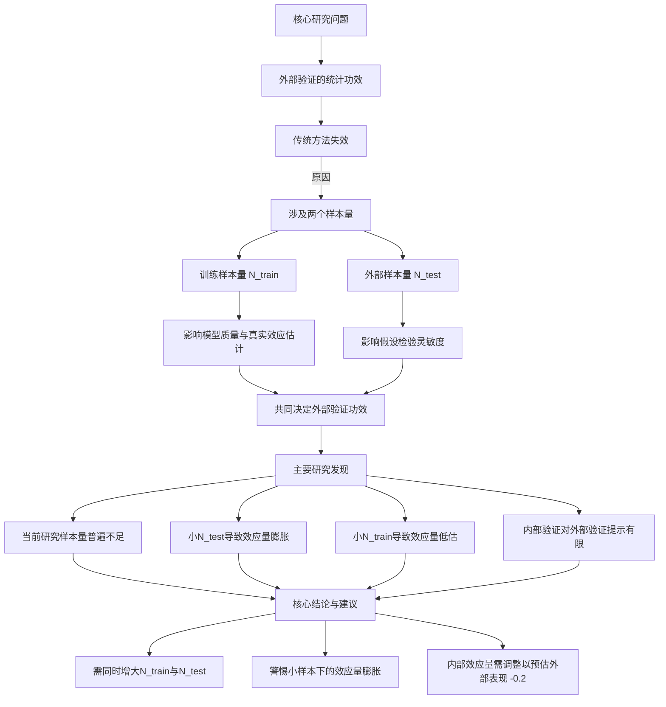

这篇《自然·人类行为》（*Nature Human Behaviour*）上的文章是一项关于**脑-表型预测模型外部验证**的实证研究。外部验证是评估模型泛化能力的黄金标准，但传统统计功效计算仅考虑单一样本量，不适用于同时涉及**训练集**和**外部测试集**的情况。本研究通过大规模模拟，系统揭示了样本量、效应大小与模型可重复性之间的关系，并指出当前多数外部验证研究样本量不足，导致**统计功效低下、假阴性率高、效应量膨胀**等问题。

以下是基于“读读专业版”框架对该论文的全面总结：

---

### **一、核心问题与研究目标**

*   **核心问题**：在神经影像预测研究中，**如何为外部验证研究设计足够的统计功效**？传统功效计算（仅依赖于效应大小和单一样本量）是否适用于涉及两个独立样本（训练集和外部测试集）的外部验证场景？
*   **研究目标**：
    1.  量化**训练样本量**和**外部样本量**如何共同影响外部验证的统计功效。
    2.  调查当前文献中外部验证研究的典型样本量是否充足。
    3.  探究**内部验证性能**是否能作为**外部验证性能**的可靠预测指标。
    4.  评估**数据集偏移**（如人群、测量工具差异）对泛化能力的影响。

### **二、研究方法与设计**

1.  **数据资源**：
    *   **核心数据集（静息态功能连接）**：美国的四个青少年发育队列——**HBN**、**ABCD**、**HCP-D**、**PNC**。
    *   **扩展数据集（用于敏感性分析）**：
        *   **结构连接数据**：HBN， HCP-D， **QTAB**（澳大利亚）， **CHCP**（中国）， **HCP**（成人）。
        *   **成人功能连接数据**：CHCP， HCP。
    *   **预测表型**：涵盖高、中、低效应大小的六类表型，包括年龄、BMI、矩阵推理、工作记忆、注意力问题、焦虑/抑郁症状。

2.  **模拟实验设计**：
    *   **重采样模拟**：在训练数据集中，从20到约6400的25个对数间隔样本量中随机抽取子集进行训练。对于每个训练出的模型，在外部数据集中同样抽取不同样本量的子集进行测试。
    *   **规模**：总计进行了超过**9亿次**模型训练与评估。
    *   **模型**：使用**岭回归**，采用特征选择（前1%相关特征）和内部交叉验证选择正则化参数。
    *   **评估指标**：主要使用**皮尔逊相关系数（r）**，辅以**平均绝对误差（MAE）**。

3.  **关键分析**：
    *   **文献调研**：回顾了2022-2023年54篇神经影像外部验证论文，获取当前研究的典型样本量范围。
    *   **功效与假阳性率计算**：对于每个（训练集， 外部集， 表型， 训练样本量， 外部样本量）组合，计算其模拟结果中达到统计显著（P<0.05）的比例。若其“真实效应”（用全样本训练的模型在完整外部集上的表现）显著，则该比例为**功效**；若不显著，则为**假阳性率**。
    *   **效应量膨胀分析**：考察显著结果中观测到的效应量与“真实效应”之间的差异。
    *   **内部与外部性能关联分析**：比较同一模型在内部留出测试集和完整外部数据集上的表现差异。

### **三、主要发现与结论**

1.  **当前研究的样本量普遍不足**：
    *   文献回顾发现，训练集中位数N=129，外部测试集中位数N=108。模拟显示，对于**中低效应量表型**，这样的样本量导致**统计功效极低**（常低于50%），容易产生假阴性。

2.  **外部验证的功效取决于两个样本量**：
    *   **训练样本量**：过小的训练集会导致模型质量差，低估真实效应，从而降低外部验证的表现和功效。
    *   **外部样本量**：直接影响假设检验的灵敏度。小的外部集需要非常大的效应量才能达到显著，这加剧了“发表偏倚”导致的**效应量膨胀**。
    *   **传统功效公式需修正**：传统公式 `power(r_truth, N_external)` 忽略了训练样本量对 `r_truth` 的调制作用。模拟显示，**必须同时增大两个样本量才能获得足够的外部验证功效**。

3.  **效应量膨胀与样本量的关系**：
    *   **小外部样本量**：是导致**效应量膨胀**（报告值远高于真实值）的主要原因，因为只有那些偶然获得极高效应量的模拟才能达到统计显著。
    *   **小训练样本量**：则常导致**效应量低估**，因为模型未能充分学习到真实关联。

4.  **内部验证对外部验证的提示作用有限**：
    *   在数据集经过较好协调（如使用相同测量工具）的情况下，内部验证性能（`r_internal`）与外部验证性能（`r_external`）差异通常小于0.2。
    *   然而，在存在明显**数据集偏移**（如跨国、不同测量工具）时，内部性能对外部性能的预测能力大大下降。**模型在内部验证中显著，并不能保证在外部验证中一定成功，但成功率更高**。

5.  **研究建议与指南**：
    *   **样本量选择**：
        *   **高效应量表型**（如年龄）：训练集和外部集各需数百样本。
        *   **中低效应量表型**：训练集和外部集可能需要**数千样本**才能获得足够功效（如80%）。
        *   **经验法则**：如果一个数据集小到你不愿意用它来训练模型，那么你也不应该用它作为外部测试集。
    *   **结果解读**：
        *   对于小样本外部验证的显著结果，应警惕**效应量膨胀**。
        *   在大型数据集中，即使微小的效应（如r=0.03）也可能因超大样本量而显著，此时应**同时报告并解释效应大小和P值**。
    *   **设计优化**：
        *   为提升功效，可尝试通过**延长扫描时间**、使用**纵向设计**或**改进行为测量**来增大效应量。
        *   选择外部数据集时，应优先考虑与训练集**高度协调**的数据，以减少数据集偏移。若无法避免偏移，可将内部验证的效应量**减去0.2**作为一个启发式调整，来预估外部验证的效应量。

### **四、研究的局限性与意义**

*   **局限性**：主要使用美国青少年数据；仅分析了多变量线性模型；未涵盖“完全独立复制”（重新运行整个分析流程）的场景。
*   **意义**：这是首个系统量化神经影像预测模型外部验证中样本量与统计功效关系的大规模研究。它为未来旨在提高**可重复性、泛化性和可信度**的神经影像预测研究提供了亟需的**实证依据和设计指南**，有助于推动该领域像遗传学（GWAS）一样，将**外部验证/复制**确立为标准实践。

---

### **图表辅助理解**

总而言之，这项研究为神经影像机器学习领域提供了至关重要的方法学洞见，强调**“更大、更协调的数据”** 是构建稳健、可泛化脑-行为模型的关键，并提供了具体的量化参考，以指导未来研究的严谨设计。
# hbn作用
这篇发表在《Nature Human Behaviour》上的研究《Power and reproducibility in the external validation of brain-phenotype predictions》主要探讨了在**脑-表型预测模型的外部验证中，如何合理设计训练集和外部测试集的样本量以提高统计功效（Power）和可重复性**。研究通过超过9亿次重采样模拟，分析了训练样本量、外部样本量、表型效应大小等因素对预测模型外部验证表现的影响。

---

## 📌 **HBN 数据集在本研究中的作用**

**HBN（Healthy Brain Network）数据集** 在本研究中扮演了**主要训练数据集**的角色，用于构建脑-表型预测模型，并评估其在不同外部数据集（如ABCD、HCPD、PNC）中的泛化能力。具体作用包括：

### 1. **作为主要训练集**
- 研究选择HBN作为“主要训练数据集”，因其样本量适中、年龄范围广（5–22岁），且包含多种表型测量，适合用于构建多变量预测模型。
- 研究人员在HBN上训练了**岭回归模型**，用于预测多种表型，包括：
  - 高效应量表型：年龄、BMIz（调整后的体重指数）
  - 中效应量表型：矩阵推理、工作记忆
  - 低效应量表型：注意力问题、焦虑/抑郁症状

### 2. **用于内部验证分析**
- 研究首先在HBN内部进行**内部验证**，即在HBN内部分出训练集和测试集，评估模型在相同数据中的表现。
- 结果发现，随着训练样本量的增加，高和中效应量表型的内部验证表现逐渐提升，而低效应量表型提升有限。

### 3. **作为外部验证的基准训练集**
- 研究人员将HBN训练的模型应用于其他三个外部数据集（ABCD、HCPD、PNC），进行**跨数据集外部验证**。
- 通过这种设计，研究人员可以评估模型在**数据集漂移**（dataset shift）情况下的泛化能力，即数据采集方式、人口特征、测量工具等方面的差异是否影响模型表现。

### 4. **用于样本量-功效关系分析**
- 研究在HBN上进行了大量重采样模拟，系统改变训练样本量（从20到6,396人），并评估在不同外部样本量下模型的预测性能。
- 通过这些模拟，研究人员发现：
  - **训练样本量和外部样本量均显著影响外部验证的统计功效**
  - **传统基于单一样本量的功效计算公式不适用于外部验证**

### 5. **与其他数据集的对比分析**
- 研究还将HBN与其他数据集（如结构连接数据集、国际数据集QTAB、CHCP等）进行对比，验证结论是否适用于不同模态（功能 vs. 结构）、不同国家、不同年龄段的数据集。

---

## ✅ **总结要点**

HBN数据集在本研究中是**核心训练集和基准集**，用于：

- 训练多变量脑-表型预测模型
- 进行内部验证和外部验证模拟
- 系统探索训练样本量与外部样本量对预测性能的影响
- 作为对比分析的基础，验证结论的普适性

研究最终提出建议：**未来进行脑-表型预测模型的外部验证时，应同时考虑训练集和外部测试集的样本量，并根据效应大小合理设计研究规模，以提高可重复性和泛化能力。**

如果需要，我可以进一步绘制一个**研究流程图**或**样本量-功效关系图**来帮助理解研究设计和HBN的作用。

以下是对您提供的《Nature Human Behaviour》论文《Power and reproducibility in the external validation of brain-phenotype predictions》的**结构化研究笔记总结**：

***

## (2024) Power and reproducibility in the external validation of brain-phenotype predictions

| <!-- --> |
| --------------------------------------------------------------------------------------------------------------------------------------------------------------------- |
| **期刊：** Nature Human Behaviour（发表日期：2024年7月31日在线发表） **作者：** Matthew Rosenblatt, Link Tejavibulya, Huili Sun, Chris C. Camp, Milana Khaitova, Brendan D. Adkinson, Rongtao Jiang, Margaret L. Westwater, Stephanie Noble, Dustin Scheinost (耶鲁大学等) |
| **摘要：** 脑-表型预测模型旨在识别可重复且可泛化的脑与行为/临床特征之间的关联。外部验证（在外部数据集上评估模型）是评估神经影像模型泛化能力的黄金标准。与典型研究不同，外部验证涉及两个样本量：训练集和外部验证集的样本量。因此，传统的统计功效计算可能不适用。本研究在功能和结构连接数据上进行了超过**9亿次基于重采样的模拟**，以探究训练样本量、外部样本量、表型效应大小、理论功效和模拟功效之间的关系。分析涵盖了广泛的数据集和表型。研究结果发现，高效应大小的预测（如年龄、BMI）仅需数百个样本即可获得足够的功效，而中低效应大小的预测（如工作记忆、注意问题、焦虑/抑郁症状）则需要数百至数千个训练和外部样本。此外，既往多数外部验证研究使用的样本量容易导致**低统计功效**，且理论功效曲线应根据训练样本量进行调整。本研究结果可为未来如何设计具有足够功效的外部验证研究提供指导。 |
| **摘要翻译：** 本研究通过大规模模拟，系统性地揭示了**脑-表型预测模型进行外部验证时，其统计功效如何同时受训练样本量、外部样本量和表型效应大小三者影响**。核心结论是：对于**低/中效应大小的关联**（常见于复杂认知或精神症状），要达到足够功效，通常需要远超当前领域常见做法（训练集和测试集各约100人）的样本量（数百甚至上千）。此外，研究发现，**内部验证的表现通常能提示外部验证的表现**（Pearson r 差异 < 0.2）。研究还量化了在低功效情境下**效应量膨胀**的风险。 |
| **期刊分区：** Nature Human Behaviour 是行为科学领域的顶级期刊，属于Q1分区，声誉极高。 |
| **原文PDF链接：** [Power and reproducibility in the external validation of brain-phenotype predictions](https://doi.org/10.1038/s41562-024-01931-7) |
| **笔记创建日期：** 2025/1/6 |

> **一句话总结**：这项大规模模拟研究首次全面评估了**脑-表型预测模型进行外部验证所需的样本量**，揭示了当前领域普遍存在的**低功效问题**，并明确指出，对于许多复杂表型而言，要获得可靠且可泛化的预测模型，训练集和外部验证集通常都需要达到**数百甚至数千的样本量**。

### 思维导图

```mermaid
graph TD
    A[脑表型预测模型外部验证的<br>统计功效与可重复性] --> B[核心目标与发现]
    B --> B1[核心问题]
    B1 --> B11[外部验证的统计功效如何取决于<br>训练样本量与外部验证样本量？]
    B --> B2[主要发现]
    B2 --> B21[外部验证功效同时取决于<br>训练集和外部验证集的样本量]
    B2 --> B22[既往研究普遍样本量不足，<br>导致统计功效过低]
    B2 --> B23[内部验证表现可有效提示<br>外部验证的表现]

    A --> C[研究背景与动机]
    C --> C1[神经影像预测模型的泛化挑战]
    C1 --> C11[内部验证无法完全保证模型泛化性]
    C1 --> C12[外部验证是评估泛化性的黄金标准]
    C1 --> C13[外部数据集常存在“数据集偏移”问题]
    C --> C2[传统统计功效方法的局限性]
    C2 --> C21[仅考虑单一样本量]
    C2 --> C22[不适用于涉及两个独立样本的<br>外部验证场景]
    C --> C3[领域现状]
    C3 --> C31[现有外部验证研究样本量中位数仅约100人]

    A --> D[研究方法：大规模重采样模拟]
    D --> D1[数据集与表型]
    D1 --> D11[功能连接数据<br>HBN, ABCD, HCPD, PNC]
    D11 --> D111[美国青少年样本]
    D1 --> D12[结构连接数据<br>HBN, HCPD, QTAB, CHCP, HCP]
    D12 --> D121[扩展至成人与跨国样本]
    D1 --> D13[预测表型分类]
    D13 --> D131[高效应表型：年龄, BMIz]
    D13 --> D132[中/低效应表型：矩阵推理、工作记忆、<br>注意问题、焦虑抑郁症状]
    D --> D2[预测模型]
    D2 --> D21[方法：岭回归]
    D2 --> D22[控制协变量]
    D2 --> D23[特征选择：前1%特征]
    D --> D3[重采样设计]
    D3 --> D31[系统变化：训练样本量 × 外部样本量]
    D3 --> D32[重复次数：每种组合重复100次]
    D --> D4[评价指标]
    D4 --> D41[预测准确度：预测值与真实值的Pearson's r]
    D4 --> D42[预测误差：平均绝对误差]
    D --> D5[核心分析]
    D5 --> D51[统计功效模拟]
    D5 --> D52[假阳性率估计]
    D5 --> D53[效应量膨胀/收缩评估]

    A --> E[主要结果：功效与样本量的关系]
    E --> E1[关键规律]
    E1 --> E11[外部验证功效同时受<br>训练集和外部验证集样本量的影响]
    E1 --> E12[高效应表型：数百样本可达高功效]
    E1 --> E13[中/低效应表型：需要数百至数千样本]
    E --> E2[样本量配置不当的风险]
    E2 --> E21[小训练样本 + 大外部样本<br>容易产生假阳性结果]
    E2 --> E22[小外部样本<br>容易导致效应量估计膨胀]
    E --> E3[方法学启示]
    E3 --> E31[理论功效曲线需根据训练样本量进行校正<br>（因训练样本量影响真实预测精度r）]

    A --> F[主要结果：内部与外部表现的关系]
    F --> F1[内部验证作为实用指标]
    F1 --> F11[内部验证与外部验证的<br>预测精度r差异通常小于0.2]
    F1 --> F111[在数据协调良好的情况下差异更小]
    F1 --> F12[内部验证显著的模型<br>在外部验证中也更容易显著]
    F --> F2[数据集偏移的影响]
    F2 --> F21[数据集偏移会增大<br>内部与外部表现之间的差异]
    F2 --> F22[例如：跨国样本间差异更明显]

    A --> G[讨论与建议]
    G --> G1[对研究实践的具体建议]
    G1 --> G11[样本量规划]
    G11 --> G111[训练集和外部验证集<br>都应尽可能扩大样本量]
    G1 --> G12[结果报告与解读]
    G12 --> G121[应报告效应大小而非仅p值]
    G12 --> G122[警惕小样本下效应量的膨胀]
    G1 --> G13[指导原则]
    G13 --> G131[“如果一个数据集的样本量小到<br>你不愿用它训练模型，<br>那你也不应仅用它做外部验证”]
    G --> G2[提升统计功效的潜在途径]
    G2 --> G21[个体数据量增加]
    G21 --> G211[延长扫描时长对内部验证有益]
    G21 --> G212[但对提升外部验证功效作用有限]
    G2 --> G22[减少数据集偏移]
    G22 --> G221[协调测量工具与协议]
    G22 --> G222[使用多样化、代表性强的样本]
    G --> G3[领域发展方向]
    G3 --> G31[鼓励发表非显著的外部验证结果<br>避免发表偏倚]
    G3 --> G32[外部验证有助于解决<br>机器学习中的偏见与可信度问题]

    style A fill:#e8f5e8,stroke:#2e7d32,stroke-width:2px
    style B fill:#fff3e0,stroke:#f57c00
    style C fill:#e3f2fd,stroke:#1565c0
    style D fill:#fce4ec,stroke:#c2185b
    style E fill:#fff8e1,stroke:#ff8f00
    style F fill:#e8f5e8,stroke:#2e7d32
    style G fill:#e3f2fd,stroke:#1565c0
```

## 1️⃣ 论文试图解决什么问题？(What is the problem?)

### 背景
> 神经影像领域日益依赖大型数据集和预测模型来探究脑与行为/临床表型之间的关联。然而，该领域仍面临严重的**可重复性挑战**。传统的关联研究（Association）统计效力低，易产生假阳性、效应量膨胀和复制失败。预测框架（Prediction）通过评估模型在未见数据上的表现，在一定程度上缓解了这个问题。然而，常用的**内部验证**（如交叉验证）仍可能使模型过拟合到特定数据集的特性上，无法完全保证其**泛化性**。**外部验证**，即将训练好的模型应用于一个完全独立的数据集，被认为是评估模型泛化能力的黄金标准。随着公开数据集的增多，外部验证正变得越来越普遍。

### 框架
> *   **核心科学问题**：在脑-表型预测模型中，**外部验证的统计功效**（即成功检测到真实效应的概率）如何同时受到**训练数据集样本量**和**外部验证数据集样本量**的影响？传统的统计功效计算仅考虑单个样本量，这对于涉及两个独立样本的外部验证情景是否适用？
> *   **具体研究目标**：
>     1.  **量化影响**：通过大规模重采样模拟，系统性地描绘训练样本量 \( N_{training} \)、外部样本量 \( N_{external} \) 和表型效应大小对**外部验证功效**的影响。
>     2.  **评估现状**：将模拟结果与领域内现有外部验证研究的样本量现状进行比较，评估当前研究的**统计功效是否充足**。
>     3.  **探究关系**：探究**内部验证表现**（在训练集内部通过留出法或交叉验证得到）与**外部验证表现**之间的关系，判断内部验证能否作为外部表现的有效预测指标。
>     4.  **揭示风险**：量化在低功效设置下，**效应量膨胀**（inflation）和**假阳性/阴性**的风险。
>     5.  **提供指导**：为未来设计具有足够统计功效的外部验证研究提供实证依据和建议。

### 结论
> *   **双样本量共同决定功效**：研究明确证实，外部验证的统计功效**同时且独立地依赖于训练样本量和外部样本量**。仅靠增大外部验证集无法补偿小训练集带来的模型质量低下，反之亦然。
> *   **领域普遍低功效**：通过对2022-2023年文献的调查，发现已发表的外部验证研究中，训练集和外部验证集的样本量**中位数分别仅为129和108**。模拟结果表明，对于中、低效应大小的表型（如工作记忆、注意问题、焦虑/抑郁症状），这样的样本量配置**统计功效严重不足**（远低于80%），极易导致假阴性或效应量膨胀的假阳性。
> *   **所需样本量远大于当前实践**：要达到足够的功效（例如>80%），对于高效应表型（如年龄、BMI）需要训练集和外部集各数百样本；而对于更常见的中、低效应表型，则需要**训练集和外部集均达到数百甚至上千的样本量**。
> *   **内部验证作为实用代理**：研究发现，在数据集协调良好（harmonized）的情况下，模型在内部验证（留出集）上的表现（\( r_{internal} \)）与其在外部验证集上的表现（\( r_{external} \)）通常差异不大（差值 < 0.2）。因此，**内部验证的效应大小可作为估计外部验证效应大小的一个有用启发式**，尽管需要根据数据集间的差异进行调整。
> *   **理论功效计算需修正**：传统的基于相关性的功效计算公式（仅含 \( N_{external} \) 和 \( r_{ground\ truth} \)）不直接适用。因为训练样本量通过影响模型估计的“真实”效应大小（\( r_{ground\ truth} \)），间接而深刻地影响着最终功效。小训练样本会低估真实效应，从而降低功效。

## 2️⃣ 核心思想/创新点是什么？(What is the core idea?)

*   **将“统计功效”概念正式引入预测模型的外部验证场景**：这是本研究最核心的理论贡献。它将传统假设检验中的“统计功效”概念，创造性地迁移并重新定义了适用于**机器学习预测模型外部验证**的新框架。它明确指出了一个长期被忽视的事实：外部验证的“成功”（即显著预测）不仅取决于外部数据集的规模，还**根本性地取决于训练出那个模型的原始数据集的规模和质量**。这突破了传统功效分析仅考虑单一样本量的思维定式。
*   **“超大规模模拟”作为实证检验方法论问题的手段**：研究没有停留于理论推导，而是采用了极其**务实且具有说服力的方法**：在**超过9亿次的模型训练与测试循环**中，通过系统性地操控 \( N_{training} \) 和 \( N_{external} \) 这两个关键变量，直接观察统计功效、效应量估计等指标如何变化。这种基于真实数据的重采样模拟，比纯理论推导更能捕捉神经影像数据（如功能连接矩阵）的复杂性和数据集间的异质性（dataset shift），所得结论更具现实指导意义。
*   **为“大样本时代”的神经影像预测研究提供“剂量-反应”曲线**：研究结果本质上提供了一系列 **“剂量-反应”关系图（等值线图）**。它告诉研究者：如果你想预测某个效应大小的表型，并期望达到某个水平的统计功效，那么你的训练集和外部验证集分别需要达到多大的样本量。这为规划未来研究（例如，决定使用哪个数据集进行训练，需要收集或寻找多大样本量的外部数据）提供了**定量的、基于证据的决策工具**，而不再是凭感觉或惯例。
*   **连接“内部验证”与“外部验证”，架起可操作性的桥梁**：研究发现内部与外部验证表现通常相关性较高，这为资源有限的研究者提供了一个**实用的中间指标**。在无法立即进行大规模外部验证时，可以先用内部验证（交叉验证）的结果对模型潜力进行初步评估。这降低了外部验证的门槛，并使其更具可操作性。同时，研究也量化了数据集偏移可能带来的表现衰减（约0.2的r值差异），给出了一个经验性的调整系数。
*   **对当前研究实践发出“低功效”的明确警告，并剖析其后果**：研究通过对近期文献的综述，有力地论证了当前领域的外部验证研究普遍处于**低功效**状态。这不仅意味着许多阴性结果可能是假阴性，更关键的是，那些在低功效设置下侥幸达到“显著”的阳性结果，其报告的效应量极有可能是**严重膨胀的**。这直接指向了神经影像预测文献中可能普遍存在的效应量夸大问题，并解释了为什么许多模型难以在独立数据集中复现。

## 3️⃣ 方法是怎么实现的？(How does it work?)

### 数据以及数据来源
*   **主要数据集（功能连接，美国青少年）**：
    *   **Healthy Brain Network** (HBN): ~1,200人，5-22岁。
    *   **Adolescent Brain Cognitive Development Study** (ABCD): ~8,000人，9-11岁。
    *   **Human Connectome Project Development** (HCPD): ~600人，8-22岁。
    *   **Philadelphia Neurodevelopmental Cohort** (PNC): ~1,200人，8-21岁。
*   **扩展数据集（用于敏感性分析）**：
    *   **结构连接**：HBN, HCPD, **Queensland Twin Adolescent Brain Project** (QTAB，澳大利亚青少年双生子)，**Chinese Human Connectome Project** (CHCP，中国成人)，**Human Connectome Project** (HCP，美国成人)。
    *   **功能连接**：CHCP, HCP（成人）。
*   **表型（按内部验证效应大小分类）**：
    *   **高效应** (\( r \geq 0.4 \))：年龄，年龄/性别校正的BMI (BMIz)。
    *   **中效应** (\( 0.15 \leq r < 0.4 \))：矩阵推理，工作记忆。
    *   **低效应** (\( r < 0.15 \))：注意问题（CBCL），焦虑/抑郁症状。

### 方法
#### 架构与管道设计:
1.  **数据预处理**：
    *   **功能连接**：使用BioImage Suite进行标准化预处理，包括去噪、头动参数回归、全局信号回归等。使用Shen-268脑图谱进行分区，计算皮尔逊相关得到功能连接矩阵，并进行Fisher z变换。
    *   **结构连接**：使用DSI Studio进行纤维束追踪，基于Shen-268图谱构建结构连接矩阵（以定量各向异性QA为连接强度）。
2.  **预测模型构建**：
    *   **基础模型**：**岭回归**。
    *   **建模流程**：
        a. **协变量回归**：在训练集上，对脑特征回归掉协变量（性别、头动、年龄（预测年龄时除外））。
        b. **特征选择**：选取与目标表型**单变量相关性最高**的**前1%** 的连接特征。
        c. **模型训练与调参**：在训练集内进行**5折交叉验证**，通过网格搜索选择岭回归的L2正则化超参数。
    *   **评价指标**：主要使用**预测值与真实值的Pearson相关系数 \( r \)**，辅以**标准化后的平均绝对误差**。
3.  **重采样模拟核心设计**：
    *   **内部验证模拟**：从一个数据集中，随机抽取不同大小的训练子集（\( N_{training} \) 从20到6396，对数间隔），并在一个固定的留出集（约占数据集的20%）上评估模型。
    *   **外部验证模拟**：
        a. 指定一个数据集为“训练数据集”，另一个为“外部验证数据集”。
        b. 从训练数据集中随机抽取不同大小的训练子集（\( N_{training} \)）。
        c. 对于每个训练好的模型，从外部验证数据集中随机抽取不同大小的测试子集（\( N_{external} \)）进行评价。
    *   **重复与迭代**：每个 \( (N_{training}, N_{external}) \) 组合，重复随机采样**100次**（训练集）x **100次**（外部测试集）= **10,000次** 模型评估。总计进行了超过9亿次模型评估。
4.  **核心指标计算**：
    *   **功效**：对于在“全数据集”上训练和测试具有显著“真实效应”（\( r_{ground\ truth} \)）的模型，计算在特定 \( (N_{training}, N_{external}) \) 下，模拟结果中达到统计显著（\( p < 0.05 \)，单侧检验）的比例。
    *   **假阳性率**：对于“真实效应”不显著的模型，计算模拟结果中错误地达到显著的比例。
    *   **效应量膨胀/收缩**：在显著的结果中，计算报告的 \( r \) 与真实 \( r_{ground\ truth} \) 的差异中位数（\( \Delta r \)）。
    *   **内外表现差异**：计算同一训练子集下，模型在内部留出集上的 \( r_{internal} \) 与在整个外部数据集上的 \( r_{external} \) 的差异。

### 结论
通过这套**严谨、全面且计算量巨大的模拟框架**，研究成功地刻画了训练样本量、外部样本量和表型效应大小这三个关键变量，如何共同塑造了外部验证研究的统计属性（功效、假阳性率、效应量估计偏倚）。其方法的透明度和可重复性（代码开源）是本研究的一大亮点。

## 4️⃣ 效果如何？(How is the performance?)

### 主要结果:
1.  **外部验证功效图谱**：
    *   **高效应表型**（如年龄）：当训练和外部样本量均达到约**200-300**时，功效可接近100%。
    *   **中效应表型**（如矩阵推理）：需要训练和外部样本量均达到**约500-1000**，才能获得>80%的功效。
    *   **低效应表型**（如注意问题）：即使训练和外部样本量都很大（>1000），功效也往往低于50%，表明检测此类微弱信号极其困难。
    *   **不对称影响**：**小训练样本量**是导致功效低下和效应量**低估**（收缩）的主要因素。而**小外部样本量**则与**效应量膨胀**密切相关，因为只有那些因随机波动而效应量异常高的样本才能达到统计显著。
2.  **与领域现状的对比**：
    *   文献调研显示，已发表外部验证研究的训练和外部样本量中位数约为 **129** 和 **108**。
    *   模拟表明，对于中、低效应表型，**这个样本量范围对应的功效非常低**（常低于30%）。这意味着许多已发表的阴性结果很可能是假阴性，而发表的阳性结果其效应量可能被严重高估。
3.  **效应量膨胀的量化**：
    *   在低功效设置下（尤其是小外部样本量时），显著结果中观察到的效应量中位数可能比真实效应量高出 **0.2-0.4**（以r为单位）。这是对发表偏倚和低统计功效共同作用导致效应量膨胀现象的直观量化。
4.  **内部与外部表现的关系**：
    *   在数据协调相对较好的美国青少年数据集中，内部验证表现（\( r_{internal} \)）与外部验证表现（\( r_{external} \)）的差异中位数通常 **< 0.2**。在训练样本量接近领域现状（N=137）时，约85%的模拟结果满足 \( |r_{internal} - r_{external}| < 0.2 \)。
    *   这一关系在数据集差异较大时（如跨国、不同年龄范围）会减弱，但总体趋势仍存在：内部验证表现好的模型，在外部验证中表现也倾向于更好。
5.  **跨模态与跨人群的稳健性**：
    *   上述关于功效、样本量和效应量膨胀的核心结论，在**结构连接数据**、**成人数据**以及**跨国数据**（如澳大利亚QTAB、中国CHCP）的敏感性分析中均得到重复，表明研究结论具有广泛的普遍性。
6.  **扫描时长的影响**：
    *   增加静息态扫描时长（从5分钟到20分钟）能提升**内部验证**的表现，但对**外部验证**的功效和表现提升有限。这表明，当存在显著的数据集偏移时，增加单个被试的信噪比可能无法有效提升模型的跨数据集泛化能力。

## 5️⃣ 有什么优点和缺点？(What are the strengths and weaknesses?)

### 优点
1.  **问题至关重要且时机精准**：外部验证是神经影像预测模型迈向临床和应用的关键步骤，但对其统计属性的系统研究几乎空白。本研究**填补了这一核心方法论空白**，对提升领域研究的严谨性和可重复性具有直接且重大的影响。
2.  **方法设计精妙、规模空前**：
    *   **双变量系统操控**：同时、独立地操控 \( N_{training} \) 和 \( N_{external} \)，这是揭示其各自作用和交互影响的关键。
    *   **超大规模模拟**：超过9亿次模型评估提供了极其稳定和可靠的估计，使结论高度可信。
    *   **广泛的敏感性分析**：涵盖了功能/结构连接、青少年/成人、美国/澳大利亚/中国数据集，极大地增强了结论的**稳健性和泛化性**。
3.  **结果直观、实用性强**：
    *   绘制的**功效等值线图**和**效应量膨胀图**为研究者提供了清晰的“路线图”。
    *   提出的**经验法则**（如“内外表现差异<0.2”、“如果一个数据集小到你不愿用来训练，也不应仅用它来验证”）易于理解和应用。
    *   对当前领域**低功效现状的警示**具有重要的“纠偏”作用。
4.  **高度透明与可重复**：代码和数据完全公开，分析流程描述详尽，为其他研究者验证、扩展和应用此方法提供了极大便利。

### 缺点/局限
1.  **模型与特征的特定性**：
    *   研究仅使用了**岭回归**和基于单变量相关性的**前1%特征选择**。虽然这是常用且合理的基线方法，但不同模型（如弹性网络、非线性模型）和特征工程策略可能会影响功效与样本量的具体关系。
    *   使用的**Shen-268脑图谱**是一种特定分区方案，不同图谱（如基于网络的）可能带来差异。
2.  **“真实效应”定义的局限性**：
    *   “真实效应”（\( r_{ground\ truth} \)）是在“全数据集”上估计的。然而，即使是这些大型公开数据集，其样本量对于估计极低效应大小的“真实”值仍可能不足。此外，“真实效应”本身可能因训练集和外部集的不同配对而变化（数据集偏移），这增加了问题的复杂性。
3.  **未深入探索数据集偏移的异质性**：
    *   研究虽然包含了存在数据集偏移的情况（如不同国家、不同测量工具），但并未系统性地建模和量化**偏移的类型与程度**如何具体地调节功效和内外表现差异。这是一个更复杂但重要的未来方向。
4.  **关注预测而非因果**：研究完全聚焦于预测的准确性（r）和统计显著性，未涉及模型的可解释性或其背后潜在的因果机制。一个高功效下显著的预测模型，其生物学或临床意义仍需谨慎解读。
5.  **计算成本极高**：虽然对社区是宝贵的资源，但其模拟所需的巨大计算量（9亿次模型拟合）使得其他研究者难以为了自己的特定研究问题（如不同模型、不同脑特征）进行类似的全面模拟。

## 6️⃣ 借鉴学习

### 1个思路
> **通过“前瞻性模拟”为研究设计提供定量依据**：本研究展示了一种强大的研究设计思路——**在正式开展一项昂贵或耗时的研究（如收集新数据用于外部验证）之前，利用现有公开数据进行大规模重采样模拟，来预估不同设计选择下的可能结果和统计属性**。具体步骤：1) **明确关键变量**：确定影响结果的核心变量（如本研究的 \( N_{train}, N_{test}, 效应大小 \)）。2) **构建模拟框架**：基于一个或几个大型基准数据集，编写可系统操控这些变量的重采样代码。3) **运行模拟实验**：遍历参数空间，计算关键指标（功效、效应量估计偏倚、变异度等）。4) **绘制决策图表**：将结果可视化为等值线图或热图，直观显示要达到目标性能所需的条件。这种“模拟先行”的策略能将研究设计从经验主导转变为**证据主导**，显著提升资源的利用效率和研究的成功率。尤其适用于机器学习和预测建模领域。

### 2个绘图/呈现方式
> **（双变量功效等值线图 - 如图4）**：这是本研究最具代表性的成果图。它同时以**训练样本量**（y轴，对数尺度）和**外部样本量**（x轴，对数尺度）为坐标轴，用**颜色等高线**表示统计功效（0到1）。这种图的神奇之处在于，它能让你一眼看出：要达到某个功效水平（例如80%的粉色区域），训练集和外部集需要怎样的组合。它清晰揭示了两个样本量的**互补而非替代**关系：沿着对角线方向移动（同时增加两者）功效提升最快；如果只有一个样本量很大而另一个很小，功效仍可能很低（对应图角落的蓝色区域）。这种可视化方式非常适合呈现两个连续变量共同决定一个结果的情况。
> **（效应量膨胀/收缩热图 - 如图6）**：与功效图类似，但颜色代表的是在显著结果中，观察到的效应量中位数与真实效应量的差值（\( \Delta r \)）。暖色（红色/橙色）表示**膨胀**（观察值 > 真实值），冷色（蓝色）表示**收缩**（观察值 < 真实值）。这张图直观地警告研究者：在**小外部样本量**的区域（图左侧），效应量膨胀非常严重（大片红色）。而在**小训练样本量**的区域（图底部），即使外部样本量大，效应量也可能被低估（蓝色）。这种图将低统计功效的严重后果——**偏倚的效应量估计**——直接可视化，比单纯的文字警告有力得多。

### 1个技术细节
> **在重采样中正确处理数据结构（如家庭结构）**：本研究涉及的数据集（如ABCD、QTAB）包含家庭或双生子数据，即个体间非独立。在进行重采样以构建训练集和测试集时，必须确保来自**同一家庭的个体被同时分配到同一集合**（要么全在训练集，要么全在测试集），否则会因数据泄漏严重高估模型性能。本研究在方法部分明确提到了这一点（“family structure was accounted for”）。这看似是一个细节，但对于保证模拟结果的真实性至关重要。当使用具有层级或簇状结构的数据（如多站点研究、纵向测量、家庭研究）进行任何形式的交叉验证或重采样时，都必须遵循类似的**“簇层面”的采样策略**，而不是简单地对个体进行随机抽样。忽略数据结构是机器学习在神经影像应用中一个常见但严重的错误。