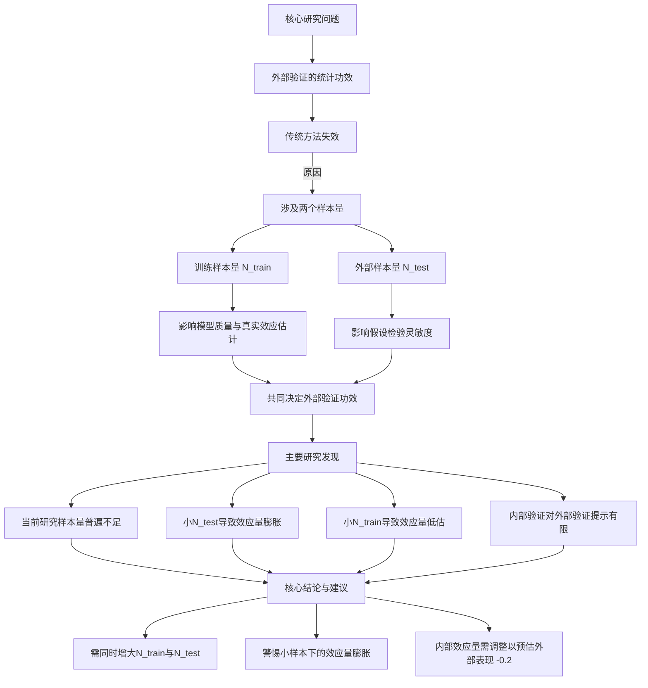

这篇《自然·人类行为》（*Nature Human Behaviour*）上的文章是一项关于**脑-表型预测模型外部验证**的实证研究。外部验证是评估模型泛化能力的黄金标准，但传统统计功效计算仅考虑单一样本量，不适用于同时涉及**训练集**和**外部测试集**的情况。本研究通过大规模模拟，系统揭示了样本量、效应大小与模型可重复性之间的关系，并指出当前多数外部验证研究样本量不足，导致**统计功效低下、假阴性率高、效应量膨胀**等问题。

以下是基于“读读专业版”框架对该论文的全面总结：

---

### **一、核心问题与研究目标**

*   **核心问题**：在神经影像预测研究中，**如何为外部验证研究设计足够的统计功效**？传统功效计算（仅依赖于效应大小和单一样本量）是否适用于涉及两个独立样本（训练集和外部测试集）的外部验证场景？
*   **研究目标**：
    1.  量化**训练样本量**和**外部样本量**如何共同影响外部验证的统计功效。
    2.  调查当前文献中外部验证研究的典型样本量是否充足。
    3.  探究**内部验证性能**是否能作为**外部验证性能**的可靠预测指标。
    4.  评估**数据集偏移**（如人群、测量工具差异）对泛化能力的影响。

### **二、研究方法与设计**

1.  **数据资源**：
    *   **核心数据集（静息态功能连接）**：美国的四个青少年发育队列——**HBN**、**ABCD**、**HCP-D**、**PNC**。
    *   **扩展数据集（用于敏感性分析）**：
        *   **结构连接数据**：HBN， HCP-D， **QTAB**（澳大利亚）， **CHCP**（中国）， **HCP**（成人）。
        *   **成人功能连接数据**：CHCP， HCP。
    *   **预测表型**：涵盖高、中、低效应大小的六类表型，包括年龄、BMI、矩阵推理、工作记忆、注意力问题、焦虑/抑郁症状。

2.  **模拟实验设计**：
    *   **重采样模拟**：在训练数据集中，从20到约6400的25个对数间隔样本量中随机抽取子集进行训练。对于每个训练出的模型，在外部数据集中同样抽取不同样本量的子集进行测试。
    *   **规模**：总计进行了超过**9亿次**模型训练与评估。
    *   **模型**：使用**岭回归**，采用特征选择（前1%相关特征）和内部交叉验证选择正则化参数。
    *   **评估指标**：主要使用**皮尔逊相关系数（r）**，辅以**平均绝对误差（MAE）**。

3.  **关键分析**：
    *   **文献调研**：回顾了2022-2023年54篇神经影像外部验证论文，获取当前研究的典型样本量范围。
    *   **功效与假阳性率计算**：对于每个（训练集， 外部集， 表型， 训练样本量， 外部样本量）组合，计算其模拟结果中达到统计显著（P<0.05）的比例。若其“真实效应”（用全样本训练的模型在完整外部集上的表现）显著，则该比例为**功效**；若不显著，则为**假阳性率**。
    *   **效应量膨胀分析**：考察显著结果中观测到的效应量与“真实效应”之间的差异。
    *   **内部与外部性能关联分析**：比较同一模型在内部留出测试集和完整外部数据集上的表现差异。

### **三、主要发现与结论**

1.  **当前研究的样本量普遍不足**：
    *   文献回顾发现，训练集中位数N=129，外部测试集中位数N=108。模拟显示，对于**中低效应量表型**，这样的样本量导致**统计功效极低**（常低于50%），容易产生假阴性。

2.  **外部验证的功效取决于两个样本量**：
    *   **训练样本量**：过小的训练集会导致模型质量差，低估真实效应，从而降低外部验证的表现和功效。
    *   **外部样本量**：直接影响假设检验的灵敏度。小的外部集需要非常大的效应量才能达到显著，这加剧了“发表偏倚”导致的**效应量膨胀**。
    *   **传统功效公式需修正**：传统公式 `power(r_truth, N_external)` 忽略了训练样本量对 `r_truth` 的调制作用。模拟显示，**必须同时增大两个样本量才能获得足够的外部验证功效**。

3.  **效应量膨胀与样本量的关系**：
    *   **小外部样本量**：是导致**效应量膨胀**（报告值远高于真实值）的主要原因，因为只有那些偶然获得极高效应量的模拟才能达到统计显著。
    *   **小训练样本量**：则常导致**效应量低估**，因为模型未能充分学习到真实关联。

4.  **内部验证对外部验证的提示作用有限**：
    *   在数据集经过较好协调（如使用相同测量工具）的情况下，内部验证性能（`r_internal`）与外部验证性能（`r_external`）差异通常小于0.2。
    *   然而，在存在明显**数据集偏移**（如跨国、不同测量工具）时，内部性能对外部性能的预测能力大大下降。**模型在内部验证中显著，并不能保证在外部验证中一定成功，但成功率更高**。

5.  **研究建议与指南**：
    *   **样本量选择**：
        *   **高效应量表型**（如年龄）：训练集和外部集各需数百样本。
        *   **中低效应量表型**：训练集和外部集可能需要**数千样本**才能获得足够功效（如80%）。
        *   **经验法则**：如果一个数据集小到你不愿意用它来训练模型，那么你也不应该用它作为外部测试集。
    *   **结果解读**：
        *   对于小样本外部验证的显著结果，应警惕**效应量膨胀**。
        *   在大型数据集中，即使微小的效应（如r=0.03）也可能因超大样本量而显著，此时应**同时报告并解释效应大小和P值**。
    *   **设计优化**：
        *   为提升功效，可尝试通过**延长扫描时间**、使用**纵向设计**或**改进行为测量**来增大效应量。
        *   选择外部数据集时，应优先考虑与训练集**高度协调**的数据，以减少数据集偏移。若无法避免偏移，可将内部验证的效应量**减去0.2**作为一个启发式调整，来预估外部验证的效应量。

### **四、研究的局限性与意义**

*   **局限性**：主要使用美国青少年数据；仅分析了多变量线性模型；未涵盖“完全独立复制”（重新运行整个分析流程）的场景。
*   **意义**：这是首个系统量化神经影像预测模型外部验证中样本量与统计功效关系的大规模研究。它为未来旨在提高**可重复性、泛化性和可信度**的神经影像预测研究提供了亟需的**实证依据和设计指南**，有助于推动该领域像遗传学（GWAS）一样，将**外部验证/复制**确立为标准实践。

---

### **图表辅助理解**

总而言之，这项研究为神经影像机器学习领域提供了至关重要的方法学洞见，强调**“更大、更协调的数据”** 是构建稳健、可泛化脑-行为模型的关键，并提供了具体的量化参考，以指导未来研究的严谨设计。
# hbn作用
这篇发表在《Nature Human Behaviour》上的研究《Power and reproducibility in the external validation of brain-phenotype predictions》主要探讨了在**脑-表型预测模型的外部验证中，如何合理设计训练集和外部测试集的样本量以提高统计功效（Power）和可重复性**。研究通过超过9亿次重采样模拟，分析了训练样本量、外部样本量、表型效应大小等因素对预测模型外部验证表现的影响。

---

## 📌 **HBN 数据集在本研究中的作用**

**HBN（Healthy Brain Network）数据集** 在本研究中扮演了**主要训练数据集**的角色，用于构建脑-表型预测模型，并评估其在不同外部数据集（如ABCD、HCPD、PNC）中的泛化能力。具体作用包括：

### 1. **作为主要训练集**
- 研究选择HBN作为“主要训练数据集”，因其样本量适中、年龄范围广（5–22岁），且包含多种表型测量，适合用于构建多变量预测模型。
- 研究人员在HBN上训练了**岭回归模型**，用于预测多种表型，包括：
  - 高效应量表型：年龄、BMIz（调整后的体重指数）
  - 中效应量表型：矩阵推理、工作记忆
  - 低效应量表型：注意力问题、焦虑/抑郁症状

### 2. **用于内部验证分析**
- 研究首先在HBN内部进行**内部验证**，即在HBN内部分出训练集和测试集，评估模型在相同数据中的表现。
- 结果发现，随着训练样本量的增加，高和中效应量表型的内部验证表现逐渐提升，而低效应量表型提升有限。

### 3. **作为外部验证的基准训练集**
- 研究人员将HBN训练的模型应用于其他三个外部数据集（ABCD、HCPD、PNC），进行**跨数据集外部验证**。
- 通过这种设计，研究人员可以评估模型在**数据集漂移**（dataset shift）情况下的泛化能力，即数据采集方式、人口特征、测量工具等方面的差异是否影响模型表现。

### 4. **用于样本量-功效关系分析**
- 研究在HBN上进行了大量重采样模拟，系统改变训练样本量（从20到6,396人），并评估在不同外部样本量下模型的预测性能。
- 通过这些模拟，研究人员发现：
  - **训练样本量和外部样本量均显著影响外部验证的统计功效**
  - **传统基于单一样本量的功效计算公式不适用于外部验证**

### 5. **与其他数据集的对比分析**
- 研究还将HBN与其他数据集（如结构连接数据集、国际数据集QTAB、CHCP等）进行对比，验证结论是否适用于不同模态（功能 vs. 结构）、不同国家、不同年龄段的数据集。

---

## ✅ **总结要点**

HBN数据集在本研究中是**核心训练集和基准集**，用于：

- 训练多变量脑-表型预测模型
- 进行内部验证和外部验证模拟
- 系统探索训练样本量与外部样本量对预测性能的影响
- 作为对比分析的基础，验证结论的普适性

研究最终提出建议：**未来进行脑-表型预测模型的外部验证时，应同时考虑训练集和外部测试集的样本量，并根据效应大小合理设计研究规模，以提高可重复性和泛化能力。**

如果需要，我可以进一步绘制一个**研究流程图**或**样本量-功效关系图**来帮助理解研究设计和HBN的作用。