以下是对论文《Domain adapted brain network fusion captures variance related to pubertal brain development and mental health》的**读读模式专业版总结**，并分析**HBN数据集在文中的作用**。

---

## 📘 一、论文核心内容总结

### 1. **研究背景与问题**
- 青春期是大脑结构与功能剧烈变化的时期，与心理健康密切相关。
- 高维多模态脑影像数据存在维度灾难问题，难以有效整合并捕捉个体发育轨迹。
- 传统基于相似性网络的融合方法（如SNF）在新样本加入时稳定性不足，限制了其在纵向和临床研究中的应用。

### 2. **研究方法**
- **核心框架**：提出一种**领域自适应脑网络融合框架**，分为三步：
  1. **相似性网络融合（SNF） + 扩散映射嵌入**：从源数据集（PNC）构建低维脑嵌入空间。
  2. **机器学习模型训练 + 领域自适应**：使用Elastic Net和Transfer AdaBoost算法，将源模型迁移到目标数据集（ABCD、HBN）。
  3. **模型预测**：在新数据（包括纵向和临床样本）中预测脑嵌入分数。
- **数据集**：
  - **PNC**：源数据集，用于训练初始模型。
  - **ABCD**：纵向青少年队列，用于验证发育动态。
  - **HBN**：临床队列，用于验证与精神病理的关联。

### 3. **主要发现**
- **模型性能**：在未见过的ABCD和HBN数据中表现良好（R² = 0.65–0.79），说明模型具有良好的泛化能力。
- **青春期关联**：
  - 脑嵌入分数与青春期发育（PDS评分）显著相关，尤其在女性中更为明显。
  - 纵向分析显示，Δ脑嵌入分数（两次时间点间的变化）能捕捉青春期间的大脑动态变化。
- **精神病理关联**：
  - 在HBN临床样本中，脑嵌入分数与精神病理严重程度（诊断总数、CBCL总分）在女性中显著相关。
  - 青春期与精神病理的交互作用在HBN中未显著，可能与样本特点和共病情况有关。

### 4. **研究意义**
- 提出了一种**稳定的、可迁移的脑成像表型**，适用于纵向和临床研究。
- 展示了该方法在捕捉青春期大脑发育和精神病理相关变异方面的**敏感性和实用性**。
- 为未来将多维脑影像数据整合为**单一生物学相关特征**提供了方法论基础。

---

## 🔍 二、HBN数据集在文中的作用分析

### 1. **HBN数据集概述**
- **全称**：Healthy Brain Network（健康脑网络）。
- **性质**：社区样本，包含儿童与青少年（5–21岁），旨在研究发育精神病理学及其生物学基础。
- **特点**：多中心、多诊断、包含临床患者样本（如ADHD、焦虑、抑郁等）。
- **在文中的作用**：作为**独立的临床验证数据集**，用于测试模型在精神病理样本中的泛化能力。

### 2. **HBN在文中的具体作用**
- **验证模型在临床样本中的性能**：
  - 模型在HBN中表现出良好的预测性能（R² = 0.65），说明方法对临床异质性数据具有适应性。
- **检验脑嵌入与精神病理的关联**：
  - 使用**诊断总数**和**CBCL总分**作为精神病理严重程度的指标。
  - 发现女性中脑嵌入分数与精神病理显著相关，提示该方法对女性高发精神障碍（如焦虑、抑郁）可能更敏感。
- **探索青春期与精神病理的交互**：
  - 在HBN中未发现青春期与脑嵌入的显著关联，可能与样本年龄范围宽、诊断异质性高有关。
  - 体现了临床样本的复杂性，也提示未来需要更大样本或更精细的分层分析。

### 3. **HBN的贡献与局限性**
- **贡献**：
  - 提供了**临床样本的验证平台**，增强了模型的临床应用价值。
  - 支持了脑嵌入作为**跨诊断神经影像表型**的潜力。
- **局限性**：
  - 样本量相对较小（N=2271），年龄跨度大，青春期效应可能被稀释。
  - 临床诊断的异质性可能影响统计效力。
  - 自我报告与临床诊断之间的不一致性。

---

## ✅ 三、总结

本研究通过**领域自适应的脑网络融合方法**，构建了一个稳定的、可迁移的低维脑嵌入空间，成功捕捉了**青春期大脑发育动态**和**精神病理相关变异**。HBN数据集在其中扮演了**临床验证关键角色**，证明了模型在临床样本中的适用性，也为未来在发育精神病理学中应用该方法提供了初步证据。

该方法有望成为连接**脑发育轨迹**与**心理健康**的重要计算工具，尤其适用于纵向研究和临床转化应用。

--- 

**如果需要，我可以进一步绘制该研究方法的流程图或脑嵌入与青春期关联的分析图。**

根据您提供的论文《Domain adapted brain network fusion captures variance related to pubertal brain development and mental health》和您希望仿照的格式，以下是为您整理的**结构化研究笔记总结**：

***

## (2023) Domain adapted brain network fusion captures variance related to pubertal brain development and mental health

| <!-- --> |
| --------------------------------------------------------------------------------------------------------------------------------------------------------------------- |
| **期刊：** Nature Communications（发表日期：2023年10月23日） **作者：** Dominik Kraft, Dag Alnaes, Tobias Kaufmann (德国图宾根大学、挪威奥斯陆大学等) **摘要：** 青春期是大脑动态变化的关键时期，与多种神经影像表型的变化密切相关。这种复杂性给追踪个体大脑发育带来了维度挑战。本研究在纵向ABCD研究中发现，脑成像数据的受试者相似性变化与青春期成熟相关。鉴于青春期是心理健康问题出现的关键窗口，我们进一步证明，我们的模型能够捕捉到与精神病理学相关的青少年大脑变异，这在基于人群和临床队列中均得到验证。这些结果表明，基于受试者相似性的低维参考空间有助于刻画青少年大脑发育的变异。 **摘要翻译：** 本研究开发了一种结合**相似性网络融合（SNF）**与**监督式域适应（domain adaptation）**的机器学习框架，将高维多模态脑成像数据（皮层面积和体积）映射到一个稳定的低维“脑嵌入”得分。该得分在独立纵向和临床数据集中表现出色，能够敏感地捕捉与**青春期成熟**和**早期精神病理学**相关的大脑发育变异，尤其对女性青春期变化和精神病理学更为敏感。 **期刊分区：** Nature Communications 是综合性顶级期刊，属于Q1分区，声誉极高。 **原文链接：** [https://doi.org/10.1038/s41467-023-41839-w](https://doi.org/10.1038/s41467-023-41839-w) **笔记创建日期：** 2025/1/6 |

> **一句话总结**：这项研究提出了一种**基于域适应的脑网络融合方法**，成功构建了一个稳定、可迁移的低维“脑嵌入”空间，该空间能够有效刻画**青春期大脑发育轨迹**，并揭示其与**早期精神病理学**（尤其是女性）的关联，为研究青少年大脑动态变化提供了一个新的计算表型。

### 思维导图

```mermaid
graph TD
    A[域适应的脑网络融合捕捉<br>青春期脑发育与心理健康变异] --> B[核心目标与发现]
    B --> B1[核心问题]
    B1 --> B11[如何构建稳定、可迁移的低维表征<br>来刻画青春期脑发育？]
    B --> B2[主要发现]
    B2 --> B21[提出融合SNF与域适应的机器学习框架<br>得到稳定的“脑嵌入”分数]
    B2 --> B22[该分数能敏感捕捉青春期成熟相关的脑变异<br>尤其在女性群体中]
    B2 --> B23[该分数与精神病理学严重程度相关<br>尤其在女性群体中]

    A --> C[研究背景与动机]
    C --> C1[青春期脑发育的复杂性与异质性]
    C1 --> C11[青春期是脑重组关键期<br>心理健康风险显著升高]
    C1 --> C12[需要能刻画个体发育轨迹的<br>稳定计算表型]
    C --> C2[多模态数据融合的挑战]
    C2 --> C21[维度灾难问题]
    C2 --> C22[不同模态信息的有效整合]
    C --> C3[相似性网络融合的优势与局限]
    C3 --> C31[优势：信息整合效果好]
    C3 --> C32[局限：新样本加入会改变相似性结构<br>导致得分不稳定]
    C --> C4[研究目标]
    C4 --> C41[克服SNF不稳定性]
    C4 --> C42[构建可迁移、稳定的低维脑发育表型]

    A --> D[方法框架：三步骤]
    D --> D1[步骤1：构建参考空间（PNC数据集）]
    D1 --> D11[数据来源：PNC数据集]
    D11 --> D111[样本量：N=1594]
    D11 --> D112[年龄范围：8-21岁]
    D11 --> D113[特征：皮层68区面积与体积]
    D1 --> D12[处理流程]
    D12 --> D121[SNF融合双模态数据]
    D12 --> D122[扩散映射降维]
    D12 --> D123[提取“第一脑嵌入”作为参考分数]
    D --> D2[步骤2：监督式域适应学习映射]
    D2 --> D21[模型架构]
    D21 --> D211[基模型：弹性网络]
    D21 --> D212[域适应算法：TrAdaBoostR2]
    D2 --> D22[训练数据]
    D22 --> D221[源域：PNC数据集]
    D22 --> D222[目标域：ABCD/HBN部分数据]
    D2 --> D23[学习目标：从原始特征到脑嵌入分数的映射]
    D --> D3[步骤3：预测新数据脑嵌入分数]
    D3 --> D31[应用场景]
    D31 --> D311[未见过的ABCD纵向数据]
    D31 --> D312[HBN临床数据]
    D3 --> D32[验证方法]
    D32 --> D321[预测分数与“真实”分数对比]
    D321 --> D3211[“真实”分数：在目标数据集上重新计算SNF]
    D32 --> D322[验证结果]
    D322 --> D3221[ABCD：R² ≈ 0.79]
    D322 --> D3222[HBN：R² ≈ 0.65]

    A --> E[主要结果1：捕捉青春期脑发育]
    E --> E1[横断面关联]
    E1 --> E11[ABCD数据结果]
    E11 --> E111[脑嵌入分与PDS评分显著负相关]
    E111 --> E1111[看护者报告的效应更强]
    E11 --> E112[关联程度大于年龄效应<br>提示对青春期特异的敏感性]
    E11 --> E113[控制BMI、SES、种族后<br>横断面关联减弱]
    E --> E2[纵向变化关联]
    E2 --> E21[核心发现]
    E21 --> E211[Δ脑嵌入分与ΔPDS评分显著相关]
    E211 --> E2111[仅在女性中显著]
    E211 --> E2112[看护者与青少年报告均显著]
    E2 --> E22[进一步分析]
    E22 --> E221[控制基线青春期状态后<br>效应更强]
    E22 --> E222[女性初潮后脑嵌入分开始分化]

    A --> F[主要结果2：关联精神病理学]
    F --> F1[临床样本分析（HBN）]
    F1 --> F11[与诊断数量的关联]
    F11 --> F111[脑嵌入分与诊断数量总和显著正相关]
    F111 --> F1111[仅女性显著]
    F11 --> F112[疾病严重度的代理指标]
    F1 --> F12[与维度量表的关联]
    F12 --> F121[CBCL总分验证相似结果]
    F121 --> F1211[仅女性显著]
    F1 --> F13[控制青春期变量后<br>精神病理学效应仍显著]
    F --> F2[社区样本验证（ABCD）]
    F2 --> F21[验证结果]
    F21 --> F211[脑嵌入分与CBCL总分显著相关]
    F211 --> F2111[所有模型均显著]
    F211 --> F2112[男性纵向模型显著]

    A --> G[讨论与意义]
    G --> G1[方法学贡献]
    G1 --> G11[解决SNF得分不稳定性问题<br>实现跨数据集稳定映射]
    G1 --> G12[结合监督域适应<br>增强对新数据集的泛化能力]
    G --> G2[科学发现与意义]
    G2 --> G21[脑嵌入分是对青春期脑动态敏感的表型<br>尤其适用于女性群体]
    G2 --> G22[脑嵌入分与精神病理学相关<br>可能作为“偏离常态”的发育指标]
    G --> G3[局限与未来方向]
    G3 --> G31[数据模态限制]
    G31 --> G311[仅使用两个结构模态]
    G31 --> G312[未来可扩展多模态数据]
    G3 --> G32[可解释性挑战]
    G32 --> G321[空间可解释性有限]
    G32 --> G322[需结合其他方法提升解释性]
    G3 --> G33[样本量限制]
    G33 --> G331[HBN中青春期关联未重复]
    G33 --> G332[需更大样本验证]

    style A fill:#e8f5e8,stroke:#2e7d32,stroke-width:2px
    style B fill:#fff3e0,stroke:#f57c00
    style C fill:#e3f2fd,stroke:#1565c0
    style D fill:#fce4ec,stroke:#c2185b
    style E fill:#fff8e1,stroke:#ff8f00
    style F fill:#e8f5e8,stroke:#2e7d32
    style G fill:#e3f2fd,stroke:#1565c0
```

## 1️⃣ 论文试图解决什么问题？(What is the problem?)

### 背景
> 青春期是一个由神经发育介导的生物学和心理变化的深刻时期，伴随着大脑结构和功能的显著重组。这一过程极其复杂且存在个体异质性，给利用高维多模态神经影像数据刻画个体大脑发育轨迹带来了**维度挑战**。相似性网络融合（SNF）作为一种无监督方法，能整合不同数据源的信息，将个体置于基于跨模态受试者相似性的特征空间中。然而，基于受试者相似性构建的维度存在一个关键问题：**新样本的加入会改变整体的相似性结构**，导致定位个体的分数不稳定，这限制了其作为生物标志物的实用性。

### 框架
> *   **核心科学问题**：能否开发一种机器学习框架，**学习从原始脑影像特征到稳定低维表征（脑嵌入分）的映射**，并通过**监督式域适应（supervised domain adaptation）** 将该映射迁移到新的数据集（如纵向或临床数据），而无需在新数据中重新计算整个融合网络，从而获得一个稳定、可比较的脑发育表型？
> *   **具体研究目标**：
>     1.  **方法创新**：提出一个结合SNF和监督域适应的框架，以克服SNF得分的不稳定性，实现跨数据集的稳定预测。
>     2.  **生物学验证**：验证所得“脑嵌入”分能否敏感地捕捉与**青春期成熟**相关的大脑发育变异。
>     3.  **临床关联探索**：进一步探究该脑嵌入分是否与**精神病理学**的严重程度相关，特别是在青春期这个心理健康风险升高的关键窗口期。

### 结论
> *   **成功构建稳定可迁移的脑嵌入分**：研究提出的框架成功地从PNC数据集中学习了一个低维参考空间（第一脑嵌入分），并通过域适应将其映射函数迁移到ABCD和HBN数据集。模型在未见数据上表现出高性能（ABCD R²≈0.79，HBN R²≈0.65），证明了该方法的有效性和泛化能力。
> *   **脑嵌入分敏感于青春期脑发育**：在ABCD纵向数据中，预测的脑嵌入分与青春期发育量表（PDS）评分存在显著的横断面和纵向关联。**纵向分析显示，脑嵌入分的变化（Δ脑嵌入）与青春期状态的变化（ΔPDS）显著相关，且这一关联在女性中尤为突出**。这表明该分数能够捕捉与青春期成熟相关的、超越年龄的大脑动态变化。
> *   **脑嵌入分与精神病理学相关**：在临床样本（HBN）中，脑嵌入分与精神病理学严重程度（以诊断数量或CBCL总分为代理）存在显著的正相关，**同样仅在女性中显著**。在社区样本（ABCD）中也观察到了类似但更广泛的关联。这提示，该脑嵌入分可能反映了与早期精神病理学风险相关的大脑发育偏离。

## 2️⃣ 核心思想/创新点是什么？(What is the core idea?)

*   **将“监督式域适应”引入脑网络融合，解决得分不稳定性问题**：这是本研究最核心的方法论创新。它识别了SNF等无监督融合方法的一个根本弱点——**相似性结构（及由此衍生的低维坐标）对样本构成敏感**。研究创造性地提出，可以通过一个**有监督的机器学习模型（弹性网络）来学习从原始特征到稳定“脑嵌入”参考空间的映射函数**。然后，利用**监督式域适应技术（Transfer AdaBoost for Regression）**，仅需目标数据集的一小部分样本，即可调整这个映射函数，使其适应新数据集的分布特性。这样，新数据中的个体可以直接获得一个相对于**固定参考空间**的稳定得分，无需重新计算整个融合网络，从而实现了跨数据集、跨时间点的可比性。
*   **创建“稳定、可迁移的脑嵌入”作为新型计算表型**：该研究产出不仅仅是一个预测模型，更是一个**新型的计算表型（brain embedding score）**。这个单维分数浓缩了高维多模态脑结构信息（面积和体积），并锚定在一个大规模人口样本（PNC）定义的参考空间中。它的核心价值在于**稳定性**和**可迁移性**，使其能够像多基因风险评分或传统脑结构指标一样，作为个体水平的、可重复测量的标志物，用于追踪**同一被试随时间的纵向变化**或比较**不同队列（如健康vs临床）间的差异**。
*   **聚焦青春期发育，验证其作为大脑动态敏感指标**：研究没有停留在方法演示，而是将新方法应用于青春期大脑发育这一具体且重要的科学问题。通过系统分析，证明了该脑嵌入分不仅与青春期状态相关，而且其**纵向变化能敏感捕捉青春期进展**，尤其是在女性中。这为研究青春期这一复杂、异质性高的神经发育过程，提供了一个有力的、量化的工具。
*   **连接发育神经科学与临床心理学，探索“偏离常态”的生物学基础**：研究进一步将这一基于人群“常态”建立的脑嵌入分，应用于精神病理学。其背后假设是：精神障碍可能表现为对大脑发育“常态”的偏离。研究发现该分数与精神病理学严重度相关（尤其在女性中），为这一假设提供了初步证据。这展示了该方法在**转诊精神病学研究**中的潜力，即利用基于大样本人群建立的“常模”，来识别临床个体中细微的、可能与疾病风险相关的大脑发育差异。

## 3️⃣ 方法是怎么实现的？(How does it work?)

### 数据以及数据来源
*   **源数据集（用于构建参考空间和训练初始模型）**：
    *   **Philadelphia Neurodevelopmental Cohort** (PNC): N=1594，年龄8-21岁，单站点，T1加权像，用于提取68个皮层区域的面积和体积。
*   **目标验证数据集（用于域适应和测试）**：
    *   **Adolescent Brain Cognitive Development Study** (ABCD): 纵向数据，仅使用基线及2年随访均有MRI数据的参与者（N=7776，基线年龄~9.9岁）。用于验证纵向青春期关联。
    *   **Healthy Brain Network** (HBN): 社区临床样本，N=2271（含诊断），年龄5-21岁，多站点。用于验证与精神病理学的关联。
*   **关键表型**：
    *   **青春期发育**：使用青春期发育量表（PDS），分别有看护者报告和青少年自我报告。计算平均分（PDSmean）及纵向变化分（ΔPDS）。
    *   **精神病理学**：
        *   **HBN**：基于K-SADS访谈的共识诊断，计算**诊断数量总和**作为疾病严重度代理；同时使用**儿童行为量表总分**作为维度指标。
        *   **ABCD**：使用儿童行为量表总分。

### 方法
#### 三步框架:
1.  **步骤1：在PNC中构建低维参考空间（脑嵌入分）**
    *   **特征**：68个皮层区域的**面积**和**体积**（共136个特征）。
    *   **相似性网络融合（SNF）**：为面积和体积分别构建受试者x受试者亲和力矩阵，然后迭代融合成一个整合的相似性矩阵。
    *   **扩散映射嵌入**：对融合后的矩阵进行非线性降维，提取第一扩散映射分量作为“**第一脑嵌入**”分数。该分量捕获了最大的方差，定义了参考空间。
2.  **步骤2：使用监督式域适应学习映射函数**
    *   **基础模型**：**弹性网络**，用于学习从原始136维脑特征到第一脑嵌入分数的回归映射。
    *   **域适应算法**：**Transfer AdaBoost for Regression**。该算法将源域数据（PNC）与一部分**目标域数据**（来自ABCD或HBN的保留样本，用于适应但不参与最终测试）结合起来。通过迭代调整样本权重，降低与目标域差异大的源域样本权重，从而将模型**适应到目标数据集的分布**。
    *   **目标域适应数据**：
        *   **ABCD**：仅具有基线数据的3984名儿童。
        *   **HBN**：无主要诊断的389名“健康”参与者。
    *   **数据协调**：使用ComBat对ABCD和HBN的脑特征进行站点/扫描仪差异校正。
3.  **步骤3：预测新数据并验证**
    *   将训练好的域适应模型应用于**未见过的测试数据**：ABCD的基线/随访数据，以及HBN的临床数据。
    *   **性能验证**：在ABCD和HBN测试集上，分别重新进行SNF和扩散映射，得到“真实”脑嵌入分。将模型**预测分**与“真实”分进行比较，计算RMSE、MAE、R²和相关系数。
    *   **生物学验证**：在测试数据中，使用线性模型检验预测的脑嵌入分（及其纵向变化Δ）与青春期评分、精神病理学指标的关联，按性别分层分析，并控制年龄、扫描站点等协变量。

### 结论
通过这个**“构建参考空间 -> 域适应学习映射 -> 预测与验证”**的三步框架，研究成功地将一个在独立样本上定义的低维脑表征，稳定地迁移到了具有不同特性（纵向、临床）的新数据集中，并验证了该表征在刻画青春期发育和精神病理学相关脑变异方面的生物学意义。

## 4️⃣ 效果如何？(How is the performance?)

### 主要结果:
1.  **模型预测性能优异**：
    *   模型在未见过的ABCD和HBN数据上预测脑嵌入分表现良好。与在目标数据集上重新计算SNF得到的“真实”分数相比：
        *   **ABCD基线**: R² = 0.79, r = 0.94
        *   **ABCD随访**: R² = 0.78, r = 0.94
        *   **HBN**: R² = 0.65, r = 0.92
    *   HBN性能稍低，可能由于适应样本量较小且包含病理性变异。
2.  **成功捕捉青春期相关脑变异**：
    *   **横断面关联**：在ABCD中，脑嵌入分与PDS评分显著负相关（看护者报告效应强且稳定），表明更成熟的青春期状态与特定的脑嵌入模式相关。这些效应普遍大于年龄的效应。
    *   **纵向关联（核心发现）**：**Δ脑嵌入分**与**ΔPDS评分**显著相关，但这**仅在女性中显著**（看护者和青少年报告均显著）。控制基线青春期状态后，效应更强。这强烈表明，该分数能够敏感地追踪女性青春期进展中的大脑动态变化。
    *   **性别与发育阶段差异**：Δ脑嵌入分在青春期早期男女分布相似，但从女性初潮（标志青春期后期开始）前后，分布开始出现性别分化。
3.  **揭示与精神病理学的关联**：
    *   **临床样本（HBN）**：脑嵌入分与**诊断数量总和**显著正相关，但**仅在女性中显著**。使用**CBCL总分**作为维度指标重复出相同模式（仅女性显著）。控制青春期变量后，精神病理学的效应仍保持显著。
    *   **社区样本（ABCD）验证**：在ABCD中，脑嵌入分与CBCL总分也存在显著的小效应关联，验证了其在非临床样本中的敏感性。
4.  **稳健性验证**：
    *   在控制BMI、社会经济地位和种族后，**纵向青春期关联**依然显著，而**横断面关联**减弱，进一步支持了该框架对纵向背景的敏感性。
    *   原始特征与脑嵌入分的相关图谱在ABCD和HBN样本间相似，支持了所捕获模式的稳健性。

## 5️⃣ 有什么优点和缺点？(What are the strengths and weaknesses?)

### 优点
1.  **方法创新性强，解决实际问题**：创造性地将监督式域适应与无监督网络融合结合，** elegantly 解决了SNF得分不稳定的核心痛点**，使基于相似性的低维表征真正具备了作为稳定、可迁移生物标志物的潜力。
2.  **框架设计清晰、完整**：提出的三步框架（构建、适应、预测）逻辑清晰，易于理解和推广。它既利用了SNF整合多模态信息的优势，又通过有监督学习获得了可泛化的映射函数。
3.  **验证全面且深入**：不仅在两个独立的、性质迥异的数据集（大规模纵向社区样本 vs. 多站点临床样本）上验证了方法的技术性能，还深入探究了其捕捉特定生物学过程（青春期发育）和临床关联（精神病理学）的能力，形成了从方法到应用的完整闭环。
4.  **聚焦重要发育阶段，发现具有启发性**：研究聚焦于青春期，并发现了**女性特异的纵向青春期关联及精神病理学关联**。这与已知的女性青春期更早、且与内化障碍风险联系更紧密的流行病学观察相符，为理解性别差异的神经发育基础提供了新线索。
5.  **透明与可重复**：代码完全公开在GitHub和Zenodo上，促进了研究的可重复性和后续发展。

### 缺点/局限
1.  **模态有限**：研究仅整合了**两个结构MRI模态**（皮层面积和体积）。虽然它们发育轨迹相似，整合后能产生稳健的参考空间，但未来的工作需要扩展到更多模态（如皮层厚度、扩散成像、功能连接），以构建更全面的“全脑”表型并测试方法的普适性。
2.  **空间可解释性有限**：最终的输出是一个**单维的脑嵌入分**。虽然研究者提供了特征相关图来辅助理解（补充图1），但该分数本身缺乏明确的空间对应关系。这限制了对“哪种脑模式在驱动该分数”的精细解读。
3.  **部分关联未能跨样本重复**：
    *   在HBN样本中，未能重复出ABCD中观察到的**横断面青春期关联**。作者归因于HBN样本年龄范围更广、临床异质性可能干扰了青春期关联，以及子采样后统计效力不足。
    *   精神病理学关联也**仅限于女性**，且在男性中不显著。虽然这可能反映了真实的性别差异，但也可能与不同性别疾病的类型分布（如ADHD更男性化，情绪障碍更女性化）及样本量有关。
4.  **对“参考空间”的依赖**：方法的成功部分依赖于PNC作为源数据集能提供一个信息丰富的、覆盖广泛年龄范围的参考空间。**该框架在不同特性的源和目标数据集配对下的表现边界**（即何时会失效）仍需进一步系统研究。
5.  **未探索更高维的嵌入**：研究仅使用了**第一脑嵌入**（解释方差最大）。后续的嵌入可能包含额外的、有生物学意义的变异，未来工作可以探索它们是否编码了其他重要信息。

## 6️⃣ 借鉴学习

### 1个思路
> **利用“监督式域适应”桥接异构数据集，构建稳定、可比的计算表型**：当研究目标是构建一个能在不同数据集、不同时间点稳定比较的个体水平计算表型时，可以考虑本研究的核心思路：1) 在一个大规模、信息丰富的“**源数据集**”上，通过无监督或监督方法定义一个有意义的低维**参考空间或分数**（如本研究的脑嵌入分、或某种疾病风险分数）。2) 训练一个**有监督的机器学习模型**来学习从原始特征到这个参考分数的映射。3) 使用**监督式域适应算法**（如TrAdaBoost），利用目标数据集的一小部分样本，将训练好的映射函数**适应**到目标数据集的分布上。4) 将适应后的模型应用于目标数据集的全部样本，获得**锚定在源参考空间上的、可比的个体分数**。这个思路超越了简单的模型迁移，它通过域适应校准了分布差异，使得跨研究的分数比较成为可能，非常适合纵向研究、多中心临床试验或整合历史数据与新数据。

### 2个绘图/呈现方式
> **（方法流程图 - 如图1A）**：该图清晰地用三个步骤概括了整个复杂的研究框架。**第一步**用特征矩阵、相似性矩阵、融合网络到嵌入向量的图标化流程，直观展示了SNF和扩散映射的过程。**第二步**用一个合并的源域和目标域数据框图，指向“域适应+机器学习模型”，再指向“第一脑嵌入（真实值）”，清晰地表现了有监督学习和域适应的核心思想。**第三步**则展示了用训练好的模型预测新数据。这种**分步骤、模块化的流程图**对于阐述复杂计算流程至关重要，能让读者迅速把握研究的整体架构和各部分之间的逻辑关系。
> **（关联结果组合图 - 如图2）**：该图高效地展示了横断面和纵向关联的主要结果。它将不同性别（分面板A和B）、不同时间点（基线、2年随访）以及纵向变化（Δ）的效应值（beta）以**颜色编码的单元格矩阵**形式呈现，并用阴影区分显著性。旁边辅以简洁的图例。这种呈现方式非常**紧凑且信息密度高**，允许在一张图中同时比较多个分组、多个条件下的效应大小和显著性模式（如女性纵向关联显著而男性不显著的模式一目了然）。适用于需要展示多因素、多水平分析结果的情况。

### 1个技术细节
> **在域适应中使用“健康”或“无标签”子样本作为目标域数据**：本研究在将模型适应到临床数据集（HBN）时，巧妙地从该数据集中选取了**没有主要诊断的参与者（N=389）** 作为域适应的目标域数据。这样做有两个关键考虑：1) **避免数据泄露**：用于适应模型的数据不应与后续测试临床关联的数据重叠，以确保验证的独立性。2) **寻找分布桥梁**：这些“健康”子样本的脑特征分布，可能介于源域（PNC，社区样本）和整个目标域（HBN，临床样本）之间，能更有效地帮助模型学习从“常态”到“临床样本背景”的分布转换，而不至于被强烈的病理信号所主导。当试图将一个基于健康人群建立的模型迁移到临床队列时，**如果可能，从临床队列中筛选一个接近健康或症状轻微的子集用于域适应**，是一个值得借鉴的策略，它可能提高模型在临床样本上的泛化性能。