这篇题为《Distinct brain network features predict internalizing and externalizing traits in children, adolescents and adults》的论文发表于《自然-心理健康》（2025年），旨在探究驱动内化（如焦虑、抑郁）与外化（如攻击、违规）行为的不同大脑功能网络特征，并验证这些特征在儿童、青少年和成人三个发育阶段的一致性。

### **核心方法与发现总结**

1.  **研究设计**：研究利用三个大型公共数据集，分析了三个独立队列：
    *   **儿童（ABCD研究）**：5,260名9-10岁儿童。
    *   **青少年（HBN研究）**：229名12-18岁青少年。
    *   **成人（HCP研究）**：423名成年人。
    研究使用静息态功能连接（RSFC）数据，通过核脊回归（KRR）模型预测内化和外化行为量表得分。

2.  **主要发现**：
    *   **脑-行为关系存在可预测性但效应量小**：仅在样本量最大的儿童（ABCD）数据中，KRR模型对所有行为指标的预测显著高于随机水平，但预测准确性较低（Pearson's r = 0.03-0.16），与当前大样本脑-行为关联研究结论一致。
    *   **内化与外化行为由部分不同的脑网络特征预测**：在所有三个样本中，**相同行为类别内**（如两种内化问题之间）的预测特征相似度，显著高于**不同行为类别间**（如一种内化与一种外化问题之间）的相似度。这支持了内化和外化作为精神病理学两个不同维度的理论模型。
    *   **关键的差异化预测网络特征**：
        *   **在儿童和青少年中**：内化与外化行为预测差异最大的特征主要涉及**其他大尺度网络与皮层下区域、视觉网络之间的功能连接**。例如，颞顶叶网络与皮层下区域连接减弱可能特异性预测外化行为；涉及视觉网络的网络间连接减弱可能特异性预测内化行为。
        *   **在成人中**：差异化的预测特征则更多出现在**大尺度经典网络内部的功能连接**（如边缘系统、颞顶叶网络内部连接的增强可能特异性预测外化行为）。

### **HBN研究样本在本文中的作用分析**

HBN（健康脑网络）样本在本研究中扮演了 **“关键的独立验证与发育衔接桥梁”** 的角色，其作用具体体现在：

1.  **核心验证功能：证明跨发育阶段的理论普适性**
    *   研究的核心假设是内化/外化行为的神经预测特征具有跨发育阶段的稳定性。仅有儿童（ABCD）和成人（HCP）样本会形成一个“发育断层”。**HBN青少年样本恰好填补了这一断层**，使得分析可以连贯地覆盖儿童期、青春期和成年早期。
    *   研究发现，在HBN青少年中，**内化行为之间、外化行为之间的预测特征相似性同样显著高于跨类别的相似性**。这一结果在**独立于ABCD的样本中**成功复现，强有力地证明了“内化与外化由不同脑网络特征支持”这一发现并非儿童样本所独有，而是贯穿发育阶段的稳健模式。

2.  **揭示发育连续性：呈现特征演变的过渡阶段**
    *   论文指出，区分内化/外化的网络特征模式存在**发育轨迹上的变化**。在儿童（ABCD）和青少年（HBN）中，差异化特征主要体现在**网络间的连接**（特别是涉及皮层下和视觉网络的连接）。而在成人（HCP）中，差异化特征则更多转向**网络内部的连接**。
    *   HBN样本的结果显示，其模式**与儿童更相似，但又显示出更广泛的分布**。这提示从儿童到青少年的发育过程中，相关脑网络特征可能正在发生重组与转变，HBN数据为理解这一**动态演变过程提供了关键的中间节点证据**。

3.  **方法学上的补充与挑战呈现**
    *   **样本量挑战的体现**：HBN样本量（N=229）远小于ABCD（N=5,260），研究明确指出，由于效应量小、样本量不足，KRR模型在HBN和HCP样本中未能实现显著高于随机水平的预测准确率。这**反向凸显了大规模样本（如ABCD）对于检测微弱脑-行为关联的必要性**，也说明了当前研究的局限性。
    *   **数据异质性的控制**：HBN样本本身包含有精神健康问题的个体，其内化/外化问题水平与以社区样本为主的ABCD儿童无显著差异。研究者通过严格的纳入标准，确保了三个队列在行为表型上具有可比性，使跨样本的对比分析更具说服力。

**总结**：HBN样本在这项研究中绝非简单的“另一个数据集”。它是验证核心理论跨发育阶段**普适性**的关键支柱，是刻画脑预测特征从儿童期到成年期**动态演变**的不可或缺的中间环节，同时也如实反映了当前基于神经影像的预测模型在面对**中等样本、复杂表型**时所面临的挑战。它的使用极大地增强了研究结论的稳健性和深度。

以下是根据您提供的论文《Distinct brain network features predict internalizing and externalizing traits in children, adolescents and adults》整理的**结构化研究笔记总结**：

***

## (2025) Distinct brain network features predict internalizing and externalizing traits in children, adolescents and adults

| <!-- --> |
| --------------------------------------------------------------------------------------------------------------------------------------------------------------------- |
| **期刊：** Nature Mental Health（发表日期：2025年2月19日） **作者：** Yueyue Lydia Qu, Jianzhong Chen, Angela Tam, Leon Qi Rong Ooi, Elvisha Dhamala, Carrisa V. Cocuzza, Shaoshi Zhang, Tianchu Zeng, Connor Lawhead, B. T. Thomas Yeo, Avram J. Holmes（耶鲁大学、新加坡国立大学、拉特格斯大学等） **摘要：** 内化（如焦虑、抑郁）与外化（如攻击、违规）行为是儿童青少年精神病学中的经典维度，但其背后的脑网络特征是否共享或独特尚不清楚。本研究利用来自三个大型公开数据集（ABCD：5,260名儿童；HBN：229名青少年；HCP：423名成人）的静息态功能连接数据，采用核岭回归模型预测内化与外化行为。结果表明，在跨发育阶段的样本中，**预测内化与外化行为的脑网络特征至少在部分是独特的**：同一行为类别（内化或外化）内的预测特征权重比不同类别间更为相似。具体而言，在儿童和青少年中，外化行为更负向地预测与**视觉网络和皮层下区域的网络间功能连接**；而内化行为则更正向地预测与**颞顶叶网络和躯体运动网络与皮层下区域的连接**。在成人中，这种区分性预测特征更多地体现在**大规模经典网络内部的连接**中，尤其是**边缘系统、颞顶叶网络和皮层下区域内部的增强连接**与外化行为相关。这些发现支持内化和外化行为作为广泛精神病理学“p因子”下的两个独特构念，并揭示了其脑网络基础随发育阶段的变化。 **摘要翻译：** 本研究利用**核岭回归模型**分析了大样本儿童、青少年和成人的**静息态功能连接**，发现**内化和外化行为具有部分独特的脑网络预测特征**。同一类别行为的预测特征更相似，支持二者是精神病理学中的**两个独立维度**。预测特征随发育变化：**儿童青少年期更多涉及网络间连接（视觉网络、皮层下区域）**，**成人期则更多涉及网络内部连接**。这表明脑网络预测特征具有**跨发育阶段的稳定性与变化性**。 **期刊分区：** Nature Mental Health 是Nature旗下专注心理健康的高水平期刊，属于Q1分区，影响力高。 **原文链接：** [https://doi.org/10.1038/s44220-025-00388-5](https://doi.org/10.1038/s44220-025-00388-5) **笔记创建日期：** 2025/1/6 |

> **一句话总结**：这项研究首次在**跨发育阶段的大样本**中系统比较了**内化与外化行为的脑网络预测特征**，发现两者具有**部分独特的网络基础**，且这些特征随年龄变化，从儿童青少年期的**网络间连接**转向成人期的**网络内部连接**，为理解精神病理维度的神经机制提供了发育视角。

### 思维导图

```mermaid
graph TD
    A[内化与外化行为的<br>脑网络预测特征研究] --> B[核心问题与发现]
    B --> B1[核心问题]
    B1 --> B11[内化与外化行为是否由<br>共享或独特的脑网络特征预测？]
    B1 --> B12[这些预测特征是否随发育阶段变化？]
    B --> B2[主要发现]
    B2 --> B21[预测特征的类别特异性]
    B21 --> B211[部分特征独特，同一类别内更相似]
    B2 --> B22[儿童青少年期的预测特征]
    B22 --> B221[外化行为：与视觉网络/皮层下连接负向相关]
    B22 --> B222[内化行为：与颞顶叶/躯体运动-皮层下连接正向相关]
    B2 --> B23[成人期的预测特征]
    B23 --> B231[外化行为：与边缘系统/颞顶叶/<br>皮层下内部连接正向相关]
    B23 --> B232[内化行为：与颞顶叶-皮层下连接正向相关]

    A --> C[研究背景与动机]
    C --> C1[内化与外化行为维度]
    C1 --> C11[内化行为]
    C11 --> C111[指向个体内部：焦虑、抑郁、退缩]
    C1 --> C12[外化行为]
    C12 --> C121[指向外部环境：攻击、违规、冲动]
    C --> C2[脑网络与行为预测研究]
    C2 --> C21[研究发现]
    C21 --> C211[大规模脑网络的功能连接可预测<br>认知、人格、精神症状]
    C2 --> C22[研究空白]
    C22 --> C221[跨发育阶段的脑-行为关系一致性尚不明确]
    C --> C3[现有研究的局限]
    C3 --> C31[关注点偏重]
    C31 --> C311[多关注共享特征]
    C31 --> C312[对内化/外化的独特特征探讨不足]
    C3 --> C32[发育轨迹研究缺乏]
    C32 --> C321[缺乏跨儿童、青少年、成人的系统比较]

    A --> D[研究方法]
    D --> D1[样本与数据]
    D1 --> D11[数据集信息]
    D11 --> D111[ABCD数据集：儿童]
    D111 --> D1111[样本量：5,260名]
    D111 --> D1112[平均年龄：9.94岁]
    D11 --> D112[HBN数据集：青少年]
    D112 --> D1121[样本量：229名]
    D112 --> D1122[平均年龄：14.73岁]
    D11 --> D113[HCP数据集：成人]
    D113 --> D1131[样本量：423名]
    D113 --> D1132[平均年龄：28.99岁]
    D1 --> D12[行为评估]
    D12 --> D121[评估工具：Achenbach量表]
    D12 --> D122[评估维度：内化行为与外化行为]
    D --> D2[功能连接构建]
    D2 --> D21[脑区划分]
    D21 --> D211[皮层区域：400个ROI]
    D21 --> D212[皮层下区域：19个ROI]
    D2 --> D22[连接矩阵：419×419的FC矩阵]
    D --> D3[预测模型构建]
    D3 --> D31[模型方法：核岭回归]
    D3 --> D32[验证方法：嵌套交叉验证]
    D3 --> D33[评估指标：预测精度]
    D --> D4[特征重要性分析]
    D4 --> D41[特征提取方法：Haufe变换]
    D41 --> D411[得到每个FC边的预测特征权重]
    D4 --> D42[相似性比较方法：差异精确检验]
    D42 --> D421[比较组内与组间预测特征的相似性]

    A --> E[主要结果]
    E --> E1[预测精度分析]
    E1 --> E11[儿童样本结果]
    E11 --> E111[ABCD儿童：所有行为指标预测显著优于随机]
    E111 --> E1111[效应量较小]
    E1 --> E12[青少年与成人样本结果]
    E12 --> E121[HBN与HCP样本：预测未达显著水平]
    E121 --> E1211[样本量相对较小]
    E121 --> E1212[效应量较低]
    E --> E2[预测特征的类别内相似性]
    E2 --> E21[三组样本一致发现]
    E21 --> E211[内化行为内部预测特征更相似]
    E21 --> E212[外化行为内部预测特征更相似]
    E2 --> E22[理论意义]
    E22 --> E221[支持内化与外化作为两个独立的行为维度]
    E --> E3[跨发育阶段的预测网络差异]
    E3 --> E31[儿童与青少年期特征]
    E31 --> E311[外化行为预测网络]
    E311 --> E3111[其他网络至视觉网络的连接负向]
    E31 --> E312[内化行为预测网络]
    E312 --> E3121[颞顶叶/躯体运动网络至皮层下连接正向]
    E3 --> E32[成人期特征]
    E32 --> E321[外化行为预测网络]
    E321 --> E3211[边缘系统内部连接正向]
    E321 --> E3212[颞顶叶网络内部连接正向]
    E321 --> E3213[皮层下区域内部连接正向]
    E32 --> E322[内化行为预测网络]
    E322 --> E3221[颞顶叶网络至皮层下连接正向]
    E --> E4[网络预测的方向性变化]
    E4 --> E41[儿童青少年期方向性]
    E41 --> E411[视觉网络连接负向预测内化行为]
    E41 --> E412[皮层下连接负向预测外化行为]
    E4 --> E42[成人期方向性]
    E42 --> E421[边缘/颞顶叶/皮层下内部连接正向预测外化行为]

    A --> F[讨论与意义]
    F --> F1[支持内化/外化为独立维度]
    F1 --> F11[发现意义]
    F11 --> F111[预测特征在类别内更相似]
    F1 --> F12[理论框架]
    F12 --> F121[与“p因子”下的双因素模型一致]
    F --> F2[发育阶段的变化]
    F2 --> F21[预测特征变化模式]
    F21 --> F211[从儿童青少年的网络间连接<br>转向成人的网络内部连接]
    F2 --> F22[可能机制]
    F22 --> F221[可能与大脑功能网络的发育重组有关]
    F --> F3[关键脑网络的作用]
    F3 --> F31[颞顶叶网络]
    F31 --> F311[与社会情绪处理、心理理论相关]
    F31 --> F312[与皮层下连接跨发育预测内化/外化]
    F3 --> F32[视觉网络]
    F32 --> F321[在儿童青少年中与内化行为负向关联]
    F32 --> F322[具体机制有待进一步探究]
    F --> F4[研究局限与未来方向]
    F4 --> F41[研究设计局限]
    F41 --> F411[横断面设计]
    F411 --> F4111[需纵向研究追踪个体发育轨迹]
    F4 --> F42[人口学因素考虑不足]
    F42 --> F421[未进行性别特异性分析]
    F421 --> F4211[未来需考虑性别差异]
    F4 --> F43[数据收集偏差]
    F43 --> F431[儿童行为由父母报告]
    F431 --> F4311[可能存在报告者偏差]

    style A fill:#e8f5e8,stroke:#2e7d32,stroke-width:2px
    style B fill:#fff3e0,stroke:#f57c00
    style C fill:#e3f2fd,stroke:#1565c0
    style D fill:#fce4ec,stroke:#c2185b
    style E fill:#fff8e1,stroke:#ff8f00
    style F fill:#e8f5e8,stroke:#2e7d32
```

## 1️⃣ 论文试图解决什么问题？(What is the problem?)

### 背景
> 内化（如焦虑、抑郁）与外化（如攻击、违规）行为是儿童青少年精神病学中经典且重要的行为维度，它们分别指向个体内部和外部环境，并与不同的心理社会风险和发展结局相关。虽然以往研究表明大规模脑网络的功能连接能够预测广泛的心理健康指标，但对于**内化与外化行为是否由共享或独特的脑网络特征所预测，以及这些脑-行为关系是否在儿童、青少年和成人等不同发育阶段保持一致**，目前仍不清楚。理解这一问题对于揭示精神病理维度的神经基础及其发育轨迹至关重要。

### 框架
> *   **核心科学问题**：**内化与外化行为的脑网络预测特征是共享的还是独特的？这些特征是否随发育阶段而变化？**
> *   **具体研究目标**：
>     1.  **验证维度独特性**：在三个独立样本（儿童、青少年、成人）中，检验**内化行为间**和**外化行为间**的脑网络预测特征是否比**内化与外化行为间**更为相似，从而支持内化与外化作为两个独立的心理病理学维度。
>     2.  **识别特征网络**：探究在儿童、青少年和成人中，哪些**特定的脑网络或连接**能够最佳地区分并预测内化和外化行为。
>     3.  **揭示发育轨迹**：比较不同发育阶段（儿童期、青少年期、成人期）中，区分内化与外化行为的**脑网络特征模式是否存在系统性变化**。
>     4.  **评估预测方向性**：明确所识别的网络特征在预测行为时是表现为**正向关联**（更强的连接预测更高的行为得分）还是**负向关联**。

### 结论
> *   **内化与外化具有部分独特的脑网络基础**：在儿童、青少年和成人三个样本中，**同一行为类别（内化或外化）内的预测特征权重比不同行为类别间更为相似**。这一发现强有力地支持了内化和外化行为是精神病理学“p因子”之下的**两个独立且稳定的维度**。
> *   **预测网络特征随发育而演变**：
>     *   **在儿童和青少年期**，内化与外化行为的区分性预测特征主要体现在**网络间的功能连接**上，尤其是涉及**视觉网络和皮层下区域**的连接。
>     *   **在成人期**，区分性预测特征则更多地体现在**大规模经典网络内部的功能连接**上，例如**边缘系统、颞顶叶网络和皮层下区域内部的连接**。
> *   **关键网络及其方向性**：
>     *   **颞顶叶网络与皮层下区域的连接**在三个样本中均能区分内化与外化行为（对内化更正向或更不负面）。
>     *   **在儿童青少年中，视觉网络与其他网络的连接减弱（负向预测）与更高的内化行为相关**。
>     *   **在成人中，边缘系统、颞顶叶网络和皮层下区域内部的连接增强（正向预测）与更高的外化行为相关**。

## 2️⃣ 核心思想/创新点是什么？(What is the core idea?)

*   **首次跨三个发育阶段系统比较内化与外化行为的脑网络预测特征**：研究最大的亮点在于其**发育视角**。它没有停留在单一年龄段，而是整合了**儿童（ABCD）、青少年（HBN）和成人（HCP）** 三个独立的大样本数据集。这使得研究能够直接检验脑网络预测特征的**跨发育稳定性与变化性**，回答了“儿童期的脑-行为关系是否与成人期相同”这一重要问题。
*   **明确支持“内化-外化双维度模型”的神经证据**：通过精密的“差异精确检验”，研究发现**同一类别（内化内或外化内）行为间的预测特征相似性远高于跨类别（内化vs外化）**。这为精神病学中经典的“内化-外化”二分法提供了**基于全脑功能连接模式的量化神经证据**，并将其置于当前流行的“一般精神病理p因子”理论框架下，表明p因子之下存在可分离的神经亚成分。
*   **揭示脑网络预测特征的“发育重组”模式**：研究发现了明确的发育效应：**儿童青少年期的区分性特征主要体现在网络间的长程连接（如涉及视觉网络和皮层下的连接）**，而**成人期的区分性特征则更多转向网络内部或邻近网络间的连接（如边缘系统、颞顶网络内部）**。这一发现与大脑功能网络在青春期经历显著重组和精细化的发育理论相符，提示精神病理维度的神经基础本身也是动态发展的。
*   **结合预测建模与可解释性分析，超越简单关联**：研究没有止步于传统的相关分析，而是采用了**核岭回归（KRR）** 这一机器学习模型来预测行为，随后通过 **Haufe变换** 对模型进行解释，提取出对预测贡献最大的功能连接特征。这种“**预测-解释**”的闭环流程，既评估了脑网络对行为的预测能力（尽管效应量小），又深入揭示了哪些具体的网络连接在驱动这种预测，增强了发现的可靠性和可解释性。
*   **识别出跨发育阶段的关键“锚点”网络（颞顶叶网络）**：尽管具体的预测模式随发育变化，但研究识别出一个相对稳定的神经“锚点”：**颞顶叶网络与皮层下区域的连接**。该连接在三个年龄组中都能区分内化与外化行为（对内化行为预测更正向）。颞顶叶网络与社会认知和情绪处理密切相关，这为理解内化/外化行为的社会情感维度提供了直接的神经线索，提示该通路可能是跨发育阶段的核心神经基质。

## 3️⃣ 方法是怎么实现的？(How does it work?)

### 数据以及数据来源
*   **数据来源**：三个大型公开神经影像数据集。
    *   **ABCD**：来自“青少年大脑认知发展研究”的**5,260名9-10岁儿童**（基线数据）。
    *   **HBN**：来自“健康脑网络”的**229名12-18岁青少年**。
    *   **HCP**：来自“人类连接组计划”的**423名22-35岁年轻成人**。
*   **行为测量**：均使用Achenbach系列量表评估内化和外化行为。儿童和青少年使用**儿童行为量表（CBCL）**，成人使用**成人自评量表（ASR）**。每个样本分析6个指标：3个内化（如焦虑/抑郁、退缩）和3个外化（如攻击行为、违规行为），以及各自的总分。

### 方法
#### 数据处理与建模流程:
1.  **神经影像预处理**：
    *   **静息态fMRI处理**：对每个数据集采用标准化流程进行预处理，包括头动校正、去除噪声信号（全局信号、白质、脑脊液信号及其衍生参数）、频段滤波（0.009–0.080 Hz）、剔除高头动帧、表面投影和平滑。
    *   **功能连接构建**：使用**Schaefer-400脑图谱**（400个皮层区域）和**FreeSurfer子皮层图谱**（19个子皮层区域），共419个ROI。计算每对ROI时间序列之间的**皮尔逊相关系数**，得到每个被试的419×419静息态功能连接矩阵。
2.  **行为预测模型**：
    *   **模型**：采用**核岭回归（KRR）** 模型，以功能连接矩阵为特征，预测每个行为指标。
    *   **交叉验证**：采用**嵌套交叉验证**以无偏评估模型性能。
        *   ABCD样本：采用**留出三个站点簇**的方法（共56折），确保训练集和测试集来自不同站点。
        *   HBN和HCP样本：采用**60次随机初始化的10折交叉验证**。
    *   **评估指标**：预测准确性通过预测值与真实值的**皮尔逊相关系数（r）** 衡量。统计显著性通过**置换检验**评估。
3.  **模型解释与特征分析**：
    *   **特征权重提取**：使用**Haufe变换**将KRR模型系数转换为每个功能连接边对预测行为的贡献权重，得到每个行为在每个样本中的419×419预测特征权重矩阵。
    *   **特征相似性比较**：采用 **“差异精确检验”** ，比较预测不同行为对的特征权重向量在所有功能连接边上的相似性。计算**预测特征权重显著不同的功能连接边所占的比例**，以此量化行为对之间预测模式的相似/差异程度。
    *   **网络块分析**：将功能连接边归类到**18个大规模功能网络模块**（17个皮层网络+皮层下）内部或之间。分析哪些“网络块”（如“默认网络-视觉网络”之间的连接）包含最高比例的对内化与外化行为有区分性预测的特征。

### 结论
通过上述流程，研究从多发育阶段的大样本中提取了功能连接特征，利用机器学习模型预测行为，并通过系统的可解释性分析，揭示了内化和外化行为背后共享和独特的脑网络特征及其发育变化。

## 4️⃣ 效果如何？(How is the performance?)

### 主要结果:
1.  **行为预测精度**：
    *   **ABCD儿童**：所有6个内化和外化行为指标均被显著预测（经过FDR校正后q < 0.05），但**预测效应量很小**（皮尔逊r介于0.03到0.16之间），这与当前领域内认识一致，即脑连接对行为的预测效应通常很微弱。
    *   **HBN青少年和HCP成人**：**未能实现显著优于随机水平的预测**。作者归因于这两个样本的**样本量相对较小**，不足以检测到如此微小的效应量。
2.  **预测特征的类别内相似性（核心发现）**：
    *   **所有三个样本均一致显示**：**同一行为类别内**（如两个内化子量表之间）的预测特征权重相似性，**显著高于不同行为类别间**（如一个内化子量表与外化总分之间）的相似性。
    *   **具体数据**：例如在ABCD儿童中，两个内化子量表间仅有0.42%的连接权重显著不同，而一个内化子量表与外化总分间则有16.7%-48.4%的连接权重显著不同。在HBN和HCP中也观察到类似模式。这为内化和外化作为独立维度提供了强有力的证据。
3.  **区分内化与外化的关键网络特征（随发育变化）**：
    *   **儿童（ABCD）与青少年（HBN）**：
        *   **对内化行为更正向（或更不负面）预测**的特征主要集中在**从其他网络到皮层下区域（尤其是颞顶叶网络和躯体运动网络到皮层下）的连接**。
        *   **对外化行为更正向预测**的特征则主要集中在**其他网络到视觉网络的连接**。这些连接在预测内化时表现为强烈的**负向权重**。
    *   **成人（HCP）**：
        *   区分性预测特征更多出现在**大规模网络内部**。
        *   **对外化行为更正向预测**的特征主要体现在**边缘系统内部、颞顶叶网络内部以及皮层下区域内部**的连接增强。
        *   **对内化行为更正向预测**的特征仍涉及**颞顶叶网络与皮层下区域的连接**。
4.  **方向性**：
    *   在儿童青少年中，**视觉网络连接的减弱（负向预测）** 特异性地与更高的内化行为相关。
    *   在儿童青少年中，**颞顶叶/躯体运动网络与皮层下连接的减弱（负向预测）** 特异性地与更高的外化行为相关。
    *   在成人中，**边缘系统、颞顶叶网络和皮层下区域内部连接的增强（正向预测）** 特异性地与更高的外化行为相关。

## 5️⃣ 有什么优点和缺点？(What are the strengths and weaknesses?)

### 优点
1.  **大样本、多发育阶段设计**：研究整合了来自三个大型独立数据集的近6000名被试，覆盖了**儿童期、青少年期和成人早期**。这种设计使得研究结论具有更好的**泛化性和发育代表性**，能够直接检验脑-行为关系的跨阶段一致性。
2.  **方法严谨、分析透明**：
    *   采用了当前预测建模中的标准方法（**核岭回归、嵌套交叉验证**），并详细报告了预处理和建模参数。
    *   使用**Haufe变换**进行模型解释，比直接使用模型系数更可靠。
    *   采用 **“差异精确检验”** 这一严格的非参数方法来量化预测特征的相似性，避免了分布假设。
    *   代码和数据可用性声明明确，**可重复性高**。
3.  **理论贡献明确**：
    *   结果直接支持了精神病学中经典的**内化-外化二分模型**，并为其提供了基于全脑功能连接的神经证据。
    *   揭示了预测特征的**发育重组模式**，将研究发现与大脑网络发育的理论联系起来，增加了研究的深度。
4.  **全面考虑混淆因素**：
    *   在分析中**控制了年龄和性别**作为协变量。
    *   对ABCD儿童，还分析了仅由母亲报告行为的子集，结果模式一致，增强了稳健性。
    *   讨论了样本差异（如数据采集站点、头动）对结果的可能影响，并指出其局限性。

### 缺点/局限
1.  **横断面设计，无法推断因果关系或个体内变化**：研究最大的局限在于其**横断面性质**。它比较了不同年龄的群体，但无法追踪同一个体从儿童到成人的发育轨迹。因此，观察到的“发育变化”可能是**队列效应**（不同年代出生的人有差异）而非真正的**年龄效应**。无法确定脑网络特征是导致行为的原因，还是行为或环境塑造的结果。
2.  **样本异质性与潜在混淆**：
    *   三个数据集在**数据采集协议（扫描仪、序列）、人口统计学特征（种族、社会经济地位）、临床特征（HBN包含更多有诊断的青少年）** 上存在差异。尽管作者指出跨样本的一致性模式增强了结果可靠性，但这些差异仍可能混淆或调制观察到的效应。
    *   **头动**是儿童fMRI研究的巨大挑战。尽管进行了严格的质量控制和头动回归，残留的伪影仍可能影响功能连接估计。
3.  **预测效应量微弱，且在两个样本中不显著**：研究坦诚地报告了**预测精度非常低**（r < 0.16），且在小样本的HBN和HCP中未能达到统计显著性。这反映了当前神经影像预测领域普遍面临的挑战：**单个神经指标对复杂行为的解释力有限**。这提示未来的预测模型可能需要整合多模态数据。
4.  **未进行性别特异性分析**：作者在局限中明确指出，**未分别测试模型在不同性别中的表现**。既往研究表明脑-行为预测模型可能存在性别差异。忽略这一点可能掩盖了重要的生物学异质性。
5.  **行为测量的报告者偏差**：ABCD儿童的行为由父母报告，而HCP成人由自己报告。这种**报告者差异**可能混淆跨年龄组的比较，因为父母报告和自评可能存在系统偏差。

## 6️⃣ 借鉴学习

### 1个思路
> **利用“跨发育阶段验证”框架提升研究的泛化性与理论深度**：当研究某个脑-行为关系（如网络连接预测某种特质）时，一个强有力的策略是**在多个处于不同发育阶段的独立样本中进行验证**（如本研究的儿童、青少年、成人）。这不仅能检验发现的**可重复性**，更能回答更深层的科学问题：1) **稳定性**：该脑-行为关系是贯穿一生的稳定特质标记，还是特定发育窗口的现象？2) **变化性**：如果关系随年龄变化，其模式如何演变？这与大脑网络的发育成熟有何关联？3) **机制推测**：稳定的关系可能指向**遗传或早期形成的稳定神经特质**，而变化的关系可能指向**受环境或经验塑造成分更大的神经机制**。这种思路能使研究超越单一群体的描述，为理解行为的神经基础提供**动态的、发展的视角**。

### 2个绘图/呈现方式
> **（热图展示网络块水平的差异预测比例 - 如图3）**：该图非常清晰、高效地展示了复杂的多网络比较结果。它以**矩阵热图**的形式呈现，行和列是各个大规模脑网络（如默认网络、额顶网络、视觉网络等）以及皮层下区域。每个单元格的颜色（红/蓝）和强度表示，在该“网络块”（即行网络与列网络之间的所有连接）中，**对内化行为比对内化行为的预测特征权重更正向（红）或更负向（蓝）的连接所占的比例**。这种可视化方式**将海量的边水平信息（8万多条连接）聚合到有意义的网络模块水平**，让读者一眼就能看出**哪些网络间的相互作用最能区分内化和外化行为**，并且**可以直接比较不同样本（儿童、青少年、成人）的模式差异**。适用于任何涉及多网络比较、寻找区分性特征的研究。
> **（组合图呈现特征权重及其空间分布 - 如图4）**：该图将模型解释的结果进行了多层面、直观的整合。**左侧（a部分）** 是一个**矩阵图**，展示了在18个网络模块内部和之间，预测内化和外化总分的**平均特征权重**（经过置换检验显著的部分），用颜色编码权重大小和方向。**中间和右侧（b, c部分）** 则将**正向权重**和**负向权重**分别**映射到大脑皮层表面**上，每个脑区的颜色深浅表示其连接对其他脑区的预测贡献度总和（百分位数）。这种“**表格汇总+脑图可视化**”的组合，既提供了**全局的、量化的网络模块水平信息**，又赋予了这些信息**直观的解剖学定位**，完美地沟通了抽象的模型权重和具体的大脑结构。适用于呈现基于全脑连接组的预测模型的可解释性结果。

### 1个技术细节
> **在功能连接预测模型中，采用“留出站点簇”的交叉验证策略处理多中心数据**：本研究在分析ABCD多中心数据时，没有进行简单的随机划分，而是采用了 **“留出三个站点簇”的嵌套交叉验证**。具体来说，他们将21个站点归类为8个“站点类别”，在每一折交叉验证中，**将三个站点类别整体作为测试集，其余五个作为训练集**。这种做法的精妙之处在于：**严格保证了训练集和测试集的被试来自完全不同的扫描站点**。这能有效防止模型“作弊”——即通过学习与特定扫描站点相关的技术伪影或人口学特征（而非真正的神经信号）来预测行为，从而**更真实地评估模型对个体差异的泛化能力**。在处理任何**多中心（multi-site）神经影像数据**进行预测建模时，都应优先考虑采用类似的、基于站点的数据划分策略，这是保证结果严谨性和临床转化潜力的关键一步。