### **一、研究背景**
- **问题**：现有脑部分割工具（如FreeSurfer、childmetrix）多为**特定年龄段设计**（如儿童专用或成人专用），难以用于从儿童到成人的连续追踪研究。
- **需求**：需要一种**跨年龄、跨扫描仪、高重现性**的自动化脑部分割工具。

---

### **二、研究目标**
1. **开发一个单一深度学习模型**，能够准确分割2岁至成人的脑部结构与组织。
2. **验证模型在多种扫描仪和临床条件下的重现性与诊断性能**。
3. **比较其与现有工具（如childmetrix、FastSurfer、icobrain v5.9）的性能差异**。

---

### **三、数据来源**
- **训练数据**：390名患者（2–81岁），来自4个数据集（包括儿科数据HBN、Calgary Preschool MRI，以及成人数据）。
- **测试数据**：280名患者（4–90岁），来自6个独立数据集，涵盖多种疾病（如脑视觉损伤、阿尔茨海默病等）。

---

### **四、方法：icobrain-dl 模型**
- **架构**：基于3D U-Net，采用**双任务学习**：
  - 任务1：脑组织分割（白质、灰质、脑脊液）
  - 任务2：22个脑结构分割
- **训练策略**：
  - 使用“银标准”标签（由icobrain v5.9生成 + 人工修正）
  - 采用**强度增强技术**（GMM-based augmentation）提升跨扫描仪泛化能力
  - 使用**轻量化设计**，支持CPU推理（无需GPU）
- **评估指标**：
  - Dice相似系数、Hausdorff距离
  - 重测重现性（test-retest）
  - 诊断性能（AUC、灵敏度、特异性）

---

### **五、主要结果**
1. **准确性**：
   - 在儿科和成人测试集上，icobrain-dl 与**年龄专用模型**表现相当（Dice约82%）。
2. **重现性**：
   - 在**儿科与成人、同一扫描仪与跨扫描仪**条件下，icobrain-dl 均优于childmetrix、FastSurfer 和 icobrain v5.9（p < 0.01）。
3. **诊断性能**：
   - 在**脑视觉损伤（CVI）** 和**阿尔茨海默病（AD）** 分类任务中，icobrain-dl 表现优于或相当于现有工具。
4. **计算效率**：
   - 仅需约5分钟（CPU），快于传统方法（约24–27分钟）。

---

### **六、临床意义**
- 提供**从儿童到成人的连续脑部量化工具**，适用于：
  - 脑发育追踪
  - 疾病进展监测（如AD、多发性硬化）
  - 跨年龄段研究（避免方法不一致带来的偏差）

---

### **七、局限性**
- **年龄下限为4岁**，未覆盖新生儿至3岁阶段（大脑发育最快速期）。
- **仅支持T1加权图像**，未整合多模态数据（如FLAIR）。
- **标签协议差异**可能影响与人工标注的一致性。

---

### **八、结论**
- icobrain-dl 是一种**高效、准确、高重现性**的全年龄段脑部分割工具，适用于**临床与研究中的跨年龄脑部分析**。

---
## (2024) A deep learning model for brain segmentation across pediatric and adult populations

| <!-- --> |
| --------------------------------------------------------------------------------------------------------------------------------------------------------------------- |
| **期刊：** Scientific Reports（发表日期：2024年5月22日） **作者：** Jaime Simarro, Maria Ines Meyer, Simon Van Eyndhoven, Thanh Vân Phan, Thibo Billiet, Diana M. Sima, Els Ortibus（Iconnetrix, KU Leuven, UZ Leuven） **摘要：** 自动化脑组织量化对神经病理学诊断至关重要，但现有方法多针对特定年龄段开发，限制了从婴幼儿到老年全生命周期脑发育监测的适用性。本研究开发并验证了一个跨儿科与成人人群的脑分割深度学习模型。首先，利用来自四个不同数据集的390名患者（2-81岁）的T1加权磁共振图像训练模型。随后，在包含280名患者的六个独立测试数据集（4-90岁）上验证。所提出的深度学习流程icobrain-dl在分割精度上与特定年龄段模型相当。在儿科和成人群体的多种组织与结构测量中，icobrain-dl展现出显著高于childmetrix、FastSurfer及医疗设备软件icobrain v5.9的重现性（p值 < 0.01）。最后，我们探索了icobrain-dl在诊断儿童脑性视觉损伤和成人阿尔茨海默病中的临床应用潜力。 **摘要翻译：** 本研究提出了一个名为**icobrain-dl**的深度学习流程，用于实现从儿童到成人的**跨年龄段**、**高重现性**的脑组织与结构自动分割。模型在大型、异质性数据集上训练，并通过广泛的实验验证其在**分割精度**、**扫描内/扫描间重现性**、**诊断性能**及**计算效率**方面的表现。结果表明，单一模型即可胜任全生命周期的脑分割任务，无需针对不同年龄段更换模型，为脑发育监测和神经疾病诊断提供了统一、可靠的工具。 **期刊分区：** Scientific Reports 是Nature旗下综合类开放获取期刊，属于Q1分区。 **原文链接：** [https://doi.org/10.1038/s41598-024-61798-6](https://doi.org/10.1038/s41598-024-61798-6) **笔记创建日期：** 2025/1/6 |

> **一句话总结**：这项研究成功开发并验证了一个单一深度学习模型 **icobrain-dl**，它能够**准确、高效且高重现性**地分割从儿童（4岁）到老年（90岁）全生命周期的脑组织与结构，解决了现有方法因年龄特异性而难以进行长期监测的瓶颈，为神经科学研究和临床诊断提供了强大的统一工具。

### 思维导图

```mermaid
graph TD
    A[icobrain-dl: 跨生命周期的<br>脑分割深度学习流程] --> B[核心成就]
    B --> B1[核心结论]
    B1 --> B11[单一模型性能优异]
    B11 --> B111[跨年龄段的性能表现]
    B111 --> B1111[与年龄专属模型相当]
    B111 --> B1112[在某些情况下更优]
    B --> B2[关键优势]
    B2 --> B21[高重现性]
    B21 --> B211[扫描内重现性高]
    B21 --> B212[扫描间重现性高]
    B2 --> B22[高效计算]
    B22 --> B221[计算速度快]

    A --> C[研究问题与背景]
    C --> C1[临床需求]
    C1 --> C11[脑组织量化的临床重要性]
    C11 --> C111[神经疾病诊断]
    C11 --> C112[治疗随访评估]
    C1 --> C12[技术现状的局限]
    C12 --> C121[缺乏覆盖生命周期的单一方法]
    C12 --> C122[需依赖多个年龄专属模型]
    C --> C2[技术挑战]
    C2 --> C21[成人模型的局限性]
    C21 --> C211[不适用于儿童脑影像]
    C211 --> C2111[组织对比度较低]
    C211 --> C2112[感兴趣区域较小]
    C2 --> C22[现有方法的不足]
    C22 --> C221[重现性不足]
    C22 --> C222[多扫描仪场景下性能下降]

    A --> D[方法与数据]
    D --> D1[数据收集]
    D1 --> D11[训练数据集]
    D11 --> D111[样本规模：390名患者]
    D11 --> D112[年龄范围：2-81岁]
    D11 --> D113[样本特性：涵盖儿科、成人及多种病理]
    D1 --> D12[测试数据集]
    D12 --> D121[样本规模：280名患者]
    D12 --> D122[年龄范围：4-90岁]
    D12 --> D123[测试维度：精度、重现性、诊断性能]
    D --> D2[模型架构：icobrain-dl流程]
    D2 --> D21[网络结构]
    D21 --> D211[双头3D U-Net]
    D211 --> D2111[多任务学习架构]
    D2 --> D22[任务设计]
    D22 --> D221[组织分割任务]
    D22 --> D222[结构分割任务]
    D2 --> D23[训练策略]
    D23 --> D231[基于“银标准”标签]
    D23 --> D232[数据增强方法：GMM强度增强]
    D --> D3[对比模型设置]
    D3 --> D31[年龄专属对比模型]
    D31 --> D311[icobrain-dl-p：儿童专属模型]
    D31 --> D312[icobrain-dl-a：成人专属模型]
    D3 --> D32[外部基线模型]
    D32 --> D321[childmetrix]
    D32 --> D322[FastSurfer]
    D32 --> D323[icobrain v5.9]

    A --> E[验证与结果]
    E --> E1[分割精度评估]
    E1 --> E11[Dice相似系数分析]
    E11 --> E111[icobrain-dl vs. 年龄专属模型]
    E111 --> E1111[儿科数据上无显著劣势]
    E111 --> E1112[成人数据上无显著劣势]
    E1 --> E12[豪斯多夫距离分析]
    E12 --> E121[结果特点]
    E121 --> E1211[距离值低]
    E121 --> E1212[稳定性高]
    E --> E2[重现性评估]
    E2 --> E21[测试-重测误差比较]
    E21 --> E211[儿科数据对比]
    E211 --> E2111[显著低于childmetrix]
    E211 --> E2112[显著低于FastSurfer]
    E21 --> E212[成人数据对比]
    E212 --> E2121[显著低于icobrain v5.9]
    E212 --> E2122[显著低于FastSurfer]
    E2 --> E22[亚结构稳定性]
    E22 --> E221[脑亚结构表现优异]
    E221 --> E2211[海马重现性高]
    E221 --> E2212[丘脑重现性高]
    E --> E3[诊断性能评估]
    E3 --> E31[儿科应用]
    E31 --> E311[脑血管损伤诊断]
    E311 --> E3111[icobrain-dl：AUC=0.69]
    E311 --> E3112[显著优于childmetrix：AUC=0.48]
    E3 --> E32[成人应用]
    E32 --> E321[阿尔茨海默病诊断]
    E321 --> E3211[icobrain-dl：AUC=0.99]
    E321 --> E3212[与最优基线性能持平]
    E --> E4[计算效率评估]
    E4 --> E41[处理时间比较]
    E41 --> E411[icobrain-dl：约5分钟]
    E411 --> E4111[无GPU环境]
    E41 --> E412[传统方法：>24分钟]

    A --> F[讨论与意义]
    F --> F1[理论与临床意义]
    F1 --> F11[标准化建立]
    F11 --> F111[为人类脑发育建立统一参考标准]
    F1 --> F12[临床应用支持]
    F12 --> F121[支持神经精神疾病的纵向监测]
    F12 --> F122[促进脑发育与疾病研究]
    F --> F2[技术优势来源分析]
    F2 --> F21[数据因素]
    F21 --> F211[异质性训练数据]
    F2 --> F22[算法因素]
    F22 --> F221[GMM强度增强技术]
    F221 --> F2211[提升多扫描仪泛化能力]
    F --> F3[局限与未来方向]
    F3 --> F31[数据模态限制]
    F31 --> F311[当前仅限T1加权图像]
    F31 --> F312[未纳入多模态数据]
    F3 --> F32[年龄范围限制]
    F32 --> F321[适用年龄始于4岁]
    F32 --> F322[未涵盖最早期快速发育阶段]
    F3 --> F33[开放性限制]
    F33 --> F331[商业限制]
    F331 --> F3311[代码未完全开源]

    style A fill:#e8f5e8,stroke:#2e7d32,stroke-width:2px
    style B fill:#fff3e0,stroke:#f57c00
    style C fill:#e3f2fd,stroke:#1565c0
    style D fill:#fce4ec,stroke:#c2185b
    style E fill:#fff8e1,stroke:#ff8f00
    style F fill:#e8f5e8,stroke:#2e7d32
```

## 1️⃣ 论文试图解决什么问题？(What is the problem?)

### 背景
> 自动化磁共振成像分析是神经疾病诊断和随访的关键工具。然而，现有大多数解决方案是为特定年龄段（如儿童或成人）开发的，这限制了它们在整个生命周期内监测大脑发育和变化的适用性。儿科脑分析尤其面临挑战，包括组织对比度降低、强度异质性和感兴趣区域较小。因此，临床和研究实践中常需要使用不同的年龄专属工具，但这在跨年龄段（如从儿童到成人）的纵向监测中，会将方法学差异与真实的脑发育或病变效应相混淆，阻碍了对大脑毕生变化的统一量化。

### 框架
> *   **核心科学问题**：**能否开发一个单一的、可靠的深度学习模型，使其在从儿童到老年的整个生命周期中，都能对脑组织和解剖结构进行准确且一致的分割与量化？**
> *   **具体研究目标**：
>     1.  **模型开发与分割精度验证**：开发一个基于深度学习的脑分割流程 **icobrain-dl**，并在涵盖广泛年龄范围的大规模、异质性数据集上训练。验证其在儿科和成人群体中的分割精度是否与相应年龄专属模型相当。
>     2.  **重现性评估**：评估icobrain-dl在**扫描内**和**扫描间**测量脑组织和亚结构体积时的重现性，并与当前最先进的儿科（childmetrix）、成人（icobrain v5.9, FastSurfer）分割工具进行比较。
>     3.  **临床诊断性能探索**：作为概念验证，探索icobrain-dl生成的体积测量在**诊断儿科脑性视觉损伤（CVI）** 和**成人阿尔茨海默病（AD）** 中的潜力，并与现有方法比较。
>     4.  **计算效率分析**：评估icobrain-dl的计算速度，以证明其临床应用可行性。

### 结论
> *   **单一模型胜任全生命周期分割**：研究成功开发并验证了 **icobrain-dl**。该单一深度学习模型在儿科（4-16岁）和成人（18-90岁）测试数据上的分割精度（通过Dice相似系数和豪斯多夫距离衡量）均**与为特定年龄组优化的模型（icobrain-dl-p 和 icobrain-dl-a）表现相当**，有时甚至更优。这证实了使用一个统一模型覆盖广泛年龄范围的可行性。
> *   **卓越的重现性**：在评估测量一致性方面，icobrain-dl表现出**显著优于**现有方法的性能。在**儿科扫描内**和**成人扫描内/扫描间**场景下，其测试-重测体积差异显著低于childmetrix、FastSurfer和icobrain v5.9（p < 0.01），尤其在皮层下结构（如海马、丘脑）的扫描间稳定性上优势突出。
> *   **有效的临床诊断潜力**：在儿科CVI和成人AD的诊断任务中，icobrain-dl分别利用脑白质总体积和颞叶皮层灰质体积构建的模型，表现出**与现有最优方法相当或更优的诊断性能**（AUC分别为0.69和0.99），证明了其提取的影像生物标志物具有临床相关性。
> *   **高效的计算性能**：该流程在无GPU的服务器上平均耗时约5分钟，远快于传统的非深度学习方法（>24分钟），也与基于GPU的FastSurfer方法效率相当，满足了临床工作流程对速度的要求。

## 2️⃣ 核心思想/创新点是什么？(What is the core idea?)

*   **聚焦“数据多样性”而非“架构优化”，实现跨年龄泛化**：研究的核心理念在于强调**训练数据的异质性和代表性是模型跨年龄泛化能力的关键**，而非仅仅追求网络架构的创新。通过整合涵盖**广泛年龄范围（2-81岁）、多种病理状态、多厂商扫描仪、不同场强**的影像数据，icobrain-dl得以学习并适应大脑在整个生命周期中的解剖学变异，从而用一个模型解决了传统上需要多个年龄专属模型的问题。
*   **提出并验证“单一模型覆盖全生命周期”的可行性与优势**：本研究的核心贡献是实证性地证明了**一个深度学习模型可以无缝应用于从儿童早期到老年的脑分割任务，且不牺牲精度**。这打破了“儿童脑和成人大脑需要不同处理流程”的固有思维，为建立统一的脑量化标准铺平了道路，特别有利于需要长期随访的神经发育和退行性疾病研究。
*   **通过创新的“强度数据增强”策略，专门针对多中心/多扫描仪场景提升重现性**：研究采用了一种基于高斯混合模型的数据增强技术，通过在训练中系统性地改变图像中不同组织的强度分布，模拟不同扫描仪和采集协议带来的强度差异。这种策略使模型对扫描间变异更加鲁棒，直接导致了其在**扫描间重现性方面超越所有基线方法**的突出表现，这对于真实世界多中心临床数据的分析至关重要。
*   **采用“双任务学习”（组织分割+结构分割）的轻量化多输出网络**：模型架构基于3D U-Net，但创新性地设计为**单输入、双输出**：一个头负责分割白质、灰质和脑脊液等组织类别，另一个头负责分割22个具体的脑解剖结构。这种多任务学习设计允许模型同时学习相关但互补的信息，共享底层特征，可能提升分割性能。同时，模型保持了相对轻量化的设计（使用权重归一化而非批归一化），使其能够在CPU上高效运行，降低了计算成本。
*   **构建“银标准”标签，解决大规模深度学习训练中的标注瓶颈**：为了克服为大规模异质数据集进行全手动标注的不可行性，研究采用了一种实用的半自动化策略：先使用成熟的商业软件（icobrain v5.9）生成初步分割标签，再进行必要的手动修正，形成“银标准”。这使得利用大规模临床数据进行深度学习训练成为可能，是推动模型实用化的重要一步。

## 3️⃣ 方法是怎么实现的？(How does it work?)

### 数据以及数据来源
*   **数据来源**：研究使用了来自多个公开和内部数据集的T1加权磁共振图像。
*   **训练数据**：共**390名**患者，年龄跨度为**2-81岁**。来自四个数据集，包括儿科健康对照、儿科发育障碍、成人晚发型精神病、成人多发性硬化症等。数据来自多个扫描仪厂商和场强。
*   **验证与测试数据**：共**280名**患者，年龄跨度为**4-90岁**。来自六个独立数据集，专门用于评估不同方面：
    *   **分割精度**：使用带有手动标注的公开数据集（儿科：CANDI；成人：MICCAI 2012）。
    *   **重现性**：使用测试-重测数据集（儿科：NKI，扫描内；成人：Re3T，扫描内+扫描间）。
    *   **诊断性能**：使用特定疾病数据集（儿科：脑性视觉损伤；成人：阿尔茨海默病MIRIAD）。

### 方法
#### 数据处理与建模流程:
1.  **图像预处理**：
    *   使用N4算法进行偏置场校正。
    *   将图像仿射配准到MNI标准空间。
    *   对图像强度进行裁剪和归一化处理。
2.  **模型架构与训练**：
    *   **模型**：基于3D U-Net的**双头卷积神经网络**。
        *   **任务1（组织分割）**：输出背景、白质、灰质、脑脊液4个类别。
        *   **任务2（结构分割）**：输出背景和22个脑解剖结构（如海马、丘脑等）。
    *   **训练细节**：
        *   输入为128x128x128大小的图像块。
        *   使用**加权Soft Dice损失 + 加权分类交叉熵损失**作为总损失函数。
        *   采用**基于高斯混合模型（GMM）的强度数据增强**，增加训练数据的强度和对比度变异性。
        *   使用Adam优化器，He权重初始化。
        *   采用“银标准”标签进行监督训练。
3.  **对比模型**：
    *   **内部对比**：训练了两个年龄专属模型作为对照。
        *   *icobrain-dl-p*：仅用儿科数据训练。
        *   *icobrain-dl-a*：仅用成人数据训练。
    *   **外部基线**：
        *   *childmetrix*：儿科专用分割工具。
        *   *FastSurfer*：先进的成人脑分割深度学习模型。
        *   *icobrain-nondl* (icobrain v5.9)：临床使用的成人脑分割医疗设备软件。
4.  **评估指标**：
    *   **分割精度**：Dice相似系数（DSC）和95%豪斯多夫距离（HD95）。
    *   **重现性**：测试-重测体积的相对差异。
    *   **诊断性能**：受试者工作特征曲线下面积（AUC）、准确性、敏感性、特异性。
    *   **计算时间**：完成整个分析流程所需时间。

### 结论
通过构建大规模、多来源的训练数据，采用创新的数据增强和双任务网络架构，并在一系列严谨设计的独立测试集上进行多维度评估，研究成功地实现了一个跨生命周期的、高精度、高重现性且高效的自动脑分割深度学习流程。

## 4️⃣ 效果如何？(How is the performance?)

### 主要结果:
1.  **分割精度**：
    *   在儿科测试集上，**icobrain-dl**的平均DSC为82.2%，HD95为3.26mm；儿科专属模型*icobrain-dl-p*为80.8%和3.23mm。两者与手动金标准（GT）的DSC高度相似（>80%），且两个模型之间的DSC高达87.4%，表明它们产生了高度一致的输出。
    *   在成人测试集上，**icobrain-dl**的平均DSC为82.6%，HD95为2.27mm；成人专属模型*icobrain-dl-a*为81.9%和2.37mm。两个模型之间的DSC更是达到92.4%。
    *   **结论**：icobrain-dl在儿科和成人数据上的分割精度均**不劣于、甚至在某些方面略优于针对特定年龄段训练的专属模型**。
2.  **重现性**：
    *   **儿科扫描内**：icobrain-dl的测试-重测体积差异**显著低于**childmetrix和FastSurfer（p < 0.01），对于大多数脑区域都是如此。
    *   **成人扫描内**：icobrain-dl的表现**等同或优于**icobrain-nondl和FastSurfer。
    *   **成人扫描间**：这是icobrain-dl表现最突出的地方。除了少数区域（右侧白质、左侧皮层灰质）外，其测试-重测误差**显著低于**icobrain-nondl和FastSurfer（p < 0.01），尤其是在所有皮层下亚结构（如尾状核、海马、丘脑等）上均表现出显著更低的变异性。
    *   **结论**：icobrain-dl在所有测试场景下都展现了**卓越且经常是最优的测量重现性**，尤其是在多扫描仪场景下。
3.  **诊断性能**：
    *   **儿科CVI**：icobrain-dl利用全脑白质体积构建的分类器，AUC为**0.69**，显著高于childmetrix（AUC=0.48， p<0.05），与FastSurfer（AUC=0.60）无显著差异。
    *   **成人AD**：icobrain-dl利用颞叶皮层灰质体积构建的分类器，AUC高达**0.99**，与icobrain-nondl和FastSurfer（均为0.98）性能相当，无显著差异。
4.  **计算效率**：
    *   icobrain-dl在无GPU的服务器上平均运行时间约为**5分钟**。
    *   相比之下，传统非深度学习方法childmetrix和icobrain v5.9在相同配置下分别需要**24分钟**和**27分钟**。
    *   基于GPU的FastSurfer需要近6分钟。
    *   **结论**：icobrain-dl在保持高性能的同时，提供了**显著更高的计算效率**。

## 5️⃣ 有什么优点和缺点？(What are the strengths and weaknesses?)

### 优点
1.  **务实的临床问题导向**：研究直接瞄准了临床神经影像分析中的一个实际痛点——缺乏覆盖全生命周期的自动化工具。其目标（用一个模型实现跨年龄分割）具有明确的临床应用价值。
2.  **数据规模大、异质性强、评估全面**：研究利用了大规模（共670名被试）、涵盖极宽年龄范围、多种疾病、多厂商和多场强的数据集进行训练和验证。验证方案设计周全，不仅评估精度，还重点评估了临床应用中至关重要的**重现性**，以及**诊断性能**和**计算效率**，提供了一个非常全面的性能画像。
3.  **重现性结果尤其突出**：在多扫描仪重现性上的显著优势是本研究最亮眼的成果之一。这直接回应了将算法应用于真实世界、多中心临床数据时面临的最大挑战之一，使得icobrain-dl的转化潜力大增。
4.  **方法学细节扎实且具有启发性**：论文详细描述了其数据增强策略（GMM）、模型设计（双任务、轻量化）和标签生成（银标准）等关键技术选择，为后续类似研究提供了宝贵的参考。
5.  **与多个强基线进行系统比较**：研究不仅与自训练的年龄专属模型对比，还与当前领域内认可的儿科和成人专用工具（包括深度学习和传统方法）进行了广泛对比，增强了结果的说服力。

### 缺点/局限
1.  **适用年龄下限为4岁，未覆盖生命最初几年**：模型从4岁开始有效，但生命最初几年（0-3岁）是大脑发育最迅猛、变化最剧烈的时期，也是许多神经发育障碍的关键窗口。未能覆盖这一阶段是一个明显的局限，作者也承认开发该年龄段的可靠模型极具挑战性。
2.  **局限于单一模态（T1加权）**：当前版本的icobrain-dl仅处理T1加权图像。对于许多神经疾病（如多发性硬化症、肿瘤等），其他序列如FLAIR、T2加权像对于病变检测和分割至关重要。模型的适用性因此受到限制。
3.  **部分验证依赖于“银标准”而非纯金标准**：训练数据的标签是通过自动软件加手动修正生成的“银标准”。虽然这在实践中是合理的折衷方案，但可能会将上游软件的系统性误差引入训练过程。
4.  **缺乏严格的纵向验证**：研究虽然是跨年龄的，但本质上仍是横断面比较。尽管高重现性是纵向研究的良好基础，但研究本身并未在真正的纵向队列（同一批被试随时间重复扫描）上验证模型在追踪个体脑体积变化方面的表现。
5.  **代码未完全开源**：由于商业限制，代码未公开。这在一定程度上影响了研究的完全透明度和可重复性，尽管作者表示可根据合理请求提供。

## 6️⃣ 借鉴学习

### 1个思路
> **以“解决临床工作流中的实际瓶颈”为核心驱动力进行方法学创新**：本研究从一个非常具体的临床需求出发——**神经科医生和研究人员需要一种工具来无缝追踪患者从儿童到成人的大脑变化，而无需在不同年龄段切换不同的分析软件**。这个需求催生了“开发单一跨年龄段模型”的核心目标。在进行方法学设计时，所有关键决策（如**使用大规模异质数据训练**、**引入专门针对多扫描仪变异的数据增强**、**设计轻量化架构以方便临床部署**）都紧密围绕解决这个实际问题。这种**问题驱动**而非单纯技术驱动的思路，确保了研究成果具有明确的实用价值和转化潜力。在做研究时，始终思考“我的方法解决了当前领域或临床实践中的哪个具体痛点？”，能让工作的意义更加凸显。

### 2个绘图/呈现方式
> **（并排箱线图组展示多方法重现性比较 - 如图2，3，4）**：该系列图以非常清晰直观的方式，展示了icobrain-dl与多个基线方法在数十个不同脑区上的测试-重测相对体积差异。**每一行代表一个脑区，并列摆放着不同方法的箱线图**。通过箱线图的分布位置（中位数）和范围（四分位距），读者可以迅速判断哪个方法的变异性更低。**显著的星号标记（*， **）** 直接标注在icobrain-dl与基线方法的箱线图之间，一目了然地指示出统计显著性差异。这种呈现方式非常适合用于**系统性比较多组方法在大量指标上的性能**，信息密度高，结论清晰。
> **（表格化对比分割精度，同时呈现模型间与模型-金标准间的差异 - 如表2，3）**：表2和表3采用了巧妙的并列结构来呈现分割精度结果。以表2（DSC）为例，它同时报告了三组关键数据：1) **icobrain-dl vs. 金标准**；2) **年龄专属模型 vs. 金标准**；3) **icobrain-dl vs. 年龄专属模型**。这种布局使得读者可以**在单个表格内直接进行三重比较**：既能看跨年龄模型和年龄专属模型各自相对于金标准的绝对精度，又能看这两个模型输出之间的一致性。这对于证明“单一模型性能不输于专属模型”的核心论点提供了强有力的、一目了然的证据支持。

### 1个技术细节
> **采用基于高斯混合模型（GMM）的强度变换进行数据增强，以提升模型对多扫描仪数据的泛化能力**：本研究没有仅使用常规的几何变换（旋转、缩放）进行数据增强，而是引入了一种更高级的、针对医学影像特性的增强方法。该方法对训练图像中的不同组织成分（白质、灰质、脑脊液）分别拟合高斯混合模型，然后对它们的强度分布进行随机扰动和重新组合，从而生成**在强度和对比度上具有新变异、但解剖结构保持不变的合成图像**。这种增强策略的关键在于，它**有效地模拟了不同MRI扫描仪、不同采集协议之间常见的强度和对比度差异**。通过在训练中暴露给模型这些“模拟的跨扫描仪变异”，模型学会了忽略这些非解剖学来源的强度差异，而专注于学习稳定的解剖特征，从而在面对真实世界多中心数据时表现出卓越的重现性。在处理多源医学影像数据时，这种**针对成像特性设计的数据增强策略**是提升模型泛化能力和鲁棒性的利器。