以下是使用“读读模式”总结的第三篇论文内容，并说明其中HBN数据集的作用：

---

### **论文标题**
《利用深度学习从青少年脑结构预测内化问题（焦虑、抑郁等）》

---

### **一、研究背景**
- **问题**：内化问题（焦虑、抑郁等）在儿童青少年中普遍存在，但其生物标志物尚不明确。
- **目标**：利用深度学习从脑结构特征（厚度、表面积、体积）预测内化问题的存在及恶化趋势。
- **意义**：为早期识别高风险个体、提供个性化干预提供可能。

---

### **二、数据来源与样本**
- **四大数据集**：
  1. **ABCD**（青少年脑认知发展研究）：纵向，11,796人
  2. **HBN**（健康脑网络）：横断面，1,959人
  3. **HCP-D**（人类连接组计划发展研究）：横断面，498人
  4. **POND**（安大略省神经发育网络）：纵向，697人
- **总样本**：
  - 横断面分析：14,523人（5-21岁）
  - 纵向分析：10,540个数据点（来自8,103人）

---

### **三、研究方法**
- **预测目标**：
  1. **横断面预测**：是否存在临床显著内化问题（CBCL T≥64）
  2. **纵向预测**：内化问题是否随时间恶化（可靠变化指数 > 1.96）
- **模型**：多层感知机（MLP），输入241个脑结构特征 + 年龄 + 性别
- **评估指标**：AUC（ROC曲线下面积）、准确性、特征重要性（SHAP值）

---

### **四、主要结果**
#### 1. **横断面预测表现**
- **总体AUC**：0.80（95% CI: 0.71–0.88）
- **准确性**：77%
- **特征重要性最高的脑区**：右额极、左颞极、左内侧眶额叶等前额叶区域

#### 2. **纵向预测表现**
- **ABCD队列（代表一般人群）**：AUC = 0.66（表现一般）
- **POND队列（主要为神经发育障碍患者）**：AUC = 0.80（表现良好）
- **所有ND患者整体**：AUC = 0.73
- **特征重要性**：基线内化问题评分、性别、右内嗅皮层厚度等

#### 3. **公平性评估**
- 横断面模型在不同人口学群体间表现一致
- 纵向模型中男性AUC略高于女性

---

### **五、讨论与意义**
- **横断面预测成功**：说明脑结构能有效区分当前内化问题状态
- **纵向预测在ND群体中更有效**：可能因为ND群体的脑结构变异更明显或基线症状更突出
- **特征解读**：
  - 前额叶、颞极、胼胝体等区域与情绪调节相关
  - 性别是重要预测因子（男性更易有内化问题；女性更易恶化）
- **临床意义**：为高风险神经发育障碍群体提供早期预警工具

---

### **六、局限性**
- 仅使用脑结构数据，未纳入功能成像、基因、环境等因素
- 样本年龄偏青少年，缺乏更年幼或年长群体
- 仅使用家长报告的CBCL，可能存在报告偏差

---

### **七、结论**
深度学习结合脑结构特征能有效预测青少年内化问题的存在，并在神经发育障碍群体中表现出对恶化轨迹的预测潜力，为个性化心理健康干预提供了可能的生物标志物。

---

### **HBN数据集在本研究中的作用**
1. **提供横断面数据**：HBN为研究贡献了 **1,959名5-21岁青少年** 的脑影像与行为数据，是四大数据来源之一。
2. **丰富样本多样性**：HBN样本中 **74% 有神经发育障碍诊断**，增强了ND群体的代表性。
3. **支撑模型训练与验证**：在横断面分析中，HBN数据与其他数据集合并，用于训练和测试深度学习模型，提升模型的泛化能力。
4. **补充纵向研究的不足**：由于HBN为横断面数据，未参与纵向分析，但其多样化的临床样本为理解脑结构与内化问题的关系提供了重要补充。
## (2025) Using deep learning to predict internalizing problems from brain structure in youth

| <!-- --> |
| --------------------------------------------------------------------------------------------------------------------------------------------------------------------- |
| **期刊：** Translational Psychiatry（发表日期：2025年8月29日） **作者：** Marlee M. Vandewouw, Bila Sveda, Noah Barnett, Alfredo Arias, Elizabeth Kelley, Jessica Jones, Muhammad Ayub, Alana Iaboni, Paul D. Arnold, Jennifer Crosbie, Russell J. Schachar, Margot J. Taylor, Jason P. Lerch, Evdokia Anagnostou, Azadeh Kushki（荷兰布鲁维儿童康复医院、多伦多大学、病童医院等） **摘要：** 内化问题（如焦虑、抑郁）在儿童青少年中广泛存在，且与一系列负面后果相关。尽管已知其常与神经发育（ND）条件共现，但其生物学标志尚不明确。本研究利用深度学习这一识别复杂多维脑-行为关系的强大工具，预测儿童青少年的内化问题。我们从四个大型数据集（ABCD、HBN、HCP-D、POND）中提取数据，开发了使用脑结构测量（皮质厚度、表面积、体积）的深度学习模型，以：（a）**横断面预测**临床显著的内化问题（N=14，523）；（b）**纵向预测**内化问题后续的恶化轨迹（使用可靠变化指数，N=10，540）。采用分层交叉验证方案进行模型调优、训练和测试，使用AUC评估。横断面模型在整个样本中表现良好（AUC = 0.80）。对于纵向模型，在一般人群样本中预测恶化轨迹的表现欠佳（AUC = 0.66），但在一个主要由ND条件组成的外部小测试集（POND）中表现良好（AUC = 0.80）。结果表明，利用脑结构特征的深度学习是发现内化问题生物标志物的一个有希望的途径，尤其适用于**经历困难可能性更高的个体（如神经发育障碍群体）**。 **摘要翻译：** 本研究利用四个大型数据集，通过深度学习预测儿童青少年的内化问题。**横断面预测**模型表现出色（AUC=0.80），揭示了与传统方法不同的脑-行为复杂关联。**纵向预测**模型在一般人群中表现一般（AUC=0.66），但在**神经发育障碍（ND）群体**中表现显著更好（AUC=0.80），提示脑结构特征对预测该高风险群体的症状恶化具有特别价值。这为未来针对高风险个体进行早期识别和干预提供了神经生物学依据。 **期刊分区：** Translational Psychiatry 是Nature旗下专注转化精神病学的高水平期刊，属于Q1分区。 **原文链接：** [https://doi.org/10.1038/s41398-025-03565-3](https://doi.org/10.1038/s41398-025-03565-3) **笔记创建日期：** 2025/1/6 |

> **一句话总结**：这项大规模研究利用深度学习发现，**脑结构特征能够有效预测青少年当前的内化问题（AUC=0.80）**，并且对**预测神经发育障碍（ND）群体内化问题的未来恶化轨迹具有特别潜力（AUC=0.80）**，表明神经生物学标记可能成为识别高风险个体、实现精准预防和干预的关键工具。

### 思维导图

```mermaid
graph TD
    A[深度学习预测青少年内化问题] --> B[核心发现]
    B --> B1[横断面预测有效性]
    B1 --> B11[总体AUC=0.80]
    B1 --> B12[准确率77%]
    B1 --> B13[优于传统诊断预测方法]
    B --> B2[纵向预测潜力]
    B2 --> B21[一般人群预测性能]
    B21 --> B211[ABCD数据集：AUC=0.66]
    B2 --> B22[神经多样性群体预测性能]
    B22 --> B221[ND群体：AUC=0.80]
    B22 --> B222[预测潜力更突出]

    A --> C[研究问题与背景]
    C --> C1[临床需求]
    C1 --> C11[内化问题的普遍性与严重性]
    C11 --> C111[在青少年中普遍存在]
    C11 --> C112[可能带来严重心理后果]
    C1 --> C12[现有方法的局限性]
    C12 --> C121[缺乏有效的生物标志物]
    C12 --> C122[难以进行风险分层]
    C --> C2[研究方法局限]
    C2 --> C21[传统方法的不足]
    C21 --> C211[回归等方法难以捕捉复杂脑-行为关系]
    C2 --> C22[现有预测研究的不足]
    C22 --> C221[研究结果不一致]
    C22 --> C222[多关注诊断标签而非症状维度]

    A --> D[方法与数据]
    D --> D1[数据来源]
    D1 --> D11[数据集构成]
    D11 --> D111[四个大型数据集]
    D111 --> D1111[ABCD数据集]
    D111 --> D1112[HBN数据集]
    D111 --> D1113[HCP-D数据集]
    D111 --> D1114[POND数据集]
    D1 --> D12[样本规模]
    D12 --> D121[横断面分析：N=14,523]
    D12 --> D122[纵向分析：N=10,540]
    D --> D2[核心测量指标]
    D2 --> D21[预测目标]
    D21 --> D211[CBCL内化问题T分]
    D21 --> D212[临床显著/恶化轨迹]
    D2 --> D22[预测特征]
    D22 --> D221[脑结构特征：241个]
    D221 --> D2211[皮层厚度]
    D221 --> D2212[皮层面积]
    D221 --> D2213[脑体积]
    D22 --> D222[人口学特征：年龄、性别]
    D --> D3[模型与分析策略]
    D3 --> D31[预测模型]
    D31 --> D311[多层感知机]
    D3 --> D32[验证方法]
    D32 --> D321[嵌套5折分层交叉验证]
    D3 --> D33[模型解释]
    D33 --> D331[SHAP值分析]
    D331 --> D3311[分析特征重要性]

    A --> E[主要结果]
    E --> E1[横断面预测结果]
    E1 --> E11[总体预测性能]
    E11 --> E111[AUC=0.80]
    E11 --> E112[准确率77%]
    E1 --> E12[特征重要性验证]
    E12 --> E121[基准模型：仅年龄性别AUC=0.58]
    E12 --> E122[脑特征的增量价值显著]
    E1 --> E13[关键预测脑区]
    E13 --> E131[前额叶区域]
    E131 --> E1311[内侧眶额叶]
    E13 --> E132[颞极]
    E13 --> E133[胼胝体]
    E --> E2[纵向预测结果]
    E2 --> E21[不同群体预测性能]
    E21 --> E211[一般人群]
    E211 --> E2111[ABCD数据集：AUC=0.66]
    E21 --> E212[神经多样性群体]
    E212 --> E2121[POND数据集：AUC=0.80]
    E212 --> E2122[全样本中ND群体：AUC=0.73]
    E212 --> E2123[非ND群体：AUC=0.65]
    E2 --> E22[关键纵向预测因子]
    E22 --> E221[基线内化分数]
    E22 --> E222[性别]
    E22 --> E223[脑结构特征]
    E223 --> E2231[右侧内嗅皮层厚度]
    E223 --> E2232[梭状回厚度]
    E --> E3[特征重要性模式分析]
    E3 --> E31[模式差异性]
    E31 --> E311[横断面与纵向模型差异显著]
    E311 --> E3111[相关性：R=0.02]
    E3 --> E32[性别预测作用]
    E32 --> E321[性别是关键预测因子]
    E321 --> E3211[但作用方向相反]

    A --> F[讨论与意义]
    F --> F1[理论启示]
    F1 --> F11[方法学贡献]
    F11 --> F111[支持基于症状维度的预测框架]
    F111 --> F1111[优于传统诊断标签预测]
    F1 --> F12[神经生物学发现]
    F12 --> F121[ND群体具有更可辨别的神经特征]
    F --> F2[神经科学发现]
    F2 --> F21[横断面模型的发现]
    F21 --> F211[前额叶在情绪处理中的核心作用]
    F2 --> F22[纵向模型的发现]
    F22 --> F221[内嗅皮层与时间动态相关]
    F2 --> F23[对比分析发现]
    F23 --> F231[当前症状状态与未来恶化轨迹的神经基础不同]
    F --> F3[临床转化意义]
    F3 --> F31[高风险群体识别]
    F31 --> F311[为ND群体的早期识别提供可能]
    F3 --> F32[转化路径设计]
    F32 --> F321[强调与临床和社群共同设计]
    F --> F4[研究局限与未来方向]
    F4 --> F41[数据模态限制]
    F41 --> F411[仅使用脑结构数据]
    F411 --> F4111[未纳入功能、遗传、环境等多模态数据]
    F4 --> F42[样本限制]
    F42 --> F421[年龄分布偏早期青少年]
    F421 --> F4211[缺乏更年幼/年长样本]
    F4 --> F43[人口学因素考虑]
    F43 --> F431[仅考虑生理性别]
    F431 --> F4311[未纳入社会性别因素]
    F4 --> F44[验证需求]
    F44 --> F441[需前瞻性真实世界研究验证]

    style A fill:#e8f5e8,stroke:#2e7d32,stroke-width:2px
    style B fill:#fff3e0,stroke:#f57c00
    style C fill:#e3f2fd,stroke:#1565c0
    style D fill:#fce4ec,stroke:#c2185b
    style E fill:#fff8e1,stroke:#ff8f00
    style F fill:#e8f5e8,stroke:#2e7d32
```

## 1️⃣ 论文试图解决什么问题？(What is the problem?)

### 背景
> 儿童青少年的内化问题（焦虑、抑郁、社交退缩）非常普遍，并与生活质量下降、长期社会经济状况不佳等一系列负面后果密切相关。尽管已知内化问题常与神经发育障碍（如自闭症、ADHD）共现，但其背后的生物学标志仍然不清楚。当前的神经影像学研究多使用传统回归方法，难以充分刻画脑与行为之间多维、复杂的关联。此外，大多数预测性研究关注的是**诊断类别**（如“是否患有抑郁症”），而忽视了能够反映个体化风险和疾病进程的**症状维度**（如内化问题得分）。因此，亟需采用更先进的方法，基于神经生物学特征，对个体当前及未来的内化问题进行精准预测，从而为实施主动、个性化的预防干预提供依据。

### 框架
> *   **核心科学问题**：**能否利用深度学习模型，从脑结构测量中有效预测儿童青少年的内化问题？这种预测能力在横断面（识别当前临床状态）和纵向（预测未来恶化轨迹）上分别表现如何？这种能力在不同群体（特别是神经发育障碍群体与一般人群）间是否存在差异？**
> *   **具体研究目标**：
>     1.  **横断面预测建模**：整合四大数据集（ABCD、HBN、HCP-D、POND），建立一个深度学习模型，使用脑结构特征（厚度、表面积、体积）**预测个体当前是否达到临床显著的内化问题阈值**。评估模型的整体性能，并识别对预测贡献最大的脑区。
>     2.  **纵向预测建模**：利用纵向数据（ABCD、POND），建立一个深度学习模型，使用**基线时的脑结构特征**来**预测个体在未来时间点内化问题的恶化轨迹**（使用可靠变化指数定义）。评估模型在一般人群样本和神经发育障碍样本中的表现差异。
>     3.  **跨群体比较与解释**：分别报告模型在**有神经发育障碍诊断**和**无神经发育障碍诊断**的青少年中的表现。通过可解释性方法（SHAP）深入分析模型决策依据，比较横断面与纵向预测所依赖的神经特征有何异同。

### 结论
> *   **横断面预测高度有效**：基于脑结构特征的深度学习模型能够很好地**预测个体当前是否存在临床显著的内化问题**，在超过1.4万人的大样本中达到AUC 0.80的优异性能。这显著超过了以往基于脑结构预测精神疾病诊断的文献报告水平（通常约60%准确率），证明了**以症状维度为预测目标的优越性**。
> *   **纵向预测在特定群体中展现出潜力**：在预测未来恶化轨迹的任务中，模型在代表一般人群的ABCD样本中表现一般（AUC 0.66），但在一个主要由神经发育障碍青少年组成的独立小测试集（POND）中表现良好（AUC 0.80）。综合整个样本来看，模型在**有神经发育障碍的个体中**（AUC 0.73）的预测性能也**显著优于没有神经发育障碍的个体**（AUC 0.65）。这表明，**脑结构特征对于预测高风险（神经发育障碍）群体内化问题的恶化可能具有特别的价值**。
> *   **预测当前状态与未来恶化的神经基础不同**：横断面模型和纵向模型所依赖的关键脑结构特征**模式差异巨大**（相关性仅为0.02），几乎没有重叠。这提示，**与当前内化症状相关的脑结构特征，和那些能预测未来症状恶化的特征，是两套不同的神经“签名”**。前者可能更多反映了情绪处理（如前额叶）的即时状态，而后者可能涉及与学习和记忆相关（如内嗅皮层）或更基础（如脑干）的、影响长期适应性的神经结构。

## 2️⃣ 核心思想/创新点是什么？(What is the core idea?)

*   **从“预测诊断”转向“预测症状维度”**：研究的核心范式转变在于，**不以传统的疾病诊断标签（如“抑郁症”、“焦虑症”）作为预测目标，而是直接预测跨诊断的、连续性的“内化问题”症状严重程度**。这响应了精神病理学领域向“维度化”和“跨诊断”研究范式的转变，旨在捕捉超越诊断类别界限的、共通的神经生物学变异，有望获得更稳定、更具泛化性的预测模型。
*   **首次大规模应用深度学习预测内化问题的纵向恶化轨迹**：研究创新性地将深度学习应用于预测内化问题的**未来变化**，而不仅仅是当前状态。通过使用**可靠变化指数**来定义有临床意义的“恶化”，研究试图回答一个更具临床前瞻性的问题：**谁能从当前的脑结构中看出未来会变糟？** 这为真正的预防性干预提供了潜在的时间窗口。
*   **揭示预测效能的“群体异质性”：在神经发育障碍群体中发现特别潜力**：研究最重要的发现之一是模型预测效能的**群体差异**。纵向模型在一般人群中表现平平，却在**神经发育障碍群体中显示出良好的预测能力**。这一发现具有重要临床启示：**脑结构生物标志物在识别高风险亚群（如ND个体）的未来心理健康风险方面可能特别有用**，为针对性的精准预防提供了依据。
*   **利用可解释AI技术，深入比较横断面与纵向预测的神经机制**：研究不仅报告预测精度，还利用**SHAP值**对模型进行可解释性分析。这使得研究者能够**直接对比**“预测当前症状”和“预测未来恶化”这两个不同任务所依赖的脑区有何不同。结果发现两套特征几乎不相关，这为理解内化问题“状态”与“轨迹”的分离神经基础提供了新见解。
*   **强调“社会人口学特征作为预测因子”而非“需要矫正的混淆变量”**：在模型构建中，研究者将**年龄和生理性别**作为与脑特征并列的预测因子输入模型，而不是在分析前将它们的影响“回归掉”。这种做法承认了这些因素本身就是影响心理健康风险的重要组成部分，并允许模型学习它们与脑特征的交互作用。结果也证实了性别是非常重要的预测因子，但其影响方向在横断面和纵向任务中相反，引发了关于性别差异机制的深入讨论。

## 3️⃣ 方法是怎么实现的？(How does it work?)

### 数据以及数据来源
*   **数据来源**：四个独立的大型儿童青少年神经影像与行为数据集。
    *   **ABCD**：美国青少年脑认知发展研究，大型社区队列，提供纵向数据。
    *   **HBN**：美国健康脑网络，专注于精神健康和学习障碍的临床样本，提供横断面数据。
    *   **HCP-D**：人类连接组计划发展项目，社区样本，提供横断面数据。
    *   **POND**：加拿大安大略省神经发育网络，专注于神经发育障碍的临床队列，提供纵向数据。
*   **样本**：
    *   **横断面分析**：共 **14，523名** 5-21岁的儿童青少年。
    *   **纵向分析**：共 **10，540个** 数据点（来自8，103名参与者），基线年龄7-15岁，随访年龄10-19岁。

### 方法
#### 数据处理与建模流程:
1.  **预测目标（因变量）定义**：
    *   **横断面**：使用儿童行为量表内化问题T分，将**T分 ≥ 64**定义为“临床显著内化问题”，作为二分类标签。
    *   **纵向**：使用**可靠变化指数** 计算基线到随访期内化T分的变化。将 **RCI > 1.96** 定义为“恶化轨迹”，作为二分类标签。
2.  **预测特征（自变量）提取**：
    *   **脑结构特征**：使用FreeSurfer处理T1加权图像，提取**241个**特征，包括：
        *   皮质厚度、表面积、体积（基于Desikan-Killiany图谱）。
        *   皮层下结构、脑室、白质、脑干、小脑、全脑的体积。
    *   **社会人口学特征**：**年龄**和**生理性别**。**注意：未将ND诊断作为输入特征**，旨在探索不受诊断标签约束的神经生物学模式。
3.  **深度学习模型与训练**：
    *   **模型架构**：**多层感知机**，包含输入层、隐藏层块和输出层。
    *   **训练与验证**：采用**嵌套5折分层交叉验证**方案。
        *   **横断面模型**：混合所有四个数据集进行训练和验证。
        *   **纵向模型**：使用ABCD数据进行训练和调优，将POND数据**完全留出作为外部测试集**，以检验模型在独立、高风险的临床队列上的泛化能力。
    *   **对比基线**：训练一个仅使用年龄和性别作为特征的模型，以评估脑结构特征带来的增量预测价值。
4.  **模型评估与解释**：
    *   **评估指标**：主要使用**受试者工作特征曲线下面积**，次要指标为准确率。
    *   **可解释性分析**：使用**SHAP值**计算每个特征对模型预测的贡献度（特征重要性），识别关键预测脑区。
    *   **公平性评估**：比较模型在不同社会人口学亚组（性别、年龄、种族/民族、家庭收入、教育水平）中的AUC，评估潜在偏差。

### 结论
通过整合超大规模、多来源的横断面与纵向数据，采用严谨的机器学习验证框架，并利用先进的可解释性技术，研究系统地评估了基于脑结构的深度学习模型在预测青少年内化问题的当前状态与未来恶化方面的效能与神经机制。

## 4️⃣ 效果如何？(How is the performance?)

### 主要结果:
1.  **横断面预测性能**：
    *   **总体表现优异**：模型在整个样本上的平均AUC为 **0.80** （95% CI: [0.71, 0.88]），准确率达77%。
    *   **脑特征的增量价值**：当仅使用年龄和性别进行预测时，AUC大幅下降至 **0.58**，证明脑结构特征提供了显著的、独立的预测信息。
    *   **群体间表现**：模型在无ND诊断组（AUC=0.78）和有ND诊断组（AUC=0.71）中均表现良好。
    *   **关键预测脑区**：最重要的特征包括**性别（男性与更高的预测概率相关）**、**右侧额极的面积和厚度**、**左侧颞极的面积**、**内侧眶额叶的体积**以及**胼胝体后部的体积**。
2.  **纵向预测性能**：
    *   **总体表现存在群体差异**：
        *   在代表一般人群的**ABCD训练/测试集**上，模型平均AUC为 **0.66**。
        *   在完全留出的、主要由ND个体组成的**POND外部测试集**上，模型平均AUC高达 **0.80**。
    *   **ND群体的预测优势**：当分析整个样本（ABCD+POND）中**有ND诊断的个体**时，AUC为 **0.73**，显著高于**无ND诊断个体**的AUC **0.65**。
    *   **关键预测因子**：最重要的特征包括**基线内化问题分数（基线分数低与恶化概率高相关）**、**性别（女性与更高的恶化预测概率相关）**、**右侧内嗅皮层和梭状回的厚度**、**左侧丘脑的体积**等。
3.  **模型公平性**：
    *   横断面模型在所有社会人口学亚组间的表现无显著差异，表明公平性较好。
    *   纵向模型中，**男性组的AUC显著高于女性组**，表明模型在预测男性恶化轨迹时可能更准确，或反映了不同性别的神经预测模式存在差异。
4.  **横断面与纵向模型的特征模式对比**：
    *   两个模型的特征重要性模式**几乎没有相关性**（R = 0.02， p = 0.816）。
    *   这表明，**预测当前是否存在临床问题**和**预测未来是否会恶化**，依赖的是**两套几乎完全不同的脑结构特征组合**。

## 5️⃣ 有什么优点和缺点？(What are the strengths and weaknesses?)

### 优点
1.  **样本规模巨大、来源多样**：研究整合了超过1.4万人的横断面数据和超过1万数据点的纵向数据，涵盖社区样本和临床样本，极大地增强了统计功效和结果的泛化性。
2.  **清晰区分横断面与纵向预测问题**：研究设计明确地将“预测当前状态”和“预测未来变化”作为两个独立但相关的问题进行探索，并发现了两者神经机制的差异，深化了对内化问题神经基础的理解。
3.  **聚焦症状维度与跨诊断框架**：以“内化问题”这一症状维度而非特定诊断作为预测目标，契合了现代精神病理学研究范式，避免了诊断异质性和共病带来的混淆，结果可能更具普适性。
4.  **方法严谨、透明、可重复**：采用嵌套交叉验证防止过拟合，将POND作为独立外部测试集严格评估泛化能力，使用SHAP进行模型解释，代码完全公开，保证了研究的科学严谨性和可重复性。
5.  **具有明确的临床转化启示**：最重要的贡献在于发现脑结构预测模型在**神经发育障碍群体**中对于预测症状恶化具有特别潜力。这为未来开发针对这一高风险群体的精准预防工具提供了直接的理论和数据支持。

### 缺点/局限
1.  **预测特征仅限于脑结构**：研究仅使用了T1加权图像衍生的脑结构特征。大量研究表明，脑功能连接、白质微结构、遗传和环境因素对心理健康同样重要，甚至可能提供更强的预测信号。未整合这些多模态数据是一个主要局限。
2.  **纵向分析样本年龄范围较窄**：由于数据可用性，纵向分析主要依赖于ABCD数据，其参与者年龄集中在**早期青少年阶段（约9-13岁）**。这限制了对整个儿童青少年期发展轨迹的理解，也无法推广到更年幼或更年长的群体。
3.  **对“性别”的处理过于简化**：研究仅将**生理性别**作为二元变量输入模型，完全未考虑**社会性别**及其相关心理社会因素。已知性别角色和社会化过程对内化问题有巨大影响，忽略这一点可能使模型学到的“性别”效应混杂了生物和社会因素。
4.  **行为测量依赖于单一知情人报告**：内化问题完全由**照顾者报告**的CBCL评估。这可能存在报告者偏差，特别是对于内化这种内部体验，青少年自评可能提供不同信息。未使用多 informant 评估是方法学上的一个弱点。
5.  **纵向预测中的“恶化”定义依赖于测量工具属性**：使用RCI定义“恶化”虽然统计上严谨，但高度依赖于CBCL量表的信度。基线分数极低的个体仅仅因为测量误差就更容易达到“恶化”的RCI阈值，这可能部分解释了“基线问题少预测恶化概率高”这一反直觉的结果。
6.  **未能控制或讨论COVID-19大流行的潜在影响**：数据收集跨越了疫情时期，这一全球性压力事件可能显著影响青少年的内化问题及其与脑结构的关联，但研究未对此进行控制或讨论。

## 6️⃣ 借鉴学习

### 1个思路
> **在预测性建模中，将“高风险群体”作为外部测试集，检验模型的泛化性与临床实用性**：本研究一个精妙的设计是将**POND（一个主要由神经发育障碍患者组成的临床队列）作为完全留出的外部测试集**，用于评估在一般人群（ABCD）上训练的纵向预测模型。这种做法产生了极具启发性的发现：模型在“困难模式”（高风险、临床异质性高的ND群体）下表现反而更好。这提示我们，在开发神经预测模型时，不应只满足于在来源类似的“干净”社区样本中取得良好表现，而应**主动挑战模型在最需要它的、异质性高的临床群体中的性能**。这种思路能更真实地评估模型的临床转化潜力。例如，研究AD预测模型时，除了在社区老人中测试，也应在有血管疾病、糖尿病等共病的临床队列中测试。这能回答一个关键问题：**我的模型是只能预测“典型”案例，还是能应对真实世界临床的复杂性？**

### 2个绘图/呈现方式
> **（并列分组ROC曲线图 - 如图1A, 2A）**：该图以非常清晰的方式同时展示了模型在**不同数据集或不同亚组**中的性能比较。以图1A为例，它将**全样本**、**有ND诊断组**和**无ND诊断组**的三条ROC曲线绘制在同一坐标系中，并用不同颜色和标签明确区分。每条曲线都附带了其AUC值及置信区间。这种并列展示让读者能**一目了然地比较模型在不同群体间的表现优劣和差异程度**，视觉冲击力强，结论直观。适用于任何需要比较模型在多个子群体或条件下性能的研究。
> **（SHAP特征重要性条形图与脑区映射组合图 - 如图1C, 2C）**：该图将模型的“黑箱”打开，进行了有效的可视化解释。**左侧是条形图**，按重要性降序列出了对模型预测贡献最大的前N个特征（包括脑区和社会人口学变量），条形长度代表平均SHAP绝对值。**右侧（或下方）是脑区映射图**，将重要的皮质特征（如厚度、面积）映射到大脑皮层模板上，用颜色深浅表示重要性大小。这种“**列表+图谱**”的组合，既提供了**精确的排序和量化值**，又赋予了这些抽象的特征以**直观的解剖学定位**，帮助读者快速抓住最关键脑区的空间分布模式。非常适合用于呈现基于全脑特征的预测模型的可解释性结果。

### 1个技术细节
> **在构建预测模型时，将社会人口学变量（如年龄、性别）作为预测特征而非需要校正的协变量**：本研究没有在分析前将年龄和性别的影响从脑特征或行为分数中“回归掉”（即作为nuisance covariate），而是选择将它们**作为额外的预测特征，与所有脑特征一起输入到深度学习模型中**。这种方法有三大优势：1) **承认其预测价值**：年龄和性别本身就是心理健康风险的强预测因子，将其纳入模型可以充分利用这些信息提升整体预测精度。2) **允许交互作用**：模型可以自由地学习年龄/性别与特定脑特征之间的复杂交互作用对预测目标的贡献，这比预先指定交互项更灵活。3) **更透明的公平性评估**：由于这些变量在模型内部，我们可以通过SHAP值直接量化它们对最终预测的贡献度，并方便地比较模型在不同亚组（如不同性别）上的表现（AUC），从而更系统地评估模型偏差。这种做法尤其适用于旨在进行个体化预测、而非单纯探索脑-行为“纯净”关联的研究。