这篇发表于 **Translational Psychiatry** 的研究论文《Beyond homogeneity: charting the landscape of heterogeneity in neurodevelopmental and psychiatric electroencephalography》主要探讨了神经发育与精神疾病在脑电图（EEG）特征上的异质性，并提出了一种基于**规范性建模（Normative Modeling, NM）** 的方法来量化这种异质性。

---

## 一、核心研究内容总结

### 1. **研究背景与问题**
- EEG 长期以来被用于研究神经发育与精神疾病的电生理特征，但其在临床诊断与预后中的应用仍有限。
- 传统研究多采用“病例-对照”设计，假设组内同质、组间分离，忽视了患者群体内部的**高度异质性**。
- 这种异质性可能是导致 EEG 研究结果不一致、难以转化为临床工具的主要原因。

### 2. **研究方法**
- 结合**高密度 EEG（HD-EEG）** 与**规范性建模（NM）**，建立健康人群（560名）在**频谱功率**和**功能连接**两个特征上的年龄相关“正常轨迹”。
- 将1674名患者（包括自闭症谱系障碍 ASD、注意力缺陷多动障碍 ADHD、焦虑症 ANX、学习障碍 LD）的 EEG 数据投射到该模型，计算其与正常轨迹的**偏差分数（z-scores）**。

### 3. **主要发现**
- **高度异质性**：患者之间的偏差在空间上重叠度很低（频谱功率 ≤40%，功能连接 ≤24%），说明没有统一的 EEG 模式。
- **个体化偏差与临床相关**：患者特异性偏差分数与临床评估（如 ADOS 评分）有显著相关性，表明 EEG 个体化标记具有临床意义。
- **NM 提升组间比较**：使用偏差分数进行组间比较（如网络基础统计 NBS）比使用原始 EEG 特征更敏感，能更好地识别患者与健康对照的差异。

### 4. **研究意义**
- 挑战了传统“病例-对照”研究范式，强调**个体化、精准精神病学**的重要性。
- 提出 EEG 结合 NM 可作为未来个体化诊断、预后评估和治疗反应监测的工具。

---

## 二、HBN 数据集在文中的作用

**HBN（Healthy Brain Network）数据集** 是本研究中**最主要的数据来源**，具体作用如下：

### 1. **数据规模与代表性**
- HBN 提供了 **1539 名参与者** 的数据，占本研究总样本（2234人）的约 **69%**。
- 数据涵盖儿童与青少年（5–18岁），包括健康对照与多种神经发育和精神疾病患者，支持了大规模、跨诊断的异质性分析。

### 2. **支持规范性建模**
- 健康对照组数据用于训练 NM 模型，建立 EEG 特征的“正常发育轨迹”。
- 患者数据用于评估其与正常轨迹的偏差，从而量化异质性。

### 3. **控制混杂因素**
- 研究通过 HBN 数据对年龄、性别、研究地点等协变量进行控制，提高模型的可靠性。
- 还使用 HBN 中“单一诊断”患者进行子分析，确认异质性主要源自疾病本身，而非共病。

### 4. **数据公开与可重复性**
- HBN 是公开可用的数据集，支持研究的透明性与可重复性。
- 作者在方法部分提供了数据获取链接，便于其他研究者验证或扩展本研究。

---

## 三、总结

该研究通过**高密度 EEG + 规范性建模**，系统揭示了神经发育与精神疾病患者在 EEG 特征上的**高度个体化差异**，并提出将这种异质性转化为**个体化生物标记**的潜在路径。**HBN 数据集**作为主要数据支撑，不仅提供了大规模、多诊断的样本，还支持了模型的训练与验证，是本研究得以实现的重要基础。

如果需要，我可以进一步绘制研究流程图或整理方法细节。

## (2025) Beyond homogeneity: charting the landscape of heterogeneity in neurodevelopmental and psychiatric electroencephalography

| <!-- --> |
| --------------------------------------------------------------------------------------------------------------------------------------------------------------------- |
| **期刊：** Translational Psychiatry（发表日期：2025年7月2日） **作者：** Aida Ebadi, Sahar Allouch, Ahmad Mheich, Judie Tabbal, Aya Kabbara, Gabriel Robert, Aline Lefebvre, Anton Iftimovici, Borja Rodriguez-Herreros, Nadia Chabane, Mahmoud Hassan（MINDIG公司、洛桑大学医院、雷克雅未克大学等） **摘要：** 脑电图（EEG）在神经发育和精神疾病研究中已被广泛研究数十年，但作为诊断/预后工具融入临床实践仍未实现。我们假设，一个关键原因是潜在的**患者异质性**在依赖病例-对照方法的EEG研究中被忽视了。我们将高密度EEG与**规范建模**相结合，在一组1674名患有注意缺陷多动障碍、自闭症谱系障碍、学习障碍或焦虑症的患者以及560名匹配对照中，使用两个成熟且被广泛研究的EEG特征——频谱功率和功能连接——来量化这种异质性。规范模型显示，患者群体与人群规范的偏差具有**高度异质性**且与频率相关。在频谱和功能连接分析中，患者间偏差的空间重叠分别不超过40%和24%。考虑患者的个体偏差显著增强了比较分析，而患者特异性标记物的识别与临床评估显示出相关性，这是通过EEG实现**精准精神病学**的关键一步。 **摘要翻译：** 本研究首次将**高密度EEG与规范建模**结合，系统地量化了神经发育和精神疾病（ADHD、ASD、焦虑、学习障碍）患者群体在**频谱功率和功能连接**上的异质性。研究发现，患者的EEG特征偏离健康规范的情况**高度多样化且不一致**，群体内空间重叠极低（最高40%），直接挑战了传统病例-对照研究中的“群体同质性”假设。研究进一步证明，利用**个体化偏差分数**不仅能提高组间比较的敏感性，还能产生与临床评分相关的患者特异性生物标志物，为开发个体化的精准神经生理学工具铺平了道路。 **期刊分区：** Translational Psychiatry 是Nature旗下专注转化精神病学的高水平期刊，属于Q1分区。 **原文链接：** [https://doi.org/10.1038/s41398-025-03441-0](https://doi.org/10.1038/s41398-025-03441-0) **笔记创建日期：** 2025/1/6 |

> **一句话总结**：这项大规模高密度EEG研究通过**规范建模**首次系统揭示了神经发育和精神疾病患者中**极端的EEG异质性**（群体内空间重叠<40%），颠覆了传统病例-对照研究的同质性假设，并证明**个体化偏差分数**可作为有潜力的患者特异性生物标志物，为迈向**基于EEG的精准精神病学**提供了关键证据。

### 思维导图

```mermaid
graph TD
    A[高密度EEG规范建模<br>揭示神经精神疾病异质性] --> B[核心发现]
    B --> B1[极端异质性特征]
    B1 --> B11[患者与规范的偏差高度不一致]
    B1 --> B12[群体内空间重叠极低]
    B --> B2[个体化偏差价值]
    B2 --> B21[增强组间比较]
    B2 --> B22[与临床评分相关]

    A --> C[研究问题与背景]
    C --> C1[临床转化瓶颈]
    C1 --> C11[研究与应用脱节]
    C11 --> C111[EEG研究成果丰富]
    C11 --> C112[但临床应用稀少]
    C1 --> C12[研究结果不一致]
    C12 --> C121[不同研究间结果矛盾]
    C --> C2[核心研究假设]
    C2 --> C21[传统方法的局限性]
    C21 --> C211[病例对照设计忽略异质性]
    C2 --> C22[问题根源分析]
    C22 --> C221[患者群体存在巨大异质性]
    C22 --> C222[导致无法发现稳定生物标志物]

    A --> D[方法与数据]
    D --> D1[数据来源]
    D1 --> D11[数据集构成]
    D11 --> D111[五个公开数据集]
    D1 --> D12[样本构成]
    D12 --> D121[健康对照：560人]
    D12 --> D122[患者群体：1674人]
    D122 --> D1221[疾病类型]
    D1221 --> D12211[ADHD]
    D1221 --> D12212[ASD]
    D1221 --> D12213[焦虑]
    D1221 --> D12214[LD]
    D --> D2[核心特征提取]
    D2 --> D21[频谱功率特征]
    D21 --> D211[五个频段相对功率]
    D2 --> D22[功能连接特征]
    D22 --> D221[源空间计算]
    D221 --> D2211[AEC连接分析]
    D --> D3[规范建模方法]
    D3 --> D31[建模方法]
    D31 --> D311[GAMLSS模型]
    D3 --> D32[参考人群]
    D32 --> D321[448名健康儿童青少年]
    D321 --> D3211[作为训练集]
    D3 --> D33[建模输出]
    D33 --> D331[个体偏差分数]
    D331 --> D3311[以z值表示]

    A --> E[主要结果]
    E --> E1[频谱特征的异质性]
    E1 --> E11[极端偏差普遍性]
    E11 --> E111[偏差普遍存在]
    E11 --> E112[但空间重叠度低]
    E1 --> E12[重叠度分析]
    E12 --> E121[最高重叠仅40%]
    E12 --> E122[大量患者与健康人群无显著差异]
    E1 --> E13[组间差异分析]
    E13 --> E131[组间差异不显著]
    E13 --> E132[缺乏一致的疾病特征模式]
    E --> E2[功能连接的异质性]
    E2 --> E21[偏差特征]
    E21 --> E211[极端偏差更常见]
    E21 --> E212[空间重叠更低]
    E211 --> E2111[重叠度≤24%]
    E2 --> E22[诊断特异性分析]
    E22 --> E221[缺乏高重叠的连接模式]
    E22 --> E222[缺乏诊断特异性]
    E --> E3[个体化偏差分数的应用价值]
    E3 --> E31[增强组间比较能力]
    E31 --> E311[NBS分析发现新差异]
    E311 --> E3111[使用偏差分数]
    E311 --> E3112[发现了原始连接未检测到的组间网络差异]
    E3 --> E32[临床相关性]
    E32 --> E321[患者全局偏差分数]
    E321 --> E3211[与ADOS临床评分相关]
    E321 --> E3212[相关性显著但微弱]

    A --> F[讨论与意义]
    F --> F1[对研究领域的根本性挑战]
    F1 --> F11[解释研究不一致性]
    F11 --> F111[解释了既往EEG生物标志物研究结果不一致]
    F1 --> F12[质疑传统研究范式]
    F12 --> F121[表明基于“平均患者”的传统范式可能无效]
    F --> F2[方法学方向转变]
    F2 --> F21[分析框架转变]
    F21 --> F211[从“群体平均”转向“个体化偏差”]
    F2 --> F22[量化工具提供]
    F22 --> F221[规范建模提供个体化特征提取工具]
    F --> F3[精准精神病学潜力]
    F3 --> F31[个体化生物标志物]
    F31 --> F311[偏差分数作为患者特异性标志物]
    F3 --> F32[临床应用前景]
    F32 --> F321[个体化诊断]
    F32 --> F322[预后预测]
    F32 --> F323[治疗选择]
    F --> F4[研究局限与未来方向]
    F4 --> F41[当前研究局限]
    F41 --> F411[样本代表性限制]
    F41 --> F412[共病因素影响]
    F41 --> F413[药物影响]
    F41 --> F414[特征选择限制]
    F41 --> F415[模型技术限制]
    F4 --> F42[未来研究方向]
    F42 --> F421[需要纵向数据研究]
    F42 --> F422[需要多模态数据整合]
    F42 --> F423[需要前瞻性临床验证]

    style A fill:#e8f5e8,stroke:#2e7d32,stroke-width:2px
    style B fill:#fff3e0,stroke:#f57c00
    style C fill:#e3f2fd,stroke:#1565c0
    style D fill:#fce4ec,stroke:#c2185b
    style E fill:#fff8e1,stroke:#ff8f00
    style F fill:#e8f5e8,stroke:#2e7d32
```

## 1️⃣ 论文试图解决什么问题？(What is the problem?)

### 背景
> 脑电图（EEG）因其无创、成本低、时间分辨率高等优点，长期以来被视为神经发育和精神疾病研究中极具潜力的工具。然而，尽管有大量的研究探索了EEG与各种疾病特征、严重程度、亚型及治疗反应的关系，但**基于EEG的生物标志物在临床实践中的转化应用却始终未能实现**。一个突出的表现是，不同研究之间的结果**存在显著的不一致性**。作者提出，一个根本原因在于传统研究（特别是病例-对照设计）**忽略了患者群体内部巨大的异质性**。这类研究通常假设同一诊断的患者在神经生理上是相对同质的，并且与健康对照组有清晰的分界，但这种假设与这些疾病在症状、病程、生物学基础和疗效反应上表现出的**高度异质性和重叠性**的现实严重不符。

### 框架
> *   **核心科学问题**：**神经发育和精神疾病（如ADHD、ASD、焦虑、学习障碍）患者群体在EEG特征（频谱功率和功能连接）上究竟有多大的异质性？这种异质性是否会破坏传统病例-对照比较的基础？如果存在巨大异质性，我们能否利用一种新的分析框架（规范建模）来量化它，并从中提取出有临床价值的个体化信息？**
> *   **具体研究目标**：
>     1.  **量化异质性**：建立一个基于大规模健康儿童青少年（5-18岁）高密度EEG数据的**规范模型**，为频谱功率和功能连接随年龄变化的正常轨迹建模。然后，将临床患者（ADHD、ASD、焦虑、学习障碍）投射到该模型上，计算每个个体的**偏差分数**，并系统地量化这些偏差在患者群体中的**空间分布一致性（重叠度）**。
>     2.  **挑战传统范式**：通过展示患者群体内EEG特征偏差的**极低空间重叠度**，实证地证明传统病例-对照研究中“组内同质性”假设的无效性，从而解释EEG研究结果不一致的根源。
>     3.  **探索个体化应用**：探究利用规范模型得到的个体化偏差分数，是否能在**组间比较**中提供比原始特征更强的区分力，以及这些个体化分数是否与**患者的临床评估**相关，从而验证其作为潜在个体化生物标志物的价值。

### 结论
> *   **患者EEG特征存在极端异质性**：研究证实了核心假设。对于频谱功率和功能连接，患者偏离健康规范的异常模式**在空间上高度不一致**。在频谱分析中，患者间极端偏差（|z| > 2）的**最大空间重叠不超过40%**；在功能连接分析中，这一重叠**甚至不超过24%**。这意味着，超过一半甚至四分之三的患者，其异常脑电模式在空间上与同组其他患者完全不同。这种异质性在不同诊断间均存在，且并非患者独有，健康对照组中也存在一定程度的极端变异。
> *   **传统病例-对照设计的基础受到严重挑战**：如此低的组内一致性直接意味着**不存在一个统一的、适用于整个患者群体的“疾病特征性”EEG模式**。这从根本上解释了为什么寻找稳定、可泛化的EEG生物标志物如此困难，也为既往文献中大量的不一致结果提供了强有力的解释。
> *   **个体化偏差分数具有应用潜力**：研究展示了利用规范模型进行个体化分析的实用价值。首先，使用**偏差分数矩阵**进行组间比较（网络基础统计，NBS）比使用原始功能连接矩阵**检测到了更多显著的组间差异网络**，表明它增强了分析的敏感性。其次，计算出的患者**全局偏差分数**（基于极端异常通道/连接的平均值）与自闭症患者的ADOS临床评分存在**显著但微弱的相关性**，证明这种个体化量化指标与临床表型有一定关联。这为开发基于EEG的个体化评估工具迈出了关键一步。

## 2️⃣ 核心思想/创新点是什么？(What is the core idea?)

*   **将“规范建模”范式系统引入EEG领域，用以量化异质性**：研究的核心方法学创新在于，首次将已在脑结构MRI中成功应用的**规范建模**框架，大规模地应用于高密度EEG数据分析。通过为健康发育人群的EEG频谱和连接特征建立随年龄变化的“生长曲线”（规范轨迹），为每个患者计算出相对于这条“标准线”的个体化**偏差分数**。这种思路将研究焦点从“患者组 vs 对照组”的平均差异，转向了“**每个个体 vs 健康发育标准**”的量化偏离，为客观、量化地刻画群体内异质性提供了强大的工具。
*   **以“空间重叠度”作为量化异质性的核心指标，结果极具冲击力**：研究没有停留在描述性统计，而是提出了一个简洁而有力的量化指标——**患者群体中异常EEG特征的空间重叠百分比**。当结果显示这个百分比最高只有40%（频谱）和24%（连接）时，它以一种直观、无可辩驳的方式揭示了患者群体内部神经生理模式的**支离破碎**和**高度个性化**。这个指标强有力地支持了“**精神疾病是异质性极高、缺乏统一神经标签的谱系**”这一现代观点。
*   **从“解释失败”到“提供新路径”：为EEG生物标志物研究的困境提供解决方案**：研究不仅仅是指出传统病例-对照方法的问题（“解释失败”），更重要的是展示了**一条新的出路**。它证明，通过接受并量化异质性，转而利用规范模型提取**个体化偏差特征**，这些特征反而可能在增强统计比较的敏感性以及与临床表型的关联方面展现出价值。这实现了从“**因为异质性所以找不到生物标志物**”到“**利用异质性来构建个体化生物标志物**”的思维转变。
*   **强调“个体特异性”而非“群体共性”，指向精准精神病学**：整个研究的哲学是**反平均主义**的。它明确主张，在高度异质的精神疾病领域，寻找适用于整个诊断群体的“共性”生物标志物可能是徒劳的，甚至方向错误。真正的突破点在于识别和理解**每个患者独特的神经生理“指纹”**。这种个体化的“偏差图谱”未来可能用于细分亚型、预测治疗反应或监测疾病进展，是迈向真正“精准精神病学”的基石。
*   **跨诊断视角与对“健康变异”的承认**：研究涵盖了四种不同的神经发育和精神疾病，并在分析中始终包含一个留出的健康对照组。这揭示了两个重要事实：1）**异质性普遍存在**于不同诊断中，可能是一个跨诊断的共性挑战；2）**健康人群中也存在显著的神经生理变异**（极端偏差），因此不能简单地将所有“异常”都归因于病理。这提醒研究者需要更细致地界定何为有临床意义的“异常”。

## 3️⃣ 方法是怎么实现的？(How does it work?)

### 数据以及数据来源
*   **数据来源**：整合了五个公开的高密度EEG（128通道）数据集，包括：
    *   健康脑网络（HBN）
    *   多模态信息处理发育脑资源（MIPDB）
    *   自闭症生物标志物临床试验联盟（ABC-CT）
    *   女性ASD多模态发育神经遗传学（femaleASD）
    *   LausanneASD数据集
*   **样本**：
    *   **健康参考人群（规范模型训练）**：**560名** 5-18岁的健康儿童青少年。其中448人用于训练模型，112人作为留出的健康测试组。
    *   **临床人群**：**1674名** 年龄匹配的患者，诊断包括：
        *   自闭症谱系障碍（ASD）：576人
        *   注意缺陷多动障碍（ADHD）：650人
        *   焦虑症（ANX）：216人
        *   学习障碍（LD）：232人

### 方法
#### 数据处理与建模流程:
1.  **EEG预处理与特征提取**：
    *   **预处理**：全自动流程，包括带通滤波（1-45 Hz）、坏道检测与插值、平均参考、ICA去除眼电、分段、坏段自动剔除。
    *   **频谱特征**：计算每个通道、每个被试在5个经典频段（δ, θ, α, β, γ）的**相对功率**（该频段绝对功率/全频段总功率）。
    *   **功能连接特征**：
        *   使用eLORETA进行**源定位**，将信号溯源到68个皮层区域（Desikan-Killiany图谱）。
        *   使用**幅度包络相关**（AEC）计算每对脑区间的功能连接，并采用正交化方法校正源泄露。
2.  **规范建模（核心）**：
    *   **模型**：对**每个EEG特征**（即每个通道的每个频段功率，以及每对脑区连接的每个频段AEC值）独立拟合一个 **广义可加模型（GAMLSS）**。
    *   **协变量**：主要协变量是**年龄**。通过模型比较（贝叶斯信息准则，BIC）确定是否加入**性别**和**数据采集站点**作为固定或随机效应。
    *   **输出**：对于任意一个新被试（患者或留出的健康人），将其EEG特征值输入对应模型，计算出一个**偏差分数（z分数）**。该分数表示该被试的特征值偏离健康人群同年龄规范中位数的程度（以标准差为单位）。**|z| > 2** 被定义为“极端偏差”。
3.  **异质性量化与分析**：
    *   **个体与群体统计**：计算每个组中至少有一个极端偏差的个体百分比，以及每个个体的极端偏差数量。
    *   **空间重叠图**：对于每组，计算在每个通道（或脑区连接）上出现极端偏差的个体百分比（**仅限于那些至少有一个极端偏差的个体**）。这个百分比图就是“重叠图”，值越低说明该位置的异常越不一致。
    *   **组间比较**：使用**基于群体的置换检验**，比较患者组与健康测试组在通道/连接水平上的重叠图，识别差异显著的区域。
4.  **偏差分数的应用验证**：
    *   **增强组间比较**：使用**网络基础统计**方法，分别用**原始功能连接矩阵**和**偏差分数矩阵**比较患者组与健康组。检验偏差分数是否比原始特征能发现更多显著的组间差异网络。
    *   **关联临床**：为每个患者计算一个**全局偏差分数**（所有极端偏差通道/连接的平均z分数），并与临床评分（如ASD患者的ADOS总分）进行相关性分析。

### 结论
通过构建大规模健康人群EEG特征的年龄依赖规范模型，将临床患者投射到该模型中获取个体化的偏差量化指标，并系统地分析这些偏差在群体中的分布一致性与临床关联，研究成功地实现了对神经精神疾病EEG异质性的首次大规模、定量化刻画，并探索了其向精准医学转化的潜力。

## 4️⃣ 效果如何？(How is the performance?)

### 主要结果:
1.  **频谱功率的异质性**：
    *   **极端偏差普遍但非全体**：在各个患者组中，有相当比例（但非全部）的个体表现出至少一个通道的极端偏差。例如，ASD组在θ波段有44%的个体表现出至少一个负向极端偏差。
    *   **空间重叠极低**：在那些有极端偏差的患者中，他们的异常通道位置**高度不一致**。计算出的**最大空间重叠不超过40%**（例如，LD组在γ波段为40%）。这意味着，即使在同一种诊断内，大部分患者的异常脑电模式在头皮空间定位上是不同的。
    *   **与健康组差异不显著**：通过置换检验比较患者组与健康组在通道水平重叠图的差异，尽管发现了一些有差异的通道，但经过多重比较校正后，**只有极少数通道（或没有）保持显著**。这再次印证了缺乏统一的、能清晰区分患者与健康人的头皮EEG模式。
2.  **功能连接的异质性**：
    *   **极端偏差更常见**：与频谱相比，表现出至少一个极端偏差连接的患者比例更高（部分组超过80%）。
    *   **空间重叠甚至更低**：功能连接异常的空间一致性**比频谱更差**。**正向极端偏差的最大重叠为24%**，而**负向极端偏差的最大重叠仅为14%**。这表明，在脑网络水平，患者的异常连接模式更是“千人千面”。
3.  **个体化偏差分数的应用价值**：
    *   **增强组间比较**：当使用**原始功能连接矩阵**进行组间（如ASD vs HC）网络基础统计比较时，**未发现任何显著差异的网络**。然而，当使用**偏差分数矩阵**进行同样的比较时，在多个频段（如ASD在α和β波段，ADHD在δ波段）**发现了显著的组间差异网络**。这证明，规范模型提取的偏差分数作为特征，比原始连接值具有更强的组间区分能力。
    *   **与临床评分微弱相关**：在ASD患者中，计算出的**全局偏差分数**（基于频谱和功能连接）与ADOS临床总分存在**显著但微弱的相关性**（平均ρ ≈ 0.2， p < 0.05）。具体表现为，ADOS分数越高（症状越重），正向全局偏差分数越大，负向全局偏差分数越小。这为偏差分数作为潜在的量化生物标志物提供了初步证据。

## 5️⃣ 有什么优点和缺点？(What are the strengths and weaknesses?)

### 优点
1.  **研究问题直击领域痛点**：准确地识别并实证检验了阻碍EEG生物标志物临床转化的一个根本性原因——**患者群体的极端异质性**。研究具有重要的“元科学”意义，能够解释大量既往研究的矛盾发现。
2.  **方法先进、系统且透明**：首次将**规范建模**这一前沿分析框架大规模应用于EEG研究。分析流程设计系统、严谨，从特征提取、模型构建、异质性量化到应用验证，形成了一个完整的闭环。代码公开，增强了可重复性。
3.  **样本量大、数据质量高**：超过2200名被试（其中患者近1700人）的规模在EEG研究中非常可观，且使用了高密度EEG（128通道）和源定位技术，提升了空间分辨率，使得异质性分析能够在更精细的层面上进行。
4.  **量化指标直观有力**：使用“**空间重叠百分比**”来量化异质性，是一个极其聪明且有效的做法。当数字显示重叠度低于40%甚至24%时，其说服力远超任何定性描述，直观地揭示了传统同质性假设的破产。
5.  **不仅提出问题，更探索解决方案**：研究没有止步于批判，而是积极展示了**利用规范模型进行个体化分析**的潜力。通过证明偏差分数能增强组间比较、并与临床评分相关，为未来开发个体化工具指明了方向，实现了从“解构”到“建构”的跨越。

### 缺点/局限
1.  **样本代表性与潜在偏差**：尽管总样本量大，但其中**超过三分之二（1539人）来自HBN一个数据集**，这可能导致结果受到该特定临床人群特征的影响，限制了结果的普遍性。样本年龄范围（5-18岁）也限制了结论向成年或老年群体的推广。
2.  **未能完全控制关键混淆因素**：
    *   **药物影响**：研究中未系统考虑或控制患者服药状况。精神类药物可能显著影响EEG信号，这可能是观察到的异质性的一个重要来源，而非纯粹反映疾病的神经生物学异质性。
    *   **共病问题**：神经发育和精神疾病患者常有多重诊断。研究中患者存在共病（见附表），这虽然反映了临床现实，但也使得难以厘清观察到的EEG异质性在多大程度上源自目标诊断本身，还是共病或更广泛的神经多样性。
3.  **特征选择的局限性**：研究仅分析了最常用的**频谱功率**和**功能连接（AEC）**。虽然它们是EEG研究的支柱，但其他特征（如微状态、跨频率耦合、非线性动力学等）可能提供不同的信息，甚至可能揭示出更高的同质性。模型也未整合多模态数据（如MRI）。
4.  **模型的技术限制**：GAMLSS模型需要为**每个特征（通道×频段，连接×频段）独立训练**一个模型，这在计算和临床转化上都是一个负担。模型也无法直接处理多个响应变量（特征）的联合分布，限制了其对整体大脑状态偏差的建模能力。
5.  **临床关联微弱且仅为初步探索**：发现的偏差分数与ADOS的相关性虽然显著，但**效应量非常小**（ρ≈0.2），临床预测价值有限。这只是一个横断面、单一诊断（ASD）的概念验证，距离真正的临床应用还有很长的路要走。
6.  **横断面设计的局限**：研究基于单次测量的数据，无法区分观察到的异质性中，哪些是稳定的特质性标记，哪些是随时间波动的状态性变化。缺乏纵向数据也限制了其对发育轨迹异质性的探索。

## 6️⃣ 借鉴学习

### 1个思路
> **在高度异质性的研究领域中，将研究重心从“寻找群体共性”转向“量化与利用个体异质性”**：本研究为处理复杂、异质性高的生物医学问题（如精神疾病、神经退行性疾病、癌症等）提供了一个范式转变的绝佳范例。当传统方法（如病例-对照，寻找组间平均差异）屡屡受挫、结果不一致时，一个强大的策略是**主动承认并系统性地量化这种异质性，并将其作为新的信息源**。具体做法是：1) **建立参考标准**：首先需要一个精心定义的、大规模的“健康”或“典型”参考群体，为其生物特征（如脑结构、脑电、基因表达）建立随关键协变量（如年龄、性别）变化的“规范轨迹”。2) **计算个体偏差**：将每个患者/个体的特征值投射到这个规范模型上，计算其**相对于该参考标准的量化偏差分数**。3) **分析偏差模式**：不再分析原始特征值在组间的平均差异，而是分析这些**个体化偏差分数的分布、空间模式、与临床变量的关联等**。这种思路将“噪音”（异质性）转化为了“信号”（个体化特征），既能解释既往研究的矛盾，又能开辟精准医学的新路径。

### 2个绘图/呈现方式
> **（阶梯式流程图展示从原始数据到异质性量化的全过程 - 如图2）**：该图以极其清晰、逻辑严密的方式，将复杂的分析流程可视化。它分为上下两大部分，分别对应**频谱分析**和**功能连接分析**。每一部分又通过**四个纵向的面板（1-4）** 逐步展示：从**个体的原始偏差图谱**，到**二值化的极端偏差图谱**，再到**群体聚合的空间重叠热图**，最后是**统计检验后的显著差异图**。这种“**个体→二值化→群体聚合→统计检验**”的递进式视觉呈现，完美地引导读者理解了从原始EEG数据到最终异质性及组间差异结论的每一步逻辑转化。适用于任何需要清晰展示复杂多步骤分析流程的研究。
> **（并列对比展示原始特征与偏差特征在组间比较中的效能 - 如图5a）**：该图通过直接对比，有力地证明了新方法（偏差分数）的优越性。图中并排展示了使用**原始功能连接矩阵**和**偏差分数矩阵**进行网络基础统计（NBS）比较的结果。对于原始特征，结果图是空的（无显著网络）；而对于偏差分数，结果图清晰地显示出一个显著的差异网络（用醒目的线条标出）。这种 **“无 vs 有”** 或 **“弱 vs 强”** 的并列对比，视觉冲击力极强，无需过多文字解释就能让读者立刻理解新方法的增量价值。适用于任何旨在证明某种新特征、新预处理方法或新模型能提升分析效能的研究。

### 1个技术细节
> **在构建规范模型时，采用系统化的模型选择流程来确定最优的统计分布和协变量**：本研究在训练GAMLSS模型时，没有随意假设数据分布或固定协变量，而是实施了一套**基于贝叶斯信息准则（BIC）的系统化、数据驱动的模型选择流程**。具体包括：1) **分布选择**：对候选的连续/混合分布族进行遍历，为每个特征选择使BIC最小的分布。2) **协变量选择**：在确定基础分布后，依次尝试将**年龄、性别、数据采集站点**作为固定效应或随机效应加入模型的不同参数（如均值、尺度）公式中，再次比较BIC，选择最优的协变量组合模型。3) **多项式阶数选择**：对于年龄等连续协变量，通过比较不同阶数多项式模型的BIC来确定最佳拟合曲线复杂度。这种严谨的、基于数据而非先验假设的模型构建流程，最大限度地确保了规范模型能够准确捕捉健康人群特征的真实分布和随年龄的变化模式，从而为其后计算的个体偏差分数的可靠性奠定了坚实基础。在任何构建预测或规范模型的研究中，都应采用类似的系统化模型选择策略，以避免主观偏差并优化模型性能。