这篇题为《Behaviour-correlated profiles of cerebellar-cerebral functional connectivity observed in independent neurodevelopmental disorder cohorts》的论文，旨在探讨**跨诊断神经发育障碍（NDDs）** 中，**小脑-大脑功能连接（FC）模式与行为特征之间的关系**。

---

## 一、核心研究内容总结

### 1. **研究背景与目标**
- **小脑**不仅调控运动，也通过其后叶与高级大脑皮层的连接，参与认知与情感过程的调节。
- **神经发育障碍**（如ASD、ADHD、OCD）在行为与脑功能上存在重叠，传统“单一诊断”研究范式可能忽视其共通的神经机制。
- 本研究旨在**跨诊断地**识别与小脑-大脑FC相关的、稳定的行为-脑连接模式，并在**独立队列中验证**。

### 2. **研究方法**
- **队列1（POND网络）**：479名参与者（93名典型发育，172名ASD，161名ADHD，53名OCD），采集静息态功能磁共振成像（rs-fMRI）与行为问卷数据。
- **队列2（HBN，验证队列）**：556名参与者，用于独立验证。
- 使用**典型相关分析（CCA）** 识别FC与行为（社交沟通、注意力问题、强迫行为）之间最大相关的模式（典型变量）。
- 通过**谱聚类**探索是否存在诊断特异性的FC亚型。
- 在HBN队列中重复分析，评估结果的**可重复性**。

### 3. **主要发现**
- **识别出三个行为相关的FC典型变量**：
  1. **注意力缺陷变量**（仅在POND中显著）
  2. **强迫行为变量**（在POND与HBN中均显著，**可重复**）
  3. **社交沟通缺陷 vs. 注意力缺陷变量**（在HBN中高度显著，**高度可重复**）
- **FC模式特征**：可重复的FC模式主要涉及**小脑的注意与控制网络区域**与**大脑的默认模式网络、注意网络、控制网络区域**之间的连接。
- **跨诊断重叠**：谱聚类显示，基于FC的亚型**未按诊断类别分离**，各诊断的参与者在聚类中混合分布，支持**NDDs存在共享的神经基础**。
- **感觉行为分析**：补充分析发现，感觉异常行为与小脑-大脑感觉运动网络的FC相关。

### 4. **研究意义**
- 提供了**跨诊断神经发育障碍中小脑-大脑连接的行为相关性证据**。
- 强调了**以行为维度而非诊断类别为导向**的神经影像研究的重要性。
- 支持**NDDs的异质性源于共同的神经发育差异**，而非诊断特异的病理机制。

---

## 二、HBN数据集在文中的作用

**HBN（Healthy Brain Network）数据集** 在本研究中扮演了至关重要的**独立验证队列**角色，具体作用如下：

### 1. **提供独立验证样本**
- HBN作为**完全独立的队列**（来自不同研究网络、不同招募策略、不同地域），用于验证在POND队列中发现的行为-FC关联模式是否具有**普遍性和可重复性**。
- 这种**跨队列验证**极大增强了研究发现的可靠性与泛化能力。

### 2. **补充行为测量**
- HBN未使用TOCS（多伦多强迫量表），但提供了**CBCL-强迫子量表**，作为强迫行为的代理测量，使跨队列比较成为可能。
- 尽管队列间行为测量工具有差异，但关键行为模式仍得到复制，说明所发现的FC-行为关系具有**稳健性**。

### 3. **增强统计效力与泛化性**
- HBN样本量较大（n=556），且包含更多ADHD参与者，有助于验证结果是否在**不同诊断分布**的群体中仍成立。
- 研究结果在**两个不同招募策略（临床转诊 vs. 社区广告）的队列中均得到支持**，说明其发现可能适用于更广泛的NDD群体。

### 4. **支持跨诊断研究范式**
- HBN队列本身是**跨诊断、多维度的开放数据集**，其使用体现了当前精神病学研究中**从“诊断类别”向“行为维度与神经环路”转变**的趋势。
- 通过HBN验证，研究进一步证实了**NDDs之间共享的神经连接模式**，而非诊断特异的生物标记。

---

## 三、总结

本研究通过结合**POND临床队列**与**HBN开放科学队列**，成功识别并验证了**跨神经发育障碍共享的、与小脑-大脑功能连接相关的行为模式**，特别是**强迫行为**与**社交沟通 vs. 注意力缺陷**两个维度。HBN作为**独立验证数据集**，不仅增强了研究发现的可信度，也推动了**跨诊断、数据驱动的神经精神研究范式**的发展。

如果需要，我可以进一步绘制研究流程图或整理方法细节。

## (2024) Behaviour-correlated profiles of cerebellar-cerebral functional connectivity observed in independent neurodevelopmental disorder cohorts

| <!-- --> |
| --------------------------------------------------------------------------------------------------------------------------------------------------------------------- |
| **期刊：** Translational Psychiatry（发表日期：2024年4月3日） **作者：** Felipe Morgado, Marlee M. Vandewouw, Christopher Hammill, Elizabeth Kelley, Jennifer Crosbie, Russell Schachar, Muhammad Ayub, Robert Nicolson, Stelios Georgiades, Paul Arnold, Alana Iaboni, Azadeh Kushki, Margot J. Taylor, Evdokia Anagnostou, Jason P. Lerch（多伦多大学、病童医院、牛津大学等） **摘要：** 小脑通过其与大脑皮层的连接，在调节认知和情感过程中起着不可或缺的作用，其功能失调可能导致神经发育障碍相关的行为缺陷。本研究旨在识别神经发育障碍儿童中小脑-大脑功能连接谱及其与行为的相关性。研究纳入了来自安大略省神经发育障碍网络的479名参与者（典型发育=93，自闭症谱系障碍=172，注意缺陷/多动障碍=161，强迫症=53，平均年龄=12.2岁），进行了静息态功能磁共振成像和行为测试。通过典型相关分析识别与行为相关性最大的功能连接成分，并在一个独立的健康脑网络队列的556名参与者中进行验证。两个可重复性最高的小脑-大脑功能连接成分分别与强迫行为和行为特征向量高度相关，以及社会沟通缺陷与注意缺陷行为（行为特征向量r = -0.99；功能连接特征向量r = -0.78）。通过谱聚类分析，未能发现任何与特定诊断显著相关的聚类。这表明存在跨越神经发育障碍诊断边界的、可推广的小脑网络差异。 **摘要翻译：** 本研究通过对两个独立的大规模神经发育障碍（NDD）队列进行小脑-大脑功能连接分析，识别出两个与特定行为特征高度相关的、可重复的功能连接成分，分别对应**强迫行为**和**社会沟通缺陷与注意缺陷的对比**。研究的关键发现在于，这些基于行为的连接模式在跨诊断的谱聚类分析中**并未形成诊断特异性的聚类**，表明观察到的**小脑网络异常具有跨诊断的共性**，而非特定于ASD、ADHD或OCD等单一诊断。这支持了对NDD进行**跨诊断神经生物学研究**的必要性，并揭示了小脑-大脑环路在调节多种NDD相关行为中的核心作用。 **期刊分区：** Translational Psychiatry 是Nature旗下专注转化精神病学的高水平期刊，属于Q1分区。 **原文链接：** [https://doi.org/10.1038/s41398-024-02857-4](https://doi.org/10.1038/s41398-024-024-024-02857-4) **笔记创建日期：** 2025/1/7 |

> **一句话总结**：这项静息态fMRI研究通过对两个独立NDD队列的**典型相关与跨队列验证**，发现了**与强迫行为、社交-注意行为谱相关的小脑-大脑功能连接成分**，且这些成分在**谱聚类分析中未能形成诊断特异性分组**，强有力地支持了**小脑网络异常是跨越传统诊断边界的、共性的神经发育特征**。

### 思维导图

```mermaid
graph TD
    A[跨诊断小脑-大脑功能连接<br>与NDD行为关联研究] --> B[核心发现]
    B --> B1[可重复的行为相关连接成分]
    B1 --> B11[两个主要成分]
    B11 --> B111[强迫行为相关成分]
    B11 --> B112[社交-注意对比成分]
    B --> B2[诊断特异性分析结果]
    B2 --> B21[谱聚类未形成诊断富集分组]
    B2 --> B22[支持跨诊断共性假设]

    A --> C[研究问题与背景]
    C --> C1[小脑的非运动功能]
    C1 --> C11[功能定位]
    C11 --> C111[小脑后叶参与认知与情感调节]
    C1 --> C12[连接特征]
    C12 --> C121[与高级皮层形成功能连接]
    C --> C2[NDD中的小脑异常]
    C2 --> C21[研究现状]
    C21 --> C211[小脑异常与多种NDD相关]
    C211 --> C2111[ASD]
    C211 --> C2112[ADHD]
    C211 --> C2113[OCD]
    C2 --> C22[研究空白]
    C22 --> C221[缺乏跨NDD诊断的系统研究]
    C --> C3[研究目标]
    C3 --> C31[主要目标]
    C31 --> C311[识别与行为相关的连接模式]
    C31 --> C312[在独立队列中验证可重复性]

    A --> D[方法与数据]
    D --> D1[研究队列]
    D1 --> D11[发现队列]
    D11 --> D111[来源：POND网络]
    D11 --> D112[样本量：479人]
    D11 --> D113[诊断构成]
    D113 --> D1131[TD]
    D113 --> D1132[ASD]
    D113 --> D1133[ADHD]
    D113 --> D1134[OCD]
    D1 --> D12[验证队列]
    D12 --> D121[来源：健康脑网络]
    D12 --> D122[样本量：556人]
    D12 --> D123[诊断构成]
    D123 --> D1231[TD]
    D123 --> D1232[ASD]
    D123 --> D1233[ADHD]
    D123 --> D1234[OCD]
    D --> D2[行为评估]
    D2 --> D21[评估工具]
    D21 --> D211[社会沟通问卷]
    D21 --> D212[儿童行为量表注意问题分量表]
    D21 --> D213[多伦多强迫量表/替代指标]
    D --> D3[影像与连接分析]
    D3 --> D31[数据采集]
    D31 --> D311[静息态fMRI]
    D3 --> D32[脑区分区]
    D32 --> D321[小脑功能图谱分区]
    D32 --> D322[大脑功能图谱分区]
    D3 --> D33[连接指标]
    D33 --> D331[偏相关分析]
    D331 --> D3311[计算脑区间功能连接]
    D --> D4[统计分析]
    D4 --> D41[典型相关分析]
    D41 --> D411[分析目的：识别FC与行为的最大相关]
    D41 --> D412[分析变量：FC与行为变量的线性变换]
    D4 --> D42[谱聚类分析]
    D42 --> D421[分析目的：无监督分组]
    D42 --> D422[聚类依据：FC典型变量负荷值]
    D4 --> D43[跨队列验证]
    D43 --> D431[验证方法：比较队列间典型变量的相关性]

    A --> E[主要结果]
    E --> E1[典型相关分析发现]
    E1 --> E11[发现队列识别结果]
    E11 --> E111[三个显著典型变量]
    E111 --> E1111[注意缺陷相关变量]
    E111 --> E1112[强迫行为相关变量]
    E111 --> E1113[社交-注意对比变量]
    E11 --> E112[稳定的FC特征]
    E112 --> E1121[涉及小脑注意/控制网络]
    E112 --> E1122[涉及大脑注意/默认模式/控制网络]
    E --> E2[跨队列验证结果]
    E2 --> E21[验证成功的成分]
    E21 --> E211[社交-注意对比变量]
    E21 --> E212[强迫行为相关变量]
    E2 --> E22[验证未成功的成分]
    E22 --> E221[注意缺陷相关变量未重复]
    E --> E3[谱聚类分析结果]
    E3 --> E31[聚类特征]
    E31 --> E311[两个队列结果一致]
    E31 --> E312[聚类混合所有诊断类别]
    E3 --> E32[诊断特异性分析]
    E32 --> E321[无诊断富集分组]
    E32 --> E322[支持跨诊断共性]

    A --> F[讨论与意义]
    F --> F1[连接模式的跨诊断共性]
    F1 --> F11[理论框架支持]
    F11 --> F111[稳定FC特征与三重网络模型一致]
    F111 --> F1111[注意网络]
    F111 --> F1112[控制网络]
    F111 --> F1113[默认模式网络]
    F1 --> F12[诊断学意义]
    F12 --> F121[支持NDD行为的跨诊断重叠]
    F --> F2[社交与注意行为的关联机制]
    F2 --> F21[行为关联成分]
    F21 --> F211[社交-注意对比成分]
    F21 --> F212[可能反映早期感觉行为失调]
    F2 --> F22[理论假说支持]
    F22 --> F221[与发育级联假说一致]
    F2 --> F23[补充分析发现]
    F23 --> F231[感觉行为与感觉运动网络FC相关]
    F --> F3[方法学评价]
    F3 --> F31[研究优势]
    F31 --> F311[独立队列验证]
    F31 --> F312[跨诊断设计]
    F31 --> F313[使用偏相关减少混淆]
    F3 --> F32[研究局限]
    F32 --> F321[队列间差异]
    F321 --> F3211[人口学差异]
    F321 --> F3212[招募方法差异]
    F32 --> F322[技术限制]
    F322 --> F3221[分区方法限制]
    F32 --> F323[研究设计限制]
    F323 --> F3231[横断面设计]

    style A fill:#e8f5e8,stroke:#2e7d32,stroke-width:2px
    style B fill:#fff3e0,stroke:#f57c00
    style C fill:#e3f2fd,stroke:#1565c0
    style D fill:#fce4ec,stroke:#c2185b
    style E fill:#fff8e1,stroke:#ff8f00
    style F fill:#e8f5e8,stroke:#2e7d32
```

## 1️⃣ 论文试图解决什么问题？(What is the problem?)

### 背景
> 传统上，小脑主要被视为运动控制结构。然而，约30年的研究积累了大量证据，表明小脑后叶通过与高阶大脑皮层的广泛连接，在**认知和情感过程的调节中扮演着不可或缺的角色**。小脑通路的失调与自闭症谱系障碍、注意缺陷/多动障碍、强迫症等多种神经发育障碍相关的行为缺陷有关。尽管已有许多研究探讨了特定NDD诊断（如ASD）中的小脑异常，但鲜有研究**跨越不同的NDD诊断，系统地探索小脑-大脑功能连接模式及其与跨诊断行为维度的关系**。同时，越来越多的证据表明，不同的NDD在病因、行为和生物学基础上缺乏清晰的界限，存在显著的重叠。因此，**超越单一诊断范畴，从跨诊断的视角研究脑-行为关系**变得尤为重要。

### 框架
> *   **核心科学问题**：**在患有不同神经发育障碍的儿童中，是否存在与特定行为特征相关的、稳定且可重复的小脑-大脑功能连接模式？这些连接模式是特定于某种诊断，还是跨越了传统的诊断边界，反映了NDD共有的神经基础？**
> *   **具体研究目标**：
>     1.  **识别行为相关的连接模式**：在一个多诊断NDD队列中，使用**典型相关分析**，寻找小脑-大脑功能连接数据与核心行为评估分数（测量社交沟通、注意问题和强迫行为）之间相关性最大的组合（即“典型变量”）。
>     2.  **验证模式的普适性**：在一个完全独立的NDD队列中重复上述分析，并通过计算两个队列间典型变量特征向量的相关性，来**量化这些行为-连接模式的重复性**。
>     3.  **检验诊断特异性**：基于识别出的行为相关连接模式，使用**谱聚类**方法对被试进行分组，检验这些数据驱动的分组是否与临床诊断类别相对应，从而判断是否存在诊断特异性的小脑-大脑连接“亚型”。

### 结论
> *   **存在跨诊断且可重复的行为-连接模式**：研究成功在两个独立队列中识别出两个高度可重复的小脑-大脑功能连接成分。第一个成分与**强迫行为**的严重程度高度相关，第二个成分则表征了**社会沟通缺陷与注意缺陷行为之间的对比关系**。这些成分的稳定功能连接特征主要涉及**小脑的注意和控制网络区域与大脑的注意、默认模式和控制网络区域之间的连接**。
> *   **连接模式不具备诊断特异性**：尽管识别出了与行为相关的连接模式，但基于这些模式进行的**无监督聚类分析并未产生任何诊断特异性的被试分组**。在所有聚类中，不同诊断（TD, ASD, ADHD, OCD）的被试均混合存在，没有任何一个聚类显著富集了某一种诊断。这表明，所观察到的小脑-大脑功能连接差异**反映的是一种跨越传统NDD诊断边界的、共性的神经特征**，而非特定于ASD、ADHD或OCD的独有生物学标记。
> *   **支持跨诊断研究范式**：本研究为NDD的神经生物学研究提供了实证支持，表明未来的研究应更多地**关注跨诊断的行为维度和其背后的神经回路**，而不是拘泥于传统的分类诊断框架。小脑-大脑环路的异常可能是多种NDD共同涉及的、影响一系列认知和情感行为的核心神经机制。

## 2️⃣ 核心思想/创新点是什么？(What is the core idea?)

*   **采用严格的跨队列验证框架，确保发现的可靠性**：研究的核心方法学优势在于其严谨的验证策略。它没有仅仅在一个数据集中报告发现，而是**在一个队列中发现模式，并在另一个完全独立、由不同联盟招募的队列中进行验证**。通过计算两个队列间典型变量特征向量的相关性来量化“重复性”，为所识别行为-连接模式的**普适性和稳健性**提供了强有力的证据。这直接回应了脑-行为研究中可重复性危机的呼吁。
*   **从“诊断中心”转向“行为维度-神经回路中心”的研究视角**：研究明确挑战了基于单一诊断分类的研究范式。它通过**主动纳入多种NDD和典型发育被试**，并直接分析与**跨诊断行为维度**相关的脑连接，实现了视角的转变。其核心思想是：理解NDD的神经基础，关键在于刻画那些**与特定行为症状谱**（如强迫性、社交-注意平衡）相关的**大脑网络组织模式**，而这些模式很可能**跨越了DSM/ICD的诊断标签**。
*   **聚焦小脑-大脑环路的跨诊断作用，深化了对小脑功能的理解**：研究创新性地将小脑-大脑功能连接的分析**应用于广泛的NDD谱系**，而不仅仅是单一疾病。这有助于确立小脑在**多种认知和情感障碍中的核心地位**。研究发现，最稳定、可重复的连接特征涉及小脑与大脑的注意、控制和默认模式网络，这**将小脑整合进了理解高级认知控制和精神病理学的经典“三重网络模型”** 中，为小脑如何参与调节跨诊断的精神病理过程提供了新的线索。
*   **利用无监督聚类检验“生物亚型”的存在，得出否定性但重要的结论**：研究没有止步于识别群体层面的相关模式，而是进一步通过**谱聚类**这一无监督机器学习方法，探索这些连接模式是否能在个体层面划分出有意义的亚组。**未能发现诊断特异性或诊断富集亚组**这一“阴性”结果，本身具有重要的科学意义。它强有力地支持了NDD中**脑内表型存在广泛重叠**的观察，质疑了为每个诊断寻找独特生物标志物的努力，并进一步论证了基于维度而非类别来理解NDD神经异质性的必要性。
*   **揭示社交与注意行为的拮抗关系及其可能的神经基础**：研究识别出的一个关键成分是“社会沟通缺陷与注意缺陷的对比”。这不仅在统计上高度可重复，也引发了有趣的科学解释。它可能反映了**社交障碍与注意力问题这两种常见共病症状之间复杂的、此消彼长的关系**，其神经基础可能涉及小脑-大脑网络中感觉运动整合与高级认知控制的交互。这为理解NDD行为共病的机制提供了新的假设。

## 3️⃣ 方法是怎么实现的？(How does it work?)

### 数据以及数据来源
*   **发现队列**：来自**安大略省神经发育障碍网络**，包含479名参与者（5-21岁），分为典型发育、自闭症谱系障碍、注意缺陷/多动障碍和强迫症四组。
*   **验证队列**：来自**健康脑网络**，包含556名参与者（5-21岁），同样包含上述四种类别，但诊断比例与POND不同（如ADHD比例更高，OCD比例极低）。

### 方法
#### 数据处理与建模流程:
1.  **行为评估**：
    *   **发现队列**：使用**社会沟通问卷**总评分、**儿童行为量表注意问题分量表**、**多伦多强迫量表**总评分。
    *   **验证队列**：使用SCQ总分、CBCL注意问题分量表，由于未施测TOCS，改用**儿童行为量表的强迫分量表**作为替代。
2.  **影像数据采集与预处理**：
    *   对两个队列分别采集静息态功能磁共振成像数据。
    *   使用**fMRIPrep**进行标准预处理，包括头动校正、配准、空间标准化等。
    *   进行**去噪**，回归掉头动参数、白质、脑脊液及全局信号等协变量。
3.  **功能连接计算**：
    *   **脑区划分**：结合Yeo等人的**17分区大脑皮层图谱**和Buckner等人的**7分区小脑功能图谱**，共得到48个感兴趣区。
    *   **连接指标**：计算每个ROI时间序列间的**皮尔逊相关**，随后转换为**偏相关矩阵**，以控制其他脑区的间接影响。
    *   **协变量校正**：使用统计方法校正扫描站点、性别和扫描时观看条件的影响。
4.  **典型相关分析**：
    *   **目标**：找到功能连接特征与行为分数之间的最大线性相关组合。
    *   **实施**：首先筛选出与任一行为分数显著相关的功能连接特征，然后进行CCA，得到多对“典型变量”。
    *   **稳定性评估**：通过**自助重抽样**计算每个典型系数的z分数，将|z| > 1.96的系数定义为“稳定”。
5.  **谱聚类**：
    *   **目的**：基于被试在显著典型变量上的“负荷值”，进行无监督聚类，探索是否存在自然的被试分组。
    *   **实施**：使用相似性网络融合工具构建亲和力矩阵，然后对拉普拉斯矩阵进行特征分解，最后进行k-means聚类，尝试多种聚类数量k。
    *   **评估**：使用Calinhara-Harabasz指数选择最优k值，并使用卡方检验检查各聚类中的诊断比例是否与总体分布有显著差异。
6.  **跨队列验证**：
    *   **方法**：分别在两个队列中独立进行CCA。然后，计算POND队列的某个典型变量与HBN队列的所有典型变量之间，在**行为系数向量**和**稳定的功能连接系数向量**上的**皮尔逊相关系数**。
    *   **判断标准**：若一对典型变量在这两个向量上均表现出强相关，则认为该成分在队列间得到了“重复”。

### 结论
通过在多诊断NDD队列中应用CCA识别行为-连接模式，在独立队列中验证其可重复性，并利用无监督聚类检验其诊断特异性，本研究建立了一套完整的分析流程，用于探索和验证跨越传统诊断边界的、与行为维度相关的脑网络特征。

## 4️⃣ 效果如何？(How is the performance?)

### 主要结果:
1.  **典型相关分析识别出可解释的成分**：
    *   在发现队列中，识别出三个典型变量，分别被解释为：**注意缺陷变量**、**强迫变量**和**社会沟通缺陷对比注意缺陷变量**。
    *   稳定功能连接特征（|z| > 1.96）主要涉及**小脑注意/控制网络与大脑注意网络、默认模式网络、控制网络**之间的连接。未观察到明显的偏侧化模式。
2.  **跨队列验证显示高度重复性**：
    *   **社会沟通缺陷对比注意缺陷变量**在两个队列间的重复性最高：行为系数向量r = -0.99，稳定功能连接系数向量r = -0.78。
    *   **强迫变量**也显示出良好的重复性。
    *   **注意缺陷变量**未能成功重复（尽管行为系数相关高，但功能连接系数相关弱）。
    *   共享的稳定功能连接特征最常涉及**小脑注意/控制网络与大脑默认模式、控制、腹侧注意网络**。
3.  **谱聚类未发现诊断特异性**：
    *   在两个队列中，基于功能连接典型变量负荷值的谱聚类（最优解为3类）产生的**每个聚类都混合了所有诊断类别的被试**。
    *   卡方检验表明，**没有任何一个聚类显著富集了某种特定诊断**。聚类间的年龄、头动无显著差异（发现队列的聚类间IQ有微小但显著的差异）。
4.  **补充分析（感觉相关行为）**：
    *   在发现队列中加入短感觉量表总分后，CCA显示感觉相关行为与小脑和大脑**感觉运动网络区域**之间的功能连接相关。

## 5️⃣ 有什么优点和缺点？(What are the strengths and weaknesses?)

### 优点
1.  **严谨的验证设计**：使用完全独立的队列进行发现与验证，是本研究**最核心的优势**，极大地增强了研究结论的可靠性和普适性，为领域树立了高标准。
2.  **跨诊断的前瞻性设计**：研究从一开始就旨在比较和整合多种NDD，而非事后合并分析。这使其能够直接检验跨诊断共性与诊断特异性的问题，符合现代精神病学研究范式转变的方向。
3.  **方法学上的严谨性**：
    *   使用**偏相关**而非全相关来估计功能连接，更好地反映了直接连接关系。
    *   通过**自助法评估系数稳定性**，避免了对随机噪声的过度解释。
    *   采用**谱聚类**这种相对先进的无监督学习方法探索亚型。
4.  **样本临床特征明确**：参与者均经过标准化诊断工具评估，确保了诊断的可靠性。
5.  **研究结论具有启发性**：不仅报告了阳性的相关发现，更重要的是通过聚类分析得出了“**无诊断特异性**”这一关键结论，这对未来研究方向和临床思维具有重要的矫正意义。

### 缺点/局限
1.  **队列间的差异可能影响比较**：
    *   **诊断比例悬殊**：验证队列中ADHD比例极高（67%），而OCD比例极低（1.4%），与发现队列构成不同。
    *   **招募策略不同**：发现队列通过医院招募确诊患者，验证队列通过社区广告招募有担忧的看护者，并提供诊断评估作为激励。这可能导致两个队列在症状严重程度、共病和求助动机上存在系统性差异。
    *   **行为量表不完全一致**：验证队列使用了不同的强迫行为测量工具，虽然研究表明二者相关，但并非完全等效。
2.  **脑区划分方法的限制**：
    *   由于技术原因，对小脑使用了较粗糙的7分区图谱（而非计划的17分区），可能降低了对小脑功能异质性的分辨率。
    *   分区数量影响信号平均，较大的区域可能包含异质性活动。
3.  **横断面设计与因果推断**：研究基于横断面数据，**无法确定所观察到的功能连接差异是导致行为症状的原因，还是结果，或是共同因素的反映**。
4.  **未能控制潜在的混淆变量**：如未系统考虑**药物使用**、**共病**（尽管反映了现实）以及更详细的**认知能力谱**对功能连接的影响。
5.  **行为维度的选择有限**：研究仅关注了三种核心行为（社交、注意、强迫），尽管它们很重要，但未能涵盖NDD的全部行为谱系（如情绪调节、执行功能等）。
6.  **“阴性”聚类结果的解释需谨慎**：未能发现诊断富集聚类，并不意味着基于其他脑特征或更细粒度的行为特征也无法发现亚型。聚类方法的选择和参数设置也可能影响结果。

## 6️⃣ 借鉴学习

### 1个思路
> **在异质性高的精神疾病研究中，采用“独立队列验证”与“跨诊断维度分析”相结合的策略来增强发现的稳健性与普适性**：本研究提供了一个极佳的研究设计范例。面对神经精神疾病巨大的异质性和研究结果可重复性低的挑战，一个强有力的应对策略是：**第一步，摒弃单一的诊断框架，选择一个或多个理论上合理的、可量化的行为或认知维度**（如本研究的社交沟通、注意问题、强迫性），这些维度应能横跨多个诊断类别。**第二步，在一个相对多样化的初始队列中，使用多变量方法**（如CCA、PLS）寻找与这些维度最相关的神经生物学特征模式。**第三步，也是至关重要的一步，是在一个或多个完全独立的、最好由不同团队通过不同途径招募的队列中，尝试重现这些模式**。验证成功不仅能极大增强信心，还能筛选出最稳健、最可能反映核心病理生理学的特征。这种“**维度化发现 + 独立验证**”的组合拳，是产出可靠转化神经科学知识的关键。

### 1个绘图/呈现方式
> **（双队列并列对比展示CCA结果与验证相关性 - 如图2与图5）**：该研究的图表有效地整合了复杂信息。图2并列展示了**发现队列**和**验证队列**的CCA结果，包括行为系数和功能连接系数，并使用误差线（自助法标准差）和星号标记稳定系数，让读者能直观比较两个队列结果的模式相似性。图5则更进一步，用一个简洁的**热图矩阵**展示了两个队列间所有典型变量对在行为系数和功能连接系数上的**皮尔逊相关系数**，并用颜色深浅和数值直接、量化地呈现了验证的强度（例如，POND CV3 与 HBN CV2 在行为上r=-0.99，在FC上r=-0.78）。这种将**过程结果与验证指标**紧密结合的呈现方式，逻辑清晰，证据链完整，非常适用于需要进行跨数据集比较或验证的研究。

### 1个技术细节
> **在计算功能连接后，使用经验贝叶斯方法校正多站点数据的批次效应**：本研究的数据来自多个扫描站点（即使在同一个队列内），站点间的硬件、协议差异可能引入系统性偏差，混淆真实生物学信号。作者在预处理中，除了常规的协变量回归，还特别使用了 **“Combat”经验贝叶斯算法** 来校正功能连接数据中的站点效应。这是一种专门为消除高通量数据（如基因芯片、神经影像）批次效应而开发的强大方法，它假设批次效应是可加和/或可乘的，并利用所有数据的信息来估计和移除这些效应，同时保留生物学变异。在涉及多中心数据整合的分析中，积极处理批次效应是保证结果可靠性的关键步骤，Combat是经过验证的有效工具之一。