这篇题为《Analysis of aperiodic activity in obsessive-compulsive disorder and major depression》的研究，旨在探讨**非周期性脑电活动**作为**皮层兴奋-抑制平衡（E/I ratio）** 的神经标记，在**强迫症（OCD）** 与**重度抑郁症（MDD）** 儿童青少年患者中的表现。

---

## 一、核心研究内容总结

### 1. **研究背景与目标**
- **OCD** 被认为与皮层**兴奋-抑制平衡失调**有关。近年研究表明，**非周期性脑电活动**（即EEG信号中的“1/f”噪声成分）是反映E/I ratio的潜在神经生理标记。
- 目前仅有一项研究在**成人**样本中考察了OCD的1/f斜率，但未发现显著差异，可能受限于样本量小。
- 本研究旨在**儿童青少年样本**中，使用**FOOOF算法**从静息态EEG中提取**非周期性指数（aperiodic exponent）**，比较**OCD、MDD患者与健康对照**之间的差异，并探讨其作为跨诊断神经标记的潜力。

### 2. **研究方法**
- **数据来源**：使用**HBN（Healthy Brain Network）** 数据集中的静息态高密度EEG数据。
- **样本**：
  - 健康对照（HC）：n=94
  - OCD患者：n=38
  - MDD患者：n=88
- **分析流程**：
  1. 预处理EEG数据，提取功率谱密度。
  2. 使用**FOOOF算法**分解频谱，得到**非周期性指数**（指数越低，代表E/I ratio越高，即兴奋性越强）。
  3. 进行**方差分析（ANOVA）与贝叶斯统计**，比较三组间的差异。
  4. 进行**探索性分析**：控制年龄（队列匹配）与药物/兴奋剂使用的影响。

### 3. **主要发现**
- **主要结果**：OCD与MDD患者均表现出**显著低于HC的非周期性指数**，表明**E/I ratio增高**（即皮层兴奋性增强）。组间差异显著（p < 0.001）。
- **OCD vs. HC**：指数更低（p = 0.007，中等效应量）。
- **MDD vs. HC**：指数更低（p < 0.001，强效应量）。
- **OCD vs. MDD**：无显著差异（p = 0.11）。
- **控制分析**：在**年龄匹配**与**排除药物/兴奋剂使用**后，**统计显著性消失**（样本量大幅减小导致统计效力不足），但**定性模式保持不变**（即OCD与MDD仍低于HC）。

### 4. **研究结论与意义**
- OCD与MDD在儿童青少年中均表现出**增高的E/I ratio**，支持“某些精神疾病伴随兴奋性增强”的假说。
- **非周期性指数**可能是**跨诊断的神经标记**，反映了共享的神经生理异常（如皮层兴奋性增高）。
- 但该指标**无法区分OCD与MDD**，可能源于二者常**共病**或共享神经机制。
- **临床意义**：未来可探索将非周期性指数作为**治疗反应监测指标**，用于评估药物或心理治疗对E/I balance的调节作用。
- **局限性**：样本量较小（尤其OCD组），年龄混杂可能影响结果，需更大样本的年龄匹配研究验证。

---

## 二、HBN数据集在文中的作用

**HBN（Healthy Brain Network）数据集** 在本研究中扮演了**核心数据源**的角色，具体作用如下：

### 1. **提供高质量、公开可用的多诊断样本**
- HBN是一个大规模、开放获取的儿科神经影像与表型数据库，为本研究提供了**OCD、MDD、HC三组被试的静息态高密度EEG数据**。
- 数据经过标准化采集与预处理，保证了**分析的可靠性与可重复性**。

### 2. **支持跨诊断比较**
- HBN数据涵盖多种神经发育与精神疾病，使得研究者能够**在同一框架下比较OCD、MDD与HC**，避免了不同研究间方法学差异带来的混杂。
- 这种设计有助于探索**跨诊断的神经标记**，而非仅局限于单一疾病。

### 3. **提供丰富的表型与临床信息**
- HBN包含详细的**临床诊断、药物治疗史、行为问卷数据**等，使研究者能够进行**药物控制分析**（排除药物/兴奋剂影响）。
- **年龄、性别等人口学信息**也支持了后续的协变量控制分析（如年龄匹配）。

### 4. **促进开放科学与可重复研究**
- HBN作为公开数据集，支持了本研究的**透明性与可重复性**。
- 作者在文中提供了数据获取途径，便于其他研究者验证结果或进行扩展分析。

### 5. **局限性补充**
- 尽管HBN样本量大，但**OCD组样本相对较小（n=38）**，可能限制了统计效力。
- 数据集中**年龄分布不均**（MDD组年龄较大），促使研究者进行了年龄匹配分析，凸显了在开发性数据集中进行协变量控制的重要性。

---

## 三、总结

本研究利用**HBN开放数据集**，首次在**儿童青少年样本**中发现**OCD与MDD患者均表现出非周期性指数降低**，提示**皮层兴奋性增高**可能是二者共享的神经特征。尽管该指标无法区分二者，但作为**跨诊断的E/I平衡标记**，在理解精神疾病的神经机制与监测治疗反应方面具有潜力。HBN作为高质量、多诊断的开放数据源，为本研究提供了关键支撑，也体现了开放科学在精神神经科学研究中的价值。
## (2025) Analysis of aperiodic activity in obsessive-compulsive disorder and major depression

| <!-- --> |
| --------------------------------------------------------------------------------------------------------------------------------------------------------------------- |
| **期刊：** Scientific Reports（发表日期：2025年11月18日） **作者：** Hongchi Zhang, Amir Jahanian-Najafabadi, Khaled Bagh, Lorenza Colzato, Bernhard Hommel（山东师范大学、比勒费尔德大学等） **摘要：** 强迫症被认为与皮质兴奋-抑制比率失衡有关。近期研究提示非周期性脑电活动是E/I比率的神经生理标记。本研究通过静息态EEG，使用FOOOF算法提取非周期性指数，对比了儿童青少年OCD患者、健康对照和重度抑郁症患者。结果显示，与健康对照相比，OCD和MDD患者的非周期性指数均降低，提示E/I比率增高。控制年龄和药物因素后，统计显著性消失但定性模式不变。结论是，MDD和OCD似乎都与E/I比率增高相关（表现为非周期性指数降低），该指标可作为精神病理学的潜在神经标记，但尚不足以区分OCD与MDD，可能与二者高共病率有关。未来应探索使用非周期性指数评估治疗效果。 **摘要翻译：** 本研究首次在**儿童青少年群体**中，使用**FOOOF算法**量化静息态脑电的**非周期性活动**，以探究强迫症和重度抑郁症的**皮质兴奋-抑制平衡**。研究发现，与健康对照相比，**OCD和MDD患者均表现出非周期性指数降低**，提示E/I比率增高（即兴奋性相对增强）。尽管在控制年龄、药物等混杂因素后统计显著性减弱，但定性趋势保持一致。这表明非周期性指数是**精神病理学跨诊断的潜在神经标记**，但**缺乏诊断特异性**，无法有效区分OCD与MDD。研究结果为理解两种疾病的共有神经机制提供了新证据，并建议未来探索该指标在**评估治疗反应和个体化干预**中的应用。 **期刊分区：** Scientific Reports 是Nature旗下的综合类开源期刊，属于Q1分区。 **原文链接：** [https://doi.org/10.1038/s41598-025-24328-6](https://doi.org/10.1038/s41598-025-24328-6) **笔记创建日期：** 2025/1/7 |

> **一句话总结**：这项EEG研究发现，**儿童青少年强迫症与重度抑郁症患者**在静息态下均表现出**非周期性指数降低**，提示两者存在**共性的皮质兴奋-抑制比率增高**，这使其成为一个有潜力的**跨诊断神经生理标记**，但同时也因其缺乏诊断特异性而**难以用于鉴别这两种高共病的疾病**。

### 思维导图

```mermaid
graph TD
    A[非周期性活动作为OCD与MDD的<br>E/I比率标记] --> B[核心发现]
    B --> B1[跨诊断的E/I比率增高]
    B1 --> B11[患者表现一致]
    B11 --> B111[OCD患者非周期性指数降低]
    B11 --> B112[MDD患者非周期性指数降低]
    B1 --> B12[生理意义：E/I比率增高]
    B --> B2[缺乏诊断特异性]
    B2 --> B21[组间比较结果]
    B21 --> B211[OCD与MDD组间无显著差异]
    B2 --> B22[临床意义]
    B22 --> B221[无法区分两种疾病]

    A --> C[研究问题与背景]
    C --> C1[OCD与E/I失衡假说]
    C1 --> C11[理论假设]
    C11 --> C111[OCD与皮质兴奋-抑制比率改变相关]
    C1 --> C12[神经生理学证据]
    C12 --> C121[抑制信号减弱]
    C12 --> C122[兴奋活动可能增强]
    C --> C2[非周期性活动作为E/I新指标]
    C2 --> C21[指标定义]
    C21 --> C211[非周期性指数反映1/f斜率]
    C2 --> C22[生理意义]
    C22 --> C221[与E/I比率呈反比关系]
    C221 --> C2211[指数越低，E/I比率越高]
    C --> C3[研究空白与研究目标]
    C3 --> C31[前人研究不足]
    C31 --> C311[研究数量少]
    C31 --> C312[结果不一致]
    C311 --> C3111[尤其成人OCD样本]
    C3 --> C32[本研究目标]
    C32 --> C321[在儿童青少年样本中探索]
    C32 --> C322[纳入MDD作为精神病理性对照]

    A --> D[方法与数据]
    D --> D1[数据来源]
    D1 --> D11[数据集：健康脑网络公开数据集]
    D --> D2[被试分组]
    D2 --> D21[健康对照]
    D21 --> D211[样本量：94人]
    D2 --> D22[重度抑郁症组]
    D22 --> D221[样本量：88人]
    D2 --> D23[强迫症组]
    D23 --> D231[样本量：38人]
    D2 --> D24[被试特征]
    D24 --> D241[均为儿童青少年]
    D --> D3[EEG处理与分析]
    D3 --> D31[数据采集]
    D31 --> D311[静息态高密度EEG]
    D3 --> D32[分析算法]
    D32 --> D321[FOOOF算法]
    D3 --> D33[提取指标]
    D33 --> D331[非周期性指数]
    D331 --> D3311[全局平均指数]
    D331 --> D3312[基于109个电极]
    D --> D4[统计分析]
    D4 --> D41[主要分析方法]
    D41 --> D411[方差分析]
    D41 --> D412[事后检验]
    D412 --> D4121[频率统计]
    D412 --> D4122[贝叶斯统计]
    D4 --> D42[探索性分析]
    D42 --> D421[年龄控制分析]
    D421 --> D4211[队列匹配方法]
    D42 --> D422[药物控制分析]

    A --> E[主要结果]
    E --> E1[主效应分析]
    E1 --> E11[总体差异显著]
    E11 --> E111[三组间非周期性指数存在显著差异]
    E1 --> E12[事后检验结果]
    E12 --> E121[患者组与健康组比较]
    E121 --> E1211[OCD指数显著低于HC]
    E121 --> E1212[MDD指数显著低于HC]
    E12 --> E122[患者组间比较]
    E122 --> E1221[OCD与MDD组间无差异]
    E1 --> E13[效应量特征]
    E13 --> E131[效应量为中到大]
    E --> E2[探索性分析结果]
    E2 --> E21[年龄控制分析]
    E21 --> E211[MDD结果]
    E211 --> E2111[与HC差异仍显著]
    E21 --> E212[OCD结果]
    E212 --> E2121[与HC差异不显著]
    E212 --> E2122[但趋势相同]
    E2 --> E22[药物控制分析]
    E22 --> E221[定性模式与主分析一致]

    A --> F[讨论与意义]
    F --> F1[支持E/I失衡假说]
    F1 --> F11[主要发现支持]
    F11 --> F111[支持OCD存在E/I比率增高]
    F11 --> F112[支持MDD存在E/I比率增高]
    F1 --> F12[与成人研究的差异]
    F12 --> F121[成人OCD研究显示零结果]
    F12 --> F122[提示年龄可能的影响]
    F1 --> F13[理论一致性]
    F13 --> F131[与谷氨酸能失调理论一致]
    F13 --> F132[与皮质过度兴奋理论一致]
    F --> F2[作为跨诊断标记的潜力与局限]
    F2 --> F21[潜力]
    F21 --> F211[是精神病理学有前景的神经标记]
    F2 --> F22[局限]
    F22 --> F221[无法区分OCD与MDD]
    F22 --> F222[可能原因分析]
    F222 --> F2221[疾病间高共病]
    F222 --> F2222[共享病理机制]
    F --> F3[未来研究方向]
    F3 --> F31[研究情境拓展]
    F31 --> F311[研究任务态下的非周期性活动]
    F311 --> F3111[特别关注元控制相关认知任务]
    F3 --> F32[临床应用探索]
    F32 --> F321[探索作为治疗反应监测指标]
    F321 --> F3211[评估可行性]

    style A fill:#e8f5e8,stroke:#2e7d32,stroke-width:2px
    style B fill:#fff3e0,stroke:#f57c00
    style C fill:#e3f2fd,stroke:#1565c0
    style D fill:#fce4ec,stroke:#c2185b
    style E fill:#fff8e1,stroke:#ff8f00
    style F fill:#e8f5e8,stroke:#2e7d32
```

## 1️⃣ 论文试图解决什么问题？(What is the problem?)

### 背景
> 强迫症是一种复杂的神经精神疾病，其病理生理机制尚未完全阐明。一个重要假说认为，OCD与**大脑皮层兴奋与抑制过程的平衡失调**有关，即**E/I比率**的改变。这种失衡可能导致神经增益控制异常，进而引发强迫思维和行为。传统上，E/I比率的评估方法（如经颅磁刺激、前脉冲抑制）存在局限或结果不一致。近年来，**非周期性脑电活动**（即脑电功率谱中的1/f噪声成分）被认为是一个潜在的、更直接的E/I比率神经生理学指标。具体而言，**非周期性指数**（1/f斜率）与E/I比率呈反比关系：指数越低，斜率越平缓，表明E/I比率越高（兴奋性相对增强）。然而，关于OCD中非周期性活动的研究极少，且现有的一项成人研究未发现显著差异，可能存在样本量不足等问题。

### 框架
> *   **核心科学问题**：**在儿童青少年强迫症患者中，静息态脑电的非周期性活动（作为E/I比率的指标）是否表现出异常？这种异常是OCD特有的，还是与其他精神疾病（如重度抑郁症）共有？**
> *   **具体研究目标**：
>     1.  **验证异常存在**：使用**FOOOF算法**量化静息态EEG的非周期性指数，比较OCD患者与健康对照，检验OCD患者是否存在E/I比率增高（即非周期性指数降低）。
>     2.  **检验诊断特异性**：引入**重度抑郁症患者**作为另一个精神疾病对照组，比较OCD、MDD和HC三组的非周期性指数。旨在探究观察到的异常（如果存在）是OCD特异性的，还是在精神病理学中更普遍的标志。
>     3.  **控制混杂因素**：考虑到样本中年龄分布不均以及部分患者使用药物，进行探索性分析，以评估这些因素对主要结果的影响。

### 结论
> *   **OCD与MDD均存在E/I比率增高**：与健康对照相比，**OCD患者和MDD患者的非周期性指数均显著降低**。根据指数与E/I比率的反比关系，这意味着两组患者均表现出**皮质E/I比率的增高**（即兴奋性相对占优）。这一结果支持了OCD（以及MDD）与E/I失衡相关的理论假说。
> *   **异常模式缺乏诊断特异性**：尽管OCD和MDD组都与HC组存在显著差异，但**OCD组与MDD组之间的非周期性指数没有显著差异**。这表明，非周期性指数所反映的E/I比率增高，可能是**OCD和MDD共有的神经特征**，而非其中某一种疾病特有的生物标志物。这与两种疾病临床上的高共病率相吻合。
> *   **年龄可能是一个调节因素**：在通过队列匹配控制年龄后，OCD与HC的差异不再具有统计显著性（尽管定性趋势相同），而MDD与HC的差异依然显著。这提示，在儿童青少年样本中观察到的OCD相关异常，**可能受到年龄因素的影响**，或者需要更大的样本来在年龄匹配的条件下检测出效应。这也解释了为什么之前的一项小样本成人研究未能发现差异。

## 2️⃣ 核心思想/创新点是什么？(What is the core idea?)

*   **将前沿的“非周期性神经活动”分析应用于儿童青少年OCD研究**：研究的核心方法学创新在于，首次在**儿童青少年OCD群体**中，系统性地应用**FOOOF算法**来量化静息态EEG的**非周期性成分**，并将其作为**皮质E/I比率的潜在体内生物标志物**进行考察。这代表了从传统振荡功率分析向更基础的神经噪声特性分析的范式转变。
*   **采用“跨诊断对照”设计检验生物标志物的特异性**：研究设计的一个重要特点是**纳入了重度抑郁症患者作为第二个临床对照组**。这不仅是为了增加一个比较组，更是为了直接检验一个核心问题：非周期性指数所指示的异常，究竟是**OCD特异的**，还是**精神病理学中更广泛的、跨诊断的神经特征**？这种设计增强了研究结论的深度和临床相关性。
*   **为OCD的“E/I失衡假说”提供新的电生理证据**：研究结果为OCD（以及MDD）中存在**皮质兴奋性相对增强（或抑制性相对减弱）** 的假说提供了新的支持。非周期性指数的降低与谷氨酸能失调、皮质过度兴奋等理论模型相一致，为理解OCD的神经生物学基础增添了新的证据层面。
*   **提出“非周期性指数作为治疗反应监测指标”的未来方向**：基于研究发现，作者前瞻性地提出，非周期性指数不仅可用于病理状态的检测，未来或许可以**作为评估OCD及其他精神疾病治疗效果的客观神经指标**。通过监测治疗前后非周期性指数的变化，可能有助于评估神经可塑性的改善和E/I比率的正常化，从而推动个体化治疗。
*   **揭示年龄在OCD神经标记中的潜在作用**：研究结果暗示，在儿童青少年中观察到的OCD相关非周期性异常，**可能与成人不同**。这强调了在神经发育背景下研究精神疾病的重要性，并提示E/I失衡的特征可能随年龄而变化，为理解OCD的发育轨迹提供了线索。

## 3️⃣ 方法是怎么实现的？(How does it work?)

### 数据以及数据来源
*   **数据来源**：研究使用了公开的 **“健康脑网络”** 数据集。
*   **被试**：
    *   **健康对照**：94人（47男），平均年龄9.23岁。
    *   **重度抑郁症患者**：88人（34男），平均年龄15.37岁。
    *   **强迫症患者**：38人（18男），平均年龄11.80岁。
    *   **注**：三组间年龄存在显著差异（MDD组年龄最大，HC组最小），性别分布无差异。

### 方法
#### 数据处理与建模流程:
1.  **EEG数据采集与预处理**：
    *   **采集**：使用128通道高密度脑电系统记录静息态数据，采样率500 Hz。
    *   **预处理**：保留109个通道，降采样至256 Hz，进行0.5-50 Hz带通滤波和60 Hz陷波滤波。使用ICA去除眼动等伪迹，采用基于导数的自动伪迹检测与校正。数据被分割为1000 ms的片段，并进行了基线校正。
2.  **功率谱与非周期性参数提取（核心步骤）**：
    *   **功率谱估计**：使用Welch方法为每个被试和每个电极计算功率谱密度。
    *   **FOOOF算法分解**：使用**FOOOF工具箱**将功率谱分解为**周期性成分**（振荡峰）和**非周期性成分**（1/f背景活动）。
    *   **模型拟合**：在3-40 Hz频率范围内拟合，关键参数`aperiodic_mode`设为`fixed`。拟合优度R²很高（0.97-0.99）。
    *   **关键指标**：提取**非周期性指数**，它代表了功率谱在双对数坐标下的负斜率（`x`参数）。
3.  **数据分析**：
    *   **全局指数计算**：由于没有先验的空间假设，研究计算了每个被试在所有109个电极上的非周期性指数的平均值，得到“全局指数”。
    *   **主要统计分析**：使用**单因素方差分析**比较三组（HC, MDD, OCD）的全局指数，并进行**事后t检验**。同时报告了**频率统计的p值、效应量（Cohen's d）和贝叶斯因子**以提供更全面的证据。
    *   **探索性控制分析**：
        *   **年龄匹配**：将OCD组与HC、MDD组按年龄和性别进行1:1匹配，形成新的平衡子集（每组n=38），重新分析。
        *   **药物控制**：排除在测试日报告使用任何药物或兴奋剂（如氟西汀、咖啡因）的被试，重新分析。

### 结论
通过对HBN数据库中儿童青少年静息态EEG数据进行标准化预处理，应用FOOOF算法提取全局非周期性指数，并采用结合频率统计与贝叶斯推断的方法进行组间比较，同时辅以探索性分析控制年龄和药物混杂，研究系统地评估了OCD和MDD中作为E/I比率指标的非周期性活动特征。

## 4️⃣ 效果如何？(How is the performance?)

### 主要结果:
1.  **主要分析（全样本）**：
    *   **方差分析显著**：三组间的非周期性指数存在**高度显著差异**。
    *   **与健康对照比较**：**OCD组**和**MDD组**的非周期性指数均**显著低于HC组**。
        *   OCD vs HC: Cohen's d = 0.49（中等效应），BF₁₀ = 5.88（支持存在差异的中等贝叶斯证据）。
        *   MDD vs HC: Cohen's d = 0.89（大效应），BF₁₀ > 1000（支持存在差异的强贝叶斯证据）。
    *   **疾病组间比较**：**OCD组与MDD组的指数无显著差异**（p = 0.11）。
2.  **探索性分析**：
    *   **年龄匹配后**：样本量缩减至每组38人。此时，**MDD与HC的差异依然显著**（d=0.60， BF₁₀=4.28），但**OCD与HC的差异不再显著**（p=0.11）。然而，三组均值的**定性排序模式**（MDD最低，OCD次之，HC最高）与主分析完全一致。
    *   **控制药物后**：排除用药被试后，尽管统计效力下降，但**组间差异的定性模式**（OCD和MDD指数低于HC）保持不变。
3.  **空间分布**：在主分析中，组间差异广泛存在于大部分脑区，仅少数外围电极不显著。

## 5️⃣ 有什么优点和缺点？(What are the strengths and weaknesses?)

### 优点
1.  **研究问题新颖且具有理论意义**：首次在儿童青少年OCD中探讨非周期性活动这一新兴的E/I比率指标，直接检验了OCD的核心病理生理假说，具有重要的理论价值。
2.  **方法先进、透明**：采用当前领域内公认的**FOOOF算法**进行谱参数化，方法描述详细且可重复。同时结合了频率统计和贝叶斯因子，提供了更稳健的证据评估。
3.  **包含跨诊断对照**：纳入MDD组是本研究设计的**关键优势**，使得研究能够超越简单的病例-对照比较，直接评估生物标志物的诊断特异性，结论更具临床启发性。
4.  **关注发育群体**：聚焦儿童青少年，有助于揭示精神疾病神经基础的早期表现和发育轨迹，对早期干预有潜在意义。
5.  **进行了严谨的探索性控制分析**：尽管样本量受限，但研究者主动进行了年龄匹配和药物控制分析，并诚实地报告了统计效力不足的问题，同时展示了定性模式的稳定性，体现了严谨的科学态度。

### 缺点/局限
1.  **样本量小且不平衡，特别是OCD组**：OCD组仅38人，远少于HC和MDD组。这导致统计检验力不足，尤其是在进行年龄匹配等子集分析时，结果难以解释。这也可能是年龄匹配后OCD vs HC差异不显著的主要原因。
2.  **组间年龄分布不均，构成严重混淆**：三组年龄存在系统性差异（MDD > OCD > HC）。尽管进行了事后匹配，但匹配后样本量骤减，且OCD组的年龄变异性更大。**年龄是非周期性指数的已知影响因素**，因此组间年龄差异很可能混淆甚至主导了观察到的组间差异。
3.  **横断面设计与药物混杂**：研究无法区分观察到的神经差异是疾病的特质性标记，还是状态性影响（如当前情绪、焦虑水平）。此外，尽管尝试控制，但**患者用药情况复杂且未详细量化**（仅排除测试日用药者），长期药物影响无法评估。
4.  **仅分析静息态，生态效度有限**：非周期性指数对认知状态敏感。仅在静息态下测量可能无法全面反映与OCD症状（如认知僵化、冲突监控）相关的E/I动态变化。作者在讨论中也指出了这一点。
5.  **使用“全局指数”可能掩盖空间异质性**：虽然出于探索目的求取全局平均值是合理的，但OCD和MDD的病理回路可能涉及特定脑网络。平均化处理可能模糊了具有诊断或症状特异性的空间分布模式。
6.  **未能充分探讨共病影响**：OCD与MDD有高共病率。研究中很可能存在未被单独分析的共病患者。观察到的“无组间差异”可能恰恰是因为两组中都包含了大量具有共同神经特征的共病个体。

## 6️⃣ 借鉴学习

### 1个思路
> **利用“跨诊断对照”设计来检验神经生物标志物的特异性与普适性**：当研究某种精神疾病的神经机制时，一个极具价值的思路是不仅仅将其与健康对照比较，还要**纳入另一个或多个在症状、病因或神经机制上可能存在重叠或对比的精神疾病组**。本研究通过纳入MDD，清晰地展示了非周期性指数降低是OCD和MDD的**共性特征**，而非OCD特有。这种设计能够回答更深层次的问题：我们发现的异常，究竟是目标疾病的“特异性指纹”，还是反映了更广泛的**精神病理学维度或共享的神经脆弱性**？这对于判断一个生物标志物是适用于精准诊断，还是更适合作为跨诊断的治疗靶点或预后指标，至关重要。在实验设计阶段就考虑这种“三角验证”策略，能极大地提升研究的临床意义和科学深度。

### 1个绘图/呈现方式
> **（并排展示原始分析与控制分析结果，突出模式稳定性 - 如图1C-E）**：该图通过三个并排的小提琴图/箱线图，清晰地呈现了研究的主要发现及稳健性检验。图C展示**全样本分析**，清楚显示OCD和MDD组指数低于HC。图D展示**年龄匹配后**的分析，虽然置信区间重叠增多，但三组均值的相对位置（MDD最低，OCD居中，HC最高）这一“定性模式”被完整保留。图E展示**控制药物后**的分析，模式依旧。这种并排呈现方式，一方面直观报告了主要结果，另一方面巧妙地回应了潜在的质疑（年龄、药物混淆），通过展示“**统计显著性可变，但生物学模式稳健**”，强化了核心结论的可信度。适用于任何需要展示结果在控制不同混杂因素后仍保持趋势的研究。

### 1个技术细节
> **在应用FOOOF进行谱参数化时，明确报告并论证关键拟合参数的选择**：本研究在方法部分详细说明了FOOOF拟合所使用的参数：`peak_width_limits = [1, 8]`, `max_n_peaks=8`, `min_peak_height=0.05`, `aperiodic_mode = 'fixed'`，以及频率范围`[3, 40]` Hz。其中，特别重要的是将`aperiodic_mode`设置为`fixed`，这意味着算法在拟合时**将非周期性成分限制为严格的直线（在log-log坐标下）**，而不考虑可能的“拐点”。这个选择需要基于数据和科学问题来论证。作者引用了他们之前的研究，表明在这种设置下，指数对认知状态敏感。清晰报告这些参数对于研究的可重复性至关重要，因为不同的参数设置（如使用`‘knee’`模式或不同的频率范围）可能会导致提取出不同的指数值，从而影响结果和结论。