这篇题为《Transdiagnostic connectome signatures from resting-state fMRI predict individual-level intellectual capacity》的研究，旨在开发一个基于**静息态功能磁共振成像（rs-fMRI）功能连接组**的机器学习模型，以**跨诊断地预测个体智力水平**（全量表智商，FSIQ），并探索其背后的神经环路特征。

---

## 一、核心研究内容总结

### 1. **研究背景与目标**
- 当前精神疾病治疗疗效不佳，部分归因于**临床/生物学异质性**以及对**分类诊断的过度依赖**。
- **跨诊断维度研究**为迈向精准医疗提供了新路径。智力水平作为影响治疗反应的关键认知因素，具有明确的神经环路基础。
- 本研究旨在利用**大规模跨诊断队列**，构建一个基于rs-fMRI功能连接组的**个体化FSIQ预测模型**，识别与智力相关的**跨诊断神经环路标志物**，并评估其在独立队列中的泛化能力。

### 2. **研究方法**
- **数据来源**：使用四大公开数据集。
  - **主要发现队列**：**HBN（Healthy Brain Network）**（n=1721，涵盖健康对照、ADHD、ASD、MDD、焦虑症等多种诊断）。
  - **独立验证队列**：ADHD-200（n=719）、ABIDE I（n=1030）、ABIDE II（n=892）。
- **分析流程**：
  1. **连接组构建**：使用rs-fMRI数据，基于Schaefer图谱的100个脑区构建全脑功能连接矩阵。
  2. **预测建模**：采用**连接组预测建模（CPM）** 结合**LASSO回归**，预测FSIQ。
  3. **模型评估**：在HBN队列中进行10次五折交叉验证，并在三个独立队列中进行**外部验证**。
  4. **特征解读**：分析对预测贡献最大的**脑区、功能网络**及其在不同诊断组中的特异性。

### 3. **主要发现**
- **模型性能**：在HBN队列中，模型预测FSIQ的准确性优异（r=0.5573，p<0.001）。该模型在**三个独立队列中均成功泛化**（ADHD-200: r=0.1983；ABIDE I: r=0.1945；ABIDE II: r=0.2344，均p<0.001）。
- **关键神经环路特征**：
  - **跨诊断通用标志物**：主要涉及**背侧注意网络、额顶控制网络和默认模式网络**之间的连接。
  - **诊断特异性模式**：不同诊断组（如HC、ADHD、ASD、MDD、焦虑症）中，各功能网络对FSIQ的贡献权重不同，反映了**疾病特异的神经机制**。
- **认知子域关联**：模型识别的FSIQ相关连接也能显著预测智力的各子成分（如工作记忆、流体推理、言语理解等）。
- **个体可区分性**：基于连接组的**个体差异度**与模型预测性能相关，提示未来可将个体噪声建模纳入预测框架以提升精度。

### 4. **研究意义**
- 首次在**大规模跨诊断人群**中建立了**可泛化的、基于功能连接组的个体智力预测模型**。
- 揭示了**智力背后的共享与疾病特异的神经环路基础**，支持从**神经环路维度**而非传统诊断类别来理解认知功能。
- 为未来基于**神经生物学标志物的精神疾病亚型分类**和**个体化治疗**提供了新途径。

---

## 二、HBN数据集在文中的作用

**HBN（Healthy Brain Network）数据集** 在本研究中扮演了**核心的“发现队列”角色**，具体作用如下：

### 1. **提供大规模、高质量的跨诊断样本**
- HBN包含了**1721名**儿童青少年，涵盖**健康对照（HC）** 和**多种神经发育与精神疾病患者**（ADHD、ASD、MDD、焦虑症等）。
- 这种**跨诊断、多维度的设计**是构建通用预测模型、探索共享与特异神经机制的理想数据基础。

### 2. **支持模型训练与内部验证**
- 作为主要数据集，HBN用于**训练和交叉验证**基于连接组的FSIQ预测模型。
- 其大样本量保证了模型的**统计效力和稳定性**，使得识别出的神经标志物更为可靠。

### 3. **提供丰富的表型与协变量信息**
- HBN包含详细的**智力评估（WISC-V FSIQ及子成分）、人口学信息、临床诊断**等，使研究者能够：
  - 控制**年龄、性别**等协变量。
  - 进行**诊断特异性的亚组分析**，比较不同疾病中神经环路的贡献模式。
  - 探索模型在不同人口学特征中的表现。

### 4. **体现跨诊断研究范式的优势**
- HBN的招募策略旨在捕捉**真实世界中的异质性与共病**，其数据天然支持**跨诊断研究**，有助于打破传统“病例-对照”框架的局限。
- 研究利用HBN证明了**基于神经环路的认知预测可以跨越传统诊断边界**，为**RDoC（研究领域标准）框架**提供了实证支持。

### 5. **作为连接公开科学资源的枢纽**
- HBN、ADHD-200、ABIDE等均为**公开数据集**。本研究以HBN为起点，成功将模型泛化至其他独立队列，展示了**整合多源开放数据以验证和推广神经标志物**的可行性与重要性。

---

## 三、总结

本研究利用**HBN作为核心发现队列**，成功开发了一个基于静息态功能连接组的**跨诊断个体智力预测模型**，该模型具有良好的准确性并在多个独立队列中得到验证。研究发现，智力背后存在**共享的神经环路特征（主要涉及注意、控制和默认模式网络）**，同时这些特征在不同精神疾病中表现出**诊断特异的权重模式**。这项工作不仅深化了对智力神经基础的理解，也为未来基于**神经环路维度**进行精神疾病分类和个体化干预提供了重要的方法学基础和生物学见解。HBN作为大规模、跨诊断的开放资源，在本研究中发挥了不可或缺的核心作用。

## (2022) Transdiagnostic connectome signatures from resting-state fMRI predict individual-level intellectual capacity

| <!-- --> |
| --------------------------------------------------------------------------------------------------------------------------------------------------------------------- |
| **期刊：** Translational Psychiatry（发表日期：2022年9月6日） **作者：** Xiaoyu Tong, Hua Xie, Nancy Carlisle, Gregory A. Fonzo, Desmond J. Oathes, Jing Jiang, Yu Zhang（理海大学、德克萨斯大学奥斯汀分校、宾夕法尼亚大学等） **摘要：** 当前精神疾病治疗疗效欠佳，部分原因在于疾病内部的临床/生物学异质性以及对分类诊断的过度依赖。作为替代，维度化的跨诊断研究为实现个体化医疗提供了新路径。认知功能（反映为智力水平）是影响治疗反应的一个关键因素，其也体现在大脑固有网络的组织结构中。本研究利用一个大规模跨诊断队列，旨在通过开发基于静息态功能连接组的预测模型，来发现跨诊断谱系的关键智力指标——全量表智商（FSIQ）的神经影像学生物标志物。交叉验证模型显示出优秀的预测准确度（r = 0.5573, p < 0.001）。模型的稳健性和泛化性在三个独立队列中得到进一步验证。我们识别出了支撑FSIQ能力的跨诊断连接组特征，涉及背侧注意网络、额顶控制网络和默认模式网络。同时，不同诊断组显示出疾病特异的生物标志物模式。我们的发现增进了对跨传统诊断类别的认知功能的神经生物学理解，并为精神疾病的神经病理学分类提供了新途径。 **摘要翻译：** 本研究通过对大规模跨诊断群体（n=1721）应用**静息态功能连接组预测建模**，成功构建了能够**在个体水平上预测全量表智商（FSIQ）** 的机器学习模型，预测效果显著。模型识别出的关键**跨诊断连接特征**主要涉及**背侧注意网络、额顶控制网络和默认模式网络**。研究同时发现，这些连接模式在**不同诊断组（如ADHD、ASD、MDD）中既有共性，也存在特异性贡献**。该模型在三个独立大样本队列（n=2641）中表现出**良好的泛化能力**。这项工作为理解认知功能的跨诊断神经基础提供了可靠证据，并展示了基于神经生物学标记（而非诊断标签）对精神疾病进行重新分类和个体化干预的潜力。 **期刊分区：** Translational Psychiatry 是Nature旗下专注转化精神病学的高水平期刊，属于Q1分区。 **原文链接：** [https://doi.org/10.1038/s41398-022-02134-2](https://doi.org/10.1038/s41398-022-02134-2) **笔记创建日期：** 2025/1/7 |

> **一句话总结**：这项大规模静息态fMRI研究通过**跨诊断连接组预测建模**，成功构建了**个体化FSIQ预测模型**，揭示了**背侧注意、额顶控制和默认模式网络**在智力中的核心作用，并发现这些网络在不同精神疾病中对智力的贡献模式**既存在跨诊断共性，又具有诊断特异性**，为基于神经生物学而非症状标签的**精准精神医学**提供了强有力的工具和见解。

### 思维导图

```mermaid
graph TD
    A[跨诊断连接组预测个体智力] --> B[核心发现]
    B --> B1[高性能个体化FSIQ预测模型]
    B1 --> B11[训练集表现]
    B11 --> B111[预测性能显著]
    B1 --> B12[泛化能力验证]
    B12 --> B121[在三个独立队列中均显著]
    B --> B2[关键跨诊断连接特征]
    B2 --> B21[涉及核心脑网络]
    B21 --> B211[背侧注意网络]
    B21 --> B212[额顶控制网络]
    B21 --> B213[默认模式网络]
    B --> B3[诊断特异性网络贡献模式]
    B3 --> B31[不同疾病网络贡献度不同]
    B31 --> B311[呈现诊断特异性]

    A --> C[研究问题与背景]
    C --> C1[传统诊断框架的局限]
    C1 --> C11[诊断方法问题]
    C11 --> C111[基于症状的诊断]
    C11 --> C112[无法处理临床异质性]
    C11 --> C113[难以处理高共病现象]
    C1 --> C12[临床效果问题]
    C12 --> C121[导致治疗效果欠佳]
    C --> C2[跨诊断与维度化研究趋势]
    C2 --> C21[智力作为重要认知维度]
    C21 --> C211[与脑网络组织密切相关]
    C2 --> C22[技术发展机遇]
    C22 --> C221[大规模公开数据集出现]
    C22 --> C222[为建模提供可能]
    C --> C3[研究目标]
    C3 --> C31[模型开发目标]
    C31 --> C311[开发跨诊断预测模型]
    C31 --> C312[确保模型可泛化]
    C311 --> C3111[基于静息态fMRI连接组]
    C3 --> C32[特征识别目标]
    C32 --> C321[识别跨诊断连接特征]
    C32 --> C322[识别诊断特异性特征]

    A --> D[方法与数据]
    D --> D1[队列与样本]
    D1 --> D11[发现队列]
    D11 --> D111[来源：HBN数据集]
    D11 --> D112[样本量：1721人]
    D11 --> D113[诊断特征：多诊断混合]
    D1 --> D12[验证队列]
    D12 --> D121[队列构成]
    D121 --> D1211[ADHD-200数据集]
    D121 --> D1212[ABIDE I数据集]
    D121 --> D1213[ABIDE II数据集]
    D12 --> D122[总样本量：2641人]
    D --> D2[核心特征与目标变量]
    D2 --> D21[预测特征]
    D21 --> D211[功能连接指标]
    D211 --> D2111[基于Schaefer图谱]
    D211 --> D2112[100个ROI的连接]
    D2 --> D22[预测目标]
    D22 --> D221[全量表智商]
    D22 --> D222[FSIQ评分]
    D --> D3[建模流程]
    D3 --> D31[连接组预测建模]
    D31 --> D311[特征筛选方法]
    D311 --> D3111[基于与FSIQ的相关性]
    D3 --> D32[稀疏回归建模]
    D32 --> D321[使用LASSO算法]
    D321 --> D3211[特征选择]
    D321 --> D3212[权重确定]
    D3 --> D33[交叉验证评估]
    D33 --> D331[验证方案：10轮5折交叉验证]
    D33 --> D332[评估指标：预测性能]
    D --> D4[分析与解释方法]
    D4 --> D41[网络重要性分析]
    D41 --> D411[“留一网络出”分析]
    D411 --> D4111[评估性能下降程度]
    D4 --> D42[个体差异性分析]
    D42 --> D421[量化个体连接组偏差]
    D421 --> D4211[与平均连接组的偏差]

    A --> E[主要结果]
    E --> E1[模型性能评估]
    E1 --> E11[发现队列表现]
    E11 --> E111[交叉验证预测]
    E111 --> E1111[相关系数r=0.56]
    E1 --> E12[泛化能力验证]
    E12 --> E121[三个独立队列]
    E121 --> E1211[均达到显著水平]
    E --> E2[跨诊断连接特征分析]
    E2 --> E21[关键脑区识别]
    E21 --> E211[视觉皮层区域]
    E21 --> E212[额叶区域]
    E21 --> E213[顶叶区域]
    E2 --> E22[关键脑网络识别]
    E22 --> E221[视觉网络]
    E22 --> E222[背侧注意网络]
    E22 --> E223[额顶控制网络]
    E22 --> E224[默认模式网络]
    E --> E3[诊断特异性分析]
    E3 --> E31[网络贡献模式差异]
    E31 --> E311[“留一网络出”分析结果]
    E311 --> E3111[不同诊断组关键网络不同]
    E3 --> E32[具体疾病示例]
    E32 --> E321[ADHD中背侧注意网络更重要]
    E --> E4[与智力子域的关联]
    E4 --> E41[预测能力分析]
    E41 --> E411[能预测FSIQ所有子域]
    E4 --> E42[脑模式特征]
    E42 --> E421[各子域脑模式]
    E421 --> E4211[既相似又相异]

    A --> F[讨论与意义]
    F --> F1[支持跨诊断神经维度]
    F1 --> F11[主要发现]
    F11 --> F111[智力相关的脑连接模式跨越诊断边界]
    F1 --> F12[理论意义]
    F12 --> F121[为基于神经生物学的疾病分类提供实证]
    F --> F2[诊断特异性贡献的启示]
    F2 --> F21[疾病机制启示]
    F21 --> F211[不同疾病可能影响特定核心网络]
    F211 --> F2111[从而损害智力功能]
    F2 --> F22[临床应用启示]
    F22 --> F221[疾病亚型划分可能性]
    F221 --> F2211[“典型”与“非典型”亚型划分]
    F --> F3[方法学优势与临床潜力]
    F3 --> F31[方法学优势]
    F31 --> F311[大规模样本]
    F31 --> F312[跨诊断设计]
    F31 --> F313[严格验证流程]
    F31 --> F314[模型可解释性]
    F3 --> F32[临床应用潜力]
    F32 --> F321[个体化认知评估工具]
    F32 --> F322[治疗分层的可能工具]
    F --> F4[研究局限与未来方向]
    F4 --> F41[模型性能局限]
    F41 --> F411[预测仍有残差]
    F411 --> F4111[需改进定量建模]
    F4 --> F42[样本与分析方法局限]
    F42 --> F421[需平衡样本探索特异性]
    F42 --> F422[需整合个体噪声模型]

    style A fill:#e8f5e8,stroke:#2e7d32,stroke-width:2px
    style B fill:#fff3e0,stroke:#f57c00
    style C fill:#e3f2fd,stroke:#1565c0
    style D fill:#fce4ec,stroke:#c2185b
    style E fill:#fff8e1,stroke:#ff8f00
    style F fill:#e8f5e8,stroke:#2e7d32
```

## 1️⃣ 论文试图解决什么问题？(What is the problem?)

### 背景
> 当前精神疾病的临床实践和神经科学研究严重依赖于基于共识的诊断分类系统（如DSM-5、ICD-10）。然而，这些基于症状的分类无法充分应对精神疾病内部巨大的**临床和生物学异质性**以及诊断间的高共病率，这被认为是导致现有治疗方法疗效不尽人意的重要原因之一。为了突破传统病例对照诊断框架的束缚，研究界正朝着**跨诊断、维度化**的研究范式转变，正如美国国家心理健康研究所的研究领域标准框架所倡导的那样。智力，作为衡量认知功能的核心维度，与大脑网络的组织和功能密切相关，并且对教育成就、职业表现等重要生活结果具有高度预测性。因此，**从跨诊断的角度，利用神经影像数据在个体水平上预测智力**，不仅有助于理解认知功能的神经基础，也能为构建基于神经病理学的、新的精神疾病定义和个体化治疗策略提供关键工具。

### 框架
> *   **核心科学问题**：**能否基于大规模跨诊断人群的静息态功能磁共振成像数据，构建一个稳健的、可泛化的机器学习模型，在个体水平上预测其智力水平（FSIQ）？如果能，这些预测智力的大脑连接组特征是什么？这些特征是跨诊断普适的，还是在不同精神疾病中表现出特异性？**
> *   **具体研究目标**：
>     1.  **构建与验证预测模型**：利用大型跨诊断数据集，结合**连接组预测建模**和**稀疏回归**方法，开发一个基于静息态功能连接组的FSIQ预测模型，并通过严格的交叉验证和**在多个独立队列（ADHD-200, ABIDE I/II）上的泛化测试**来评估其稳健性和普适性。
>     2.  **识别与解释神经特征**：解析预测模型，识别出对FSIQ预测贡献最大的**大脑区域、功能连接以及宏观脑网络**，并验证这些特征与现有神经科学关于智力脑机制的知识是否一致。
>     3.  **探索跨诊断与诊断特异性**：分析预测模型在不同诊断组（健康对照、ADHD、ASD、MDD、焦虑症）中的表现，并探究**支撑智力预测的关键脑网络在不同疾病中是否具有不同的重要性**，从而区分跨诊断的共性特征与疾病特异的神经模式。

### 结论
> *   **成功构建了高性能、可泛化的个体化FSIQ预测模型**：研究开发了一个基于静息态功能连接组的机器学习模型，在发现队列的交叉验证中取得了**显著的预测精度**，并且该模型**成功泛化到了三个完全独立、具有不同人口学、诊断和扫描协议的大样本队列**中。这证明了利用神经影像数据跨诊断预测认知能力的可行性和稳健性。
> *   **揭示了跨诊断的智力相关连接组特征**：模型识别出的关键预测特征广泛分布于全脑，但**最核心的特征集中在背侧注意网络、额顶控制网络和默认模式网络**的内部及彼此间的连接上。这与经典的顶额整合智力理论及大量神经影像研究发现高度一致，表明模型捕捉到了智力背后真实的神经生物学信号。
> *   **发现了诊断特异性的网络贡献模式**：尽管模型在跨诊断水平上有效，但进一步分析显示，**不同精神疾病中，特定脑网络对智力预测的贡献程度存在差异**。例如，在ADHD患者中，背侧注意网络尤为重要；而在ASD患者中，多个网络均显示出较强贡献。这表明，虽然存在共性的神经基础，但不同疾病可能通过**特异性地影响某些核心认知网络**来损害智力功能。
> *   **为神经生物学驱动的疾病分类与个体化治疗提供新思路**：研究结果表明，可以基于患者**在关键认知网络（如与智力相关的网络）上的神经生物学改变**来对精神疾病进行亚型划分（例如“典型”与“非典型”），而不是仅仅依赖症状标签。这种基于神经维度的分类方法有望解释临床异质性，并指导开发更具针对性的个体化治疗方案。

## 2️⃣ 核心思想/创新点是什么？(What is the core idea?)

*   **大规模跨诊断建模：从“疾病分类”转向“认知维度预测”**：研究的核心范式创新在于，彻底摒弃了传统的病例对照设计，转而**在一个大规模、混合了多种精神疾病诊断和健康个体的样本中**，直接对连续的认知维度——智力进行建模。这体现了向RDoC框架的彻底靠拢，其目标是发现**跨越诊断边界、与特定认知功能相关的稳健神经特征**，而不是寻找某个诊断的特异性标志物。
*   **严格的泛化验证：构建真正具有临床转化潜力的模型**：该研究没有满足于在单一数据集上的交叉验证结果，而是将模型**在三个完全独立的大型公开数据集上进行了严格的泛化测试**。这种多队列验证极大地增强了模型和所发现特征的**可靠性和普适性**，是迈向临床实际应用的关键一步，回应了神经影像机器学习领域对可重复性的迫切需求。
*   **“连接组预测建模”与“稀疏学习”的结合：兼顾预测性能与特征可解释性**：研究方法上，创新性地将**连接组预测建模**（一种基于特征与目标变量相关性进行过滤的特征降维方法）与**LASSO稀疏回归**相结合。CPM先筛选出与FSIQ显著相关的连接，大幅降低特征维度；LASSO再进一步从这些相关连接中**选择最具预测力的子集并赋予权重**。这种方法不仅得到了良好的预测性能，还**产出了可解释的、稀疏的特征权重**，使得后续的脑区和网络水平分析成为可能。
*   **“留一网络出”分析：量化不同脑网络对智力预测的诊断特异性贡献**：为了深入探究不同脑网络的作用，研究没有停留在描述特征权重上，而是设计了一种巧妙的 **“留一网络出”分析**：在预测模型中，将涉及某个特定网络的所有连接的权重设为零，然后评估模型预测性能的下降程度。通过比较不同诊断组中各个网络被“移除”后带来的预测损失差异，**直观地量化了每个网络在不同疾病背景下对智力预测的相对重要性**，从而揭示了诊断特异的神经贡献模式。
*   **提出基于“认知网络异常”的疾病亚型分类新标准**：基于研究发现，作者提出了一个具有临床启示意义的观点：精神疾病可以根据患者**在已知与特定认知功能（如智力）相关的脑网络上是否存在神经生物学异常**，来划分为“典型”和“非典型”亚型。例如，一个ADHD患者如果在背侧注意网络（已知与ADHD病理及智力均相关）上连接异常，则属于“典型”亚型；否则可能属于“非典型”亚型。这种基于神经认知维度的亚型划分，有望为理解临床异质性和实施精准干预提供新框架。

## 3️⃣ 方法是怎么实现的？(How does it work?)

### 数据以及数据来源
*   **发现队列**：**健康脑网络**数据集，包含1721名儿童青少年，涵盖健康对照、ADHD、ASD、MDD、焦虑及其他诊断。
*   **验证队列**：
    *   **ADHD-200**：719名，主要为ADHD和健康对照。
    *   **ABIDE I**：1030名，主要为ASD和健康对照。
    *   **ABIDE II**：892名，主要为ASD和健康对照。

### 方法
#### 数据处理与建模流程:
1.  **影像数据预处理**：使用**fMRIPrep**进行标准预处理，包括头动校正、空间标准化、去噪等。最终得到每个被试在**Schaefer图谱100个脑区**上的时间序列。
2.  **功能连接矩阵构建**：计算每对脑区时间序列的**皮尔逊相关系数**，为每个被试构建一个100x100的功能连接矩阵。
3.  **连接组预测建模（CPM）**：
    *   在交叉验证的每个折叠中，计算所有连接与被试FSIQ的**皮尔逊相关**。
    *   保留**p < 0.05**的显著相关连接，形成一个二值化掩膜。
    *   将该掩膜应用于所有被试的连接矩阵，仅保留显著相关的连接值，形成降维后的特征集。
4.  **稀疏回归建模（LASSO）**：
    *   将CPM筛选出的特征输入**LASSO回归模型**，以预测FSIQ。
    *   使用嵌套交叉验证（内循环）优化LASSO的超参数（正则化强度）。
    *   进行10轮5折交叉验证（外循环）以评估模型性能，并避免过拟合。
5.  **统一模型与特征解释**：
    *   平均所有交叉验证折叠中训练出的LASSO模型的特征权重，得到一个**“统一模型”**。
    *   根据统一模型的权重，确定**前500个最强连接**作为“IQ相关连接”，用于后续分析。
    *   **脑区重要性**：计算涉及某个脑区的所有IQ相关连接权重的平均值。
    *   **网络重要性**：将脑区映射到Yeo的7网络图谱，计算涉及某个网络的所有连接（包括网络内和网络间）权重的平均值。
6.  **诊断特异性分析**：
    *   **“留一网络出”分析**：对于每个诊断组，将统一模型中涉及某个特定网络的所有连接权重设为零，重新计算模型在该组被试上的预测性能。预测性能的下降幅度反映了该网络对该诊断组智力预测的重要性。
7.  **泛化测试**：
    *   将在HBN上训练得到的统一模型，**直接应用于**三个独立验证队列的预处理数据上，计算预测FSIQ与实际FSIQ的相关性，评估泛化能力。
    *   进行置换检验，与随机打乱标签训练的模型进行比较，确认泛化性能的统计显著性。

### 结论
通过对大规模多中心静息态fMRI数据进行标准化预处理和功能连接计算，结合CPM进行特征筛选和LASSO进行稀疏回归建模，并通过交叉验证、网络重要性分析和多队列泛化测试等一系列严谨步骤，研究成功地构建并验证了一个能够跨诊断预测个体智力水平、且具有可解释神经特征的机器学习模型。

## 4️⃣ 效果如何？(How is the performance?)

### 主要结果:
1.  **模型预测性能**：
    *   **发现队列（HBN）**：10x5折交叉验证的预测值与真实值**相关系数 r = 0.5573**，解释方差约31%。置换检验（1000次）表明此性能显著优于随机猜测（p < 0.001）。
    *   **独立验证队列**：
        *   ADHD-200: **r = 0.1983**
        *   ABIDE I: **r = 0.1945**
        *   ABIDE II: **r = 0.2344**
    *   尽管在独立队列上的相关系数有所下降（由于队列间人口学、扫描协议等差异），但所有结果均**高度显著（p < 0.001）**，且显著优于基于置换检验的零分布，证明了模型的**稳健泛化能力**。
2.  **跨诊断连接特征**：
    *   **关键脑区**：对FSIQ预测贡献最大的脑区包括**视觉皮层（纹状体和纹外皮层）、部分额叶区域以及顶叶的缘上回、顶上小叶和角回**。
    *   **关键脑网络**：最重要的网络包括**视觉网络、背侧注意网络、额顶控制网络和默认模式网络**。这些网络内部及彼此间的连接具有最高的预测权重。
3.  **诊断特异性网络贡献**：
    *   “留一网络出”分析显示，移除不同网络对预测性能的影响因诊断组而异。
    *   例如，在**健康对照**中，FPCN、运动网络、DMN和VAN最为重要。
    *   在**ADHD**患者中，**背侧注意网络**的移除导致预测性能下降最为显著。
    *   在**ASD**患者中，多个网络（如视觉、DAN、DMN）的移除都会导致明显性能下降。
    *   这证实了**不同精神疾病中，智力相关的神经基础存在特异性**。
4.  **与智力子域的关系**：
    *   模型识别出的IQ相关连接，不仅与FSIQ总分高度相关，也能**显著预测FSIQ的各个子域**，包括工作记忆、流体推理、言语理解、视觉空间和加工速度。
    *   各子域预测的脑模式既存在相似性（相关系数在0.3-0.7之间），又各有不同，反映了智力构成的多面性。

## 5️⃣ 有什么优点和缺点？(What are the strengths and weaknesses?)

### 优点
1.  **大规模、跨诊断的样本**：研究整合了超过4000名被试的数据，且覆盖多种精神疾病和健康人群，为发现稳健的跨诊断神经特征提供了坚实的基础，结论更具普遍性。
2.  **严格的多层次验证**：模型不仅在发现队列内部进行了交叉验证，还在**三个完全独立的外部队列上进行了泛化测试**，这是该研究最核心的优势之一，极大地增强了结果的可信度和临床转化潜力。
3.  **方法先进、透明且可解释**：结合了**CPM和LASSO**两种方法，在保证预测性能的同时，实现了特征的可解释性。分析流程详细，为领域提供了方法论范例。
4.  **深入的诊断特异性分析**：没有停留在跨诊断的普适结论，而是通过巧妙的“留一网络出”分析，深入探究了**不同疾病背景下神经特征的异同**，为理解疾病特异性的认知损伤机制提供了新见解。
5.  **具有明确的临床转化启示**：研究不仅是一项方法学验证，更明确提出了基于**神经认知维度对精神疾病进行亚型划分**的新思路，并论证了其可行性，直接指向了个体化医疗的目标。

### 缺点/局限
1.  **预测精度仍有提升空间**：尽管统计显著，但模型在独立队列上的预测相关系数（~0.2）相对较低，**解释的方差有限**。这表明仍有大量影响智力的因素（遗传、环境、其他脑特征等）未被模型捕捉，距离真正的个体化精准预测还有差距。
2.  **样本诊断分布不平衡**：在发现队列中，ADHD患者数量远多于其他诊断（如MDD仅39人），这可能使得模型和特征更倾向于反映ADHD群体的模式，影响了对其他疾病特异性分析的力度和代表性。
3.  **未能完全消除站点效应**：尽管数据来自多个扫描站点且协议不一，研究使用了fMRIPrep进行标准化预处理，并报告了使用Combat谐和前后结果相似。但**多站点数据的异质性**仍是影响模型泛化性能的一个重要潜在混淆因素。
4.  **横断面设计与因果推断**：研究基于横断面数据，**无法确定观察到的功能连接差异是智力高低的原因还是结果**，或者是共同潜在因素（如基因、早期环境）的反映。
5.  **特征仅限于静态功能连接**：研究仅分析了静息态下的静态功能连接。**动态功能连接、脑结构特征或其他模态数据**可能提供补充信息，进一步提升预测性能和对神经机制的理解。
6.  **未系统控制药物等混杂因素**：研究中未详细说明或控制患者的用药情况，精神类药物可能显著影响功能连接，从而混淆观察到的疾病特异性模式。

## 6️⃣ 借鉴学习

### 1个思路
> **采用“大规模跨诊断建模 + 严格多队列泛化验证”的策略来构建稳健且可转化的神经预测模型**：本研究为神经影像机器学习领域提供了一个极佳的研究范式。面对精神疾病异质性高、单一样本结果难以泛化的挑战，一个强有力的策略是：**第一步，主动拥抱异质性**，不再追求纯净的病例对照样本，而是收集或整合一个**大规模、涵盖多种诊断及健康对照的“真实世界”混合队列**。**第二步，聚焦于一个明确的、可量化的、具有生物学和临床意义的连续维度（如智力、焦虑分数、症状严重度）作为预测目标**。**第三步，使用先进的、可解释的机器学习方法（如CPM+LASSO）在该混合队列上构建预测模型，并进行严格的内部交叉验证**。**第四步，也是最关键的一步，是在多个完全独立的、由不同团队收集的、具有不同人口学和扫描特征的队列上测试模型的泛化性能**。这种“**混合队列训练，独立队列验证**”的策略，是产出真正具有临床潜力的、稳健的神经预测模型的最可靠路径。

### 1个绘图/呈现方式
> **（利用热图与条形图并置展示跨诊断与诊断特异性网络贡献 - 如图3）**：该图非常有效地呈现了复杂的多维结果。**上方的条形图**展示了“留一网络出”分析中，每个脑网络被移除后导致的预测性能下降（即该网络的重要性），并且**为每个诊断组（HC、ADHD、ASD等）都绘制了一组条形**，直观地比较了同一网络在不同疾病中的重要性差异。**中间的脑网络图示**提供了视觉参照。**下方的表格**则列出了每个诊断组在移除各个网络后模型的具体预测性能（r值），与条形图互为补充。这种将**定性比较（条形高低）、定量数据（表格数值）和视觉参照（脑图）** 紧密结合的呈现方式，使得读者能够一目了然地把握“哪些网络重要”以及“这种重要性如何随诊断变化”这两个核心信息。适用于任何需要比较不同条件下（如不同组别、不同任务）多个因素（如脑网络、脑区）相对贡献的研究。

### 1个技术细节
> **在构建基于功能连接的预测模型时，采用“连接组预测建模（CPM）”作为特征筛选的前置步骤**：CPM是一种简单而有效的特征降维和筛选方法。其核心思想是：**在交叉验证的每个折叠中，仅保留那些与目标变量（如FSIQ）在训练集上显著相关的功能连接**，然后将这些连接作为特征用于后续的机器学习模型训练。这样做有三大好处：1) **大幅降低特征维度**：从数千个连接降至几百个，缓解维度灾难，减少过拟合风险。2) **提升模型可解释性**：筛选出的连接本身就直接与目标变量相关，为后续的神经生物学解释奠定了基础。3) **增强特征稳定性**：通过在交叉验证中动态筛选，避免了因使用全部数据筛选特征而引入的信息泄露。本研究在LASSO回归之前使用CPM（阈值p<0.05），正是看中了其在处理高维神经影像数据时的这些优势。在类似的高维预测任务中，CPM是一个值得考虑的标准预处理步骤。
