这篇题为《Large-scale encoding of emotion concepts becomes increasingly similar between individuals from childhood to adolescence》的论文发表于 *Nature Neuroscience* 2023年7月刊，由 **M. Catalina Camacho** 等作者共同完成，旨在研究儿童至青少年时期**情绪概念在大脑中的表征如何随年龄发展并趋于一致**。

---

## 📌 **论文核心内容总结**

### 一、研究背景与目标
- 情绪感知与推理是儿童社交能力发展的关键。
- 情绪概念是大脑用于预测他人情绪的“心理蓝图”。
- 已有研究多使用静态图片或单一情绪片段，缺乏真实情境下的情绪刺激。
- 本研究首次使用**具有完整叙事背景的卡通视频**，探讨：
  1. 情绪概念在大脑中的表征范围；
  2. 这些表征随年龄发展的变化；
  3. 哪些情绪情境引发不同年龄组之间的神经活动同步性差异。

### 二、研究方法与数据
- **样本**：823名5-15岁儿童，来自**Healthy Brain Network（HBN）** 数据集。
- **刺激材料**：两段卡通视频（《Despicable Me》片段和短片《The Present》）。
- **情绪编码**：使用**EmoCodes系统**，标注积极、消极及五种具体情绪（愤怒、快乐、悲伤、恐惧、兴奋）。
- **数据分析**：
  - **支持向量机分类**：判断不同情绪对应的脑激活模式是否可区分。
  - **支持向量回归**：检验脑激活与年龄/青春期阶段的线性/曲线关系。
  - **被试间表征相似性分析**：检验神经活动同步性随年龄发展的模式（趋同、发散或最近邻）。
  - **动态同步性分析**：识别哪些场景引发高同步性，并分析其情绪特征。

### 三、主要发现
1. **情绪概念在全脑广泛表征**：
   - 积极与消极情绪，以及五种具体情绪的脑激活模式均能被高精度分类。
   - 情绪信息不仅存在于高级认知网络（如默认模式网络），也广泛分布于感觉皮层（如视觉、听觉网络）。

2. **神经表征在发展中相对稳定**：
   - 脑激活模式与年龄/青春期的线性关联较弱，表明**情绪概念的基本神经架构在儿童中期已相对成熟**。

3. **神经活动同步性随年龄趋同**：
   - 年龄较大的儿童在观看相同视频时，脑活动模式更加相似（**趋同模型**）。
   - 这种趋同效应在**默认模式网络**中尤为明显，特别是在需要**推断负面情绪**的场景中。

4. **默认模式网络的发育作用**：
   - 年龄较大的儿童在理解复杂、隐含的情绪场景时，默认模式网络的同步性显著增强，表明该网络在情绪整合与推理中的关键作用随年龄发展而增强。

### 四、理论意义
- 支持**建构主义情绪发展理论**：情绪概念通过社会化、语言学习和多感官信息整合逐渐精细化。
- 默认模式网络在情绪推理中的协同作用随年龄增强，可能与青春期**脑网络模块化程度提高**有关。

### 五、研究局限
- 横断面设计，无法推断因果关系。
- 使用卡通视频，虽比静态刺激更生态，但仍与真实社交情境有差距。
- 缺乏儿童主观情绪体验的行为数据。

---

## 🧠 **HBN数据集在文中的作用**

### 1. **数据来源与规模**
- HBN 是一个大型、多站点、公开的儿童与青少年神经影像数据集，旨在促进儿科精神疾病与神经科学研究。
- 本研究使用了HBN前9批发布的数据，从中筛选出**823名5-15岁儿童**，提供了充足的样本量以捕捉发育趋势。

### 2. **数据质量与多样性**
- HBN包含**多模态神经影像数据**（结构MRI、功能MRI）、临床评估、认知测试和问卷调查。
- 本研究主要利用其**功能MRI数据**，采集于儿童观看情绪视频时。
- 数据来自两个站点（CBIC和RUBIC），支持**发现与验证分析**，增强结果的可重复性。

### 3. **支持发育研究**
- HBN样本覆盖**5-21岁**，年龄跨度大，适合研究神经发育过程。
- 本研究聚焦5-15岁，**覆盖儿童中期至青少年早期**，正是情绪概念精细化的关键阶段。

### 4. **促进开放科学**
- HBN是**公开数据集**，支持独立验证和后续研究。
- 作者公开了所有分析代码（GitHub），增强了研究的透明度和可重复性。

---

## ✅ **总结**
该研究利用**HBN大型儿科神经影像数据集**，首次系统揭示了：
- **情绪概念在大脑中的广泛分布式表征**；
- **这些表征在儿童中期已相对稳定**；
- **随着年龄增长，个体间情绪神经表征趋于一致，尤其在默认模式网络中**。

HBN数据集为本研究提供了**大规模、高质量、多站点的神经影像与行为数据**，使得研究者能够**可靠地检验发育趋势、进行发现-验证分析，并推动情绪神经发育理论的进步**。

## (2023) Large-scale encoding of emotion concepts becomes increasingly similar between individuals from childhood to adolescence

| <!-- --> |
|------------------------------------------------------------------------------------------------------------------------------------------------------------------------------------------------------------------------------------|
| **期刊：** *Nature Neuroscience*（发表日期：2023年6月8日） **作者：** M. Catalina Camacho, Ashley N. Nielsen, Dori Balser, Emily Furtado, David C. Steinberger, Leah Fruchtman, Joseph P. Culver, Chad M. Sylvester, Deanna M. Barch（华盛顿大学圣路易斯医学院等） **摘要：** 人类社会功能的适应需要共享的情感概念。情感概念随发展而精细化，但其神经表征是否同步变化尚不清楚。本研究在823名5-15岁儿童中，利用卡通视频作为生态效度高的情绪刺激，探究了情感概念在大脑中的编码及其发展变化。研究发现，在整个皮层、小脑和尾状核中，不同情感概念（积极/消极；愤怒、快乐、悲伤、恐惧、兴奋）的大脑激活模式高度可分。激活模式在童年中期至青春期的线性变化很小，但使用无模型方法发现，**年长儿童（尤其是青春期早期）之间的激活模式相似性显著高于年幼儿童**。特别是，需要推断负面情绪状态的场景，在默认模式网络中引发了更强的激活同步性。结果表明，情感概念的表征在童年中后期已相对稳定，并在青春期趋于同步化。 **摘要翻译：** 本研究通过对大规模儿童青少年样本（n=823）施加**富含叙事背景的卡通视频刺激**，利用**支持向量机分类和基于相似性的无模型分析**，首次实证表明**情感概念（情绪概念）的神经表征广泛分布于全脑**，且其模式**在童年中后期（约5-15岁）相对稳定**。关键发现是，尽管线性变化微弱，但**儿童在处理情绪信息时的脑活动模式会随年龄增长而“趋同”**，即年长儿童彼此间脑活动更相似。这种趋同效应在**默认模式网络中尤为明显**，尤其是在需要**进行负性情绪推断的复杂社会情境**下。这提示，青春期的发展可能更多地体现在**对既有情感概念的精细化和社会化共享**上，而非神经表征的根本重构。 **期刊分区：** *Nature Neuroscience* 是神经科学领域的顶级期刊，属于Q1分区。 **原文链接：** [https://doi.org/10.1038/s41593-023-01358-9](https://doi.org/10.1038/s41593-023-01358-9) **笔记创建日期：** 2025/1/7 |

> **一句话总结**：这项大规模儿童发展神经科学研究通过分析观看情绪视频时的脑活动发现，**情感概念的神经表征在童年中期已广泛建立且相对稳定**；随年龄增长，儿童的大脑活动模式在情绪处理上表现出**“趋同性”发展**，即彼此间越来越相似，**默认模式网络**在处理需要**复杂社会情绪推断的负性场景**时，这种同步化在青少年中尤其显著，揭示了青春期**情感概念社会化共享**的神经基础。

### 思维导图

```mermaid
graph TD
    A[童年至青春期情绪概念编码的趋同] --> B[核心发现]
    B --> B1[情绪概念的全脑分布式表征]
    B1 --> B11[表征特征]
    B11 --> B111[广泛的全脑编码]
    B1 --> B12[分类性能]
    B12 --> B121[支持向量机分类准确率高]
    B --> B2[情绪激活模式的年龄稳定性]
    B2 --> B21[发展变化特征]
    B21 --> B211[随年龄变化微弱]
    B2 --> B22[分析方法]
    B22 --> B221[线性/曲线性回归分析]
    B --> B3[情绪处理的神经同步性随年龄“趋同”]
    B3 --> B31[年龄效应特征]
    B31 --> B311[年长儿童脑活动模式彼此更相似]
    B --> B4[默认模式网络在负性情绪推断中的关键作用]
    B4 --> B41[网络功能特征]
    B41 --> B411[在复杂负性场景作用关键]
    B4 --> B42[发展变化]
    B42 --> B421[年长儿童在此网络同步性更高]

    A --> C[研究问题与背景]
    C --> C1[情感概念发展的重要性]
    C1 --> C11[社会功能基础]
    C11 --> C111[共享情感概念是社会功能的基础]
    C1 --> C12[认知功能意义]
    C12 --> C121[概念是大脑进行预测的“蓝图”]
    C --> C2[神经表征发展变化的研究问题]
    C2 --> C21[行为研究现状]
    C21 --> C211[情感概念从广泛到具体发展]
    C21 --> C212[5-8岁已能区分基本情绪]
    C2 --> C22[神经研究局限]
    C22 --> C221[缺乏生态效度高的研究]
    C22 --> C222[小样本研究居多]
    C22 --> C223[使用静态图片或单一效价刺激]
    C --> C3[本研究目标]
    C3 --> C31[目标1：探究全脑神经表征]
    C31 --> C311[探究情绪概念在全脑的神经表征]
    C3 --> C32[目标2：探究发展变化]
    C32 --> C321[探究这些表征从童年到青春期的变化]
    C3 --> C33[目标3：识别关键场景]
    C33 --> C331[识别引发年龄相关同步/差异的情绪场景]

    A --> D[方法与数据]
    D --> D1[参与者信息]
    D1 --> D11[数据来源：健康脑网络数据库]
    D1 --> D12[样本特征]
    D12 --> D121[年龄范围：5-15岁儿童]
    D12 --> D122[样本规模：823人]
    D12 --> D123[大规模横断面样本]
    D1 --> D13[样本划分]
    D13 --> D131[发现集：RUBIC，n=424]
    D13 --> D132[验证集：CBIC，n=399]
    D --> D2[刺激与任务设计]
    D2 --> D21[实验材料]
    D21 --> D211[两部卡通视频]
    D211 --> D2111[《神偷奶爸》：10分钟]
    D211 --> D2112[《礼物》：3分20秒]
    D2 --> D22[实验目的]
    D22 --> D221[提供丰富叙事和社会情境]
    D22 --> D222[激活真实世界情感概念]
    D --> D3[数据处理与核心分析]
    D3 --> D31[特征提取]
    D31 --> D311[使用EmoCodes系统编码]
    D311 --> D3111[编码视频的情绪/非情绪内容]
    D3 --> D32[GLM建模]
    D32 --> D321[提取对每种情绪的脑激活图]
    D321 --> D3211[一般情绪]
    D321 --> D3212[具体情绪]
    D3 --> D33[支持向量机分类]
    D33 --> D331[验证情绪激活模式的可分性]
    D3 --> D34[支持向量回归]
    D34 --> D341[检验激活与年龄/青春期的关联]
    D341 --> D3411[线性关联]
    D341 --> D3412[曲线性关联]
    D3 --> D35[基于相似性的无模型分析]
    D35 --> D351[主体间表征相似性分析]
    D351 --> D3511[检验发展模型]
    D3511 --> D35111[“最近邻”模型]
    D3511 --> D35112[“趋同”模型]
    D3511 --> D35113[“发散”模型]
    D3 --> D36[动态同步性分析]
    D36 --> D361[主体间相位同步性]
    D361 --> D3611[识别引发高同步的场景]

    A --> E[主要结果]
    E --> E1[情绪概念的全脑编码结果]
    E1 --> E11[分类性能]
    E11 --> E111[支持向量机高精度区分不同情绪]
    E1 --> E12[关键网络识别]
    E12 --> E121[视觉网络包含独特情绪信息]
    E12 --> E122[默认模式网络包含独特情绪信息]
    E1 --> E13[编码广度]
    E13 --> E131[几乎所有皮质网络都包含情绪特定信息]
    E --> E2[激活模式的发展稳定性结果]
    E2 --> E21[回归分析结果]
    E21 --> E211[年龄对情绪激活的预测力很弱]
    E21 --> E212[青春期对情绪激活的预测力很弱]
    E2 --> E22[理论意义]
    E22 --> E221[核心情绪处理架构在学龄期已基本形成]
    E --> E3[神经同步性的年龄趋同结果]
    E3 --> E31[模型拟合结果]
    E31 --> E311[“趋同”模型拟合最佳]
    E3 --> E32[年龄效应]
    E32 --> E321[年长儿童脑活动模式更相似]
    E321 --> E3211[尤其青春期阶段]
    E --> E4[默认模式网络与负性情绪推断结果]
    E4 --> E41[同步性分析结果]
    E41 --> E411[年长儿童在默认模式网络同步性显著更高]
    E4 --> E42[场景特征分析]
    E42 --> E421[高同步场景涉及复杂负性情绪推断]
    E421 --> E4211[需要长期记忆整合]
    E4 --> E43[情感强度效应]
    E43 --> E431[情感强度高的场景引发更高同步]
    E431 --> E4311[尤其是负性情绪场景]

    A --> F[讨论与意义]
    F --> F1[支持情绪构建理论]
    F1 --> F11[理论解释]
    F11 --> F111[情绪作为依赖情境的概念被广泛编码]
    F1 --> F12[发展机制]
    F12 --> F121[儿童通过社会化发展共享情绪概念]
    F12 --> F122[通过语言学习发展共享情绪概念]
    F --> F2[青春期是情绪概念的精细化与社会化共享期]
    F2 --> F21[神经表征特征]
    F21 --> F211[神经表征稳定]
    F21 --> F212[处理方式趋于一致]
    F2 --> F22[认知能力发展]
    F22 --> F221[默认模式网络的趋同反映社会情绪线索整合能力提升]
    F --> F3[与离散情绪理论的关系]
    F3 --> F31[研究发现]
    F31 --> F311[也发现独特的情绪特定模式]
    F311 --> F3111[尤其在感觉皮层]
    F3 --> F32[理论兼容性]
    F32 --> F321[结果兼容构建主义和离散情绪理论的某些方面]
    F --> F4[对精神疾病情绪失调的启示]
    F4 --> F41[临床关联]
    F41 --> F411[默认模式网络功能障碍常见于多种精神疾病]
    F4 --> F42[研究意义]
    F42 --> F421[理解正常发展有助于揭示情绪失调的神经基础]
    F --> F5[研究局限与未来方向]
    F5 --> F51[研究设计局限]
    F51 --> F511[横断面设计，非纵向]
    F5 --> F52[刺激材料局限]
    F52 --> F521[卡通刺激虽优于静态图片，但仍非现实]
    F5 --> F53[数据收集局限]
    F53 --> F531[缺少被试主观体验报告]
    F5 --> F54[未来研究方向]
    F54 --> F541[需要纵向研究设计]
    F54 --> F542[需要整合主观报告]
    F54 --> F543[需要探索个体差异]

    style A fill:#e8f5e8,stroke:#2e7d32,stroke-width:2px
    style B fill:#fff3e0,stroke:#f57c00
    style C fill:#e3f2fd,stroke:#1565c0
    style D fill:#fce4ec,stroke:#c2185b
    style E fill:#fff8e1,stroke:#ff8f00
    style F fill:#e8f5e8,stroke:#2e7d32
```

## 1️⃣ 论文试图解决什么问题？(What is the problem?)

### 背景
> 人类的适应性社会功能依赖于对他人情绪的共享理解和概念化。情绪概念作为我们大脑预测接下来会发生什么的“心理蓝图”，随着儿童的发展而不断精细化。然而，这些情绪概念的神经表征是否以及如何随着发展而平行变化，目前尚不清楚。以往的行为研究表明，儿童在童年早期就能快速区分基本情绪，但关于其神经基础的研究多受限于小样本、使用静态或单一效价的情绪刺激（如面部图片），这些刺激缺乏真实社会互动中的丰富叙事背景，生态效度有限。因此，亟需利用更自然、富含情境的刺激（如电影），在大规模儿童青少年样本中，探究真实世界情绪概念是如何在大脑中编码，以及这种编码如何从童年发展到青春期。

### 框架
> *   **核心科学问题**：**在童年到青春期的发展过程中，大脑对情感概念（尤其是那些嵌于复杂社会叙事中的情感）的神经表征是什么？这些表征是稳定不变的，还是会随着年龄发生变化？如果变化，其模式是怎样的（例如，个体间的神经表征是变得越来越相似，还是越来越不同）？**
> *   **具体研究目标**：
>     1.  **表征定位**：刻画**一般（积极/消极）和特定（愤怒、快乐、悲伤、恐惧、兴奋）情感概念**在全脑（包括皮层、皮层下和小脑）的神经表征模式。
>     2.  **发展轨迹探究**：探究这些表征模式如何随着年龄（5-15岁）和青春期发育而变化。作者假设，变化可能不是简单的线性增加或减少，而是表现为**个体间神经表征的趋同（年龄越大，脑活动越相似）或发散**。
>     3.  **情境特异性分析**：识别是**哪些特定的情绪场景（如需要推断负面情绪状态的情节）** 引发了与年龄相关的神经同步性变化，尤其是在**默认模式网络**这类与心理理论和社会认知相关的脑网络中。

### 结论
> *   **情感概念具有广泛而稳定的全脑神经表征**：研究发现，在童年中期（5岁起），不同情感概念就能在大脑皮层、小脑和尾状核等广泛区域引发高度可区分的激活模式，支持了情绪处理需要全脑多网络参与的“社会信息处理模型”。这种表征模式在5-15岁期间**线性变化非常微弱**，表明核心的情绪概念神经架构在学龄期已基本建立。
> *   **情绪处理的神经同步性随年龄“趋同”**：尽管线性变化不大，但使用无模型的相似性分析发现，**年长儿童（尤其是进入青春期的儿童）彼此之间在处理相同情绪视频时的大脑活动模式，比年幼儿童彼此之间更为相似**。这种“趋同”效应在全脑许多区域都存在。
> *   **默认模式网络是情绪概念社会化共享的关键枢纽**：动态分析进一步揭示，**默认模式网络**在青春期儿童的同步性增强效应中扮演了核心角色。特别是那些需要**进行复杂负性情绪推断、整合跨时间信息的场景**，在年长儿童中引发了默认模式网络更高的激活同步性，而在全样本分析中不明显。这表明，青春期的发展可能特别体现在**对社会情绪线索的深度整合和解释能力**的精细化上，这种能力依赖于默认模式网络的功能成熟。
> *   **对情绪发展和精神健康的启示**：研究结果为情绪的“构建主义理论”提供了神经证据，即情绪概念是通过社会化经验构建的。研究提示，青春期可能是一个**既有情绪概念被精细化并趋于社会共享**的时期，而非根本性的神经重构。鉴于默认模式网络功能障碍广泛存在于多种精神疾病（如抑郁症、焦虑症）中，理解其正常发展轨迹对于揭示情绪失调的起源和设计针对性干预措施具有重要意义。

## 2️⃣ 核心思想/创新点是什么？(What is the core idea?)

*   **从“刺激驱动”到“概念驱动”：使用富含叙事的视频激活真实世界情绪概念**：研究的核心创新在于刺激材料的选择。它超越了传统的静态情绪面孔图片或单一效价的短片，采用**完整叙事的卡通电影剪辑**作为刺激。这种刺激能同时呈现多人物、多情绪、复杂社会情境，最大限度地激活儿童对真实世界情绪进行感知和推断时所需的“概念蓝图”，从而首次在大规模样本中探究了**生态效度更高的、情境化情绪概念**的神经编码。
*   **大规模横断面样本：捕捉发展连续体的可靠模式**：研究利用了**超过800名5-15岁儿童**的神经影像数据，样本量在同类发展研究中前所未有。这使得研究者能够可靠地描绘神经表征在童年到青春期这一连续体上的变化趋势，并采用**发现集与验证集**的分析策略，确保了结果的稳健性和可重复性。
*   **“激活模式分类”与“无模型相似性分析”双管齐下：全面刻画稳定与变化**：研究方法上的创新在于结合了两种互补的分析思路。一方面，使用**支持向量机分类**验证了情绪概念神经表征的**可分性与稳定性**（线性变化小）。另一方面，引入了**无模型的、基于相似性的分析方法（IS-RSA）**，绕过了对特定变化形态（线性/非线性）的先验假设，直接探测个体间神经表征相似性与年龄的关系，从而发现了**微妙的“趋同性”发展模式**，这是传统回归分析可能忽略的。
*   **聚焦“默认模式网络”与“负性情绪推断”：揭示青春期社会情绪整合的神经机制**：研究没有停留在全脑水平的描述，而是通过**动态相位同步性分析**，深入挖掘了特定脑网络（尤其是默认模式网络）在特定情绪情境（需要推断的负性场景）下的发展变化。这一发现将情绪概念的发展与**社会认知的核心网络（默认模式网络/心理化网络）的成熟**联系起来，为理解青春期社会情绪能力的精细化提供了具体的神经机制解释。
*   **提出情绪发展的“神经趋同”假说：共享概念而非重构架构**：基于主要发现，研究提出了一个关于情绪神经发展的新观点：在童年中期之后，大脑情绪处理的主要发展可能不在于核心表征网络的根本性重构，而在于**不同个体间对这些既有表征的运用方式变得越来越标准化、越来越相似**，即神经活动模式“趋同”于一个共享的社会文化模板。这反映了情绪概念通过社会互动和语言学习而不断被精细化并趋于一致的过程。

## 3️⃣ 方法是怎么实现的？(How does it work?)

### 数据以及数据来源
*   **参与者**：数据来源于**健康脑网络**数据库的前九个版本。筛选后得到**823名5-15岁儿童**作为最终样本。根据采集地点分为**发现集**（RUBIC站点， n=424）和**验证集**（CBIC站点， n=399）。
*   **刺激材料**：在fMRI扫描中，儿童观看两部视频：
    *   **《神偷奶爸》**：10分钟剪辑。
    *   **《礼物》**：3分20秒的动画短片。

### 方法
#### 数据处理与建模流程:
1.  **视频内容编码**：使用研究者自主开发的**EmoCodes标准化编码系统**，对视频逐帧进行编码。编码内容包括：
    *   **一般情绪**：积极情绪强度、消极情绪强度。
    *   **具体情绪**：愤怒、快乐、悲伤、恐惧、兴奋的强度。
    *   **低水平特征**：亮度、响度、有无口语、有无文字。
2.  **fMRI数据预处理**：使用**人脑连接组计划的最小预处理流程**，包括头动校正、空间标准化、去噪（回归全局信号、头动参数等）等。最终将大脑划分为**394个脑区**（来自Gordon皮层图谱和Seitzman皮层下/小脑图谱）。
3.  **个体水平激活建模**：将编码后的情绪时间序列与血流动力学响应函数卷积，生成回归量，放入**一般线性模型**，预测每个脑区的BOLD信号，从而得到每个被试对每种情绪（一般和具体）的**脑激活图**。
4.  **情绪激活模式分类**：使用**支持向量机分类**，以全脑激活图为特征，预测情绪标签。在发现集上用10折交叉验证训练，在验证集上测试，验证情绪表征的可分性。
5.  **发展变化的线性/非线性检验**：使用**支持向量回归**，以情绪激活图为特征，预测被试的实足年龄和青春期得分（彼得森青春期量表），检验是否存在线性或曲线性关联。
6.  **无模型相似性分析（核心创新）**：
    *   **主体间表征相似性分析**：计算所有被试对之间，在整个视频观看过程中每个脑区激活时间序列的**相似性**。
    *   **构建成熟度相似性模型**：计算所有被试对之间在年龄上的三种相似性度量，对应三种发展假设：
        *   **最近邻**：成熟度相近的儿童处理相似。
        *   **趋同**：年长儿童处理更相似。
        *   **发散**：年幼儿童处理更相似。
    *   **关联分析**：将神经相似性矩阵与每种成熟度相似性矩阵进行相关（Mantel检验），FDR校正后找出显著相关的脑区，并比较哪种模型拟合最佳。
7.  **动态同步性分析**：对于IS-RSA中显著的脑区（特别是按脑网络分组后），计算**主体间相位同步性**（一种强调信号变化同步的动态指标）。识别出视频中哪些时间片段引发了全组或特定年龄组（如前20%年长者）的高同步性。
8.  **场景特征分析**：比较高同步性场景片段与其它片段在视频编码特征（如情绪强度、低水平特征）上的差异，确定是何种内容引发了同步性。

### 结论
通过利用大规模自然视频刺激，结合精细的视频内容编码、标准的神经影像预处理、多元化的机器学习分类与回归分析，以及创新的无模型相似性和动态同步性分析，研究系统地刻画了儿童青少年情绪概念神经表征的特点、稳定性及其朝向社会化共享的“趋同”发展轨迹，并 pinpoint 了默认模式网络在复杂负性情绪整合中的关键发展作用。

## 4️⃣ 效果如何？(How is the performance?)

### 主要结果:
1.  **情绪概念表征的高度可分性与广泛性**：
    *   支持向量机分类模型能够高精度地区分不同情绪的脑激活图。
        *   一般情绪（积极/消极）分类准确率：**88%**（随机水平50%）。
        *   具体情绪（愤怒、快乐等5种）分类准确率：**73%**（随机水平20%）。
    *   全脑几乎所有21个网络/区域都包含一定的情绪相关信息，其中**视觉网络、默认模式网络、扣盖网络、躯体运动手区**等对区分一般情绪具有独特信息；**视觉、背侧注意、腹侧注意网络**等对区分具体情绪贡献显著。
2.  **情绪激活模式的发展稳定性**：
    *   支持向量回归模型根据情绪激活图预测年龄或青春期得分的**准确率很低**，预测值与实际值的相关系数在**0.07到0.19之间**，解释的方差最多不超过3.8%。
    *   这表明情绪激活模式的**线性变化非常微弱**，核心表征在5-15岁期间相对稳定。
3.  **神经同步性的年龄“趋同”**：
    *   IS-RSA分析显示，**“趋同”模型**（即年长儿童激活更相似）在**大量脑区**上拟合最佳，且相关系数显著。
    *   例如，在《神偷奶爸》视频中，有**176个脑区**符合年龄的趋同模型。这些区域主要位于枕叶、外侧顶叶和颞叶皮层。
    *   青春期得分也显示出趋同模式，但关联的脑区数量和强度均弱于实足年龄。
4.  **默认模式网络的特殊作用与场景特异性**：
    *   动态同步性分析发现，**默认模式网络**在年长儿童中的同步性显著高于全样本平均值，且存在**三个额外的场景片段**只在年长儿童中引发了该网络的高同步。
    *   定量和定性分析表明，这些场景的共同点是：**涉及需要结合先前情境信息进行推断的复杂负性情绪状态**（例如，理解角色因回忆而产生的强烈反应）。
    *   其他网络（如视觉、注意网络）的高同步场景在年长儿童和全样本之间则高度重叠。

## 5️⃣ 有什么优点和缺点？(What are the strengths and weaknesses?)

### 优点
1.  **研究问题具有重要的理论与临床意义**：直接探究了情绪概念这一核心社会认知成分的神经发展，连接了发展心理学、社会神经科学和临床精神医学。
2.  **大规模、精心设计的样本**：超过800名5-15岁儿童，跨越童年到青春期的关键发展阶段，且采用发现-验证集分析，有力支撑了结论的可靠性。
3.  **生态效度高的刺激材料**：使用完整的叙事性卡通视频作为刺激，比静态图片或简单短片更能激活真实世界的情绪处理过程，是方法上的重要进步。
4.  **分析方法的创新与全面性**：巧妙结合了传统的**机器学习分类/回归**与新颖的**无模型相似性分析**和**动态同步性分析**，既验证了表征的稳定性，又捕捉到了线性分析无法揭示的“趋同”发展模式，并对关键网络和场景进行了深入挖掘。
5.  **精细的视频内容量化与报告**：使用自研的EmoCodes系统对视频的情绪和非情绪特征进行了全面编码，并在分析中作为协变量控制，提高了结果的特异性。研究透明地报告了视频特征及其与情绪编码的共线性情况。
6.  **结果具有明确的解释和理论贡献**：研究结果清晰地支持了情绪的构建主义理论，并提出了“神经趋同”这一具体的发展机制，将神经发展与情绪概念的社会化共享联系起来，对理解典型发展和精神疾病风险都有启示。

### 缺点/局限
1.  **横断面设计的固有局限**：研究基于横断面数据，无法追踪同一个体随时间的真实变化。观察到的年龄相关差异可能是代际差异或其他混淆因素所致，**不能等同于严格意义上的“发展”**。结论需要未来纵向研究验证。
2.  **刺激材料的局限性**：尽管卡通视频比静态图片更自然，但仍与真实社会互动有差距。卡通人物通常表情夸张，情节和光影经过艺术处理，可能无法完全模拟现实生活中的情绪感知。
3.  **缺少被试的主观体验报告**：研究没有收集儿童观看视频时的主观情绪感受或理解。因此，无法直接将观察到的神经活动与个体主观的情绪体验或认知评价联系起来，限制了对神经信号含义的深度解读。
4.  **情绪编码依赖于成人评分者**：视频的情绪内容由成人根据功能定义进行编码，并作为“金标准”。这可能无法完全捕捉儿童（尤其是年幼儿童）自身对情绪线索的感知和理解方式，可能存在年龄偏差。
5.  **未能完全排除低水平感知特征的混淆**：尽管研究者检验并控制了亮度、响度等特征，且报告其与情绪内容共线性低，但并未系统性地操纵视听特征与情绪内容的组合。因此，理论上仍不能完全排除神经反应中混杂了非情绪性的感知加工。
6.  **对青春期作用的探讨相对有限**：研究发现年龄的影响强于青春期得分，并推测生活经验的积累比单纯的生理成熟更重要。但青春期是一个复杂过程，本研究使用的量表可能未能充分捕捉其神经内分泌维度，未来需要更精细的测量。

## 6️⃣ 借鉴学习

### 1个思路
> **在探究认知/情感发展的神经基础时，采用“稳定性检验”与“相似性分析”相结合的策略，以捕捉微妙的发展模式**：本研究提供了一个精妙的范例，展示了如何超越简单的“年龄相关激活增加/减少”范式。面对一个认知架构可能已基本建立但功能持续精细化的发展阶段（如童年中期到青春期），可以采取双管齐下的分析策略：**第一步，先用传统的回归或机器学习方法（如支持向量回归）检验神经指标与年龄的线性/非线性关联**。如果关联微弱（如本研究），这本身就是一个重要发现，表明核心神经架构的稳定性。**第二步，也是关键的一步，转向无模型或基于相似性的分析方法（如主体间表征相似性分析，IS-RSA）**。这种方法不预先假设变化的具体函数形式，而是直接考察个体间神经模式的相似性如何随年龄变化。它可以揭示出**“趋同”（个体间模式越来越像）或“发散”（个体差异越来越大）** 这类微妙但可能更贴近社会化学习本质的发展轨迹。这种组合策略尤其适用于研究**高级社会认知功能（如心理理论、共情、道德判断）** 的发展，因为这些功能的发展可能更侧重于对既有神经回路的优化和标准化运用，而非回路的根本性重塑。

### 1个绘图/呈现方式
> **（利用多面板整合呈现“趋同”模型的空间分布与动态场景关联 - 如图3 & 图6）**：该研究的图表有效地整合了空间定位、统计模型比较和具体场景描述。**图3** 使用**不同颜色标识出全脑哪些脑区最符合“趋同”、“发散”或“最近邻”模型**，并以冠状切片形式展示，一目了然地呈现了“趋同”效应的广泛性。更重要的是，**图6** 将动态分析结果与具体视频内容结合起来：**左侧**显示了默认模式网络在年长组和年轻组的**动态同步性时间序列**，并用阴影高亮出只在年长组出现的同步性峰值。**右侧**则用**文字逐条描述了这些峰值对应的具体电影情节**，并点明其共同特征（涉及复杂的负性情绪推断）。这种呈现方式将**抽象的神经统计结果（“趋同”）**、**特定网络的动态信号**和**具体的、可理解的行为情境**紧密连接起来，使读者能直观地理解“神经趋同具体发生在什么样的心理过程中”。这种“**神经动态曲线 + 关键时间点标记 + 刺激内容描述**”的整合式绘图，非常适合用于呈现自然主义范式中与特定心理事件相关的神经响应模式。

### 1个技术细节
> **在自然主义fMRI研究中，使用“主体间相位同步性（ISPS）”来捕捉动态的、与刺激锁定的神经响应同步**：ISPS是一种分析时间序列间瞬时相位关系的方法，相比传统的主体间相关（ISC），它更强调信号**变化节奏的同步性**，而对信号绝对幅度的差异不敏感。本研究在动态分析中采用了ISPS来识别视频中哪些时刻引发了被试间大脑活动的高度同步。其技术流程值得借鉴：1) 对每个被试、每个脑区的预处理后时间序列进行**z-score标准化**。2) 使用**希尔伯特变换**计算每个时间点的瞬时相位角。3) 计算每对被试之间在所有时间点上的**相位同步性**（如1 - sin(相位差)），得到一个随时间变化的同步性序列。4) 对所有被试对的同步性序列进行平均，得到**组水平的动态同步性轨迹**。5) 通过**置换检验**（打乱被试间配对）确定同步性峰值的统计显著性阈值。这种方法能有效识别出刺激中引发群体一致神经反应的“关键时刻”，尤其适用于分析电影、故事等动态连续的复杂刺激，是探究群体大脑如何“共同进入”特定认知情感状态的强大工具。