这篇题为《A foundation model for enhancing magnetic resonance images and downstream segmentation, registration and diagnostic tasks》的论文发表于 *Nature Biomedical Engineering*，提出了一个名为 **BME-X** 的基础模型，用于提升磁共振图像质量，并改进后续的分割、配准和诊断任务。以下是论文核心内容的总结：

---

## **一、研究背景与问题**
- 结构磁共振成像在临床和科研中广泛应用，但常受**运动伪影、低分辨率、噪声和扫描协议差异**等因素影响图像质量。
- 现有方法多为单一任务优化（如运动校正或超分辨率），且多针对成人数据，难以覆盖全生命周期（尤其是婴幼儿和胎儿）。

---

## **二、BME-X 模型概述**
BME-X 是一个“**组织感知**”的图像增强基础模型，由两部分组成：

1. **组织分类网络**：预测脑组织标签（白质、灰质、脑脊液等）。
2. **组织感知增强网络**：利用组织标签引导图像重建，实现高质量、高分辨率、一致性的图像输出。

---

## **三、主要功能**
- **运动校正**
- **超分辨率重建**
- **去噪**
- **对比度增强**
- **生成7T-like图像**
- **跨扫描器图像协调化**
- **增强下游任务表现**（如分割、配准、诊断）

---

## **四、实验与验证**
- 在 **19个公共数据集** 上进行了广泛验证，涵盖**从胎儿到老年人**的全生命周期图像。
- 使用了 **2,448 张合成伪影图像** 和 **10,963 张真实图像**。
- 与五种先进方法（DUNCAN、Pix2Pix、CycleGAN、DU-Net、NLUP）进行对比。
- 评估指标包括 MSE、PSNR、SSIM、MS-SSIM、UQI、VIF 和 TCT。

---

## **五、HBN 数据集的作用**
在论文中，**HBN（Healthy Brain Network）数据集** 是作为**测试集**的一部分使用的，具体作用如下：

- **用途**：用于验证 BME-X 模型在**真实临床数据**上的表现，尤其是在**儿童和青少年**群体中。
- **特点**：
  - 包含多中心、多扫描器的 T1w 和 T2w 图像。
  - 涵盖广泛的精神健康和行为特征，适合用于诊断任务的验证。
- **在文中的角色**：
  - 在图 5d 中展示了 HBN 数据的增强效果。
  - 在“下游任务”部分（Supplementary Note 6）中，HBN 数据被用于**诊断任务验证**，显示增强后的图像能提升诊断模型的准确性、灵敏度和特异性。

---

## **六、结论**
BME-X 模型在**全生命周期、多扫描器、多病理条件下**均表现出优越的图像增强能力，并能显著提升下游任务（如组织分割、配准、诊断）的性能，具有较高的临床和科研应用潜力。

## (2024) A foundation model for enhancing magnetic resonance images and downstream segmentation, registration and diagnostic tasks

| <!-- --> |
|------------------------------------------------------------------------------------------------------------------------------------------------------------------------------------------------------------------------------------|
| **期刊：** *Nature Biomedical Engineering*（发表日期：2024年12月5日） **作者：** Yue Sun, Limei Wang, Gang Li, Weili Lin & Li Wang（北卡罗来纳大学教堂山分校等） **摘要：** 磁共振成像常因运动伪影、低分辨率、噪声和扫描协议差异导致图像质量下降。本文提出一种脑磁共振增强基础模型，通过“组织分类”与“组织感知增强”两阶段网络，实现了运动校正、超分辨率重建、去噪和跨扫描仪图像一致化处理。模型在包含2,448幅合成损坏图像和10,963幅真实图像的多样本集上验证，覆盖胎儿到老年全年龄段、多种病理状态（如多发性硬化、胶质瘤）及不同厂商扫描仪。结果显示，BME-X模型在提升图像质量方面全面优于现有先进方法，其生成的高质量、高分辨率、一致性图像能显著改善下游任务（组织分割、配准、诊断等）的性能。 **摘要翻译：** 本研究提出了一种名为BME-X的**脑磁共振图像增强基础模型**，核心创新在于将复杂的图像重建问题分解为**组织分类**和**组织感知增强**两个更易优化的子任务。模型在包含胎儿至老年全生命周期、多种扫描仪（西门子、通用电气、飞利浦）及病理状态的大规模、多样化数据集上进行了全面验证。结果表明，BME-X在**运动伪影移除、超分辨率重建、去噪、图像一致化**等多个增强任务上均显著优于现有最优方法，并能有效生成**7T类似的高质量图像**。更重要的是，经BME-X增强后的图像能显著提升下游**组织分割、配准和疾病诊断模型**的准确性和鲁棒性，证明了其作为“预处理基础模型”的广泛实用价值。 **期刊分区：** *Nature Biomedical Engineering* 是生物医学工程领域的顶级期刊，属于Q1分区。 **原文链接：** [https://doi.org/10.1038/s41551-024-01283-7](https://doi.org/10.1038/s41551-024-024-01283-7) **笔记创建日期：** 2025/1/7 |

> **一句话总结**：这项研究提出了一个**用于脑磁共振图像增强的基础模型（BME-X）**，通过**“先分类、后增强”的两阶段架构**，将复杂的图像重建问题简化为更易学习的任务，在包含全生命周期、多种扫描仪和病理状态的大规模数据集上验证了其**在图像质量提升（去伪影、超分、去噪、一致化）方面的卓越性能**，并证明其增强后的图像能作为高质量的输入，**显著提升多种下游医学图像分析任务（如分割、配准、诊断）的准确性和可靠性**。

### 思维导图

```mermaid
graph TD
    A[脑MRI增强基础模型 BME-X] --> B[核心贡献]
    B --> B1[1.提出“先分类， 后增强”的两阶段基础模型架构<br>将复杂重建简化为组织分类与引导增强]
    B --> B2[2.在超大规模、多样化数据集上验证<br>覆盖胎儿至老年， 多扫描仪， 含病理图像]
    B --> B3[3.综合性图像增强能力<br>运动校正、超分辨率、去噪、一致化、对比度提升]
    B --> B4[4.有效提升下游任务性能<br>分割、配准、诊断准确率显著提高]
    B --> B5[5.生成高场强类似图像<br>从3T图像重建出7T类似高质量图像]

    A --> C[研究背景与问题]
    C --> C1[1.MRI图像质量问题]
    C1 --> C11[运动伪影： 尤其婴幼儿、老年人群]
    C1 --> C12[低分辨率与噪声： 硬件、时间、信噪比限制]
    C1 --> C13[跨中心异质性： 扫描仪、协议差异阻碍比较]
    C1 --> C14[现有方法局限： 常为单一任务， 忽略解剖结构， 泛化性差]
    C --> C2[2.研究目标]
    C2 --> C22[开发统一的、组织感知的脑MRI增强基础模型]
    C2 --> C23[在覆盖全生命周期的多样化数据上验证]
    C2 --> C24[评估对下游分析任务的实际提升价值]

    A --> D[模型与方法]
    D --> D1[1.BME-X 模型架构]
    D1 --> D11[阶段一： 组织分类网络<br>输入低质图像， 预测组织标签（背景、脑脊液、灰质、白质）]
    D1 --> D12[阶段二： 组织感知增强网络<br>将组织标签与低质图像拼接， 引导生成高质量图像]
    D1 --> D13[理论优势： 将O（m×n）的复杂映射分解为O（m+n）的简单任务]
    D --> D2[2.训练数据生成]
    D2 --> D22[使用真实无伪影图像]
    D2 --> D23[通过运动模拟工具和伪影模拟器添加多种退化]
    D2 --> D24[生成“低质-高质”图像对及对应的组织标签]
    D --> D3[3.训练策略]
    D3 --> D32[按年龄段训练多个模型（胎儿、0、3、6、9、12、18、24+月）]
    D3 --> D33[使用DU-Net作为分类和增强网络的主干]
    D3 --> D34[联合优化分类损失和增强损失]

    A --> E[实验与验证]
    E --> E1[1.对比方法]
    E1 --> E11[DUNCAN, Pix2Pix, CycleGAN, DU-Net, NLUP]
    E --> E2[2.评价指标]
    E2 --> E22[合成数据： MSE, PSNR, SSIM, MS-SSIM, UQI, VIF]
    E2 --> E23[真实数据： 组织对比度T值]
    E --> E3[3.验证结果概览]
    E3 --> E32[运动校正与超分： 在24月龄合成及真实数据上全面优于对比方法]
    E3 --> E33[全生命周期鲁棒性： 在1,908张合成图像和10,963张真实图像上验证有效]
    E3 --> E34[消融研究： 证明组织分类模块的关键作用]
    E3 --> E35[偏向量化： 增强后组织体积、皮质厚度与真实无伪影图像高度一致]
    E3 --> E36[7T类似图像重建： 从3T图像成功重建出高分辨率7T类似图像]
    E3 --> E37[病理图像处理： 对多发性硬化、胶质瘤图像有效去伪影并保留病灶]
    E3 --> E38[跨扫描仪一致化： 显著降低不同扫描仪图像间的强度分布差异]

    A --> F[下游任务应用]
    F --> F1[1.组织分割]
    F1 --> F11[使用FAST工具， 增强后图像分割精度显著提升]
    F1 --> F12[提出BME-S模型， 端到端分割性能优于单一分割模型]
    F --> F2[2.图像配准]
    F2 --> F22[使用Demons算法， 基于增强图像的配准Dice系数显著提高]
    F --> F3[3.疾病诊断]
    F3 --> F32[使用增强图像训练的诊断模型， 准确率、灵敏度等指标均提升]

    A --> G[讨论与展望]
    G --> G1[1.优势]
    G1 --> G11[统一框架解决多种图像质量问题]
    G1 --> G12[组织感知， 避免生成虚假解剖结构]
    G1 --> G13[强大的泛化能力， 覆盖全年龄段、多扫描仪、部分病理]
    G1 --> G14[有效提升下游任务， 实用价值高]
    G --> G2[2.局限与未来方向]
    G2 --> G22[对极端严重运动伪影处理仍存挑战]
    G2 --> G23[当前仅处理T1w/T2w图像， 计划扩展至多模态]
    G2 --> G24[当前仅区分三种主要组织， 计划纳入更多组织及病灶标签]
    G2 --> G25[24+月模型训练于正常发育婴儿， 对严重萎缩老年脑可能存在偏差， 计划训练老化专用模型]
    G2 --> G26[计划应用于超低场强图像（如Hyperfine）的超分重建]

    style A fill:#e8f5e8,stroke:#2e7d32,stroke-width:2px
    style B fill:#fff3e0,stroke:#f57c00
    style C fill:#e3f2fd,stroke:#1565c0
    style D fill:#fce4ec,stroke:#c2185b
    style E fill:#fff8e1,stroke:#ff8f00
    style F fill:#e0f2f1,stroke:#00796b
    style G fill:#f3e5f5,stroke:#7b1fa2
```

## 1️⃣ 论文试图解决什么问题？(What is the problem?)

### 背景
> 结构磁共振成像是一种无创、安全的脑部成像技术，但其图像质量常因**运动伪影**（尤其婴幼儿和老年人）、**低分辨率**、**成像噪声**以及**不同扫描中心和协议间的异质性**而严重受损。这些质量问题不仅影响视觉诊断，更会严重影响下游的定量分析，如组织分割、脑图谱配准、疾病诊断等。现有解决方案多为针对单一问题设计（如单独的运动校正或超分辨率算法），且往往忽略大脑的解剖结构信息，容易在增强过程中引入虚假组织或模糊边界。此外，大多数方法仅在特定年龄段（如成人）或特定扫描仪数据上验证，缺乏对全生命周期、多扫描仪场景以及存在病理改变脑图像的鲁棒性。

### 框架
> *   **核心科学问题**：**能否开发一个统一的、基于深度学习的“基础模型”，对存在多种质量退化的脑磁共振图像进行综合增强（包括运动校正、超分辨率重建、去噪、图像一致化等），并且该模型生成的图像能真实、可靠地提升下游医学图像分析任务的性能？**
> *   **具体研究目标**：
>     1.  **模型设计**：提出一种新颖的**组织感知图像增强基础模型（BME-X）**，通过将复杂的图像到图像的映射分解为**组织分类**和**组织感知增强**两个更易优化的子任务，以提高增强效果和解剖真实性。
>     2.  **全面性能验证**：在**超大规模、高度多样化**的数据集上验证模型，数据集需覆盖**胎儿到老年全年龄段**、包含**西门子、通用电气、飞利浦等多种临床扫描仪**获取的图像，并包含**合成损坏图像**和**真实世界低质量图像**。
>     3.  **下游任务提升评估**：系统评估经BME-X增强后的图像在关键下游任务上的表现，包括**组织与皮层下结构分割**、**跨个体图像配准**以及**疾病诊断模型**的性能，以证明其实际应用价值。
>     4.  **探索扩展能力**：探索模型在生成**高场强（7T）类似图像**、处理**病理脑图像**（如多发性硬化、胶质瘤）以及实现**跨扫描仪图像一致化**方面的潜力。

### 结论
> *   **BME-X模型在图像质量增强方面全面领先**：在包含2,448张合成图像和10,963张真实图像的验证中，BME-X在**运动伪影去除、超分辨率重建、去噪、对比度提升和跨扫描仪一致化**方面，**定性（视觉评估）和定量（多种图像质量指标）** 均显著优于五种先进的对比方法。其关键创新“组织分类模块”被消融实验证明是提升性能的核心。
> *   **模型具有卓越的泛化能力和解剖保真度**：BME-X能有效处理从胎儿到老年、使用不同扫描仪获取的图像，甚至能处理包含多发性硬化病灶或胶质瘤的病理图像，在去除伪影的同时较好地保留了病灶信息。偏向量化实验表明，增强后图像的组织体积和平均皮层厚度与真实无运动伪影图像高度一致，说明模型**在重建过程中引入了极小的解剖结构偏差**。
> *   **显著提升下游分析任务性能**：使用BME-X增强后的图像，**组织分割工具（如FAST）的准确性得到提高**；**图像配准的Dice系数显著提升**；**基于增强图像训练的疾病诊断模型，其准确率、灵敏度和特异性均优于基于原始图像训练的模型**。这证明了BME-X作为高质量预处理步骤的巨大价值。
> *   **具备生成高质量合成数据潜力**：模型能够从常规3T MRI重建出细节更丰富、边界更清晰的**7T类似图像**，这为获取高分辨率图像提供了一种低成本替代方案。同时，模型能有效**减少不同扫描仪间图像的强度分布差异**，为多中心研究的数据整合提供了有力工具。
> *   **为医学图像预处理基础模型树立标杆**：本研究不仅提出了一个高性能的增强模型，更通过系统、严谨、大规模的验证，为如何构建和评估医学图像领域的“基础模型”提供了范本。模型已开源，具有重要的科研与临床转化潜力。

## 2️⃣ 核心思想/创新点是什么？(What is the core idea?)

*   **从“端到端映射”到“分而治之”：提出“先分类，后增强”的两阶段基础模型架构**：核心创新在于对图像增强问题的重构。传统方法试图直接学习从低质图像到高质图像的复杂、一对多的映射，这是一个高维、难优化的问题。BME-X模型创新性地将其分解为两个更简单的子任务：**第一阶段，一个组织分类网络从低质图像中预测出每个体素的组织类别标签（如脑脊液、灰质、白质）**。**第二阶段，一个组织感知增强网络，将原始低质图像与预测的组织标签图拼接作为输入，在组织信息的明确引导下，生成高质量图像**。这实质上是将重建问题约束在合理的解剖空间内，**显著降低了学习复杂度（从O(m×n)降至O(m+n)）**，从而能学习到更准确、解剖结构更真实的增强结果。
*   **定义并验证“医学图像增强基础模型”**：研究首次明确提出并成功构建了一个针对脑MRI的**“增强基础模型”**。其“基础性”体现在：**1) 任务通用性**：一个模型同时解决运动校正、超分、去噪、一致化等多个增强任务，而非针对单一任务。**2) 数据广泛性**：在覆盖全生命周期、多扫描仪厂商、多病理状态的超大规模数据集（13,000+图像）上训练和验证，证明了其**卓越的泛化能力**。**3) 下游赋能**：模型输出是高质量的“干净”图像，可直接作为输入，提升多种不同下游任务模型（分割、配准、诊断）的性能，起到了“预处理基础模型”的作用。
*   **大规模、系统性、生态效度高的验证范式**：研究的另一个核心贡献在于其**极其全面和严谨的验证体系**。这不仅包括与多种SOTA方法的比较，更包含了**消融实验、鲁棒性量化（不同退化程度）、偏向量化（与真实无伪影图像对比）、病理图像处理、跨扫描仪一致化、7T图像生成以及多个下游任务性能评估**。尤其是利用**MR-ART数据集**（同一受试者有无运动伪影的配对数据）来量化增强过程是否引入了组织体积或皮层厚度的偏差，这种方法为评估增强模型的“真实性”设立了新标准。
*   **“组织感知”确保解剖真实性**：与许多现有深度学习增强方法可能产生模糊或虚假解剖结构不同，BME-X模型**显式地利用组织分类信息来引导增强过程**。这使得模型在去除伪影、提高分辨率的同时，能够**保持甚至恢复清晰的脑组织边界**，避免生成违反解剖常识的结构。这一点在处理组织对比度低、伪影严重的婴幼儿脑图像时尤为关键。
*   **开创性地评估增强对下游任务的实际价值**：研究没有停留在图像质量指标的提升，而是进一步深入探究了这种提升如何转化为对实际医学图像分析任务的好处。通过系统的实验证明，BME-X增强能**显著提高自动分割的精度、提升图像配准的准确度、并最终帮助构建更可靠的疾病诊断模型**，从而清晰地阐明了该基础模型的终极应用价值——**赋能于更精准的定量神经影像分析**。

## 3️⃣ 方法是怎么实现的？(How does it work?)

### 数据以及数据来源
*   **训练数据**：
    *   **来源**：52名胎儿（内部收集）和464名0-6岁正常发育婴幼儿（UNC/UMN Baby Connectome Project, BCP）。
    *   **处理**：使用iBEAT V2.0工具进行颅骨剥离、小脑去除等预处理，生成组织标签（背景、脑脊液、灰质、白质）。使用运动模拟和伪影模拟工具，在无伪影图像上添加旋转、周期运动、噪声和模糊，生成配对的“低质-高质”图像及对应标签。
    *   **策略**：**按年龄段训练多个模型**（胎儿、0、3、6、9、12、18、24+月），因为不同年龄脑部表现差异大。24+月模型用于所有成年参与者。
*   **测试数据（核心验证）**：
    *   **合成损坏图像**：2,088张，从BCP、NDAR、SALD、CCNP、DLBS、IXI等6个数据集的真实图像上模拟添加不同严重程度的运动伪影和降采样生成。
    *   **真实体内图像**：10,963张，来自**19个公共数据集**（如dHCP, NDAR, ADNI, HCP, OASIS等），覆盖胎儿到老年，使用西门子、GE、飞利浦等多种扫描仪。其中包括**MR-ART数据集**，该数据集提供了同一成人受试者在静止、轻微头动和严重头动三种条件下的配对扫描，用于偏向量化。

### 方法
#### BME-X模型架构与训练流程:
1.  **模型组成**：
    *   **组织分类网络**：采用DU-Net架构。输入是低质量图像，输出是每个体素属于4类（背景、CSF、GM、WM）的概率图。使用**交叉熵损失**进行优化。
    *   **组织感知增强网络**：同样采用DU-Net架构。输入是**原始低质图像**与**分类网络预测的组织概率图**的拼接。输出是高质量图像。使用**均方误差损失**进行优化。
2.  **联合训练**：两个网络**同时训练**。总损失函数为 **L = L_classification + λ * L_enhancement**，其中λ是权重（设为10^-7）。训练时，使用模拟生成的“低质图像-组织标签-高质图像”三元组。
3.  **关键实现细节**：
    *   **训练数据生成**：利用开源工具模拟逼真的MRI运动伪影（基于k空间相位扰动）和图像模糊。
    *   **预处理**：所有测试图像重采样至0.8×0.8×0.8 mm³，并使用iBEAT V2.0进行颅骨剥离和小脑去除。
    *   **测试**：根据输入图像的年龄，选择对应的年龄段模型进行增强。
4.  **评价方法**：
    *   **图像质量**：对于有参考图像的合成数据，使用**MSE, PSNR, SSIM, MS-SSIM, UQI, VIF**六种指标。对于无参考的真实数据，使用**组织对比度T值（TCT）**，计算白质与灰质间的对比度。
    *   **下游任务**：
        *   **分割**：使用FSL的FAST工具对比增强前后分割结果；并构建端到端的BME-S模型（BME-X + 分割头）。
        *   **配准**：使用Demons算法，对比基于原始损坏图像和基于BME-X增强图像的配准精度（Dice系数）。
        *   **诊断**：在ADNI数据上，对比使用原始图像和增强图像训练的分类模型（如区分阿尔茨海默病与正常认知）的性能指标（准确率、灵敏度等）。
    *   **统计**：使用双样本t检验比较性能差异，并计算Cohen's d效应量。

### 结论
通过创新的两阶段“分类-增强”架构设计、利用大规模多样化数据集进行分年龄段训练、以及采用全面的模拟数据生成和严格的量化评估体系，BME-X模型成功地学习到了一个强大且通用的脑MRI增强映射。其核心在于**利用显式的组织先验信息来约束和引导图像重建过程**，从而在提升各项图像质量指标的同时，最大程度地保证了解剖结构的真实性，并最终将这种质量提升转化为下游分析任务性能的切实改善。

## 4️⃣ 效果如何？(How is the performance?)

### 主要结果:
1.  **图像质量增强（定量与定性）**：
    *   **合成数据（24月龄）**：在180张合成损坏图像上，BME-X在**所有六项图像质量指标上均显著优于所有对比方法**，且P值均小于0.001。视觉上能有效去除不同程度运动伪影，并提升低分辨率图像的细节。
    *   **合成数据（全生命周期）**：在1,908张跨年龄段、跨扫描仪的合成图像上，BME-X同样在所有指标上显著优于对比方法，证明了其鲁棒性。
    *   **真实数据（全生命周期）**：在10,963张真实图像上，使用TCT指标评估，BME-X增强后图像的TCT值**显著高于原始图像**，表明组织对比度得到改善。
2.  **消融实验**：
    *   移除组织分类模块（仅使用DU-Net进行增强）会导致性能显著下降，只能去除轻微伪影且图像变模糊。即使增加DU-Net参数量以匹配BME-X，其性能仍不及BME-X，**证明了组织分类模块的关键贡献**。
3.  **偏向量化（重建真实性）**：
    *   在MR-ART数据集上，比较了从运动图像增强后得到的组织体积（白质、灰质、脑脊液、脑室、海马）和平均皮层厚度与真实静止（STAND）图像的差异。
    *   BME-X增强后得到的组织体积和皮层厚度与STAND图像**差异最小**，效应量（Cohen's d）普遍小于0.2（可忽略或小效应），而其他对比方法（如DUNCAN, Pix2Pix）则表现出中等或大效应量的偏差。这证明BME-X在增强过程中**最大限度地保留了真实的解剖信息**。
4.  **扩展应用**：
    *   **7T类似图像生成**：从3T图像成功重建出0.4 mm各向同性分辨率的7T类似图像，视觉上更清晰，使用FAST进行组织分割的结果也更准确。
    *   **病理图像处理**：对包含多发性硬化病灶和胶质瘤的图像进行增强，能在有效去除运动伪影的同时，较好地保留病灶区域。
    *   **跨扫描仪一致化**：将不同厂商（西门子、GE、飞利浦）扫描仪获取的图像输入BME-X，输出图像的强度直方图分布变得更为一致。
5.  **下游任务性能提升**：
    *   **组织分割**：在合成损坏图像上，使用FAST对BME-X增强后图像的分割精度显著高于对原始损坏图像的分割。BME-S（端到端分割模型）的性能也优于单独的DU-Net分割模型。
    *   **图像配准**：使用BME-X增强后的图像进行配准，其Dice系数显著高于使用原始损坏图像的配准结果。
    *   **疾病诊断**：在ADNI数据上，使用BME-X增强图像训练的诊断模型，其准确率、灵敏度、特异性、F1分数均高于使用原始图像训练的模型。

## 5️⃣ 有什么优点和缺点？(What are the strengths and weaknesses?)

### 优点
1.  **问题定义清晰，临床需求明确**：精准定位了MRI分析流程中因图像质量问题导致的瓶颈，并旨在通过一个统一模型解决多种退化问题，具有很强的实际应用价值。
2.  **模型架构创新且解释性强**：“先分类，后增强”的两阶段设计巧妙地将先验的解剖知识（组织类别）融入深度学习模型，不仅降低了学习难度，更重要的是**保证了解剖结构的真实性**，避免了“黑箱”模型可能产生的非生理性输出。
3.  **验证体系全面、严谨、规模宏大**：
    *   **数据规模与多样性空前**：使用了超过13,000张图像，覆盖全生命周期、多种扫描仪、正常与病理状态，确保了结论的普适性。
    *   **评估维度多元**：不仅评估图像质量指标，还通过消融实验验证核心模块，通过偏向量化评估解剖保真度，并系统评估了对三大类下游任务的实际提升效果。
    *   **对比充分**：与五种代表性的先进方法进行了全面对比。
4.  **结果可靠且具有高影响力**：模型在各项测试中均表现出显著优势，尤其在**保持解剖真实性**和**提升下游任务性能**方面成果突出。研究为医学图像增强领域树立了新的标杆，其模型有望作为标准预处理工具被广泛采用。
5.  **开源与可复现性**：作者公开了源代码和部分训练好的模型，并详细列出了所有对比方法、评估工具和数据的获取方式，极大地促进了研究的可复现性和后续发展。

### 缺点/局限
1.  **对极端退化情况处理能力有限**：在鲁棒性量化实验中，当模拟的运动伪影严重到一定程度时，BME-X也会生成解剖不正确的组织。这表明模型**对于信息损失过大的极端低质量输入，其恢复能力存在边界**。
2.  **模型复杂度与分年龄段训练**：虽然分年龄段训练是针对脑发育变化的合理策略，但这意味着在实际部署中需要维护多个模型，并根据受试者年龄进行选择，增加了使用的复杂性。一个能处理全年龄段的单一模型更为理想，但可能更难训练。
3.  **当前模型的范围限制**：
    *   **模态限制**：目前仅针对T1加权和T2加权图像进行了训练和验证，尚未扩展到其他MRI序列（如FLAIR, DWI）或模态（如CT, PET）。
    *   **组织类别限制**：模型仅区分了三种主要脑组织（CSF, GM, WM）和背景。对于更精细的脑区划分、血管或特定的病理区域（如白质高信号、肿瘤核心/水肿）未作区分。作者指出未来计划纳入病灶作为额外标签。
4.  **训练数据的潜在偏差**：24+月龄的模型主要使用正常发育婴儿的数据训练。虽然验证显示其对成人甚至老年脑图像泛化良好，但作者承认，对于存在**严重萎缩的老年脑**，模型可能产生偏差。为此，他们计划未来训练专门针对老化的模型。
5.  **对病理图像的处理策略较为初步**：在处理多发性硬化或胶质瘤图像时，模型默认将病灶归类为现有的组织类别之一或混合类别，而非独立的“病变”类别。这虽然能保留病灶，但可能不是最优的增强方式。作者提出的加入辅助病灶标签是未来的改进方向。
6.  **计算资源需求**：训练如此大规模的深度模型需要可观的算力。尽管文中未详细讨论，但这可能是其他团队复现或拓展该工作的一个实际障碍。

## 6️⃣ 借鉴学习

### 1个思路
> **在解决复杂的医学图像重建或增强问题时，采用“分而治之”策略，将端到端的黑箱映射分解为“语义理解”+“条件生成”的两阶段流程**：BME-X模型的核心思路具有很高的借鉴价值。面对一个从退化图像到高质量图像的复杂映射，直接训练一个网络往往难以兼顾全局一致性和局部细节真实性。我们可以借鉴其思路：**第一阶段，训练一个网络来理解输入图像的内容或结构**。这可以是一个**分割网络**（如BME-X的组织分类），一个**关键点检测网络**，或者一个**特征编码器**，其目标是提取输入图像中稳定、高层次的语义信息。**第二阶段，训练一个生成网络，其输入是原始的退化图像和第一阶段提取的语义信息（如分割图、特征图）的拼接**。这个生成网络在第一阶段提供的强语义先验的引导和约束下，专注于恢复纹理、细节和去除伪影。这种架构的优势在于：1) **降低学习难度**，每个子任务更专注；2) **提高输出结果的解剖/结构合理性**，因为第一阶段提供了明确的先验；3) **增强模型的可解释性和可控性**。此思路可广泛应用于图像超分、去噪、模态合成、图像修复等任务。

### 1个绘图/呈现方式
> **（利用配对数据可视化增强效果与偏向量化 - 如图2，3，6 & 10）**：该研究的图表在高效传达复杂信息方面做得很好。**图2和3** 采用了**网格排列**的方式，第一列展示不同程度/类型的输入损坏图像，后续各列平行展示不同方法（包括BME-X）的输出结果，并在最后提供参考真值。这种布局让读者能**直观、快速地进行跨方法比较**。更重要的是**图6和10**，它们展示了如何利用**配对数据**进行深入分析。**图6** 在左侧并排展示同一受试者的两种运动程度（HM1, HM2）的原始图像及不同方法的增强结果。右侧则用**分组箱线图**，将每种方法增强后计算得到的组织体积、皮层厚度等指标，与真实无运动（STAND）指标并排展示，并额外用“差异”箱线图直观显示偏差大小。这种呈现将**视觉对比**和**定量偏差分析**紧密结合，有力证明了BME-X在“保真度”上的优势。在需要展示方法对“真实性”影响的任何研究中（如图像生成、增强、合成），这种 **“原始-方法A-方法B-...-真值”的视觉网格 + “量化指标与真值对比的统计图表”** 的组合是非常有效的呈现方式。

### 1个技术细节
> **利用“运动-静止”配对数据集（如MR-ART）对图像增强模型进行“偏向量化”评估**：这是本研究方法学上一个非常精妙且严谨的环节。传统评估多用合成数据计算PSNR/SSIM，或用无真值的真实数据计算对比度等间接指标。BME-X的研究者引入了**MR-ART这类特殊数据集**，它包含了同一受试者在刻意运动（轻微/严重）和保持静止状态下采集的配对MRI。技术细节如下：1) **选择配对数据**：确保“运动”和“静止”图像来自同一受试者、同一扫描会话，最大程度减少其他变异。2) **定义“金标准”**：将静止图像（STAND）作为解剖真实性的参考。3) **量化关键解剖指标**：对STAND图像和从运动图像增强得到的图像，使用**同一自动化流程**（如iBEAT V2.0）提取一系列稳健的、临床相关的定量指标，如**各组织体积、特定脑区体积、平均皮层厚度、皮层表面积**等。4) **计算差异与效应量**：直接计算增强后图像指标与STAND指标间的差异。更重要的是，使用**Cohen‘s d**（均值差除以合并标准差）来量化差异的效应大小（小：<0.2， 中：0.2-0.8， 大：>0.8），这比单纯的P值更能说明偏差的临床或生物学意义。这种方法为评估增强模型是否“忠实于原始解剖结构”提供了一个客观、可量化的金标准，值得在未来的图像重建/增强研究中推广。