这篇题为《Symptom dimensions of resting-state electroencephalographic functional connectivity in autism》的论文发表于 *Nature Mental Health*，提出了一种结合**对比学习（contrastive learning）** 与**稀疏典型相关分析（sparse canonical correlation analysis, sCCA）** 的计算框架，用于解析自闭症谱系障碍（ASD）症状维度与静息态脑电功能连接（rsEEG-FC）之间的关联，并揭示了ASD的症状异质性与神经生理异质性。以下是论文核心内容的总结：

---

## **一、研究背景与问题**
- ASD是一种常见的神经发育障碍，表现为**社交沟通缺陷（SCD）** 和**限制重复行为（RRB）**，具有显著的**症状异质性与神经生理异质性**，阻碍有效治疗的发展。
- 以往研究多使用MRI，但其成本高、操作复杂；**脑电（EEG）** 成本低、易操作，更适合临床转化。
- 研究目标：利用rsEEG-FC，结合对比学习与sCCA，识别与ASD核心症状维度相关的神经连接维度。

---

## **二、研究方法与框架**
研究提出一个**两阶段分析框架**：

1. **对比学习（cPCA）**：
   - 从ASD患者（n=392）与典型发育儿童（n=239）的rsEEG-FC中提取**疾病特异性特征**，去除背景变异（如年龄、性别、智力等）。
   - 提高特征与症状之间的信噪比。

2. **稀疏典型相关分析（sCCA）**：
   - 将对比学习后的FC特征与ASD症状量表（ADOS、AIM、SRS、VABS等24个子量表）进行关联分析。
   - 识别出**两个显著的关联维度**，分别对应**SCD**与**RRB**。

---

## **三、主要发现**
- **SCD关联维度**（θ频段）：
  - 主要与VABS中的沟通与社交子量表相关。
  - 关键脑区：**左角回（LANG）与右中颞回（RMTG）之间的连接减弱**与SCD严重程度相关。
  - 默认模式网络（DMN）内部连接起重要作用。

- **RRB关联维度**（α频段）：
  - 主要与ADOS中的RRB子量表相关。
  - 关键脑区：**右下顶叶（RIPL）** 是RRB的核心节点，其与左额叶眼动区（LFEF）的连接增强与RRB严重程度相关。
  - 视觉网络与额顶控制网络之间的连接也起重要作用。

---

## **四、HBN数据集的作用**
在论文中，**Healthy Brain Network（HBN）数据集** 作为**独立验证集**用于验证所识别症状维度的**概念泛化能力**：

- **用途**：
  - 使用从ABC-CT数据集中学习到的转换矩阵，将HBN中的rsEEG-FC映射到已识别的SCD与RRB维度上。
  - 检验这些FC维度分数是否与HBN中的症状量表（SRS、RBS）显著相关。

- **结果**：
  - SCD关联维度与HBN中的SRS社交认知子量表及RBS中的RRB子量表显著相关。
  - RRB关联维度与RBS中的强迫行为与限制兴趣子量表显著相关。
  - 证明了所识别维度的**跨队列、跨评估工具的概念泛化能力**。

- **意义**：
  - 支持了所提出框架的**稳健性与临床适用性**。
  - 为未来在独立、多样化临床样本中应用该维度评分提供了依据。

---

## **五、临床意义与展望**
- 研究为ASD的**症状异质性解析**提供了数据驱动的神经生理维度，有助于实现**精准医疗**。
- 识别出的关键脑区（如RIPL、LANG–RMTG连接）可能作为**神经调控治疗（如rTMS）的潜在靶点**。
- 提出的EEG-based框架具有**低成本、易操作、高临床转化潜力**的优势。

---

## **六、总结**
该研究通过结合对比学习与sCCA，成功识别出ASD中SCD与RRB两个核心症状维度的EEG功能连接基础，并在独立数据集（HBN）中验证了其泛化能力，为理解ASD异质性、开发针对性干预措施提供了新的神经影像学依据。

---
以下是仿照您提供的“磁共振图像增强基础模型”笔记格式，为您撰写的关于《自闭症静息态脑电功能连接的症状维度》论文的详细笔记：

## (2024) Symptom dimensions of resting-state electroencephalographic functional connectivity in autism

| <!-- --> |
|--------------------------------------------------------------------------------------------------------------------------------------------------------------------------------------------------------------------------------------------------------------------|
| **期刊：** *Nature Mental Health*（发表日期：2024年1月10日） **作者：** Xiaoyu Tong, Hua Xie, Gregory A. Fonzo, Kanhao Zhao, Theodore D. Satterthwaite, Nancy B. Carlisle & Yu Zhang（理海大学等） **摘要：** 自闭症谱系障碍具有显著的临床与神经生理异质性，这阻碍了有效治疗的发展。本研究提出了一种结合**对比学习**与**稀疏典型相关分析**的新型分析框架，利用392个ASD样本的静息态脑电功能连接数据，识别出与ASD两大核心症状域——社交沟通缺陷和限制重复行为——显著相关的神经生理维度。右顶下小叶被确定为RRB相关维度的核心脑区，而左角回与右中颞叶之间的连接对SCD维度具有关键贡献。研究通过交叉验证和独立数据集（n=222）验证了维度的稳健性与概念普适性，为解析ASD异质性、开发针对性的精准治疗提供了新途径。 **摘要翻译：** 本研究开发了一种**新的计算方法框架**，首次将**对比学习**与**稀疏典型相关分析**相结合，用于从静息态脑电功能连接数据中解析自闭症谱系障碍的异质性。该框架成功识别出两个与ASD核心症状密切相关的**多变量神经生理维度**：一个与**社交沟通缺陷**（主要关联左角回与右中颞叶的连接减弱）相关；另一个与**限制重复行为**（核心为右顶下小叶的活动改变）相关。这些维度在交叉验证和独立数据集上均表现出稳健性和普适性。研究不仅揭示了ASD不同症状背后可能存在的**分离的脑机制**，还为基于神经影像的生物标志物发现和**精准医学干预**（如针对右顶下小叶的重复经颅磁刺激治疗）提供了具体、可转化的靶点。 **期刊分区：** *Nature Mental Health* 是心理健康领域的顶级期刊，属于Q1分区。 **原文链接：** [https://doi.org/10.1038/s44220-023-00195-w](https://doi.org/10.1038/s44220-023-00195-w) **笔记创建日期：** 2025/1/7 |

> **一句话总结**：这项研究通过**整合对比学习与稀疏典型相关分析**，从静息态脑电功能连接中成功提取出与自闭症**社交沟通缺陷**和**限制重复行为**两大核心症状域分别关联的**数据驱动的神经生理维度**，揭示了症状背后**不同的脑网络机制**（SCD关联默认模式网络与额顶控制网络间连接；RRB关联右顶下小叶），并验证了其在独立样本中的普适性，为**理解ASD异质性、发现治疗靶点及推动精准医学**提供了重要证据。

### 思维导图

```mermaid
graph TD
    A[自闭症静息态脑电功能连接的症状维度研究] --> B[核心发现与贡献]
    B --> B1[1.提出“对比学习+sCCA”新框架<br>从rsEEG中解析ASD异质性]
    B --> B2[2.识别出两个稳健的症状关联神经生理维度<br>SCD-维度与RRB-维度]
    B --> B3[3.揭示维度特异的脑网络与核心脑区<br>SCD: LANG-RMTG连接减弱; RRB: RIPL核心作用]
    B --> B4[4.通过交叉验证与独立数据集验证<br>证明维度的稳健性与概念普适性]
    B --> B5[5.提出转化应用方向<br>如针对RIPL的rTMS治疗高RRB特质患者]

    A --> C[研究背景与挑战]
    C --> C1[1.ASD的高度异质性]
    C1 --> C11[症状异质性: SCD与RRB表现多样]
    C1 --> C12[神经生理异质性: 脑活动与连接模式差异大]
    C1 --> C13[阻碍有效治疗开发]
    C --> C2[2.现有方法局限]
    C2 --> C22[基于预定义行为域， 忽略数据内在结构]
    C2 --> C23[多使用fMRI， 成本高， 临床转化难]
    C2 --> C24[缺乏能同时解析症状与神经异质性的EEG研究]
    C --> C3[3.本研究目标]
    C3 --> C32[开发数据驱动框架， 从rsEEG中识别症状关联维度]
    C3 --> C33[验证维度的稳健性与普适性]
    C3 --> C34[探究维度的脑网络基础， 寻找治疗靶点]

    A --> D[方法与流程]
    D --> D1[1.数据与预处理]
    D1 --> D11[数据集1: ABC-CT, 392例ASD, 239例TD]
    D1 --> D12[数据集2: HBN, 222例ASD （独立验证）]
    D1 --> D13[EEG预处理: 去噪， 源空间重建， 计算功率包络连接]
    D --> D2[2.对比学习提取疾病特异特征]
    D2 --> D22[使用对比主成分分析]
    D2 --> D23[从ASD总体变异中减去TD背景变异]
    D2 --> D24[得到“疾病特异”的FC特征， 提升信噪比]
    D --> D3[3.稀疏典型相关分析识别维度]
    D3 --> D32[输入: 对比FC特征 & 多量表症状剖面]
    D3 --> D33[输出: 症状维度得分 & 神经生理维度得分]
    D3 --> D34[目标: 找到两者间最大相关的线性组合]
    D --> D4[4.分析维度特征]
    D4 --> D42[网络水平与节点水平重要性分析]
    D4 --> D43[与人口学变量相关性检验]
    D4 --> D44[在独立数据集上计算维度得分并验证关联]

    A --> E[主要结果]
    E --> E1[1.识别出两个稳健维度]
    E1 --> E11[SCD-维度: 在Theta频段， 与VABS社交/沟通技能负相关]
    E1 --> E12[RRB-维度: 在Alpha频段， 与ADOS-RRB正相关]
    E1 --> E13[交叉验证与排列检验证实相关性稳健]
    E --> E2[2.维度的脑网络特征]
    E2 --> E22[SCD: 默认模式网络内部连接最重要]
    E2 --> E23[RRB: 额顶控制网络与视觉网络间连接及DMN内部连接重要]
    E --> E3[3.核心脑区与连接]
    E3 --> E32[SCD: 左角回与右中颞叶间连接减弱贡献最大]
    E3 --> E33[RRB: 右顶下小叶节点强度最突出; 左额眼区-RIPL连接重要]
    E --> E4[4.独立数据集验证]
    E4 --> E42[SCD-维度与SRS子量表及RBS相关子量表显著相关]
    E4 --> E43[RRB-维度与RBS的强迫行为、兴趣受限子量表显著相关]
    E4 --> E44[证明维度与症状的关联可推广至不同样本与评估工具]

    A --> F[讨论与意义]
    F --> F1[1.方法论创新]
    F1 --> F11[首次将对比学习与sCCA结合用于rsEEG]
    F1 --> F12[有效分离疾病特异信息与背景变异]
    F1 --> F13[为利用低成本EEG解析精神疾病异质性提供新范式]
    F --> F2[2.科学发现]
    F2 --> F22[证实SCD与RRB可能对应不同的脑电生理机制]
    F2 --> F23[明确了与RRB强相关的Alpha频段右顶下小叶异常]
    F2 --> F24[连接先前分散的EEG与MRI发现， 提供更精确的症状关联]
    F --> F3[3.临床与转化意义]
    F3 --> F32[提供可量化的、神经生理锚定的症状维度新指标]
    F3 --> F33[为基于神经影像的ASD分型与精准治疗奠定基础]
    F3 --> F34[指明RIPL作为rTMS干预高RRB特质ASD的潜在靶点]
    F --> F4[4.局限与展望]
    F4 --> F42[症状评分基于现有量表组合， 未来需在更全面评估中验证]
    F4 --> F43[需在更大样本、不同EEG预处理流程中验证可重复性]
    F4 --> F44[可探索其他频段、动态连接特征]
    F4 --> F45[纵向研究验证维度对治疗反应的预测价值]

    style A fill:#e8f5e8,stroke:#2e7d32,stroke-width:2px
    style B fill:#fff3e0,stroke:#f57c00
    style C fill:#e3f2fd,stroke:#1565c0
    style D fill:#fce4ec,stroke:#c2185b
    style E fill:#fff8e1,stroke:#ff8f00
    style F fill:#e0f2f1,stroke:#00796b
```

## 1️⃣ 论文试图解决什么问题？(What is the problem?)

### 背景
> 自闭症谱系障碍是一种常见的神经发育障碍，核心特征包括**社交沟通缺陷**和**限制性、重复性行为及兴趣**。然而，ASD在行为症状、遗传背景和神经生物学表现上存在巨大的**异质性**，这种异质性是开发有效治疗方法的主要障碍。传统研究多依赖于预先定义的行为领域（如ADOS、SRS中的子量表）来量化症状，但这些量表本身对同一构念的测量可能不一致，且未能充分捕捉症状背后的神经生理学本质。同时，多数神经影像研究使用功能磁共振成像，虽能提供高空间分辨率，但成本高昂、操作复杂，限制了其临床转化潜力。静息态脑电作为一种**低成本、易操作、高时间分辨率**的工具，在捕捉与ASD诊断相关的典型或异常背景振荡方面具有优势，但尚未被充分用于系统解析ASD症状维度与脑功能连接之间的关联。

### 框架
> *   **核心科学问题**：**能否利用静息态脑电功能连接数据，通过数据驱动的方法，识别出自闭症谱系障碍内部与核心症状域（社交沟通缺陷和限制重复行为）稳定关联的神经生理维度，从而解析其临床与神经异质性，并为精准医学提供可转化的生物标志物？**
> *   **具体研究目标**：
>     1.  **方法开发**：建立一个结合**对比学习**和**稀疏典型相关分析**的新型计算框架。对比学习用于从ASD患者的脑电变异中提取**疾病特异性信息**，滤除与典型发育个体共享的背景变异；sCCA则用于发现**疾病特异性脑电特征**与**多维症状剖面**之间稳定关联的维度。
>     2.  **维度识别与验证**：在大型ASD样本中识别出数据驱动的症状-神经生理关联维度，并通过**交叉验证**和**在独立数据集上进行概念泛化分析**来验证其稳健性和普适性。
>     3.  **神经机制解析**：深入探究与每个症状维度相关的**特定脑网络、脑区及功能连接模式**，明确其神经生理学基础。
>     4.  **临床转化启示**：基于发现的核心脑区与神经机制，讨论其对理解ASD病理生理学、指导**靶向治疗开发**（如重复经颅磁刺激）以及推动**精准精神病学**实践的潜在意义。

### 结论
> *   **成功识别出两个稳健的症状关联神经生理维度**：研究在Theta频段识别出与**社交沟通缺陷**（主要由VABS量表的沟通和社交技能定义）显著相关的维度；在Alpha频段识别出与**限制重复行为**（主要由ADOS的RRB分数定义）显著相关的维度。两个维度均通过交叉验证和排列检验证明了其统计稳健性。
> *   **揭示了维度特异的脑网络与核心脑区**：SCD维度与**默认模式网络内部连接减弱**密切相关，其中**左角回与右中颞叶之间的连接减低**贡献最为突出。RRB维度的核心是**右顶下小叶**，该区域表现出最强的节点重要性，且其与**左额眼区之间的连接增强**与RRB症状严重度高度相关。
> *   **证明了维度的概念普适性**：在使用了不同行为评估工具的独立数据集上，SCD和RRB关联的脑电维度得分仍与相应的症状子量表（如SRS和RBS）显示出显著的相关性，表明所识别维度的关联模式可以推广到不同的样本和测量方法。
> *   **为解析ASD异质性与精准治疗指明方向**：该研究提供了一种利用**低成本、易临床实施的脑电技术**来量化ASD神经生理异质性的新方法。所识别的维度及其对应的核心脑区（特别是**右顶下小叶之于RRB**），为开发**神经影像引导的干预措施**（例如，针对RIPL的重复经颅磁刺激治疗）提供了具体的、有生物学依据的靶点，朝着实现ASD的精准医学迈出了重要一步。

## 2️⃣ 核心思想/创新点是什么？(What is the core idea?)

*   **方法融合创新：“对比学习” + “稀疏典型相关分析”双引擎驱动**：本研究最核心的创新在于**首次将对比学习和稀疏典型相关分析两种先进的机器学习技术有机结合，并应用于静息态脑电功能连接分析**。1) **对比学习**用于特征工程：传统分析直接使用原始脑电连接特征，其中混杂了大量与疾病无关的个体间正常变异。cPCA通过从ASD患者的总体协变异中减去典型发育个体的“背景”协变异，**主动提炼出“疾病特异性”的脑电功能连接特征**，显著提升了后续分析的信噪比和特异性。2) **稀疏典型相关分析**用于维度发现：sCCA能够在高维的“疾病特异性脑电特征”与高维的“多量表症状剖面”之间，寻找使两者线性组合相关性最大化的稀疏权重向量。其“稀疏性”约束使得模型更稳健、可解释性更强，能**识别出真正重要的脑连接和症状条目**，而不是淹没在噪音中。这种“先提纯，再关联”的两步框架，为从复杂、嘈杂的神经生理数据中解析精神疾病的异质性提供了强大的新工具。
*   **利用低成本EEG实现“神经生理锚定的症状维度”解析**：与多数依赖昂贵fMRI的脑行为关联研究不同，本研究**旗帜鲜明地选用静息态脑电作为主要数据模态**。这不仅仅是出于成本效益和易操作性的考虑，更是因为EEG的高时间分辨率能敏感捕捉ASD相关的神经振荡异常。研究的创新在于证明，通过先进的计算方法，可以从相对“粗糙”的脑电源空间连接中，提取出**与核心临床症状域稳定、特异关联的神经生理维度**。这打破了“高空间分辨率成像才能做好脑行为关联”的思维定势，为在更大规模、更具临床代表性的样本中开展研究，以及最终将研究成果转化为床旁工具铺平了道路。
*   **超越症状共现，揭示可能分离的脑机制**：研究不仅识别出分别与SCD和RRB关联的维度，更重要的是发现**这两个神经生理维度（脑电维度得分）之间并无显著相关**，尽管其症状维度得分存在中等相关。这一结果强烈提示，**ASD的社交沟通缺陷和限制重复行为可能受到相对独立或可分离的脑网络机制调控**（分别主要涉及Theta频段和Alpha频段的异常）。这种“神经解耦”的发现，比单纯的行为学相关更具生物学洞察力，为理解ASD复杂的症状表现提供了新的理论视角，也支持了针对不同症状域开发特异性干预策略的思路。
*   **从关联分析到治疗靶点发现的直接贯通**：研究没有停留在统计关联层面，而是进一步深入挖掘了每个维度的**具体脑网络和核心脑区**。特别是将RRB维度强力锚定在**Alpha频段的右顶下小叶**，并将其功能连接异常与**GABA能抑制回路功能障碍**的已知理论联系起来。基于此，作者明确提出了**针对右顶下小叶进行重复经颅磁刺激**，作为潜在治疗高RRB特质ASD患者的转化方向。这种从数据驱动发现到具体脑区靶点，再到已有干预手段（rTMS）逻辑衔接的完整叙事，极大地提升了研究的临床转化价值和启发性。
*   **强调“概念泛化”而非机械重复的验证策略**：在验证阶段，研究者采用了**概念泛化分析**。他们不是在独立数据集上重新运行整个训练流程，而是将在主数据集中学习到的**线性变换矩阵直接应用到独立数据集的脑电特征上**，计算其维度得分，再检验这些得分与新数据集中（部分不同的）行为量表的相关性。这种验证方式更具挑战性，也更有意义。它证明所识别的维度捕捉到的**是症状特质与脑电模式之间本质的、可迁移的关联模式**，而不仅仅是原始数据中某种特定的测量组合偶然产生的信号。这为所提出的数据驱动维度的可靠性和普适性提供了强有力的证据。

## 3️⃣ 方法是怎么实现的？(How does it work?)

### 数据以及数据来源
*   **数据集1（发现与训练集）**：
    *   **来源**：自闭症生物标志物临床试验联盟数据集（ABC-CT），包含**280名ASD儿童**和**119名典型发育儿童**，年龄6-11岁。
    *   **数据点**：经过EEG质量筛选和行为数据完整性筛选后，最终分析包含**392个ASD样本**（来自个体，可能有重复时间点）和**239个TD样本**。
    *   **行为评估**：综合使用了**自闭症诊断观察量表**、**自闭症影响量表**、**社交反应量表**和**文兰适应行为量表**，共24个子量表来构建多维症状剖面。
    *   **EEG采集**：静息态睁眼任务，128通道，采样率1000Hz。
*   **数据集2（独立验证集）**：
    *   **来源**：健康脑网络数据集（HBN），包含**222名ASD个体**（年龄5-21岁），无论共病情况。
    *   **数据点**：每人一个可用样本。
    *   **行为评估**：主要使用**社交反应量表**和**重复行为量表**进行验证。
    *   **EEG采集**：静息态任务（含睁眼闭眼），128通道，采样率500Hz（仅使用睁眼数据以匹配ABC-CT）。

### 方法
#### 分析流程:
1.  **EEG预处理与功能连接计算**：
    *   **预处理**：使用EEGLAB自动化流程进行去噪、坏道插值、重参考等。滤波至Theta（4-7 Hz）和Alpha（8-12 Hz）频段。
    *   **源空间重建**：使用Brainstorm工具箱，基于最小范数估计将通道信号映射到源空间的3003个顶点。
    *   **功能连接计算**：计算**功率包络连接**（对源信号进行希尔伯特变换、正交化以消除容积传导影响、计算包络相关性）。将顶点连接平均到31个感兴趣区域，得到ROI对之间的PEC矩阵。
2.  **对比学习提取疾病特异性特征**：
    *   **原理**：假设ASD患者的脑电变异由两部分组成：与TD共享的**背景（亚临床）变异** + **ASD特异的（前景）变异**。
    *   **实施**：使用**对比主成分分析**。分别计算TD组（协方差矩阵Cd）和ASD组（协方差矩阵Cp）的协方差。cPCA求解 **Cr = Cp - αCd** 的特征向量，其中α为对比参数（0到1），控制背景变异的去除量。
    *   **输出**：得到一组“对比主成分”，代表了ASD特异的脑电连接变异模式。在后续分析中使用前300个对比PC。
3.  **稀疏典型相关分析识别关联维度**：
    *   **输入**：X矩阵 = ASD患者的对比PC特征（已标准化为单位方差）；Y矩阵 = ASD患者的24个行为子量表得分（已标准化）。
    *   **模型**：sCCA寻找权重向量u和v，使得Xu 和 Yv（即神经生理维度得分和症状维度得分）之间的相关性最大化，同时施加L1范数正则化以实现稀疏性（简化模型，突出重要特征）。
    *   **超参数优化**：对比参数α和两个稀疏参数λ1, λ2通过**十折交叉验证**联合优化，以最大化跨折的维度间相关性。
    *   **输出**：一组症状维度得分（Yv）和对应的神经生理维度得分（Xu），以及各自的**特征载荷**，显示了哪些行为子量表和哪些脑连接对维度贡献最大。
4.  **维度特征分析与验证**：
    *   **重要性分析**：基于sCCA得到的特征载荷，计算**网络水平重要性**（网络内/间连接载荷绝对值的平均）和**节点强度**（涉及某ROI的所有连接载荷绝对值的平均）。
    *   **统计检验**：使用**排列检验**评估sCCA识别出的维度相关性的显著性（打乱症状标签1000次）。
    *   **概念泛化**：将在ABC-CT数据集上训练得到的整个线性变换（cPCA载荷 + 缩放 + sCCA载荷）**直接应用**到HBN数据集的标准化脑电特征上，得到HBN样本的神经生理维度得分，然后计算其与HBN行为量表的相关性。

### 结论
通过严谨的流水线设计——从脑电预处理和稳健连接度量，到利用对比学习提纯疾病信号，再到应用稀疏典型相关分析挖掘多变量关联，最后进行多层次验证——本研究成功地建立了一个可重复、可泛化的框架。该框架不仅识别出具有明确神经生理基础的症状维度，还清晰地揭示了这些维度背后的具体脑网络机制，为理解ASD异质性提供了强大的数据驱动工具和深刻的生物学见解。

## 4️⃣ 效果如何？(How is the performance?)

### 主要结果:
1.  **成功识别出两个稳健关联维度**：
    *   **SCD-维度**：在Theta频段识别出。症状维度得分主要由VABS的沟通和社交子量表负向贡献（得分越高，社交沟通缺陷越严重）。**症状维度与神经生理维度的相关性为 r = 0.70**，交叉验证相关性 rCV = 0.16，排列检验 P = 0.005。
    *   **RRB-维度**：在Alpha频段识别出。症状维度得分主要由ADOS的RRB子量表正向贡献（得分越高，RRB越严重）。**症状维度与神经生理维度的相关性为 r = 0.45**，交叉验证相关性 rCV = 0.28，排列检验 P = 0.037。
2.  **对比学习的有效性证明**：
    *   表征相似性分析表明，使用标准脑电变异或仅亚临床变异，其与症状的关联均显著弱于使用**对比学习提取的疾病特异变异**。这证明了cPCA在提升特征与症状关联特异性方面的关键作用。
3.  **维度的神经生理特征**：
    *   **SCD-维度**：
        *   **网络水平**：默认模式网络内部连接最为重要。
        *   **节点水平**：左顶下小叶、双侧后额中回、内侧前额叶贡献相当。
        *   **核心连接**：**左角回与右中颞叶之间的连接减弱**对维度得分贡献最大。
    *   **RRB-维度**：
        *   **网络水平**：额顶控制网络与视觉网络间的连接以及DMN内部连接最重要。
        *   **节点水平**：**右顶下小叶**的节点强度远超其他脑区，贡献最突出。
        *   **核心连接**：**左额眼区与右顶下小叶之间的连接增强**贡献最大，且前5重要连接中有4个涉及RIPL。
4.  **人口学变量控制与维度间关系**：
    *   SCD和RRB关联的维度得分均与年龄、性别无显著相关，表明维度主要反映症状相关的变异。
    *   SCD与RRB的**症状维度得分之间存在显著正相关（r = 0.29）**，但两者的**神经生理维度得分之间无显著相关（r = 0.09, P=0.07）**，提示行为上的共现可能由不同的脑机制支持。
5.  **独立数据集概念泛化成功**：
    *   **SCD-维度**：在HBN数据集中，该维度得分与SRS的社交认知子量表显著正相关（r=0.11, P=0.048），与RBS的RRB子量表也显著正相关（r=0.15, P=0.012）。
    *   **RRB-维度**：在HBN数据集中，该维度得分与RBS的强迫行为（r=0.15, P=0.024）和兴趣受限（r=0.14, P=0.031）子量表显著正相关。
    *   与SRS子量表的相关性强度在两个数据集间无显著差异，证明了关联模式的跨队列一致性。

## 5️⃣ 有什么优点和缺点？(What are the strengths and weaknesses?)

### 优点
1.  **问题重要且方法创新**：直面ASD异质性这一核心挑战，创造性地融合对比学习和稀疏典型相关分析，为利用低成本EEG数据解析复杂的脑-行为关系提供了强大且新颖的方法论框架。
2.  **数据驱动，超越预设**：避免了依赖先验行为分类的局限性，从多量表的症状剖面中让数据“自己说话”，识别出**真正与神经生理基础共变的症状维度**，更具生物学合理性。
3.  **分析严谨，验证充分**：
    *   **内部验证**：采用十折交叉验证和排列检验，确保发现的维度非偶然。
    *   **外部验证**：在独立数据集上进行**概念泛化分析**，这是比简单重复更严格的验证，证明了维度的本质性和可迁移性。
    *   **控制充分**：检验并排除了年龄、性别对维度的驱动效应。
4.  **解释深入，转化导向**：
    *   不仅报告统计关联，还深入分析了维度的**网络、节点和连接水平特征**，使结果清晰可解释。
    *   将RRB维度的核心发现（Alpha频段RIPL异常）与**GABA能抑制回路理论**和**已有rTMS初步研究**相联系，明确提出了潜在的治疗靶点和干预方向，体现了从基础研究到临床转化的清晰思路。
5.  **强调EEG的临床实用性**：全文贯穿了对方法**临床可转化性**的考量，选择EEG、验证泛化性、寻找具体干预靶点，都体现了推动研究成果走向实际应用的意图。
6.  **透明度与可重复性**：提供了详细的预处理和分析流程，并公开了分析代码，有利于科学界的验证和后续研究。

### 缺点/局限
1.  **样本重叠与纵向数据使用**：ABC-CT数据集包含同一受试者多个时间点的数据，虽然作者将同一受试者的所有数据点放在同一折中进行交叉验证以避免信息泄漏，但这**仍可能在一定程度上高估模型的稳健性**，因为不同时间点的数据并非完全独立。
2.  **行为评估的局限性与维度特异性**：研究所识别的SCD和RRB维度分别由特定量表（VABS和ADOS）主导定义。作者也承认，不同量表对同一构念（如RRB）的测量一致性并不高。因此，这些维度**“最佳地”关联了特定量表的测量方式**，而非一个抽象、普适的“纯粹”症状构念。未来需要在包含更全面、更一致评估工具的数据集中验证。
3.  **EEG源成像的固有不确定性**：虽然采用了标准的源定位和连接度量方法以缓解容积传导影响，但**脑电源定位本身具有空间模糊性**，所识别的核心脑区（如RIPL, LANG）应被视为一个大概的“源空间解决方案”，其精确的空间定位需要更高空间分辨率的方法（如fMRI）来佐证或细化。
4.  **发现的性质是“关联性”而非“因果性”**：研究揭示了症状与脑连接的共变模式，但无法确定是脑连接异常导致了症状，还是症状长期影响了脑连接发育，抑或两者共同受第三因素（如遗传）驱动。这需要通过纵向设计或干预性研究（如rTMS试验）来进一步探究。
5.  **对共病和药物治疗的控制有限**：尽管研究允许稳定用药的参与者入组以增加代表性，但**未系统分析药物对脑电连接或所识别维度的影响**。同样，ASD常见的共病（如ADHD、焦虑）可能混淆脑-行为关联，研究未对其进行分层或协变量分析。
6.  **仅聚焦静息态和两个频段**：研究仅分析了静息态数据和Theta、Alpha频段。ASD的异常可能体现在任务态、或其他频段（如Gamma）以及更复杂的动态连接属性上。未来的工作可以扩展至多范式、多频段、时变连接分析。

## 6️⃣ 借鉴学习

### 1个思路
> **在解析精神疾病异质性时，采用“对比特征提取” + “多变量行为关联”的两阶段策略**：本研究提供了一个极佳的范式，即将复杂的异质性解析问题分解为两个更易处理的步骤。**第一步，特征提纯**：利用对比学习（或其他域适应、残差化技术）从患者群体的神经生理数据中，**主动分离出“疾病相关”的信号与“个体正常背景变异”**。这相当于在分析前进行了一次“信号增强”，将研究焦点对准真正可能反映病理机制的变异，而非个体差异噪音。**第二步，多维关联映射**：使用稀疏典型相关分析（或类似的多变量降维与关联方法，如偏最小二乘法）将提纯后的多维神经特征与多维行为/症状剖面进行关联。其优势在于：1) **多对多映射**，能捕捉神经与行为系统间复杂的协同变异模式；2) **稀疏性约束**，提高模型可解释性，直接指向核心特征；3) **数据驱动**，发现超越传统诊断分类的内在维度。此思路可广泛应用于精神分裂症、抑郁症、ADHD等高度异质性疾病的研究中，利用fMRI、EEG甚至基因组学数据。

### 1个绘图/呈现方式
> **（多层面结果整合呈现与概念泛化验证图 - 如图2, 3, 4）**：该研究的图表在清晰传达复杂多维结果方面非常出色。**图2** 同时展示了两个维度的：a) **症状载荷条形图**（显示哪些行为子量表构成症状维度），b) **维度得分散点图与相关性**（神经生理 vs. 症状维度），并**在插图中以直方图形式展示排列检验的零分布**，直观显示统计显著性。**图3** 则系统地呈现了神经生理维度的基础：a, b) **网络水平重要性矩阵热图**；c, d) **节点强度脑图**；e, f) **重要连接的全脑网络图**；g, h) **最重要的具体连接条形图**。这种从宏观网络到具体连接的**层级化视觉呈现**，让读者能循序渐进地理解维度的神经基础。**图4** 是概念泛化结果的典范呈现：使用**分组条形图**，分别展示在两个独立数据集（或同一数据集不同队列）上，神经生理维度得分与**一系列行为子量表**的相关性。条形图附带**误差线**（此处为相关性的标准误），并可通过**颜色或标记**直观对比相关性强弱是否在组间有差异。这种图清晰地回答了“发现的关联能否推广”这个关键问题。在需要报告跨数据集验证结果的任何研究中，这种 **“分组条形图展示多指标相关性”** 的格式极具参考价值。

### 1个技术细节
> **利用“对比主成分分析”从群体变异中分离疾病特异性信号**：这是一个可以广泛应用于病例-对照研究设计的技术细节。传统分析通常直接比较组间均值，或将个体变异视为噪音。cPCA提供了一种数据驱动的方式来定义和提取“与疾病最相关”的变异方向。**操作核心**：1) 分别计算患者组和对照组的**协方差矩阵**（Cp 和 Cd）。2) 构建**对比协方差矩阵** Cr = Cp - αCd。参数α∈[0,1]控制从患者变异中减去多少对照变异。α=0即为标准PCA（只关注患者变异）；α=1则寻找患者与对照变异差异最大的方向。3) 对Cr进行**特征分解**，其特征向量（对比主成分）代表了患者数据中，那些**相对于对照群体被“增强”或“富集”的变异模式**。4) 选择对应正特征值的PCs作为“疾病富集”特征，用于下游分析。**关键点**：a) **α的选择**：可通过交叉验证，以最大化下游目标（如与症状的相关性）来优化。b) **解释**：这些对比PCs不一定在患者组内方差最大，而是在患者vs.对照的差异上最大。c) **应用**：除了用于sCCA，提取的对比特征也可直接用于分类、聚类或与单个临床变量关联。这种方法能有效提升在异质性疾病中发现稳定信号的能力。