这篇发表在 *Nature Human Behaviour* 上的文章《**Moving beyond processing- and analysis-related variation in resting-state functional brain imaging**》系统地研究了静息态功能磁共振成像（fMRI）数据预处理过程中不同流程（pipeline）之间的一致性问题，即**流程间一致性（Inter-Pipeline Agreement, IPA）**。

### **核心内容总结：**

1. **研究问题**：  
   即使使用完全相同的数据，不同的fMRI预处理流程也会产生显著差异的结果，这限制了跨研究的可重复性和可比较性。

2. **主要发现**：
   - **IPA普遍较低**：五种常用预处理流程（ABCD–BIDS、CCS、C-PAC、DPARSF、fMRIPrep–LTS）之间的一致性仅为中等水平，尤其是在高空间分辨率（如分区单元数增多）时，IPA进一步下降。
   - **数据质量提升后，IPA问题更突出**：当数据质量（如扫描时间延长、序列优化）提高后，流程间的差异会更加明显，成为制约可重复性的瓶颈。
   - **空间标准化是主要变异源**：不同流程在空间标准化（如使用的模板版本、分辨率、配准算法）上的差异是导致结果不一致的最重要因素之一。
   - **GSR不一致性影响巨大**：是否进行全局信号回归（Global Signal Regression）对流程内和流程间的一致性影响很大，尤其是在匹配不一致时。
   - **下游分析结果受影响**：在脑区关联研究中，即使预测性能相似，不同流程提取的特征（如关键连接）也可能大相径庭，影响结论的可复制性。

3. **解决方案**：
   - 通过**流程复现与调优**（如在C-PAC平台中复现其他流程），可以显著提高IPA。
   - 建议在研究中使用**多个预处理流程**，并通过集成或聚合结果来提高稳定性和可解释性。
   - 强调了**透明度**的重要性，呼吁在发表中详细报告流程参数、模板版本、输出分辨率等细节。

---

### **HBN数据集的作用：**

HBN（Healthy Brain Network）数据集在本文中扮演了**验证与扩展样本**的角色，具体作用包括：

1. **验证主要发现**：  
   作者使用HBN数据集中的**高运动组**和**低运动组**样本，验证了在单波段数据（HNU数据集）中观察到的IPA普遍较低的现象在更先进的多波段fMRI数据中仍然存在。

2. **评估数据质量对IPA的影响**：  
   HBN数据集采用了**多波段序列**（来自NIH ABCD研究），代表了当前更高质量的数据采集方式。通过对比发现，即使使用更高品质的数据，不同流程间的一致性依然不高，说明流程差异是一个**系统性、结构性的问题**，而非仅由数据质量问题引起。

3. **支持预测任务分析**：  
   在“脑区关联研究”（BWAS）中，作者从HBN数据集中筛选出**104名低运动参与者**，用于性别预测任务，以评估不同流程对下游机器学习任务的影响。结果显示，尽管预测性能相似，但不同流程所依赖的关键脑区特征差异很大。

4. **增强结论的普适性**：  
   HBN数据集的使用表明，即使在更优的数据采集条件下，流程间的一致性问题依然显著，这进一步强调了**流程标准化与透明度**的重要性。

---

### **总结：**

本文通过系统比较多种主流fMRI预处理流程，揭示了**流程选择对研究结果可重复性的重要影响**，并指出在数据质量不断提升的背景下，流程间一致性问题将成为神经影像学面临的新挑战。HBN数据集在此过程中起到了**验证、扩展和深化结论**的作用，尤其是在评估高质量数据下的流程差异和下游任务一致性方面提供了重要证据。

以下是仿照格式为您撰写的关于《静息态功能脑成像中超越处理和分析相关变异》论文的详细笔记：

## (2024) Moving beyond processing- and analysis-related variation in resting-state functional brain imaging

| <!-- --> |
|--------------------------------------------------------------------------------------------------------------------------------------------------------------------------------------------------------------------------------------------------------------------|
| **期刊：** *Nature Human Behaviour*（发表日期：2024年8月5日） **作者：** Xinhui Li, Nathalia Bianchini Esper, Gregory Klar, Michael P. Milham 等（儿童心理研究所等） **摘要：** 在缺乏共识标准方法和可及“金标准”的领域，可重复性更像是一种理想而非现实。功能神经成像领域就是如此，其工具和处理流程繁多。本研究对五种独立开发的功能磁共振成像**最小预处理流程**的差异影响进行了批判性评估。研究表明，即使在处理完全相同的数据时，**流程间一致性**也仅为中等水平，这关键性地揭示了一个限制跨研究可重复性的因素。我们表明，只有当底层数据的**重测信度**较高时，低流程间一致性问题才会凸显，而这正是随着领域发展日益普遍的情况。更重要的是，我们证明，当流程间一致性受损时，**全脑关联研究**的见解一致性也会受损。我们强调了比较分析配置的重要性，因为无论是广受讨论还是常被忽视的决策，都可能导致结果的显著变异。 **摘要翻译：** 本研究系统评估了功能神经成像领域一个被低估的问题：**不同预处理流程对结果可重复性的影响**。通过对五种常用fMRI最小预处理流程的系统比较，发现即使处理**完全相同的数据**，流程间一致性也仅为中等水平，远低于可接受标准。研究进一步揭示，随着数据采集质量的提高（如更长的扫描时间、更优的序列），数据的**重测信度**提升，此时**流程间不一致性**将成为限制跨研究结果可比性的主要瓶颈，其影响甚至会超过数据本身的变异。研究还通过全脑关联分析（如性别预测）证明，低流程间一致性会损害**模型特征重要性**的可复制性。此外，研究强调了**全局信号回归**的使用与否、**MNI模板版本**和**输出分辨率**等看似微小的决策对结果一致性的重大影响。最后，作者通过**流程复制**，证明了在统一框架下可实现高一致性，并提出了改进可重复性的具体建议。 **期刊分区：** *Nature Human Behaviour* 是人类行为领域的顶级期刊，属于Q1分区。 **原文链接：** [https://doi.org/10.1038/s41562-024-01942-4](https://doi.org/10.1038/s41562-024-01942-4) **笔记创建日期：** 2025/1/7 |

> **一句话总结**：这项研究通过系统比较五种常用的fMRI预处理流程，揭示了一个严峻问题：**即使处理相同数据，不同流程产生的功能连接估计也仅有中等一致性**，这构成了跨研究可重复性的一个被低估的障碍。研究指出，随着数据采集信度的提高，**流程间不一致**将成为限制科学发现可推广性的主要瓶颈，并证明这种不一致会直接损害**下游分析（如全脑关联研究）结果的可靠性**。研究通过**流程复制**在统一框架下实现了高一致性，并呼吁领域关注**分析方法透明化、流程比较和结果整合**，以迈向真正可重复的功能神经科学。

### 思维导图

```mermaid
graph TD
    A[静息态功能成像中超越处理和分析变异] --> B[核心问题与发现]
    B --> B1[1.主要问题: 流程间一致性低下<br>五种独立开发的最小预处理流程处理相同数据， IPA仅为中等水平]
    B --> B2[2.关键发现1: IPA是结果可推广性的上限<br>当数据重测信度高时， IPA瓶颈凸显]
    B --> B3[3.关键发现2: IPA低下损害下游见解<br>BWAS中模型特征重要性随IPA降低而多变]
    B --> B4[4.关键发现3: 多种因素导致变异<br>空间标准化、GSR、模板版本、输出分辨率等]
    B --> B5[5.解决方案: 流程复制与统一<br>在C-PAC框架内复制流程可将IPA提升至 >0.98]

    A --> C[研究背景与动机]
    C --> C1[1.功能神经成像的“分析灵活性”危机]
    C1 --> C11[多种工具和流程并存， 缺乏标准]
    C1 --> C12[先前研究: 特定步骤（分割、配准）或任务fMRI流程存在差异]
    C1 --> C13[问题: 对静息态fMRI最小预处理流程的IPA缺乏系统评估]
    C --> C2[2.信度研究的两面性]
    C2 --> C22[重点多在提升重测信度（如延长扫描时间）]
    C2 --> C23[但IPA（流程间信度）对跨研究比较和荟萃分析同样关键]
    C --> C3[3.本研究目标]
    C3 --> C32[系统评估五种最小预处理流程的IPA]
    C3 --> C33[探究IPA与数据信度、下游分析的关系]
    C3 --> C34[识别变异来源， 提出改进可重复性的方案]

    A --> D[方法与实验设计]
    D --> D1[1.数据]
    D1 --> D11[HNU数据集: 29人， 每人10个session， 每个session 10分钟单波段rs-fMRI]
    D1 --> D12[HBN数据集: 用于补充分析（高低头动组）和预测任务]
    D --> D2[2.评估的五个流程]
    D2 --> D22[ABCD-BIDS, CCS, C-PAC:Default, DPARSF, fMRIPrep-LTS]
    D2 --> D23[特点: 均为“最小预处理”， 但工具库、算法、步骤顺序不同]
    D --> D3[3.评估指标]
    D3 --> D32[矩阵Pearson相关、边水平ICC、I2C2、可区分性]
    D3 --> D33[使用不同尺度（200/600/1000分区）的Schaefer图谱]
    D4 --> D41[4.核心分析]
    D4 --> D42[IPA评估: 相同数据， 不同流程]
    D4 --> D43[流程复制: 在C-PAC框架内复现ABCD-BIDS, CCS, fMRIPrep-LTS]
    D4 --> D44[下游影响: 性别预测任务， 比较模型性能与特征重要性]
    D4 --> D45[影响因素分析: 扫描时长、GSR、模板版本、输出分辨率、具体步骤贡献]

    A --> E[主要结果]
    E --> E1[1.IPA普遍低下]
    E1 --> E11[五个原始流程间: 中位数边水平ICC最高仅0.823， 最低0.504 （远低于 >0.9的可接受标准）]
    E1 --> E12[DPARSF（基于SPM/MATLAB）与其他流程一致性最低]
    E1 --> E13[CCS, C-PAC:Default, fMRIPrep-LTS三者间一致性相对最高]
    E --> E2[2.流程复制成功提升IPA]
    E2 --> E22[在C-PAC内复现的流程与原流程ICC > 0.98]
    E2 --> E23[证明技术差异可通过统一实现消除]
    E --> E3[3.IPA低下损害下游分析]
    E3 --> E32[性别预测: 不同流程模型性能（F1分数）相近]
    E3 --> E33[但模型特征重要性（主成分连接组）差异巨大]
    E3 --> E34[特征重要性相似度与IPA高度相关]
    E --> E4[4.IPA与数据信度的关系]
    E4 --> E42[短扫描（10分钟）时， 会话间变异远大于流程间变异]
    E4 --> E43[延长扫描（50分钟）提升重测信度后， 流程间变异相对凸显]
    E4 --> E44[IPA是结果可推广性的理论上限]
    E --> E5[5.变异来源分析]
    E5 --> E52[空间标准化步骤是最大变异来源之一]
    E5 --> E53[GSR不匹配比流程差异影响更大（ICC可从1.0降至<0.6）]
    E5 --> E54[MNI模板版本（2009版 vs 2001/2006版）和输出分辨率选择影响显著]
    E5 --> E55[无单一主导因素， 变异来源因具体流程对比而异]

    A --> F[讨论、意义与建议]
    F --> F1[1.核心信息: IPA是新兴瓶颈]
    F1 --> F11[随着数据采集信度提升， IPA问题将从“被掩盖”变为“凸显”]
    F1 --> F12[低IPA限制了跨研究比较、荟萃分析和模型泛化]
    F --> F2[2.对研究实践的启示]
    F2 --> F22[**方法透明化**: 论文必须详述所有处理软件、版本、参数、模板]
    F2 --> F23[**流程比较与验证**: 建议用辅助流程重复分析， 报告结果对流程的依赖性]
    F2 --> F24[**结果整合**: 探索跨流程聚合结果的方法（如装袋法、集成学习）]
    F2 --> F25[**工具基准测试**: 新流程应与一个或多个参考流程进行基准比较]
    F --> F3[3.科学哲学层面的反思]
    F3 --> F32[每个流程都是在测试一个特定版本的假设， 而非唯一版本]
    F3 --> F33[高IPA不必然代表更有效度， 但低IPA必定限制效度和可复制性]
    F --> F4[4.局限与未来方向]
    F4 --> F42[主要基于传统单波段数据， 需在更多现代序列（如多回波、多波段）上验证]
    F4 --> F43[仅评估了GSR一种去噪策略， 需考察其他方法（如ICA-AROMA）]
    F4 --> F44[未来需研究基于表面的流程的IPA]
    F4 --> F45[需要建立更系统的流程评估与基准测试框架]

    style A fill:#e8f5e8,stroke:#2e7d32,stroke-width:2px
    style B fill:#fff3e0,stroke:#f57c00
    style C fill:#e3f2fd,stroke:#1565c0
    style D fill:#fce4ec,stroke:#c2185b
    style E fill:#fff8e1,stroke:#ff8f00
    style F fill:#e0f2f1,stroke:#00796b
```

## 1️⃣ 论文试图解决什么问题？(What is the problem?)

### 背景
> 功能磁共振成像领域长期面临“分析灵活性”的挑战，即**存在大量相互独立开发的数据处理工具和流程**，这些工具在实现概念上相似的预处理步骤（如头动校正、空间标准化、时间序列提取）时，采用的**具体算法、软件库、参数和步骤顺序各不相同**。尽管存在一套公认的“最小预处理”步骤，但以往研究已表明，即使是具体的预处理步骤（如分割、配准）或完整的任务fMRI分析流程，在处理相同数据时也可能产生显著不同的结果。然而，对于**静息态fMRI功能连接组学**研究中广泛使用的**最小预处理流程之间的差异及其影响**，尚缺乏全面、系统的评估。同时，领域过去十年主要致力于通过增加扫描时长、改进采集序列等方式优化数据的**重测信度**，却相对忽视了**流程间一致性**这一同样关键的可靠性维度。IPA的低下可能悄无声息地侵蚀着跨研究比较、荟萃分析和科学发现的可重复性。

### 框架
> *   **核心科学问题**：**在静息态功能磁共振成像研究中，广泛使用的不同最小预处理流程之间的一致性能达到何种水平？这种流程间一致性如何随着数据本身信度的提升而演变？它又如何影响下游的科学发现（如全脑关联研究）？我们能否识别并量化导致流程差异的具体技术来源？**
> *   **具体研究目标**：
>     1.  **系统评估**：对五种独立开发、广泛使用的fMRI最小预处理流程进行头对头比较，量化它们在处理**完全相同数据**时产生的功能连接估计的相似性，即**流程间一致性**。
>     2.  **情境化分析**：将流程间变异置于更广为人知的变异源（如**扫描时长**、**全局信号回归**）的背景下进行分析。探究当数据重测信度因扫描时间延长而提高时，IPA的相对重要性如何变化。
>     3.  **下游影响验证**：通过一个具体的**全脑关联研究案例**（性别预测），实证检验低IPA是否会损害**模型特征重要性**的可复制性，从而影响对“哪些脑连接重要”这一科学见解的一致性。
>     4.  **溯源与解决方案**：识别导致流程间差异的关键**技术步骤和参数决策**（如空间标准化算法、MNI模板版本、输出分辨率）。探索通过**在统一框架内复制流程**是否能消除技术差异，实现高IPA，并为提高领域可重复性提出具体建议。

### 结论
> *   **流程间一致性普遍低下，构成严重瓶颈**：即使处理完全相同的数据，五种广泛使用的最小预处理流程产生的个体水平功能连接矩阵也仅具有**中等程度的一致性**，其边水平组内相关系数中位数最高仅0.823，最低至0.504，远低于通常认为可接受的阈值（>0.9）。这表明，**分析方法的选择本身已成为功能神经成像结果变异的重要来源**。
> *   **数据信度提升使IPA问题凸显**：当使用传统短扫描数据时，会话间的重测信度低下，掩盖了流程间的差异。然而，**随着扫描时长增加（如从10分钟增至50分钟），重测信度显著提升，此时流程间不一致性便成为限制结果可比性的主要因素**。IPA为任何基于预处理数据的发现设定了一个理论上限。
> *   **低IPA直接损害科学见解的可复制性**：在全脑关联研究中，尽管不同流程在预测任务（如性别）上可能达到相似的模型性能，但**模型赖以做出预测的特征（即哪些脑连接重要）在不同流程间差异巨大**，且特征重要性的一致性高度依赖于IPA。这意味着，基于单一流程得出的“关键脑区”结论可能无法在其他流程中复现。
> *   **变异来源多样且复杂**：没有单一的处理步骤对所有流程对都是最主要的变异源。**空间标准化**、**功能像与结构像的配准方法**被识别为重要贡献者。此外，**全局信号回归的使用与否**造成的差异甚至可能超过不同流程本身的差异。更令人意外的是，一些常被忽视的决策，如**MNI脑模板的版本**和**最终时间序列的输出分辨率**，也会对结果一致性产生显著影响。
> *   **通过流程复制可实现高一致性，并提出行动指南**：研究成功地在**C-PAC**这一统一、可配置的框架内，复现了其他非MATLAB流程的核心方法选择，并将IPA提升至>0.98。这证明技术差异是可以被克服的。基于此，研究为领域提出了清晰的可操作建议：**1) 提高方法透明度**（详细报告所有软件、版本、参数）；**2) 进行比较验证**（用辅助流程重复关键分析）；**3) 考虑结果整合**（跨流程聚合发现）；**4) 建立基准测试文化**（新工具需与参考流程比较）。这些措施对于功能神经成像乃至更广泛的计算神经科学走向真正可重复的研究至关重要。

## 2️⃣ 核心思想/创新点是什么？(What is the core idea?)

*   **将“流程间一致性”确立为功能神经成像可重复性的一个核心且被低估的维度**：本研究的一大贡献在于系统地将 **“Inter-Pipeline Agreement”** 推到了关注前沿。长期以来，领域关注的是**重测信度**，即同一工具测量同一特质在不同时间的稳定性。IPA则关注**不同工具（流程）测量同一事物时的一致性**。研究有力地论证了，在追求高重测信度（通过长扫描、优序列）的同时，**如果不解决IPA问题，那么任何基于单个流程的“高信度”发现，其跨实验室、跨研究的可比较性和可重复性将受到根本性限制**。这为理解神经成像研究中的变异来源提供了一个更完整的框架。
*   **揭示了“数据信度”与“分析信度”的相互作用及演替关系**：研究提出了一个具有深远意义的观点：**流程间不一致性是一个“潜伏”的瓶颈，只有当数据本身的质量和信度足够高时，它才会完全显现出来**。在早期使用短扫描、低质量数据的时代，数据内部巨大的会话间变异掩盖了流程间的差异。然而，随着领域向更可靠的数据采集迈进（如ABCD研究的多波段序列、更长扫描时间），**数据信度的“天花板”被抬高，分析流程的差异性便成为了新的、更突出的“天花板”**。这一洞察帮助解释了为何IPA问题过去未被充分重视，并预警了其未来日益增长的重要性。
*   **超越“性能相似性”，聚焦“见解一致性”的下游影响评估**：许多方法比较研究只停留在比较中间输出或最终模型的预测精度上。本研究的创新之处在于，它深入探究了低IPA对**科学解释**的影响。通过性别预测的BWAS案例，研究表明即使预测精度相近，**不同流程识别出的“重要特征”（脑连接）却大相径庭**。这意味着，研究者基于某个流程得出的关于“哪些脑网络或区域对某一表型至关重要”的结论，可能严重依赖于所选择的分析工具，从而**威胁到神经科学发现的累积性和理论构建**。这种将方法差异与科学见解的可复制性直接挂钩的评估，极具说服力。
*   **采用“系统比较 - 溯源分解 - 统一复制”的完整方法学闭环**：研究设计并非简单的比较。首先，它对五种主流流程进行了**多指标、多尺度的系统比较**。其次，它没有止步于描述差异，而是利用C-PAC框架的灵活性，进行了**精细的溯源分析**，通过逐一匹配或修改特定处理步骤（如配准算法、模板版本），量化了每个步骤对最终差异的贡献。最后，它进行了**建设性的“流程复制”实验**，成功地在统一平台内复现了其他流程，实现了极高的IPA，这既证明了差异主要源于可控制的技术选择而非不可调和的本质区别，也为解决该问题提供了具体的技术路径。这个“发现问题 - 分析问题 - 解决问题”的闭环增强了研究的深度和实践价值。
*   **强调“常被忽视的微小决策”的重大影响，提升方法报告意识**：研究特别指出，一些在论文方法部分常被一笔带过甚至忽略的细节，如**MNI模板的具体年份版本**、**功能像数据写入标准空间时的体素大小**，对结果一致性有着不可忽视的影响。例如，fMRIPrep默认使用的2009cAsym模板与更早的2006或2001模板在配准后图像上存在差异，进而影响连接估计。这向整个领域发出了强烈信号：**方法的透明度需要达到前所未有的细致程度**。仅仅说“数据用fMRIPrep预处理”是不够的，必须报告所用的具体版本、所有非默认参数、模板标识和输出分辨率。这为改善科学记录的完备性设定了新的标准。

## 3️⃣ 方法是怎么实现的？(How does it work?)

### 数据以及数据来源
*   **主要数据集**：
    *   **HNU 重测数据集**：来自“信度与可重复性联盟”。包含**29名健康成人参与者**，每人在一个月内每隔3天扫描一次，共**10个session**。每个session采集**10分钟的单波段回波平面成像静息态fMRI**和T1加权结构像。该数据集提供了丰富的同一被试内重测数据，是评估重测信度和IPA的理想选择。
*   **补充与验证数据集**：
    *   **健康脑网络数据集（HBN）**：用于补充分析，包含使用**先进多波段序列**采集的数据。从中选取了**29名低头动**和**29名高头动**参与者，用于检验在更优数据质量下IPA的稳定性。
    *   **HBN子样本（预测任务）**：从HBN中随机选取300名参与者，经头动质量控制后，筛选出**104名低头动参与者**，用于进行性别预测的下游分析任务，以评估流程差异对实际科学发现的影响。

### 方法
#### 核心分析流程:
1.  **预处理流程选择与运行**：
    *   选择了五个独立开发、广泛使用的静息态fMRI最小预处理流程：**ABCD-BIDS**（基于HCP流程）、**CCS**、**C-PAC:Default**、**DPARSF**（基于SPM/MATLAB）和**fMRIPrep-LTS**。确保所有流程在**相同的硬件环境**和**相同的底层依赖版本**下运行，以隔离流程实现本身的差异。
    *   所有流程处理相同的HNU数据（同一session），生成预处理后的功能时间序列。
2.  **功能连接与IPA量化**：
    *   **脑图谱**：使用**Schaefer图谱**的三个尺度（200, 600, 1000个脑区）将预处理后时间序列提取为区域平均时间序列。
    *   **功能连接矩阵**：计算所有脑区对时间序列的**皮尔逊相关系数**，得到每个被试每个流程下的功能连接矩阵。
    *   **IPA评估指标**：采用多维度指标进行评估：1) **个体水平矩阵皮尔逊相关**；2) **边水平组内相关系数**；3) **图像组内相关系数**；4) **可区分性**。这些指标分别从矩阵整体相似性、单一边稳定性、图像整体信度和个体区分能力角度衡量IPA。
3.  **流程复制与提升IPA**：
    *   利用**C-PAC框架**高度可配置的特性，通过详细比对目标流程（ABCD-BIDS, CCS, fMRIPrep-LTS）与C-PAC默认流程在**每个预处理步骤**所使用的**具体工具、算法和参数**（详见表1），在C-PAC中动态生成与之匹配的配置。
    *   生成 **C-PAC:ABCD-BIDS, C-PAC:CCS, C-PAC:fMRIPrep-LTS** 这三个复制流程。目标是将复制流程与原始流程处理相同数据得到的功能连接矩阵的相关性提升至**ICC > 0.9**。
4.  **下游分析：全脑关联研究**：
    *   **任务**：使用功能连接矩阵预测参与者的**性别**。
    *   **流程**：使用四个C-PAC复制流程处理HBN子样本数据。对每个流程的连接矩阵，使用线性回归去除年龄效应，得到校正和未校正两组连接组。
    *   **建模与评估**：采用**随机森林分类器**，进行分层十折交叉验证。关键创新在于使用**共享的主成分分析**策略，将所有流程的数据拼接后进行PCA，确保不同流程学习到的主成分连接组（特征）在数学上可比。
    *   **分析重点**：不仅比较不同流程下分类模型的**性能**，更重点比较**特征重要性**（即哪些主成分连接组对预测贡献大）在不同流程间的一致性，并将其与IPA水平相关联。
5.  **变异源分析**：
    *   **扫描时长**：从HNU数据中随机抽取10、30、50分钟的数据块，比较在相同数据（完美重测）和不同session数据（真实重测）两种情况下，IPA如何随数据量变化。
    *   **全局信号回归**：比较在相同数据、相同流程但GSR设置不同（都开、都关、一个开一个关）的情况下，IPA的变化。
    *   **模板版本与输出分辨率**：在fMRIPrep-LTS（及C-PAC复制版）中，系统改变所使用的MNI模板版本（2001, 2006, 2009）和写入标准空间时的体素分辨率（原生3.4 mm各向同性 vs. 2 mm各向同性），评估这些选择对同一流程内结果一致性的影响。
    *   **具体步骤贡献**：在C-PAC框架内，对四个复制流程，逐一修改关键步骤（解剖模板生成、解剖空间标准化、功能模板生成、功能像与结构像配准）以匹配目标流程的配置，观察每一步修改对最终连接矩阵相似性的提升程度，从而量化各步骤的贡献。

### 结论
通过精心设计的多层次实验框架，该研究不仅定量刻画了静息态fMRI预处理流程间存在的显著不一致问题，更通过流程复制证明了技术差异的可控性，并通过下游分析明确了低IPA对科学解释的危害。其方法的核心在于**系统性的比较、精细化的溯源和建设性的验证**，为评估和解决神经影像学乃至更广泛计算科学领域的分析方法变异问题提供了一个可效仿的范本。

## 4️⃣ 效果如何？(How is the performance?)

### 主要结果:
1.  **原始流程间一致性低下**：
    *   五种原始流程处理相同HNU数据时，**边水平ICC中位数最高仅0.823**（C-PAC:Default vs. fMRIPrep-LTS），最低**0.504**（C-PAC:Default vs. DPARSF）。所有比较的ICC中位数均**低于0.9**的可接受标准。
    *   **矩阵相关**和**I2C2**指标也呈现相似模式，证实了IPA问题的普遍性。
    *   IPA随着脑图谱分区数量的增加（从200到1000）而**系统性下降**，表明更精细的空间尺度对配准等差异更敏感。
2.  **流程复制成功实现高一致性**：
    *   在C-PAC框架内成功复现ABCD-BIDS、CCS和fMRIPrep-LTS流程后，复制流程与原始目标流程处理相同数据得到的连接矩阵，其**边水平ICC中位数全部超过0.98**（使用Schaefer 200图谱），矩阵相关超过0.99。
    *   这证明，通过统一平台和精细的配置匹配，可以几乎完全消除不同流程包之间的技术性差异，实现极高的IPA。
3.  **低IPA损害下游科学见解的一致性**：
    *   在性别预测任务中，四个复制流程达到了相似的分类性能（F1分数在0.64-0.73之间）。
    *   然而，**对预测贡献最大的特征（主成分连接组）在不同流程间差异巨大**。例如，在某个流程中最重要的特征，在另一个流程中可能排名靠后。
    *   **特征重要性在不同流程间的相似度，与这些流程之间的IPA水平呈现极强的正相关**。统计分析显示，**IPA可以解释特征重要性相似度变异的95%**。这直接证明了低IPA会导致关于“哪些脑连接重要”的科学见解无法在跨流程间复现。
4.  **扫描时长与IPA的关系**：
    *   当使用**完全相同的数据**（完美重测）时，IPA**不随扫描时长（10, 30, 50分钟）的增加而显著变化**。
    *   当使用**不同session的数据**（真实重测）时，**重测信度随扫描时长显著增加**（同一流程内ICC从10分钟的0.227升至50分钟的0.611）。
    *   更重要的是，在真实重测条件下，**流程间的一致性也随着扫描时长增加而提高**（ICC从0.152升至0.428）。这表明，**低质量数据（短扫描）的重测信度低下，掩盖了流程间的差异；而高质量数据（长扫描）则使流程间差异暴露无遗**。
5.  **关键变异来源的识别**：
    *   **全局信号回归**：GSR设置不匹配（一个用，一个不用）对IPA的破坏性**甚至超过不同流程本身的差异**，可使ICC从1.0（相同数据相同流程）骤降至0.6以下。
    *   **空间标准化**：在多个流程对比较中，**解剖图像的空间标准化步骤**被识别为导致差异的最重要因素之一。
    *   **模板版本与输出分辨率**：在fMRIPrep-LTS内部，使用**2009cAsym模板与原生分辨率输出**（其默认配置）的结果，与使用**2001/2006模板与2mm分辨率输出**的结果之间，ICC可降至0.89。而2001与2006模板在相同分辨率下结果几乎完全一致（ICC=1.0）。这凸显了模板版本和重采样选择的重大影响。
    *   **无单一主导因素**：溯源分析表明，没有哪个单一的预处理步骤能解释所有流程对之间的差异。变异来源是**流程特异性和步骤间复杂相互作用**的结果。

## 5️⃣ 有什么优点和缺点？(What are the strengths and weaknesses?)

### 优点
1.  **问题至关重要，时机把握精准**：直击功能神经成像乃至更广泛计算科学领域可重复性危机的核心痛点——分析方法变异。在领域日益关注数据信度并取得进展的当下，及时指出“分析信度”是下一个必须面对的挑战，具有高度的前瞻性和现实意义。
2.  **研究设计系统、全面且深入**：
    *   **流程选择有代表性**：涵盖了基于不同软件生态（FSL/ANTs/AFNI, SPM, FreeSurfer）的主流流程。
    *   **评估指标多维**：结合了单变量相关、信度系数和多元可区分性指标，从不同角度刻画IPA。
    *   **分析层次丰富**：从基本的连接矩阵比较，到下游预测任务的特征一致性，再到具体技术步骤的溯源，层层递进，论证完整。
    *   **控制变量严谨**：确保所有流程在相同硬件和依赖版本下运行，并利用重测数据集巧妙分离了数据变异和流程变异。
3.  **“建设性”而非仅仅“批判性”**：研究没有停留在揭示问题上，而是通过成功的**流程复制实验**，积极证明了问题在技术上是可解决的，并提出了在**C-PAC统一框架下工作**这一具体方案。这为领域提供了明确的希望和行动方向。
4.  **强调“科学见解”而不仅是“数值输出”**：通过BWAS实验，将方法差异与**科学解释的可复制性**直接挂钩，极大地增强了论证的力度和相关性。它让读者深刻体会到，低IPA不仅仅是技术细节问题，更是威胁科学知识积累的根本性问题。
5.  **对方法透明化提出具体、高标准的要求**：研究特别指出并量化了**MNI模板版本**、**输出分辨率**等常被忽略的参数的影响，这迫使研究者重新思考方法报告的充分性。提出的建议（详细报告软件、版本、参数、代码开源）非常具体且可操作。
6.  **优秀的可视化与结果呈现**：图表清晰展示了不同流程对之间的一致性水平、变异来源的贡献以及下游分析中特征重要性的差异，使复杂结果一目了然。

### 缺点/局限
1.  **数据模态和序列的相对传统性**：主要分析基于**单波段EPI**采集的HNU数据集，虽然补充了使用多波段序列的HBN数据，但领域内日益普及的**多回波fMRI**等更先进的采集技术未在本研究核心分析中体现。这些技术可能因其不同的噪声特性和预处理需求（如ME-ICA），引入新的流程差异维度。
2.  **去噪策略评估的局限性**：研究只深入探讨了**全局信号回归**这一种去噪策略的影响。虽然GSR影响重大且有争议，但其他关键去噪步骤，如**基于白质/脑脊液信号的回归**、**ICA-AROMA**自动去噪、**CompCor**等，也可能对流程间一致性产生显著影响。未来需要更全面的评估。
3.  **未涵盖基于表面的分析流程**：本研究聚焦于**基于体素**的体积空间预处理流程。然而，许多重要研究（尤其是涉及皮层分析时）使用**基于表面的预处理流程**（如HCP Pipelines的Surface模式）。表面与体积空间处理在配准、平滑、连接计算等方面存在根本差异，其IPA问题可能更复杂，有待专门研究。
4.  **BWAS案例的单一性**：虽然性别预测是一个经典且有效的案例，但BWAS涵盖的表型非常广泛（认知分数、临床症状等）。不同表型与脑连接的关系模式不同，流程变异对不同表型预测的特征稳定性的影响可能需要更广泛的探索。
5.  **对“效度”问题的讨论相对简略**：研究明确指出，高IPA不一定意味着结果更有效（例如，DPARSF使用的DARTEL配准被认为是高质量的，但与其他流程一致性低）。然而，如何权衡“一致性”与“有效性”是一个更深层的问题。研究建议使用多个流程来探索假设空间，但未详细探讨当不同流程给出冲突结果时，应如何判断哪种结果更接近生物学真实。
6.  **解决方案（多流程使用）的实践成本**：虽然建议使用多个流程或进行敏感性分析在科学上是严谨的，但这会**显著增加计算时间、存储需求和人力成本**，对于资源有限的研究团队可能构成挑战。推广这一实践需要配套的工具和资源共享文化。

## 6️⃣ 借鉴学习

### 1个思路
> **在进行方法学开发或比较研究时，采用“信度天花板”分析框架**：本研究的核心洞见——**“流程间一致性是科学发现可推广性的一个上限，且当数据本身的测量信度提高时，这个上限问题才会凸显”**——是一个极具普适性的分析框架。它可以被广泛应用于任何依赖复杂计算流程、且底层数据质量在不断改进的科学领域（如基因组学、蛋白质组学、地理空间分析、计算社会科学）。具体思路是：1) **识别并量化“分析流程间一致性”**：在你的领域，选取几种主流或新兴的数据处理/分析流程，在**完全相同的高质量基准数据集**上运行它们，计算它们输出的关键指标或模型的一致性（如相关系数、ICC、KL散度等）。2) **评估“数据信度”与“分析信度”的交互**：如果可能，获取同一批样本的**重复测量数据**（重测数据）。先使用**短时长/低质量**的子数据集，观察流程间一致性；再逐渐增加数据量或使用**高质量**的全数据集，观察流程间一致性如何变化。理想情况下，你会看到随着数据信度提高，流程间差异从“被数据噪声掩盖”变为“清晰可见的主要变异来源”。3) **明确其对科学结论的影响**：设计一个简单的**预测或关联任务**，展示不同流程虽然可能达到相似的总体性能，但所依赖的**具体特征或模型参数**却大相径庭。这种分析框架能有力地揭示领域内潜在的可重复性危机，并为方法标准化和流程评估提供实证依据。

### 1个绘图/呈现方式
> **（多层次流程比较与溯源分析的综合结果图 - 如图1, 5, 6）**：该研究的结果图有效地将大量复杂信息分层呈现。**图1** 采用**矩阵式热力图结合表格**的形式，清晰对比了五个流程两两之间的多种一致性指标（矩阵相关、ICC、I2C2/可区分性）。行按中位数相关性排序，让读者一眼看出哪些流程对最相似/最不相似。单元格内的数值和颜色梯度直观传达了信息。**图5** 是**溯源分析**的典范。它用一个**4x4的网格图**，每个子图代表一个“来源流程”修改以匹配“目标流程”时，特定步骤修改带来的相似度提升。**零基线**和**完美相关参考线**的设置，使得改进或恶化的效果一目了然。**箱线图**展示了多次实验的分布。这种可视化方式完美地回答了“修改X步骤，能在多大程度上弥合A和B流程的差距”这个问题。**图6** 则展示了**参数敏感性分析**。它用一个排序的表格，列出了在单一流程（fMRIPrep）内，改变模板版本和输出分辨率的所有组合两两之间的IPA。这种呈现方式系统、全面，让读者能迅速识别出哪些参数组合会导致最大的不一致（如2009模板+原生分辨率 vs. 其他）。在需要进行多因素、多水平比较的任何方法学研究中，这种**排序表格、网格化子图和多参数组合矩阵**的呈现方式都非常值得借鉴。

### 1个技术细节
> **（利用可配置的分析框架进行“流程复制”与“步骤置换”溯源分析）**：本研究在方法论上一个非常强大的技术细节是**利用C-PAC这类高度可配置、模块化的分析框架来实现流程复制和步骤级溯源**。具体操作如下：1) **详细拆解目标流程**：首先，像做“逆向工程”一样，彻底分解你要复现的目标流程（如ABCD-BIDS）。精确记录它在每个处理阶段（如头动校正、配准、标准化）所使用的**具体软件工具**（如AFNI 3dvolreg还是FSL MCFLIRT）、**算法参数**（如配准成本函数）、**数据流向**（如先配准还是先平滑）和**中间产物**（如使用全脑图像还是去颅骨图像进行标准化）。2) **在统一框架内实现模块化匹配**：在C-PAC这样的框架中，每个处理步骤通常都有多个可选的“插件”或配置项。根据第一步的记录，逐一将框架默认的步骤替换为目标流程所使用的对应模块和参数。这可能需要为框架添加原本不支持的插件（如本研究为C-PAC添加了某些运动校正方法）。3) **验证复现效果**：用相同数据运行复制流程和原始流程，比较最终输出（如功能连接矩阵）的一致性（ICC>0.9）。4) **进行“步骤置换”实验**：一旦成功复制了多个流程（A, B, C），就可以在统一框架内进行精细的溯源分析。例如，要探究流程A和B差异的来源，可以：a) 以流程A为基线；b) 逐个将其步骤替换为流程B的对应步骤；c) 每替换一个步骤，就计算一次输出与原始流程B输出的相似度。通过比较不同步骤替换后相似度的提升幅度，就可以量化每个步骤对总差异的贡献。这种技术的优势在于**控制变量极好**，因为除了正在考察的那个步骤，其他所有设置都保持一致。它为理解复杂分析流程中“黑箱”般的相互作用提供了强有力的工具。