## (2024) Simulation-based inference of developmental EEG maturation with the spectral graph model

|<!-- -->|
|---|
|**期刊：** _Communications Physics_（发表日期：2024年）   **作者：** Danilo Bernardo, Xihe Xie, Parul Verma 等   **通讯作者：** Ashish Raj|
|**摘要：** 宏观神经活动的频谱内容在发育过程中不断演变，但其成熟与潜在的脑网络形成和动力学之间的关系尚不清楚。本文通过谱图模型（SGM）的贝叶斯模型反演，基于模拟的推理（SBI）方法，从跨越发育期的EEG频谱中估计了SGM参数的后验分布。该模型拟合方法通过关键神经参数（长程耦合、轴突传导速度、兴奋-抑制平衡）的神经生物学一致变化，准确捕捉了观察到的发育EEG频谱成熟。这些结果表明，在典型发育中观察到的宏观神经活动的频谱成熟，是由局部神经动力学及其在宏观结构网络中长程耦合的年龄依赖性功能适应所支持。|
|**摘要翻译：** 本研究提出了一种基于模拟推理和谱图模型的新方法，用于推断大脑发育过程中关键神经参数（如长程耦合、轴突传导速度、兴奋/抑制平衡）的年龄依赖性变化。该方法成功地从EEG频谱数据中捕捉了典型发育轨迹，揭示了大脑宏观活动频谱成熟的神经机制，为解决大脑发育与结构-功能耦合问题提供了新工具。|
|**期刊分区：** _Communications Physics_ 是Nature Portfolio旗下开放获取期刊，专注于物理科学及其交叉领域，通常被认为处于Q1-Q2区间。|
|**原文PDF链接：** [Simulation-based inference of developmental EEG maturation with the spectral graph model](https://doi.org/10.1038/s42005-024-01748-w)|
|**笔记创建日期：** 2024/7/15|

> 一句话总结：本研究提出了一个基于谱图模型和模拟推理的新框架，成功地从发育期EEG数据中反演出长程耦合、轴突传导速度和兴奋-抑制平衡等关键神经参数的年龄依赖性变化，为理解大脑宏观电生理成熟的神经机制提供了定量和机理性的解释。

### 思维导图

```mermaid
graph LR
    A[论文核心：基于模拟推理的EEG频谱成熟机理建模] --> B[基础信息]
    B --> B1[标题: Simulation-based inference of developmental EEG maturation with the spectral graph model]
    B --> B2[通讯作者: Ashish Raj]
    B --> B3[学科分类: 计算神经科学 / 发育神经影像 / 脑电图 / 贝叶斯推断]
    B --> B4[核心方法: 谱图模型 + 模拟推理]

    A --> C[研究背景与问题]
    C --> C1[1. 问题由来]
    C1 --> C11[宏观神经活动频谱随发育变化，但其与底层网络形成的机制关系不明]
    C1 --> C12[EEG发育成熟反映了结构与功能网络的精细化，但缺乏机理模型]
    C1 --> C13[常规病例-对照研究受异质性困扰，难以提取一致的生物标志物]
    
    C --> C2[2. 研究目标]
    C2 --> C21[目标1: 建立能模拟发育EEG频谱变化的谱图模型框架]
    C2 --> C22[目标2: 使用模拟推理从EEG数据反演SGM参数的年龄依赖性后验分布]
    C2 --> C23[目标3: 识别驱动EEG成熟的关键神经参数及其发育轨迹]
    
    A --> D[研究设计与方法]
    D --> D1[1. 数据与参与者]
    D1 --> D11[发育EEG数据库: 234名被试，年龄1天至30岁]
    D1 --> D12[结构连接组: 使用HCP成人模板连接组，并与新生儿连接组对比]
    
    D --> D2[2. 核心模型: 谱图模型]
    D2 --> D21[模型本质: 基于结构连接组的线性化神经场模型，模拟宏观神经活动的时空模式]
    D2 --> D22[关键参数: 7个可解释的生物学参数，如长程耦合常数α、轴突传导速度S、兴奋/抑制增益等]
    D2 --> D23[模型输出: 模拟的EEG功率谱密度，包含周期性和非周期性成分]
    
    D --> D3[3. 核心方法: 模拟推理]
    D3 --> D31[方法选择: 比较了神经比率估计、神经后验估计和截断序列神经后验估计]
    D3 --> D32[工作流程: 从先验分布采样SGM参数 -> 模拟EEG频谱 -> 训练神经密度估计器 -> 从真实EEG数据反演参数后验]
    D3 --> D33[优势: 无需计算似然函数，可处理高维、复杂的模拟模型]
    
    D --> D4[4. 验证与分析]
    D4 --> D41[参数恢复与模拟校准: 验证SBI框架的准确性与稳健性]
    D4 --> D42[后验预测检查: 比较拟合SGM模拟的频谱与真实观测数据]
    D4 --> D43[UMAP分析: 可视化模拟频谱与真实频谱在高维空间的相似性与参数空间的不可确定性]
    D4 --> D44[回归分析: 使用反演的SGM参数预测被试年龄与后主节律]
    
    A --> E[主要结果与发现]
    E --> E1[1. SGM能捕捉关键EEG发育特征]
    E1 --> E11[调整SGM参数可重现后主节律的出现、频率增加及频谱斜率的改变]
    E1 --> E12[UMAP显示模拟频谱与真实EEG频谱在低维空间有显著重叠]
    
    E --> E2[2. SBI成功反演出年龄依赖的参数轨迹]
    E2 --> E21[长程耦合强度随年龄显著增加，与后主节律频率升高相关]
    E2 --> E22[轴突传导速度随年龄增加，与白质髓鞘化成熟一致]
    E2 --> E23[兴奋-抑制平衡随年龄向抑制性增强方向偏移]
    
    E --> E3[3. 结构连接组的影响有限]
    E3 --> E31[使用新生儿与成人连接组对SGM模拟频谱影响微小]
    E3 --> E32[长程耦合强度是塑造频谱特征和产生后主节律的更主导因素]
    
    E --> E4[4. 模型预测能力]
    E4 --> E41[基于SGM参数的回归模型能有效预测被试年龄，性能优于传统FOOOF方法]
    E4 --> E42[反演的参数仅能部分解释后主节律的方差，提示其他因素的作用]
    
    A --> F[讨论与意义]
    F --> F1[1. 对领域的贡献]
    F1 --> F11[首次将基于模拟的推理应用于全脑电生理发育建模]
    F1 --> F12[提供了EEG频谱成熟的神经生物学机理解释]
    F1 --> F13[展示了维度化方法在减少异质性、提取生物标志物中的优势]
    
    F --> F2[2. 局限与展望]
    F2 --> F21[未使用年龄特异性结构连接组]
    F2 --> F22[SGM为线性模型，可能无法完全捕获神经动力学的非线性]
    F2 --> F23[未在建模中强制神经生物学约束]
    F2 --> F24[未来可应用于癫痫、自闭症等神经发育障碍的研究]
    
    A --> G[核心启示]
    G --> G1[机理建模的力量: 结合生成模型与贝叶斯推断，可以“打开黑箱”，从宏观数据反演微观机制。]
    G2[发育是一个参数调整过程: 大脑电生理成熟可被理解为局部动力学和长程耦合等关键参数的适应性调整。]
    G3[异质性的解决路径: 基于维度的、数据驱动的子型划分，是破解神经发育障碍异质性的关键。]

    style A fill:#e1f5fe,stroke:#01579b,stroke-width:2px
    style B fill:#f3e5f5,stroke:#4a148c
    style C fill:#fff3e0,stroke:#e65100
    style D fill:#e8f5e8,stroke:#1b5e20
    style E fill:#fff8e1,stroke:#ff8f00
    style F fill:#fce4ec,stroke:#880e4f
    style G fill:#e0f2f1,stroke:#004d40
```

## 1️⃣ 论文试图解决什么问题？(What is the problem?)

### 背景

> 大脑发育过程中的电生理活动（如EEG频谱）如何随时间变化是一个基本问题。传统研究主要描述性地观察后主节律等特征的出现和演变，但对其背后的神经机制——即这些宏观频谱变化是由哪些微观神经参数的调整所驱动的——理解甚少。同时，大脑是一个复杂网络系统，其电生理活动源于局部神经群体动力学与长程结构连接之间的相互作用。先前缺乏一个能够整合这些要素、并从宏观EEG数据中定量反演关键神经参数的机理模型框架。

### 框架

> - 研究目标：建立一个**计算建模框架**，能够从发育期的EEG频谱数据中，**逆向推断**出驱动大脑宏观电生理成熟的关键神经参数的变化轨迹。
>     
> - 科学问题：
>     
>     1. 能否建立一个基于**结构连接组**的、包含可解释生物参数的生成模型（谱图模型），使其能够模拟出真实的、发育相关的EEG频谱变化？
>         
>     2. 能否使用**基于模拟的贝叶斯推理**方法，从真实的EEG数据中稳健地估计出该模型参数的后验分布？
>         
>     3. 这些反演出的参数（如长程耦合、传导速度、兴奋抑制平衡）是否表现出与年龄相关的、符合神经生物学常识的变化趋势？
>         
>     4. 这些参数变化能否解释观察到的EEG特征（如后主节律），甚至预测个体的年龄？
>         

### 结论

> - **SGM是一个有效的生成模型**：通过调整少数几个参数，SGM能够重现EEG发育中的关键特征，如后主节律的出现与频率增加、以及非周期性1/f斜率的改变。
>     
> - **SBI能够成功反演参数**：使用TSNPE等SBI方法，可以从个体EEG频谱中估计出SGM参数的可信后验分布。
>     
> - **参数表现出明确的发育轨迹**：反演显示，长程耦合强度和轴突传导速度随年龄增加，而兴奋-抑制平衡向抑制性增强方向偏移。这些变化与已知的神经发育生物学（如白质髓鞘化、GABA能系统成熟）一致。
>     
> - **机理解释与预测能力**：反演出的参数不仅能解释EEG频谱特征，其组合还能有效预测个体的生理年龄，性能优于传统的频谱参数化方法。
>     
> - **结构网络的次要作用**：与动态参数调整相比，静态结构连接组的选择对模拟频谱的影响相对较小，提示功能适应可能在发育成熟中起主导作用。
>     

## 2️⃣ 核心思想/创新点是什么？(What is the core idea?)

- **“逆向工程”大脑发育**：研究核心思想是将大脑发育视为一个“黑箱”，其输入是未观测的微观神经参数，输出是可观测的宏观EEG频谱。通过结合一个**基于物理的生成模型（SGM）** 和一种强大的**贝叶斯反演技术（SBI）**，试图从输出“逆向工程”出入参，从而打开黑箱，窥见发育的内在机制。
    
- **融合连接组学与动态系统建模**：谱图模型巧妙地利用**图拉普拉斯算子的本征模**来描述信号在结构连接网络上的传播，同时用**线性滤波器**模拟局部神经群体的动态特性。这种融合使得模型既具有网络空间属性，又能产生丰富的频谱输出，且参数极少、可解释性强。
    
- **将模拟推理引入宏观脑模型**：SBI（模拟推理）此前多应用于基础物理学或细胞模型。本研究创新性地将其应用于**全脑尺度的、高维的神经发育模型反演**，解决了传统方法因似然函数难以计算而导致的反演难题，为复杂脑模型的参数估计开辟了新途径。
    

## 3️⃣ 方法是怎么实现的？(How does it work?)

### 数据以及数据来源

- **EEG数据**：来自234名年龄跨度极大（1天至30岁）的被试，包括公开数据集和UCSF的内部数据。计算全脑平均功率谱密度作为输入特征。
    
- **结构连接组**：主要使用来自**人类连接组计划的成人模板连接组**。为验证影响，也对比了来自发育HCP的新生儿模板连接组。
    

### 方法

#### 架构与管道设计:

1. **谱图模型**：
    
    - **核心方程**：在傅里叶域中，宏观神经活动 `X(ω)` 被建模为：`X(ω) = [jωI + (1/τ_G) F(ω) L(ω)]^(-1) H_local(ω) P(ω)`。
        
    - **关键组件**：
        
        - `L(ω) = I - α C(ω)`：**复值图拉普拉斯**，其中`C(ω)`是包含传导延迟的归一化连接矩阵，`α`是**全局长程耦合常数**。
            
        - `F(ω)`：**Gamma形线性滤波器**，模拟局部神经群体的突触动力学。
            
        - `H_local(ω)`：**局部传递函数**，依赖于兴奋/抑制时间常数和增益。
            
        - `τ_G`：**网络时间常数**。
            
    - **参数**：共7个主要参数，定义了生理合理的先验范围（见表1）。
        
2. **基于模拟的推理**：
    
    - **流程**：
        
        1. **模拟**：从参数的先验分布中大量采样，每次采样生成一组参数，运行SGM得到模拟的EEG频谱。
            
        2. **训练**：将（参数，模拟频谱）对输入一个**神经密度估计器**（如用于NPE的归一化流），学习从频谱到参数后验的映射。
            
        3. **推理**：对于一段真实的观测EEG频谱，使用训练好的估计器直接输出其对应的SGM参数的后验分布。
            
    - **方法比较**：系统评估了**NRE**、**NPE**和**TSNPE**，最终选择校准更好、更能处理边界参数的TSNPE用于实证数据分析。
        
3. **验证与分析**：
    
    - **参数恢复与模拟校准**：在已知真实参数的合成数据上测试SBI框架的准确性。
        
    - **后验预测检查**：用反演得到的后验均值参数再次运行SGM，将生成的频谱与原始观测频谱对比，验证拟合优度。
        
    - **发育轨迹分析**：提取每个个体各参数的后验均值，与年龄进行相关和回归分析。
        
    - **预测建模**：使用反演出的SGM参数建立回归模型，预测个体的年龄和后主节律频率，并与传统FOOOF方法的结果对比。
        

#### 关键公式/概念:

- **复值连接矩阵**：`C*(ω) = c_jk exp(-j ω τ_jk)`，其中`τ_jk`是基于距离和恒定传导速度`v`计算的时间延迟。这使得模型能够纳入**轴突传导延迟**，这对振荡活动的产生至关重要。
    
- **基于本征模的求解**：通过求解图拉普拉斯`L(ω)`的本征值和本征向量，可以将网络动态解耦到不同的空间模式上，从而高效计算频谱响应。
    
- **截断序列神经后验估计**：TSNPE是NPE的一种改进，它在序列学习过程中**截断提议分布**，使其不超出先验范围，从而更稳健地估计靠近参数边界处的后验，避免了后验泄漏问题。
    

### 结论

通过这套“生成模型 + 模拟推理”的管道，研究实现了从宏观EEG数据到微观神经参数的贝叶斯反演，并以量化的方式揭示了这些参数在长达数十年的发育过程中的演化规律。

## 4️⃣ 效果如何？(How is the performance?)

### 主要结果:

1. **SGM的生成能力**：通过系统性地改变单个参数（如`α`, `S`, `G_E`），SGM能够产生出与真实发育观察一致的光谱变化，例如`α`增加导致后主节律出现和频率升高。
    
2. **SBI反演的准确性**：
    
    - **参数恢复**：在合成数据上，NPE和TSNPE能较好地恢复大部分参数，TSNPE在后验校准方面优于NPE。
        
    - **后验预测检查**：对于真实数据，用反演参数模拟出的频谱与观测频谱在周期性和非周期性特征上均非常相似（图4）。
        
3. **关键的发育轨迹**：
    
    - **长程耦合 (`α`)**：与年龄呈强正相关（Pearson r = 0.615），是后主节律出现和演化的主要驱动因素。
        
    - **轴突传导速度 (`S`)**：与年龄呈强正相关（r = 0.722），反映了白质通路的成熟。
        
    - **兴奋-抑制平衡**：兴奋性增益`G_E`与年龄负相关（r = -0.489），抑制性增益`G_I`与年龄正相关（r = 0.388），表明平衡向抑制性增强方向移动。
        
4. **预测性能**：
    
    - **年龄预测**：基于SGM参数的回归模型预测年龄的调整R²为0.534，优于基于FOOOF频谱参数的方法。
        
    - **后主节律预测**：SGM参数对后主节律频率的预测力（R²=0.217）低于FOOOF的非周期性参数（R²=0.553），表明后主节律变化可能还受其他因素调控。
        
5. **结构连接组影响微弱**：与改变耦合强度`α`相比，切换新生儿与成人连接组对模拟频谱分布的影响要小一个数量级（Jensen-Shannon散度差异显著），支持了核心结构网络在出生后相对稳定的观点。
    

## 5️⃣ 有什么优点和缺点？(What are the strengths and weaknesses?)

### 优点

1. **开创性的方法论融合**：首次将SGM与SBI结合用于发育EEG建模，为理解脑电发育提供了全新的、机理性的计算框架。
    
2. **参数的可解释性**：SGM的7个参数均有明确的神经生物学含义，使得反演结果易于理解和与现有生物学知识关联。
    
3. **处理异质性的潜力**：通过为每个个体生成一个参数后验分布，该方法本质上承认并量化了个体差异性，为未来进行基于参数的亚型分析奠定了基础。
    
4. **模型的简洁与强大**：SGM仅用少数几个参数就能模拟出丰富的频谱现象，体现了“简约”建模思想的力量。
    
5. **全面的验证**：进行了从合成数据验证（参数恢复、SBC）到实证数据预测的一系列严谨分析，确保了结论的可靠性。
    

### 缺点/局限

1. **线性模型的局限**：SGM是一个线性模型，而大脑动力学包含大量非线性。尽管有研究表明线性模型在宏观尺度上可能足够有效，但这仍然是理论上的一个简化。
    
2. **静态结构连接组**：研究使用了单一的成人模板连接组，未能考虑个体间结构连接的差异以及结构连接本身可能存在的发育变化。尽管验证表明影响较小，但这仍是模型的一个简化假设。
    
3. **均质的动力学假设**：SGM假设全脑的兴奋/抑制动力学是均匀的，忽略了不同脑区之间可能存在的异质性。
    
4. **EEG数据的空间简化**：分析中使用了全脑平均的EEG频谱，丢失了空间信息。虽然这与SGM的某些应用场景匹配，但限制了模型对空间模式发育的探究。
    
5. **计算成本**：SBI需要大量的模拟来训练神经密度估计器，计算开销较大。
    

## 6️⃣ 借鉴学习

### 1个思路

> **“从现象反推机制”的建模思路**：当面对一个复杂的生物系统（如发育中的大脑）时，与其只做描述性关联，不如构建一个**生成模型**来模拟产生观测数据的潜在过程。然后，利用**逆向推理技术**（如SBI）从数据中反推模型参数。这样得到的参数及其变化，就是对潜在机制最直接、最定量的描述。这种思路将研究从“是什么”推进到了“为什么”。

### 2个绘图/呈现方式

> **（参数调控的频谱效应图 - 如图2）**：通过子图a-d，分别展示单个SGM参数（如`α`， `S`）在合理范围内变化时，所模拟出的EEG频谱如何系统性变化。这种图**极其直观**地建立了**模型参数**与**观测现象**之间的因果联系，向读者清晰地证明了模型的核心能力。  
> **（发育轨迹与预测散点图 - 如图5, 6）**：用散点图展示反演出的参数均值如何随年龄变化（图5），以及基于这些参数预测的年龄/后主节律如何与实际值相关（图6）。图中叠加的回归线和置信区间，以及标注的统计量（R²， r），**简洁有力地**呈现了主要研究发现和模型的预测效力。

### 1个技术细节

> **使用UMAP评估模拟与真实数据的相似性及参数空间的不可确定性**：UMAP是一种非线性降维技术。本研究巧妙地将大量模拟的SGM频谱和真实EEG频谱一起进行UMAP降维，并可视化在二维空间（图2e-f）。**重叠的簇**表明SGM能生成与真实数据光谱特征相似的数据；而**在低维空间中形成具有同质光谱特征（如相同后主节律频率）的连续区域**，则揭示了“**参数空间的不可确定性**”——即多组不同的参数可以产生几乎相同的输出频谱。这是复杂模型反演中一个非常重要的概念，可视化有助于理解这一挑战。

## 7️⃣ 关键术语 (Key Terms)

### Term1: 谱图模型 (Spectral Graph Model, SGM)

- 一种用于模拟**宏观神经活动**时空和频谱模式的**线性模型**。其核心思想是将大脑的**白质结构连接网络**（图）与**局部神经群体的线性滤波器动力学**相结合。通过计算结构连接组**图拉普拉斯算子的本征模**，该模型可以预测神经活动如何在这些空间模式上传播和振荡，从而生成具有空间和频谱特征的输出。它的特点是**参数极少**（7个），且每个参数都有明确的神经生物学解释（如长程耦合强度、轴突传导速度）。
    

### Term2: 基于模拟的推理 (Simulation-Based Inference, SBI)

- 也称**无似然推理**，是贝叶斯统计中的一个方法家族，用于在**似然函数难以计算或不可用**的情况下进行参数估计。其核心思想是：通过从模型中**大量模拟**生成数据，然后使用**机器学习模型**（如神经网络）来直接学习从观测数据到参数后验分布的近似映射。常见的SBI算法包括神经比率估计、神经后验估计等。它特别适用于复杂的科学模拟器。
    

### Term3: 截断序列神经后验估计 (Truncated Sequential Neural Posterior Estimation, TSNPE)

- **神经后验估计**（NPE）的一种先进变体，采用**序列学习**策略。在每一轮序列中，它利用当前对后验的估计来指导下一轮应在哪些参数区域进行更密集的模拟（主动学习）。其关键创新是“**截断**”：它确保用于提议下一轮模拟的分布被限制在用户定义的**先验范围**内。这防止了算法在参数空间边界处进行无意义的探索，并产**生校准更好、更保守的后验估计**，尤其是在参数边界附近，有效缓解了“后验泄漏”问题。
    

---

### HBN在本研究中的作用：

本研究使用了来自HBN队列的**部分EEG数据**（年龄5-18岁），作为其大型发育EEG数据库的重要组成部分。HBN为这项研究贡献了**关键的被试样本和高质量的EEG记录**，使得研究者能够构建一个覆盖广泛年龄范围、具有足够统计效力的数据集，用以验证SBI-SGM框架在捕捉发育轨迹方面的能力。