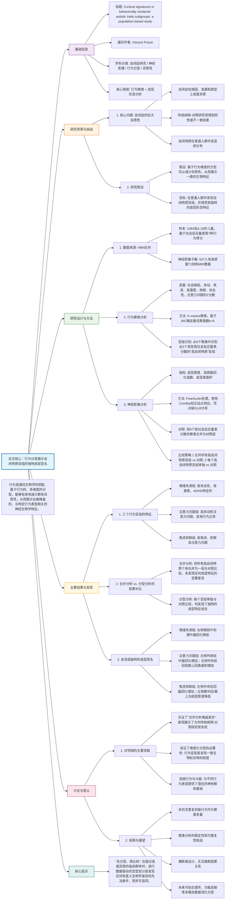

## (2020) Cortical signatures in behaviorally clustered autistic traits subgroups: a population-based study

|<!-- -->|
|---|
|**期刊：** _Translational Psychiatry_（发表日期：2020年）   **作者：** Angeline Mihailov, Cathy Philippe, Arnaud Gloaguen 等   **通讯作者：** Vincent Frouin|
|**摘要：** 自闭症谱系障碍的广泛异质性阻碍了一致生物标志物的表征，导致普遍的阴性结果。分离出同质的亚型可以为理解潜在的生物学机制提供见解。本研究基于HBN队列，对1093名6-18岁参与者的行为维度进行了无监督聚类分析，以揭示具有自闭特质的亚组。分析发现了三个社交受损的自闭特质亚组：高情绪失调、高ADHD样特质、高焦虑抑郁症状。神经影像分析比较了皮层厚度、脑回化和表面积。将三个亚组合并为一个异质组与对照组比较未发现显著差异。然而，将每个亚组单独与对照组比较时，观察到了独特的皮层特征签名。这些观察结果证明了自闭特质亚型的存在，并证实了应用维度化方法来提取有意义的差异、从而减少异质性的必要性。|
|**摘要翻译：** 本研究利用HBN队列的行为数据，通过无监督聚类将具有自闭特质的儿童分为三个行为亚组。研究发现，将这三个亚组合并后与对照组比较，未发现皮层结构差异；但将每个亚组单独与对照组比较时，却发现了各自独特的皮层形态特征。这强有力地证明了维度化分型对于减少自闭症研究异质性、揭示潜在生物机制的关键作用。|
|**期刊分区：** _Translational Psychiatry_ 是Nature Portfolio旗下期刊，专注于将基础神经科学发现转化到临床应用，通常被认为是精神病学/神经科学领域的Q1期刊。|
|**原文PDF链接：** [Cortical signatures in behaviorally clustered autistic traits subgroups: a population-based study](https://doi.org/10.1038/s41398-020-00894-3)|
|**笔记创建日期：** 2024/7/15|

> 一句话总结：本研究通过对HBN队列中自闭特质人群进行行为维度的无监督聚类，发现了三个行为亚组，并证明只有对这些亚组进行独立分析（而非合并为一个异质组），才能提取出各自特异的皮层形态特征，这凸显了维度化分型在克服自闭症异质性、揭示生物学基础中的必要性。

### 思维导图

## 1️⃣ 论文试图解决什么问题？(What is the problem?)

### 背景

> 自闭症谱系障碍（ASD）的诊断标准涵盖了极其广泛的行为表现，其背后存在着巨大的病因学和表型异质性。这种异质性导致了一个长期困扰该领域的难题：在将ASD患者作为一个整体与典型发育对照组进行比较时，神经影像学研究常常无法发现一致、可重复的脑结构或功能差异，或结果相互矛盾。这阻碍了可靠生物标志物的识别和对ASD神经机制的深入理解。越来越多的学者认为，放弃简单的“病例-对照”范式，转向基于数据驱动的**维度化亚型分型**，是破解这一困境的关键。

### 框架

> - 研究目标：在一个大型、基于普通人群的儿童青少年样本中，探索**自闭特质**（而非局限于临床诊断）是否可以根据其伴随的行为特征自然地聚合成不同的亚组，并检验这些行为亚组是否对应着**独特的皮层结构特征**。
>     
> - 科学问题：
>     
>     1. 在一个多维行为空间中，具有高自闭特质的个体会如何自然地聚类？会形成怎样的行为谱亚组？
>         
>     2. 如果将这些行为各异的亚组合并为一个“高自闭特质”组，与对照组进行传统的病例-对照比较，能否发现显著的皮层形态差异？
>         
>     3. 如果将每个行为亚组**单独**与对照组比较，是否会揭示出被整体分析所掩盖的、亚组特异性的皮层特征？
>         

### 结论

> - **成功识别三个行为亚组**：通过无监督聚类，从普通人群中分离出三个具有高自闭特质（高社会反应量表分数）但行为谱不同的亚组：**情绪失调型**、**注意力问题型**和**焦虑抑郁型**。
>     
> - **整体分析的失败**：将这三个亚组合并为一个“高自闭特质”组后，与对照组比较，在**皮层厚度、脑回化、表面积上均未发现任何显著差异**。这完美模拟并解释了传统ASD病例-对照研究常得阴性结果的原因。
>     
> - **分型分析的成功**：当将每个亚组**单独**与对照组比较时，每个亚组都展现出了**独特且具有统计学意义的皮层特征组合**（见思维导图E3部分）。
>     
> - **核心信息**：研究以极其直观的方式证明了，**行为异质性会完全掩盖潜在的生物学信号**。只有通过**先分型、后比较**的维度化策略，才能提取出有意义的、与特定行为表型相关的神经解剖特征。
>     

## 2️⃣ 核心思想/创新点是什么？(What is the core idea?)

- **“异质性淹没信号”的直接实证**：本研究最核心的贡献不是发现了某个特定的脑区差异，而是通过一个巧妙的实验设计，**直接、生动地演示了将异质群体合并分析为何会导致失败**。它将一个抽象的方法论问题变成了一个清晰的实证结果，极具说服力。
    
- **从“以诊断为中心”到“以维度为中心”**：研究没有从临床诊断的ASD患者入手，而是基于普通人群中的**自闭特质连续谱**。这种维度化视角避免了临床样本的招募偏倚（如共病、求助行为），能够更纯粹地捕捉自闭特质本身与大脑结构的关系，也符合研究域标准（RDoC）的核心理念。
    
- **行为作为分型的基石**：研究坚信，外显的行为表现是连接底层异质性生物学与宏观诊断标签的桥梁。通过基于多维行为谱的**无监督聚类**进行分型，能够更自然、更数据驱动地还原群体内部的真实结构，为寻找同质的生物学亚型提供了可靠的行为锚点。
    

## 3️⃣ 方法是怎么实现的？(How does it work?)

### 数据以及数据来源

- **全部数据来源于HBN队列**。
    
- **行为样本**：1093名6-18岁儿童，拥有完整的7种行为量表分数（SRS, SDQ-H, SCARED-P, ARI-P, CBCL相关子量表）且总智商≥70。
    
- **神经影像子样本**：上述样本中的527人拥有通过质量控制的T1加权结构磁共振成像数据。
    

### 方法

#### 架构与管道设计:

1. **行为数据准备与聚类**：
    
    - **变量选择**：选取7个在ASD中常见且共病的行为维度：社会缺陷（SRS）、多动（SDQ）、焦虑（SCARED-P）、易激惹（ARI-P）、抑郁、攻击性、注意力问题（后三者来自CBCL）。
        
    - **标准化**：将所有行为分数转换为**Z分数**。
        
    - **聚类分析**：使用**K-means算法**对1093名参与者的7维Z分数进行聚类。
        
    - **确定聚类数**：使用**贝叶斯信息准则**在1到15之间选择最佳k值，最终确定 **k=9**。
        
    - **识别目标亚组**：在生成的9个聚类中，根据**平均SRS分数**筛选出3个“高自闭特质”亚组（SRS > 80，属于中重度范围），其余6个聚类合并为**行为多样化的对照组**。
        
2. **结构MRI处理与特征提取**：
    
    - **处理软件**：使用 **FreeSurfer 6.0.0** 进行全自动皮层重建。
        
    - **提取特征**：在皮层表面上计算每个顶点的三种形态学指标：**皮层厚度**、**局部脑回化指数**、**皮层表面积**。
        
    - **质量控制**：人工检查结合欧拉数阈值（-217）筛选。
        
    - **站点效应校正**：使用 **ComBat方法** 对来自三个不同扫描站点的数据进行**谐和化**，以消除站点间的技术变异。
        
3. **统计分析与比较策略**：
    
    - **模型**：在FreeSurfer中进行**顶点级的广义线性模型**分析。
        
    - **协变量**：所有模型均控制**年龄、性别、总智商**（以及站点效应，已在ComBat中处理）。
        
    - **核心比较**：
        
        - **策略一（整体分析）**：将3个高自闭特质亚组的所有个体合并为“hSRS”组，与合并的对照组进行比较。
            
        - **策略二（分型分析）**：将**情绪失调组**、**注意力问题组**、**焦虑抑郁组**分别与同一个对照组进行比较。
            
    - **多重比较校正**：采用**基于簇的置换检验**，簇形成阈值p=0.01，报告簇水平p值<0.05的显著簇。
        

#### 关键公式/概念:

- **局部脑回化指数**：衡量皮层折叠程度的指标，定义为某一皮层点下方“埋藏”的皮层表面积与外部可见表面积的比值。LGI值越高，表示该局部区域的皮层折叠越复杂。
    
- **ComBat谐和化**：一种用于多站点神经影像数据的经验贝叶斯方法，用于调整站点间的批次效应。它分别校正每个特征（如每个顶点的厚度）的均值和方差，使其在不同站点间具有可比性，同时尽可能保留与生物协变量（如年龄、诊断）相关的真实变异。
    
- **基于簇的置换检验**：一种用于脑图谱统计的标准方法。首先，将超过预设顶点级阈值（如p<0.01）的相邻顶点聚合成“簇”。然后，通过随机置换组别标签成千上万次，生成簇大小（或簇内统计量总和）的零分布。最终，通过比较真实数据的簇大小与该零分布，得到校正了多重比较的簇水平p值。
    

### 结论

通过“行为聚类定义亚型 -> 分别进行神经解剖学比较”这一清晰的研究管道，该研究有力地检验了其核心假设，并为维度化精神病学研究提供了一个方法学范例。

## 4️⃣ 效果如何？(How is the performance?)

### 主要结果:

1. **三个高自闭特质行为亚组**：
    
    - **情绪失调组**：在攻击性、易激惹、多动和注意力问题上得分极高。
        
    - **注意力问题组**：在多动和注意力问题上得分极高，其他行为接近正常。
        
    - **焦虑抑郁组**：在焦虑、抑郁和注意力问题上得分极高。
        
2. **整体分析的阴性结果**：
    
    - 将三个亚组合并为**hSRS组**（n=117）与**对照组**（n=410）比较，在**全脑范围的皮层厚度、脑回化、表面积上均未发现任何显著差异**。这是一个非常明确和关键的阴性结果。
        
3. **分型分析的成功与独特皮层签名**：
    
    - **情绪失调组**：显示**右侧楔前叶**和**右侧后下颞叶**区域的**脑回化显著降低**。
        
    - **注意力问题组**：显示**左侧外侧枕叶**区域**脑回化增加**；以及**左侧中央前回**和**左侧额上回**区域的**表面积增加**。
        
    - **焦虑抑郁组**：显示**左侧中央后回**区域**脑回化增加**；以及**左侧颞中回/颞上沟**区域的**皮层厚度降低**。
        
4. **结果的统计效力**：
    
    - 尽管每个亚组的样本量（n=31-47）远小于合并组（n=117），但分型分析却发现了显著的簇。这反向说明，**减少组内异质性对提高统计效力（效应量）的贡献，可能超过了单纯增加样本量**。
        
5. **行为的特异性关联**：
    
    - 每个亚组独特的皮层特征与其核心行为表型存在合理的神经科学联系。例如，注意力问题组的运动皮层和额叶表面积变化可能与ADHD样症状和运动控制相关；情绪失调组的楔前叶（默认网络关键节点）脑回化降低可能与情绪调节和共情困难相关。
        

## 5️⃣ 有什么优点和缺点？(What are the strengths and weaknesses?)

### 优点

1. **研究设计巧妙，论证有力**：通过“先合并，后分开”的对比，直观、令人信服地证明了分型研究的必要性，比任何理论阐述都更有力量。
    
2. **基于普通人群的维度化视角**：避免了临床样本的诸多混杂因素，能更纯粹地研究自闭特质谱系，结论可能更具普遍性。
    
3. **行为分型的数据驱动性**：采用无监督聚类，让数据自己“说话”来定义亚组，减少了研究者的先验偏见。
    
4. **严谨的神经影像分析流程**：使用了标准化的处理、严格的质控、站点效应校正和适当的统计校正方法。
    
5. **多维皮层形态指标**：同时考察厚度、脑回化和表面积，提供了更全面的脑结构表征。
    

### 缺点/局限

1. **横断面设计**：无法确定是大脑结构差异导致了特定的行为表型，还是长期的行为模式塑造了大脑结构，亦或是第三变量同时影响两者。
    
2. **聚类分析的固有局限性**：
    
    - **稳定性**：K-means的结果可能受初始值影响，在不同数据集中重现相同聚类具有挑战性。
        
    - **主观性**：尽管使用了BIC，但选择k=9以及后续对三个“高SRS”亚组的识别仍包含一定主观判断。
        
    - **协变量控制**：聚类分析时难以像回归分析那样控制年龄、性别等协变量。
        
3. **缺少核心自闭症症状**：行为变量中未专门包含**重复刻板行为**，这是ASD的核心诊断标准之一，其缺失可能影响亚型定义的完整性。
    
4. **样本量不平衡**：神经影像分析中，各亚组样本量（31-47）相对较小，可能影响某些亚组中发现更微弱效应的能力。
    
5. **行为仅依赖父母报告**：可能存在报告偏倚，未来需结合教师报告或儿童自评。
    

## 6️⃣ 借鉴学习

### 1个思路

> **“对照组”也可以是异质的、谱系化的**：本研究将6个低SRS的聚类合并为一个“对照组”。这个对照组并非“纯净”的典型发育者，而是包含了各种低程度行为特征的个体，形成了一个**具有广泛行为谱的“正常变异”参照系**。这种思路挑战了将对照组视为“零症状”黄金标准的传统观念，更符合现实，也使得与“病例组”的比较更侧重于**目标特质（如高社交缺陷）的效应**，而非将所有行为偏差都与“障碍”挂钩。

### 2个绘图/呈现方式

> **（雷达图展示行为亚组特征 - 如图1）**：用雷达图展示三个亚组在7个行为维度上的标准化分数。每个亚组用不同颜色的多边形表示，**一目了然地**呈现出各亚组独特的行为“指纹”。例如，情绪失调组在攻击性、易激惹、多动/注意力上凸起；焦虑抑郁组在焦虑、抑郁上凸起。这种图非常适合展示多维剖面差异。  
> **（脑表面显著性图与行为剖面并列 - 如图2）**：将每个亚组的大脑分析结果（如脑回化差异的脑表面统计图）与其行为雷达图或描述**并列展示**。这种排版方式**建立了强烈的视觉关联**，让读者一眼就能看到“特定的行为组合对应特定的大脑区域改变”，极大增强了结果的可解释性和冲击力。

### 1个技术细节

> **使用ComBat进行多站点神经影像数据谐和化**：当研究数据来自多个扫描站点，且站点间在扫描仪型号、序列参数上存在差异时，这些**技术性变异**会严重干扰对**生物学信号**的检测。ComBat方法通过经验贝叶斯框架，估计并移除每个特征（如每个顶点的厚度值）中与站点相关的均值和方差偏移，同时保留与生物协变量（如诊断、年龄）相关的变异。在处理像HBN这样来自多个中心的大型公共数据集时，**ComBat已成为数据预处理的必要步骤**，以确保结果的可靠性。

## 7️⃣ 关键术语 (Key Terms)

### Term1: 自闭特质 (Autistic Traits)

- 指在普通人群中连续分布的、类似于自闭症谱系障碍核心特征的行为倾向，主要体现在**社交沟通困难**和**限制性、重复性行为及兴趣**两个方面。通常使用量表（如本研究中的**社会反应量表**）进行量化评估。高分者具有“类自闭症”特征，但未必达到临床诊断标准。研究自闭特质有助于在更广泛的谱系上理解相关行为的神经基础，避免临床样本的混杂因素。
    

### Term2: 无监督聚类分析 (Unsupervised Clustering Analysis)

- 一种**探索性数据分析**技术，旨在根据数据点之间的相似性，将数据集划分为若干个组或“簇”，而无需预先提供类别标签（因此是“无监督”的）。**K-means** 是其中最常用的算法之一，它通过迭代计算，将数据点分配到k个簇中，使得每个数据点到其所属簇中心的距离平方和最小。在本研究中，它被用于根据7种行为分数，自然地将千余名儿童分成不同的行为亚型。
    

### Term3: 皮层脑回化 (Cortical Gyrification)

- 指大脑皮层表面形成沟回（皱褶）的过程和程度。**局部脑回化指数** 是量化这一程度的常用指标。更高的LGI表示皮层在该区域折叠得更紧密。脑回化增加通常被认为可以提供更大的皮层表面积，从而容纳更多神经元，与认知能力相关。脑回化主要在产前和围产期快速发展，之后相对稳定，因此常被视为反映早期神经发育的“印记”。本研究发现不同亚组在特定脑区的LGI差异，可能暗示了其不同的早期神经发育轨迹。
    

---

### HBN在本研究中的作用：

HBN是本研究的**唯一数据来源**，提供了**所有**的行为、人口学及结构MRI数据。其大规模、多维度的特点使得研究者能够：

1. 在普通人群中筛选出足够数量的具有高自闭特质的个体。
    
2. 获取丰富的行为维度分数用于聚类分析。
    
3. 获得高质量的脑结构影像用于精细的皮层形态分析。  
    没有HBN，这项基于大型人群的、维度化的分型研究几乎无法实现。