## (2021) Peer victimization and the association with hippocampal development and working memory in children with ADHD and typically-developing children

|<!-- -->|
|---|
|**期刊：** _Scientific Reports_（发表日期：2021年）   **作者：** Alissa Papadopoulos, Diane Seguin, Susana Correa, Emma G. Duerden   **通讯作者：** Emma G. Duerden|
|**摘要：** ADHD儿童的多动-冲动和注意力不集中症状使其更容易遭受同伴侵害。海马成熟可能与ADHD症状减少有关，从而降低受害风险。工作记忆是社交关系形成和维持的重要执行功能，在ADHD中常受损。本研究旨在评估有/无ADHD儿童的问题行为、同伴侵害、海马形态和工作记忆之间的关系。招募了218名典型发育儿童和232名ADHD儿童。ADHD组分为注意缺陷型和混合型。ADHD混合型组的问题行为和同伴侵害水平显著更高。左侧海马CA3区体积是同伴侵害的正向预测因子，也是工作记忆的正向预测因子；而左侧CA4区体积是工作记忆的负向预测因子。聚类分析显示，表现出多动-冲动症状的儿童遭受同伴侵害的风险最高。关注于减少同伴侵害的干预措施可能有助于减轻不良后果，并促进大脑健康和认知功能。|
|**摘要翻译：** 本研究揭示了ADHD混合型儿童更高的同伴侵害风险，并发现左侧海马CA3区体积与更高的侵害程度和更好的工作记忆相关，而CA4区体积与更差的工作记忆相关。这表明海马的特定亚区在ADHD儿童的社交逆境和认知功能中扮演了复杂且可能相反的角色，且多动-冲动症状是侵害风险的核心。|
|**期刊分区：** _Scientific Reports_ 是Nature Portfolio旗下的综合性开放获取期刊，发表各科学领域经同行评审的原创研究，通常被认为是中上游的Q1期刊，但影响力因领域而异。|
|**原文PDF链接：** [Peer victimization and the association with hippocampal development and working memory in children with ADHD and typically-developing children](https://doi.org/10.1038/s41598-021-95582-7)|
|**笔记创建日期：** 2024/7/15|

> 一句话总结：本研究基于HBN队列发现，ADHD混合型儿童遭受同伴侵害最严重；左侧海马CA3区体积越大，侵害程度越高，但工作记忆也越好；而CA4区体积越大，工作记忆越差。这些发现揭示了海马亚区在环境压力与认知功能中扮演的复杂角色，并强调了针对多动-冲动症状进行干预以降低侵害风险的重要性。

### 思维导图

```mermaid
graph LR
    A[论文核心：探究ADHD儿童同伴侵害的海马与认知关联] --> B[基础信息]
    B --> B1[标题: Peer victimization and the association with hippocampal development and working memory in children with ADHD and typically-developing children]
    B --> B2[通讯作者: Emma G. Duerden]
    B --> B3[学科分类: 发展心理学 / 儿童精神病学 / 神经影像 / 社会神经科学]
    B --> B4[核心框架: ADHD亚型 + 行为 + 海马亚区 + 工作记忆]

    A --> C[研究背景与问题]
    C --> C1[1. 问题背景]
    C1 --> C11[ADHD儿童社交困难，遭受同伴侵害风险高]
    C1 --> C12[海马体积与ADHD症状及侵害经历相关，但研究结果不一致]
    C1 --> C13[工作记忆在ADHD中受损，且与社交功能相关]
    C1 --> C14[海马体积、工作记忆与同伴侵害在ADHD中的关系不明]

    C --> C2[2. 研究目标与假设]
    C2 --> C21[目标1: 比较不同ADHD亚型与TD儿童的问题行为与侵害水平]
    C2 --> C22[目标2: 探究海马亚区体积能否预测问题行为与侵害]
    C2 --> C23[目标3: 探究海马亚区体积能否预测工作记忆]
    C2 --> C24[假设: 海马体积小的ADHD儿童，因症状更重，受害风险更高]

    A --> D[研究设计与方法]
    D --> D1[1. 数据来源: HBN队列]
    D1 --> D11[样本: 450名儿童，包括218名TD，232名ADHD]
    D1 --> D12[ADHD亚型: 注意缺陷型，混合型]
    D1 --> D13[排除: 多动-冲动型（样本量太小）]

    D --> D2[2. 测量工具]
    D2 --> D21[行为: CBCL量表测量问题行为与同伴侵害]
    D2 --> D22[认知: WISC-V测量工作记忆指数]
    D2 --> D23[神经影像: FreeSurfer 6.0分割双侧海马12个亚区体积]

    D --> D3[3. 分析方法]
    D3 --> D31[GLM分析: 检验诊断组间差异，以及海马体积对侵害、工作记忆的预测作用]
    D3 --> D32[聚类分析: 使用K-means，基于左侧CA3体积、侵害、工作记忆、多动/注意症状进行无监督分群]

    A --> E[主要结果与发现]
    E --> E1[1. 行为差异: ADHD亚型是关键]
    E1 --> E11[ADHD混合型组在攻击性、违纪、社交问题和同伴侵害上均显著高于TD和注意缺陷型组]
    E1 --> E12[ADHD注意缺陷型组仅在攻击性上高于TD组，侵害水平与TD无差异]

    E --> E2[2. 海马与侵害: 与假设相反]
    E2 --> E21[左侧CA3体积是同伴侵害的显著正向预测因子]
    E2 --> E22[更大的CA3体积，而非更小的体积，与更高的侵害报告相关]
    E2 --> E23[此关联在所有诊断组中均存在]

    E --> E3[3. 海马与工作记忆: 亚区作用相反]
    E3 --> E31[左侧CA3体积是工作记忆的正向预测因子]
    E3 --> E32[左侧CA4体积是工作记忆的负向预测因子]
    E3 --> E33[注意缺陷型组的工作记忆显著低于TD组]

    E --> E4[4. 聚类分析: 揭示风险表型]
    E4 --> E41[聚类1: 低症状、高工作记忆、低侵害、CA3体积小（主要为TD儿童）]
    E4 --> E42[聚类2: 高症状、平均工作记忆、高侵害、CA3体积平均（含大量ADHD混合型）]
    E4 --> E43[聚类3: 中等症状、低工作记忆、低侵害、CA3体积大（含大量ADHD注意缺陷型）]
    E4 --> E44[核心发现: 多动-冲动症状与高侵害风险紧密关联]

    A --> F[讨论与意义]
    F --> F1[1. 核心解释与机制探讨]
    F1 --> F11[“压力适应”假说: 长期侵害可能导致海马CA3区的应激性肥大，而非萎缩]
    F1 --> F12[亚区特异性: CA3与CA4在认知功能中可能扮演相反角色，需精细区分]
    F1 --> F13[症状特异性: 多动-冲动是导致侵害风险升高的核心行为特征]

    F --> F2[2. 局限与展望]
    F2 --> F21[横断面设计，无法推断因果关系]
    F2 --> F22[依赖父母报告，可能存在偏差]
    F2 --> F23[缺少ADHD多动-冲动型数据]
    F2 --> F24[未考虑皮质醇等应激生理指标]
    F2 --> F25[未来需纵向研究，并整合多信息来源]

    A --> G[核心启示]
    G --> G1[“更大”不一定“更好”: 在发育神经科学中，更大的脑结构体积有时可能与更差的环境经历或适应不良有关，挑战了简单的“越大越好”的假设。]
    G2[精准定位亚区: 将海马作为一个整体进行研究可能掩盖其内部亚区复杂且各异的功能，精细的亚区分割对理解脑-行为关系至关重要。]
    G3[症状导向的干预: 针对ADHD儿童，减少其多动-冲动症状可能直接降低其遭受同伴侵害的风险，这为临床干预提供了明确的行为靶点。]

    style A fill:#e1f5fe,stroke:#01579b,stroke-width:2px
    style B fill:#f3e5f5,stroke:#4a148c
    style C fill:#fff3e0,stroke:#e65100
    style D fill:#e8f5e8,stroke:#1b5e20
    style E fill:#fff8e1,stroke:#ff8f00
    style F fill:#fce4ec,stroke:#880e4f
    style G fill:#e0f2f1,stroke:#004d40
```

## 1️⃣ 论文试图解决什么问题？(What is the problem?)

### 背景

> 注意缺陷多动障碍（ADHD）儿童在社交情境中常面临挑战，其多动、冲动和注意力不集中等症状可能导致他们被同伴排斥、孤立甚至欺凌，即遭受**同伴侵害**。这种负面的社交经历本身就是一种慢性压力源，可能影响大脑发育，尤其是对压力敏感的海马体。同时，ADHD儿童常伴有**工作记忆**缺陷，而工作记忆对于理解社交线索、维持对话至关重要。海马体既是应激反应的关键结构，也支持工作记忆等认知功能。然而，目前尚不清楚ADHD儿童的**海马结构**、他们经历的**同伴侵害**以及他们的**工作记忆能力**三者之间究竟存在怎样的关系，且这种关系是否因ADHD的**不同亚型**（如以注意缺陷为主 vs. 混合型）而异。

### 框架

> - 研究目标：在一个包含典型发育儿童和不同亚型ADHD儿童的大样本中，系统探究**问题行为**、**同伴侵害**、**海马亚区体积**和**工作记忆**之间的关联。
>     
> - 科学问题：
>     
>     1. 不同ADHD亚型（注意缺陷型、混合型）在问题行为和同伴侵害水平上是否存在差异？
>         
>     2. 海马特定亚区的体积能否预测儿童的问题行为水平和遭受同伴侵害的程度？研究者最初假设更小的海马体积（反映更严重的症状）与更高的侵害相关。
>         
>     3. 海马亚区体积能否预测儿童的工作记忆能力？
>         
>     4. 能否通过数据驱动的方法，识别出将上述变量（脑、行为、认知）结合起来的、具有不同风险特征的表型集群？
>         

### 结论

> - **ADHD亚型是关键区分因素**：**ADHD混合型**儿童在所有外化问题行为（攻击、违纪、社交问题）和同伴侵害水平上均显著高于典型发育儿童和ADHD注意缺陷型儿童。而ADHD注意缺陷型儿童的侵害水平与典型发育儿童无差异。
>     
> - **海马CA3体积的“矛盾”角色**：与假设相反，**更大的左侧海马CA3区体积**与**更高的同伴侵害报告**相关。但同时，更大的CA3体积也与**更好的工作记忆**相关。
>     
> - **海马亚区功能的特异性**：左侧海马**CA4区**体积与工作记忆呈**负相关**，这与CA3的作用相反，提示海马内部不同亚区可能具有不同的甚至相反的功能。
>     
> - **风险表型集群**：聚类分析揭示，**高多动-冲动症状**是区分出**高侵害风险集群**的最核心特征。
>     
> - **机制启示**：结果提示，对于经历慢性同伴侵害的ADHD儿童，其海马CA3区可能发生了**应激相关的适应性肥大**，而非创伤研究中常见的萎缩。这种肥大可能在维持认知功能（工作记忆）的同时，与持续的不良环境暴露相关联。
>     

## 2️⃣ 核心思想/创新点是什么？(What is the core idea?)

- **挑战“海马萎缩”的简单叙事**：在儿童逆境（如虐待、忽视）研究中，“更小的海马体积”几乎是一个默认结论。本研究在同伴侵害这一特定社会心理压力源中，发现了**相反的模式**（更大的CA3体积与更高侵害相关），这挑战了单一的“压力导致萎缩”模型，引入了**压力适应与神经可塑性**的复杂视角，提示在不同类型、不同时程的压力下，海马的反应模式可能不同。
    
- **精细化解剖定位的重要性**：研究没有将海马作为一个整体，而是精细分割了**12个亚区**。这使其能够发现CA3和CA4这两个相邻亚区在工作记忆预测中扮演**完全相反的角色**。这一发现强有力地论证了，在脑-行为关联研究中，**亚区水平的分析能揭示被整体分析掩盖的关键信息**，是未来研究的必要方向。
    
- **整合脑、行为、认知与环境的交互视角**：研究没有孤立地看待脑结构、临床症状或环境风险，而是试图在一个框架内将它们联系起来。通过**聚类分析**，它展示了如何将多维度数据（脑体积、侵害程度、认知分数、症状分数）结合起来，自然浮现出具有不同风险特征的表型组，这种思路比单独分析变量间的两两关系更能反映真实的、多维的个体差异。
    

## 3️⃣ 方法是怎么实现的？(How does it work?)

### 数据以及数据来源

- **全部数据来源于HBN队列**。
    
- **参与者**：450名6-17.7岁儿童，包括218名典型发育儿童和232名经K-SADS诊断的ADHD儿童。ADHD儿童进一步分为124名注意缺陷型和108名混合型（多动-冲动型因样本量过小被排除）。
    

### 方法

#### 架构与管道设计:

1. **行为与认知评估**：
    
    - **问题行为与同伴侵害**：使用**儿童行为量表**，提取攻击行为、违纪行为、社交问题、退缩以及**同伴侵害子量表**的原始分。同伴侵害子量表包含4个条目（如“被其他孩子取笑很多”、“不被其他孩子喜欢”）。
        
    - **ADHD症状**：使用SWAN量表评估多动-冲动和注意缺陷症状。
        
    - **工作记忆**：使用**韦氏儿童智力量表第五版**的**工作记忆指数**（包含数字广度和图片广度分测验）。
        
    - **社会经济地位**：使用巴勒特简化社会地位量表测量。
        
2. **神经影像数据获取与处理**：
    
    - **扫描**：在HBN的三个站点进行T1加权结构MRI扫描。
        
    - **海马分割**：使用 **FreeSurfer 6.0** 的**海马亚区分割模块**，基于超高分辨率ex-vivo模板，将每个海马自动分割为12个亚区：海马尾、下托、CA1、海马裂、前下托、旁下托、分子层、齿状回颗粒细胞层、CA3、CA4、伞、海马-杏仁核过渡区。
        
    - **全脑体积**：同时提取总颅内体积作为协变量。
        
3. **统计分析**：
    
    - **目标1（组间比较）**：使用一般线性模型，以四种问题行为（攻击、违纪、社交问题、退缩）和同伴侵害得分为因变量，诊断组（TD， ADHD-I， ADHD-C）为自变量，控制年龄、性别、SES和站点。
        
    - **目标2（海马预测侵害/行为）**：使用一般线性模型，分别以同伴侵害、攻击、违纪、社交问题得分为因变量，以**所有24个（左右各12）海马亚区体积**为自变量，同时控制年龄、性别、SES、诊断组、总颅内体积和站点。
        
    - **目标3（海马预测工作记忆）**：使用一般线性模型，以工作记忆指数为因变量，以所有海马亚区体积为自变量，协变量同上。
        
    - **事后分析**：在目标3的模型中，额外加入CBCL的焦虑/抑郁子量表分数作为协变量，以检验情绪共病的影响。
        
4. **无监督聚类分析**：
    
    - **目的**：探索性地识别将脑（左侧CA3体积）、环境（同伴侵害）、认知（工作记忆）和行为（多动-冲动、注意缺陷症状）结合起来的自然分组。
        
    - **方法**：对245名拥有完整数据的参与者，将上述5个变量标准化后，进行**K-means聚类分析**。通过检查聚类间的差异，描述不同集群的特征及其诊断组构成。
        

#### 关键公式/概念:

- **海马亚区CA3与CA4**：
    
    - **CA3**：海马**兴奋性回路的核心**，接收来自齿状回的直接输入，并以其**强大的 recurrent collateral synapses**（CA3-CA3连接）而闻名，这些连接被认为是**模式完成和快速记忆编码**的细胞基础，对工作记忆至关重要。CA3也对糖皮质激素（应激激素）高度敏感。
        
    - **CA4**：位于齿状回门区，包含**苔藓细胞**，主要接收来自齿状回颗粒细胞的输入，并投射回齿状回内层，形成**局部抑制性回路**的一部分，在调节海马兴奋性中起作用。其功能与CA3不同，可能更侧重于模式分离或局部处理。
        
- **K-means聚类**：（同第二篇论文）一种无监督学习方法，旨在最小化簇内方差。本研究用它来发现数据中潜在的多维度表型分组，而不是验证先验假设。
    

### 结论

通过这套结合了假设驱动（GLM分析）和数据驱动（聚类分析）的方法，研究全面描绘了ADHD亚型、行为、海马精细结构与认知功能之间复杂的关系网络。

## 4️⃣ 效果如何？(How is the performance?)

### 主要结果:

1. **行为与诊断组**：
    
    - ADHD混合型组在**攻击性、违纪、社交问题和同伴侵害**上得分均显著高于TD组和ADHD注意缺陷型组（所有p<0.001）。
        
    - ADHD注意缺陷型组仅在**攻击性**上高于TD组，其同伴侵害水平与TD组无差异。
        
2. **海马亚区与同伴侵害**：
    
    - **左侧CA3体积**是**同伴侵害**的显著正向预测因子（B=0.019, p=0.010）。更大的CA3体积，而非更小的体积，与父母报告的更高侵害水平相关。
        
    - 该关联在TD、ADHD-I和ADHD-C三个组中均独立存在（交互作用不显著）。
        
3. **海马亚区与工作记忆**：
    
    - **左侧CA3体积**是**工作记忆指数**的显著正向预测因子（B=0.233, p=0.017）。
        
    - **左侧CA4体积**是**工作记忆指数**的显著负向预测因子（B=-0.626, p=0.018）。
        
    - 在控制焦虑/抑郁分数后，这两个关联依然显著。
        
4. **聚类分析结果（3个集群）**：
    
    - **集群1（低风险）**：低症状、高工作记忆、低侵害、小CA3体积。主要由TD儿童构成（40/41）。
        
    - **集群2（高风险）**：高症状（尤其是多动-冲动）、平均工作记忆、**高侵害**、平均CA3体积。包含大量ADHD混合型儿童（24/54）。
        
    - **集群3（大CA3/低认知组）**：中等症状、**低工作记忆**、低侵害、**大CA3体积**。包含大量ADHD注意缺陷型儿童（64/150）。
        
5. **关键模式整合**：
    
    - **CA3体积的“双重角色”**：它同时与“好”（高工作记忆）和“坏”（高侵害）的结果正相关，这解释了它在不同集群中的表现。
        
    - **症状的核心地位**：**多动-冲动症状**是区分高侵害集群（集群2）与其他集群的最突出行为特征。
        

## 5️⃣ 有什么优点和缺点？(What are the strengths and weaknesses?)

### 优点

1. **精细的海马亚区分割**：使用FreeSurfer最新的海马亚区分割流程，超越了整体海马体积分析，揭示了CA3和CA4功能相反的惊人发现，凸显了神经解剖学精确性的价值。
    
2. **区分ADHD亚型**：没有将ADHD视为一个整体，而是区分了注意缺陷型和混合型，这对于理清症状、行为与大脑的关系至关重要。结果明确显示风险主要与混合型（多动-冲动症状）相关。
    
3. **结合假设驱动与数据驱动分析**：在标准的GLM分析之外，加入了聚类分析，有助于发现超越线性关系的、多维度的个体差异模式，为理解异质性提供了新视角。
    
4. **控制重要的协变量**：在模型中系统控制了年龄、性别、SES、总颅内体积、扫描站点，甚至事后控制了焦虑/抑郁，增强了结果的稳健性。
    
5. **研究问题的社会与现实意义**：聚焦于同伴侵害这一严重影响儿童心理健康的社会问题，并将神经科学与ADHD的日常功能挑战联系起来，具有明确的转化价值。
    

### 缺点/局限

1. **横断面设计**：这是最主要的局限。无法确定是更大的CA3体积导致了更容易受害或更好的工作记忆，还是长期的侵害经历或遗传因素导致了CA3体积的变化，亦或是工作记忆能力影响了侵害风险。
    
2. **单一信息源（父母报告）**：同伴侵害、问题行为均依赖父母报告，可能不全面或存在偏差。儿童自评或教师评价可能提供不同视角。
    
3. **缺乏ADHD多动-冲动型数据**：由于样本量小而被排除，使得无法完整描绘所有ADHD亚型的图谱。
    
4. **未测量应激生理指标**：如皮质醇水平，这些指标可以更直接地反映HPA轴功能，并帮助解释海马体积与压力经历之间的关联机制。
    
5. **海马体积测量的局限性**：结构体积是一个宏观的、笼统的指标，无法反映突触密度、神经元形态或神经化学等更精细的微观变化。
    

## 6️⃣ 借鉴学习

### 1个思路

> **“挑战默认假设”**：当进入一个已有大量文献的领域时（如“压力与海马体积”），常见的做法是验证或沿用主流假设（压力使海马变小）。本研究提供了一个范例：**仔细审视你研究的具体人群（ADHD儿童）和具体压力源（同伴侵害）是否真的符合那个普遍假设**。如果不完全符合，你的研究就可能发现新的、更复杂的模式。**对“反常”结果的深入解释，往往比验证一个常识更能推动科学进步。**

### 2个绘图/呈现方式

> **（分组箱线图展示行为差异 - 如图1）**：用并排的箱线图展示TD、ADHD-I、ADHD-C三组在攻击、违纪、社交问题、侵害等量表上的得分分布。箱线图能**直观展示数据分布（中位数、四分位距、异常值）和组间重叠程度**，比单纯的柱状图包含更多信息。结合上方标注的显著性星号（*）和连接线，可以清晰地传达出“ADHD-C组在几乎所有外部行为上都显著更高”这一核心信息。  
> **（聚类特征平行坐标图或表格热图 - 如表2/图2概念）**：在展示聚类结果时，本研究使用了表格（表2）来列出各聚类在关键变量上的中位数。可以进一步用**平行坐标图**（每个变量一列纵轴，每个样本一条折线，按聚类着色）或**热图**（行是样本，列是变量，颜色表示Z分数）来呈现。这种图能**同时显示所有变量在所有个体上的模式**，让读者一眼看出每个聚类独特的“指纹”，以及聚类内部的一致性和聚类之间的分离度。

### 1个技术细节

> **在脑体积分析中控制总颅内体积**：当研究特定脑区（如海马）的体积与行为或诊断的关系时，**必须将总颅内体积或全脑体积作为协变量纳入统计模型**。这是因为：1）个体间脑大小差异很大；2）所关心的脑区体积通常与全脑体积相关；3）如果不控制，发现的“区域体积”差异可能仅仅反映了整体脑大小的差异，而非该区域特异性的变化。控制TCV后，分析的是**该区域相对于其预期大小（基于全脑大小）的偏差**，这更能反映区域特异性的变化。这是脑结构MRI分析中的**标准做法**。

## 7️⃣ 关键术语 (Key Terms)

### Term1: 同伴侵害 (Peer Victimization)

- 指儿童或青少年遭受来自同龄人的、具有伤害性的攻击行为，包括**身体侵害**（如踢打）、**言语侵害**（如辱骂、嘲弄）和**关系侵害**（如排挤、散播谣言）。它是一种重要的社会心理压力源，与一系列负面的心理、社会和学业后果相关。在本研究中，通过CBCL量表中一个简短的4条目子量表由父母进行报告。
    

### Term2: 工作记忆 (Working Memory)

- 一种**核心的执行功能**，指在执行复杂认知任务时，能够在头脑中暂时存储和操纵有限数量信息的能力。它就像大脑的“便签本”，对于理解语言、解决问题、学习和社交互动都至关重要。在本研究中，使用**韦氏儿童智力量表第五版的工作记忆指数**进行标准化测量，该指数综合了数字广度和图片广度任务的表现。
    

### Term3: 海马亚区CA3与CA4

- 海马是位于颞叶深处、对学习和记忆至关重要的结构。现代神经影像学可以将其细分为多个具有不同细胞结构和功能的亚区。
    
    - **CA3**：**Cornu Ammonis 3**的缩写。是海马** trisynaptic circuit**（三突触回路）中的第二站。以其密集的** recurrent collaterals**（CA3神经元之间的相互连接）而著称，这些连接被认为支持**模式完成**（根据部分线索回忆完整记忆）和**快速、单次尝试的学习**。CA3区富含糖皮质激素受体，对压力高度敏感。
        
    - **CA4**：**Cornu Ammonis 4**的缩写，也称为**门区**。实际上位于齿状回内部，包含**苔藓细胞**。它主要接收来自齿状回颗粒细胞的输入，并发出投射反馈到齿状回，形成局部回路，可能在**模式分离**（区分相似经历）和调节齿状回兴奋性中发挥作用。其功能角色比CA3更不明确，且与CA3在连接和功能上存在差异。
        

---

### HBN在本研究中的作用：

HBN是本研究的**唯一数据来源**，提供了实现研究目标所必需的一切：

1. **足够的临床样本**：提供了大量经过严格诊断的ADHD儿童（注意缺陷型和混合型）以及典型发育对照组。
    
2. **多维度的评估**：提供了用于测量同伴侵害、问题行为的CBCL量表，用于测量ADHD症状的SWAN量表，以及用于测量工作记忆的WISC-V评估。
    
3. **高质量的神经影像数据**：提供了可用于精细海马亚区分割的高分辨率T1结构MRI数据。
    
4. **关键的协变量信息**：提供了年龄、性别、社会经济地位等重要的协变量数据。  
    没有HBN这样的大型、深度表型队列，这项整合了诊断亚型、行为、精细脑结构和认知功能的复杂研究将难以开展。