## (2022) Association between attention-deficit/hyperactivity disorder symptom severity and white matter integrity moderated by in-scanner head motion

| <!-- --> |
| --------------------------------------------------------------------------------------------------------------------------------------------------------------------- |
| **期刊：Translational Psychiatry（发表日期：2022年）** **作者：** Sabine Dziemian, Zofia Baranczuk- Turska, Nicolas Langer **通讯作者：** Sabine Dziemian |
| **摘要：** 既往关于注意力缺陷/多动障碍（ADHD）白质完整性的研究结果不一致。本研究在迄今为止最大的未用药儿童青少年样本（n=739）中，探讨了扫描头动和ADHD症状严重度对弥散张量成像（DTI）白质指标（各向异性分数，FA）的影响。使用因果中介分析，发现大多数先前报告的FA与多动症状严重度（SWAN-HY）的关联，当纳入扫描头动作为中介变量时，被证明是完全由头动所中介的（如全脑FA、胼胝体小钳、左侧上纵束）。唯一不受头动中介的、直接与多动严重度相关的FA降低，仅出现在**左侧皮质脊髓束**。 |
| **摘要翻译：** 本研究通过因果中介分析，揭示了扫描头动在ADHD白质研究中扮演关键中介角色：先前许多FA降低的发现实际上是头动引起的伪迹。在控制此混淆后，仅发现左侧皮质脊髓束的FA降低直接与ADHD多动症状相关，提示其可能是ADHD运动症状的潜在神经基质。 |
| **期刊分区：** Translational Psychiatry 是Nature旗下精神医学转化研究期刊，通常被认为是该领域的顶级期刊，位于Q1分区。 |
| **原文PDF链接：** [Association between attention-deficit/hyperactivity disorder symptom severity and white matter integrity moderated by in-scanner head motion](https://doi.org/10.1038/s41398-022-02117-3) |
| **笔记创建日期：** 2024/7/15 |

> 一句话总结：本研究使用因果中介分析，在大型未用药ADHD样本中发现，先前许多与症状相关的白质完整性（FA）异常可能由扫描头动伪迹导致；经此校正后，仅左侧皮质脊髓束的FA降低直接与多动症状相关，揭示了头动作为重要混杂因素和左侧皮质脊髓束作为核心神经基质的关键作用。

### 思维导图

```mermaid
graph TB
    A[论文核心：头动中介了多数ADHD白质异常，仅左侧皮质脊髓束与症状直接相关] 
    A--> B[基础信息]
    B --> B1[期刊：Translational Psychiatry]
    B --> B2[关键样本：未用药儿童青少年，n=739]
    B --> B3[核心方法：DTI + 因果中介分析]
    
    A --> C[研究背景与问题]
    C --> C1[问题：ADHD白质研究结果高度不一致]
    C --> C2[可能原因]
    C2 --> C21[样本异质性/小样本]
    C2 --> C22[药物史影响]
    C2 --> C23[诊断表征方式：分类 vs. 维度]
    C2 --> C24[关键混杂：未充分控制扫描头动]
    C --> C3[核心假设]
    C3 --> C31[头动是多动症状的直接表达]
    C3 --> C32[头动可能中介“症状-FA”的伪关联]
    
    A --> D[研究方法与设计]
    D --> D1[数据来源]
    D1 --> D11[健康脑网络队列]
    D1 --> D12[关键：全部未用药]
    D --> D2[ADHD表征]
    D2 --> D21[分类：DSM-5诊断]
    D2 --> D22[维度：SWAN-HY评分]
    D --> D3[影像处理]
    D3 --> D31[DTI预处理与运动校正]
    D3 --> D32[纤维束自动追踪：AFQ]
    D3 --> D33[分析6条关键纤维束FA]
    D --> D4[统计分析]
    D4 --> D41[模型比较：维度vs分类模型更优]
    D4 --> D42[因果中介分析：检验头动中介效应]
    
    A --> E[主要结果]
    E --> E1[模型选择]
    E1 --> E11[维度模型（SWAN-HY）优于分类模型]
    E --> E2[因果中介分析核心发现]
    E2 --> E21[头动与SWAN-HY强相关]
    E22[中介效应] --> E221[全脑FA, 胼胝体小钳, 左SLF：症状-FA关联完全被头动中介]
    E22 --> E222[左侧CST：症状-FA关联为直接效应，不受头动中介]
    
    A --> F[讨论与意义]
    F --> F1[对领域的警示]
    F1 --> F11[解释既往不一致研究：忽视头动导致伪发现]
    F11 --> F111[头动是多动的固有特征，排除高头动样本会产生偏差]
    F --> F2[生物学意义]
    F2 --> F21[左侧皮质脊髓束是ADHD核心神经基质]
    F21 --> F211[其连接额叶-纹状体-小脑运动网络]
    F21 --> F212[其FA降低与运动控制缺陷相关，解释多动/冲动]
    F --> F3[方法学贡献]
    F3 --> F31[系统量化并分离了头动混淆效应]
    F3 --> F32[倡导在统计中纳入头动作为中介/协变量]
    
    A --> G[局限与启示]
    G --> G1[局限]
    G1 --> G11[缺乏ADHD-HI亚型]
    G11 --> G111[因其罕见性]
    G1 --> G12[FA指标的生物学解释具有多源性]
    G --> G2[核心启示]
    G2--> G21[头动是神经影像研究的核心混杂，必须严谨处理]
    G2 --> G22[左侧皮质脊髓束是ADHD研究的关键靶点]

    style A fill:#e1f5fe,stroke:#01579b,stroke-width:2px
    style B fill:#f3e5f5,stroke:#4a148c
    style C fill:#fff3e0,stroke:#e65100
    style D fill:#e8f5e8,stroke:#1b5e20
    style E fill:#fff8e1,stroke:#ff8f00
    style F fill:#fce4ec,stroke:#880e4f
    style G fill:#e0f2f1,stroke:#004d40
```

## 1️⃣ 论文试图解决什么问题？(What is the problem?)

### 背景
> 注意力缺陷/多动障碍（ADHD）的白质神经影像研究长期存在结果不一致的问题。不同研究对于关键纤维束（如胼胝体、上纵束、皮质脊髓束）的各向异性分数（FA）变化方向（增高、降低或无差异）报告不一。这种异质性可能源于样本、分析方法的差异，但一个长期被忽视或处理不当的关键因素是**扫描过程中的头动**。ADHD的核心症状（多动、冲动）本身就预示着更大的扫描头动，而头动会严重降低弥散成像质量并扭曲FA等指标，从而可能产生伪阳性的组间差异。

### 框架
> *   **研究目标**：在一个大型、未用药的儿童青少年ADHD样本中，系统性地探究**扫描头动**在ADHD症状严重度与白质完整性（FA）关联中的作用。
> *   **科学问题**：
>     1.  在ADHD研究中，**维度（症状评分）** 和**分类（临床诊断）** 的表征方式，哪个能更好地解释白质数据？
>     2.  在不考虑头动时，ADHD多动症状严重度是否与白质FA相关？
>     3.  这些“症状-FA”的关联在多大程度上是由**扫描头动**中介的？
>     4.  在控制头动中介效应后，是否还存在直接的“症状-FA”关联？如果有，位于何处？

### 结论
> *   **维度模型更优**：使用多动症状严重度（SWAN-HY）的维度模型比DSM-5诊断的分类模型能更好地解释数据。
> *   **头动的核心中介作用**：当不考虑头动时，多动症状与多个脑区（全脑FA、胼胝体小钳、左侧上纵束）的FA降低有关。然而，**因果中介分析**显示，这些关联几乎完全（或很大程度上）是由扫描头动所中介的。这意味着，这些FA差异更可能是头动导致的**测量伪迹**，而非ADHD特异的神经生物学改变。
> *   **左侧皮质脊髓束是关键靶点**：在所有考察的纤维束中，仅**左侧皮质脊髓束**的FA降低与多动症状严重度之间存在**直接效应**，不受头动中介。这提示该纤维束的异常可能是ADHD多动/冲动症状的**潜在神经基质**。

## 2️⃣ 核心思想/创新点是什么？(What is the core idea?)

*   **首次在大样本中系统量化头动作为“中介者”而非简单的“协变量”**：研究没有简单地将头动作为协变量回归掉，而是通过**因果中介分析**，清晰地揭示了头动在“症状→FA”这条因果路径上扮演的核心角色。这种分析思路更符合生物学现实（症状引起头动，头动扭曲FA），并能量化直接与间接效应，为理解既往不一致结果提供了强有力的框架。
*   **为ADHD白质研究提供一个“去伪存真”的框架**：研究明确指出，忽视头动这一关键混杂因素是导致既往研究结果混乱的重要原因。它提供了一个方法学范例：在分析ADHD这类以运动症状为特征的疾病时，必须将头动作为核心变量纳入分析模型，否则发现的“神经标记物”很可能是伪迹。
*   **锁定左侧皮质脊髓束作为ADHD的核心神经环路成分**：在剥离了头动伪迹的干扰后，研究将ADHD白质异常的范围聚焦到一个非常具体的解剖结构——左侧皮质脊髓束。这为ADHD的运动症状（多动、冲动）和运动控制缺陷提供了直接且稳健的神经关联，并将其与经典的额叶-纹状体-小脑环路联系起来，深化了对ADHD病理生理学的理解。

## 3️⃣ 方法是怎么实现的？(How does it work?)

### 数据以及数据来源
*   **数据来源**：来自**健康脑网络队列** 的公共数据。
*   **样本**：共739名5-22岁的右利手、未用过精神科药物、智商>69的参与者。包括ADHD主要注意缺陷型、ADHD混合型及健康对照组。
*   **排除**：排除了ADHD-多动冲动主导型（样本量太小）和有严重精神病性/神经认知障碍的个体。
*   **关键特征**：**所有参与者均为未用药状态**，消除了药物对神经解剖的潜在影响。

### 方法
#### 架构与管道设计:
1.  **ADHD症状表征**：
    *   **分类**：基于DSM-5的ADHD诊断。
    *   **维度**：使用**SWAN-HY评分**（优势与劣势评定量表-多动分量表）。该量表能捕捉从“极低”到“极高”的完整行为谱，避免了传统量表的“地板效应”，作为多动症状严重度的连续指标。
2.  **神经影像数据获取与预处理**：
    *   **数据**：收集了T1加权像和弥散张量成像数据。
    *   **预处理**：使用基于FSL的DESIGNER流程进行标准化预处理。特别重要的是使用`eddy_cuda`工具进行了**头动和涡流畸变校正**。作者强调，即使使用最先进的校正，头动效应仍会残留。
    *   **头动量化**：使用`eddy_quad`计算平均相对位移作为**头动估计值**，用于后续分析。**未将高头动作为排除标准**，以保留ADHD症状的完整变异性。
3.  **纤维束追踪与FA提取**：
    *   使用**自动化纤维束量化工具（AFQ）** 进行确定性纤维束追踪，以提高客观性和可重复性。
    *   提取了**全脑平均FA**以及6条常与ADHD相关的纤维束的**束内平均FA**：胼胝体大/小钳、左右侧皮质脊髓束、左右侧上纵束。
4.  **统计分析**：
    *   **模型选择**：比较了包含分类诊断和维度评分（SWAN-HY）的混合线性模型，通过AIC/BIC确定最佳模型（结果为维度模型更优）。
    *   **因果中介分析**：
        *   **分析框架**：检验头动（M）是否中介了SWAN-HY（X）对FA（Y）的影响。
        *   **模型设定**：
            *   **Model M (头动模型)**：`Motion ~ Age + Sex + IQ + Site + SWAN-HY`
            *   **Model Y (结果模型)**：`FA ~ Age + Sex + IQ + Site + Motion + SWAN-HY`
        *   **效应分解**：使用R包进行非参数Bootstrap分析，计算：
            *   **平均因果中介效应**：通过头动路径的间接效应。
            *   **平均直接效应**：不通过头动的直接效应。
        *   **前提检验**：首先确认SWAN-HY对头动（Model M）或对忽略头动的FA（Model M0）有主效应，作为中介分析的前提。

#### 关键公式/概念:
*   **因果中介分析**：一种统计框架，用于量化一个中介变量（M）在自变量（X）和因变量（Y）关系中的作用。它允许将总效应分解为直接效应（X→Y）和间接效应（X→M→Y）。
*   **SWAN-HY评分**：一个关键的行为测量工具。与只关注缺陷的量表不同，SWAN能评估从“远低于平均”到“远高于平均”的连续行为谱，使其特别适合捕捉ADHD症状的全维度变异，避免了在健康人群中出现的“地板效应”。
*   **AFQ（自动化纤维束量化）**：一种全自动的纤维束追踪方法，能根据预定义的解剖路标，客观、可重复地提取特定纤维束的扩散指标，减少了手动追踪的主观性。

### 结论
通过采用严格的未用药样本、使用能捕捉全行为谱的症状量表、应用自动化纤维束追踪，并最终通过因果中介分析这一高级统计模型，研究成功地将头动伪迹与真实的神经生物学关联分离开来，从而得到了关于ADHD白质异常的更清晰、更可靠的结论。

## 4️⃣ 效果如何？(How is the performance?)

### 主要结果:
1.  **模型选择**：
    *   维度模型（基于SWAN-HY）比分类模型（基于DSM-5诊断）对FA数据具有更好的解释力（更低的AIC和BIC），支持了在神经影像研究中采用维度化、跨诊断方法的优势。
2.  **症状与头动强相关**：
    *   在所有分析的白质结构中，SWAN-HY评分均与**更大的扫描头动**显著正相关（p值<0.05）。这验证了ADHD症状（尤其是多动）会直接导致更多头动的基本假设。
3.  **因果中介分析揭示伪关联**：
    *   **全脑FA、胼胝体小钳、左侧上纵束**：在不考虑头动时（Model M0），SWAN-HY与这些区域的FA降低有显著关联（主效应）。但当纳入头动进行中介分析后，这些关联的**直接效应不显著**，而**中介效应显著**。这表明先前观察到的“症状-FA”关联完全是或主要是由扫描头动**所中介的伪关联**。
4.  **锁定直接关联靶点：左侧皮质脊髓束**：
    *   对于左侧皮质脊髓束，SWAN-HY与FA降低之间存在显著的**平均直接效应**（ADE: β = -0.0030, p = 0.034），而其中介效应不显著。这意味着，即使排除了头动的扭曲影响，ADHD多动症状的严重程度仍然与这条纤维束的白质完整性降低直接相关。
    *   **分段分析**显示，这种关联在皮质脊髓束的尾侧部分（大脑脚水平）最强，这与之前的一些研究发现一致。
5.  **结果稳健性**：
    *   敏感性分析（排除头动>2mm的极端值参与者）证实了所有统计分析的主要结论。

## 5️⃣ 有什么优点和缺点？(What are the strengths and weaknesses?)

### 优点
1.  **样本量大且纯净**：使用目前最大的**未用药**儿童青少年ADHD样本之一，避免了药物这一关键混杂因素，结论更可靠。
2.  **方法学严谨先进**：
    *   采用**因果中介分析**，超越了简单协变量回归，清晰量化了头动的中介作用。
    *   使用**AFQ自动化纤维束追踪**，提高了测量的客观性和可重复性。
    *   使用**SWAN全谱量表**，更好地捕捉了症状维度的变异。
3.  **解决领域关键问题**：直接挑战并解答了ADHD白质研究结果不一致的核心原因之一——头动伪迹，为未来研究提供了至关重要的方法学警示和范例。
4.  **结论清晰有力**：不仅“破”（指出许多先前发现可能是伪迹），而且“立”（识别出左侧皮质脊髓束这一稳健的直接关联靶点），推动了领域认知。

### 缺点/局限
1.  **样本代表性局限**：由于ADHD-多动冲动主导型在人群中较罕见，本研究排除了该亚型，因此结果可能无法推广到所有ADHD表现型。
2.  **横断面设计**：无法确定左侧皮质脊髓束FA降低是ADHD的原因还是结果（或二者相互影响）。
3.  **白质指标单一**：主要关注FA，而FA的变化可能源于多种微结构改变（髓鞘形成、轴突密度、纤维交叉等）。未来研究需要结合其他扩散指标（如径向/轴向扩散系数）以提供更特异的生物学解释。
4.  **多重比较校正问题**：作者指出，直接效应在经过严格的多重比较校正后可能不显著。这提示需要更大样本或后续研究来进一步确证左侧皮质脊髓束的发现。
5.  **头动校正的局限**：尽管使用了先进的校正算法，但残留头动效应无法完全消除，这仍是所有神经影像研究的内在限制。

## 6️⃣ 借鉴学习

### 1个思路
> **“从混淆到机制”**：在处理行为-脑关联时，不要急于将显著的关联解释为“神经标记物”。首先，要深入思考该行为本身是否会导致某种系统性测量误差（如ADHD导致头动，焦虑导致心率变化）。然后，将这种测量误差**建模为潜在的中介变量或调节变量**，而不仅仅是需要被“控制”掉的讨厌变量。这不仅能避免伪发现，还能揭示行为如何通过可测量的途径影响神经影像数据，将**混淆因素的分析转化为对行为表现机制的洞察**。

### 2个绘图/呈现方式
> **（因果中介分析路径图 - 如图3）**：使用清晰的路径图（X→M→Y，同时有X→Y的直接路径）来可视化中介分析的理论模型。图中用不同颜色（如橙、黄、蓝）区分直接效应模型（Y）、中介变量模型（M）和中介效应（ACME），使复杂的统计概念一目了然。
> **（纤维束关联结果汇总图 - 如表4/图4）**：用一个简洁的表格或条形图，并列展示每条感兴趣纤维束的**平均直接效应**和**平均因果中介效应**的估计值、置信区间和显著性。这种呈现方式允许读者快速比较不同纤维束，直观地看到哪些效应是“直接的”（如左侧CST），哪些是“完全中介的”（如胼胝体小钳）。

### 1个技术细节
> **使用SWAN等全谱行为量表**：在心理病理学的维度研究中，传统量表往往只评估症状存在与否（从“无”到“严重”），导致在健康人群中得分都集中在低端（地板效应），损失了变异信息。而像**SWAN这样的量表**，其评分范围从“远低于平均”到“远高于平均”，能在一个连续谱上评估特质。这不仅更符合RDoC理念，而且在统计上能提供**更大的方差和更接近正态的分布**，从而提高检测行为-脑关联的统计效力，是进行维度化神经科学研究时的理想工具选择。

## 7️⃣ 关键术语 (Key Terms)

### Term1: 因果中介分析 (Causal Mediation Analysis)
*   一种统计方法，用于**量化一个中介变量**在解释自变量与因变量之间关系中的作用。它允许研究者将总效应分解为**直接效应**（自变量直接影响因变量）和**间接效应**（自变量通过中介变量影响因变量，即中介效应）。在本研究中，它被用来检验“扫描头动”是否中介了“ADHD症状严重度”与“白质完整性（FA）”之间的关系，从而区分真实的神经关联和测量伪迹。

### Term2: 各向异性分数 (Fractional Anisotropy, FA)
*   弥散张量成像中最常用的指标之一，量化了水分子扩散的**方向性程度**。其值范围从0（完全各向同性扩散，如水在球体中）到1（完全各向异性扩散，如水在一根笔直的管中）。在脑白质中，较高的FA通常被解释为**纤维更健康、更紧密、髓鞘化更好或更平行**。然而，FA受多种微结构因素影响，其解释需谨慎。

### Term3: SWAN-HY 评分 (Strengths and Weaknesses Assessment of Normal Behavior - Hyperactivity Score)
*   优势与劣势评定量表中用于评估**多动/冲动症状维度**的分量表。其关键创新在于，它要求评定者根据儿童与其同龄人相比的情况来评分，范围从“远低于平均”（-3）到“远高于平均”（+3）。这种设计能捕捉行为的**全范围连续变异**，避免了传统临床量表在非临床人群中常见的“地板效应”，使其特别适合基于人群的维度研究和RDoC框架下的研究。

***
