## (2024) Interpretable and integrative deep learning for discovering brain-behaviour associations

| <!-- --> |
| --------------------------------------------------------------------------------------------------------------------------------------------------------------------- |
| **期刊：Scientific Reports（发表日期：2024年）** **作者：** Corentin Ambroise, Antoine Grigis, Josselin Houenou, Vincent Frouin **通讯作者：** Corentin Ambroise / Vincent Frouin |
| **摘要：** 将大脑成像与临床行为数据相结合，以发现跨诊断的脑-行为关联是计算精神病学的核心挑战。本研究提出了一个可解释且稳健的深度学习框架，用于从多视图数据中发现稳定的关联。该框架使用**多视图变分自编码器** 来学习共享的潜在表征，并引入**数字替身分析** 来解释模型，即通过受控地扰动行为分数并生成相应的虚拟脑影像来模拟行为变化的影响。为提高稳定性，框架结合了**集成学习** 和**稳定性选择** 程序。将此框架应用于健康脑网络（HBN）队列，成功识别出与多种精神症状（如自闭症、多动症、焦虑、抑郁）相关的跨诊断脑区（尤其是扣带回区域）。 |
| **摘要翻译：** 本文提出一种新型可解释深度学习框架，通过结合多视图变分自编码器、数字替身生成、集成学习和稳定性选择，从异构的多视图数据（脑影像与行为评分）中稳健地提取跨诊断的脑-行为关联。应用于HBN高危儿童队列，揭示了扣带回等脑区结构与多种精神症状间共享的、稳定的关联模式。 |
| **期刊分区：** Scientific Reports 是Nature旗下的综合性开源期刊，影响力较高，通常被认为是Q1或Q2分区（取决于学科）。 |
| **原文PDF链接：** [Interpretable and integrative deep learning for discovering brain-behaviour associations](https://doi.org/10.1038/s41598-024-85032-5) |
| **笔记创建日期：** 2024/7/15 |

> 一句话总结：本研究创新性地提出了一个集多视图变分自编码器、数字替身生成与扰动分析、集成学习及稳定性选择于一体的深度学习框架，旨在从包含缺失值的大规模多模态数据中，稳健、可解释地发现跨诊断的脑-行为关联，并在HBN队列中成功识别出扣带回等核心跨诊断脑区。

### 思维导图

```mermaid
graph TD
    %% ========== Part 1: 研究背景与问题 ==========
    A[核心问题：如何稳定、可解释地发现跨诊断脑-行为关联？] --> B[研究背景与挑战]
    
    B --> B1[领域趋势：精神病学转向跨诊断与维度研究]
    B --> B2[数据需求：需整合多模态数据（如脑影像、行为量表）]
    B --> B3[现实挑战]
    B3 --> B31[数据异构且普遍存在缺失]
    B31 --> B311[传统方法常需删除缺失样本，损失信息]
    B3 --> B32[关联复杂且结果不稳定]
    B32 --> B321[单次分析易受噪声影响，发现可重复性低]
    
    %% ========== Part 2: 提出的解决方案（框架） ==========
    A --> C[提出：一个集成的多视图分析框架]
    
    C --> C1[核心模型：多视图变分自编码器]
    C1 --> C11[采用MoPoE-VAE架构]
    C11 --> C111[优势1：自然处理缺失视图]
    C11 --> C112[优势2：解耦出视图特异与共享的潜在空间]
    
    C --> C2[解释工具：数字替身分析]
    C2 --> C21[方法：在联合潜在空间中，系统扰动行为分数]
    C2 --> C22[生成对应的“虚拟”脑影像，构成数字替身数据集]
    C2 --> C23[计算关联：对数字替身数据做回归，得到脑区-行为关联向量β]
    
    C --> C3[稳定性增强策略]
    C3 --> C31[策略一：正则化DAA]
    C31 --> C311[集成多个不同初始化的mVAE，降低模型认知不确定性]
    C3 --> C32[策略二：稳定性选择]
    C32 --> C321[对原始数据多次重采样，创建多个训练/测试子集]
    C32 --> C322[在每个子集上运行r-DAA，记录关联被选择的频率]
    C32 --> C323[最终只选择在多次重采样中 consistently 出现的稳定关联]
    
    %% ========== Part 3: 框架应用与验证 ==========
    A --> D[应用验证：HBN高危儿童队列]
    
    D --> D1[数据概况]
    D1 --> D11[样本：N=2991，存在缺失数据]
    D1 --> D12[视图1：行为 - 7个核心精神病理学维度分数]
    D1 --> D13[视图2：脑影像 - 148个脑区的形态学特征（厚度、面积、曲率）]
    
    D --> D2[模型有效性检验]
    D2 --> D21[表征相似性分析验证]
    D21 --> D211[行为潜在空间：与原始行为评分高度相关]
    D21 --> D212[联合潜在空间：与行为中度相关，与扫描站点无关，与年龄弱相关]
    D212 --> D2121[表明模型成功捕捉了目标信号，并一定程度去除了混淆]
    
    D --> D3[稳定性分析结果]
    D3 --> D31[集成模型数量增加，关联结果的稳定性显著提升]
    D3 --> D32[通过稳定性选择，从大量可能关联中筛选出高置信度的子集]
    
    %% ========== Part 4: 科学发现 ==========
    A --> E[主要科学发现]
    
    E --> E1[发现1：跨诊断的共享神经关联]
    E1 --> E11[识别出与SRS/SCARED/SDQ-ha/CBCL-wd四个维度均相关的脑区]
    E11 --> E111[关键区域：扣带回及周围皮层]
    E11 --> E112[模式差异：厚度 vs. 面积/曲率 关联的脑区集合不同]
    
    E --> E2[发现2：维度特异的神经关联]
    E2 --> E21[也发现了分别与社交反应SRS、多动SDQ-ha等症状维度特异性关联的脑区模式]
    
    %% ========== Part 5: 贡献与意义 ==========
    A --> F[研究贡献与意义]
    
    F --> F1[方法论贡献]
    F1 --> F11[框架创新：首次将mVAE、DAA、集成学习与稳定性选择系统结合]
    F1 --> F12[解决痛点：提供从复杂深度学习模型中提取稳定、可解释关联的完整方案]
    
    F --> F2[科学贡献]
    F2 --> F21[为精神病理学的跨诊断维度理论提供了神经影像证据]
    F21 --> F211[支持“存在共享的神经基质”这一假设]
    
    F --> F3[实用价值]
    F3 --> F31[直接处理现实世界的不完整数据，提升数据利用效率]
    F3 --> F32[降低对繁琐数据预处理的依赖（如强力的去混淆）]
    
    %% ========== Part 6: 局限与未来 ==========
    A --> G[局限与未来方向]
    
    G --> G1[当前局限]
    G1 --> G11[行为数据为问卷评分，是代理变量，非临床诊断]
    G1 --> G12[框架仍需预设期望发现的关联数量]
    
    G --> G2[未来展望]
    G2 --> G21[扩展至更多数据类型（如静息态功能连接、基因组学）]
    G2 --> G22[在其他独立队列中进行验证与泛化测试]
    
    %% ========== 样式定义 ==========
    style A fill:#e1f5fe,stroke:#01579b,stroke-width:3px
    style B fill:#f3e5f5,stroke:#4a148c
    style C fill:#e8f5e8,stroke:#1b5e20
    style D fill:#fff8e1,stroke:#ff8f00
    style E fill:#ffebee,stroke:#c62828
    style F fill:#f3e5f5,stroke:#4a148c
    style G fill:#e0f2f1,stroke:#004d40
```

## 1️⃣ 论文试图解决什么问题？(What is the problem?)

### 背景
> 精神病学研究正从基于症状的分类诊断（如DSM）转向基于潜在神经生物学机制的跨诊断和维度化研究。这需要整合多视图数据（如脑影像、行为评分、基因）。然而，此类研究面临多重挑战：数据异构且有缺失；多视图数据间的关联复杂且可能被混杂因素（如扫描站点）掩盖；深度学习模型（如多视图VAE）虽能有效整合数据，但其“黑箱”性质使得提取可解释的脑-行为关联十分困难；最后，从高维、小样本数据中发现的关联往往不稳定、不可重复。

### 框架
> *   **研究目标**：开发一个**稳健、可解释、能处理缺失数据的深度学习框架**，用于从多视图数据中发现**稳定的脑-行为关联**，并应用于跨诊断精神病学研究。
> *   **科学问题**：
>     1.  如何让强大的多视图深度学习模型（mVAE）变得**可解释**，从而提取出有意义的脑-行为关联？
>     2.  如何提高从这些模型中发现的关联的**稳定性**和**可重复性**？
>     3.  在不完整、多站点的真实世界数据中，能否识别出**跨越多重精神症状维度**的共享脑区（即跨诊断神经基质）？

### 结论
> *   **提出完整方法框架**：成功构建了一个包含**MoPoE-VAE（模型）**、**数字替身分析（解释）**、**集成学习与稳定性选择（稳定化）** 的三层框架。
> *   **实现稳健可解释关联发现**：该框架能够从训练好的mVAE中提取出可解释的关联，并通过重采样和集成策略，筛选出在不同数据子集和模型初始化下都稳定的关联。
> *   **识别跨诊断脑区**：将框架应用于HBN高危儿童队列，识别出一组**扣带回及其周围区域**，这些区域的皮层特征（面积、曲率）与多个核心精神症状评分均存在稳定关联，为精神病理学的跨诊断维度提供了神经影像证据。
> *   **发现疾病特异模式**：同时，也识别出了分别与自闭症谱系障碍代理评分和多动症代理评分特异性相关的不同脑区模式。

## 2️⃣ 核心思想/创新点是什么？(What is the core idea?)

*   **“数字替身”作为深度学习模型的解释器**：创新性地提出了**数字替身分析** 这一概念。其核心思想是：利用已训练好的生成模型（mVAE），对真实被试的行为分数进行**受控的、基于模型学习的现实概率分布的扰动**，然后使用模型生成对应的“虚拟”脑影像。通过分析大量这样的“数字替身”对，可以模拟行为连续变化对脑特征的影响，从而以类似于**虚拟因果干预**的方式，揭示模型学到的脑-行为映射关系。这是将深度生成模型转化为可解释关联发现工具的巧妙桥梁。
*   **将“稳定性选择”引入多视图深度学习关联发现**：针对深度学习结果不稳定和神经科学可重复性危机的挑战，研究系统地引入了**集成学习** 和**稳定性选择** 策略。通过训练多个不同初始化的模型并集成其结果，减少模型训练的随机性；通过对原始数据进行多次重采样，在不同训练/测试集上重复整个分析流程，最终只保留那些在多次重采样中 consistently 被选中的关联。这极大地增强了所发现关联的稳健性和可靠性。
*   **为跨诊断精神病学提供端到端分析工具**：整个框架集成了从数据预处理（处理缺失）、模型构建（MoPoE-VAE能解耦站点等混淆）、模型解释（DAA）到结果验证（稳定性选择）的全流程。它特别适合于在遵循RDoC框架的、包含多种症状维度和混杂因素的真实世界队列中，进行稳健的脑-行为关联挖掘。

## 3️⃣ 方法是怎么实现的？(How does it work?)

### 数据以及数据来源
*   **数据来源**：**健康脑网络队列**。
*   **样本**：2991名有显著行为症状的“高危”儿童。其中1505人有完整的行为和脑影像数据，1486人缺失其中一个视图。
*   **行为数据**：7个核心症状评分：SRS（自闭特质）、SDQ-ha（多动）、SCARED（焦虑）、ARI（易怒）、CBCL-wd（抑郁）、CBCL-ab（攻击）、CBCL-ap（注意问题）。
*   **脑影像数据**：T1加权结构像，使用FreeSurfer预处理，提取了**148个Destrieux图谱脑区**的三种皮层特征：厚度、面积、曲率。构成444个特征。

### 方法
#### 架构与管道设计:
整个框架包含三个嵌套步骤，从内到外依次是：
1.  **数字替身分析**：
    *   **模型训练**：使用**MoPoE-VAE** 在训练集上学习行为视图和脑影像视图的联合分布。该模型能生成视图特异和共享的潜在空间。
    *   **数字替身生成**：对于一个留出的、数据完整的测试被试，固定其脑影像输入，对其某一行为分数进行“扰动”。
        *   **推理**：使用编码器估计该被试给定观测下，潜在变量的后验分布 `q_φ(z|s,m)`。
        *   **模拟**：从该后验分布中采样多个潜在变量z，并通过行为解码器 `p_θ(s|z)` 生成对应的一系列“扰动后”的行为分数值。
        *   **生成**：将采样的z和原始脑影像输入一起，通过脑影像解码器生成与每个扰动行为分数相对应的“虚拟”脑影像特征。每一对（扰动行为，生成脑）构成一个**数字替身**。
    *   **关联计算**：对生成的数字替身数据集，为每个脑区特征k，对每个被试i分别进行线性回归：`扰动行为 ~ 生成脑特征k`。将所有被试的回归斜率b_k^i平均，得到该脑区特征与此行为分数的总体关联强度β_k。
2.  **正则化DAA**：
    *   **目的**：缓解由于神经网络随机初始化（认知不确定性）导致的DAA结果波动。
    *   **操作**：用**相同训练集**但**不同随机种子**训练`n_E`个MoPoE-VAE模型。对每个模型在**相同留出集**上进行DAA，得到`n_E`个关联向量β。
    *   **集成**：使用一个**聚合函数f**（如算术平均或RSA加权的平均）将这`n_E`个β向量聚合成一个。再使用一个**决策函数g**（如选择幅度最大的前`n_select`个关联）得到一个二进制的关联选择决策。
3.  **稳定性选择**：
    *   **目的**：缓解由于数据抽样变异（偶然不确定性）导致的结果不稳定。
    *   **操作**：将原始数据集**随机拆分N次**（如N=100），每次拆分产生新的训练集和留出集。
    *   **重复r-DAA**：对每一次拆分，在其训练集上运行整个r-DAA流程（包含训练`n_E`个模型），得到该拆分下的关联选择决策。
    *   **构建稳定性路径**：对于每个可能的关联，计算其在N次拆分中被选中的频率，这个频率就是其“稳定性路径”值（Π）。它表示该关联在不同数据子集中出现的概率。
    *   **选择稳定关联**：设置一个阈值π_thr（如0.4），保留那些在任何`n_E`设置下，其最大Π值超过该阈值的关联。

#### 关键公式/概念:
*   **MoPoE-VAE**：一种多视图VAE，其潜在先验是**专家混合乘积**。它能灵活地学习部分共享的潜在表征：既允许某些潜在因子被所有视图共享，也允许某些因子只被单个视图私有。这有助于解耦像扫描站点这样的视图特异性混淆因素，使其不污染共享的、与行为相关的潜在空间。
*   **数字替身分析**：一种事后解释方法。其数学核心是利用训练好的生成模型 `p_θ(s, m) = ∫ p_θ(s|z) p_θ(m|z) p(z) dz`，通过在潜在空间z中基于被试特定后验 `q_φ(z|s,m)` 进行采样，来模拟行为分数s的变化，并观察其对重建脑特征m的影响。这本质上是在模型的“世界观”里进行条件模拟。
*   **稳定性选择**：源自Meinshausen & Bühlmann (2010)的经典特征选择稳定化方法。核心思想是：真正重要的特征应该在数据的随机子集中被一致地选择。本研究将其从“特征选择”推广到“关联选择”，通过重采样构建“稳定性路径”（Π），用以量化每条脑-行为关联的稳健性。

### 结论
通过这三层递进的框架，研究成功地将一个强大的黑箱生成模型（MoPoE-VAE）转变为一个能够输出稳定、可解释的脑-行为关联列表的分析工具，并成功应用于真实数据，发现了有生物学意义的跨诊断模式。

## 4️⃣ 效果如何？(How is the performance?)

### 主要结果:
1.  **模型验证**：
    *   **表征相似性分析** 证实MoPoE-VAE成功学习了有意义的潜在空间：行为特异空间与所有行为评分强相关；脑影像特异空间与年龄、性别、站点相关，但与行为评分基本无关；**联合潜在空间**与多个行为评分呈中等至强相关，且**与扫描站点无关**，说明模型成功剥离了站点混淆。
2.  **稳定性选择有效**：
    *   随着集成模型数量`n_E`的增加，关联的稳定性路径（Π）值趋于稳定或达到平台。
    *   稳定性选择程序能够清晰地区分出稳定的关联（高Π值）和不稳定的关联（低Π值）。
    *   使用RSA加权的平均作为聚合函数`f`，比简单算术平均能提供略好的稳健性。
3.  **发现跨诊断关联空间支持**：
    *   识别出一组与四个核心症状评分均相关的脑区，主要位于**扣带回及胼胝体周围区域**。这些区域主要在与**面积和曲率**的关联中被发现。
    *   这些跨诊断关联表现出**协变模式**：SRS（自闭）、SCARED（焦虑）、CBCL-wd（抑郁）的评分增加与这些脑区的面积/曲率减小相关；而SDQ-ha（多动）则呈现**相反**的关联模式（评分增加与面积/曲率增加相关）。
4.  **疾病特异性关联模式**：
    *   与**SRS评分**特异性关联的脑区：在厚度上，与双侧枕极、胼胝体周围、右侧前额叶正相关，与双侧颞叶沟、右侧中央后回负相关。在面积上，与前额叶、岛叶正相关，与扣带回、顶颞叶负相关。
    *   与**SDQ-ha评分**特异性关联的脑区：在厚度上，与中央后回、顶上小叶正相关，与中央沟、扣带回、枕叶负相关。在面积上，与顶颞叶、扣带回正相关，与中央沟、前中央回负相关。

## 5️⃣ 有什么优点和缺点？(What are the strengths and weaknesses?)

### 优点
1.  **方法创新性强**：将数字替身概念与稳定性选择结合，为解决深度学习模型在神经科学中的可解释性和可重复性两大痛点提供了新颖、系统的解决方案。
2.  **框架稳健实用**：
    *   **处理缺失数据**：得益于mVAE的 probabilistic 特性，能自然利用不完整样本，最大化数据使用。
    *   **解耦混淆**：MoPoE-VAE的架构有助于将站点等混淆因素隔离在视图特异空间中，减少了对额外数据校正步骤的依赖。
    *   **输出稳定**：通过集成和重采样，极大提高了最终关联列表的可靠性。
3.  **科学发现有意义**：不仅验证了框架，还产出了有潜在生物学意义的发现（如扣带回的跨诊断角色），为计算精神病学提供了新见解。
4.  **开放科学**：提供了补充材料详细描述方法，并可能公开代码（基于作者过往工作推断）。

### 缺点/局限
1.  **计算成本高昂**：整个三层框架（尤其要训练大量mVAE模型并进行多次重采样）需要巨大的计算资源，限制了其便捷使用。
2.  **关联的“因果”解释需谨慎**：虽然DAA通过扰动模拟了一种干预，但它本质仍是基于训练好的**相关模型**的模拟。生成的关联是模型认为的“如果…则会…”，并非来自随机对照实验的真因果证据。
3.  **仍需预设参数**：框架虽然自动化程度高，但仍需用户预设一些参数，如期望选择的关联数量`n_select`、稳定性阈值`π_thr`等。这些选择可能影响最终结果。
4.  **行为评分为代理变量**：研究中使用的SRS、SDQ-ha等是症状的代理评分，而非临床金标准诊断。虽然相关性高，但解释结果时需注意。
5.  **验证限于单一队列**：主要发现是在HBN一个队列中得出的，虽然内部通过重采样验证了稳定性，但仍需在其他独立队列中进行外部验证以确认跨诊断模式的普适性。

## 6️⃣ 借鉴学习

### 1个思路
> **“虚拟扰动以解释生成模型”**：当我们拥有一个训练好的多视图生成模型（如VAE, GAN）时，想理解它学到的跨视图关系，一个强大的思路是进行**受控的虚拟扰动实验**。具体做法是：固定一个视图的输入（如脑影像），在另一个视图（如行为）的输入或潜在空间中进行**符合模型所学分布的、有意义的扰动**，然后观察模型在另一个视图上的生成输出如何系统性变化。这种“数字实验”能将模型的内部知识以一种直观（“如果行为改变X单位，脑区Y预计会改变多少”）且可量化的方式展现出来，是打开深度学习黑箱的利器。

### 2个绘图/呈现方式
> **（稳定性路径图 - 如图2b/c）**：以集成的模型数量`n_E`为x轴，以每条脑-行为关联的稳定性概率Π为y轴，画出所有关联的“稳定性路径”曲线。用阈值线（如红色虚线）标出，并将最终选出的稳定关联的曲线高亮为彩色。这种图**极其直观**地展示了稳定性选择的过程：稳定的关联其曲线会随着模型数增加而**迅速升高并维持在平台**，而不稳定的关联则**在低位徘徊**。它比任何统计表格都更能说服读者相信所选关联的稳健性。
> **（跨诊断关联极坐标图 - 如图3b/c/d）**：对于一组选出的跨诊断脑区，使用极坐标图来展示它们与多个行为症状评分的关联方向（正/负）和强度（条形长度）。每个脑区占据极坐标的一个扇形，不同症状的关联用不同方向的条形表示（如指向圆外为正，圆内为负）。这种图能在一个紧凑的空间里，**清晰呈现一个脑区如何与多种症状“共变”或“反变”**，完美地可视化了“跨诊断”这一核心概念。

### 1个技术细节
> **使用MoPoE-VAE等支持部分共享潜在空间的模型**：在多视图融合中，一个常见陷阱是强迫所有信息都进入一个完全共享的潜在空间，这可能导致重要信息丢失或混淆因素污染。**MoPoE-VAE**通过其**MoPoE先验**，允许模型灵活决定哪些潜在因子是所有视图共享的，哪些是特定于某个视图的。这带来两大好处：1) **解耦混淆**：可以将像扫描站点、年龄这类可能只影响一个视图（如影像）的混杂因素编码到该视图的特有空间中，防止它们污染与核心科学问题（如行为）相关的共享空间；2) **灵活表征**：更符合现实，因为并非所有变量都同时影响所有数据视图。选择此类模型是进行干净、可解释的多视图分析的关键一步。

## 7️⃣ 关键术语 (Key Terms)

### Term1: 数字替身分析 (Digital Avatar Analysis, DAA)
*   一种用于**解释多视图生成模型**所学习到的跨视图关系的方法。其核心是：对于一个真实被试，利用训练好的生成模型，通过在其一个视图（如行为评分）上进行**基于模型后验概率的受控扰动**，并生成对应的另一个视图（如脑影像）的虚拟数据，从而创建出一系列“数字替身”。通过分析这些替身数据集，可以量化一个视图的变化如何关联于另一个视图的变化，从而以可解释的方式提取出模型内隐的脑-行为映射。

### Term2: 稳定性选择 (Stability Selection)
*   一种用于提高特征选择或模型估计**稳定性和可重复性**的通用机器学习框架。其基本流程是：对原始数据集进行**多次重采样**（如自助法或子采样），在每次重采样子集上运行所选的算法（如Lasso回归或本研究的r-DAA），并记录哪些特征/关联被选中。最后，计算每个特征/关联在所有重采样中被选中的频率（即稳定性路径）。**高频率**的特征被认为更稳定、更可靠。本研究将此思想从特征选择推广到了脑-行为关联的选择上。

### Term3: MoPoE-VAE (Mixture of Product of Experts Variational Auto-Encoder)
*   一种**多视图变分自编码器** 的特定架构。其关键创新在于潜在先验分布的定义：它使用了一个**专家混合乘积**。简单来说，潜在变量z的分布是所有可能视图子集组合的“专家”分布的混合平均。这使得模型能够灵活地学习**部分共享的潜在表征**：有些潜在因子可以被所有视图共享（当使用所有视图的专家时），有些可以仅被部分视图共享，有些则可以完全是视图私有的。这种灵活性有助于更好地解耦数据中的不同变异来源。