## (2025) Genetic modulation of brain dynamics in neurodevelopmental disorders: the impact of copy number variations on resting-state EEG

| <!-- --> |
| --------------------------------------------------------------------------------------------------------------------------------------------------------------------- |
| **期刊：Translational Psychiatry（发表日期：2025年）** **作者：** 待补充，通讯作者为 Guillaume Dumas 或 Sarah Lippe **通讯作者：** Guillaume Dumas / Sarah Lippe |
| **摘要：** 致病性拷贝数变异（CNVs）是多种神经发育障碍（NDDs）的重要风险因素，但其对脑功能的动态影响尚不完全清楚。本研究旨在探究致病性CNV携带儿童静息态脑电图（EEG）的特征，并考察基因剂量（缺失vs.重复）的影响。研究纳入了109名CNV携带儿童（3-17岁，66例缺失，43例重复）和256名神经典型对照，使用规范模型校正了年龄相关的变异。结果显示，CNV携带者的非周期性活动指数降低，alpha峰值频率降低，同时多个频段的周期性功率和功能连接（使用wPLI测量）发生改变。缺失与重复携带者在总体模式上相似，但在特定频段（如gamma周期性功率和低alpha连接）存在显著差异，且青春期变化最为显著。研究表明，不同CNV之间存在共通的脑电生理改变，同时也存在反映基因剂量特异性的特征。 |
| **摘要翻译：** 本研究首次在多个致病性CNV（包括罕见和非重复性变异）携带儿童中，系统识别了静息态EEG的频谱与功能连接特征。发现CNV携带者普遍存在非周期性指数降低、alpha峰频左移等共性异常，同时缺失与重复携带者在gamma功率和低alpha连接上表现出基因剂量特异性的差异，且异常模式在青春期最为突出。这些发现为理解CNV如何通过影响脑电振荡和网络连接导致神经发育障碍风险提供了新的电生理证据。 |
| **期刊分区：** Translational Psychiatry 属于精神病学/神经科学领域的转化研究期刊，通常被认为是该领域的重要期刊，位于Q1分区。 |
| **原文PDF链接：** 已提供本地文件 |
| **笔记创建日期：** 2025/3/23 |

> 一句话总结：本研究首次在多致病性CNV（罕见/重复）儿童队列中，利用规范模型系统识别了静息态EEG的共性异常（如非周期性指数降低）和基因剂量特异性差异（如缺失与重复在gamma功率和低alpha连接上的分化），并发现青春期是电生理表型最为突出的关键发育窗口。

### 思维导图

```mermaid
graph TB
    A[论文核心：致病性CNV对儿童静息态EEG的影响及基因剂量效应] --> B[基础信息]
    B --> B1[论文标题：Genetic modulation of brain dynamics in neurodevelopmental disorders: the impact of copy number variations on resting-state EEG]
    B --> B2[期刊：Translational Psychiatry]
    B --> B3[研究对象：109名致病性CNV儿童（66DEL, 43DUP）, 256名神经典型对照]
    B --> B4[核心方法：静息态EEG, 规范模型（GPR）, 频谱与功能连接分析]

    A --> C[研究背景与科学问题]
    C --> C1[1. 问题背景]
    C1 --> C11[CNV是NDD（ASD, ADHD, 精神分裂症）的重要风险因素，但功能影响研究不足]
    C1 --> C12[EEG擅长捕捉神经振荡的毫秒级动态，是研究脑功能失调的理想工具]
    C1 --> C13[现有研究多集中于单一/特定CNV，缺乏对多种CNV（尤其是罕见变异）共性和特性的系统研究]
    C --> C2[2. 核心科学问题]
    C2 --> C21[致病性CNV携带儿童是否存在特征性的静息态EEG异常？]
    C2 --> C22[缺失和重复是否表现出不同的EEG模式（基因剂量效应）？]
    C2 --> C23[这些EEG特征是否随年龄（发育）变化，并受性别调节？]
    C --> C3[3. 主要假设]
    C3 --> C31[DEL与DUP在静息态EEG特征上存在差异效应]
    C3 --> C32[DEL携带者的效应量更大，静息态EEG成熟特征更紊乱]

    A --> D[研究方法与实验设计]
    D --> D1[1. 参与者与数据]
    D1 --> D11[CNV队列：109例（DEL 66, DUP 43）, 3-17岁, 来自Sainte-Justine医院]
    D1 --> D12[对照组：256例, 来自HBN（5-17岁）和NED实验室（4岁）数据集]
    D1 --> D13[CNV详情：69种致病性CNV（36 DEL, 33 DUP）, 包含罕见和重复性变异]
    D --> D2[2. EEG采集与预处理]
    D2 --> D21[采集：睁眼静息态4分钟, 观看无声电影, 128通道高密度EEG]
    D2 --> D22[预处理：自动流水线（MNE, Autoreject）, 移除坏道/伪迹, 重参考为平均参考]
    D --> D3[3. EEG信号处理]
    D3 --> D31[电流源密度：计算CSD以减少容积传导效应]
    D3 --> D32[频谱分析：计算PSD, 使用SpecParam算法分离周期性/非周期性成分]
    D3 --> D33[功能连接：使用时域平均加权相位滞后指数]
    D --> D4[4. 规范模型]
    D4 --> D41[目的：校正年龄相关的非线性发育变异]
    D4 --> D42[方法：基于对照组的GPR构建，以年龄、性别、站点、数据质量为协变量]
    D4 --> D43[输出：各指标的z分数，用于后续组间比较]
    D --> D5[5. 统计分析]
    D5 --> D51[组间比较：对z分数进行ANOVA及Tukey事后检验]
    D5 --> D52[回归模型：探究遗传状态/基因剂量与年龄、性别的交互作用]

    A --> E[主要结果与发现]
    E --> E1[1. 频谱特征]
    E1 --> E11[非周期性信号：CNV携带者指数显著降低（驱动高频宽带功率增加）]
    E1 --> E12[周期性信号：整体呈现低频（δ/θ）功率增加、高频（α）功率降低的模式]
    E1 --> E13[基因剂量差异：DEL在δ/θ低频功率异常更显著；DUP在γ高频功率异常更显著]
    E1 --> E14[频率峰值：CNV携带者α峰值频率降低；DEL携带者β峰值频率升高]
    E --> E2[2. 功能连接特征]
    E2 --> E21[整体模式：CNV携带者在高频α带连接性降低（功能低连接）]
    E2 --> E22[基因剂量差异：DEL在θ带和全谱连接性增加；DUP在低α/低β带连接性降低更显著]
    E --> E3[3. 发育轨迹]
    E3 --> E31[年龄影响显著：年长CNV携带者在多个频段周期性功率和连接性上表现出更严重的表型]
    E3 --> E32[关键窗口：异常在青春期最为突出]
    E --> E4[4. 性别调节]
    E4 --> E41[男性CNV携带者在非周期性信号（offset, exponent）上表现出更低的偏移或指数]
    E4 --> E42[提示男性CNV携带者的神经环路紊乱可能更严重]

    A --> F[讨论与意义]
    F --> F1[1. 对领域的贡献]
    F1 --> F11[识别了跨多种CNV的共性EEG生物标志物（如非周期性指数降低）]
    F1 --> F12[揭示了缺失与重复携带者在γ功率和α连接上的基因剂量特异性差异]
    F1 --> F13[强调了青春期是CNV相关电生理异常表现的关键时期]
    F --> F2[2. 生物学解释]
    F2 --> F21[非周期性指数降低可能反映了皮层兴奋/抑制平衡紊乱或背景“网络噪声”增加]
    F2 --> F22[gamma振荡异常可能指向GABA能（特别是PV）中间神经元功能受损]
    F2 --> F23[功能连接改变支持了神经发育障碍的“低连接理论”]
    F --> F3[3. 局限与展望]
    F3 --> F31[睁眼静息态引入视觉处理变异性；未来需对比睁眼/闭眼条件]
    F3 --> F32[横断面设计；需纵向研究验证发育轨迹]
    F3 --> F33[CNV内部异质性可能掩盖了特定效应；需要更大样本或更同质分组]

    A --> G[核心启示]
    G --> G1[跨CNV的共性电生理改变提示存在共享的神经环路功能障碍通路]
    G2[基因剂量（DEL/DUP）在特定频段（gamma, alpha）产生方向性甚至相反的影响]
    G3[青春期是CNV相关脑动力学异常加剧的关键期，可能与精神病理症状显现的时机相关]
    G4[规范模型是分析发育期异质性样本、分离年龄效应的有力工具]

    style A fill:#e1f5fe,stroke:#01579b,stroke-width:2px
    style B fill:#f3e5f5,stroke:#4a148c
    style C fill:#fff3e0,stroke:#e65100
    style D fill:#e8f5e8,stroke:#1b5e20
    style E fill:#fff8e1,stroke:#ff8f00
    style F fill:#fce4ec,stroke:#880e4f
    style G fill:#e0f2f1,stroke:#004d40
```

## 1️⃣ 论文试图解决什么问题？(What is the problem?)

### 背景
> 拷贝数变异（CNVs），即基因组大片段的缺失或重复，是自闭症谱系障碍（ASD）、注意力缺陷多动障碍（ADHD）、精神分裂症等多种神经发育障碍（NDDs）的重要遗传风险因素。然而，这些CNV如何影响大脑发育和功能，进而导致认知与行为障碍，其具体机制尚不完全清楚。结构MRI研究发现CNV携带者存在广泛的脑结构异常，但关于其功能相关性的研究，尤其是利用高时间分辨率的脑电图（EEG）进行的研究仍较缺乏。此外，先前研究多集中于少数常见的、重复性的CNV（如16p11.2, 22q11.2），对临床中更常见的罕见或非重复性CNV知之甚少。这限制了我们理解不同CNV是否通过共同的神经环路机制影响大脑功能。

### 框架
> *   **研究目标**：在包含多种致病性CNV（包括罕见和重复性变异）的儿童队列中，系统探究其静息态EEG特征，旨在：
>     1.  识别CNV携带者相对于神经典型儿童的**静息态EEG特征性标记**。
>     2.  确定**基因剂量效应**（缺失 vs. 重复）对这些EEG标记的影响。
>     3.  探究CNV携带者的EEG特征是否**偏离正常的发育轨迹**。
>     4.  探索这些EEG特征是否受**性别调节**。
> *   **科学问题**：
>     1.  不同的致病性CNV是否导致**共通的静息态脑电生理异常**？这些异常是否独立于特定的基因组区域？
>     2.  基因拷贝数的改变（缺失或重复）是否会产生**方向相反或程度不同**的脑动力学影响？
>     3.  这些异常是否在特定的**发育阶段（如青春期）** 更为突出？
>     4.  **性别**是否调节CNV对脑电特征的影响？

### 结论
> *   **存在共性的EEG异常**：无论基因剂量和受影响基因组区域如何，CNV携带者均表现出显著的电生理改变，包括**非周期性活动指数降低**和**alpha峰值频率降低**。
> *   **基因剂量特异性差异**：缺失（DEL）和重复（DUP）携带者在总体异常模式上相似，但在特定频段存在显著差异。DUP携带者在**gamma频段周期性功率**和**低alpha频段功能连接**上表现出比DEL携带者**更严重的损害**。
> *   **发育阶段的关键性**：识别出的频谱模式异常在**青春期最为突出**，提示该时期是CNV影响脑动力学并可能显现临床症状的关键窗口。
> *   **性别的影响**：男性CNV携带者（尤其是DEL）在非周期性信号上表现出更低的偏移，提示性别可能调节CNV对脑电生理特征的影响。

## 2️⃣ 核心思想/创新点是什么？(What is the core idea?)

*   **首次在多CNV队列中系统识别静息态EEG生物标志物**：本研究突破了以往专注于单一CNV的局限，在一个包含69种不同致病性CNV（多为罕见或非重复性）的儿童队列中，系统地寻找共性和特异的静息态EEG异常。这有助于发现**跨越不同遗传病因的共享神经环路功能障碍**。
*   **深入解析频谱的周期性与非周期性成分**：研究没有停留在传统的频带功率分析，而是使用**SpecParam算法**将脑电功率谱分解为**周期性**（有节律的振荡）和**非周期性**（1/f背景活动）成分。这提供了更精细的视角，发现CNV携带者的非周期性指数普遍降低，可能是驱动高频宽带功率增加的关键，而周期性活动则表现出基因剂量依赖性的改变。
*   **利用规范模型校正发育变异**：针对儿童样本年龄跨度大、脑电指标非线性变化的特点，研究采用**基于高斯过程回归（GPR）的规范模型**，利用大样本对照数据构建典型的发育轨迹。这使得研究者能够更准确地将CNV相关的异常与正常的年龄相关变异分离开来，提高了检测发育轨迹偏离的敏感性。
*   **同时考察基因剂量、发育和性别三大调节因素**：研究设计同时关注了**基因剂量**（DEL vs. DUP）、**年龄**（3-17岁发育轨迹）和**性别**对EEG特征的调节作用。这种多维度的分析为理解CNV影响脑功能的复杂性和异质性提供了更全面的图景。

## 3️⃣ 方法是怎么实现的？(How does it work?)

### 数据以及数据来源
*   **CNV携带者队列**：109名儿童（3-17岁），66名为缺失（DEL）携带者，43名为重复（DUP）携带者。数据来自加拿大Sainte-Justine医院，携带者因神经发育或精神障碍转诊至遗传门诊或其兄弟姐妹。
*   **神经典型对照队列**：256名儿童，数据来源包括：
    *   **健康脑网络（HBN）数据集**：224名5-17岁儿童。
    *   **NED实验室数据集**：32名4岁儿童。
*   **CNV遗传分析**：使用全基因组染色体微阵列分析鉴定致病性CNV（50-500 Kb大小）。研究样本中包含69种不同的致病性CNV（36个DEL，33个DUP），涉及59个基因座，涵盖了重复性和罕见/非重复性变异。
*   **EEG数据**：所有参与者使用128通道高密度EEG系统（Electrical Geodesics）记录。静息态记录为**睁眼状态4分钟**，参与者观看无声、无字幕的电影以固定凝视并减少运动伪影。

### 方法
#### 架构与管道设计:
1.  **EEG预处理**：
    *   使用Python的**MNE**包和**Autoreject**库建立自动预处理流程。
    *   步骤包括：移除坏道、高通（0.1 Hz）和梳状滤波（去除60 Hz工频及其谐波）、创建双极参考去除眼动伪影、分段为2秒无重叠epoch、剔除坏epoch、重参考为平均参考、使用独立成分分析（ICA）去除残留眼动伪影、插值剩余伪影通道。
2.  **EEG信号处理**：
    *   **电流源密度（CSD）**：计算球形样条表面拉普拉斯算子以减少容积传导和参考点影响。
    *   **频谱分析**：
        *   使用Welch方法计算绝对功率谱密度（PSD）。
        *   使用**SpecParam算法（v1.0.0）** 将功率谱参数化为**周期性**和**非周期性**（1/f-like）成分。提取非周期性成分的**指数**和**偏移**，以及各频段的周期性功率峰值。
    *   **功能连接分析**：
        *   使用时域平均的**加权相位滞后指数（wPLI）** 估计功能连接。wPLI对容积传导不敏感，能有效衡量相位同步。
        *   计算全谱（2.5-45 Hz）及特定频段（δ, θ, 低α, 高α, 低β, 高β, γ）的wPLI。
3.  **规范模型构建**：
    *   **目的**：校正年龄等协变量，得到反映个体偏离典型发育程度的z分数。
    *   **方法**：使用**PyNM**包，基于对照组数据，采用**高斯过程回归（GPR）** 为每个EEG特征（如某频段功率）构建预测模型。协变量包括：**年龄、性别、数据采集站点、数据质量**（坏epoch比例）。
    *   **输出**：对于每个参与者，每个EEG特征得到一个**z分数**，表示其相对于基于其年龄、性别等预测的典型值的偏离程度（以标准差为单位）。
4.  **统计分析**：
    *   **组间比较**：对规范模型输出的z分数，在DEL、DUP和对照组间进行**单因素方差分析（ANOVA）**，显著结果进行**Tukey事后检验**，效应量用**Cohen's d**表示。
    *   **回归模型**：建立两个回归模型，以探究交互作用：
        *   **模型1**：预测变量 = 遗传状态（携带者 vs. 对照）+ 性别 + 年龄 + 交互项。
        *   **模型2**：预测变量 = 基因剂量（DEL vs. DUP vs. 对照）+ 性别 + 年龄 + 交互项。

#### 关键公式/概念:
*   **SpecParam算法**：`Power(f) = L + 1 / (k * f^χ)`，其中`L`为偏移，`χ`为指数，用于拟合非周期性背景；周期性成分则为在该背景之上的峰值。本研究固定了非周期性模式。
*   **加权相位滞后指数（wPLI）**：`wPLI = |E{imag(Sxy)}| / E{|imag(Sxy)|}`，其中`Sxy`为信号x和y的交叉谱。其值介于0和1之间，越接近1表示相位同步性越强，且对由容积传导引起的零相位差（虚假同步）不敏感。
*   **高斯过程回归（GPR）**：一种非参数贝叶斯回归方法，用于建模输入（如年龄）和输出（如EEG特征）之间的复杂、非线性关系。它通过定义协方差函数（核函数）来刻画数据点之间的相似性，并能提供预测的不确定性估计。

### 结论
通过这套从数据采集、预处理、特征提取到发育校正和统计比较的完整流程，研究能够可靠地识别出CNV携带者静息态EEG中与遗传状态、基因剂量、发育阶段和性别相关的特异性模式。

## 4️⃣ 效果如何？(How is the performance?)

### 主要结果:
1.  **频谱分析**：
    *   **非周期性信号**：CNV携带者的**指数显著低于对照组**（DEL: d=-0.53; DUP: d=-0.43），表明1/f背景斜率更平缓，这可能驱动了高频宽带功率的增加。
    *   **周期性信号**：总体模式为低频（δ, θ）功率增加，高频（α）功率降低。
        *   **DEL**：在δ和θ带功率显著增加，在低α和高α带功率显著降低。
        *   **DUP**：在高β和γ带功率显著降低。
        *   **基因剂量差异**：DUP在γ带的周期性功率**显著低于DEL**（p=0.005, d=-0.66）。
    *   **频率峰值**：CNV携带者的**alpha峰值频率显著降低**（DEL: d=-0.88; DUP: d=-0.49）。DEL的**beta峰值频率显著升高**。

2.  **功能连接分析**：
    *   **整体模式**：CNV携带者在**高α带连接性普遍降低**（DEL: d=-0.35; DUP: d=-0.55）。
    *   **基因剂量差异**：
        *   **DEL**：在θ带和全谱连接性**显著增加**。
        *   **DUP**：在低α和低β带连接性**显著降低**。
        *   DUP在**低α带的连接性显著低于DEL**（p=0.021, d=-0.55）。

3.  **发育轨迹**：
    *   年龄与遗传状态的交互作用对多个频段的周期性功率和连接性有显著预测作用。
    *   **年长的CNV携带者**表现出更严重的电生理表型（如在θ、γ带功率更高，在高α、低β带功率更低）。
    *   异常在**青春期最为突出**。

4.  **性别调节**：
    *   性别与遗传状态的交互作用对非周期性信号的偏移和指数有显著预测作用。
    *   **男性CNV携带者**（尤其是DEL）表现出更低的非周期性偏移和指数。

## 5️⃣ 有什么优点和缺点？(What are the strengths and weaknesses?)

### 优点
1.  **研究群体的创新性与代表性**：纳入了多种致病性CNV，特别是临床中更常见的**罕见和非重复性变异**，使得研究发现更具临床普遍意义和转化价值。
2.  **分析方法先进且细致**：结合**规范模型**处理发育变异，使用**SpecParam**分解频谱，采用**wPLI**度量功能连接，从多维度、多成分刻画了CNV对脑动力学的精细影响。
3.  **研究设计全面**：同时考察了基因剂量、发育阶段和性别三个关键调节变量，提供了对CNV神经效应更立体、更深入的理解。
4.  **可推广性**：研究识别出的某些EEG特征（如非周期性指数降低、alpha峰频左移）可能是**跨CNV的共性生物标志物**，为未来跨诊断研究提供了线索。

### 缺点/局限
1.  **静息状态的选择**：采用**睁眼静息态**虽提高了在NDD人群中的可行性，但引入了视觉输入和注意状态的变异性，可能混淆结果。闭眼状态通常被认为是更均匀的基线。
2.  **横断面设计的局限**：尽管使用了规范模型，但横断面数据仍无法刻画个体内随时间的真实变化轨迹。**纵向追踪**是验证发育轨迹结论的必要下一步。
3.  **CNV内部的异质性**：虽然发现了跨CNV的共性，但将不同基因组位点、大小的CNV合并分析，可能掩盖了特定CNV或基因的特异性效应。样本量限制了进行更细致亚组分析的能力。
4.  **临床表型的混杂**：CNV携带者本身具有更高的NDD诊断率（如ASD, ADHD），观察到的EEG异常在多大程度上是CNV的直接效应，还是继发于临床表型，难以完全剥离。
5.  **机制解释的间接性**：EEG作为宏观神经活动指标，虽能提示环路功能障碍（如指向GABA能系统），但无法直接揭示分子或细胞水平的机制。

## 6️⃣ 借鉴学习

### 1个思路
> **“跨病因共性生物标志物”的寻找策略**：在研究具有高度遗传和临床异质性的神经发育障碍时，可以尝试绕过具体的诊断标签或单一基因，在携带不同致病性遗传变异的个体中，寻找**共享的、中间层次的神经生理表型**（如本研究的EEG特征）。这种“自下而上”的策略有助于揭示不同病因可能汇聚影响的共同神经环路，为理解和干预疾病提供新的靶点。

### 2个绘图/呈现方式
> **（效应量条形图与脑地形图结合 - 如图1D, 2D, 3D）**：将不同组间比较（如DEL-对照，DUP-对照，DUP-DEL）在多个频带或指标上的**效应量（Cohen‘s d）** 以条形图形式呈现，并配以关键的**脑地形图**展示该效应在全脑的空间分布。这种呈现方式一目了然地汇总了大量统计比较的结果，清晰地展示了组间差异的模式、方向和相对大小，非常适合用于呈现多维度的EEG/MEG组间比较结果。
> **（发育轨迹交互图 - 如图2C, 补充图）**：绘制关键EEG指标（如高α带周期性功率）的**z分数随年龄变化的散点图及拟合曲线**，并用不同颜色/线型区分DEL、DUP和对照组。同时用阴影表示标准误。这种图直观地展示了**年龄与遗传状态的交互作用**，即不同组的发育轨迹如何分离，特别适合呈现横断面研究中发现的发育敏感性或关键期。

### 1个技术细节
> **使用SpecParam算法分解频谱的周期性与非周期性成分**：传统频带功率分析将整个功率谱的能量归于各频带，但无法区分有组织的节律性振荡（周期性活动）和背景的1/f噪声（非周期性活动）。**SpecParam算法**通过拟合一个“弯曲”的背景（1/f^χ + 偏移），并将其从原始频谱中减去，从而分离出两者。本研究发现CNV携带者**非周期性指数（χ）降低**，提示背景神经活动模式的改变，这可能是更基本的神经计算属性异常，而周期性活动的改变则可能反映特定振荡环路的失调。在分析EEG/MEG功率谱时，应用此方法可以提供更丰富、更具生物学解释性的信息。

## 7️⃣ 关键术语 (Key Terms)

### Term1: 拷贝数变异 (Copy Number Variation, CNV)
*   指基因组中长度大于1kb的DNA片段的**缺失**（一个拷贝丢失）或**重复**（一个拷贝增加）。CNV是人类遗传变异的重要来源，大部分为良性。但当CNV涉及对神经发育关键的基因时，则成为**致病性CNV**，是多种神经发育和精神障碍（如ASD、精神分裂症、智力障碍）的重要遗传风险因素。致病性CNV可以是**重复性**的（在不同个体中反复发生在相同基因组断点）或**罕见/非重复性**的。

### Term2: 规范模型 (Normative Model)
*   一种统计建模方法，用于刻画**神经典型群体**中某种脑测量指标（如EEG功率、功能连接强度）随年龄、性别等协变量变化的典型轨迹。在本研究中，使用**高斯过程回归**基于大样本对照数据构建模型。对于任何一个个体（包括患者），可以计算其实际测量值与该模型基于其协变量（如年龄、性别）所预测的典型值之间的偏差（通常表示为**z分数**）。这种方法能够有效**校正发育变异**，并量化个体相对于典型发育轨迹的偏离程度，特别适合用于异质性大、年龄跨度广的临床研究。

### Term3: 加权相位滞后指数 (Weighted Phase Lag Index, wPLI)
*   一种用于衡量两个神经信号时间序列之间**相位同步性**的指标。它是相位滞后指数（PLI）的改进版本。wPLI通过计算两个信号相位差的虚部（imaginary part）的加权平均值，来估计它们之间**非零相位滞后**的同步强度。其关键优势在于对由**容积传导**（即同一个源信号被多个传感器记录）引起的瞬时（零相位差）虚假同步不敏感，因此能更真实地反映脑区间的功能连接。wPLI值范围在0到1之间，值越高表示相位同步性越强。