### **HBN数据集概述**
- **样本来源**：来自纽约大都会区附近的4个站点，年龄范围约为5-22岁。
- **样本量**：在应用排除标准后，剩余1,201名参与者，其中约39.8%为女性，平均年龄为11.65岁。
- **数据类型**：静息态功能连接数据（扫描时长为10分钟）。
- **无家族信息**：该数据集中未包含家族结构信息。

---

### **HBN中的研究内容**
1. **主要预测表型**：
   - **注意问题**：使用CBCL注意问题原始分数。
   - **矩阵推理**：使用WISC-V矩阵推理原始分数。

2. **预测模型与评估**：
   - 使用岭回归、支持向量回归和连接组预测模型进行预测。
   - 采用5折交叉验证，特征选择（前5%），并进行超参数网格搜索。
   - 评估指标：Pearson相关系数 \( r \) 和交叉验证 \( R^2 \)（\( q^2 \)）。

3. **泄露效应分析**：
   - **特征泄露**：对注意问题的预测性能有显著提升（Δr = 0.03–0.52）。
   - **主题泄露（重复被试）**：在20%重复情况下，性能提升最大。
   - **协变量相关泄露（如站点校正、协变量回归）**：影响较小或对性能有轻微负向影响。
   - **家族泄露**：由于HBN无家族信息，未评估。

---

### **HBN中的关键发现**
- **样本规模影响**：HBN样本量适中（约1,200人），泄露效应介于小样本与大样本之间。
- **泄露类型影响**：特征泄露和主题泄露对性能提升最显著，尤其对于基线预测性能较弱的表型（如注意问题）。
- **模型一致性**：泄露效应在不同预测模型（岭回归、SVR、CPM）中趋势一致。
- **与其他数据集的比较**：HBN的泄露效应与ABCD、HCPD、PNC等其他三个数据集的趋势相似，验证了泄露效应的普遍性。

---

### **HBN在论文中的角色**
HBN是四个大型神经影像数据集之一，用于验证泄露效应在**不同样本规模、表型和模型中的普遍性**。其结果表明，即使在中等规模的公开数据集中，数据泄露依然可能显著影响预测性能，尤其是对于**小样本或弱关联表型**的研究。

以下是根据你提供的范文格式整理的**关于数据泄露对基于连接组的机器学习模型预测性能影响的阅读笔记总结**，以 Markdown 格式呈现：

***

## (2024) Data leakage inflates prediction performance in connectome-based machine learning models

| <!-- --> |
| --------------------------------------------------------------------------------------------------------------------------------------------------------------------- |
| **期刊：Nature Communications（发表日期：2024年2月28日在线发表）** **作者：** Matthew Rosenblatt, Link Tejavibulya, Rongtao Jiang, Stephanie Noble, Dustin Scheinost |
| **摘要：** 预测建模是神经影像学中用于识别脑-行为关系并检验其在未见数据上泛化能力的重要技术。然而，数据泄露（Data Leakage）会破坏训练集与测试集的分离，从而削弱预测模型的有效性。数据泄露总是一种错误做法，但在机器学习中仍普遍存在。本研究旨在量化数据泄露对神经影像预测模型的影响，以理解其对现有文献的潜在影响。研究评估了五种数据泄露形式（涉及特征选择、协变量校正和受试者间依赖性）在四个大型数据集和三种表型中对基于功能连接组和结构连接组的机器学习模型性能的影响。研究发现，**特征选择泄露**和**重复受试者泄露**会严重夸大预测性能，而其他形式的泄露影响较小。此外，小样本数据集会加剧泄露的影响。这些结果揭示了数据泄露的可变效应，并强调了避免数据泄露对于提高预测模型有效性和可重复性的重要性。 |
| **摘要翻译：** 本研究系统量化了神经影像机器学习模型中数据泄露对预测性能的影响。研究发现，特征选择泄露和重复受试者泄露会严重高估模型性能，尤其是在小样本和基线性能较弱的模型中。而协变量回归泄露甚至会导致性能被低估。该研究强调了在模型开发中严格分离训练与测试数据、避免泄露对于保证科学发现可重复性的关键作用。 |
| **期刊分区：** Nature Communications 属于综合性期刊，通常被认为是顶级期刊，位于Q1分区。 |
| **原文PDF链接：** [Data leakage inflates prediction performance in connectome-based machine learning models](https://doi.org/10.1038/s41467-024-46150-w) |
| **笔记创建日期：** 2025/12/2 |

> 一句话总结：本研究通过大规模系统性分析（四个数据集，三种表型，五种泄露形式，超过400条分析管道）证明，数据泄露（尤其是特征选择泄露和重复受试者泄露）会显著夸大基于连接组的机器学习模型的预测性能，而小样本会加剧这种影响，严重威胁神经影像预测研究的可重复性。

### 思维导图

```mermaid
graph LR
    A[论文核心：数据泄露对神经影像连接组<br>预测模型的影响量化] --> B[基础信息]
    B --> B1[论文标题]
    B1 --> B11[Data leakage inflates prediction performance in connectome-based machine learning models]
    B --> B2[作者信息]
    B2 --> B21[主要作者：Matthew Rosenblatt 等]
    B --> B3[学科分类]
    B3 --> B31[神经影像学]
    B3 --> B32[机器学习]
    B3 --> B33[方法学研究]
    B3 --> B34[可重复性危机研究]
    B --> B4[核心框架]
    B4 --> B41[大规模数据集分析]
    B4 --> B42[多种泄露形式评估]
    B4 --> B43[严谨比较分析设计]

    A --> C[研究背景与挑战]
    C --> C1[问题背景分析]
    C1 --> C11[研究需求背景]
    C11 --> C111[理解脑-行为个体差异]
    C11 --> C112[神经影像预测模型日益流行]
    C1 --> C12[技术挑战]
    C12 --> C121[数据泄露破坏训练/测试分离]
    C12 --> C122[导致泛化能力被高估]
    C12 --> C123[引发可重复性危机]
    C1 --> C13[研究现状]
    C13 --> C131[泄露在机器学习领域普遍]
    C13 --> C132[在神经影像中缺乏量化研究]
    C --> C2[研究目标设定]
    C2 --> C21[量化影响目标]
    C21 --> C211[系统评估五种常见泄露形式]
    C211 --> C2111[评估对预测性能的实际影响]
    C2 --> C22[识别关键因素目标]
    C22 --> C221[确定最危险的泄露形式]
    C22 --> C222[识别影响因素]
    C222 --> C2221[样本量影响]
    C222 --> C2222[表型效应大小影响]
    C2 --> C23[提出建议目标]
    C23 --> C231[基于证据提供实用指南]
    C231 --> C2311[指导如何避免泄露]

    A --> D[研究设计与方法]
    D --> D1[数据与表型选择]
    D1 --> D11[数据集来源]
    D11 --> D111[四个大型公共数据集]
    D111 --> D1111[ABCD: N~8000]
    D111 --> D1112[HBN: N~1200]
    D111 --> D1113[HCPD: N~600]
    D111 --> D1114[PNC: N~1100]
    D1 --> D12[表型选择标准]
    D12 --> D121[覆盖效应强度梯度]
    D121 --> D1211[年龄：强效应]
    D121 --> D1212[矩阵推理：中等效应]
    D121 --> D1213[注意力问题：弱效应]
    D1 --> D13[连接组构建方法]
    D13 --> D131[数据来源：静息态fMRI]
    D13 --> D132[脑图谱：Shen 268分区]
    D13 --> D133[分析指标：功能连接矩阵]
    D --> D2[模型与泄露形式设计]
    D2 --> D21[基准模型设置]
    D21 --> D211[模型：岭回归]
    D21 --> D212[验证：5折交叉验证]
    D21 --> D213[特征选择：5%特征]
    D213 --> D2131[在交叉验证内进行]
    D2 --> D22[“金标准”管道设计]
    D22 --> D221[考虑家族结构的数据拆分]
    D22 --> D222[交叉验证内的协变量回归]
    D22 --> D223[站点校正使用ComBat]
    D223 --> D2231[在交叉验证内进行]
    D2 --> D23[五种泄露形式设计]
    D23 --> D231[特征泄露]
    D231 --> D2311[特征选择在全集进行]
    D23 --> D232[协变量相关泄露]
    D232 --> D2321[站点校正在全集进行]
    D232 --> D2322[协变量回归在全集进行]
    D23 --> D233[受试者水平泄露]
    D233 --> D2331[家族泄露]
    D233 --> D2332[重复受试者泄露]
    D --> D3[分析维度设计]
    D3 --> D31[性能评估维度]
    D31 --> D311[指标：Pearson's r]
    D31 --> D312[指标：q²]
    D312 --> D3121[交叉验证R²]
    D3 --> D32[模型解释分析]
    D32 --> D321[系数比较]
    D321 --> D3211[泄露管道vs.金标准模型系数]
    D32 --> D322[特征选择模式比较]
    D322 --> D3221[网络特征选择相似性分析]
    D3 --> D33[样本量影响分析]
    D33 --> D331[重采样设计]
    D331 --> D3311[样本量梯度：100,200,300,400]
    D33 --> D332[评估泄露效应变化]
    D3 --> D34[敏感性分析设计]
    D34 --> D341[模型拓展]
    D341 --> D3411[支持向量回归]
    D341 --> D3412[连接组预测建模]
    D34 --> D342[模态拓展]
    D342 --> D3421[结构连接组分析]

    A --> E[主要结果与发现]
    E --> E1[不同泄露形式的影响差异]
    E1 --> E11[高影响力泄露形式]
    E11 --> E111[特征泄露]
    E111 --> E1111[性能严重夸大]
    E111 --> E1112[对弱基线模型影响尤甚]
    E11 --> E112[重复受试者泄露]
    E112 --> E1121[显著提升性能]
    E112 --> E1122[与泄露比例正相关]
    E1 --> E12[低影响力泄露形式]
    E12 --> E121[家族泄露]
    E121 --> E1211[在大多数情况下影响甚微]
    E12 --> E122[泄露的站点校正]
    E122 --> E1221[几乎无影响]
    E1 --> E13[反向影响泄露形式]
    E13 --> E131[泄露的协变量回归]
    E131 --> E1311[通常会降低性能]
    E131 --> E1312[造成模型低估]
    E1 --> E14[泄露影响趋势]
    E14 --> E141[泄露对弱效应表型影响更大]
    E141 --> E1411[注意力问题 > 矩阵推理 > 年龄]
    E --> E2[样本量的关键调节作用]
    E2 --> E21[小样本加剧风险]
    E21 --> E211[N=100时泄露效应最明显]
    E211 --> E2111[性能变化范围更广]
    E211 --> E2112[结果更不稳定]
    E2 --> E22[多次迭代的缓解作用]
    E22 --> E221[取多次迭代中位数]
    E221 --> E2211[可减少变异性]
    E221 --> E2212[无法消除系统性偏误]
    E --> E3[对模型解释的影响]
    E3 --> E31[系数变化影响]
    E31 --> E311[泄露管道系数相关性低]
    E311 --> E3111[学到的“脑-行为关系”不同]
    E311 --> E3112[特征泄露影响显著]
    E311 --> E3113[遗漏协变量回归影响显著]
    E3 --> E32[特征选择模式变化]
    E32 --> E321[特征泄露改变分布模式]
    E321 --> E3211[显著改变网络间特征分布]
    E --> E4[鲁棒性与推广性验证]
    E4 --> E41[模型无关性验证]
    E41 --> E411[SVR观察到类似趋势]
    E41 --> E412[CPM观察到类似趋势]
    E4 --> E42[模态拓展验证]
    E42 --> E421[结构连接组同样受影响]
    E421 --> E4211[特征泄露造成性能夸大]
    E421 --> E4212[重复受试者泄露造成性能夸大]

    A --> F[贡献、讨论与建议]
    F --> F1[核心学术贡献]
    F1 --> F11[首次量化研究]
    F11 --> F111[在大规模神经影像中系统量化泄露影响]
    F1 --> F12[提供实证证据]
    F12 --> F121[为“避免泄露”提供数据驱动证据]
    F1 --> F13[重要警示作用]
    F13 --> F131[警示小样本弱效应研究的风险]
    F --> F2[实践操作建议]
    F2 --> F21[预防策略建议]
    F21 --> F211[预先制定分析计划/预注册]
    F21 --> F212[使用验证过的工具包]
    F212 --> F2121[如scikit-learn交叉验证模块]
    F21 --> F213[交叉验证循环内执行所有步骤]
    F213 --> F2131[特征选择]
    F213 --> F2132[协变量校正]
    F213 --> F2133[标准化]
    F21 --> F214[恰当分组拆分]
    F214 --> F2141[处理重复测量数据]
    F214 --> F2142[处理家族数据]
    F2 --> F22[验证策略建议]
    F22 --> F221[运行多次交叉验证]
    F221 --> F2211[报告中位数性能]
    F22 --> F222[考虑留一验证]
    F222 --> F2221[留一站点出验证]
    F222 --> F2222[留一群体出验证]
    F22 --> F223[使用“模型信息表”自查]
    F2 --> F23[协作与开放建议]
    F23 --> F231[分享完整清晰代码]
    F231 --> F2311[注释清晰]
    F23 --> F232[跨学科合作]
    F232 --> F2321[领域专家+机器学习专家]
    F23 --> F233[保持批判态度]
    F233 --> F2331[对“太好”的结果保持怀疑]
    F233 --> F2332[邀请他人审查代码]
    F --> F3[研究局限与未来方向]
    F3 --> F31[未尽事项]
    F31 --> F311[未涵盖所有泄露类型]
    F311 --> F3111[时间泄露]
    F311 --> F3112[无监督降维泄露]
    F311 --> F3113[超参数优化泄露]
    F3 --> F32[情境依赖挑战]
    F32 --> F321[泄露定义取决于应用目标]
    F321 --> F3211[如是否需跨站点泛化]
    F3 --> F33[模型拓展需求]
    F33 --> F331[未测试深度学习模型]
    F331 --> F3311[可能对泄露更敏感]
    F331 --> F3312[因模型记忆能力]
    F3 --> F34[领域呼吁]
    F34 --> F341[鼓励其他领域研究者评估泄露影响]
    F341 --> F3411[基于其领域知识]

    A --> G[核心启示]
    G --> G1[方法严谨性至上]
    G1 --> G11[数据泄露不是理论问题]
    G11 --> G111[是导致性能虚高的实践错误]
    G11 --> G112[是导致结论错误的实践错误]
    G11 --> G113[是引发可重复性危机的实践错误]
    G --> G2[样本量与效应大小的重要性]
    G2 --> G21[小样本和弱效应研究是重灾区]
    G21 --> G211[需格外警惕泄露风险]
    G --> G3[开放科学是关键途径]
    G3 --> G31[代码共享和详细方法描述最有效]
    G31 --> G311[帮助社区发现和纠正泄露]

    style A fill:#e1f5fe,stroke:#01579b,stroke-width:2px
    style B fill:#f3e5f5,stroke:#4a148c
    style C fill:#fff3e0,stroke:#e65100
    style D fill:#e8f5e8,stroke:#1b5e20
    style E fill:#fff8e1,stroke:#ff8f00
    style F fill:#fce4ec,stroke:#880e4f
    style G fill:#e0f2f1,stroke:#004d40
```

## 1️⃣ 论文试图解决什么问题？(What is the problem?)

### 背景
> 基于神经影像（尤其是功能连接）的机器学习预测模型在认知、临床等表型预测中广泛应用。这类模型的核心优势在于通过训练/测试数据分离来评估泛化能力。然而，**数据泄露**——即在训练过程中无意间引入了测试集的信息——会彻底破坏这种分离，导致模型性能被高估，结论不可靠，是造成当前机器学习可重复性危机的重要因素之一。尽管泄露在机器学习领域被广泛认知为错误做法，但其在神经影像预测模型中的具体影响程度尚缺乏系统性量化。领域内迫切需要了解：哪些类型的泄露最危险？泄露在多大程度上会夸大性能？哪些因素（如样本量、表型效应大小）会调节泄露的影响？

### 框架
> *   研究目标：**量化并比较**五种常见的数据泄露形式对基于连接组的神经影像预测模型性能的影响。
> *   科学问题：
>     1.  特征选择泄露、协变量校正泄露（站点校正、协变量回归）、受试者水平泄露（家族结构、重复测量）各自会如何影响模型的预测性能（Pearson‘s r 和 q²）？
>     2.  泄露效应是否因**表型**（效应强度不同：年龄 > 矩阵推理 > 注意力问题）和**数据集**而异？
>     3.  **样本量**如何调节泄露的影响？小样本是否更易受泄露损害？
>     4.  泄露是否会改变模型的**解释**（即学到的脑-行为关系特征）？
>     5.  泄露效应在不同**模型**（岭回归、SVR、CPM）和**模态**（功能连接 vs. 结构连接）间是否一致？

### 结论
> *   **泄露影响差异巨大**：**特征泄露**和**重复受试者泄露**对预测性能产生**严重夸大**，尤其是对基线性能弱的表型（如注意力问题）。**泄露的协变量回归**反而会**降低**性能。**家族泄露**和**泄露的站点校正**在多数情况下影响甚微。
> *   **小样本加剧风险**：在小样本（如 N=100）下，泄露导致的性能变化范围更广、更不可预测，危害更大。
> *   **改变模型解释**：泄露管道（特别是特征泄露）学到的模型系数与正确管道差异显著，意味着得出的“脑-行为关系”可能是误导性的。
> *   **效应具有普遍性**：上述趋势在多个数据集、不同模型（岭回归、SVR、CPM）以及结构连接数据中均得到验证。

## 2️⃣ 核心思想/创新点是什么？(What is the core idea?)

*   **系统性的泄露影响量化**：不同于以往泛泛而谈“避免泄露”，本研究**首次在神经影像领域**，利用大规模、多数据集（ABCD, HBN, HCPD, PNC）、多表型（年龄、矩阵推理、注意力问题）、多模型（岭回归、SVR、CPM）的严谨实验设计，**系统地、量化地**比较了五种常见泄露形式对预测性能的实际影响大小，提供了坚实的经验证据。
*   **关注“弱效应”与“小样本”情境**：研究特别揭示了数据泄露的危害在**基线预测性能弱**的表型（即脑-行为关联效应量小）和**小样本**情境下被急剧放大。这直击神经影像研究（尤其是临床研究）中常见困境——样本有限、效应微弱，因此这项工作具有极强的现实警示意义。
*   **超越性能，审视解释性**：不仅比较了预测性能（r, q²），还深入分析了泄露如何改变**模型系数**和**特征选择模式**。这强调了一个关键点：即使两个模型性能相似，如果一个是泄露产生的，它们学到的生物学关系可能完全不同，从而导致错误的科学结论。

## 3️⃣ 方法是怎么实现的？(How does it work?)

### 数据以及数据来源
*   **四个大型静息态fMRI数据集**：
    *   **ABCD**：~8000名9-10岁儿童，21个站点。
    *   **HBN**：~1200名5-22岁个体，4个站点。
    *   **HCPD**：~600名8-22岁个体，4个站点，包含家族信息。
    *   **PNC**：~1100名8-21岁个体，单一站点。
*   **三个表型**：
    *   **年龄**：强预测信号。
    *   **矩阵推理**（智力测试子项）：中等预测信号。
    *   **注意力问题**（行为量表评分）：弱预测信号。
*   **连接组构建**：
    *   预处理：头动校正、去噪、频域滤波。
    *   脑区划分：使用 Shen 268 节点图谱。
    *   功能连接矩阵：计算节点时间序列间的 Pearson 相关，经 Fisher z 转换。

### 方法
#### 架构与管道设计:
1.  **“金标准”非泄露管道**：
    *   **模型**：岭回归（Ridge Regression）。
    *   **验证**：5折交叉验证，运行100次随机迭代以减少方差。
    *   **特征选择**：在**每个训练折叠内**，选择与表型相关性最高的**前5%** 的连接边。
    *   **协变量处理**：在交叉验证内，对训练集回归掉头动（FD）、性别、年龄（预测年龄时除外）等协变量，并将得到的参数应用于测试集。
    *   **站点校正**：在交叉验证内，使用 **ComBat** 方法校正批次效应（站点差异）。
    *   **数据拆分**：对包含家族信息的数据集（ABCD, HCPD），按**家族**而非个体进行拆分，确保同一家族成员处于同一折叠中。
2.  **泄露管道**（在“金标准”基础上引入单一改变）：
    *   **特征泄露**：在**整个数据集**上（不分训练/测试）进行5%的特征选择，然后进行5折交叉验证。
    *   **泄露的站点校正**：在**整个数据集**上应用ComBat，然后进行交叉验证。
    *   **泄露的协变量回归**：在**整个数据集**上回归掉协变量，然后进行交叉验证。
    *   **家族泄露**：在数据拆分时**忽略家族结构**，随机将个体分入不同折叠（允许同一家族成员分处训练集和测试集）。
    *   **重复受试者泄露**：在数据集中随机复制一定比例（5%， 10%， 20%）的受试者数据，将其视为独立样本，然后进行交叉验证。
3.  **辅助分析**：
    *   **样本量分析**：从各数据集中重采样得到 N=100, 200, 300, 400 的子集，重复上述泄露分析。
    *   **模型系数比较**：计算泄露管道与金标准管道模型系数间的相关性。
    *   **特征网络分布**：比较被选特征在10个典型网络间的分布差异。
    *   **敏感性分析**：使用**支持向量回归（SVR）** 和**连接组预测建模（CPM）** 重复主要分析；在HCPD数据集上使用**结构连接组**（DTI）重复分析。

#### 关键公式/概念:
*   **岭回归**：`min(∑(y - Xβ)² + α∑β²)`，其中α是L2正则化超参数，控制模型复杂度。
*   **ComBat校正**：一种基于经验贝叶斯的方法，用于移除多站点数据中的加性和乘性批次效应。其核心公式为：`X_adj = (X - γ) / δ + α`，其中γ和δ是估计的站点效应，α是整体均值。**泄露发生在使用全部数据估计这些参数时**。
*   **交叉验证R² (q²)**：`q² = 1 - ∑(y - y_pred)² / ∑(y - y_mean)²`。该值可为负，表示模型预测比简单使用均值更差。
*   **数据泄露的核心**：任何使用**测试集信息**来指导**训练过程**的步骤，都构成泄露。这打破了“模型在未见数据上评估”的基本原则。

### 结论
通过这套严谨的对比实验设计，研究清晰地将“正确做法”与各种“错误做法”（泄露）的结果并置，直观且量化地展示了数据泄露带来的性能偏误及其边界条件。

## 4️⃣ 效果如何？(How is the performance?)

### 主要结果:
1.  **性能影响排序（从最严重高估到低估）**：
    *   **最严重高估**：
        *   **特征泄露**：对注意力问题预测的 r 值平均提升高达 **0.47**（从0.01到0.48），q² 提升 **0.35**。
        *   **20%重复受试者泄露**：对注意力问题预测的 r 值平均提升 **0.28**。
    *   **轻微影响或无影响**：
        *   **家族泄露**：影响极小（Δr ≈ 0.00-0.02）。
        *   **泄露的站点校正**：影响可忽略（|Δr| < 0.01）。
    *   **导致低估**：
        *   **泄露的协变量回归**：普遍降低性能（对注意力问题 Δr = -0.06）。

2.  **表型效应的调节作用**：
    *   泄露对**基线性能最弱**的表型（注意力问题）影响**最大**，对强表型（年龄）影响**最小**。这表明当真实信号微弱时，模型更容易“抓住”由泄露引入的虚假模式。

3.  **样本量的关键作用**：
    *   图9和补充分析显示，在 **N=100** 的小样本下，泄露导致的性能变化（Δr）**范围极宽、极不稳定**（例如，家族泄露对ABCD矩阵推理的Δr范围从-0.34到0.25）。
    *   随着样本量增大（N=400），Δr的范围明显收窄，稳定性增加。
    *   对交叉验证取**多次迭代的中位数**可以部分减少小样本下的变异性，但**无法消除泄露带来的系统性偏误**。

4.  **对模型解释的影响**：
    *   **系数相关性**：特征泄露管道的系数与金标准管道系数相关性最低（中位数 r_coef 低至0.39），表明学到的“脑特征”完全不同。
    *   **特征网络分布**：特征泄露和遗漏协变量回归显著改变了被选特征在大脑网络间的分布模式。

5.  **鲁棒性与推广性**：
    *   **模型无关性**：在SVR和CPM模型上观察到类似的泄露效应趋势（特征泄露和重复受试者泄露危害最大）。
    *   **模态拓展性**：在HCPD的结构连接组数据上，特征泄露和重复受试者泄露同样导致性能严重夸大（注意力问题Δr最高达0.57）。

## 5️⃣ 有什么优点和缺点？(What are the strengths and weaknesses?)

### 优点
1.  **系统性强大**：研究设计堪称典范，覆盖了**多个大型数据集、多种表型、多种泄露形式、多种模型和模态**，结论非常全面、可靠。
2.  **现实意义重大**：精准地指出了神经影像预测研究中最脆弱、最危险的环节（小样本、弱效应下的特征泄露），对领域实践有直接的指导价值。
3.  **分析维度丰富**：不仅看性能指标，还深入分析了模型系数和特征选择，揭示了泄露在“科学发现”层面而不仅仅是“性能数字”层面的危害。
4.  **开放科学典范**：作者提供了完整的分析代码和结果数据，极大促进了透明度和可重复性。

### 缺点/局限
1.  **未涵盖所有泄露类型**：作者明确指出了未研究的一些泄露形式，如**时间泄露**（对纵向研究重要）、**超参数优化泄露**（在测试集上选择超参数）、**无监督降维泄露**（如在全集上做ICA）等。这些也是常见错误。
2.  **情境依赖性**：研究的结论基于特定的数据集和表型。例如，家族泄露影响小，可能因数据集中多数受试者无亲属参与；若在双生子研究中，影响可能会更大（补充分析已部分涉及）。
3.  **未测试深度学习模型**：文中提到深度学习模型因其强大的记忆能力可能对泄露更敏感，但本研究未涉及。这是一个重要的未来方向。
4.  **“金标准”的争议**：研究中设定的“金标准”管道（包含协变量回归和ComBat）本身是领域内的一种常见但并非唯一“正确”的做法。对于是否应该回归协变量，学术界仍有讨论。

## 6️⃣ 借鉴学习

### 1个思路
> **“泄露作为诊断工具”**：当你在自己的模型中得到一个出乎意料的好结果（尤其是小样本、弱效应时），**首先应该怀疑是否存在数据泄露**。可以系统地检查数据处理流水线的每一步，确保任何涉及数据变换或选择的步骤都严格限制在训练折叠内。将泄露检查作为模型验证的**强制性步骤**。

### 2个绘图/呈现方式
> **（多管道性能比较箱线图 - 如图7）**：将不同泄露管道（及非泄露对照）的性能变化（Δr）用**排序箱线图**呈现，一目了然地展示了哪些泄露最危险（排在最上方），哪些影响不大，甚至哪些有害（排在最下方）。这种呈现方式非常高效。
> **（样本量-泄露效应变异性热图/箱线图组合 - 如图9）**：用分组箱线图展示不同样本量下（N=100,200,300,400）同一泄露类型导致的性能变化范围。箱体的宽度和异常点的数量直观传达了“小样本下泄露效应更不稳定、更危险”的核心信息。

### 1个技术细节
> **在交叉验证循环内执行ComBat校正**：站点校正常用ComBat，但正确做法是关键。不应在全集上跑一次ComBat得到校正参数。而应在**每个训练折叠内**，用该折叠的**训练数据**估计ComBat的参数（加性效应γ、乘性效应δ），然后用这些参数去校正**同一个训练折叠内的训练数据**，并**同样应用这些参数**去校正对应的**测试折叠数据**。这样才能确保测试集的信息绝不用于估计校正参数。本研究提供的“金标准”管道代码是学习此实践的优秀范例。

## 7️⃣ 关键术语 (Key Terms)

### Term1: 数据泄露 (Data Leakage)
*   指在机器学习模型训练过程中，**无意或错误地将测试数据集的信息引入到训练过程中**的任何做法。这破坏了模型评估的基本前提——在完全独立的未见数据上测试泛化能力。泄露会导致模型性能被高估（有时是被低估），并使得到的模型和结论无效。

### Term2: 特征选择泄露 (Feature Selection Leakage)
*   数据泄露的一种具体形式。指基于**包含测试数据在内的整个数据集**进行特征选择（例如，选择与目标变量最相关的特征），然后将选出的特征用于后续的交叉验证或训练/测试拆分。这是**危害最大**的泄露形式之一，因为它直接让特征选择过程“看到”了测试集，相当于在特征层面发生了信息泄露。

### Term3: 交叉验证内的协变量校正 (Cross-validated Covariate Regression)
*   一种避免协变量校正过程中发生泄露的正确做法。其核心步骤是：
    1.  在**训练集**上拟合一个回归模型，用协变量（如头动、性别）来预测神经影像特征。
    2.  从**训练集**的特征中减去这个回归模型的预测值，得到残差作为校正后的训练特征。
    3.  使用**同一步骤1中在训练集上拟合得到的回归模型参数**，对**测试集**的特征进行同样的校正（减去预测值）。
*   这样确保用于校正的模型从未见过测试数据，从而避免了泄露。本研究中的“金标准”管道即采用此方法。