根
### **HBN在论文中的整体定位**
- **作为四个独立、大规模验证数据集之一**，用于验证与**感觉运动-关联轴**相关的功能连接发育模式的**可重复性与泛化性**。
- 样本规模较大（\( n=1126 \)），年龄范围广（5–22岁），涵盖了儿童到青少年期，有助于揭示跨年龄段的发育趋势。

---

### **HBN的具体贡献与研究结果**

#### 1. **支持主要假设：功能连接发育沿感觉运动-关联轴分化**
- 在HBN中，**功能连接强度**的年龄变化与S-A轴显著相关（\( r = -0.72, p_{spin} = 0.0001 \)），与其它三个数据集一致。
- **感觉运动区域**（如体感运动网络）显示**随年龄增长而增强**的连接，而**高级联合区域**（如默认模式网络）则显示**随年龄增长而减弱**的连接。

#### 2. **展示功能连接的空间发育趋势**
- HBN中，功能连接强度的空间分布随着年龄增长越来越**与S-A轴对齐**（图4d）。
- 这表明随着年龄增长，大脑功能连接的**层级结构逐渐强化**。

#### 3. **揭示网络层面的整合与分离模式**
- **平均跨网络连接性**的年龄效应在HBN中与S-A轴高度相关（\( r = -0.70 \)），表明**感觉运动区域更趋向整合**，而**联合区域更趋向分离**。
- **网络内部连接性**的年龄效应也显著，但关联较弱（\( r = -0.37 \)）。

#### 4. **边缘水平分析**
- HBN中的边缘水平分析显示：
  - **感觉运动-感觉运动连接增强**
  - **感觉运动-联合连接减弱**
  - **联合-联合连接轻度减弱**

---

### **HBN在研究设计中的重要性**

#### 1. **增强研究泛化性**
- HBN来自**多个采集站点**、使用**不同的扫描参数**，并包含**临床转诊人群**（以精神病理学症状为主），这增强了研究结果的**跨样本、跨站点、跨人群泛化能力**。

#### 2. **支持敏感性分析与稳健性检验**
- 所有主要发现在HBN中均得到验证，包括：
  - 仅使用静息态数据的结果
  - 使用不同脑图谱（Schaefer、Gordon、HCP-MMP）的分析
  - 不同预处理策略（如是否使用全局信号回归）

#### 3. **揭示精神病理学相关发育差异**
- 论文中提到，与其它数据集相比，HBN（富含精神病理学样本）中**S-A轴上的功能连接分化程度较低**，提示**精神病理学可能与发育轨迹异常相关**。

---

### **HBN的样本与数据特征**
- **样本量**：1126人（年龄5–22岁）
- **性别分布**：约40%为女性
- **采集站点**：4个（位于纽约大都会区）
- **数据特点**：包含静息态与任务态fMRI，数据经过拼接以增加时间序列长度
- **精神病理学背景**：样本主要为有精神症状的儿童与青少年，使其成为研究**精神发育与病理学的理想数据集**

---

### **总结**
HBN在本研究中作为**关键验证数据集**，不仅**增强了主要发现的统计稳健性与泛化性**，还因其**临床转诊样本特性**为理解**正常与异常发育模式之间的差异**提供了独特视角。其大样本、多站点、宽年龄范围的设计，使其成为支持**感觉运动-关联轴作为功能连接发育主导模式**这一核心假设的有力证据来源。

以下是根据你提供的论文整理的**关于感觉运动-关联轴功能连接发育的阅读笔记总结**，以 Markdown 格式呈现：

***

## (2024) Functional connectivity development along the sensorimotor-association axis enhances the cortical hierarchy

| <!-- --> |
| --------------------------------------------------------------------------------------------------------------------------------------------------------------------- |
| **期刊：Nature Communications（发表日期：2024年）** **作者：** Audrey C. Luo, Valerie J. Sydnor, Adam Pines, 等 **通讯作者：** Theodore D. Satterthwaite |
| **摘要：** 人类大脑皮层成熟被认为沿着感觉运动-关联轴组织，这是一个从单模态感觉运动皮层到跨模态联合皮层的脑组织层次轴。本研究检验了一个预注册假设：儿童到青少年期间功能连接的发展符合由感觉运动-关联轴定义的皮层层次。我们在四个大规模独立数据集（总 n=3355；年龄5–23岁）中验证了这一假设。跨数据集，功能连接发展沿感觉运动-关联轴系统性地变化：感觉运动区连接性增加，而联合皮层连接性下降，从而细化并强化了皮层层次。这些一致且可推广的结果表明，皮层组织的感觉运动-关联轴编码了功能连接发展的主导模式。 |
| **摘要翻译：** 本研究利用四个大规模神经影像数据集，揭示了儿童至青少年期间功能连接沿感觉运动-关联轴的系统性发展模式：感觉运动皮层整合增强，而高级联合皮层分离增强。这一发展模式随年龄增长愈发明显，强化了皮层层次结构，为理解脑功能多样性发展提供了统一框架。 |
| **期刊分区：** Nature Communications 属于综合性期刊，通常被认为是顶级期刊，位于Q1分区。 |
| **原文PDF链接：** [Functional connectivity development along the sensorimotor-association axis enhances the cortical hierarchy](https://doi.org/10.1038/s41467-024-47748-w) |
| **笔记创建日期：** 2024/7/15 |

> 一句话总结：本研究通过分析四个大规模独立数据集发现，儿童至青少年期间功能连接发展沿感觉运动-关联轴呈现系统性分化：感觉运动区整合增强，高级联合区分离增强，从而随年龄增长强化了皮层层次结构，为脑功能发育提供了统一、可推广的解释框架。

### 思维导图

```mermaid
graph LR
    A[论文核心：功能连接沿感觉运动-关联轴的发育模式] --> B[基础信息]

    B --> B1[论文标题：Functional connectivity development along the sensorimotor-association axis enhances the cortical hierarchy]
    B --> B2[通讯作者：Theodore D. Satterthwaite]
    B --> B3[学科分类：发育神经影像学/脑网络/皮层层次/可重复性]
    B --> B4[核心框架：四大数据集 + 预注册 + 标准化流程 + 多角度验证]

    A --> C[研究背景与挑战]

    C --> C1[1.问题背景]
    C1 --> C11[需求：理解大脑功能多样性如何在发育中形成]
    C1 --> C12[已知：感觉运动与联合皮层功能差异显著，可能与连接组差异有关]
    C1 --> C13[争议：先前关于功能连接发育模式的研究结果不一致，缺乏统一解释框架]

    C --> C2[2.理论基础]
    C2 --> C21[感觉运动-关联轴：从初级感觉运动区到跨模态联合皮层的连续层次轴]
    C2 --> C22[该轴与解剖、功能、进化层次以及成人功能连接主梯度对齐]
    C2 --> C23[假设：功能连接发展可能沿此轴系统变化，从而塑造皮层层次]

    C --> C3[3.研究目标]
    C3 --> C31[验证预注册假设：功能连接发展沿S-A轴变化，强化皮层层次]
    C3 --> C32[提升可重复性：使用多大规模独立数据集、预注册、标准化流程]
    C3 --> C33[阐明模式：感觉运动区整合 vs. 联合区分化]

    A --> D[研究设计与方法]

    D --> D1[1.数据集]
    D1 --> D11[四个大规模独立发育队列:PNC（n=1207）, NKI（n=397）, HCP-D（n=625）, HBN（n=1126）]
    D1 --> D12[年龄范围：5-23岁，覆盖儿童到青年早期]
    D1 --> D13[特点：人群多样、采集参数不一，旨在最大化可推广性]

    D --> D2[2.影像处理与分析]
    D2 --> D21[标准化流程：使用fMRIPrep和XCP-D进行预处理与后处理，减少分析灵活性]
    D2 --> D22[连接组指标：主要关注功能连接强度；次要关注网络间/网络内平均连接及边水平连接]
    D2 --> D23[发育建模：使用广义加性模型拟合区域连接指标与年龄的非线性关系]
    D2 --> D24[核心图谱：主要使用Schaefer 200脑区划分及Yeo 7网络分区]

    D --> D3[3.统计分析]
    D3 --> D31[空间可重复性：计算各数据集间年龄效应图的空间相关性]
    D3 --> D32[与S-A轴对齐：计算区域年龄效应与S-A轴排名的相关性]
    D3 --> D33[年龄解析分析：评估不同年龄下功能连接强度空间分布与S-A轴的对齐程度]
    D3 --> D34[显著性检验：使用基于旋转的空间置换检验控制空间自相关]

    A --> E[主要结果与发现]

    E --> E1[1.功能连接发育效应具有高度空间可重复性]
    E1 --> E11[跨四个数据集，功能连接强度的年龄效应图空间高度相关（平均 r=0.71）]

    E --> E2[2.功能连接发育沿S-A轴系统变化]
    E2 --> E21[模式一致：感觉运动区功能连接随年龄增强，高级联合区随年龄减弱]
    E2 --> E22[连续谱：发育轨迹沿S-A轴连续变化，中间区域轨迹平缓]
    E2 --> E23[网络示例：躯体运动网络整合，默认模式网络分离，凸显/腹侧注意网络居中]

    E --> E3[3.功能连接空间分布随年龄增长愈发与S-A轴对齐]
    E3 --> E31[从儿童期到成年早期，区域功能连接强度与S-A轴排名的相关性逐渐增强]
    E3 --> E32[表明皮层连接模式随发育变得更加层次化]

    E --> E4[4.层次化分离与整合模式]
    E4 --> E41[网络间连接发育与S-A轴强相关：低阶区网络间连接增强，高阶区减弱]
    E4 --> E42[网络内连接发育与S-A轴相关性较弱，但感觉运动区网络内连接增强]
    E4 --> E43[边水平分析：感觉运动-感觉运动连接增强，感觉运动-联合连接减弱最显著]

    E --> E5[5.结果的稳健性与可推广性]
    E5 --> E51[敏感性分析：不同脑图谱、仅静息态数据、不同连接计算方式下结果一致]
    E5 --> E52[克服先前异质性：大规模样本、标准化流程、多数据集验证确保了发现的可信度]

    A --> F[讨论与意义]

    F --> F1[1.对领域的贡献]
    F1 --> F11[提供统一框架：解释了先前功能连接发育研究的异质性结果]
    F1 --> F12[支持发育模型：为“S-A轴也是神经发育主要时空轴”的模型提供了实证]
    F1 --> F13[方法论典范：展示了通过预注册、多数据集、标准化分析提升可重复性的路径]

    F --> F2[2.生物学意义]
    F2 --> F21[感觉运动整合：可能促进跨系统协调，支持运动与感知学习，但与衰老及神经退行性疾病中的认知下降相关过程可能始于青少年期]
    F2 --> F22[联合皮层分离：可能支持高效信息处理、减少干扰、促进专门化，并与执行功能正相关]
    F2 --> F23[中间轴模式：注意系统与感觉运动连接增强可能促进自上而下注意，与认知能力正相关]
    F2 --> F24[整体效果：沿S-A轴的连接细化增强了皮层层次，支持了广泛的功能多样性]

    F --> F3[3.局限与展望]
    F3 --> F31[横断面数据：需纵向研究验证个体内变化]
    F3 --> F32[头动影响：尽管已作为协变量控制，仍是发育研究固有挑战]
    F3 --> F33[年龄窗口：未涵盖婴幼儿期更剧烈的连接变化]
    F3 --> F34[连接度量：仅使用皮尔逊相关，未来可探索更复杂指标]
    F3 --> F35[临床应用：异常发育模式可能与精神病理学风险相关，为创建“功能脑生长图表”提供基础]

    A --> G[核心启示]

    G --> G1[层次化是脑发育核心原则：功能连接发展并非杂乱无章，而是沿S-A轴系统性组织，以强化皮层功能层次。]
    G2[整合与分离并行：发育过程同时包含特定系统的整合与分离，共同塑造成熟脑网络。]
    G3[可重复研究的范式：大规模、多站点、标准化分析对于获得稳健、可推广的神经科学发现至关重要。]

    style A fill:#e1f5fe,stroke:#01579b,stroke-width:2px
    style B fill:#f3e5f5,stroke:#4a148c
    style C fill:#fff3e0,stroke:#e65100
    style D fill:#e8f5e8,stroke:#1b5e20
    style E fill:#fff8e1,stroke:#ff8f00
    style F fill:#fce4ec,stroke:#880e4f
    style G fill:#e0f2f1,stroke:#004d40
```

## 1️⃣ 论文试图解决什么问题？(What is the problem?)

### 背景
> 大脑功能多样性源于感觉运动皮层（负责外部导向的感知与行动）与联合皮层（负责内部导向的高级认知）之间的差异。这种差异被认为部分源于其功能连接组的不同，而连接组的差异又可能在脑发育过程中通过连接性的差异化精细化形成。先前研究描述了功能连接在儿童期到青春期的变化，但结果存在异质性甚至矛盾（例如，某些网络被报告整合增加，另一些则分离增加），缺乏一个统一的解释框架。同时，神经影像领域正面临可重复性危机，小样本、分析流程不一致等问题限制了研究发现的推广性。

### 框架
> *   研究目标：检验一个**预注册的假设**——儿童至青少年期间，大脑皮层功能连接的发展沿**感觉运动-关联轴** 系统性地变化，从而强化由该轴定义的皮层功能层次。
> *   科学问题：
>     1.  功能连接强度的发展是否在不同的大规模数据集中表现出**一致的空间模式**？
>     2.  这种发展模式是否与**S-A轴**（皮层组织的核心层次轴）对齐？具体而言，感觉运动区连接是否增强（整合），而联合皮层连接是否减弱（分离）？
>     3.  随着发育，功能连接的空间分布是否**越来越像S-A轴**，即层次性越来越强？
>     4.  发育中的功能**分离与整合**在网络水平和边水平表现出怎样的层次化模式？

### 结论
> *   **高度可重复的模式**：四个独立数据集显示，功能连接发展的年龄效应具有高度一致的空间模式。
> *   **沿S-A轴的系统性分化**：发育轨迹沿S-A轴连续变化：低阶感觉运动区连接性**线性增加**，中间区域轨迹**平缓**，高阶联合区连接性**线性下降**。
> *   **层次性随年龄增强**：从儿童期到成年早期，全脑功能连接强度的空间分布与S-A轴的对齐程度逐渐增强。
> *   **网络间连接是关键**：感觉运动区的整合（网络间连接增强）和联合皮层的分离（网络间连接减弱）是驱动上述模式的主要因素。
> *   **边水平模式**：感觉运动-感觉运动连接增强最显著，而感觉运动-联合连接减弱最显著。

## 2️⃣ 核心思想/创新点是什么？(What is the core idea?)

*   **为功能连接发育提供一个统一的解释框架**：本研究首次在大规模、多数据集水平上证实，先前看似矛盾或异质性的功能连接发育发现，可以统一地用**感觉运动-关联轴**这一皮层基本组织原则来解释。该轴不仅描述成人大脑的静态组织，也编码了发育的动态变化。
*   **强调“层次强化”的发育过程**：研究揭示，发育不仅带来连接强度的增减，更关键的是，它使大脑功能连接的空间模式**越来越层次化**（越来越像S-A轴）。这意味着发育是一个**主动塑造和强化皮层功能架构**的过程。
*   **方法论的严谨性与可推广性**：研究本身是应对神经影像可重复性危机的典范。通过**预注册假设**、分析**四个独立大规模数据集**、使用**标准化处理流程**、进行广泛的**敏感性分析**，确保了研究发现的高度可靠性和泛化能力，为领域树立了新标准。

## 3️⃣ 方法是怎么实现的？(How does it work?)

### 数据以及数据来源
*   **四个大规模发育神经影像数据集**（总 n=3355，年龄5-23岁）：
    *   **PNC**：费城神经发育队列，发现数据集。
    *   **NKI-RS**：内森克莱恩研究所-洛克兰样本。
    *   **HCP-D**：人类连接组计划-发育队列。
    *   **HBN**：健康脑网络队列。
*   **影像数据**：静息态和任务态fMRI（为增加信噪度而拼接），T1加权结构像。
*   **核心图谱**：主要使用 **Schaefer 200** 脑区图谱，配合 **Yeo 7网络分区**。

### 方法
#### 架构与管道设计:
1.  **影像预处理与后处理**：
    *   使用 **fMRIPrep** 进行标准化预处理（头动校正、配准、去噪等）。
    *   使用 **XCP-D** 进行后处理（去除混杂信号、提取时间序列）。
    *   对多站点数据（HCP-D, HBN）使用扩展的 **ComBat-GAM** 方法进行**协变量与批次效应校正**，确保跨站点可比性。
2.  **功能连接指标计算**：
    *   **功能连接强度**：一个脑区与所有其他皮层区域连接（皮尔逊相关）的平均值。
    *   **平均网络间/网络内连接**：一个脑区与其所属网络**之外/之内**所有区域连接的平均值。
    *   **边水平连接**：每对脑区之间的皮尔逊相关。
3.  **发育建模**：
    *   使用**广义加性模型** 为每个脑区的连接指标建模：`连接指标 ~ s(年龄) + 性别 + 头动`。GAM能捕捉线性和非线性的年龄效应。
    *   年龄效应大小量化为包含年龄项与不包含年龄项模型之间**调整R²的变化**。
4.  **与S-A轴对齐分析**：
    *   **S-A轴定义**：基于10个多模态脑特征图（解剖、功能、进化等）的顶点级排名平均得到，代表从感觉运动（低排名）到联合皮层（高排名）的连续层次。
    *   **相关性分析**：计算每个数据集中，**脑区年龄效应**与其**S-A轴排名**的斯皮尔曼秩相关。
    *   **空间置换检验**：使用**基于旋转的置换检验** 评估相关性的统计显著性，控制脑数据的空间自相关。
5.  **年龄解析分析**：
    *   在每个年龄点（约1月间隔），计算模型预测的**全脑功能连接强度图**与**S-A轴排名图**的空间相关性。
    *   使用贝叶斯方法抽样估计每个年龄点相关性的中位数和95%可信区间。
6.  **敏感性分析**：
    *   验证结果在不同脑图谱、仅使用静息态数据、不同功能连接计算方式（如使用绝对值、仅正相关、无全局信号回归）下的稳健性。

#### 关键公式/概念:
*   **广义加性模型**：`Y = β0 + f1(X1) + f2(X2) + ... + ε`，其中f为平滑函数，用于建模非线性关系。本研究用其拟合连接指标随年龄的非线性变化。
*   **基于旋转的空间置换检验**：一种针对脑图谱数据的置换检验方法。通过将脑特征图在球面上旋转，生成零分布，从而在保持数据空间协方差结构的同时检验相关性，避免了因空间自相关导致的假阳性。
*   **感觉运动-关联轴**：非单一特征，而是**十个多模态特征**（如T1w/T2w比值、功能层次、进化扩张、基因表达等）空间模式的共同主线，是皮层层次的一个稳健、综合的代理指标。

### 结论
通过这套系统、严谨的分析流程，研究能够可靠地刻画功能连接随年龄的变化模式，并量化其与皮层基本层次轴（S-A轴）的对齐程度，从而有力地验证了核心假设。

## 4️⃣ 效果如何？(How is the performance?)

### 主要结果:
1.  **高度可重复的空间模式**：
    *   四个数据集间功能连接强度年龄效应图的空间相关性高达 **0.49 到 0.88**（平均 **0.71**），表明发育效应具有高度可推广性。

2.  **发育与S-A轴的强关联**：
    *   区域年龄效应与S-A轴排名呈显著**负相关**（PNC: r=-0.71; HBN: r=-0.72）。即，排名越低（感觉运动区），年龄效应越正（连接增强）；排名越高（联合区），年龄效应越负（连接减弱）。

3.  **连续的发育轨迹谱**：
    *   可视化显示，从感觉运动极到联合极，发育轨迹从**单调上升**，过渡到**平缓**，再到**单调下降**，形成一个连续谱。

4.  **代表性网络模式**：
    *   **躯体运动网络**：连接强度持续增加，无平台期。
    *   **默认模式网络**：连接强度持续下降。
    *   **凸显/腹侧注意网络**（中间轴）：轨迹相对平缓，略有上升。

5.  **层次性随年龄增强**：
    *   年龄解析分析显示，从5岁到22岁，功能连接强度空间分布与S-A轴的对齐程度（绝对相关系数）在**所有数据集中均稳步增强**，成年早期达到约**0.6**的强相关。

6.  **分离与整合的层次模式**：
    *   **网络间连接**的年龄效应与S-A轴强相关（r约-0.55至-0.70），是驱动整体模式的主要成分。
    *   **网络内连接**的年龄效应与S-A轴相关性较弱。
    *   **边水平分析**：感觉运动-感觉运动连接**增强最多**；感觉运动-联合连接**减弱最多**；联合-联合连接中度减弱。

7.  **敏感性分析**：
    *   上述核心发现在仅用静息态数据、使用不同脑图谱、不同连接计算方式下均保持稳健。

## 5️⃣ 有什么优点和缺点？(What are the strengths and weaknesses?)

### 优点
1.  **卓越的可推广性与可重复性**：使用四个独立、大规模、异质性的数据集验证同一假设，并通过预注册和标准化流程极大提升了研究的可信度，直接回应了领域对可重复性的关切。
2.  **清晰统一的理论框架**：成功地将复杂多样的功能连接发育现象纳入“感觉运动-关联轴”这一简洁有力的理论框架，为理解脑发育提供了重要的组织原则。
3.  **分析全面深入**：不仅关注整体连接强度，还从网络间/内连接、边水平等多角度剖析发育模式，提供了对“整合”与“分离”过程的精细刻画。
4.  **方法严谨**：采用GAM建模非线性效应，使用空间置换检验控制假阳性，进行广泛的敏感性分析，方法学上非常扎实。
5.  **开放科学**：公开了分析代码和数据，促进了透明度和后续研究。

### 缺点/局限
1.  **横断面设计**：主要使用横断面数据，无法刻画个体内的发育轨迹变化，也无法确定因果方向。作者在讨论中也指出了这一点，并建议未来使用纵向数据。
2.  **头动残留影响**：尽管已将头动作为协变量，但在发育样本中，头动与年龄的系统性关联仍可能对结果产生残留混淆。这是发育fMRI研究的普遍挑战。
3.  **年龄范围限制**：研究集中在5-23岁，未能捕捉婴幼儿期功能连接更剧烈的变化（如感觉运动皮层的早期分离）。
4.  **连接度量单一**：主要使用皮尔逊相关度量功能连接，可能无法捕捉更复杂的非线性或动态交互。未来可探索偏相关、相干性等其他度量。
5.  **网络定义固定**：使用静态的、组水平的脑网络图谱，无法考察个体化网络或网络边界在发育中的变化。

## 6️⃣ 借鉴学习

### 1个思路
> **“轴心思维”**：在分析复杂、高维的脑发育数据时，可以主动寻找或利用一个能够整合多模态信息的**低维主线或轴**（如本研究的S-A轴）。这样的轴不仅能简化描述，更能揭示数据背后潜在的、统一的组织原则。将发育变化投影到这样的轴上，可以化繁为简，得到清晰、可解释的模式。

### 2个绘图/呈现方式
> **（发育轨迹连续谱图 - 如图2a-d）**：将每个脑区的发育轨迹线（GAM拟合曲线）按照其S-A轴排名（用颜色渐变表示）排列在同一个图中。这种呈现方式**极其直观**地展示了发育轨迹如何沿S-A轴**连续、系统地渐变**，从蓝色（感觉运动，上升）到红色（联合，下降），胜过任何统计数字。
> **（年龄解析对齐趋势图 - 如图4）**：用一条随时间（年龄）变化的曲线（中位数）和其可信区间（阴影）来展示“功能连接与S-A轴的空间相关性”如何随年龄增长而增强。这种图**有力地可视化了一个动态过程**——层次性不是静态的，而是在整个发育期被逐渐“雕刻”出来的。

### 1个技术细节
> **使用基于旋转的空间置换检验**：当需要评估两个脑特征图（如年龄效应图和S-A轴图）的空间相关性是否显著时，传统的p值会因脑数据的**空间自相关**（邻近脑区特征相似）而严重偏误（假阳性高）。**基于旋转的置换检验**通过将一张特征图在球面化的皮层表面上随机旋转（保持空间结构），生成零分布，从而计算出更可靠的p值（文中记为 `p_spin`）。这是脑图谱空间统计中**至关重要且日益标准化的方法**。

## 7️⃣ 关键术语 (Key Terms)

### Term1: 感觉运动-关联轴 (Sensorimotor-Association Axis, S-A Axis)
*   指人类大脑皮层组织的一个**主要层次轴**，它描述了一个从**初级感觉运动皮层**（单模态，负责外部感知与行动）到**跨模态联合皮层**（负责抽象认知和内部思维）的连续空间梯度。该轴并非源于单一特征，而是综合了**解剖、功能、进化、基因表达等多达十个模态**脑特征空间变异的主模式，代表了皮层组织的一个基本、稳健的原则。

### Term2: 广义加性模型 (Generalized Additive Model, GAM)
*   一种灵活的统计模型，是广义线性模型的扩展。其核心特点是允许预测变量（如年龄）与响应变量（如功能连接强度）之间呈现**非线性关系**，并通过**平滑函数**来拟合这种关系。公式可简化为：`Y = β0 + f1(X1) + f2(X2) + ... + ε`。在本研究中，GAM用于拟合每个脑区功能连接指标随年龄变化的轨迹，能够捕捉线性或非线性的发育趋势，而无需事先指定函数形式。

### Term3: 基于旋转的空间置换检验 (Spin-based Spatial Permutation Test)
*   一种专门用于脑图谱数据（如皮层表面数据）的**非参数统计检验方法**，用于评估两个脑特征图之间空间相关性的统计显著性，同时**控制空间自相关**。其基本步骤是：1) 计算两个特征图间的观测相关性；2) 将其中一个特征图在球面化的皮层表面上随机旋转多次（如10,000次），每次旋转后计算与另一个固定图的“伪相关性”，形成零分布；3) 将观测相关性与零分布比较，得到p值。这种方法通过旋转保持了数据的空间协方差结构，从而提供了有效的统计推断。